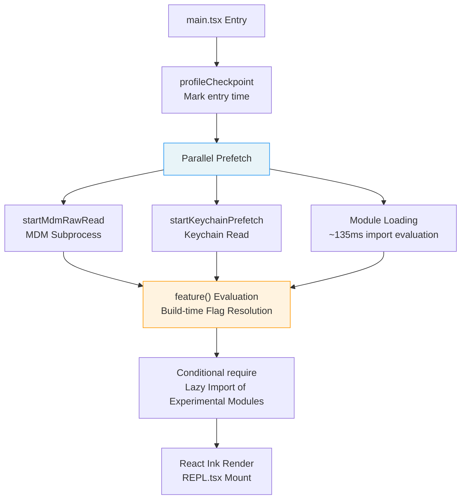
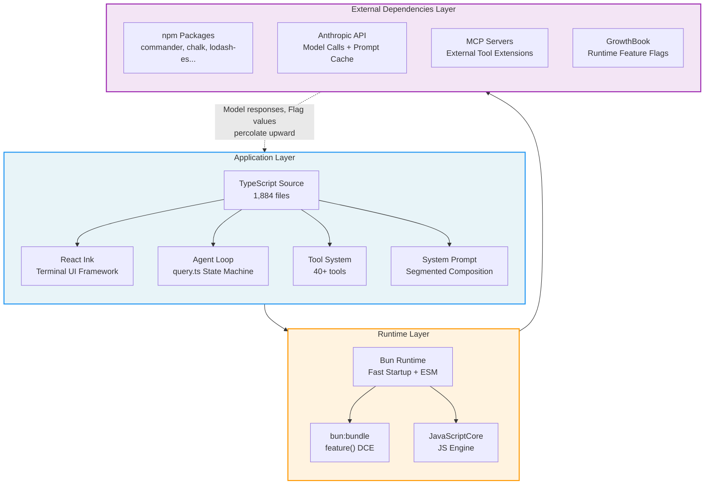

# Chapter 1: The Full Tech Stack of an AI Coding Agent

> **Positioning**: This chapter analyzes Claude Code's complete tech stack — Bun runtime, React Ink terminal UI, TypeScript type system — and how the Three-Layer Architecture is concretely implemented on top of these technology choices. Prerequisites: none, can be read independently. Target audience: readers encountering CC's architecture for the first time, or developers wanting to understand the Bun + React Ink + TypeScript technology selection.

## Why This Matters

To understand how an AI coding agent goes from "receiving user input" to "performing actions in your codebase," you first need to understand its technology stack. The tech stack doesn't just determine the performance ceiling — it determines the architectural boundaries: what can be done at compile time, what must be deferred to runtime, and what needs the model itself to decide.

Claude Code's tech stack choices reveal a core philosophy: **An AI coding agent is not a traditional CLI tool — it's a system running "on distribution," where the model doesn't just use tools but can write its own tools**. This means the entire tech stack must be designed with "the model as a first-class citizen" in mind, from entry-point startup optimizations to build-time Feature Flag elimination — every layer serves this goal.

This chapter establishes a core concept that runs throughout the entire book — the **Three-Layer Architecture** — and demonstrates through source code analysis how it's concretely implemented in Claude Code v2.1.88. If you're building your own AI Agent, the architectural model and startup optimization strategies in this chapter can be directly borrowed; if you just want to understand why Claude Code works the way it does, the Three-Layer Architecture is the most fundamental reference framework in the book.

---

## Source Code Analysis

### 1.1 Tech Stack Overview: TypeScript + React Ink + Bun

Claude Code's technology choices can be summarized in one sentence: **TypeScript for type safety, React Ink for componentized terminal UI capabilities, and Bun for startup speed and build-time optimizations**.

#### TypeScript: The Application-Layer Language

The entire codebase consists of 1,884 TypeScript source files. TypeScript's type system has a unique advantage in AI Agent development: tool input/output schemas can be generated directly from type definitions, and these schemas become the JSON Schema sent to the model — type definitions, runtime validation, and model instructions unified as one.

#### React Ink: The Terminal UI Framework

Claude Code's interactive interface is not a traditional readline REPL but a full React application. React Ink brings React's component model to the terminal, allowing complex UI state management (streaming output, parallel multi-tool display, permission dialogs) to be expressed declaratively. The main UI component is located in `restored-src/src/screens/REPL.tsx`, which is itself a React component exceeding 5,000 lines.

#### Bun: Runtime and Build Tool

Bun plays a dual role here:

1. **Runtime**: Faster startup speed than Node.js, critical for CLI tools — users expect an immediate response after typing `claude`
2. **Build tool**: Through the `feature()` function provided by `bun:bundle`, it enables build-time Dead Code Elimination (DCE), which is the cornerstone of the entire Feature Flag system

---

### 1.2 Entry Point Analysis: Startup Orchestration in `main.tsx`

`main.tsx` is the entry point for the entire application. Its first 20 lines of code demonstrate a carefully designed startup optimization strategy.

#### Parallel Prefetch

```typescript
// restored-src/src/main.tsx:9-20 (ESLint comments and blank lines omitted)
import { profileCheckpoint, profileReport } from './utils/startupProfiler.js';
profileCheckpoint('main_tsx_entry');

import { startMdmRawRead } from './utils/settings/mdm/rawRead.js';
startMdmRawRead();

import { ensureKeychainPrefetchCompleted, startKeychainPrefetch }
  from './utils/secureStorage/keychainPrefetch.js';
startKeychainPrefetch();
```

Note the code organization: each `import` is immediately followed by a side-effect call. The source comments (`restored-src/src/main.tsx:1-8`) explicitly explain the design intent:

1. **`profileCheckpoint`**: Marks the entry timestamp before any heavyweight module evaluation begins
2. **`startMdmRawRead`**: Spawns an MDM (Mobile Device Management) subprocess (`plutil` on macOS / `reg query` on Windows), allowing it to run in parallel with the subsequent ~135ms of import evaluation
3. **`startKeychainPrefetch`**: Launches two macOS Keychain read operations in parallel (OAuth tokens and legacy API keys) — without prefetching, `isRemoteManagedSettingsEligible()` would read them sequentially via synchronous spawn, adding ~65ms to each startup

These three operations follow the same pattern: **push I/O-intensive operations into the "dead time" during module loading to run in parallel**. This isn't an accidental optimization — the ESLint comment `// eslint-disable-next-line custom-rules/no-top-level-side-effects` indicates the team has a custom rule prohibiting top-level side effects; this is a deliberate exemption after careful consideration.

**Failure mode**: These prefetch operations are all "best effort." If Keychain access is denied (user hasn't authorized), `ensureKeychainPrefetchCompleted()` returns null and the app falls back to interactive credential prompting. If the MDM subprocess times out, subsequent `plutil` calls retry synchronously. This "optimistic parallel + pessimistic fallback" design ensures that prefetch failures never block startup.

#### Lazy Import

After parallel prefetch, `main.tsx` demonstrates a second startup optimization strategy — conditional lazy import:

```typescript
// restored-src/src/main.tsx:70-80 (helper functions and ESLint comments omitted)
const getTeammateUtils = () =>
  require('./utils/teammate.js') as typeof import('./utils/teammate.js');
// ...

const coordinatorModeModule = feature('COORDINATOR_MODE')
  ? require('./coordinator/coordinatorMode.js') as ...
  : null;

const assistantModule = feature('KAIROS')
  ? require('./assistant/index.js') as ...
  : null;
```

There are two different lazy loading strategies here:

- **Function-wrapped `require`** (like `getTeammateUtils`): Used to break circular dependencies (`teammate.ts -> AppState.tsx -> ... -> main.tsx`), resolving the module only when called
- **Feature Flag-guarded `require`** (like `coordinatorModeModule`): Uses Bun's `feature()` for build-time elimination — when `COORDINATOR_MODE` is `false`, the entire `require` expression and its imported module tree are removed from the build output

#### Startup Flow Overview



**Figure 1-1: main.tsx Startup Flow**

#### Feature Flags as Gates

Starting from line 21, the `feature('...')` function appears throughout the entry file:

```typescript
// restored-src/src/main.tsx:21
import { feature } from 'bun:bundle';
```

This `feature()` function from `bun:bundle` is key to understanding the entire Feature Flag system. It's not a runtime conditional — it's a **compile-time constant**. When Bun's bundler processes `feature('X')`, it replaces it with a `true` or `false` literal based on the build configuration, and the JavaScript engine's dead code elimination removes unreachable branches.

> **Note**: `bun:bundle`'s `feature()` is not a publicly documented Bun API but a custom conditional compilation mechanism in Anthropic's build pipeline. This means Claude Code's build is tightly coupled to a specific version of Bun.

---

### 1.3 Three-Layer Architecture

Claude Code's architecture can be divided into three layers, each with clearly defined responsibilities. This architectural model will be referenced repeatedly in subsequent chapters — Chapter 3's Agent Loop runs in the Application Layer, Chapter 4's tool execution orchestration spans the Application and Runtime Layers, and Chapters 13-15's caching optimizations involve collaboration across all three layers.



**Figure 1-2: Claude Code Three-Layer Architecture**

#### Application Layer (TypeScript)

The Application Layer is where all business logic resides. It contains:

- **Agent Loop** (`query.ts`): The core state machine orchestrating the "model call -> tool execution -> continuation decision" loop (see Chapter 3)
- **Tool System** (`tools.ts` + `tools/` directory): Registration, permission checking, and execution of 40+ tools (see Chapter 2)
- **System Prompt** (`constants/prompts.ts`): Segmented composition prompt architecture (see Chapter 5)
- **React Ink UI** (`screens/REPL.tsx`): Declarative rendering of the terminal interface

#### Runtime Layer (Bun/JSC)

The Runtime Layer provides three key capabilities:

1. **Fast startup**: Bun's startup speed is critical for CLI tool experience
2. **Build-time optimization**: `bun:bundle`'s `feature()` function enables compile-time Feature Flag elimination
3. **JavaScript engine**: Bun uses JavaScriptCore (JSC, Safari's JS engine) under the hood rather than V8

#### External Dependencies Layer

The External Dependencies Layer includes:

- **npm packages**: `commander` (CLI argument parsing), `chalk` (terminal coloring), `lodash-es` (utility functions), etc.
- **Anthropic API**: Server-side for model calls and Prompt Cache
- **MCP (Model Context Protocol) Servers**: External tool extension capabilities
- **GrowthBook**: Runtime A/B testing and Feature Flag service

### AppState: Cross-Layer State Management

The Three-Layer Architecture describes the static organization of code, but at runtime, the layers need a shared state container to coordinate behavior. Claude Code's solution is `AppState` — a Zustand-inspired immutable state store, defined in the `restored-src/src/state/` directory.

#### The Store's Minimal Implementation

The core of the state store is only 34 lines of code (`restored-src/src/state/store.ts:1-34`):

```typescript
// restored-src/src/state/store.ts:10-34
export function createStore<T>(
  initialState: T,
  onChange?: OnChange<T>,
): Store<T> {
  let state = initialState
  const listeners = new Set<Listener>()

  return {
    getState: () => state,
    setState: (updater: (prev: T) => T) => {
      const prev = state
      const next = updater(prev)
      if (Object.is(next, prev)) return   // Reference equality → skip notification
      state = next
      onChange?.({ newState: next, oldState: prev })
      for (const listener of listeners) listener()
    },
    subscribe: (listener: Listener) => {
      listeners.add(listener)
      return () => listeners.delete(listener)
    },
  }
}
```

This Store has three key design characteristics:

1. **Immutable updates**: `setState` accepts an `(prev) => next` updater function; callers must return a new object (rather than mutating in place), with `Object.is` determining whether a real change occurred
2. **Publish-subscribe**: The observer pattern is implemented via `subscribe` / `listeners`; any code (React or non-React) can subscribe to state changes
3. **Change callback**: The `onChange` hook is called on every state change; `onChangeAppState` (`restored-src/src/state/onChangeAppState.ts:43`) uses it to synchronize permission mode changes to CCR/SDK, clear credential caches, apply environment variables, and other side effects

#### React Side: useSyncExternalStore Integration

React components subscribe to state slices via the `useAppState` Hook (`restored-src/src/state/AppState.tsx:142-163`):

```typescript
// restored-src/src/state/AppState.tsx:142-163
export function useAppState(selector) {
  const store = useAppStore();
  const get = () => selector(store.getState());
  return useSyncExternalStore(store.subscribe, get, get);
}
```

`useSyncExternalStore` is a React 18 API designed specifically for safe integration of external stores with React's concurrent mode. Each component subscribes only to the slice it cares about — for example, `useAppState(s => s.verbose)` only triggers a re-render when the `verbose` field changes. REPL.tsx has over 20 `useAppState` calls (`restored-src/src/screens/REPL.tsx:618-639`), each precisely selecting a single state field, avoiding unnecessary UI refreshes.

#### Non-React Side: Direct Store Access

Outside the React component tree — CLI handlers, tool executors, Hook callbacks — code reads state via `store.getState()` directly and writes via `store.setState()`. For example:

- Reading the task list during request cancellation: `store.getState().tasks` (`restored-src/src/hooks/useCancelRequest.ts:173`)
- Reading the client list in MCP connection management: `store.getState().mcp.clients` (`restored-src/src/services/mcp/useManageMCPConnections.ts:1044`)
- Reading team context in inbox polling: `store.getState()` (`restored-src/src/hooks/useInboxPoller.ts:143`)

This dual-access pattern — React via subscription-based `useAppState`, non-React via imperative `getState()` — allows the same state store to simultaneously serve declarative UI rendering and imperative business logic.

#### The Scale of State

`AppState`'s type definition (`restored-src/src/state/AppStateStore.ts:89-452`) spans 360+ lines, containing 60+ top-level fields covering: settings snapshot (`settings`), permission context (`toolPermissionContext`), MCP connection state (`mcp`), plugin system (`plugins`), task registry (`tasks`), team collaboration context (`teamContext`), speculative execution (`speculation`), and more. Core fields are wrapped with `DeepImmutable<>` for compile-time immutability guarantees, but fields containing function types like `tasks`, `mcp`, and `plugins` are excluded.

This state store's design reflects a Claude Code architectural philosophy: **replace scattered module-level variables with a single global state store, making state flow and dependencies trackable**. When subsequent chapters mention "the Agent Loop reads the permission mode" or "the tool executor checks MCP connections," they are all accessing different slices of the same `AppState` instance.

---

#### The Significance of Layer Boundaries

The key to the Three-Layer Architecture lies in the **direction of information flow between layers**:

- Application Layer -> Runtime Layer: TypeScript code compiles to JavaScript; `feature()` calls are resolved at this point
- Runtime Layer -> External Dependencies Layer: HTTP requests, npm package loading, MCP connections
- External Dependencies Layer -> Application Layer: Model responses, tool results, Feature Flag values — this information **percolates upward** through both layers back to the Application Layer

Understanding this percolation path is important: when GrowthBook returns a new value for a `tengu_*` Feature Flag, it doesn't affect the build-time `feature()` function (those are already baked in at build time) but rather the runtime conditional logic. Claude Code has **two parallel Feature Flag mechanisms**: build-time `feature()` and runtime GrowthBook, serving different purposes (discussed in detail later).

---

### 1.4 Why "On Distribution" Matters

"On distribution" is a key concept for understanding Claude Code's architectural decisions and one of the core arguments of this book. Traditional CLI tools define all their functionality **at development time** and then distribute to users. But AI coding agents are different — their behavior is dynamically determined by the model **at usage time**.

Specifically:

1. **The model selects tools**: In each iteration of the Agent Loop, the model decides which tool to call and what parameters to pass. A tool's `description` and `inputSchema` are not just documentation — they are instructions sent to the model
2. **The model writes its own tools**: Through `BashTool`, the model can execute arbitrary shell commands; through `FileWriteTool`, the model can create new files; through `SkillTool`, the model can load and execute user-defined prompt templates
3. **The model acts on its own context**: Through Compaction, Microcompact, and Context Collapse, the model participates in managing its own context window

This means the tech stack must consider a dimension that traditional software doesn't: **the model is part of the runtime, and its behavior is not entirely controlled by code but is shaped collectively by prompts, tool descriptions, and context**.

#### Deep Impact on Architecture

"On distribution" is not just an abstract concept — it directly shapes several of Claude Code's core architectural decisions:

**The fundamental difficulty of testing and verification.** Traditional software can cover all code paths through unit and integration tests. But when the model participates in decisions, the same input might produce different tool call sequences. Claude Code's approach is not to try covering all possible model behaviors but rather: (a) through fail-closed defaults (see Chapter 2) ensure any tool call is safe, (b) through the permission system (see Chapter 16) set human checkpoints before dangerous operations, (c) through A/B testing (see Chapter 7) validate behavior changes in real usage.

**Tool descriptions as API contracts.** In traditional software, API documentation is for human developers; in AI Agents, tool descriptions are instructions for the model. This means a tool's `description` field can't just describe "what this tool does" — it must also guide "when the model should use this tool." Chapter 8 will analyze in depth how tool prompts serve as "micro-harnesses."

**Feature Flags control the model's cognitive boundaries.** When `feature('WEB_BROWSER_TOOL')` is `false`, the model not only can't use the browser tool — it doesn't even know the browser tool exists, because the tool schema doesn't include it:

```typescript
// restored-src/src/tools.ts:117-119
const WebBrowserTool = feature('WEB_BROWSER_TOOL')
  ? require('./tools/WebBrowserTool/WebBrowserTool.js').WebBrowserTool
  : null;
```

This is the most direct manifestation of "on distribution": build-time decisions directly affect the model's runtime capability boundaries.

#### Comparison with Traditional Software

| Dimension | Traditional CLI Tool | AI Coding Agent |
|-----------|---------------------|-----------------|
| Behavioral determinism | Deterministic — same input produces same output | Non-deterministic — model may choose different tool sequences |
| Capability boundaries | Fixed at compile time | Determined dually by build-time (`feature()`) + runtime (model decisions) |
| API documentation audience | Human developers | The model — docs are instructions, not references |
| Testing strategy | Cover code paths | Cover safety boundaries (permissions + fail-closed) |
| Version control | Code version = behavior version | Code version x Model version x Prompt version |

---

### 1.5 Build-Time Dead Code Elimination: How `feature()` Works

The `feature()` function comes from Bun's bundler module `bun:bundle` and is extensively used in Claude Code to implement build-time conditional compilation.

#### Mechanism

When Bun's bundler encounters a `feature('X')` call:

1. It looks up the value of `X` in the build configuration
2. It replaces `feature('X')` with a literal `true` or `false`
3. The JavaScript engine's optimizer identifies unreachable branches and removes them

This means the following code:

```typescript
const SleepTool = feature('PROACTIVE') || feature('KAIROS')
  ? require('./tools/SleepTool/SleepTool.js').SleepTool
  : null;
```

In a build with `PROACTIVE=false, KAIROS=false` becomes:

```typescript
const SleepTool = false || false
  ? require('./tools/SleepTool/SleepTool.js').SleepTool
  : null;
```

Which is then optimized to `const SleepTool = null;`, and `SleepTool.js` along with its entire dependency tree won't appear in the final bundle.

#### Usage Patterns

In `tools.ts`, `feature()` usage follows four patterns: single Flag guard, multi-Flag OR combination, multi-Flag AND combination, and array spread. These patterns also appear in `commands.ts` (`restored-src/src/commands.ts:59-100`), controlling the availability of slash commands. The complete analysis of the tool registration pipeline is covered in Chapter 2.

#### Distinction from Runtime Flags

Claude Code has two Feature Flag mechanisms that are easy to confuse:

| Dimension | Build-time `feature()` | Runtime GrowthBook `tengu_*` |
|-----------|----------------------|------------------------------|
| Resolution timing | During Bun bundling | Fetched from GrowthBook at session startup |
| Scope of impact | Whether code exists in the bundle | Runtime branches of code logic |
| Modification method | Requires rebuild and release | Server-side configuration takes effect immediately |
| Typical use case | Complete module tree elimination for experimental features | A/B testing, progressive rollout |
| Example | `feature('KAIROS')` | `tengu_ultrathink_enabled` |

The two are complementary: `feature()` is for "does this feature exist," while GrowthBook is for "which users get this feature." A feature typically has its module loading guarded by `feature()` first, then its runtime behavior controlled by GrowthBook.

---

### 1.6 Tool Registration Pipeline: Feature Flags in Practice

The `getAllBaseTools()` function in `tools.ts` (`restored-src/src/tools.ts:193-251`) is the most concentrated showcase of the Feature Flag system. It demonstrates four different tool registration strategies:

#### Strategy 1: Unconditional Registration

```typescript
// restored-src/src/tools.ts:195-209 (only listing some core tools)
AgentTool,
TaskOutputTool,
BashTool,
// ... GlobTool/GrepTool (conditional, see Strategy 4)
FileReadTool,
FileEditTool,
FileWriteTool,
NotebookEditTool,
WebFetchTool,
WebSearchTool,
// ...
```

These are core tools (about a dozen), always available with no conditions.

#### Strategy 2: Build-time Feature Flag Guard

```typescript
// restored-src/src/tools.ts:217
...(WebBrowserTool ? [WebBrowserTool] : []),
```

`WebBrowserTool` is guarded at the top of the file via `feature('WEB_BROWSER_TOOL')` — if the Flag is false, the variable is `null`, and this spreads to an empty array. **The tool's entire code doesn't exist in the build output**.

#### Strategy 3: Runtime Environment Variable Guard

```typescript
// restored-src/src/tools.ts:214-215
...(process.env.USER_TYPE === 'ant' ? [ConfigTool] : []),
...(process.env.USER_TYPE === 'ant' ? [TungstenTool] : []),
```

`ConfigTool` and `TungstenTool` are controlled by the runtime environment variable `USER_TYPE` — their code exists in the build output but is only visible to Anthropic internal users (`ant`). This is a "staging area" pattern for A/B testing: validate internally before opening to external users.

#### Strategy 4: Runtime Function Guard

```typescript
// restored-src/src/tools.ts:201
...(hasEmbeddedSearchTools() ? [] : [GlobTool, GrepTool]),
```

This is a reverse guard: when Bun's single-file executable has search tools embedded (`bfs`/`ugrep`), the standalone `GlobTool` and `GrepTool` are actually removed — because the model can access these embedded tools through `BashTool`. This strategy ensures equivalent search capabilities across different build versions, just with different underlying implementations.

---

### 1.7 The Full Landscape of 89 Feature Flags

By extracting all `feature('...')` calls from the source code, we identified 89 build-time Feature Flags. The complete list and categorization can be found in Appendix D. Here we focus on what these Flags reveal about product direction:

**The KAIROS family** (6 Flags, 84+ combined references): This is the largest Flag cluster, pointing to a complete "assistant mode" product — autonomous background operation (`KAIROS`), memory curation (`KAIROS_DREAM`), push notifications (`KAIROS_PUSH_NOTIFICATION`), GitHub Webhook integration (`KAIROS_GITHUB_WEBHOOKS`). This isn't an enhancement of a CLI tool — it's an entirely different product form.

**Multi-Agent orchestration** (`COORDINATOR_MODE` + `TEAMMEM` + `UDS_INBOX`, 90+ combined references): Infrastructure for multi-Agent collaboration — Worker allocation, teammate memory sharing, Unix Domain Socket inter-process communication (see Chapter 20).

**Remote and distributed** (`BRIDGE_MODE` + `DAEMON` + `CCR_*`): Remote control and distributed execution — extending Claude Code from a local CLI to a remotely controllable Agent platform.

**Context optimization** (`CONTEXT_COLLAPSE` + `CACHED_MICROCOMPACT` + `REACTIVE_COMPACT`): Three different granularities of context management strategies, reflecting the team's ongoing exploration within the 200K token window (see Part 3).

**Classifier system** (`TRANSCRIPT_CLASSIFIER` 69 references + `BASH_CLASSIFIER` 33 references): The two major classifiers are the core of auto mode — the former determines permissions, the latter analyzes command safety (see Chapter 17).

The sheer number of 89 Flags tells a story: Claude Code is not a stable finished product but a rapidly iterating experimentation platform. Each Flag represents a direction being explored, and their existence is a direct manifestation of the "on distribution" philosophy — the team is continuously experimenting with what the model can do and should do.

---

## Pattern Extraction

### Pattern 1: Parallel Prefetch at Startup

- **Problem solved**: CLI tool startup time directly affects user experience; I/O operations (Keychain reads, MDM queries) block startup
- **Core approach**: Push I/O-intensive operations into the "dead time" during module loading to run in parallel; use `ensureXxxCompleted()` to await results when needed
- **Prerequisites**: I/O operations must be idempotent, fail-safe, and have clear timeouts and fallback paths
- **Source reference**: `restored-src/src/main.tsx:9-20`

### Pattern 2: Dual-Layer Feature Flags

- **Problem solved**: Experimental features need control at different granularities — "does the feature exist in the code" and "which users get the feature" are two independent dimensions
- **Core approach**: Build-time `feature()` eliminates entire module trees; runtime GrowthBook controls behavior parameters. The former determines which tools the model can "see"; the latter determines the model's behavior configuration
- **Prerequisites**: Build tools support compile-time constant replacement and DCE; a runtime Flag service (e.g., GrowthBook, LaunchDarkly) is available
- **Source reference**: `restored-src/src/main.tsx:21` (feature import), `restored-src/src/tools.ts:117-119` (tool gating)

### Pattern 3: Model-Aware API Design

- **Problem solved**: AI Agent architecture must be designed not only for human developers but also for the model — tool descriptions are the model's instructions, not just documentation
- **Core approach**: A tool's `description` and `inputSchema` simultaneously serve three purposes: human documentation, runtime validation, and model instructions. Type definitions -> Schema -> Model instructions are unified as one
- **Prerequisites**: A type system that supports Schema generation (e.g., TypeScript + Zod)
- **Source reference**: `restored-src/src/Tool.ts` (tool interface definition, see Chapter 2)

### Pattern 4: Fail-Closed Defaults

- **Problem solved**: New tools may introduce security or concurrency risks; defaults determine the behavior when "someone forgets to configure"
- **Core approach**: All tool properties default to the safest values (`isConcurrencySafe: false`, `isReadOnly: false`); explicit declaration is required to unlock
- **Prerequisites**: Clear definitions of "safe" and "unsafe," with defaults managed in a central location
- **Source reference**: `restored-src/src/Tool.ts:748-761` (`TOOL_DEFAULTS`, see Chapter 2 and Chapter 25)

---

## What You Can Do

If you're building your own AI Agent system, here are actionable suggestions you can directly apply from this chapter's analysis:

1. **Optimize startup time.** Identify I/O blocking points in your Agent's startup path (credential reads, configuration loading, model warm-up) and parallelize them. The user-perceived "time to first response" directly affects their judgment of tool quality
2. **Distinguish between build-time and runtime Flags.** If you have experimental features, consider using build-time elimination to control "whether the feature exists" (affecting which tools the model can see), and runtime Flags to control "who gets the feature" (A/B testing, progressive rollout)
3. **Design model-friendly tool descriptions.** Your tool descriptions aren't just for humans — they're the basis for the model's tool selection. Test different description wording and observe whether the model's tool selection behavior changes
4. **Audit your defaults.** Check the default value of every configuration item in your tool system — if a new tool's developer forgets to set a property, the system's behavior should be the safest, not the most permissive
5. **Use the Three-Layer Architecture as a diagnostic framework.** When Agent behavior is abnormal, use the three-layer model to locate the problem: Is it application-layer logic (prompt/tool description)? Runtime-layer configuration (Feature Flag state)? Or external-dependency-layer response (API return/MCP server status)?

In the next chapter, we'll dive deep into the tool system — the model's "hands" — and see how 40+ tools form an extensible capability system through a unified interface contract, permission model, and Feature Flag guards.

---

### Version Evolution Notes

> The core analysis in this chapter is based on v2.1.88 source code. As of v2.1.92, there are no major structural changes to the tech stack and startup flow covered in this chapter. For specific signal changes, see [Appendix E](../appendix/e-version-evolution.md).
