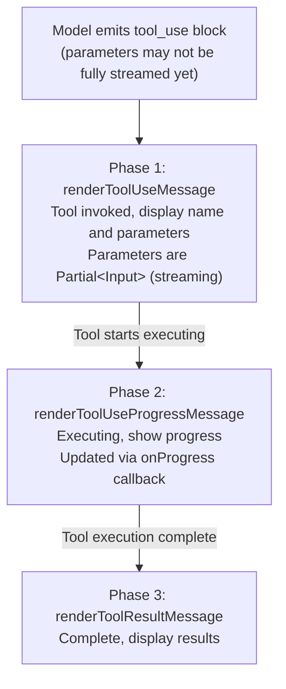

# Chapter 2: Tool System — 40+ Tools as the Model's Hands

## Why the Tool System Is the Core of Claude Code

Large language models "think" in the text domain, while software engineering operations happen in the file system, terminal, and network. **The tool system** is the bridge connecting these two worlds: it translates the model's intent into real side effects, then translates the side effects' results back into text the model can consume.

Claude Code's tool system manages 40+ built-in tools and an unlimited number of MCP extension tools. These tools are not a flat array — they pass through a precise pipeline: **Definition -> Registration -> Filtering -> Invocation -> Rendering**. Each step has a clear contract. This chapter starts from the `Tool.ts` interface definition and dissects each layer of this pipeline's design decisions.

---

## 2.1 The `Tool` Interface Contract

All tools — whether the built-in `BashTool` or third-party tools loaded via the MCP protocol — must satisfy the same TypeScript interface. This interface is defined in `restored-src/src/Tool.ts:362-695` and is the cornerstone of the entire tool system.

### Core Fields Overview

| Field | Type | Responsibility | Required |
|-------|------|---------------|----------|
| `name` | `readonly string` | Unique identifier for the tool, used for permission matching, analytics, and API transport | Yes |
| `description` | `(input, options) => Promise<string>` | Returns the tool description text sent to the model; can dynamically adjust based on permission context | Yes |
| `prompt` | `(options) => Promise<string>` | Returns the tool's system prompt, see Chapter 8 | Yes |
| `inputSchema` | `z.ZodType` (Zod v4) | Defines the tool's parameter structure using Zod schema, automatically converted to JSON Schema for the API | Yes |
| `call` | `(args, context, canUseTool, parentMessage, onProgress?) => Promise<ToolResult>` | The tool's core execution logic | Yes |
| `checkPermissions` | `(input, context) => Promise<PermissionResult>` | Tool-level permission check, executed after the general permission system | Yes* |
| `validateInput` | `(input, context) => Promise<ValidationResult>` | Validates input legality before permission checking | No |
| `maxResultSizeChars` | `number` | Character limit for a single tool result; exceeding this persists to disk | Yes |
| `isConcurrencySafe` | `(input) => boolean` | Whether it can execute concurrently with other tools | Yes* |
| `isReadOnly` | `(input) => boolean` | Whether it's a read-only operation (doesn't modify the file system) | Yes* |
| `isEnabled` | `() => boolean` | Whether the tool is available in the current environment | Yes* |

> Fields marked * have default values provided by `buildTool()` and can be omitted in tool definitions.

Several design choices worth examining in depth:

**`description` is a function, not a string.** The same tool may need different descriptions under different permission modes. For example, when a user configures an `alwaysDeny` rule prohibiting certain subcommands, the tool description can proactively inform the model "don't attempt these operations," avoiding useless tool calls at the prompt level.

**`inputSchema` uses Zod v4.** This allows strict runtime validation of tool parameters while automatically generating JSON Schema for the Anthropic API via `z.toJSONSchema()`. Zod's `z.strictObject()` ensures the model doesn't pass undefined parameters.

**`call` receives a `canUseTool` callback.** This is an extremely important design — a tool may need to recursively check permissions for sub-operations during execution. For example, `AgentTool` needs to check whether a sub-Agent has permission to use specific tools when spawning it. Permission checking is not a one-time gate but a continuous verification throughout the execution process.

### Rendering Contract: Three Method Groups

The `Tool` interface defines a set of rendering methods that constitute the tool's complete lifecycle representation in the terminal UI (see Section 2.5):

```
renderToolUseMessage          // Displayed when the tool is invoked
renderToolUseProgressMessage  // Displays progress during execution
renderToolResultMessage       // Displays results after execution completes
```

There are also optional methods like `renderToolUseErrorMessage`, `renderToolUseRejectedMessage` (permission denied), and `renderGroupedToolUse` (grouped display of parallel tools).

---

## 2.2 The `buildTool()` Factory Function and Fail-Closed Defaults

Every concrete tool is not directly exported as an object satisfying the `Tool` interface but is constructed through the `buildTool()` factory function. This function is defined in `restored-src/src/Tool.ts:783-792`:

```typescript
export function buildTool<D extends AnyToolDef>(def: D): BuiltTool<D> {
  return {
    ...TOOL_DEFAULTS,
    userFacingName: () => def.name,
    ...def,
  } as BuiltTool<D>
}
```

The runtime behavior is minimal — just an object spread. But its type-level design (`BuiltTool<D>` type) precisely models the semantics of `{ ...TOOL_DEFAULTS, ...def }`: if the tool definition provides a method, use the tool definition's version; otherwise use the default.

### Defaults and the "Fail-Closed" Philosophy

`TOOL_DEFAULTS` (`restored-src/src/Tool.ts:757-769`) is designed following a safety principle — **assume the most dangerous scenario when uncertain**:

| Default Method | Default Value | Design Intent |
|---------------|---------------|---------------|
| `isEnabled` | `() => true` | Tools are available by default unless explicitly disabled |
| `isConcurrencySafe` | `() => false` | **Fail-closed**: Assume unsafe, prohibit concurrency |
| `isReadOnly` | `() => false` | **Fail-closed**: Assume it writes, require permissions |
| `isDestructive` | `() => false` | Non-destructive by default |
| `checkPermissions` | Returns `{ behavior: 'allow' }` | Delegate to the general permission system |
| `toAutoClassifierInput` | `() => ''` | Doesn't participate in automatic safety classification by default |
| `userFacingName` | `() => def.name` | Uses the tool name |

The two most important defaults are `isConcurrencySafe: false` and `isReadOnly: false`. This means: if a new tool forgets to declare these properties, the system automatically treats it as "may modify the file system and cannot execute concurrently" — the most conservative, safest assumption. Only when a tool developer actively declares `isConcurrencySafe() { return true }` and `isReadOnly() { return true }` does the system relax restrictions.

### How Actual Tools Use `buildTool`

Taking `GrepTool` as an example (`restored-src/src/tools/GrepTool/GrepTool.ts:160-194`):

```typescript
export const GrepTool = buildTool({
  name: GREP_TOOL_NAME,
  searchHint: 'search file contents with regex (ripgrep)',
  maxResultSizeChars: 20_000,
  strict: true,
  // ...
  isConcurrencySafe() { return true },   // Search is a safe concurrent operation
  isReadOnly() { return true },           // Search doesn't modify files
  // ...
})
```

`GrepTool` explicitly overrides two defaults because search operations are inherently read-only and concurrency-safe. In contrast, `BashTool` (`restored-src/src/tools/BashTool/BashTool.tsx:434-441`) has conditional concurrency safety:

```typescript
isConcurrencySafe(input) {
  return this.isReadOnly?.(input) ?? false;
},
isReadOnly(input) {
  const compoundCommandHasCd = commandHasAnyCd(input.command);
  const result = checkReadOnlyConstraints(input, compoundCommandHasCd);
  return result.behavior === 'allow';
},
```

`BashTool` only allows concurrency when the command is determined to be read-only — a `git status` can execute concurrently, but `git push` cannot. This **input-aware concurrency control** is why `buildTool`'s method signatures accept an `input` parameter.

---

## 2.3 Tool Registration Pipeline: `tools.ts`

`restored-src/src/tools.ts` is the assembly center for the Tool Pool. It answers a core question: **In the current environment, which tools can the model use?**

### Three-Level Filtering

Tools go through three levels of filtering from definition to final availability:

**Level 1: Compile-time/startup-time conditional loading.** Many tools are conditionally loaded via Feature Flags (`restored-src/src/tools.ts:16-135`):

```typescript
const SleepTool =
  feature('PROACTIVE') || feature('KAIROS')
    ? require('./tools/SleepTool/SleepTool.js').SleepTool
    : null

const cronTools = feature('AGENT_TRIGGERS')
  ? [
      require('./tools/ScheduleCronTool/CronCreateTool.js').CronCreateTool,
      require('./tools/ScheduleCronTool/CronDeleteTool.js').CronDeleteTool,
      require('./tools/ScheduleCronTool/CronListTool.js').CronListTool,
    ]
  : []
```

The `feature()` function comes from `bun:bundle` and is evaluated at bundle time. This means disabled tools **don't appear in the final JavaScript bundle at all** — a more thorough form of dead code elimination than runtime `if` statements.

Besides Feature Flags, there's also environment variable-driven conditional loading:

```typescript
const REPLTool =
  process.env.USER_TYPE === 'ant'
    ? require('./tools/REPLTool/REPLTool.js').REPLTool
    : null
```

`USER_TYPE === 'ant'` marks special tools for Anthropic internal employees (like `REPLTool`, `ConfigTool`, `TungstenTool`), which are unavailable in the public version.

**Level 2: `getAllBaseTools()` assembles the base tool pool.** This function (`restored-src/src/tools.ts:193-251`) collects all tools that passed Level 1 filtering into an array. It's the system's "tool registry" — all potentially existing tools are registered here. The current version contains about 40+ built-in tools, dynamically adjusted based on which Feature Flags are enabled.

```typescript
export function getAllBaseTools(): Tools {
  return [
    AgentTool,
    TaskOutputTool,
    BashTool,
    ...(hasEmbeddedSearchTools() ? [] : [GlobTool, GrepTool]),
    FileReadTool,
    FileEditTool,
    FileWriteTool,
    // ... 30+ more tools omitted
    ...(isToolSearchEnabledOptimistic() ? [ToolSearchTool] : []),
  ]
}
```

Note an interesting condition: `hasEmbeddedSearchTools()`. In Anthropic's internal builds, `bfs` (fast find) and `ugrep` are embedded in the Bun binary, at which point `find` and `grep` in the shell are already aliased to these fast tools, making standalone `GlobTool` and `GrepTool` redundant.

**Level 3: `getTools()` runtime filtering.** This is the final filtering layer (`restored-src/src/tools.ts:271-327`), performing three operations:

1. **Permission denial filtering**: `filterToolsByDenyRules()` removes tools covered by `alwaysDeny` rules. If a user configures `"Bash": "deny"`, `BashTool` won't appear in the tool list sent to the model at all.
2. **REPL mode hiding**: When REPL mode is enabled, `Bash`, `Read`, `Edit`, and other basic tools are hidden — they're indirectly exposed through `REPLTool`'s VM context.
3. **`isEnabled()` final check**: Each tool's `isEnabled()` method is the last switch.

### Simple Mode vs. Full Mode

`getTools()` also supports a "simple mode" (`CLAUDE_CODE_SIMPLE`), exposing only `Bash`, `FileRead`, and `FileEdit` — three core tools. This is useful in some integration scenarios — reducing the number of tools lowers token consumption and reduces the model's decision burden.

### MCP Tool Integration

The final tool pool is assembled by `assembleToolPool()` (`restored-src/src/tools.ts:345-367`):

```typescript
export function assembleToolPool(
  permissionContext: ToolPermissionContext,
  mcpTools: Tools,
): Tools {
  const builtInTools = getTools(permissionContext)
  const allowedMcpTools = filterToolsByDenyRules(mcpTools, permissionContext)
  const byName = (a: Tool, b: Tool) => a.name.localeCompare(b.name)
  return uniqBy(
    [...builtInTools].sort(byName).concat(allowedMcpTools.sort(byName)),
    'name',
  )
}
```

Two key designs here:

1. **Built-in tools take priority**: `uniqBy` retains the first occurrence of each name; built-in tools are listed first, so they win in name conflicts.
2. **Sorting by name for stable prompt caching**: Built-in tools and MCP tools are each sorted and then concatenated (rather than interleaved), ensuring built-in tools appear as a "contiguous prefix." This works with the API server-side's cache breakpoint design — if MCP tools were interspersed among built-in tools, any addition or removal of an MCP tool would invalidate all downstream cache keys. See Chapter 13.

---

## 2.4 Tool Result Size Budget

When a tool returns a result, the system faces a core tension: the model needs to see complete information to make correct decisions, but the context window is limited. Claude Code solves this through a **two-level budget**.

### Level 1: Per-Tool Result Limit `maxResultSizeChars`

Each tool declares its own result size limit via the `maxResultSizeChars` field. Results exceeding this limit are persisted to disk, and the model only sees a preview plus the disk file path.

Here's a comparison of `maxResultSizeChars` across different tools:

| Tool | `maxResultSizeChars` | Notes |
|------|---------------------|-------|
| `McpAuthTool` | 10,000 | Auth results, small data volume |
| `GrepTool` | 20,000 | Search results need to be concise |
| `BashTool` | 30,000 | Shell output can be lengthy |
| `GlobTool` | 100,000 | File lists can be numerous |
| `AgentTool` | 100,000 | Sub-Agent results |
| `WebSearchTool` | 100,000 | Web search results |
| `BriefTool` | 100,000 | Brief summaries |
| `FileReadTool` | **Infinity** | Never persisted (see below) |

`FileReadTool`'s `maxResultSizeChars: Infinity` is a special design — avoiding the circular reference of Read -> persist to file -> Read. The system also has a global ceiling `DEFAULT_MAX_RESULT_SIZE_CHARS = 50,000` (`restored-src/src/constants/toolLimits.ts:13`), which serves as a hard cap regardless of what a tool declares.

### Level 2: Per-Message Aggregate Limit

When the model calls multiple tools in parallel within a single turn, all tool results are sent as multiple `tool_result` blocks within the same user message. `MAX_TOOL_RESULTS_PER_MESSAGE_CHARS = 200,000` (`restored-src/src/constants/toolLimits.ts:49`) limits the total size of tool results in a single message, preventing N parallel tools from collectively overwhelming the context window.

The FileReadTool Infinity design rationale, per-message budget persistence implementation details (including `ContentReplacementState` decision persistence and the Infinity exemption mechanism) are covered in Chapter 4.

### Size Budget Parameters Summary

| Constant | Value | Definition Location |
|----------|-------|-------------------|
| `DEFAULT_MAX_RESULT_SIZE_CHARS` | 50,000 chars | `constants/toolLimits.ts:13` |
| `MAX_TOOL_RESULT_TOKENS` | 100,000 tokens | `constants/toolLimits.ts:22` |
| `MAX_TOOL_RESULT_BYTES` | 400,000 bytes | `constants/toolLimits.ts:33` (= 100K tokens x 4 bytes/token) |
| `MAX_TOOL_RESULTS_PER_MESSAGE_CHARS` | 200,000 chars | `constants/toolLimits.ts:49` |
| `TOOL_SUMMARY_MAX_LENGTH` | 50 chars | `constants/toolLimits.ts:57` |

---

## 2.5 Three-Phase Rendering Flow

A tool's presentation in the terminal UI is not a one-time event but a three-phase progressive process. These three phases correspond one-to-one with the tool execution lifecycle.

### Flow Diagram



### Phase 1: `renderToolUseMessage` — Intent Display

When the model outputs a `tool_use` block, this method is called immediately. Note the key type in its signature:

```typescript
renderToolUseMessage(
  input: Partial<z.infer<Input>>,  // Note: Partial!
  options: { theme: ThemeName; verbose: boolean; commands?: Command[] },
): React.ReactNode
```

`input` is `Partial` because: the API returns tool parameter JSON in a streaming fashion, and before JSON parsing is complete, only some fields are available. The UI must be able to render even when parameters are incomplete — users shouldn't see a blank screen.

Taking `BashTool` as an example, even if the `command` field hasn't been fully received, the UI can already display the "Bash" label and the partial command text received so far.

### Phase 2: `renderToolUseProgressMessage` — Process Visibility

This is an **optional** method. For long-running tools (like `BashTool`, `AgentTool`), progress feedback is crucial. `BashTool` starts showing progress after a shell command has been executing for more than 2 seconds (`PROGRESS_THRESHOLD_MS = 2000`, `restored-src/src/tools/BashTool/BashTool.tsx:55`).

Progress is delivered via the `onProgress` callback. Each tool's progress data structure is different — `BashTool`'s `BashProgress` contains stdout/stderr fragments, while `AgentTool`'s `AgentToolProgress` contains the sub-Agent's message stream. These types are uniformly defined in `restored-src/src/types/tools.ts`, constrained through the `ToolProgressData` union type.

### Phase 3: `renderToolResultMessage` — Result Presentation

This is also an **optional** method — when omitted, tool results are not rendered in the terminal (for example, `TodoWriteTool`'s results are shown through a dedicated panel, not in the conversation flow).

`renderToolResultMessage` accepts a `style?: 'condensed'` option. In non-verbose mode, search-type tools (`GrepTool`, `GlobTool`) display concise summaries (like "Found 42 files across 3 directories"), while in verbose mode they show full results. Tools can use `isResultTruncated(output)` to tell the UI whether the current result is truncated, enabling "click to expand" interaction in fullscreen mode.

### Grouped Rendering: `renderGroupedToolUse`

When the model calls multiple tools of the same type in parallel within a single turn (e.g., 5 `Grep` searches), rendering each individually would consume significant screen space. The `renderGroupedToolUse` method allows tools to merge multiple parallel calls into a compact grouped view — for example, "Searched 5 patterns, found 127 results across 34 files."

This method only takes effect in **non-verbose mode**. In verbose mode, each tool call is still rendered independently at its original position, ensuring no information is lost during debugging.

---

## 2.6 Design Patterns from Specific Tools

### BashTool: The Most Complex Tool

`BashTool` (`restored-src/src/tools/BashTool/BashTool.tsx`) is the most complex single tool in the entire tool system, because the semantic space of shell commands is infinite. It needs to:

- **Parse command structure** to determine if it's read-only (via `checkReadOnlyConstraints` and `parseForSecurity`)
- **Understand pipes and compound commands** (`ls && echo "---" && ls` is still read-only)
- **Conditional concurrency**: Only read-only commands can execute concurrently
- **Progress tracking**: Commands running longer than 2 seconds display streaming stdout output
- **File change tracking**: Record file modifications caused by shell commands via `fileHistoryTrackEdit` and `trackGitOperations`
- **Sandbox execution**: Execute in isolation via `SandboxManager` under certain conditions

`BashTool`'s `maxResultSizeChars` is set to 30,000 — more generous than `GrepTool`'s 20,000, because shell output typically contains more structured information (compilation errors, test results, etc.) and the model needs to see enough context to make correct decisions.

### GrepTool: The Exemplar of Concurrency Safety

`GrepTool`'s design is relatively clean. It unconditionally declares `isConcurrencySafe: true` and `isReadOnly: true`, because search operations never modify the file system. Its `maxResultSizeChars` is set to 20,000 — search results exceeding this length suggest the model's search scope is too broad, and persisting to disk with a preview actually helps the model adjust its strategy.

### FileReadTool: The Philosophy of `Infinity`

`FileReadTool` sets `maxResultSizeChars` to `Infinity`, choosing instead to control output size through its own `maxTokens` and `maxSizeBytes` limits. This avoids the circular read problem mentioned earlier and means `FileReadTool`'s results are never replaced with disk references — the model always sees file content directly.

---

## 2.7 Deferred Loading and ToolSearch

When the number of tools exceeds a certain threshold (especially after many MCP tools are connected), sending all tools' complete schemas to the model consumes substantial tokens. Claude Code solves this through a **Deferred Loading** mechanism.

Tools marked with `shouldDefer: true` only send the tool name in the initial prompt (`defer_loading: true`), not the full parameter schema. The model must first call `ToolSearchTool` to search by keyword and retrieve the tool's full definition before it can call these deferred tools.

Each tool's `searchHint` field is designed for this purpose — it provides a 3-10 word capability description to help `ToolSearchTool` perform keyword matching. For example, `GrepTool`'s `searchHint` is `'search file contents with regex (ripgrep)'`.

Tools marked with `alwaysLoad: true` are never deferred — their full schema always appears in the initial prompt. This is for core tools that the model must be able to call directly in the first conversation turn.

---

## 2.8 Pattern Extraction

From Claude Code's tool system design, several patterns of universal value for AI Agent builders can be extracted:

**Pattern 1: Fail-closed defaults.** `buildTool()`'s defaults assume the most dangerous scenario (not concurrency-safe, not read-only), requiring tool developers to actively declare safe properties. This flips safety from "opt-in" to "opt-out," significantly reducing risk from omissions.

**Pattern 2: Layered budget control.** Single tool results have a cap, and single messages also have an aggregate cap. The two levels complement each other — per-tool limits prevent single-point runaway, and message limits prevent collective explosion from parallel calls.

**Pattern 3: Input-aware properties.** `isConcurrencySafe(input)` and `isReadOnly(input)` receive the tool input rather than making global judgments. The same `BashTool` has completely different safety properties for `ls` versus `rm`. This fine-grained input awareness is the foundation for precise permission control. See Chapter 4.

**Pattern 4: Progressive rendering.** Three-phase rendering (intent -> progress -> result) gives users visibility at every stage of tool execution. The `Partial<Input>` design ensures the UI isn't blank even during parameter streaming. This is critical for user trust — users need to know what the Agent is doing, rather than staring at a spinning loading icon.

**Pattern 5: Compile-time elimination vs. runtime filtering.** Feature Flags use `bun:bundle`'s `feature()` to eliminate disabled tool code at compile time, while permission rules filter the tool list at runtime. The two mechanisms serve different purposes: the former reduces bundle size and attack surface, the latter supports user-level configuration.

---

## What You Can Do

Based on Claude Code's tool system design experience, here are actions you can take when building your own AI Agent tool system:

- **Adopt "fail-closed" defaults.** In your tool registration framework, set the default values of safety properties like `isConcurrencySafe` and `isReadOnly` to the most conservative options. Have tool developers actively declare safety properties rather than assuming safety by default.
- **Set result size limits for every tool.** Don't let tools return infinitely large results. Set per-tool limits (like `maxResultSizeChars`) and per-message aggregate limits; when exceeded, persist to disk and return a preview.
- **Make tool descriptions functions, not static strings.** If your tools have different behavior restrictions under different permission modes or contexts, dynamically generating descriptions can guide the model to avoid invalid calls at the prompt level.
- **Implement three-phase rendering.** Provide progress feedback for long-running tools (intent display -> execution progress -> final result), so users always know what the Agent is doing. Support `Partial<Input>` to enable rendering even during parameter streaming.
- **Use conditional loading to reduce the tool set.** Filter out unneeded tools at compile time/startup through Feature Flags or environment variables, reducing token consumption and model decision burden. For scenarios with many MCP tools, consider a deferred loading mechanism.
- **Keep tool ordering stable.** If you use API prompt caching, ensure the tool list order remains stable across requests. Place built-in tools as a contiguous prefix, append MCP tools sorted by name, and avoid frequent cache key invalidation.

---

## Summary

Claude Code's tool system is a carefully layered architecture: the `Tool` interface defines the contract, `buildTool()` provides safe defaults, the `tools.ts` registration pipeline assembles the tool pool through compile-time and runtime two-level filtering, size budget mechanisms control context consumption at both per-tool and per-message levels, and three-phase rendering makes the tool execution process fully transparent to users.

The design philosophy of this system can be summarized in one sentence: **Make the right thing easy, and the dangerous thing hard.** `buildTool()`'s fail-closed defaults make "forgetting to declare safety properties" a safe mistake; layered budgets make "tools returning too much data" a controllable degradation; conditional loading makes "adding experimental tools" a zero-risk operation.

Tool invocation and orchestration — including the complete permission checking flow, concurrency execution scheduling strategy, and streaming progress propagation mechanism — will be covered in detail in Chapter 4.
