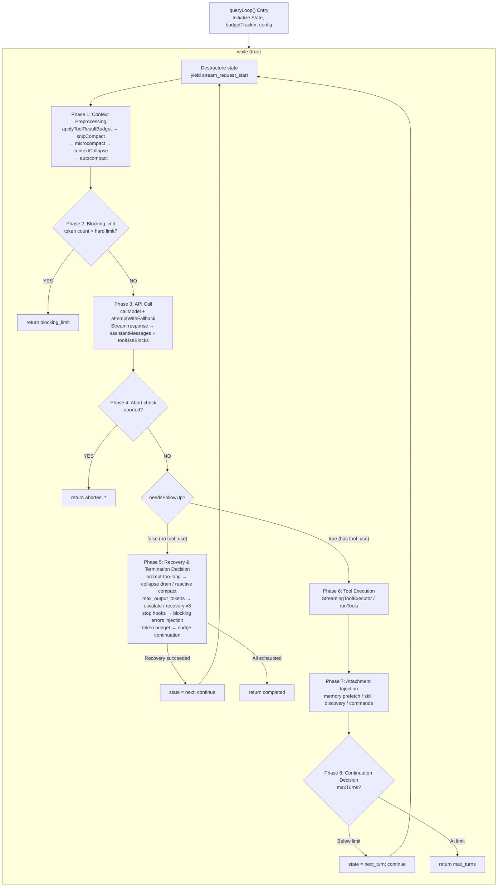

# Chapter 3: Agent Loop — The Full Lifecycle from User Input to Model Response

> *"A loop is not a loop when every iteration reshapes the world it runs in."*

This chapter is the anchor of the entire book. From Chapter 5's API call construction to Chapter 9's automatic compaction strategy, from Chapter 13's streaming response handling to Chapter 16's permission checking system — nearly all subsystems discussed in subsequent chapters are ultimately orchestrated, coordinated, and driven within the `queryLoop()` core loop. Understanding this loop means understanding the beating heart of Claude Code as an AI Agent.

## 3.1 Why the Agent Loop Is Not a Simple REPL

A traditional REPL (Read-Eval-Print Loop) is a stateless three-step cycle: read input, evaluate, print result. There's no context passing between iterations, no automatic recovery, no awareness of its own state.

The Agent Loop is fundamentally different. Consider this comparison table:

| Dimension | Traditional REPL | Claude Code Agent Loop |
|-----------|-----------------|----------------------|
| State model | Stateless or history-only | `State` type with 10 mutable fields, carried across iterations |
| Loop exit | User explicitly exits | 7 `Continue` transitions + 10 `Terminal` termination reasons |
| Error handling | Print error and continue | Auto-degradation, model switching, reactive compact, retry limits |
| Context management | None | snip -> microcompact -> context collapse -> autocompact four-level pipeline |
| Tool execution | None | Streaming parallel execution, permission checking, result budget trimming |
| Conversation capacity | Grows unbounded until OOM | Token budget tracking, automatic compaction, blocking limit hard cap |

Every iteration of the Agent Loop may change its own operating conditions: compaction reduces the message array, model degradation switches the inference backend, stop hooks inject new constraint messages. This isn't a loop — it's a **self-modifying state machine**.

## 3.2 queryLoop State Machine Overview

### 3.2.1 Entry: `query()` and `queryLoop()`

The entry function `query()` is a thin wrapper. It calls `queryLoop()` to get the result, then notifies all consumed commands of lifecycle completion:

```
restored-src/src/query.ts:219-238
```

```typescript
export async function* query(params: QueryParams): AsyncGenerator<...> {
  const consumedCommandUuids: string[] = []
  const terminal = yield* queryLoop(params, consumedCommandUuids)
  for (const uuid of consumedCommandUuids) {
    notifyCommandLifecycle(uuid, 'completed')
  }
  return terminal
}
```

The real state machine lives in `queryLoop()` (`restored-src/src/query.ts:241`). It's a `while (true)` loop that enters the next iteration via `state = next; continue`, or terminates via `return { reason: '...' }`.

### 3.2.2 The State Type: Mutable State Across Iterations

The `State` type defines all mutable state the loop needs to carry between iterations (`restored-src/src/query.ts:204-217`):

| Field | Type | Semantics |
|-------|------|-----------|
| `messages` | `Message[]` | Current conversation message array; assistant responses and tool results are appended after each iteration |
| `toolUseContext` | `ToolUseContext` | Tool execution context, including available tool list, permission mode, abort signal, etc. |
| `autoCompactTracking` | `AutoCompactTrackingState \| undefined` | Auto-compaction tracking state, recording whether compaction has been triggered and consecutive failure count |
| `maxOutputTokensRecoveryCount` | `number` | Number of max_output_tokens recovery attempts made so far, capped at 3 |
| `hasAttemptedReactiveCompact` | `boolean` | Whether reactive compact has been attempted, preventing retry death loops |
| `maxOutputTokensOverride` | `number \| undefined` | Override value for default max_output_tokens, used for escalation retries (e.g., 8k -> 64k) |
| `pendingToolUseSummary` | `Promise<...> \| undefined` | Promise for the previous round's tool execution summary, awaited in parallel during the next round's model streaming |
| `stopHookActive` | `boolean \| undefined` | Marks whether a stop hook is active, preventing duplicate triggering |
| `turnCount` | `number` | Current turn count, used for `maxTurns` limit checking |
| `transition` | `Continue \| undefined` | Why the previous iteration continued — lets tests and debugging assert that recovery paths actually fired |

Note a key design decision: the source comments explicitly state "Continue sites write `state = { ... }` instead of 9 separate assignments" (`restored-src/src/query.ts:267`). This means every continuation point must explicitly construct a complete `State` object. This approach eliminates the "forgot to reset a field" bug class — in a loop with 7 continuation points, this isn't a theoretical risk but an inevitable accident.

### 3.2.3 Continue Transition Types

The loop has 7 `continue` sites internally, each recording its transition reason. The complete enumeration extracted from source code:

| `Continue.reason` | Trigger Condition | Typical Behavior |
|-------------------|-------------------|------------------|
| `next_turn` | Model returned a `tool_use` block | Append assistant + tool_result, increment turnCount, begin next turn |
| `max_output_tokens_escalate` | Model output was truncated and hasn't escalated yet | Set maxOutputTokensOverride to 64k, retry same request as-is |
| `max_output_tokens_recovery` | Output truncated, escalation used up, recovery count < 3 | Inject meta message asking model to continue, increment recovery count |
| `reactive_compact_retry` | prompt-too-long or media-size error | Trigger reactive compact then retry |
| `collapse_drain_retry` | prompt-too-long with pending context collapse submissions | Execute all staged collapses, then retry |
| `stop_hook_blocking` | stop hook returned a blocking error | Inject blocking error into message stream, let model correct |
| `token_budget_continuation` | token budget not yet exhausted | Inject nudge message encouraging model to continue working |

### 3.2.4 Terminal Termination Reasons

The loop terminates via `return`, with a return value containing a `reason` field. The complete enumeration extracted from source code:

| `Terminal.reason` | Semantics |
|-------------------|-----------|
| `completed` | Model completed normally (no tool_use), or API error but recovery exhausted |
| `blocking_limit` | Token count hit hard limit, cannot continue |
| `prompt_too_long` | prompt-too-long error and all recovery means (collapse drain + reactive compact) failed |
| `image_error` | Image size/format error |
| `model_error` | Model call threw unexpected exception |
| `aborted_streaming` | User interrupted during streaming response |
| `aborted_tools` | User interrupted during tool execution |
| `stop_hook_prevented` | stop hook prevented continuation |
| `hook_stopped` | Hook prevented subsequent operations during tool execution |
| `max_turns` | Reached maximum turn limit |

> **Interactive version**: [Click to view the Agent Loop animated visualization](agent-loop-viz.html) — Watch how a complete "help me fix a bug" conversation flows through the state machine, with each stage clickable for source references and detailed explanations.

The flow diagram below shows the complete topology of the state machine:



Below is the original ASCII version for readers who need a plain-text reading environment:

<details>
<summary>ASCII Flow Diagram (click to expand)</summary>

```
┌──────────────────────────────────────────────────────────────────────┐
│                        queryLoop() Entry                            │
│  Initialize State, budgetTracker, config, pendingMemoryPrefetch     │
└──────────────┬───────────────────────────────────────────────────────┘
               │
               ▼
┌──────────────────────────────────────────────────┐
│              while (true) {                      │
│  Destructure state → messages, toolUseContext, ...│
│  yield { type: 'stream_request_start' }          │
├──────────────────────────────────────────────────┤
│                                                  │
│  ┌─────────────────────────────────────────┐     │
│  │ Phase 1: Context Preprocessing           │     │
│  │ applyToolResultBudget                    │     │
│  │ → snipCompact (HISTORY_SNIP)             │     │
│  │ → microcompact                           │     │
│  │ → contextCollapse (CONTEXT_COLLAPSE)     │     │
│  │ → autocompact ───── See Ch.9 ──────────  │     │
│  └──────────────┬──────────────────────────┘     │
│                 │                                 │
│                 ▼                                 │
│  ┌─────────────────────────────────────────┐     │
│  │ Phase 2: Blocking limit check            │     │
│  │ token count > hard limit ?               │     │
│  │   YES → return {reason:'blocking_limit'} │     │
│  └──────────────┬──────────────────────────┘     │
│                 │ NO                              │
│                 ▼                                 │
│  ┌─────────────────────────────────────────┐     │
│  │ Phase 3: API Call ── See Ch.5 & Ch.13 ── │     │
│  │ attemptWithFallback loop                  │     │
│  │ callModel({                              │     │
│  │   messages: prependUserContext(...)       │     │
│  │   systemPrompt: appendSystemContext(...) │     │
│  │ })                                       │     │
│  │                                          │     │
│  │ Stream response → assistantMessages[]    │     │
│  │                → toolUseBlocks[]         │     │
│  │ FallbackTriggeredError → switch model    │     │
│  └──────────────┬──────────────────────────┘     │
│                 │                                 │
│                 ▼                                 │
│  ┌─────────────────────────────────────────┐     │
│  │ Phase 4: Abort check                     │     │
│  │ abortController.signal.aborted ?        │     │
│  │   YES → return {reason:'aborted_*'}     │     │
│  └──────────────┬──────────────────────────┘     │
│                 │ NO                              │
│                 ▼                                 │
│  ┌─────────────────────────────────────────┐     │
│  │ Phase 5: needsFollowUp == false branch   │     │
│  │ (model did not return tool_use)          │     │
│  │                                          │     │
│  │ ┌─ prompt-too-long recovery ──────────┐ │     │
│  │ │ collapse drain → reactive compact   │ │     │
│  │ │ Success → state=next; continue      │ │     │
│  │ └────────────────────────────────────-┘ │     │
│  │ ┌─ max_output_tokens recovery ────────┐ │     │
│  │ │ escalate(8k→64k) → recovery(×3)    │ │     │
│  │ │ Success → state=next; continue      │ │     │
│  │ └────────────────────────────────────-┘ │     │
│  │ ┌─ stop hooks ── See Ch.16 ──────────┐ │     │
│  │ │ blockingErrors → state=next;continue│ │     │
│  │ └────────────────────────────────────-┘ │     │
│  │ ┌─ token budget check ────────────────┐ │     │
│  │ │ budget remaining → state=next;      │ │     │
│  │ │ continue                            │ │     │
│  │ └────────────────────────────────────-┘ │     │
│  │                                          │     │
│  │ return { reason: 'completed' }           │     │
│  └──────────────────────────────────────-──┘     │
│                 │                                 │
│           needsFollowUp == true                  │
│                 │                                 │
│                 ▼                                 │
│  ┌─────────────────────────────────────────┐     │
│  │ Phase 6: Tool Execution                  │     │
│  │ streamingToolExecutor.getRemainingResults│     │
│  │ or runTools() ── See Ch.4 ────────────── │     │
│  │ → toolResults[]                         │     │
│  └──────────────┬──────────────────────────┘     │
│                 │                                 │
│                 ▼                                 │
│  ┌─────────────────────────────────────────┐     │
│  │ Phase 7: Attachment Injection            │     │
│  │ getAttachmentMessages()                 │     │
│  │ pendingMemoryPrefetch consume           │     │
│  │ skillDiscoveryPrefetch consume          │     │
│  │ queuedCommands drain                    │     │
│  └──────────────┬──────────────────────────┘     │
│                 │                                 │
│                 ▼                                 │
│  ┌─────────────────────────────────────────┐     │
│  │ Phase 8: Continuation Decision           │     │
│  │ maxTurns check                          │     │
│  │ state = { reason: 'next_turn', ... }    │     │
│  │ continue                                │     │
│  └─────────────────────────────────────────┘     │
│                                                  │
└──────────────────────────────────────────────────┘
```

</details>

## 3.3 Complete Flow of a Single Iteration

Let's trace every phase of a single iteration, from start to finish.

### 3.3.1 Context Preprocessing Pipeline

At the start of each iteration, the raw `messages` array must go through four to five levels of processing before being sent to the API. These stages execute in strict order, and the order is not interchangeable.

**Level 1: Tool Result Budget Trimming**

```
restored-src/src/query.ts:379-394
```

`applyToolResultBudget()` applies size limits to aggregated tool results. It runs before all compaction stages because subsequent cached microcompact operates only on `tool_use_id` without inspecting content — trimming content first doesn't interfere with it.

**Level 2: History Snip**

```
restored-src/src/query.ts:401-410
```

`snipCompactIfNeeded()` is a lightweight compaction: it snips old messages from history to free token space. Crucially, it returns a `tokensFreed` value — this is passed to autocompact so its threshold decision can account for the space already freed by snip.

**Level 3: Microcompact**

```
restored-src/src/query.ts:414-426
```

Microcompact is a fine-grained compaction that runs before autocompact. It also supports a "cached edit" mode (`CACHED_MICROCOMPACT`) that leverages the API's cache deletion mechanism to achieve zero-additional-API-call compaction.

**Level 4: Context Collapse**

```
restored-src/src/query.ts:440-447
```

Context Collapse is a read-time projection mechanism. Source comments reveal an elegant design:

> *"Nothing is yielded — the collapsed view is a read-time projection over the REPL's full history. Summary messages live in the collapse store, not the REPL array."* (`restored-src/src/query.ts:434-436`)

This means the collapse doesn't modify the original message array but re-projects at each iteration. The collapsed result is passed via `state.messages` at continuation points; the next `projectView()` becomes a no-op since archived messages are already absent from the input.

**Level 5: Autocompact** (see Chapter 9)

```
restored-src/src/query.ts:454-468
```

Automatic compaction is the heaviest preprocessing step. It runs after context collapse — if the collapse has already reduced the token count below the threshold, autocompact becomes a no-op, preserving finer-grained context rather than generating a single summary.

The design of this five-level pipeline follows one principle: **from light to heavy, from local to global**. Each level tries to free space without losing too much information; only when earlier levels aren't sufficient do later levels activate.

### 3.3.2 Context Injection: prependUserContext and appendSystemContext

After message preprocessing is complete, context is injected into the API request via two functions:

**`appendSystemContext`** (`restored-src/src/utils/api.ts:437-447`):

```typescript
export function appendSystemContext(
  systemPrompt: SystemPrompt,
  context: { [k: string]: string },
): string[] {
  return [
    ...systemPrompt,
    Object.entries(context)
      .map(([key, value]) => `${key}: ${value}`)
      .join('\n'),
  ].filter(Boolean)
}
```

System context is appended to the end of the system prompt. This content (like current date, working directory, etc.) benefits from the system prompt's special caching position — the API's prompt caching is most friendly to system prompts.

**`prependUserContext`** (`restored-src/src/utils/api.ts:449-474`):

```typescript
export function prependUserContext(
  messages: Message[],
  context: { [k: string]: string },
): Message[] {
  // ...
  return [
    createUserMessage({
      content: `<system-reminder>\n...\n</system-reminder>\n`,
      isMeta: true,
    }),
    ...messages,
  ]
}
```

User context is wrapped in `<system-reminder>` tags and **prepended as the first user message** to the message array. This position choice is not arbitrary — it ensures context appears before all conversation and is marked as `isMeta: true` (not displayed in the user UI). An important prompt text is included: "this context may or may not be relevant to your tasks" — this gives the model freedom to ignore irrelevant context.

Note the call timing (`restored-src/src/query.ts:660`):

```typescript
messages: prependUserContext(messagesForQuery, userContext),
systemPrompt: fullSystemPrompt,  // already appendSystemContext'd
```

`prependUserContext` is executed at API call time, not during the preprocessing pipeline. This means user context doesn't participate in token counting or compaction decisions — it's a "transparent" injection.

### 3.3.3 Message Normalization Pipeline

During the API call construction phase (`restored-src/src/services/api/claude.ts:1259-1314`), messages pass through a four-step normalization pipeline. This pipeline's responsibility is to convert Claude Code's rich internal message types into the strict format accepted by the Anthropic API.

**Step 1: `normalizeMessagesForAPI()`** (`restored-src/src/utils/messages.ts:1989`)

This is the most complex normalization step. It performs the following work:

1. **Attachment reordering**: Via `reorderAttachmentsForAPI()`, moves attachment messages upward until hitting a tool_result or assistant message
2. **Virtual message filtering**: Removes messages marked `isVirtual` that are display-only (like REPL internal tool calls)
3. **System/progress message stripping**: Filters out `progress` type messages and non-`local_command` `system` messages
4. **Synthetic error message handling**: Detects PDF/image/request-too-large errors, searches backward to strip corresponding media blocks from source user messages
5. **Tool input normalization**: Processes tool input format via `normalizeToolInputForAPI`
6. **Message merging**: Adjacent same-role messages are merged (API requires strict user/assistant alternation)

**Step 2: `ensureToolResultPairing()`** (`restored-src/src/utils/messages.ts:5133`)

Fixes `tool_use` / `tool_result` pairing mismatches. This mismatch is especially common when recovering remote sessions (remote/teleport sessions). It inserts synthetic error `tool_result` for orphaned `tool_use` blocks and strips orphaned `tool_result` blocks that reference non-existent `tool_use`.

**Step 3: `stripAdvisorBlocks()`** (`restored-src/src/utils/messages.ts:5466`)

Strips advisor blocks. These blocks require a specific beta header to be accepted by the API (`restored-src/src/services/api/claude.ts:1304`):

```typescript
if (!betas.includes(ADVISOR_BETA_HEADER)) {
  messagesForAPI = stripAdvisorBlocks(messagesForAPI)
}
```

**Step 4: `stripExcessMediaItems()`** (`restored-src/src/services/api/claude.ts:956`)

The API limits each request to a maximum of 100 media items (images + documents). This function silently removes excess media items starting from the oldest messages, rather than raising an error — this is important in Cowork/CCD scenarios where hard errors are difficult to recover from.

The execution order of this pipeline is not arbitrary. Source comments explain why normalization must come before `ensureToolResultPairing` (`restored-src/src/services/api/claude.ts:1272-1276`):

> *"normalizeMessagesForAPI uses isToolSearchEnabledNoModelCheck() because it's called from ~20 places (analytics, feedback, sharing, etc.), many of which don't have model context."*

This reveals an architectural fact: `normalizeMessagesForAPI` is a widely reused function whose interface can't casually accept additional parameters. Model-specific post-processing (like tool search field stripping) must run as an independent step after it.

### 3.3.4 API Call Phase (see Chapter 5 and Chapter 13)

The API call is wrapped in an `attemptWithFallback` loop (`restored-src/src/query.ts:650-953`):

```typescript
let attemptWithFallback = true
while (attemptWithFallback) {
  attemptWithFallback = false
  try {
    for await (const message of deps.callModel({
      messages: prependUserContext(messagesForQuery, userContext),
      systemPrompt: fullSystemPrompt,
      // ...
    })) {
      // Process streaming response messages
    }
  } catch (innerError) {
    if (innerError instanceof FallbackTriggeredError && fallbackModel) {
      currentModel = fallbackModel
      attemptWithFallback = true
      // Clean up orphaned messages, reset executor
      continue
    }
    throw innerError
  }
}
```

Several elegant designs are worth noting here:

**Message immutability.** Streaming messages are cloned before yield: the original `message` is pushed to the `assistantMessages` array (sent back to the API), while the cloned version (with backfilled observable input) is yielded to the SDK caller. Source comments (`restored-src/src/query.ts:744-746`) directly explain why: "mutating it would break prompt caching (byte mismatch)".

**Error withholding mechanism.** Recoverable errors (prompt-too-long, max-output-tokens, media-size) are withheld during the streaming phase — not immediately yielded to the caller. Only when subsequent recovery logic confirms recovery is impossible are they released to the caller. This prevents SDK consumers (like Desktop/Cowork) from prematurely terminating sessions.

**Tombstone handling.** When streaming fallback occurs, partially yielded messages are notified for deletion as tombstones (`restored-src/src/query.ts:716-718`). This solves a subtle problem: partial messages (especially thinking blocks) carry signatures that, after degradation, would cause the API to report a "thinking blocks cannot be modified" error.

### 3.3.5 Tool Execution Phase (see Chapter 4)

After the model response completes, if `tool_use` blocks are present, the loop enters the tool execution phase (`restored-src/src/query.ts:1363-1408`).

Claude Code supports two tool execution modes:

1. **Streaming parallel execution** (`StreamingToolExecutor`): Tools begin executing while the model is still streaming. During the API call phase, each `tool_use` block is `addTool()`'d to the executor upon arrival (`restored-src/src/query.ts:841-843`). After streaming ends, `getRemainingResults()` collects all completed and pending results.
2. **Batch execution** (`runTools()`): All tool_use blocks are collected first, then executed in one batch.

Tool execution results are normalized via `normalizeMessagesForAPI` and appended to the `toolResults` array.

### 3.3.6 Stop Hooks and Continuation Decision

When the model response contains no tool_use (`needsFollowUp == false`), the loop enters the termination decision path. This path includes multiple layers of recovery logic and hook checks.

**Stop Hooks** (`restored-src/src/query.ts:1267-1306`):

```typescript
const stopHookResult = yield* handleStopHooks(
  messagesForQuery, assistantMessages,
  systemPrompt, userContext, systemContext,
  toolUseContext, querySource, stopHookActive,
)
```

If a stop hook returns `blockingErrors`, the loop injects these error messages and continues (`transition: { reason: 'stop_hook_blocking' }`), giving the model a chance to correct. This is a key execution point in Claude Code's permission system — see Chapter 16.

**Token Budget Check** (`restored-src/src/query.ts:1308-1355`):

When the `TOKEN_BUDGET` feature is enabled, the loop checks whether the current turn's token consumption is within budget. If the model "finishes early" but budget remains, the loop injects a nudge message (`transition: { reason: 'token_budget_continuation' }`) encouraging the model to keep working. This mechanism also supports "diminishing returns" detection — if the model's incremental output is no longer substantively contributing, it stops early even if the budget isn't exhausted.

### 3.3.7 Attachment Injection and Turn Preparation

After tool execution completes, the loop injects attachments before entering the next turn (`restored-src/src/query.ts:1580-1628`):

1. **Queued command processing**: Pull commands from the global command queue for the current agent address (distinguishing between main thread and sub-agents), converting them to attachment messages
2. **Memory prefetch consumption**: If memory prefetch (started at `startRelevantMemoryPrefetch` at the loop entry) has completed and hasn't been consumed this turn, inject the results
3. **Skill discovery consumption**: If skill discovery prefetch has completed, inject the results

These injections leverage the latency of model streaming and tool execution — they run in parallel in the background and are typically complete by this point.

## 3.4 Abort/Retry/Degradation

### 3.4.1 FallbackTriggeredError and Model Switching

When an API call fails due to high load or similar reasons, a `FallbackTriggeredError` is thrown (`restored-src/src/query.ts:894-950`). The handling flow:

1. Switch `currentModel` to `fallbackModel`
2. Clear `assistantMessages`, `toolResults`, `toolUseBlocks`
3. Discard and rebuild `StreamingToolExecutor` (prevent orphaned tool_result leaks)
4. Update `toolUseContext.options.mainLoopModel`
5. Strip thinking signature blocks (because they're model-bound and would cause 400 errors on the degraded model)
6. Yield a system message notifying the user

Crucially, this degradation happens inside the `attemptWithFallback` loop. It sets `attemptWithFallback = true` and `continue`, immediately retrying within the same iteration — no need to re-enter the outer `while (true)` loop.

### 3.4.2 max_output_tokens Recovery: Three Chances

When model output is truncated, the recovery strategy has two layers:

**Layer 1: Escalation.** If currently using the default 8k limit and no override has been applied, directly set `maxOutputTokensOverride` to 64k (`ESCALATED_MAX_TOKENS`) and retry the same request. This is "free" recovery — no multi-turn conversation needed.

**Layer 2: Multi-turn recovery.** If truncation persists after escalation, inject a meta message:

```
"Output token limit hit. Resume directly — no apology, no recap of what you were doing.
Pick up mid-thought if that is where the cut happened.
Break remaining work into smaller pieces."
```

This message is carefully worded: no apologies (wastes tokens), no recaps (repeats information), break work down (reduce per-output demand). Up to 3 retries (`MAX_OUTPUT_TOKENS_RECOVERY_LIMIT`, `restored-src/src/query.ts:164`).

### 3.4.3 Reactive Compact: The Last Line of Defense for prompt-too-long

When the API returns a prompt-too-long error, the recovery strategy also has two layers:

1. **Context Collapse Drain**: First attempt to submit all staged context collapses. This is a cheap operation that preserves fine-grained context
2. **Reactive Compact**: If the drain isn't sufficient, execute a full reactive compact. Mark `hasAttemptedReactiveCompact = true` to prevent retry death loops

If both fail, the error is released to the caller and the loop terminates. Source comments specifically emphasize why stop hooks can't be run here (`restored-src/src/query.ts:1169-1172`):

> *"Do NOT fall through to stop hooks: the model never produced a valid response, so hooks have nothing meaningful to evaluate. Running stop hooks on prompt-too-long creates a death spiral: error -> hook blocking -> retry -> error -> ..."*

## 3.5 Single Iteration Sequence Diagram

```
User          queryLoop         PreProcess       API          Tools          StopHooks
 │                │                  │              │              │              │
 │   messages     │                  │              │              │              │
 │───────────────>│                  │              │              │              │
 │                │                  │              │              │              │
 │                │ applyToolResult  │              │              │              │
 │                │ Budget           │              │              │              │
 │                │─────────────────>│              │              │              │
 │                │                  │              │              │              │
 │                │  snipCompact     │              │              │              │
 │                │─────────────────>│              │              │              │
 │                │                  │              │              │              │
 │                │  microcompact    │              │              │              │
 │                │─────────────────>│              │              │              │
 │                │                  │              │              │              │
 │                │  contextCollapse │              │              │              │
 │                │─────────────────>│              │              │              │
 │                │                  │              │              │              │
 │                │  autocompact     │              │              │              │
 │                │─────────────────>│              │              │              │
 │                │  messagesForQuery│              │              │              │
 │                │<─────────────────│              │              │              │
 │                │                  │              │              │              │
 │                │ prependUserContext               │              │              │
 │                │ appendSystemContext              │              │              │
 │                │                  │              │              │              │
 │                │  callModel(...)  │              │              │              │
 │                │────────────────────────────────>│              │              │
 │                │                  │              │              │              │
 │                │  stream messages │              │              │              │
 │<───────────────│<────────────────────────────────│              │              │
 │  (yield)       │                  │              │              │              │
 │                │                  │              │  tool_use?   │              │
 │                │                  │              │              │              │
 │                │──────── needsFollowUp ─────────────────────────>│              │
 │                │         runTools / StreamingToolExecutor        │              │
 │<───────────────│<───────────────────────────────────────────────│              │
 │  (yield results)                  │              │              │              │
 │                │                  │              │              │              │
 │                │  attachments (memory, skills, commands)        │              │
 │                │                  │              │              │              │
 │                │   state = { reason: 'next_turn', ... }        │              │
 │                │   continue ──────────────────────────> next iteration         │
 │                │                  │              │              │              │
 │          ──── OR ── needsFollowUp == false ────────────────────>│              │
 │                │                  │              │              │              │
 │                │  handleStopHooks │              │              │              │
 │                │────────────────────────────────────────────────────────────>│
 │                │  blockingErrors? │              │              │              │
 │                │<───────────────────────────────────────────────────────────│
 │                │                  │              │              │              │
 │                │  return { reason: 'completed' }│              │              │
 │<───────────────│                  │              │              │              │
```

## 3.6 Pattern Extraction

After reading through the 1,730 lines of `queryLoop()` source code, several deep patterns emerge:

### Pattern 1: Explicit State Reconstruction Over Incremental Modification

Every `continue` site constructs a complete new `State` object. There's no `state.maxOutputTokensRecoveryCount++`, only `state = { ..., maxOutputTokensRecoveryCount: maxOutputTokensRecoveryCount + 1, ... }`. This brings three benefits:

1. **Forgetting immunity**: It's impossible to forget to reset a field
2. **Auditability**: Each continuation point's complete intent is visible in a single object literal
3. **Testability**: The `transition` field lets tests assert whether recovery paths actually fired

### Pattern 2: Withhold-Release

Recoverable errors are not immediately exposed to consumers. They are withheld (pushed to `assistantMessages` but not yielded), and only released when all recovery means are exhausted. This pattern solves a real-world problem: SDK consumers (Desktop, Cowork) terminate sessions upon seeing errors — if recovery succeeds, prematurely exposing the error was an unnecessary interruption.

### Pattern 3: Light-to-Heavy Layered Recovery

Whether it's context compaction (snip -> microcompact -> collapse -> autocompact) or error recovery (escalate -> multi-turn -> reactive compact), the strategy always starts from the lightest means (least information loss) and escalates progressively. This isn't just performance optimization but an information preservation strategy — each level trades "the minimum cost for the maximum space."

### Pattern 4: Background Parallelization's Sliding Window

Memory prefetch starts at the loop entry, tool summaries launch asynchronously after tool execution, skill discovery starts asynchronously at iteration begin — they all complete during the 5-30 second window while the model generates its streaming response. This "complete preparatory work while waiting" pattern hides latency almost invisibly.

### Pattern 5: Death Loop Protection via Single-Attempt Guards

`hasAttemptedReactiveCompact`, `maxOutputTokensRecoveryCount`, `state.transition?.reason !== 'collapse_drain_retry'` — these guards ensure each recovery strategy executes at most once (or a limited number of times). In a `while (true)` loop, without these guards is an invitation for infinite loops. The phrase "death spiral" recurring in source comments (`restored-src/src/query.ts:1171`, `1295`) indicates this isn't a theoretical concern — these guards were learned from actual production incidents.

## What You Can Do

If you're building your own AI Agent system, here are practices you can directly borrow from `queryLoop()`'s design:

- **Set single-attempt guards for every recovery strategy.** In a `while (true)` loop, every automatic recovery (compaction, retry, degradation) must have a boolean flag or counter to prevent infinite loops. Name them `hasAttempted*` to make the intent obvious.
- **Adopt a "light-to-heavy" layered compaction strategy.** Don't jump straight to full summarization when context exceeds limits. First try trimming old messages (snip), then microcompact, then collapse, and only then full compaction (autocompact). Each layer preserves as much context information as possible.
- **Replace incremental modification with full state reconstruction.** At every `continue` site in the loop, construct a complete new state object rather than modifying fields one by one. This eliminates the "forgot to reset a field" bug class, especially when there are multiple continuation paths.
- **Withhold recoverable errors.** Don't expose errors to upper-level consumers at the first opportunity. Try all recovery means first; only release the error after all attempts fail. This prevents upper layers from prematurely terminating sessions upon seeing an error.
- **Leverage the model response wait window for parallel prefetch.** Start memory prefetch, skill discovery, and other async tasks simultaneously with the API call. The 5-30 seconds while the model generates its response is "free" computation time.
- **Record transition reasons.** Record why the loop continued in the state (e.g., `next_turn`, `reactive_compact_retry`) — this aids debugging and lets automated tests assert whether specific recovery paths were triggered.

## 3.7 Chapter Summary

`queryLoop()` is Claude Code's heartbeat. It doesn't simply pass messages between user and model; instead, it actively manages context capacity, orchestrates tool execution, handles error recovery, and executes permission checks at every iteration. Once you understand the topology and transition semantics of this loop, every subsystem discussed in subsequent chapters — autocompact (Chapter 9), API call construction (Chapter 5), streaming response handling (Chapter 13), permission checking (Chapter 16) — can be precisely located in your mental model at the exact position and timing where they're invoked.

The most profound design characteristic of this loop is: it knows it might fail and is prepared for it. Not an optimistic "if everything goes well" path, but a defensive design of "how to gracefully recover when things go wrong." This is precisely the key engineering decision that transforms a demo-level AI chat interface into a production-grade AI Agent.
