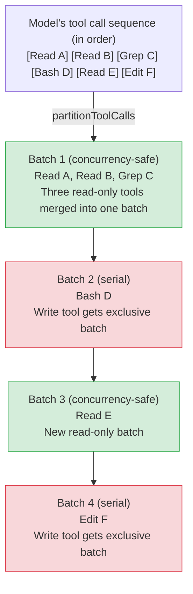

# Chapter 4: Tool Execution Orchestration — Permissions, Concurrency, Streaming, and Interrupts

> **Positioning**: This chapter analyzes how CC concurrently executes tool calls — partition scheduling, the permission decision chain, the streaming executor, and large result persistence. Prerequisites: Chapter 2 (Tool System), Chapter 3 (Agent Loop). Target audience: readers wanting to understand how CC concurrently executes tool calls, permission checks, and streaming output.

> Chapter 3 dissected the full lifecycle of the Agent Loop. When the model returns content blocks of type `tool_use`, the loop enters the "tool execution phase." This chapter dives deep into the internal implementation of this phase: how tool calls are partitioned and scheduled, what lifecycle steps a single tool execution goes through, how the permission decision chain filters layer by layer, how large results are persisted, and how the streaming executor handles concurrency and interrupts.

## 4.1 Why Tool Execution Orchestration Is Critical

In a single Agent Loop iteration, the model may request multiple tool calls simultaneously. For example, the model might issue three `Read` calls to read different files, followed by a `Bash` call to run tests. These calls can't all execute in parallel — read operations are safe, but a `git checkout` could change working directory state, causing parallel reads to get inconsistent results.

Claude Code's tool orchestration layer solves three core problems:

1. **Safe concurrency**: Read-only tools can execute in parallel to improve throughput; write tools must execute serially to guarantee consistency
2. **Permission gating**: Every tool must pass through the permission decision chain before execution, ensuring users retain control over dangerous operations
3. **Result management**: Tool output can be enormous (a `cat` command might return hundreds of thousands of characters), requiring intelligent trimming to avoid context window overflow

The solutions to these three problems are distributed across three core files: `toolOrchestration.ts` (batch scheduling), `toolExecution.ts` (single-tool lifecycle), and `StreamingToolExecutor.ts` (streaming concurrent executor).

## 4.2 partitionToolCalls: Tool Call Partitioning

### 4.2.1 The Partitioning Algorithm

When the Agent Loop hands a batch of `ToolUseBlock`s to the orchestration layer, the first step is to partition them into alternating "concurrency-safe batches" and "serial batches." This is the responsibility of the `partitionToolCalls` function:



**Figure 4-1: partitionToolCalls partitioning logic.** Consecutive concurrency-safe tools are merged into the same batch (green); non-concurrency-safe tools each get their own exclusive batch (red).

The core of the partitioning logic is a `reduce` operation (`restored-src/src/services/tools/toolOrchestration.ts:91-116`):

```typescript
function partitionToolCalls(
  toolUseMessages: ToolUseBlock[],
  toolUseContext: ToolUseContext,
): Batch[] {
  return toolUseMessages.reduce((acc: Batch[], toolUse) => {
    const tool = findToolByName(toolUseContext.options.tools, toolUse.name)
    const parsedInput = tool?.inputSchema.safeParse(toolUse.input)
    const isConcurrencySafe = parsedInput?.success
      ? (() => {
          try {
            return Boolean(tool?.isConcurrencySafe(parsedInput.data))
          } catch {
            return false  // Conservative strategy: parse failure = unsafe
          }
        })()
      : false
    if (isConcurrencySafe && acc[acc.length - 1]?.isConcurrencySafe) {
      acc[acc.length - 1]!.blocks.push(toolUse)  // Merge into previous concurrent batch
    } else {
      acc.push({ isConcurrencySafe, blocks: [toolUse] })  // Create new batch
    }
    return acc
  }, [])
}
```

Key design decisions:

- **Validate before classifying**: Input must pass Zod schema validation before `isConcurrencySafe` is called. If the model generates invalid input, the tool is conservatively marked as not concurrency-safe.
- **Exception means unsafe**: If `isConcurrencySafe` itself throws an exception (e.g., `shell-quote` fails to parse a Bash command), it also falls back to serial execution. This is the classic "fail-closed" security pattern.
- **Greedy merging**: Consecutive concurrency-safe tools are merged into the same batch until a non-safe tool is encountered. This maintains relative call order while maximizing parallelism.

### 4.2.2 isConcurrencySafe Determination Logic

`isConcurrencySafe` is a required method on the `Tool` interface (`restored-src/src/Tool.ts:402`), with a default implementation returning `false` (`restored-src/src/Tool.ts:759`). Each tool provides its own implementation based on its semantics:

| Tool | Concurrency-safe? | Reason |
|------|-------------------|--------|
| FileRead, Glob, Grep | Always `true` | Pure reads, no side effects |
| BashTool | Depends on command | Delegates to `isReadOnly(input)`, analyzes whether command is read-only |
| FileEdit, FileWrite | `false` | Modifies file system |
| AgentTool | `false` | Spawns sub-Agent, may modify state |

Taking `BashTool` as an example (`restored-src/src/tools/BashTool/BashTool.tsx:434-436`):

```typescript
isConcurrencySafe(input) {
  return this.isReadOnly?.(input) ?? false;
},
```

Bash tool's concurrency safety depends entirely on the command content: `ls`, `cat`, `git log` are safe, while `rm`, `git checkout`, `npm install` are not. `isReadOnly` parses the command structure to make this determination.

## 4.3 runTools: The Batch Scheduling Engine

`runTools` (`restored-src/src/services/tools/toolOrchestration.ts:19-82`) is the orchestration layer's entry point. It iterates over the partitioned batches, calling `runToolsConcurrently` for concurrency-safe batches and `runToolsSerially` for serial batches.

### 4.3.1 Concurrent Execution Path

The concurrent path uses the `all()` utility function (`restored-src/src/utils/generators.ts:32`) to merge multiple async generators into one, with a concurrency cap:

```typescript
async function* runToolsConcurrently(...) {
  yield* all(
    toolUseMessages.map(async function* (toolUse) {
      yield* runToolUse(toolUse, ...)
      markToolUseAsComplete(toolUseContext, toolUse.id)
    }),
    getMaxToolUseConcurrency(),  // Default 10, overridable via env var
  )
}
```

The concurrency cap is configured via the environment variable `CLAUDE_CODE_MAX_TOOL_USE_CONCURRENCY` (`restored-src/src/services/tools/toolOrchestration.ts:8-11`), defaulting to 10.

An important detail is **deferred application of context modifiers**. Concurrently executing tools may each produce context modifications (e.g., updating the available tool list), but these modifications can't be applied immediately during concurrent execution — that would cause race conditions. Therefore, modifiers are collected into a queue and applied sequentially in tool appearance order after the entire concurrent batch completes (`restored-src/src/services/tools/toolOrchestration.ts:31-63`).

### 4.3.2 Serial Execution Path

The serial path directly executes each tool in sequence, applying context modifications immediately after each execution:

```typescript
for (const toolUse of toolUseMessages) {
  for await (const update of runToolUse(toolUse, ...)) {
    if (update.contextModifier) {
      currentContext = update.contextModifier.modifyContext(currentContext)
    }
    yield { message: update.message, newContext: currentContext }
  }
}
```

This guarantees that write tools can see the context state modified by the previous tool.

## 4.4 Single-Tool Execution Lifecycle

Every tool call, whether through the concurrent or serial path, ultimately enters `runToolUse` (`restored-src/src/services/tools/toolExecution.ts:337`) and `checkPermissionsAndCallTool` (`restored-src/src/services/tools/toolExecution.ts:599`). These two functions compose the complete lifecycle of a single tool.

```
┌─────────────────────────────────────────────────────────────────┐
│                    Single-Tool Execution Lifecycle                │
│                                                                  │
│  ① Tool Lookup ──→ ② Schema Validation ──→ ③ Input Validation   │
│       │              │                  │                         │
│   Tool not found? Validation failed? Validation failed?          │
│   ↓ Return error  ↓ Return error     ↓ Return error              │
│                                                                  │
│  ④ PreToolUse Hooks ──→ ⑤ Permission Decision ──→ ⑥ tool.call() │
│       │                      │               │                   │
│   Hook blocked?        Permission denied? Execution error?       │
│   ↓ Return error      ↓ Return error     ↓ Return error         │
│                                                                  │
│  ⑦ Result Mapping ──→ ⑧ Large Result Persistence ──→ ⑨ PostToolUse Hooks │
│                                          │                       │
│                                   Hook prevents continuation?    │
│                                   ↓ Stop subsequent loops        │
└─────────────────────────────────────────────────────────────────┘
```

**Figure 4-2: Single-tool lifecycle flow.** Each stage can produce an error message that terminates the flow; the success path traverses all nine stages from left to right.

### 4.4.1 Phase 1: Tool Lookup and Input Validation

`runToolUse` first searches for the target tool in the available tool set (`restored-src/src/services/tools/toolExecution.ts:345-356`). If not found, it also checks deprecated tool aliases — this ensures tool calls from old session records can still execute.

Input validation has two steps:

1. **Schema validation**: Uses Zod's `safeParse` for type checking against the model's output parameters (`restored-src/src/services/tools/toolExecution.ts:615-616`). Model-generated parameter types aren't always correct — for example, it might output a string for a parameter that should be an array.

2. **Semantic validation**: Tool-specific business logic validation via `tool.validateInput()` (`restored-src/src/services/tools/toolExecution.ts:683-684`). For example, the FileEdit tool might check whether the target file exists.

A noteworthy detail: when a tool is a deferred tool and its schema wasn't sent to the API, the system appends a hint in the Zod error message guiding the model to first load the tool schema via `ToolSearch` before retrying (`restored-src/src/services/tools/toolExecution.ts:578-597`).

### 4.4.2 Phase 2: Speculative Classifier Launch

Before entering permission checking, if the current tool is a Bash tool, the system **speculatively launches the allow classifier** (speculative classifier check, `restored-src/src/services/tools/toolExecution.ts:740-752`). This classifier runs in parallel with PreToolUse Hooks, so the result may already be ready when the user needs to make a permission decision. This is an optimization — avoiding the user waiting for classifier latency.

### 4.4.3 Phase 3: PreToolUse Hooks

The system executes all registered `PreToolUse` hooks (`restored-src/src/services/tools/toolExecution.ts:800-862`). Hooks can produce the following effects:

- **Modify input**: Return `updatedInput` to replace original parameters
- **Make permission decisions**: Return `allow`, `deny`, or `ask` to influence subsequent permission checking
- **Block execution**: Set the `preventContinuation` flag
- **Add context**: Inject additional information for the model's reference

If the hook execution is interrupted by an abort signal, the system immediately terminates and returns a cancellation message.

### 4.4.4 Phase 4: Permission Decision Chain

The permission system is the most complex part of the tool execution lifecycle. The decision chain is coordinated by `resolveHookPermissionDecision` (`restored-src/src/services/tools/toolHooks.ts:332-433`), following this priority:

```
┌──────────────────────────────────────────────────────────────────┐
│                       Permission Decision Chain                    │
│                                                                    │
│  PreToolUse Hook Decision                                          │
│  ├─ allow ──→ Check rule permissions (settings.json deny/ask)      │
│  │            ├─ No matching rule ──→ Allow (skip user prompt)     │
│  │            ├─ deny rule ──→ Deny (rule overrides Hook)          │
│  │            └─ ask rule ──→ Prompt user (rule overrides Hook)    │
│  ├─ deny ──→ Deny directly                                        │
│  └─ ask ──→ Enter normal permission flow (with Hook's              │
│             forceDecision)                                          │
│                                                                    │
│  No Hook Decision ──→ Normal permission flow                       │
│  ├─ Tool's own checkPermissions                                    │
│  ├─ General rule matching (settings.json)                          │
│  ├─ YOLO/Auto classifier (see Chapter 17)                          │
│  └─ User interactive prompt (see Chapter 16)                       │
└──────────────────────────────────────────────────────────────────┘
```

**Figure 4-3: Permission decision chain diagram.** A Hook's `allow` cannot override `deny` rules in settings.json — this is defense in depth in action.

A key invariant of the decision chain: **A Hook's `allow` decision cannot bypass deny/ask rules in settings.json**. Even if a hook approves an operation, if settings.json contains an explicit deny rule, the operation is still denied. This ensures user-configured security boundaries are always effective (`restored-src/src/services/tools/toolHooks.ts:373-405`).

The complete architecture of the permission system is covered in Chapter 16; the YOLO classifier implementation is covered in Chapter 17.

### 4.4.5 Phase 5: Tool Execution

After permissions pass, the system calls `tool.call()` (`restored-src/src/services/tools/toolExecution.ts:1207-1222`). The execution is wrapped between `startSessionActivity('tool_exec')` and `stopSessionActivity('tool_exec')` for tracking active session state.

Progress events during tool execution are delivered via a `Stream` object (`restored-src/src/services/tools/toolExecution.ts:509`). `streamedCheckPermissionsAndCallTool` merges the `checkPermissionsAndCallTool` Promise result with real-time progress events into the same async iterable, allowing callers to receive both progress updates and the final result.

### 4.4.6 Phase 6: PostToolUse Hooks and Result Processing

After successful tool execution, the system sequentially performs:

1. **Result mapping**: Converts tool output to API format via `tool.mapToolResultToToolResultBlockParam()` (`restored-src/src/services/tools/toolExecution.ts:1292-1293`)
2. **Large result persistence**: If the result exceeds the threshold, writes it to disk and replaces with a summary (see Section 4.6)
3. **PostToolUse Hooks**: Executes post-hooks, which can modify MCP tool output or prevent subsequent loop continuation (`restored-src/src/services/tools/toolExecution.ts:1483-1531`)

For MCP tools, hooks can modify tool output by returning `updatedMCPToolOutput`. This modification takes effect before the `addToolResult` call, ensuring the modified version is what gets stored in message history. For non-MCP tools, result mapping completes before hooks, so hooks can only append information, not modify results.

If tool execution fails, the system instead executes `PostToolUseFailure` hooks (`restored-src/src/services/tools/toolExecution.ts:1700-1713`), allowing hooks to inspect the error and inject additional context.

## 4.5 StreamingToolExecutor: The Streaming Concurrent Executor

The `runTools` described above operates in batch mode — it waits for all `tool_use` blocks to arrive before starting partitioning and execution. But in streaming response scenarios, tool call blocks are parsed one by one from the API stream. `StreamingToolExecutor` (`restored-src/src/services/tools/StreamingToolExecutor.ts`) implements a different strategy: **start executing tool calls as they arrive, without waiting for all to be ready**.

### 4.5.1 State Machine Model

`StreamingToolExecutor` maintains a four-state lifecycle for each tool:

```
queued ──→ executing ──→ completed ──→ yielded
```

- **queued**: Tool registered but not yet started
- **executing**: Tool currently running
- **completed**: Tool finished, result buffered
- **yielded**: Result consumed by caller

State transitions are driven by `processQueue()` (`restored-src/src/services/tools/StreamingToolExecutor.ts:140-151`). Each time a tool completes or a new tool is enqueued, the queue processor is woken up to attempt starting the next executable tool.

### 4.5.2 Concurrency Control

The `canExecuteTool` method (`restored-src/src/services/tools/StreamingToolExecutor.ts:129-135`) implements the core concurrency strategy:

```typescript
private canExecuteTool(isConcurrencySafe: boolean): boolean {
  const executingTools = this.tools.filter(t => t.status === 'executing')
  return (
    executingTools.length === 0 ||
    (isConcurrencySafe && executingTools.every(t => t.isConcurrencySafe))
  )
}
```

The rules are concise:
- If no tools are executing, any tool can start
- If tools are executing, a new tool can only start if both itself and all currently executing tools are concurrency-safe
- Non-concurrency-safe tools require exclusive access

### 4.5.3 Bash Error Cascade Abort

`StreamingToolExecutor` implements an elegant error handling mechanism: when a Bash tool errors, all sibling parallel Bash tools are cancelled (`restored-src/src/services/tools/StreamingToolExecutor.ts:357-363`).

```typescript
if (tool.block.name === BASH_TOOL_NAME) {
  this.hasErrored = true
  this.erroredToolDescription = this.getToolDescription(tool)
  this.siblingAbortController.abort('sibling_error')
}
```

This design is based on a practical observation: Bash commands typically have implicit dependency chains. If `mkdir` fails, a subsequent `cp` command is destined to fail too — rather than letting them each report errors independently, it's better to cancel preemptively. But this strategy **only applies to Bash tools** — `Read`, `WebFetch`, and similar tools are independent; one's failure shouldn't affect others.

The error cascade uses a `siblingAbortController`, which is a child controller of `toolUseContext.abortController`. Aborting the sibling controller cancels running subprocesses but **does not** abort the parent controller — meaning the Agent Loop itself won't terminate the current turn due to a single Bash error.

### 4.5.4 Interrupt Behavior

Each tool can declare its own interrupt behavior: `'cancel'` or `'block'` (`restored-src/src/Tool.ts:416`). When the user sends an interrupt signal:

- **cancel** tools: Immediately receive a cancellation message; results are replaced with a synthesized REJECT_MESSAGE
- **block** tools: Continue running to completion (don't respond to interrupt)

`StreamingToolExecutor` tracks whether all currently executing tools are interruptible via `updateInterruptibleState()` (`restored-src/src/services/tools/StreamingToolExecutor.ts:254-259`). This information is passed to the UI layer, determining whether to show "Press ESC to cancel."

### 4.5.5 Immediate Delivery of Progress Messages

Regular tool results must be delivered in order (preserving order semantics), but **progress messages can be delivered immediately** (`restored-src/src/services/tools/StreamingToolExecutor.ts:417-420`). `StreamingToolExecutor` stores progress messages in a separate `pendingProgress` queue; `getCompletedResults()` yields progress messages first when scanning the tool list, unconstrained by tool completion order.

When there are no completed results but tools are executing, `getRemainingResults()` uses `Promise.race` to wait for either any tool to complete **or** new progress messages to arrive (`restored-src/src/services/tools/StreamingToolExecutor.ts:476-481`), avoiding unnecessary polling.

## 4.6 Tool Result Management: Budgets and Persistence

### 4.6.1 Large Result Persistence

A `Bash` tool's `cat` command might return hundreds of thousands of characters. Stuffing such an enormous result directly into the context window not only wastes token budget but may cause the model's attention to scatter. `toolResultStorage.ts` implements the large result persistence mechanism.

Persistence threshold determination follows this priority (`restored-src/src/utils/toolResultStorage.ts:55-78`):

1. **GrowthBook override**: The operations team can set custom thresholds for specific tools via Feature Flags (`tengu_satin_quoll`)
2. **Tool-declared value**: Each tool's `maxResultSizeChars` property
3. **Global ceiling**: `DEFAULT_MAX_RESULT_SIZE_CHARS = 50,000` characters (`restored-src/src/constants/toolLimits.ts:13`)

The final threshold is the lesser of the tool-declared value and the global ceiling. But if a tool declares `Infinity`, persistence is skipped — for example, the `Read` tool manages its own output boundaries, and persisting its output to a file only to have the model `Read` it back would be a circular reference.

When a result exceeds the threshold, `persistToolResult` (`restored-src/src/utils/toolResultStorage.ts:137`) writes the full content to a `tool-results/` subdirectory under the session directory, then generates a summary message with a preview:

```
<persisted-output>
Output too large (245.0 KB). Full output saved to: /path/to/tool-results/abc123.txt

Preview (first 2.0 KB):
[First 2000 bytes of content...]
...
</persisted-output>
```

Preview generation (`restored-src/src/utils/toolResultStorage.ts:339-356`) attempts to truncate at newline boundaries to avoid cutting in the middle of a line. The truncation point search range is the last newline between 50% and 100% of the threshold.

### 4.6.2 Per-Message Aggregate Budget

Beyond single-tool size limits, the system also maintains a **per-message aggregate budget**. When multiple parallel tools in a single turn each return results near the threshold, their sum can far exceed reasonable limits (e.g., 10 tools each returning 40K = 400K characters).

The aggregate budget defaults to 200,000 characters (`restored-src/src/constants/toolLimits.ts:49`), overridable via GrowthBook Flag (`tengu_hawthorn_window`). When exceeded, the system persists results starting from the largest tool result until the total drops back within budget.

To maintain **prompt cache stability**, the aggregate budget system maintains a `ContentReplacementState` (`restored-src/src/utils/toolResultStorage.ts:390-393`), recording which tool results have been persisted. Once a result is persisted in one evaluation, it uses the same persisted version in all subsequent evaluations — even if the total doesn't exceed budget in subsequent turns. This avoids "cache thrashing": the same message having different content across API calls, causing prefix cache invalidation.

### 4.6.3 Empty Result Padding

An easily overlooked detail: empty `tool_result` content can cause some models (especially Capybara) to misinterpret it as a turn boundary, outputting the `\n\nHuman:` stop sequence and terminating the response (`restored-src/src/utils/toolResultStorage.ts:280-295`). The system prevents this by detecting empty results and injecting placeholder text (e.g., `(Bash completed with no output)`).

## 4.7 Stop Hooks: Interruption Points After Tool Execution

Both PreToolUse and PostToolUse hooks can request **stopping subsequent loop continuation** (prevent continuation). This is implemented via the `preventContinuation` flag.

When a PreToolUse hook sets this flag (`restored-src/src/services/tools/toolHooks.ts:500-508`), the tool still executes (unless a deny decision is also returned), but after execution completes, the system appends a `hook_stopped_continuation` type attachment message to the message list (`restored-src/src/services/tools/toolExecution.ts:1572-1582`). The Agent Loop detects this message type and terminates the current iteration, no longer sending results to the model for the next reasoning round.

PostToolUse hooks can similarly prevent continuation (`restored-src/src/services/tools/toolHooks.ts:118-129`) and are the more common use case — for example, a hook might decide to interrupt the Agent loop after detecting the results of a dangerous operation.

## 4.8 Pattern Extraction

### Pattern 1: Greedy-Merge Pipeline Partitioning

Tool call partitioning uses a "greedy merge" strategy: consecutive same-type tools are merged into the same batch, with type-switch points becoming batch boundaries. The core insight of this pattern is — **between order guarantees and parallel efficiency, choose a simple middle ground**. Full parallelism (ignoring order) could cause inconsistency; full serialization (ignoring type) wastes performance. Greedy merging achieves near-optimal parallelism while maintaining relative order.

### Pattern 2: Fail-Closed Safety Defaults

`isConcurrencySafe` defaults to `false` on parse failure or exception; the `Tool` interface's default implementation is also `false`. Permission hooks' `allow` can't override deny rules. These are all manifestations of the "fail-closed" pattern — **when the system can't determine safety, choose the more conservative behavior**. In AI Agent systems, this principle is especially important: model output is unpredictable, and any optimistic design assuming "this normally won't happen" could become a security vulnerability.

### Pattern 3: Layered Error Cascade

Bash errors cancel sibling Bash tools but don't affect Read/Grep and other independent tools; sibling abort controllers cancel subprocesses but don't abort the parent Agent Loop. This **selective cascading** avoids two extremes: either complete isolation (errors ignored) or global abort (one small error kills the entire session).

### Pattern 4: Cache-Stable Result Management

The large result persistence system uses `ContentReplacementState` to ensure the same result always uses the same replacement content across different API calls. This is key to prompt cache optimization — **for performance, sacrifice a bit of logical simplicity to maintain determinism**. Similar cache stability designs will recur throughout Chapters 13-15's caching architecture.

---

## What You Can Do

Here are actionable recommendations extracted from Claude Code's tool execution orchestration, applicable to any AI Agent system that needs to orchestrate multi-tool calls:

- **Implement input-based concurrency partitioning.** Don't simply serialize all tool calls. Judge whether each tool call is read-only/concurrency-safe based on its actual input, merge consecutive safe calls into concurrent batches, and maximize throughput.
- **Set "fail-closed" defaults for concurrency safety.** If input parsing fails or `isConcurrencySafe` throws an exception, default to serial execution. Never assume concurrency is safe when uncertain.
- **Implement selective cascade abort for Bash errors.** When a shell command fails, cancel sibling shell commands (they likely have implicit dependencies), but don't cancel independent read-only tools (like `Read`, `Grep`). Use child `AbortController`s to avoid aborting the entire Agent Loop.
- **Implement two-level budget control for large results.** Single tool results have a character limit; all tool results in a single message also have an aggregate limit. When exceeding budget, persist to disk and return previews, starting from the largest results.
- **Maintain determinism in result replacement.** Once a tool result is persisted and replaced, use the same replacement version in all subsequent API calls, even if the aggregate budget is currently not exceeded. This is critical for prompt cache hit rates.
- **Inject placeholder text for empty tool results.** Empty `tool_result` may be misinterpreted by the model as a turn boundary. Inject text like `(Bash completed with no output)` to prevent the model from unexpectedly terminating its response.
- **Design permission checking as defense in depth.** A Hook's `allow` decision should not bypass user-configured `deny` rules. Multi-layer permission checking (hook -> tool's own -> rule matching -> user interaction) ensures security boundaries are always effective.

---

This chapter revealed how the tool execution orchestration layer balances concurrent efficiency, safety control, and context management. The next chapter enters Part 2, analyzing the system prompt architecture — another key control surface for harnessing model behavior.

---

### Version Evolution: v2.1.92 Changes

> The following analysis is based on v2.1.92 bundle string signal inference, without complete source code evidence. Changes already documented for v2.1.91 (`staleReadFileStateHint` file state tracking, etc.) are not repeated here.

#### AdvisorTool — The First Non-Execution Tool

A brand new name appears in v2.1.92's tool list: `AdvisorTool`. Together with event signals in the bundle (`tengu_advisor_command`, `tengu_advisor_dialog_shown`, `tengu_advisor_tool_call`, `tengu_advisor_result`), and associated identifiers `advisor_model`, `advisor_redacted_result`, `advisor_tool_token_usage`, it can be inferred that this is an **embedded advisor Agent** — it has its own independent model call chain (`advisor_model` implies a separate model or configuration), produces tool calls (`advisor_tool_call`), and results may undergo redaction (`advisor_redacted_result`).

This has no precedent in v2.1.88's 40+ tool system (see Chapter 2). All tools in v2.1.88 are **execution-type** — Read reads files, Bash executes commands, Edit modifies files, Grep searches content. Their common trait is directly changing environment state or returning environment data. AdvisorTool breaks this pattern: it doesn't execute any external operation, but rather **provides suggestions to the user or Agent**.

This design choice reflects an evolutionary direction for Agent systems: **from "only doing things" to "suggesting first, then doing things."** This aligns with the philosophy of plan mode (see Chapter 20c) — aligning intent before execution. The difference is that plan mode is a user-initiated workflow, while AdvisorTool may trigger automatically during Agent operation (`advisor_dialog_shown` suggests it pops up a dialog).

The existence of the `CLAUDE_CODE_DISABLE_ADVISOR_TOOL` environment variable indicates this feature can be disabled — consistent with Claude Code's established "progressive autonomy" principle (see Chapter 27): new capabilities are enabled by default but opt-out.

#### Tool Result Deduplication — A New Defense Line for Context Hygiene

The `tengu_tool_result_dedup` event reveals a deduplication mechanism at the tool result layer. In v2.1.88, context hygiene relied primarily on two defense lines: single-tool result truncation (`DEFAULT_MAX_RESULT_SIZE_CHARS = 50,000`, see `restored-src/src/constants/toolLimits.ts:13`) and compaction (see Chapter 11). v2.1.92 adds a third: **tool result deduplication**.

This forms a complete chain with v2.1.91's newly added `tengu_file_read_reread` (detecting repeated file reads): `file_read_reread` detects on the input side "you read the same file again," while `tool_result_dedup` handles on the output side "this result is the same as before, no need to redundantly occupy context window."

Design philosophy: context is an Agent's most precious resource, and every layer should have deduplication and cleanup mechanisms — input dedup, output dedup, compaction. These three defense lines each guard a different stage, collectively maintaining context hygiene.

## Version Evolution: v2.1.91 Changes

> The following analysis is based on v2.1.91 bundle signal comparison.

v2.1.91's `sdk-tools.d.ts` added a new `staleReadFileStateHint` field to tool result metadata — when tool execution causes the mtime of a previously read file to change, the system automatically generates a staleness hint. This is a new output channel for the tool execution orchestration layer, enabling the model to perceive the side effects of its own operations on the file system.
