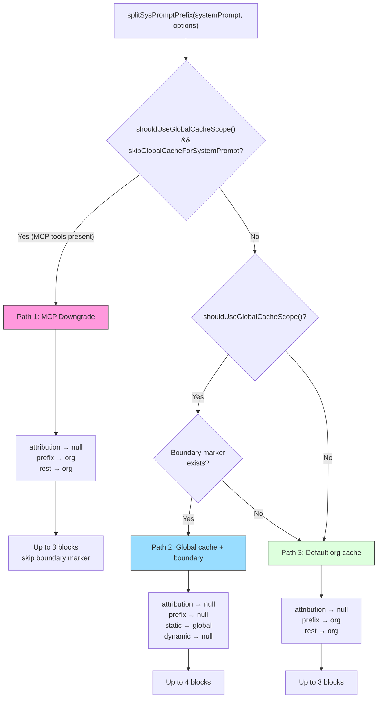
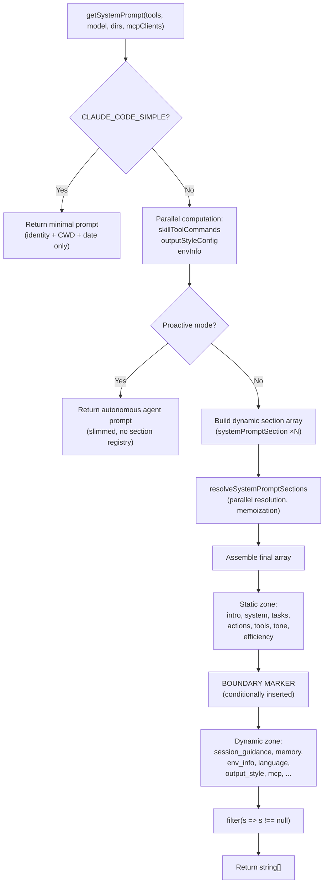

# Chapter 5: System Prompt Architecture

> **Positioning**: This chapter analyzes how CC dynamically assembles the system prompt — section registration and memoization, cache boundary markers, and multi-source priority synthesis. Prerequisites: Chapter 3 (Agent Loop). Target audience: readers wanting to understand how CC dynamically assembles the system prompt, or developers looking to design a prompt architecture for their own Agent.

> Chapter 4 dissected the entire orchestration process of tool execution. Before the model can make any tool call, it needs to first "know who it is" -- and that is precisely the role of the system prompt. This chapter dives deep into the assembly architecture of the system prompt: how sections are registered and memoized, how static and dynamic content are separated by boundary markers, how cache optimization contracts are honored at the API layer, and how multi-source prompts are synthesized by priority into the final instruction set sent to the model.

## 5.1 Why the System Prompt Needs "Architecture"

A naive implementation could hardcode the system prompt as a single string constant. But Claude Code's system prompt faces three engineering challenges:

1. **Volume and Cost**: The complete system prompt includes identity introduction, behavioral guidelines, tool usage instructions, environment information, memory files, MCP instructions, and over ten other sections, totaling tens of thousands of tokens. Retransmitting all of this on every API call means enormous prompt caching costs.
2. **Varying Change Frequencies**: Identity introduction and coding guidelines are identical across all users and all sessions, while environment information (working directory, OS version) varies by session, and MCP server instructions can even change mid-conversation.
3. **Multi-Source Overrides**: Users can customize the prompt via `--system-prompt`, Agent mode has its own dedicated prompt, coordinator mode has an independent prompt, and Loop mode can completely override everything -- the priority between these sources must be unambiguous.

Claude Code's solution is a **sectioned composition architecture**: splitting the system prompt into independent, memoizable sections, managing their lifecycle through a registry, using boundary markers to delineate cache tiers, and ultimately transforming them at the API layer into request blocks with `cache_control`.

> **Interactive Version**: [Click to view the prompt assembly animation](prompt-assembly-viz.html) -- watch 7 sections stack layer by layer as the cache ratio is calculated in real time.

## 5.2 Section Registry: Memoization and Cache Awareness of systemPromptSection

### 5.2.1 Core Abstraction

The minimal unit of the system prompt is a **section**. Each section consists of a name, a compute function, and a cache strategy. This abstraction is defined in `systemPromptSections.ts`:

```typescript
type SystemPromptSection = {
  name: string
  compute: ComputeFn        // () => string | null | Promise<string | null>
  cacheBreak: boolean       // false = memoizable, true = recomputed each turn
}
```

**Source Reference:** `restored-src/src/constants/systemPromptSections.ts:10-14`

Two factory functions create sections:

- **`systemPromptSection(name, compute)`** -- Creates a **memoized section**. The compute function executes only on the first invocation; the result is cached in global state, and subsequent turns directly return the cached value. The cache resets on `/clear` or `/compact`.
- **`DANGEROUS_uncachedSystemPromptSection(name, compute, reason)`** -- Creates a **volatile section**. The compute function is re-executed on every resolve. The `DANGEROUS_` prefix and mandatory `reason` parameter are intentional API friction, reminding developers that this type of section **breaks prompt caching**.

```
┌───────────────────────────────────────────────────────────────────────┐
│                      Section Registry                                 │
│                                                                       │
│  ┌─────────────────────┐   ┌──────────────────────────────────────┐  │
│  │ systemPromptSection │   │ DANGEROUS_uncachedSystemPromptSection│  │
│  │   cacheBreak=false  │   │         cacheBreak=true              │  │
│  └────────┬────────────┘   └────────────┬─────────────────────────┘  │
│           │                              │                            │
│           ▼                              ▼                            │
│  ┌─────────────────────────────────────────────────────────────────┐  │
│  │            resolveSystemPromptSections(sections)                │  │
│  │                                                                 │  │
│  │  for each section:                                              │  │
│  │    if (!cacheBreak && cache.has(name)):                         │  │
│  │      return cache.get(name)    ← memoization hit               │  │
│  │    else:                                                        │  │
│  │      value = await compute()                                    │  │
│  │      cache.set(name, value)    ← write to cache                │  │
│  │      return value                                               │  │
│  └─────────────────────────────────────────────────────────────────┘  │
│                                                                       │
│  Cache storage: STATE.systemPromptSectionCache (Map<string, string|null>) │
│  Reset timing: /clear, /compact → clearSystemPromptSections()        │
└───────────────────────────────────────────────────────────────────────┘
```

**Figure 5-1: Memoization flow of the Section Registry.** Memoized sections (`cacheBreak=false`) are cached in a global Map after first computation; volatile sections (`cacheBreak=true`) are recomputed every time.

### 5.2.2 Resolution Flow

`resolveSystemPromptSections` is the core function that transforms section definitions into actual strings (`restored-src/src/constants/systemPromptSections.ts:43-58`):

```typescript
export async function resolveSystemPromptSections(
  sections: SystemPromptSection[],
): Promise<(string | null)[]> {
  const cache = getSystemPromptSectionCache()
  return Promise.all(
    sections.map(async s => {
      if (!s.cacheBreak && cache.has(s.name)) {
        return cache.get(s.name) ?? null
      }
      const value = await s.compute()
      setSystemPromptSectionCacheEntry(s.name, value)
      return value
    }),
  )
}
```

Several key design decisions:

- **Parallel Resolution**: Uses `Promise.all` to execute all section compute functions in parallel. This is especially important for sections requiring I/O operations (e.g., `loadMemoryPrompt` reading CLAUDE.md files).
- **null is Valid**: A compute function returning `null` indicates that the section does not need to be included in the final prompt. `null` values are also cached, avoiding repeated condition checks on subsequent turns.
- **Cache Storage Location**: The cache is stored in `STATE.systemPromptSectionCache` (`restored-src/src/bootstrap/state.ts:203`), a `Map<string, string | null>`. Choosing global state over module-level variables allows the `/clear` and `/compact` commands to uniformly reset all state.

### 5.2.3 Cache Lifecycle

Cache clearing is handled by the `clearSystemPromptSections` function (`restored-src/src/constants/systemPromptSections.ts:65-68`):

```typescript
export function clearSystemPromptSections(): void {
  clearSystemPromptSectionState()   // clear the Map
  clearBetaHeaderLatches()          // reset beta header latches
}
```

This function is called at two points:

1. **`/clear` command** -- When the user explicitly clears conversation history, all section caches are invalidated, and the next API call will recompute all sections.
2. **`/compact` command** -- When the conversation is compacted, section caches are likewise invalidated. This is because compaction may change context state (e.g., available tool list), and section values computed from old state may no longer be correct.

The accompanying `clearBetaHeaderLatches()` ensures that a new conversation can re-evaluate AFK, fast-mode, and other beta feature headers, rather than carrying over latch values from the previous turn.

## 5.3 When to Use DANGEROUS_uncachedSystemPromptSection

The `DANGEROUS_` prefix is not decorative -- it marks a real engineering trade-off. Let's look at the only usage in the source code:

```typescript
DANGEROUS_uncachedSystemPromptSection(
  'mcp_instructions',
  () =>
    isMcpInstructionsDeltaEnabled()
      ? null
      : getMcpInstructionsSection(mcpClients),
  'MCP servers connect/disconnect between turns',
),
```

**Source Reference:** `restored-src/src/constants/prompts.ts:513-520`

MCP servers can connect or disconnect between two turns of a conversation. If the MCP instructions section were memoized, it would compute with only server A connected on turn 1, caching instructions for A; by turn 3, server B might also be connected, but the cache would still return the old value containing only A -- the model would never learn about B's existence.

This is the use case for `DANGEROUS_uncachedSystemPromptSection`: **when a section's content may change within the conversation's lifecycle, and using stale values would cause functional errors**.

The `reason` parameter in the code comment (`'MCP servers connect/disconnect between turns'`) is not just documentation but also a code review constraint -- any PR introducing a new `DANGEROUS_` section must explain why cache invalidation is necessary.

It's worth noting that the source code also records a case of "downgrading from DANGEROUS to regular caching." The `token_budget` section was once a `DANGEROUS_uncachedSystemPromptSection` that dynamically switched based on `getCurrentTurnTokenBudget()`, but this broke approximately 20K tokens of cache on every budget switch. The solution was to reword the prompt text so it naturally becomes a no-op when there's no budget, thereby downgrading to a regular `systemPromptSection` (`restored-src/src/constants/prompts.ts:540-550`).

## 5.4 Static vs. Dynamic Boundary: SYSTEM_PROMPT_DYNAMIC_BOUNDARY

### 5.4.1 Boundary Marker Definition

An explicit dividing line exists within the system prompt, partitioning content into a "static zone" and a "dynamic zone":

```typescript
export const SYSTEM_PROMPT_DYNAMIC_BOUNDARY =
  '__SYSTEM_PROMPT_DYNAMIC_BOUNDARY__'
```

**Source Reference:** `restored-src/src/constants/prompts.ts:114-115`

This string constant does not appear in the text ultimately sent to the model -- it is an **in-band signal** that exists only within the system prompt array, for the downstream `splitSysPromptPrefix` function to identify and process.

### 5.4.2 Boundary Position and Meaning

In the return array of the `getSystemPrompt` function, the boundary marker is precisely placed between static and dynamic content (`restored-src/src/constants/prompts.ts:560-576`):

```
Return array structure:
[
  getSimpleIntroSection(...)          ─┐
  getSimpleSystemSection()             │ Static zone: identical for all users/sessions
  getSimpleDoingTasksSection()         │ → cacheScope: 'global'
  getActionsSection()                  │
  getUsingYourToolsSection(...)        │
  getSimpleToneAndStyleSection()       │
  getOutputEfficiencySection()        ─┘
  SYSTEM_PROMPT_DYNAMIC_BOUNDARY      ← boundary marker
  session_guidance                    ─┐
  memory (CLAUDE.md)                   │ Dynamic zone: varies by session/user
  env_info_simple                      │ → cacheScope: null (not cached)
  language                             │
  output_style                         │
  mcp_instructions (DANGEROUS)         │
  scratchpad                           │
  ...                                 ─┘
]
```

**Figure 5-2: Static/Dynamic boundary diagram.** The boundary marker divides the system prompt array into two zones, each corresponding to a different cache scope.

The key rule: **All content before the boundary marker is completely identical across all organizations, all users, and all sessions**. This means they can use `scope: 'global'` for cross-organization caching -- a cache prefix computed by one user's API call can be directly hit by any other user's call.

The boundary marker is only inserted when the first-party API provider has global caching enabled:

```typescript
...(shouldUseGlobalCacheScope() ? [SYSTEM_PROMPT_DYNAMIC_BOUNDARY] : []),
```

`shouldUseGlobalCacheScope()` (`restored-src/src/utils/betas.ts:227-231`) checks that the API provider is `'firstParty'` (i.e., directly using the Anthropic API) and that experimental beta features are not disabled via environment variables. Third-party providers (e.g., access via Foundry) do not use global caching.

### 5.4.3 Pushing Session Variations Past the Boundary

The source code contains a carefully written comment explaining why `getSessionSpecificGuidanceSection` exists (`restored-src/src/constants/prompts.ts:343-347`):

> Session-variant guidance that would fragment the cacheScope:'global' prefix if placed before SYSTEM_PROMPT_DYNAMIC_BOUNDARY. Each conditional here is a runtime bit that would otherwise multiply the Blake2b prefix hash variants (2^N).

This reveals a subtle but critical design constraint: **the static zone cannot contain any conditional branches that vary by session**. If the available tool list, Skill commands, Agent tools, or other runtime information appeared before the boundary, each tool combination would produce a different Blake2b prefix hash, causing the number of global cache variants to grow exponentially (2^N, where N is the number of conditional bits), effectively reducing the hit rate to zero.

Therefore, all content depending on runtime state -- tool guidance (session guidance), memory files, environment information, language preferences -- is placed in the dynamic zone after the boundary, as memoized sections (`systemPromptSection`) rather than static strings.

## 5.5 The Three Code Paths of splitSysPromptPrefix

`splitSysPromptPrefix` (`restored-src/src/utils/api.ts:321-435`) is the bridge that transforms the logical system prompt array into `SystemPromptBlock[]` with cache control for the API request. It selects among three different code paths based on runtime conditions.



**Figure 5-3: splitSysPromptPrefix three-path flowchart.** Based on global cache features and MCP tool presence, the function selects different cache strategies.

### 5.5.1 Path 1: MCP Downgrade Path

**Trigger Condition:** `shouldUseGlobalCacheScope() === true` and `options.skipGlobalCacheForSystemPrompt === true`

When MCP tools are present in the session, the tool schemas themselves are user-level dynamic content that cannot be globally cached. In this case, even though the static zone of the system prompt could be globally cached, the presence of tool schemas greatly diminishes the actual benefit of global caching. Therefore, `splitSysPromptPrefix` chooses to **downgrade to org-level caching**.

```typescript
// Path 1 core logic (restored-src/src/utils/api.ts:332-359)
for (const prompt of systemPrompt) {
  if (!prompt) continue
  if (prompt === SYSTEM_PROMPT_DYNAMIC_BOUNDARY) continue // skip boundary
  if (prompt.startsWith('x-anthropic-billing-header')) {
    attributionHeader = prompt
  } else if (CLI_SYSPROMPT_PREFIXES.has(prompt)) {
    systemPromptPrefix = prompt
  } else {
    rest.push(prompt)
  }
}
// Result: [attribution:null, prefix:org, rest:org]
```

The boundary marker is skipped directly (`continue`), and all non-special blocks are merged into a single `org`-level cache block. The `skipGlobalCacheForSystemPrompt` value comes from a check in `claude.ts` (`restored-src/src/services/api/claude.ts:1210-1214`): the downgrade is triggered only when MCP tools are actually rendered into the request (rather than `defer_loading`).

### 5.5.2 Path 2: Global Cache + Boundary Path

**Trigger Condition:** `shouldUseGlobalCacheScope() === true`, not downgraded by MCP, and the boundary marker exists in the system prompt

This is the primary path for first-party users without MCP tools, and it offers the highest cache efficiency:

```typescript
// Path 2 core logic (restored-src/src/utils/api.ts:362-409)
const boundaryIndex = systemPrompt.findIndex(
  s => s === SYSTEM_PROMPT_DYNAMIC_BOUNDARY,
)
if (boundaryIndex !== -1) {
  for (let i = 0; i < systemPrompt.length; i++) {
    const block = systemPrompt[i]
    if (!block || block === SYSTEM_PROMPT_DYNAMIC_BOUNDARY) continue
    if (block.startsWith('x-anthropic-billing-header')) {
      attributionHeader = block
    } else if (CLI_SYSPROMPT_PREFIXES.has(block)) {
      systemPromptPrefix = block
    } else if (i < boundaryIndex) {
      staticBlocks.push(block)        // before boundary → static
    } else {
      dynamicBlocks.push(block)       // after boundary → dynamic
    }
  }
  // Result: [attribution:null, prefix:null, static:global, dynamic:null]
}
```

This path produces up to **4 text blocks**:

| Block | cacheScope | Description |
|-------|-----------|-------------|
| attribution header | `null` | Billing attribution header, not cached |
| system prompt prefix | `null` | CLI prefix identifier, not cached |
| static content | `'global'` | Core instructions cacheable across organizations |
| dynamic content | `null` | Per-session content, not cached |

The static block using `scope: 'global'` means the Anthropic API backend can share this cache prefix across all Claude Code users. Given that the static zone typically contains tens of thousands of tokens of identity introduction and behavioral guidelines, the computational savings from this cache under high concurrency are enormous.

### 5.5.3 Path 3: Default Org Cache Path

**Trigger Condition:** Global cache feature is not enabled (third-party providers), or the boundary marker does not exist

This is the simplest fallback path:

```typescript
// Path 3 core logic (restored-src/src/utils/api.ts:411-434)
for (const block of systemPrompt) {
  if (!block) continue
  if (block.startsWith('x-anthropic-billing-header')) {
    attributionHeader = block
  } else if (CLI_SYSPROMPT_PREFIXES.has(block)) {
    systemPromptPrefix = block
  } else {
    rest.push(block)
  }
}
// Result: [attribution:null, prefix:org, rest:org]
```

All non-special content is merged into a single block using `org`-level caching. This is sufficient for third-party providers -- users within the same organization share the same system prompt prefix and can still achieve organization-level cache hits.

### 5.5.4 From splitSysPromptPrefix to API Request

`buildSystemPromptBlocks` (`restored-src/src/services/api/claude.ts:3213-3237`) is the direct consumer of `splitSysPromptPrefix`. It transforms `SystemPromptBlock[]` into the `TextBlockParam[]` format expected by the Anthropic API:

```typescript
export function buildSystemPromptBlocks(
  systemPrompt: SystemPrompt,
  enablePromptCaching: boolean,
  options?: { skipGlobalCacheForSystemPrompt?: boolean; querySource?: QuerySource },
): TextBlockParam[] {
  return splitSysPromptPrefix(systemPrompt, {
    skipGlobalCacheForSystemPrompt: options?.skipGlobalCacheForSystemPrompt,
  }).map(block => ({
    type: 'text' as const,
    text: block.text,
    ...(enablePromptCaching && block.cacheScope !== null && {
      cache_control: getCacheControl({
        scope: block.cacheScope,
        querySource: options?.querySource,
      }),
    }),
  }))
}
```

The mapping rule is straightforward: blocks with a non-`null` `cacheScope` receive a `cache_control` property; `null` blocks do not. The API backend uses the value of `cache_control.scope` (`'global'` or `'org'`) to determine the caching sharing scope.

## 5.6 System Prompt Build Flow

### 5.6.1 The Complete Flow of getSystemPrompt

`getSystemPrompt` (`restored-src/src/constants/prompts.ts:444-577`) is the main entry point for building the system prompt. It accepts a tool list, model name, additional working directories, and MCP client list, returning a `string[]` array.



**Figure 5-4: System prompt build flowchart.** The complete data flow from entry point to final return.

The build process has three fast paths:

1. **CLAUDE_CODE_SIMPLE mode**: When the `CLAUDE_CODE_SIMPLE` environment variable is true, it directly returns a minimal prompt containing only identity, working directory, and date. This is primarily for testing and debugging scenarios.
2. **Proactive mode**: When the `PROACTIVE` or `KAIROS` feature flags are enabled and active, it returns a slimmed autonomous agent prompt. Note that this path **bypasses the section registry** and directly assembles a string array.
3. **Standard path**: Goes through the full section registration, resolution, and static/dynamic partitioning flow.

### 5.6.2 Section Registry Overview

The dynamic sections registered in the standard path (`restored-src/src/constants/prompts.ts:491-555`) constitute all content in the dynamic zone:

| Section Name | Type | Content Description |
|-------------|------|---------------------|
| `session_guidance` | Memoized | Tool guidance, interaction mode hints |
| `memory` | Memoized | CLAUDE.md memory file content (see Chapter 6) |
| `ant_model_override` | Memoized | Anthropic internal model override instructions |
| `env_info_simple` | Memoized | Working directory, OS, Shell, and other environment info |
| `language` | Memoized | Language preference settings |
| `output_style` | Memoized | Output style configuration |
| `mcp_instructions` | **Volatile** | MCP server instructions (may change mid-conversation) |
| `scratchpad` | Memoized | Scratchpad instructions |
| `frc` | Memoized | Function result cleanup instructions |
| `summarize_tool_results` | Memoized | Tool result summarization instructions |
| `numeric_length_anchors` | Memoized | Length anchors (Ant internal only) |
| `token_budget` | Memoized | Token budget instructions (feature-gated) |
| `brief` | Memoized | Briefing section (KAIROS feature-gated) |

The only `DANGEROUS_uncachedSystemPromptSection` is `mcp_instructions` -- consistent with the analysis in Section 5.3. All other sections are memoized, computed once within the session lifecycle and unchanged thereafter.

## 5.7 Priority of buildEffectiveSystemPrompt

`getSystemPrompt` builds the "default system prompt." But in actual invocations, multiple sources may override or supplement this default. `buildEffectiveSystemPrompt` (`restored-src/src/utils/systemPrompt.ts:41-123`) is responsible for synthesizing the final effective prompt by priority.

### 5.7.1 Priority Chain

```
Priority 0 (highest): overrideSystemPrompt
  ↓ when absent
Priority 1: coordinator system prompt
  ↓ when absent
Priority 2: agent system prompt
  ↓ when absent
Priority 3: customSystemPrompt (--system-prompt)
  ↓ when absent
Priority 4 (lowest): defaultSystemPrompt (output of getSystemPrompt)

+ appendSystemPrompt is always appended at the end (except for override)
```

### 5.7.2 Behavior at Each Priority Level

**Override:** When `overrideSystemPrompt` exists (e.g., loop instructions set by Loop mode), it directly returns an array containing only that string, ignoring all other sources, **including `appendSystemPrompt`** (`restored-src/src/utils/systemPrompt.ts:56-58`):

```typescript
if (overrideSystemPrompt) {
  return asSystemPrompt([overrideSystemPrompt])
}
```

**Coordinator:** When the `COORDINATOR_MODE` feature flag is enabled and the `CLAUDE_CODE_COORDINATOR_MODE` environment variable is true, the coordinator-specific system prompt replaces the default. Note the lazy import of the `coordinatorMode` module to avoid circular dependencies (`restored-src/src/utils/systemPrompt.ts:62-75`).

**Agent:** When `mainThreadAgentDefinition` is set, behavior depends on whether Proactive mode is active:

- **In Proactive mode**: Agent instructions are **appended** to the end of the default prompt, rather than replacing it. This is because the default prompt in Proactive mode is already a slimmed autonomous agent identity; the Agent definition merely adds domain instructions on top -- consistent with behavior in teammates mode.
- **In normal mode**: Agent instructions **replace** the default prompt.

**Custom:** The prompt specified by the `--system-prompt` command-line argument replaces the default prompt.

**Default:** The complete output of `getSystemPrompt`.

**Append:** If `appendSystemPrompt` is set, it is appended to the end of the final array. This provides a mechanism for injecting additional instructions without completely overriding the system prompt.

### 5.7.3 Final Synthesis Logic

When there is no override or coordinator, the core three-way selection logic is as follows (`restored-src/src/utils/systemPrompt.ts:115-122`):

```typescript
return asSystemPrompt([
  ...(agentSystemPrompt
    ? [agentSystemPrompt]
    : customSystemPrompt
      ? [customSystemPrompt]
      : defaultSystemPrompt),
  ...(appendSystemPrompt ? [appendSystemPrompt] : []),
])
```

This is a clean ternary chain: Agent > Custom > Default, plus an optional append. `asSystemPrompt` is a branded type conversion ensuring type safety of the return value (see Chapter 8 for discussion on the type system).

## 5.8 Cache Optimization Contract: Design Constraints and Pitfalls

The system prompt architecture establishes an implicit **cache optimization contract**. Violating this contract causes cache hit rates to plummet. Here are the key constraints distilled from the source code:

### Constraint 1: The Static Zone Must Not Contain Session Variables

As discussed in Section 5.4.3, any conditional branch before the boundary exponentially increases the number of hash variants. PRs #24490 and #24171 documented this type of bug: a developer inadvertently placed an `if (hasAgentTool)` condition in the static zone, causing the global cache hit rate to plummet from 95% to below 10%.

### Constraint 2: DANGEROUS Sections Must Have Sufficient Justification

Every use of `DANGEROUS_uncachedSystemPromptSection` is scrutinized in code review. The `reason` parameter, while not used at runtime (note the `_` prefix on the parameter name: `_reason`), serves as an anchor for PR review -- reviewers check whether the justification is sufficient and whether alternatives exist to downgrade to a memoized section.

### Constraint 3: MCP Tools Trigger Global Cache Downgrade

When MCP tools are present, `splitSysPromptPrefix` automatically downgrades to org-level caching. This decision is based on an engineering judgment: MCP tool schemas are user-level dynamic content, and even though the static zone of the system prompt could be globally cached, the presence of tool schema blocks means the API request already contains large blocks that cannot be globally cached. The marginal benefit of global caching for the system prompt is not sufficient to justify the additional complexity.

### Constraint 4: The Boundary Marker Position Is an Architectural Invariant

The source code comments are blunt (`restored-src/src/constants/prompts.ts:572`):

```
// === BOUNDARY MARKER - DO NOT MOVE OR REMOVE ===
```

Moving or deleting the boundary marker is not a code change -- it is an architectural change that alters the caching behavior for all first-party users.

## 5.8 Pattern Extraction

From the system prompt architecture, the following reusable engineering patterns can be extracted:

### Pattern 1: Sectioned Memoization

- **Problem Solved:** In large prompts, some content is static and some is dynamic; recomputing everything wastes resources.
- **Solution:** Split the prompt into independent sections, each with a clear cache strategy (memoized vs. volatile). Distinguish the two types through factory functions, adding API friction for the volatile type (`DANGEROUS_` prefix + mandatory `reason`).
- **Prerequisites:** Requires a global state manager holding a cache Map, and well-defined cache invalidation timings (e.g., `/clear`, `/compact`).
- **Code Template:**
  ```
  memoizedSection(name, computeFn)        → cached after first computation
  volatileSection(name, computeFn, reason) → recomputed each turn, reason required
  resolveAll(sections)                     → Promise.all parallel resolution
  ```

### Pattern 2: Cache Boundary Partitioning

- **Problem Solved:** Prompt prefixes shared across multiple users need global caching, but session-specific content destroys cache hit rates.
- **Solution:** Insert an explicit boundary marker in the prompt array, dividing content into a "globally cacheable static zone" and a "per-session dynamic zone." Downstream functions assign different `cacheScope` values based on boundary position.
- **Prerequisites:** The API backend supports multi-level cache scopes (e.g., `global` / `org` / `null`).
- **Key Constraint:** The static zone before the boundary must not contain any conditional branches that vary by session; otherwise, the number of hash variants grows exponentially.

### Pattern 3: Priority Chain Composition

- **Problem Solved:** Multiple sources (user-customized, Agent mode, coordinator mode, default) may all provide system prompts, requiring clear priorities.
- **Solution:** Define a linear priority chain (override > coordinator > agent > custom > default), plus an always-appended `append` mechanism. Use a ternary chain to maintain linear readability.
- **Prerequisites:** Unified input interfaces for all priority sources (all as `string | string[]`).

## 5.9 What Users Can Do

Based on the system prompt architecture analyzed in this chapter, here are recommendations that readers can directly apply in their own AI Agent projects:

1. **Build a section registry for your prompts.** Don't hardcode the system prompt as a single string. Split it into independent, named sections, each annotated with whether it's cacheable. The benefit is not just cache efficiency but also maintainability -- when you need to modify a behavioral directive, you can precisely locate the corresponding section rather than searching through a massive string.

2. **Add API friction for volatile sections.** If parts of your prompt content need to be recomputed each turn (e.g., dynamic tool lists, real-time status information), follow the design of `DANGEROUS_uncachedSystemPromptSection`: require callers to provide a reason for why per-turn recomputation is necessary. This friction is especially valuable in code reviews -- it forces developers to explicitly weigh cache efficiency against content freshness.

3. **Push session variables past the cache boundary.** If the API you use supports prompt caching, ensure the prefix portion of the prompt (the range over which the cache key is computed) does not contain content that varies by user, session, or runtime state. Claude Code's `SYSTEM_PROMPT_DYNAMIC_BOUNDARY` marker is a direct implementation of this strategy.

4. **Define a clear prompt priority chain.** When your system supports multiple operating modes (autonomous Agent, coordinator, user-customized, etc.), define explicit priorities for prompt sources of each mode. Avoid "merging" prompts from different sources -- using "replace" semantics is safer and more predictable.

5. **Monitor cache hit rates.** The value of the system prompt architecture is fully reflected in cache hit rates. If your cache hit rate suddenly drops, check whether a new conditional branch has been introduced into the static zone -- this is a pitfall the Claude Code team encountered in PR #24490.

## 5.10 Summary

The system prompt architecture is the "invisible but omnipresent" infrastructure of Claude Code. Its design embodies three core principles:

1. **Sectioned Composition**: Through the `systemPromptSection` registry, the prompt is decomposed into independent, memoizable sections, each with a clear name, compute function, and cache strategy.
2. **Boundary Partitioning**: The `SYSTEM_PROMPT_DYNAMIC_BOUNDARY` marker divides content into a globally cacheable static zone and a per-session dynamic zone, with `splitSysPromptPrefix`'s three paths selecting the optimal cache strategy based on runtime conditions.
3. **Priority Synthesis**: `buildEffectiveSystemPrompt` supports multiple operating modes through a clear five-level priority chain (override > coordinator > agent > custom > default + append), while maintaining linear code readability.

The "success criterion" for this architecture is not functional correctness -- even hardcoding the entire system prompt as a single string would work perfectly fine functionally. Its value lies in **cost efficiency**: through careful cache tier design, enormous prompt processing overhead is saved across millions of daily API calls. The next chapter will discuss a key input to the system prompt architecture -- how CLAUDE.md memory files are loaded and injected (see Chapter 6).
