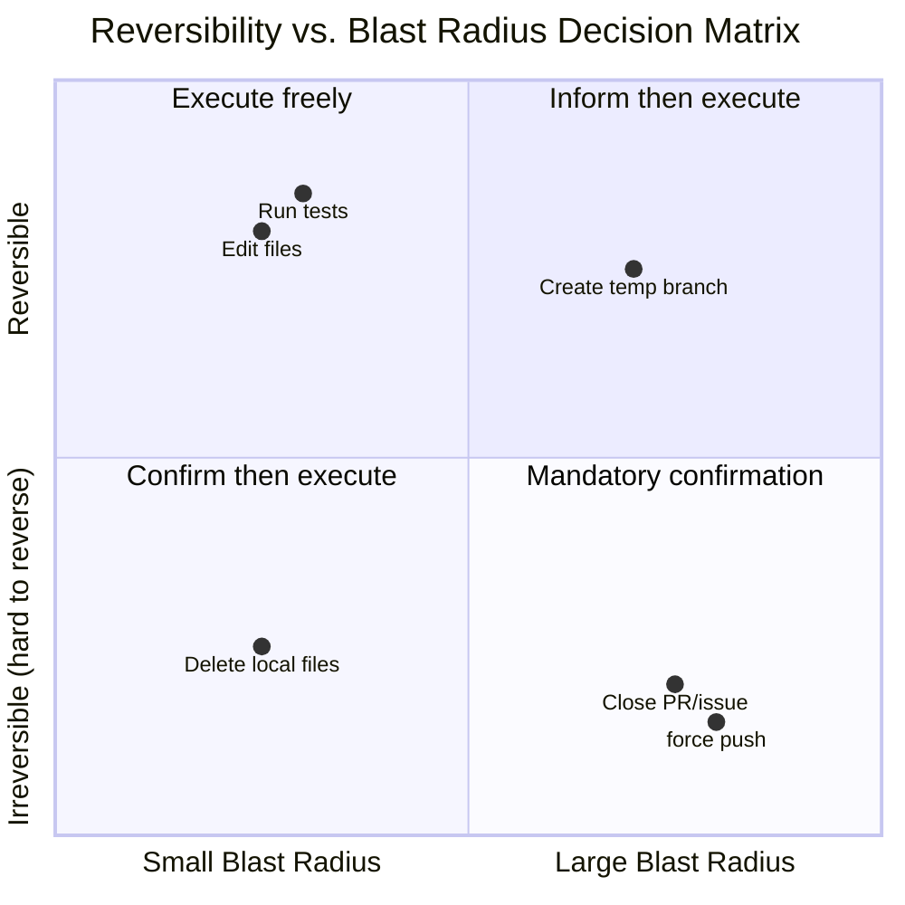

# Chapter 6: Steering Behavior Through Prompts

> Chapter 5 dissected the assembly architecture of the system prompt -- section registration, cache boundaries, multi-source synthesis. But architecture is merely the skeleton; what truly makes Claude Code behave "like an experienced engineer" is the muscle attached to that skeleton: carefully worded behavioral directives. This chapter distills 6 reusable behavior steering patterns, each with source code examples, the principles behind their effectiveness, and templates you can directly adopt in your own prompts.

## 6.1 The Nature of Behavior Steering: Setting Boundaries in the Generation Probability Space

The output of a large language model is a sampling process over a probability distribution. Behavioral directives in the system prompt are essentially fences erected in this probability space -- raising the probability of desired behavior and suppressing undesired behavior. But the wording of those fences determines whether they function as a solid wall or a blurry line.

Reading through Claude Code's system prompt source code (`restored-src/src/constants/prompts.ts` and `restored-src/src/tools/BashTool/prompt.ts`), one discovers that Anthropic's engineers did not pile up directives haphazardly but formed an implicit pattern language. These patterns work not just because they "say the right things," but because their wording structure aligns with the model's attention mechanisms and instruction-following characteristics.

This chapter makes these patterns explicit, naming them as 6 behavior steering patterns:

1. Minimalism Directive
2. Progressive Escalation
3. Reversibility Awareness
4. Tool Preference Steering
5. Agent Delegation Protocol
6. Numeric Anchoring

## 6.2 Pattern 1: Minimalism Directive

### 6.2.1 Pattern Definition

**Core Idea:** Constrain the model's "helpfulness" tendency to the actual scope of the task by explicitly prohibiting over-engineering.

Large language models naturally tend to "do a little extra" -- adding additional error handling, supplementing doc comments, introducing abstraction layers. This is a virtue in conversational scenarios but a disaster in code generation. The Minimalism Directive uses specific counter-examples to teach the model that "what not to do" is more important than "what to do."

### 6.2.2 Source Code Examples

**Example 1: Three Lines of Code Over Premature Abstraction**

```
Don't create helpers, utilities, or abstractions for one-time operations.
Don't design for hypothetical future requirements. The right amount of
complexity is what the task actually requires — no speculative abstractions,
but no half-finished implementations either. Three similar lines of code
is better than a premature abstraction.
```

**Source Location:** `restored-src/src/constants/prompts.ts:203`

The last sentence -- "Three similar lines of code is better than a premature abstraction" -- is the most brilliant stroke in the entire Minimalism Directive. It provides a **concrete numerical threshold** -- three lines -- giving the model a clear benchmark when facing the "should I extract a common function" decision. Without this anchor, the model would default to DRY (Don't Repeat Yourself), and DRY in the context of AI-assisted programming often leads to over-abstraction.

**Example 2: Don't Add Features Beyond What Was Asked**

```
Don't add features, refactor code, or make "improvements" beyond what was
asked. A bug fix doesn't need surrounding code cleaned up. A simple feature
doesn't need extra configurability. Don't add docstrings, comments, or type
annotations to code you didn't change. Only add comments where the logic
isn't self-evident.
```

**Source Location:** `restored-src/src/constants/prompts.ts:201`

Note the structure of this directive: first a general principle ("don't add features beyond what was asked"), then three specific counter-examples (a bug fix doesn't need surrounding code cleaned up, a simple feature doesn't need extra configurability, don't add comments to unchanged code). This "general rule + counter-examples" structure is very effective because the model needs to map abstract principles to concrete scenarios when following instructions, and counter-examples provide anchoring points for this mapping.

**Example 3: Don't Add Defenses for Impossible Scenarios (ant-only)**

```
Don't add error handling, fallbacks, or validation for scenarios that can't
happen. Trust internal code and framework guarantees. Only validate at system
boundaries (user input, external APIs). Don't use feature flags or
backwards-compatibility shims when you can just change the code.
```

**Source Location:** `restored-src/src/constants/prompts.ts:202`

This directive strikes directly at a common LLM behavioral pattern: overly defensive programming. The model has seen extensive "best practice" articles in its training data that emphasize handling every possible error. But in actual internal code, many error paths will never be triggered. This directive provides a new judgment framework through the phrase "Trust internal code and framework guarantees": distinguish between system boundaries and internal calls.

### 6.2.3 Why It Works

The Minimalism Directive works because of three mechanisms:

1. **Counter-examples are easier to follow than positive rules.** "Don't do X" is more precise than "only do Y," because the boundaries of X are clearer than the boundaries of Y. The model can check each generated token against "is this doing X."
2. **Specific numbers override default heuristics.** A numerical anchor like "three lines of repeated code" overrides the model's built-in DRY heuristic. Without a specific number, the model falls back to the most common pattern in its training data.
3. **Scenario classification reduces ambiguity.** Directives like "a bug fix doesn't need surrounding code cleaned up" transform the fuzzy question of "when should I do a little extra" into a clear classification task: "is the current task a bug fix or a refactor?"

### 6.2.4 Reusable Template

```
[Minimalism Directive Template]

Don't add {features/refactoring/improvements} beyond the task scope.
{Task type A} doesn't need {common over-engineering behavior A}.
{Task type B} doesn't need {common over-engineering behavior B}.
{N} lines of repeated code is better than a premature abstraction.
Only {take extra action} when {clear boundary condition}.
```

## 6.3 Pattern 2: Progressive Escalation

### 6.3.1 Pattern Definition

**Core Idea:** Define a middle path between "giving up" and "infinite loops," guiding the model to first diagnose, then adjust, and finally ask for help.

LLMs have two extreme tendencies when facing failure: either immediately giving up and asking the user for help, or endlessly retrying the exact same operation. The Progressive Escalation pattern locks the model's failure response into a reasonable range by defining a clear three-stage protocol -- diagnose, adjust, escalate.

### 6.3.2 Source Code Examples

**Example 1: Three-Stage Failure Handling**

```
If an approach fails, diagnose why before switching tactics — read the error,
check your assumptions, try a focused fix. Don't retry the identical action
blindly, but don't abandon a viable approach after a single failure either.
Escalate to the user with ask_user_question only when you're genuinely stuck
after investigation, not as a first response to friction.
```

**Source Location:** `restored-src/src/constants/prompts.ts:233`

This directive defines a complete failure handling protocol in a single paragraph:

- **Stage 1 (Diagnose):** "read the error, check your assumptions" -- first understand what happened
- **Stage 2 (Adjust):** "try a focused fix" -- make a targeted modification based on the diagnosis
- **Stage 3 (Escalate):** "Escalate to the user... only when you're genuinely stuck" -- request help only at genuine dead ends

The key design lies in the tension between two "don'ts": "Don't retry the identical action blindly" (prohibits infinite loops) and "don't abandon a viable approach after a single failure" (prohibits premature giving up). This dual-sided constraint forces the model to find a middle path between the two extremes.

**Example 2: Diagnosis-First for Git Operations**

```
Before running destructive operations (e.g., git reset --hard, git push
--force, git checkout --), consider whether there is a safer alternative
that achieves the same goal. Only use destructive operations when they are
truly the best approach.
```

**Source Location:** `restored-src/src/tools/BashTool/prompt.ts:306`

This directive requires a "is there a safer alternative" evaluation before executing high-risk operations. It doesn't simply prohibit these operations but requires the model to complete a reasoning step before making a choice.

**Example 3: Diagnostic Alternative to Sleep Commands**

```
Do not retry failing commands in a sleep loop — diagnose the root cause.
```

**Source Location:** `restored-src/src/tools/BashTool/prompt.ts:318`

This is the most minimal form of the Progressive Escalation pattern: a single sentence simultaneously containing a prohibition ("don't retry in a sleep loop") and an alternative ("diagnose the root cause"). It specifically targets a common LLM behavior pattern -- when a command fails, the model may `sleep && retry` in a loop, which is disastrous in an interactive environment.

### 6.3.3 Why It Works

The effectiveness of Progressive Escalation comes from:

1. **Dual-sided constraints create tension.** Simultaneously defining "don't give up too quickly" and "don't retry infinitely" forces the model to perform an explicit reasoning step after each failure: "am I retrying blindly, or making an informed adjustment?"
2. **Stage ordering maps to Chain-of-Thought.** The diagnose -> adjust -> escalate sequence naturally aligns with the model's chain of thought. The model can directly encode this protocol as steps in its reasoning chain.
3. **Escalation as last resort.** Setting "ask the user" as the final option reduces unnecessary interaction interruptions and improves autonomous completion rates.

### 6.3.4 Reusable Template

```
[Progressive Escalation Template]

When {operation} fails, first {diagnostic action} ({specific diagnostic steps}).
Don't blindly retry the same operation, but don't abandon a viable approach
after a single failure either.
Only {escalate action} when {escalation condition}, not as a first response
to friction.
```

## 6.4 Pattern 3: Reversibility Awareness

### 6.4.1 Pattern Definition

**Core Idea:** Classify operations by their reversibility and blast radius, establishing a confirmation framework for high-risk operations.

This is the most complex and most carefully designed pattern in Claude Code's prompt engineering. It doesn't simply list "dangerous operations" but establishes a complete risk assessment framework, teaching the model to "measure twice, cut once."

### 6.4.2 Source Code Examples

**Example 1: Reversibility Analysis Framework**

```
Carefully consider the reversibility and blast radius of actions. Generally
you can freely take local, reversible actions like editing files or running
tests. But for actions that are hard to reverse, affect shared systems beyond
your local environment, or could otherwise be risky or destructive, check
with the user before proceeding.
```

**Source Location:** `restored-src/src/constants/prompts.ts:258`

This directive introduces two key dimensions: **reversibility** and **blast radius**. These two dimensions form a 2x2 decision matrix:



**Figure 6-1: Reversibility vs. Blast Radius decision matrix.** Claude Code classifies operations into four categories using these two dimensions, from "execute freely" to "mandatory confirmation."

**Example 2: Exhaustive List of High-Risk Operations**

The source code provides four major categories of operations requiring confirmation, each with specific examples (`restored-src/src/constants/prompts.ts:261-264`):

| Risk Category | Original Text | Specific Examples |
|--------------|---------------|-------------------|
| Destructive operations | Destructive operations | Deleting files/branches, dropping database tables, killing processes, rm -rf, overwriting uncommitted changes |
| Hard-to-reverse operations | Hard-to-reverse operations | force push, git reset --hard, amending published commits, removing/downgrading dependencies, modifying CI/CD pipelines |
| Actions visible to others | Actions visible to others | Pushing code, creating/closing/commenting on PRs or issues, sending messages (Slack/email/GitHub), modifying shared infrastructure |
| Third-party uploads | Uploading content to third-party tools | Uploading to diagram renderers, pastebin, gist (may be cached or indexed) |

**Example 3: Git Safety Protocol**

```
Git Safety Protocol:
- NEVER update the git config
- NEVER run destructive git commands (push --force, reset --hard, checkout .,
  restore ., clean -f, branch -D) unless the user explicitly requests these
  actions.
- NEVER skip hooks (--no-verify, --no-gpg-sign, etc) unless the user
  explicitly requests it
- NEVER run force push to main/master, warn the user if they request it
- CRITICAL: Always create NEW commits rather than amending, unless the user
  explicitly requests a git amend. When a pre-commit hook fails, the commit
  did NOT happen — so --amend would modify the PREVIOUS commit, which may
  result in destroying work or losing previous changes.
```

**Source Location:** `restored-src/src/tools/BashTool/prompt.ts:87-94`

The Git Safety Protocol is the most refined implementation of the Reversibility Awareness pattern. Note several design points:

1. **NEVER in uppercase** -- not "avoid" or "try not to," but absolute prohibition. Uppercase letters function similarly to "increasing attention weight" in prompts.
2. **"unless the user explicitly requests"** -- Each NEVER rule comes with an explicit exemption condition, preventing the model from refusing when the user explicitly asks.
3. **CRITICAL marker + causal explanation** -- For the most subtle rule about amend vs. new commit, not only is it marked CRITICAL, but it explains **why** the rule exists (when a hook fails, the commit hasn't happened yet, and amend would modify the previous commit). Causal explanations enable the model to generalize the spirit of the rule to new scenarios, rather than merely following the literal text mechanically.

**Example 4: One-Time Authorization Does Not Equal Permanent Authorization**

```
A user approving an action (like a git push) once does NOT mean that they
approve it in all contexts, so unless actions are authorized in advance in
durable instructions like CLAUDE.md files, always confirm first.
Authorization stands for the scope specified, not beyond. Match the scope
of your actions to what was actually requested.
```

**Source Location:** `restored-src/src/constants/prompts.ts:258`

This directive strikes at a dangerous LLM tendency: generalizing from a single permission to universal permission. The model might see in context that the user previously agreed to `git push` and then execute push without confirmation in subsequent different scenarios. This rule establishes a precise concept of authorization scope through the phrase "scope specified, not beyond."

### 6.4.3 Why It Works

The effectiveness of Reversibility Awareness comes from:

1. **Dimensional analysis replaces enumeration.** Rather than listing all dangerous operations (impossible to be exhaustive), it teaches the model to autonomously evaluate using the two dimensions of "reversibility" and "blast radius." The specific example list serves as supplementary calibration, not comprehensive coverage.
2. **NEVER + unless creates precise exemptions.** The combination of absolute prohibition + explicit exception prevents the model's "creative interpretation" in gray areas.
3. **Causal explanations promote generalization.** Explaining "why" a rule exists (like the causal chain of amend) enables the model to derive correct behavior in unseen scenarios.
4. **"Measure twice, cut once" as a mnemonic.** This English idiom at the end serves as a cognitive anchor for the entire framework, helping the model recall the full risk assessment protocol when facing edge cases.

### 6.4.4 Reusable Template

```
[Reversibility Awareness Template]

Before executing actions, evaluate their reversibility and blast radius.
You may freely execute {list of reversible local operations}.
For {irreversible/shared system} operations, confirm with the user before executing.

NEVER:
- {Dangerous operation 1}, unless the user explicitly requests
- {Dangerous operation 2}, unless the user explicitly requests
- [CRITICAL] {Most subtle dangerous operation}, because {causal explanation}

A user approving {operation} once does NOT mean approval in all contexts.
Authorization is limited to the scope specified.
```

## 6.5 Pattern 4: Tool Preference Steering

### 6.5.1 Pattern Definition

**Core Idea:** Redirect the model's tool selection from generic Bash commands to specialized tools through tool description text.

Claude Code provides rich specialized tools (Read, Edit, Write, Glob, Grep), but the model's training data is full of `cat`, `grep`, `sed`, `find`, and other Unix commands. Without guidance, the model naturally tends to execute these commands through the Bash tool. The Tool Preference Steering pattern inserts redirection instructions at the earliest position in tool descriptions, intercepting the model's default tool selection path.

### 6.5.2 Source Code Examples

**Example 1: Front-loaded Interception in Bash Tool Description**

```
IMPORTANT: Avoid using this tool to run find, grep, cat, head, tail, sed,
awk, or echo commands, unless explicitly instructed or after you have
verified that a dedicated tool cannot accomplish your task. Instead, use the
appropriate dedicated tool as this will provide a much better experience for
the user:

 - File search: Use Glob (NOT find or ls)
 - Content search: Use Grep (NOT grep or rg)
 - Read files: Use Read (NOT cat/head/tail)
 - Edit files: Use Edit (NOT sed/awk)
 - Write files: Use Write (NOT echo >/cat <<EOF)
 - Communication: Output text directly (NOT echo/printf)
```

**Source Location:** `restored-src/src/tools/BashTool/prompt.ts:280-291` (assembled by `getSimplePrompt()`)

The design of this directive has three layers of sophistication:

1. **Positional priority.** This text appears at the beginning of the Bash tool description, immediately following the basic functionality explanation. When the model begins considering calling the Bash tool, this redirection directive is the first constraint it encounters.
2. **NOT parenthetical comparison.** Each mapping rule lists both "what to use" and "what not to use." The format `Use Grep (NOT grep or rg)` creates a direct binary comparison, reducing the model's decision hesitation.
3. **User experience justification.** "this will provide a much better experience for the user" provides a reason for following this rule, rather than merely issuing an unconditional command.

**Example 2: Redundant Reinforcement in System Prompt**

```
Do NOT use the Bash to run commands when a relevant dedicated tool is
provided. Using dedicated tools allows the user to better understand and
review your work. This is CRITICAL to assisting the user:
  - To read files use Read instead of cat, head, tail, or sed
  - To edit files use Edit instead of sed or awk
  - To create files use Write instead of cat with heredoc or echo redirection
  - To search for files use Glob instead of find or ls
  - To search the content of files, use Grep instead of grep or rg
  - Reserve using the Bash exclusively for system commands and terminal
    operations that require shell execution.
```

**Source Location:** `restored-src/src/constants/prompts.ts:291-302`

Note that this content **nearly duplicates** the mapping table in the Bash tool description. This is not an oversight but intentional **redundant reinforcement**. Placing the same directive in both the system prompt and tool description locations ensures that regardless of which path the model's attention takes, it encounters the constraint.

**Example 3: Conditional Adaptation for Embedded Tools**

```typescript
const embedded = hasEmbeddedSearchTools()

const toolPreferenceItems = [
  ...(embedded
    ? []
    : [
        `File search: Use ${GLOB_TOOL_NAME} (NOT find or ls)`,
        `Content search: Use ${GREP_TOOL_NAME} (NOT grep or rg)`,
      ]),
  `Read files: Use ${FILE_READ_TOOL_NAME} (NOT cat/head/tail)`,
  // ...
]
```

**Source Location:** `restored-src/src/tools/BashTool/prompt.ts:280-291`

When Ant internal builds (ant-native builds) map `find` and `grep` through shell aliases to embedded `bfs` and `ugrep`, the redirections to the standalone Glob/Grep tools become unnecessary. The source code skips these two mappings via the `hasEmbeddedSearchTools()` condition. This conditional adaptation ensures the prompt never contains self-contradictory instructions.

### 6.5.3 Why It Works

The effectiveness of Tool Preference Steering comes from:

1. **Intercepting the decision path at the earliest point.** The model reads tool descriptions first when selecting tools. Inserting "don't use me for X, use Y instead" in the Bash tool's description is equivalent to intervening before the model makes its choice.
2. **Binary comparison eliminates ambiguity.** The format `Use Grep (NOT grep or rg)` transforms an open-ended choice ("which tool to search with") into a binary judgment ("Grep tool or grep command"), reducing decision complexity.
3. **Redundant reinforcement covers attention blind spots.** The model's attention decays in long contexts. Placing the same constraint at two different locations increases the probability of the constraint being "seen."

### 6.5.4 Reusable Template

```
[Tool Preference Steering Template]

When {operation category} is needed, use {specialized tool name} (NOT {generic alternative commands}).
Using the specialized tool provides {user experience benefit}.

{Generic tool name} should only be used for {explicit list of legitimate uses}.
When unsure, default to the specialized tool and only fall back to {generic tool} when {fallback condition}.
```

## 6.6 Pattern 5: Agent Delegation Protocol

### 6.6.1 Pattern Definition

**Core Idea:** Define precise delegation rules for multi-agent collaboration, preventing recursive spawning, context pollution, and result fabrication.

When an AI system can spawn sub-agents, new failure modes emerge: agents may recursively spawn themselves infinitely, may peek at sub-agent intermediate output (polluting their own context), or may fabricate results before the sub-agent returns. The Agent Delegation Protocol prevents these failure modes through a set of precise rules.

### 6.6.2 Source Code Examples

**Example 1: Fork vs. Fresh Agent Selection Framework**

```
Fork yourself (omit subagent_type) when the intermediate tool output isn't
worth keeping in your context. The criterion is qualitative — "will I need
this output again" — not task size.
- Research: fork open-ended questions. If research can be broken into
  independent questions, launch parallel forks in one message. A fork beats
  a fresh subagent for this — it inherits context and shares your cache.
- Implementation: prefer to fork implementation work that requires more than
  a couple of edits.
```

**Source Location:** `restored-src/src/tools/AgentTool/prompt.ts:83-88`

This directive establishes the selection criteria between fork (context-inheriting branch) and fresh agent (entirely new agent). The key insight is that the criterion is not task size but "will I need to see this output again later." While this qualitative criterion is somewhat fuzzy, combined with the two concrete scenarios below (research and implementation), it provides sufficient anchoring for the model.

**Example 2: "Don't Peek" -- Context Hygiene Rules**

```
Don't peek. The tool result includes an output_file path — do not Read or
tail it unless the user explicitly asks for a progress check. You get a
completion notification; trust it. Reading the transcript mid-flight pulls
the fork's tool noise into your context, which defeats the point of forking.
```

**Source Location:** `restored-src/src/tools/AgentTool/prompt.ts:91`

"Don't peek" may be one of the most creative phrases in all of Claude Code's prompts. It uses two everyday words to precisely describe a complex technical constraint: **do not read the sub-agent's intermediate output file**. The subsequent explanation gives the reason -- doing so would pull the sub-agent's tool noise into the main agent's context, defeating the purpose of forking (keeping the main context clean).

The engineering problem this rule corresponds to is: the fork sub-agent's results are written to a file that the main agent has the ability to read via the Read tool. If the main agent reads intermediate results before the sub-agent completes, those half-finished tool call outputs would enter the main agent's context window, wasting precious token budget.

**Example 3: "Don't Race" -- Result Fabrication Protection**

```
Don't race. After launching, you know nothing about what the fork found.
Never fabricate or predict fork results in any format — not as prose,
summary, or structured output. The notification arrives as a user-role
message in a later turn; it is never something you write yourself. If the
user asks a follow-up before the notification lands, tell them the fork is
still running — give status, not a guess.
```

**Source Location:** `restored-src/src/tools/AgentTool/prompt.ts:93`

"Don't race" prevents a subtle but dangerous failure mode: the main agent, after dispatching a fork, may "predict" the fork's results and generate a reply prematurely. This behavior might appear to the user as "smart anticipation," but it is pure hallucination -- the main agent has absolutely no idea what the fork found.

The design of this directive is particularly strict: it not only prohibits "fabricating results" but explicitly forbids all possible variant forms -- "not as prose, summary, or structured output." This exhaustive format prohibition exists because the model might attempt to circumvent the literal prohibition through different output forms.

**Example 4: Fork Sub-Agent Identity Anchoring**

```
STOP. READ THIS FIRST.

You are a forked worker process. You are NOT the main agent.

RULES (non-negotiable):
1. Your system prompt says "default to forking." IGNORE IT — that's for the
   parent. You ARE the fork. Do NOT spawn sub-agents; execute directly.
2. Do NOT converse, ask questions, or suggest next steps
3. Do NOT editorialize or add meta-commentary
...
6. Do NOT emit text between tool calls. Use tools silently, then report
   once at the end.
```

**Source Location:** `restored-src/src/tools/AgentTool/forkSubagent.ts:172-194`

This is the most dramatic fragment in the delegation protocol. The fork sub-agent inherits the parent agent's complete system prompt, which contains the "default to forking" directive. Without intervention, the sub-agent would read this directive and attempt to fork again -- causing infinite recursion.

The solution is to insert an "identity override" directive at the beginning of the fork sub-agent's messages: first seize attention with the all-caps "STOP. READ THIS FIRST.", then explicitly declare "You ARE the fork," and finally directly point out "Your system prompt says 'default to forking.' IGNORE IT." This technique of "acknowledging the existence of contradictory instructions and explicitly overriding them" is far more reliable than simply hoping the model ignores a certain passage.

### 6.6.3 Why It Works

The effectiveness of the Agent Delegation Protocol comes from:

1. **Anthropomorphic verbs establish intuition.** "Don't peek" and "Don't race" are easier to remember and follow than "don't read sub-agent output files" and "don't generate results before receiving notifications." Anthropomorphization turns abstract technical constraints into social intuition.
2. **Exhaustive format prohibition.** "not as prose, summary, or structured output" blocks potential evasion paths the model might take.
3. **Explicit contradiction resolution.** Acknowledging that the sub-agent will see the parent agent's "fork" directive and then explicitly overriding it is more reliable than assuming the model will correctly handle contradictory instructions.
4. **Identity anchoring + output format constraints.** The fork sub-agent's "STOP. READ THIS FIRST." combined with strict output format (Scope: / Result: / Key files: / Files changed: / Issues:) confines the sub-agent's behavior to a very narrow channel.

### 6.6.4 Reusable Template

```
[Agent Delegation Protocol Template]

## When to fork
Fork yourself when {intermediate output isn't worth keeping in context}.
The criterion is {qualitative criterion}, not {commonly misjudged criterion}.

## Post-fork behavior
- Don't peek: Do not read {sub-agent}'s intermediate output; wait for
  the completion notification.
  Reason: {specific consequences of context pollution}.
- Don't race: Before {sub-agent} returns, do not predict or fabricate its
  results in any form ({format list}).
  If the user asks a follow-up, reply with {status info}, not a guess.

## Fork sub-agent identity
You are a forked worker process, not the main agent.
{Directive in parent prompt that could cause recursion} does not apply to
you -- execute directly, do not delegate further.
```

## 6.7 Pattern 6: Numeric Anchoring

### 6.7.1 Pattern Definition

**Core Idea:** Replace vague qualitative descriptions with precise numbers, giving the model a directly measurable output ruler.

"Be more concise," "keep it short," "don't be too verbose" -- these qualitative directives have almost no constraining power, because the model's understanding of "concise" depends on distributions in training data that vary by domain and style. Numeric Anchoring converts a subjective judgment into a measurable constraint by providing specific numbers.

### 6.7.2 Source Code Examples

**Example 1: Word Limit Between Tool Calls**

```
Length limits: keep text between tool calls to ≤25 words. Keep final
responses to ≤100 words unless the task requires more detail.
```

**Source Location:** `restored-src/src/constants/prompts.ts:534`

This directive is currently enabled only for Anthropic internal users (ant-only), with the following annotation:

```typescript
// Numeric length anchors — research shows ~1.2% output token reduction vs
// qualitative "be concise". Ant-only to measure quality impact first.
```

**Source Location:** `restored-src/src/constants/prompts.ts:527-528`

A 1.2% output token reduction may not sound like much, but considering the volume of requests Claude Code processes daily, the absolute value of this percentage in cost savings is considerable. More importantly, this 1.2% was achieved merely by replacing "be concise" with "≤25 words" -- zero code changes, pure prompt optimization.

Note the different designs of the two numeric anchors:
- **≤25 words (between tool calls)**: This is a hard constraint, because text between tool calls is typically unnecessary -- the model should directly call the next tool rather than explaining to the user what it's doing.
- **≤100 words (final response)**: This comes with an exemption condition ("unless the task requires more detail"), because final response length genuinely depends on task complexity.

**Example 2: Report Length Limit for Fork Sub-Agents**

```
8. Keep your report under 500 words unless the directive specifies otherwise.
   Be factual and concise.
```

**Source Location:** `restored-src/src/tools/AgentTool/forkSubagent.ts:186`

The 500-word limit for fork sub-agents serves a clear engineering goal: the sub-agent's report is injected into the main agent's context, and an overly long report wastes the main agent's context window. 500 words corresponds to roughly 600-700 tokens, a balance point between "providing enough information" and "conserving context space."

**Example 3: Commit Message Length Guidance**

```
Draft a concise (1-2 sentences) commit message that focuses on the "why"
rather than the "what"
```

**Source Location:** `restored-src/src/tools/BashTool/prompt.ts:103`

"1-2 sentences" is another form of numeric anchoring -- not word count but sentence count. This anchor combined with the content guidance "focuses on the 'why' rather than the 'what'" simultaneously constrains both length and quality.

### 6.7.3 Ant-Only Experiment Results

The Numeric Anchoring pattern is one of the few prompt optimizations in Claude Code with explicit quantified effect data:

| Metric | Qualitative ("be concise") | Numeric ("≤25 words") | Change |
|--------|---------------------------|----------------------|--------|
| Output token consumption | Baseline | -1.2% | Decrease |
| Deployment scope | Full | ant-only | Gradual rollout |
| Code change volume | N/A | 0 lines | Pure prompt |
| Quality impact | Baseline | To be measured | Unknown |

**Table 6-1: Ant-only experiment results for Numeric Anchoring.** Currently enabled only for internal users to measure quality impact before expanding deployment.

The gradual rollout strategy of ant-only is itself noteworthy. The conditional check in the source code:

```typescript
...(process.env.USER_TYPE === 'ant'
  ? [
      systemPromptSection(
        'numeric_length_anchors',
        () => 'Length limits: keep text between tool calls to ≤25 words...',
      ),
    ]
  : []),
```

This pattern appears repeatedly throughout Claude Code's prompts: new behavioral directives are first opened to internal users, data is collected, and then a decision is made whether to roll out to external users. This is A/B testing methodology in prompt engineering.

### 6.7.4 Why It Works

The effectiveness of Numeric Anchoring comes from:

1. **Eliminates subjective interpretation.** "25 words" is unambiguous; "concise" is not. The model can count after generating each token to judge whether it's approaching the threshold.
2. **Anchoring Effect.** Cognitive psychology research shows that humans are anchored by prior numbers when making quantity estimates. LLM behavior is similar -- numbers appearing in prompts become reference points for output length.
3. **Hard constraint + soft exemption combination.** "≤25 words" is a hard constraint; "unless the task requires more detail" is a soft exemption. This combination makes the model default to the numeric limit while allowing breakthroughs in reasonable situations.

### 6.7.5 Reusable Template

```
[Numeric Anchoring Template]

Length limits:
- {Output type A}: keep to ≤{N} words/sentences/lines.
- {Output type B}: keep to ≤{M} words/sentences/lines, unless {exemption condition}.
Be factual and concise.
```

## 6.8 Pattern Summary

The following table summarizes the 6 behavior steering patterns distilled in this chapter, each with a representative source code quote and a directly reusable prompt template:

| # | Pattern Name | Representative Source Quote | Reusable Template |
|---|-------------|---------------------------|-------------------|
| 1 | **Minimalism Directive** | "Three similar lines of code is better than a premature abstraction." `prompts.ts:203` | Don't add {X} beyond task scope. {N} lines of repeated code is better than premature abstraction. Only {extra action} when {boundary condition}. |
| 2 | **Progressive Escalation** | "Don't retry the identical action blindly, but don't abandon a viable approach after a single failure either." `prompts.ts:233` | When {operation} fails, first {diagnose}. Don't retry blindly, but don't give up after one failure. Only {escalate} when {condition}. |
| 3 | **Reversibility Awareness** | "Carefully consider the reversibility and blast radius of actions... measure twice, cut once." `prompts.ts:258-266` | Evaluate the reversibility and blast radius of operations. Reversible local operations: execute freely; irreversible/shared operations: confirm first. NEVER {dangerous operation}, unless user explicitly requests. |
| 4 | **Tool Preference Steering** | "Use Grep (NOT grep or rg)" `BashTool/prompt.ts:285` | When {operation} is needed, use {specialized tool} (NOT {generic command}). Place mapping tables redundantly at two locations. |
| 5 | **Agent Delegation Protocol** | "Don't peek... Don't race..." `AgentTool/prompt.ts:91-93` | Don't peek at sub-agent intermediate output. Don't fabricate results in any form before they return. Fork sub-agents explicitly declare identity and override contradictory parent prompt instructions. |
| 6 | **Numeric Anchoring** | "keep text between tool calls to ≤25 words" `prompts.ts:534` | {Output type}: keep to ≤{N} words. Replace qualitative descriptions like "concise" with precise numbers. Hard constraint + soft exemption combination. |

**Table 6-2: Summary of the 6 behavior steering patterns.** Each pattern has clear applicable scenarios and a reusable template structure.

## 6.9 Cross-Pattern Design Principles

Reviewing these 6 patterns, several underlying cross-pattern design principles emerge:

**Principle 1: Negative definitions outperform positive descriptions.** "Don't do X" is easier for the model to follow than "do Y," because the boundaries of prohibition are clearer than the boundaries of permission. Five of the 6 patterns make extensive use of negation forms like "Don't" / "NEVER" / "NOT."

**Principle 2: Concrete examples are calibrators for abstract rules.** Every abstract rule ("consider reversibility") is paired with a list of concrete examples ("git reset --hard, push --force..."). Examples are not substitutes for rules but calibration points -- helping the model understand the rule's applicability scope and granularity.

**Principle 3: Causal explanations promote generalization.** When rules are accompanied by "because..." explanations (like the causal chain of amend vs. new commit), the model can derive the spirit of the rule in unseen scenarios. Purely imperative rules only work within the training distribution; causal explanations allow rules to transcend their literal text.

**Principle 4: Redundancy is intentional.** Tool Preference Steering places the same mapping table at two locations; Reversibility Awareness defines Git safety rules in both the system prompt and Bash tool description. This redundancy is not negligence but an engineering measure against attention decay.

**Principle 5: Gradual rollout is part of prompt engineering.** The ant-only experiment of Numeric Anchoring demonstrates that prompt modifications also need A/B testing and gradual rollout -- just like code changes. The `USER_TYPE === 'ant'` conditional check is the embodiment of this methodology in code.

## 6.10 What Users Can Do

Based on the 6 behavior steering patterns distilled in this chapter, here are practical recommendations that readers can directly incorporate into their own prompts:

1. **Replace "do Y" with "don't do X."** Review your existing prompts and transform positive descriptions into negative constraints. "Generate concise code" is less effective than "Don't add features beyond what was asked. A bug fix doesn't need surrounding code cleaned up." Specific counter-examples are easier for the model to follow than abstract positive goals.

2. **Define a three-stage protocol for failure scenarios.** If your agent needs to handle potentially failing operations (API calls, command execution, file operations), explicitly define a "diagnose -> adjust -> escalate" path in the prompt. Simultaneously prohibit both extremes: blind retrying and giving up after a single failure.

3. **Replace adjectives with numbers.** Replace "keep it concise" with "≤25 words" or "1-2 sentences." Claude Code's data shows that this single change alone achieved a 1.2% output token reduction. In your own scenarios, set specific quantity limits for each output type.

4. **Insert redirection tables in tool descriptions.** If your tool set contains a "universal tool" (like Bash), place a "which scenario should use which alternative tool" mapping table at the earliest position in its description. Simultaneously declare exclusivity in specialized tool descriptions. Bidirectional closed loops are far more effective than unidirectional constraints.

5. **Build a reversibility evaluation framework for high-risk operations.** Don't simply list "dangerous operations" (impossible to be exhaustive); instead, teach the model to autonomously evaluate using the two dimensions of "reversibility" and "blast radius." Combined with the NEVER + unless precise exemption structure, give the model an executable decision framework.

6. **Validate in small-scale gradual rollouts first.** New behavioral directives should first be opened to a small subset of users or scenarios, with effect data collected before rolling out broadly. Claude Code's `USER_TYPE === 'ant'` gradual rollout mechanism is a referenceable pattern -- prompt modifications also need A/B testing.

## 6.11 Summary

This chapter distilled 6 named behavior steering patterns from Claude Code's source code. These patterns are not arbitrary wording choices but experimentally validated engineering practices -- from the "three lines of code" anchor in the Minimalism Directive to the 1.2% token reduction of Numeric Anchoring, each pattern has a clear design intent and measurable effect.

The common characteristic of these patterns is **precision**: replacing vague adjectives with specific numbers, replacing positive descriptions with counter-examples, replacing unconditional commands with causal explanations. This precision is not coincidental -- it reflects a fundamental truth: the reliability with which a large language model follows instructions is positively correlated with the precision of those instructions.

> The next chapter will turn to runtime behavior observation and debugging: when these carefully designed prompts encounter unexpected situations in actual conversations, how the system detects, records, and responds.

---

## Version Evolution: v2.1.91 Changes

> The following analysis is based on v2.1.91 bundle signal comparison.

v2.1.91 introduced a new `tengu_rate_limit_lever_hint` event, suggesting a new rate-limit steering mechanism -- when the model approaches rate limits, the system steers the model's behavior through prompt-level "lever hints" (such as reducing tool call frequency or using lighter operations), rather than simply waiting for rate limits to lift.
