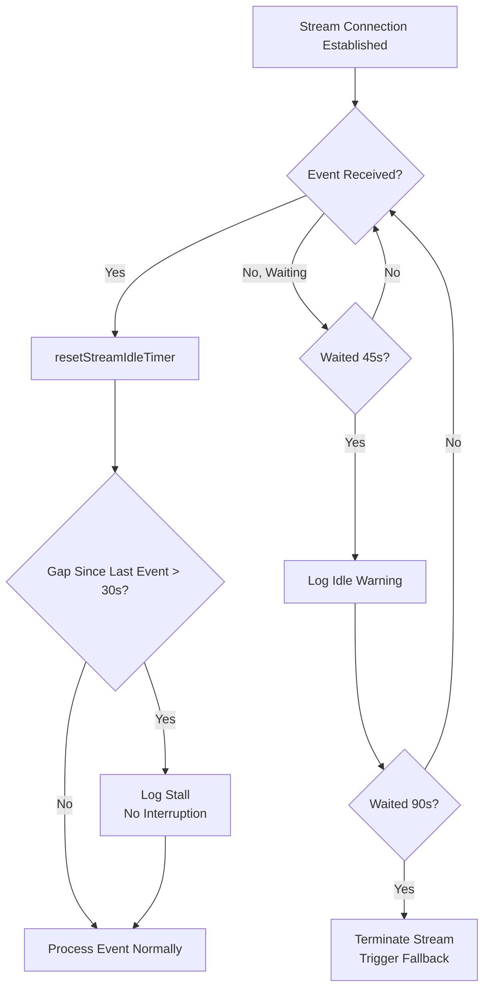

# Chapter 6b: API Communication Layer — Retry, Streaming, and Degradation Engineering

> The `services/api/` directory is not an SDK wrapper layer — it is the Agent's **Control Plane**. Model degradation, cache protection, file transfer, and Prompt Replay debugging all happen at this layer. This chapter focuses on its most critical resilience subsystems: retry, streaming, and degradation. The file transfer channel (Files API) is covered at the end of this chapter, and the Prompt Replay debugging tool is analyzed in Chapter 29.

## Why This Matters

The reliability of an Agent system depends not on how intelligent the model is, but on whether it can still function under the worst network conditions. Imagine a developer using Claude Code on a train to handle an urgent bug: WiFi cuts in and out, the API occasionally returns 529 overload errors, and a streaming response abruptly terminates halfway through. Without sufficient resilience design in the communication layer, this developer either sees an inexplicable crash or must manually retry repeatedly, wasting precious context window space.

Claude Code's communication layer solves exactly these kinds of problems. It is not a simple "retry on failure" wrapper, but a multi-layered defense system: exponential backoff prevents avalanche effects, a 529 counter triggers model degradation, dual watchdogs detect stream interruptions, Fast Mode cache-aware retry protects costs, and persistent mode supports unattended scenarios. Together, these mechanisms embody a core engineering philosophy: **communication failure is the norm, not the exception, and the system must have a contingency plan at every layer.**

What's equally noteworthy is the observability design of this system. Every API call emits three telemetry events — `tengu_api_query` (request sent), `tengu_api_success` (successful response), `tengu_api_error` (failed response) — combined with 25 error classifications and gateway fingerprint detection, making every communication failure traceable and diagnosable. This is a system forged by real production traffic, where every line of code maps to a failure scenario that actually occurred.

---

## Source Code Analysis

> **Interactive version**: [Click to view the retry and degradation animation](retry-viz.html) — Timeline animations for 4 scenarios (normal / 429 rate limit / 529 overload / Fast Mode degradation).

### 6b.1 Retry Strategy: From Exponential Backoff to Model Degradation

Claude Code's retry system is implemented in `withRetry.ts`. The core is an `AsyncGenerator` function `withRetry()` that uses `yield` during retry waits to pass `SystemAPIErrorMessage` to the upper layer, allowing the UI to display retry status in real time.

#### Constants and Configuration

The retry system's behavior is governed by a carefully tuned set of constants:

| Constant | Value | Purpose | Source Location |
|----------|-------|---------|-----------------|
| `DEFAULT_MAX_RETRIES` | 10 | Default retry budget | `withRetry.ts:52` |
| `MAX_529_RETRIES` | 3 | Trigger model degradation after consecutive 529 overloads | `withRetry.ts:54` |
| `BASE_DELAY_MS` | 500 | Exponential backoff base (500ms x 2^(attempt-1)) | `withRetry.ts:55` |
| `PERSISTENT_MAX_BACKOFF_MS` | 5 minutes | Maximum backoff cap in persistent mode | `withRetry.ts:96` |
| `PERSISTENT_RESET_CAP_MS` | 6 hours | Absolute cap in persistent mode | `withRetry.ts:97` |
| `HEARTBEAT_INTERVAL_MS` | 30 seconds | Heartbeat interval (prevents container idle reclamation) | `withRetry.ts:98` |
| `SHORT_RETRY_THRESHOLD_MS` | 20 seconds | Fast Mode short retry threshold | `withRetry.ts:800` |
| `DEFAULT_FAST_MODE_FALLBACK_HOLD_MS` | 30 minutes | Fast Mode cooldown period | `withRetry.ts:799` |

The 10-retry budget may seem generous, but combined with exponential backoff (500ms -> 1s -> 2s -> 4s -> 8s -> 16s -> 32s x 4), the total wait is approximately 2.5-3 minutes. The actual implementation also adds 0-25% random jitter on each backoff interval (`withRetry.ts:542-547`), preventing multiple clients from retrying simultaneously and causing a Thundering Herd effect. This is a carefully calibrated design: enough retries to handle brief network hiccups, but not so many that users wait too long when the API is truly unavailable.

#### Retry Decisions: The shouldRetry Function

The `shouldRetry()` function is the core decision-maker of the retry system, defined at `withRetry.ts:696-787`. It receives an `APIError` and returns a boolean. Analyzing all its return paths reveals three categories:

**Never retry:**

| Condition | Returns | Reason |
|-----------|---------|--------|
| Mock error (for testing) | `false` | From the `/mock-limits` command, should not be overridden by retries |
| `x-should-retry: false` (non-ant user or non-5xx) | `false` | Server explicitly indicates no retry |
| No status code and not a connection error | `false` | Cannot determine error type |
| ClaudeAI subscriber's 429 (non-Enterprise) | `false` | Max/Pro user rate limits are hour-level; retrying is pointless |

**Always retry:**

| Condition | Returns | Reason |
|-----------|---------|--------|
| 429/529 in persistent mode | `true` | Unattended scenarios require infinite retry |
| 401/403 in CCR mode | `true` | Authentication in remote environments is infrastructure-managed; brief failures are recoverable |
| Context overflow error (400) | `true` | Can parse error message and auto-adjust `max_tokens` (`withRetry.ts:726`) |
| Error message contains `overloaded_error` | `true` | SDK sometimes fails to properly pass 529 status codes in streaming mode |
| `APIConnectionError` (connection error) | `true` | Network blips are the most common transient error |
| 408 (request timeout) | `true` | Server-side timeout; retry usually succeeds |
| 409 (lock timeout) | `true` | Backend resource contention; retry usually succeeds |
| 401 (authentication error) | `true` | Clear API key cache then retry |
| 403 (OAuth token revoked) | `true` | Another process refreshed the token |
| 5xx (server error) | `true` | Server-side errors are usually transient |

**Conditional retry:**

| Condition | Returns | Reason |
|-----------|---------|--------|
| `x-should-retry: true` and not a ClaudeAI subscriber, or subscriber but Enterprise | `true` | Server indicates retry and user type supports it |
| 429 (non-ClaudeAI subscriber or Enterprise) | `true` | Rate limits for pay-per-use users are brief |

There is a notable design decision here: for ClaudeAI subscribers (Max/Pro), even when the `x-should-retry` header is `true`, 429 errors are not retried. The reason is clearly stated in the source comments:

```typescript
// restored-src/src/services/api/withRetry.ts:735-736
// For Max and Pro users, should-retry is true, but in several hours, so we shouldn't.
// Enterprise users can retry because they typically use PAYG instead of rate limits.
```

Max/Pro user rate limit windows are on the order of hours — retrying just wastes time, and it's better to inform the user directly. This is a **differentiated decision based on understanding user scenarios**, rather than a one-size-fits-all retry policy.

#### The Three-Layer Error Classification Funnel

Claude Code's error handling is not a flat switch-case but a three-layer funnel structure:

```
classifyAPIError()  — 19+ specific types (for telemetry and diagnostics)
    ↓ mapping
categorizeRetryableAPIError()  — 4 SDK categories (for upper-layer error display)
    ↓ decision
shouldRetry()  — boolean (for the retry loop)
```

The first layer, `classifyAPIError()` (`errors.ts:965-1161`), subdivides errors into 25+ specific types, including `aborted`, `api_timeout`, `repeated_529`, `capacity_off_switch`, `rate_limit`, `server_overload`, `prompt_too_long`, `pdf_too_large`, `pdf_password_protected`, `image_too_large`, `tool_use_mismatch`, `unexpected_tool_result`, `duplicate_tool_use_id`, `invalid_model`, `credit_balance_low`, `invalid_api_key`, `token_revoked`, `oauth_org_not_allowed`, `auth_error`, `bedrock_model_access`, `server_error`, `client_error`, `ssl_cert_error`, `connection_error`, and `unknown`. These classifications are written directly into the `errorType` field of the `tengu_api_error` telemetry event, enabling precise categorization of production issues.

The second layer, `categorizeRetryableAPIError()` (`errors.ts:1163-1182`), merges these fine-grained types into 4 SDK-level categories: `rate_limit` (429 and 529), `authentication_failed` (401 and 403), `server_error` (408+), and `unknown`. This layer provides simplified error display for the upper-layer UI.

The third layer is `shouldRetry()` itself, making the final boolean decision.

The benefit of this three-layer design is that diagnostic information can be very detailed (25 classifications) while decision logic remains concise (true/false). The two concerns are completely decoupled.

#### Special Handling of 529 Overload

The 529 error holds a special position in Claude Code's retry system. A 529 means the API backend has insufficient capacity — unlike a 429 (user rate limiting), this is a system-level overload.

First, not all query sources retry on 529. `FOREGROUND_529_RETRY_SOURCES` (`withRetry.ts:62-82`) defines an allowlist where only foreground requests (requests the user is actively waiting for) are retried:

```typescript
// restored-src/src/services/api/withRetry.ts:57-61
// Foreground query sources where the user IS blocking on the result — these
// retry on 529. Everything else (summaries, titles, suggestions, classifiers)
// bails immediately: during a capacity cascade each retry is 3-10× gateway
// amplification, and the user never sees those fail anyway.
```

This is a **system-level load shedding strategy**: when the backend is overloaded, background tasks (summary generation, title generation, suggestion generation) immediately give up rather than joining the retry queue. Each retry amplifies load on the overloaded backend by 3-10x — reducing unnecessary retries is key to mitigating cascading failures.

Second, three consecutive 529 errors trigger model degradation. This logic is at `withRetry.ts:327-364`:

```typescript
// restored-src/src/services/api/withRetry.ts:327-351
if (is529Error(error) &&
    (process.env.FALLBACK_FOR_ALL_PRIMARY_MODELS ||
     (!isClaudeAISubscriber() && isNonCustomOpusModel(options.model)))
) {
  consecutive529Errors++
  if (consecutive529Errors >= MAX_529_RETRIES) {
    if (options.fallbackModel) {
      logEvent('tengu_api_opus_fallback_triggered', {
        original_model: options.model,
        fallback_model: options.fallbackModel,
        provider: getAPIProviderForStatsig(),
      })
      throw new FallbackTriggeredError(
        options.model,
        options.fallbackModel,
      )
    }
    // ...
  }
}
```

`FallbackTriggeredError` (`withRetry.ts:160-168`) is a dedicated error class. It is not an ordinary exception — it is a **control flow signal** that, when caught by the upper-layer Agent Loop, triggers a model switch (typically from Opus to Sonnet). Using exceptions for control flow is an anti-pattern in many contexts, but it is justified here: the degradation event needs to propagate through multiple call stack layers to reach the Agent Loop, and exceptions are the most natural upward propagation mechanism.

Equally important is `CannotRetryError` (`withRetry.ts:144-158`), which carries `retryContext` (including the current model, thinking configuration, max_tokens override, etc.), giving the upper layer sufficient context to decide how to handle the failure.

### 6b.2 Streaming: Dual Watchdogs

Streaming responses are core to the Claude Code user experience — users see text appear gradually rather than waiting through a long blank page. But streaming connections are far more fragile than regular HTTP requests: TCP connections may be silently closed by intermediary proxies, the server may hang during generation, and the SDK's timeout mechanism only covers the initial connection, not the data stream phase.

Claude Code solves this problem in `claude.ts` with two layers of watchdogs.

#### Idle Timeout Watchdog (Interrupting)

```typescript
// restored-src/src/services/api/claude.ts:1877-1878
const STREAM_IDLE_TIMEOUT_MS =
  parseInt(process.env.CLAUDE_STREAM_IDLE_TIMEOUT_MS || '', 10) || 90_000
const STREAM_IDLE_WARNING_MS = STREAM_IDLE_TIMEOUT_MS / 2
```

The Idle watchdog follows a classic **two-phase alert** pattern:

1. **Warning phase** (45 seconds): If no streaming events (chunks) are received for 45 seconds, a warning log and diagnostic event `cli_streaming_idle_warning` are recorded. The stream may just be slow at this point — it's not necessarily dead.
2. **Timeout phase** (90 seconds): If 90 seconds pass with no events at all, the stream is declared dead. It sets `streamIdleAborted = true`, records a `performance.now()` snapshot (for measuring abort propagation delay later), sends a `tengu_streaming_idle_timeout` telemetry event, then calls `releaseStreamResources()` to forcibly terminate the stream.

Each time a new streaming event arrives, `resetStreamIdleTimer()` resets both timers. This ensures that as long as the stream is alive — even if slow — the watchdog won't kill it prematurely.

```typescript
// restored-src/src/services/api/claude.ts:1895-1928
function resetStreamIdleTimer(): void {
  clearStreamIdleTimers()
  if (!streamWatchdogEnabled) { return }
  streamIdleWarningTimer = setTimeout(/* warning */, STREAM_IDLE_WARNING_MS)
  streamIdleTimer = setTimeout(() => {
    streamIdleAborted = true
    streamWatchdogFiredAt = performance.now()
    // ... logging and telemetry
    releaseStreamResources()
  }, STREAM_IDLE_TIMEOUT_MS)
}
```

Note that the watchdog must be explicitly enabled via the `CLAUDE_ENABLE_STREAM_WATCHDOG` environment variable. This indicates the feature is still in a gradual rollout phase — validated first with internal and limited users before being extended to all users.

#### Stall Detection (Logging Only)

```typescript
// restored-src/src/services/api/claude.ts:1936
const STALL_THRESHOLD_MS = 30_000 // 30 seconds
```

Stall detection addresses a different problem than the Idle watchdog:

- **Idle** = "no events received at all" (the connection may already be dead)
- **Stall** = "events are received, but the gap between them is too large" (the connection is alive, but the server is slow)

Stall detection only **logs** — it does not **interrupt**. When the interval between two streaming events exceeds 30 seconds, it increments `stallCount` and `totalStallTime`, and sends a `tengu_streaming_stall` telemetry event:

```typescript
// restored-src/src/services/api/claude.ts:1944-1965
if (lastEventTime !== null) {
  const timeSinceLastEvent = now - lastEventTime
  if (timeSinceLastEvent > STALL_THRESHOLD_MS) {
    stallCount++
    totalStallTime += timeSinceLastEvent
    logForDebugging(
      `Streaming stall detected: ${(timeSinceLastEvent / 1000).toFixed(1)}s gap between events (stall #${stallCount})`,
      { level: 'warn' },
    )
    logEvent('tengu_streaming_stall', { /* ... */ })
  }
}
lastEventTime = now
```

A key detail: `lastEventTime` is only set after the first chunk arrives, avoiding misidentification of TTFB (Time to First Token) as a stall. TTFB can legitimately be high (the model is thinking), but once output begins, subsequent event intervals should be stable.

The collaboration between the two watchdog layers can be illustrated as follows:



#### Non-Streaming Fallback

When a streaming connection is interrupted by the watchdog or fails for other reasons, Claude Code falls back to non-streaming request mode. This logic is at `claude.ts:2464-2569`.

Two key pieces of information are recorded during fallback:

1. **`fallback_cause`**: `'watchdog'` (watchdog timeout) or `'other'` (other error), used to distinguish the trigger cause.
2. **`initialConsecutive529Errors`**: If the streaming failure itself was a 529 error, the count is passed to the non-streaming retry loop. This ensures that the 529 count is not reset during the streaming-to-non-streaming switch:

```typescript
// restored-src/src/services/api/claude.ts:2559
initialConsecutive529Errors: is529Error(streamingError) ? 1 : 0,
```

Non-streaming fallback has its own timeout configuration:

```typescript
// restored-src/src/services/api/claude.ts:807-811
function getNonstreamingFallbackTimeoutMs(): number {
  const override = parseInt(process.env.API_TIMEOUT_MS || '', 10)
  if (override) return override
  return isEnvTruthy(process.env.CLAUDE_CODE_REMOTE) ? 120_000 : 300_000
}
```

CCR (Claude Code Remote) environments default to 2 minutes, while local environments default to 5 minutes. CCR's shorter timeout is because remote containers have a ~5-minute idle reclamation mechanism — a 5-minute hang would cause the container to receive SIGKILL, so it's better to timeout gracefully at 2 minutes.

Worth noting is that non-streaming fallback can be disabled via the Feature Flag `tengu_disable_streaming_to_non_streaming_fallback` or the environment variable `CLAUDE_CODE_DISABLE_NONSTREAMING_FALLBACK`. The reason is clearly explained in the source comments:

```typescript
// restored-src/src/services/api/claude.ts:2464-2468
// When the flag is enabled, skip the non-streaming fallback and let the
// error propagate to withRetry. The mid-stream fallback causes double tool
// execution when streaming tool execution is active: the partial stream
// starts a tool, then the non-streaming retry produces the same tool_use
// and runs it again. See inc-4258.
```

This fix was born from a real production incident (inc-4258): when a tool has already started executing during streaming, and then the system falls back to non-streaming retry, the same tool gets executed twice. This "partial completion + full retry = duplicate execution" pattern is a classic pitfall of all streaming systems.

### 6b.3 Fast Mode Cache-Aware Retry

Fast Mode is Claude Code's acceleration mode (see Chapter 21 for details), which uses a separate model name to achieve higher throughput. The retry strategy under Fast Mode has a unique consideration: **Prompt Cache**.

When Fast Mode encounters a 429 (rate limit) or 529 (overload), the core of the retry decision lies in the wait time indicated by the `Retry-After` header (`withRetry.ts:267-305`):

```typescript
// restored-src/src/services/api/withRetry.ts:284-304
const retryAfterMs = getRetryAfterMs(error)
if (retryAfterMs !== null && retryAfterMs < SHORT_RETRY_THRESHOLD_MS) {
  // Short retry-after: wait and retry with fast mode still active
  // to preserve prompt cache (same model name on retry).
  await sleep(retryAfterMs, options.signal, { abortError })
  continue
}
// Long or unknown retry-after: enter cooldown (switches to standard
// speed model), with a minimum floor to avoid flip-flopping.
const cooldownMs = Math.max(
  retryAfterMs ?? DEFAULT_FAST_MODE_FALLBACK_HOLD_MS,
  MIN_COOLDOWN_MS,
)
const cooldownReason: CooldownReason = is529Error(error)
  ? 'overloaded'
  : 'rate_limit'
triggerFastModeCooldown(Date.now() + cooldownMs, cooldownReason)
```

The cost tradeoff behind this design is:

| Scenario | Wait Time | Strategy | Reason |
|----------|-----------|----------|--------|
| `Retry-After < 20s` | Brief | Wait in place, keep Fast Mode | Cache won't expire in <20s; preserving cache significantly reduces token cost on the next request |
| `Retry-After >= 20s` or unknown | Longer | Switch to standard mode, enter cooldown | Cache may have expired; better to switch to standard mode immediately to restore availability |

The cooldown floor is 10 minutes (`MIN_COOLDOWN_MS`), with a default of 30 minutes (`DEFAULT_FAST_MODE_FALLBACK_HOLD_MS`). The floor's purpose is to prevent Fast Mode from flip-flopping at the rate limit boundary, which would create an unstable user experience.

Additionally, if the 429 is because overage usage is not available — i.e., the user's subscription does not support overage — Fast Mode is **permanently disabled** rather than temporarily cooled down:

```typescript
// restored-src/src/services/api/withRetry.ts:275-281
const overageReason = error.headers?.get(
  'anthropic-ratelimit-unified-overage-disabled-reason',
)
if (overageReason !== null && overageReason !== undefined) {
  handleFastModeOverageRejection(overageReason)
  retryContext.fastMode = false
  continue
}
```

### 6b.4 Persistent Retry Mode

Setting the environment variable `CLAUDE_CODE_UNATTENDED_RETRY=1` activates Claude Code's persistent retry mode. This mode is designed for unattended scenarios (CI/CD, batch processing, internal Anthropic automation), and its core behavior is: **infinite retry on 429/529**.

Three key design aspects of persistent mode:

**1. Infinite Loop + Independent Counter**

In normal mode, `attempt` grows from 1 to `maxRetries + 1` before the loop terminates. Persistent mode achieves an infinite loop by clamping the `attempt` value at the end of the loop:

```typescript
// restored-src/src/services/api/withRetry.ts:505-506
// Clamp so the for-loop never terminates. Backoff uses the separate
// persistentAttempt counter which keeps growing to the 5-min cap.
if (attempt >= maxRetries) attempt = maxRetries
```

`persistentAttempt` is an independent counter that only increments in persistent mode, used to calculate backoff delay. It is not bounded by `maxRetries`, so the backoff time continues growing until reaching the 5-minute cap.

**2. Window-Level Rate Limit Awareness**

For 429 errors, persistent mode checks the `anthropic-ratelimit-unified-reset` header for the reset timestamp. If the server indicates "resets in 5 hours," the system waits directly until the reset time rather than mindlessly polling every 5 minutes:

```typescript
// restored-src/src/services/api/withRetry.ts:436-447
if (persistent && error instanceof APIError && error.status === 429) {
  persistentAttempt++
  const resetDelay = getRateLimitResetDelayMs(error)
  delayMs =
    resetDelay ??
    Math.min(
      getRetryDelay(persistentAttempt, retryAfter, PERSISTENT_MAX_BACKOFF_MS),
      PERSISTENT_RESET_CAP_MS,
    )
}
```

**3. Heartbeat Keepalive**

This is the most clever design in persistent mode. When backoff times are long (e.g., 5 minutes), the system doesn't perform a single `sleep(300000)`. Instead, it slices the wait into multiple 30-second segments, yielding a `SystemAPIErrorMessage` after each segment:

```typescript
// restored-src/src/services/api/withRetry.ts:489-503
let remaining = delayMs
while (remaining > 0) {
  if (options.signal?.aborted) throw new APIUserAbortError()
  if (error instanceof APIError) {
    yield createSystemAPIErrorMessage(
      error,
      remaining,
      reportedAttempt,
      maxRetries,
    )
  }
  const chunk = Math.min(remaining, HEARTBEAT_INTERVAL_MS)
  await sleep(chunk, options.signal, { abortError })
  remaining -= chunk
}
```

The heartbeat mechanism solves two problems:

- **Container idle reclamation**: Remote environments like CCR will identify long-running processes with no output as idle and reclaim them. The 30-second yield produces activity on stdout, preventing false termination.
- **User interrupt responsiveness**: By checking `signal.aborted` between each 30-second segment, users can interrupt long waits at any time. With a single `sleep(300s)`, pressing Ctrl-C would require waiting until the sleep completes before taking effect.

A TODO comment in the source reveals the stopgap nature of this design:

```typescript
// restored-src/src/services/api/withRetry.ts:94-95
// TODO(ANT-344): the keep-alive via SystemAPIErrorMessage yields is a stopgap
// until there's a dedicated keep-alive channel.
```

### 6b.5 API Observability

Claude Code's API observability system is implemented in `logging.ts`, built around three telemetry events:

#### The Three-Event Model

| Event | Trigger | Key Fields | Source Location |
|-------|---------|------------|-----------------|
| `tengu_api_query` | When request is sent | model, messagesLength, betas, querySource, thinkingType, effortValue, fastMode | `logging.ts:196` |
| `tengu_api_success` | On successful response | model, inputTokens, outputTokens, cachedInputTokens, ttftMs, costUSD, gateway, didFallBackToNonStreaming | `logging.ts:463` |
| `tengu_api_error` | On failed response | model, error, status, errorType (25 classifications), durationMs, attempt, gateway | `logging.ts:304` |

These three events form a complete request funnel: query -> success/error. By correlating on `requestId`, the complete lifecycle of a request from dispatch to completion can be traced.

#### TTFB and Cache Hits

The most critical performance metric in the success event is `ttftMs` (Time to First Token) — the time from request dispatch to the arrival of the first streaming chunk. This metric directly reflects:

- Network latency (round-trip time from client to API endpoint)
- Queue delay (time the request spends queued on the API backend)
- Model first-token generation time (related to prompt length and model size)

Cache-related fields (`cachedInputTokens` and `uncachedInputTokens`, i.e., `cache_creation_input_tokens`) allow the team to monitor Prompt Cache hit rates, which directly impact cost and TTFB.

#### Gateway Fingerprint Detection

An easily overlooked feature in `logging.ts` is gateway detection (`detectGateway()`, `logging.ts:107-139`). It identifies whether a request has passed through a third-party AI gateway by examining response header prefixes:

| Gateway | Header Prefix |
|---------|---------------|
| LiteLLM | `x-litellm-` |
| Helicone | `helicone-` |
| Portkey | `x-portkey-` |
| Cloudflare AI Gateway | `cf-aig-` |
| Kong | `x-kong-` |
| Braintrust | `x-bt-` |
| Databricks | Detected via domain suffix |

Once a gateway is detected, the `gateway` field is included in success and error events. This allows the Anthropic team to diagnose "specific error patterns in certain gateway environments" — for example, if the 404 error rate is abnormally high through a LiteLLM proxy, it may be a proxy configuration issue rather than an API issue.

#### Diagnostic Value of Error Classification

The `errorType` in error events uses `classifyAPIError()`'s 25 classifications. Compared to simple HTTP status codes, these classifications provide more precise diagnostic information:

| Classification | Meaning | Diagnostic Value |
|----------------|---------|------------------|
| `repeated_529` | Consecutive 529s exceed threshold | Distinguishes sporadic overload from sustained unavailability |
| `tool_use_mismatch` | Tool call/result mismatch | Indicates a bug in context management |
| `ssl_cert_error` | SSL certificate issue | Prompts user to check proxy configuration |
| `token_revoked` | OAuth token revoked | Indicates multi-instance token contention |
| `bedrock_model_access` | Bedrock model access error | Prompts user to check IAM permissions |

---

## Pattern Extraction

### Pattern 1: Finite Retry Budget + Independent Degradation Threshold

- **Problem solved**: Infinite retries cause user waiting and cost runaway; simultaneously, different error types require different patience thresholds
- **Core approach**: Set a global retry budget (10 attempts) while establishing an independent sub-budget for specific errors (529 overload, 3 attempts). Exhausting the sub-budget triggers degradation rather than abandonment. The two counters run independently without interfering with each other
- **Prerequisites**: Must have a clear degradation plan (fallback model); degradation itself should not consume the main budget
- **Source reference**: `restored-src/src/services/api/withRetry.ts:52-54` — `DEFAULT_MAX_RETRIES=10`, `MAX_529_RETRIES=3`

### Pattern 2: Dual Watchdog (Logging + Interrupting)

- **Problem solved**: Streaming connections can die silently — TCP keepalive cannot cover application-layer silent hangs
- **Core approach**: Set up two layers of detection. Stall detection (30 seconds) only logs and emits telemetry when event intervals are too large, without interfering with the stream — because slow doesn't mean dead. The Idle watchdog (90 seconds) terminates the connection and triggers fallback when there are no events at all — because a stream with 90 seconds of inactivity is almost certainly dead
- **Prerequisites**: Must have a non-streaming fallback path; watchdog thresholds must be configurable (different network environments need different thresholds)
- **Source reference**: `restored-src/src/services/api/claude.ts:1936` — Stall detection, `restored-src/src/services/api/claude.ts:1877` — Idle watchdog

### Pattern 3: Cache-Aware Retry Decision

- **Problem solved**: Retries may cause Prompt Cache invalidation, and cache invalidation means higher token costs and longer TTFB
- **Core approach**: Make differentiated decisions based on expected wait time. Short wait (<20 seconds) -> preserve cache and wait in place, because the cache won't expire within 20 seconds; long wait (>=20 seconds) -> abandon cache and switch modes, because the time cost of waiting exceeds the cost of rebuilding the cache
- **Prerequisites**: API must provide a `Retry-After` header; must have an alternative mode to switch to
- **Source reference**: `restored-src/src/services/api/withRetry.ts:284-304`

### Pattern 4: Heartbeat Keepalive

- **Problem solved**: During long sleeps, the process produces no output and may be deemed idle by the host environment and reclaimed
- **Core approach**: Slice a single long sleep into N 30-second segments, yielding a message after each segment to keep the stream active. Also check the interrupt signal between each segment, ensuring users can cancel at any time
- **Prerequisites**: The caller must be an `AsyncGenerator` or similar coroutine structure capable of producing intermediate results during the wait
- **Source reference**: `restored-src/src/services/api/withRetry.ts:489-503`

---

### 6b.5 File Transfer Channel: Files API

The `services/api/` directory also contains an often-overlooked subsystem — `filesApi.ts`, which implements file upload/download functionality with the Anthropic Public Files API. This is not a simple HTTP client but a file transfer channel serving three distinct scenarios:

| Scenario | Caller | Direction | Purpose |
|----------|--------|-----------|---------|
| Session startup file attachments | `main.tsx` | Download | Files specified by the `--file=<id>:<path>` parameter |
| CCR seed bundle upload | `gitBundle.ts` | Upload | Codebase package transfer for remote sessions (see Chapter 20c) |
| BYOC file persistence | `filePersistence.ts` | Upload | Upload modified files after each turn |

The design of `FilesApiConfig` reveals an important constraint — file operations require an OAuth session token (not an API key), because files are bound to sessions:

```typescript
// restored-src/src/services/api/filesApi.ts:60-67
export type FilesApiConfig = {
  /** OAuth token for authentication (from session JWT) */
  oauthToken: string
  /** Base URL for the API (default: https://api.anthropic.com) */
  baseUrl?: string
  /** Session ID for creating session-specific directories */
  sessionId: string
}
```

The file size limit is 500MB (`MAX_FILE_SIZE_BYTES`, line 82). Downloads use independent retry logic (3 attempts with exponential backoff, base 500ms), rather than reusing `withRetry.ts`'s generic retry — because the failure modes of file downloads (oversized files, insufficient disk space) differ from those of API calls (429/529 overload), requiring an independent retry budget.

The beta header `files-api-2025-04-14,oauth-2025-04-20` (line 27) indicates this is a still-evolving API — `oauth-2025-04-20` enables Bearer OAuth authentication on public API paths.

---

## What You Can Do

1. **Understand the relationship between 529 and model degradation.** After 3 consecutive 529 overload errors, Claude Code automatically degrades to the fallback model (typically from Opus to Sonnet). If you notice a sudden drop in response quality, it may be because the model was degraded — check for `tengu_api_opus_fallback_triggered` events in the terminal output. This is not a bug; the system is protecting availability.

2. **Leverage Fast Mode's cache window.** Brief 429 errors under Fast Mode (Retry-After < 20 seconds) won't cause cache invalidation — Claude Code waits in place to preserve the cache. But waits exceeding 20 seconds trigger at least a 10-minute cooldown period, during which it switches to standard speed. If you frequently see Fast Mode cooldowns, you may need to reduce your request frequency.

3. **Persistent retry mode (v2.1.88, Anthropic internal builds only).** `CLAUDE_CODE_UNATTENDED_RETRY=1` enables infinite retry (with exponential backoff, capped at 5 minutes), supporting waiting until the rate limit resets based on the `anthropic-ratelimit-unified-reset` header. If you're building your own Agent, this "heartbeat keepalive + rate limit-aware waiting" pattern is worth adopting.

4. **TTFB is the most critical latency metric.** In `--verbose` mode, Claude Code reports the TTFB (Time to First Token) for each API call. If this value is abnormally high (>5 seconds), it may indicate API-side overload or network issues. Also watch the `cachedInputTokens` field — if it's consistently 0, your Prompt Cache isn't hitting, and you're paying full price for every request (see Chapter 13 for details).

5. **Customize the streaming timeout threshold.** If your network environment has high latency (e.g., accessing the API through a VPN or satellite link), the default 90-second Idle Timeout may be too aggressive. You can adjust the timeout threshold by setting the `CLAUDE_STREAM_IDLE_TIMEOUT_MS` environment variable (also requires `CLAUDE_ENABLE_STREAM_WATCHDOG=1`).

6. **Adjust the retry budget via `CLAUDE_CODE_MAX_RETRIES`.** The default 10 retries suit most scenarios, but if your API provider frequently returns transient errors, you can increase it; if you want faster failure feedback, you can reduce it to 3-5.
