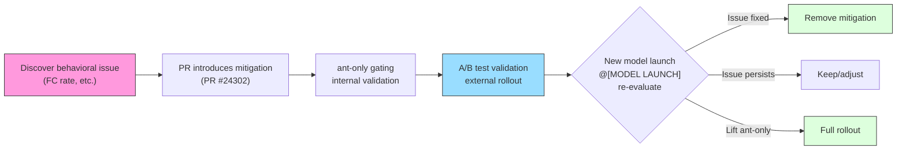

# Chapter 7: Model-Specific Tuning and A/B Testing

> Chapter 6 explored how the system prompt is assembled into the instruction set sent to the model. But the same prompt does not suit all models -- each model generation has unique behavioral tendencies, and Anthropic's internal users need to test and validate new models earlier than external users. This chapter reveals how Claude Code achieves model-specific prompt tuning, internal A/B testing, and safe public repository contributions through the `@[MODEL LAUNCH]` annotation system, `USER_TYPE === 'ant'` gating, GrowthBook Feature Flags, and Undercover mode.

## 7.1 Model Launch Checklist: `@[MODEL LAUNCH]` Annotations

Throughout Claude Code's codebase, a special comment marker is scattered:

```typescript
// @[MODEL LAUNCH]: Update the latest frontier model.
const FRONTIER_MODEL_NAME = 'Claude Opus 4.6'
```

**Source Reference:** `constants/prompts.ts:117-118`

These `@[MODEL LAUNCH]` annotations are not ordinary comments. They form a **distributed checklist** -- when a new model is ready for release, engineers simply search globally for `@[MODEL LAUNCH]` in the codebase to find all locations that need updating. This design embeds release process knowledge into the code itself, rather than relying on external documentation.

In `prompts.ts`, `@[MODEL LAUNCH]` marks the following key update points:

| Line | Content | Update Action |
|------|---------|---------------|
| 117 | `FRONTIER_MODEL_NAME` constant | Update to the new model's market name |
| 120 | `CLAUDE_4_5_OR_4_6_MODEL_IDS` object | Update model IDs for each tier |
| 204 | Over-commenting mitigation directive | Evaluate whether the new model still needs this mitigation |
| 210 | Thoroughness counterweight | Evaluate whether ant-only gating can be lifted |
| 224 | Assertiveness counterweight | Evaluate whether ant-only gating can be lifted |
| 237 | False claims mitigation directive | Evaluate the new model's FC rate |
| 712 | `getKnowledgeCutoff` function | Add the new model's knowledge cutoff date |

In `antModels.ts`:

| Line | Content | Update Action |
|------|---------|---------------|
| 32 | `tengu_ant_model_override` | Update ant-only model list in the Feature Flag |
| 33 | `excluded-strings.txt` | Add new model codename to prevent leaking into external builds |

The elegance of this pattern lies in its **self-documenting** nature: the annotation text itself serves as the operation instruction. For example, the annotation at line 204 explicitly states the lift condition: "remove or soften once the model stops over-commenting by default." Engineers don't need to consult an external operations manual -- both the condition and the action are written right beside the code.

## 7.2 Capybara v8 Behavior Mitigations

Each model generation has its unique "personality flaws." Claude Code's source code documents four known issues with Capybara v8 (one of the internal codenames for the Claude 4.5/4.6 series), along with prompt-level mitigations for each.

### 7.2.1 Over-Commenting

**Problem:** Capybara v8 tends to add excessive unnecessary comments to code.

**Mitigation (lines 204-209):**

```typescript
// @[MODEL LAUNCH]: Update comment writing for Capybara —
// remove or soften once the model stops over-commenting by default
...(process.env.USER_TYPE === 'ant'
  ? [
      `Default to writing no comments. Only add one when the WHY is
       non-obvious...`,
      `Don't explain WHAT the code does, since well-named identifiers
       already do that...`,
      `Don't remove existing comments unless you're removing the code
       they describe...`,
    ]
  : []),
```

**Source Reference:** `constants/prompts.ts:204-209`

These directives form a refined commenting philosophy: default to writing no comments, only add them when the "why" is non-obvious; don't explain what the code does (identifiers already do that); don't remove existing comments you don't understand. Note the subtlety of the third directive -- it both prevents the model from over-commenting and prevents over-correction by deleting valuable existing comments.

### 7.2.2 False Claims

**Problem:** Capybara v8's False Claims rate (FC rate) is 29-30%, significantly higher than v4's 16.7%.

**Mitigation (lines 237-241):**

```typescript
// @[MODEL LAUNCH]: False-claims mitigation for Capybara v8
// (29-30% FC rate vs v4's 16.7%)
...(process.env.USER_TYPE === 'ant'
  ? [
      `Report outcomes faithfully: if tests fail, say so with the
       relevant output; if you did not run a verification step, say
       that rather than implying it succeeded. Never claim "all tests
       pass" when output shows failures...`,
    ]
  : []),
```

**Source Reference:** `constants/prompts.ts:237-241`

The design of this mitigation directive embodies symmetrical thinking: it not only requires the model not to falsely report success, but explicitly requires it not to be excessively self-doubting -- "when a check did pass or a task is complete, state it plainly -- do not hedge confirmed results with unnecessary disclaimers." The engineers discovered that simply telling the model "don't lie" causes it to swing to the other extreme, adding unnecessary disclaimers to all results. The mitigation target is **accurate reporting, not defensive reporting**.

### 7.2.3 Over-Assertiveness

**Problem:** Capybara v8 tends to simply execute user instructions without offering its own judgment.

**Mitigation (lines 224-228):**

```typescript
// @[MODEL LAUNCH]: capy v8 assertiveness counterweight (PR #24302)
// — un-gate once validated on external via A/B
...(process.env.USER_TYPE === 'ant'
  ? [
      `If you notice the user's request is based on a misconception,
       or spot a bug adjacent to what they asked about, say so.
       You're a collaborator, not just an executor...`,
    ]
  : []),
```

**Source Reference:** `constants/prompts.ts:224-228`

The annotation's "PR #24302" indicates this mitigation was introduced through the code review process, and "un-gate once validated on external via A/B" reveals the complete release strategy: first validate on internal users (ant), then roll out to external users through A/B testing after collecting data.

### 7.2.4 Lack of Thoroughness

**Problem:** Capybara v8 tends to claim task completion without verifying results.

**Mitigation (lines 210-211):**

```typescript
// @[MODEL LAUNCH]: capy v8 thoroughness counterweight (PR #24302)
// — un-gate once validated on external via A/B
`Before reporting a task complete, verify it actually works: run the
 test, execute the script, check the output. Minimum complexity means
 no gold-plating, not skipping the finish line.`,
```

**Source Reference:** `constants/prompts.ts:210-211`

The last sentence of this directive is particularly subtle: "If you can't verify (no test exists, can't run the code), say so explicitly rather than claiming success." It acknowledges that there are situations where verification isn't possible, but requires the model to explicitly acknowledge this rather than silently pretending everything is fine.

### 7.2.5 Mitigation Lifecycle

The four mitigations share a unified lifecycle pattern:



**Figure 7-1: Complete lifecycle of model mitigations.** From issue discovery to mitigation introduction, through internal validation and A/B testing, culminating in re-evaluation at the next `@[MODEL LAUNCH]`.

## 7.3 `USER_TYPE === 'ant'` Gating: The Internal A/B Testing Staging Area

All four mitigations above are wrapped in the same condition:

```typescript
process.env.USER_TYPE === 'ant'
```

This environment variable is not read at runtime -- it is a **build-time constant**. The source code comments explain this critical compiler contract:

```
DCE: `process.env.USER_TYPE === 'ant'` is build-time --define.
It MUST be inlined at each callsite (not hoisted to a const) so the
bundler can constant-fold it to `false` in external builds and
eliminate the branch.
```

**Source Reference:** `constants/prompts.ts:617-619`

This comment reveals an elegant Dead Code Elimination (DCE) mechanism:

1. **Build-time replacement**: The bundler's `--define` option replaces `process.env.USER_TYPE` with a string literal at compile time.
2. **Constant folding**: For external builds, `'external' === 'ant'` is folded to `false`.
3. **Branch elimination**: Branches with condition `false` are entirely removed, including all their string content.
4. **Inline requirement**: Each callsite must directly write `process.env.USER_TYPE === 'ant'`; it cannot be extracted into a variable, or the bundler cannot perform constant folding.

This means **ant-only code physically does not exist in external user build artifacts**. This is not a runtime permission check but compile-time code elimination. Even decompiling the external build wouldn't reveal internal codenames like Capybara or the specific wording of mitigations.

### 7.3.1 Complete ant-only Gating Inventory

The following table lists all content in `prompts.ts` gated by `USER_TYPE === 'ant'`:

| Line Range | Feature Description | Gated Content | Lift Condition |
|-----------|---------------------|--------------|----------------|
| 136-139 | ant model override section | `getAntModelOverrideSection()` -- appends ant-specific suffix to system prompt | Controlled by Feature Flag, not a fixed condition |
| 205-209 | Over-commenting mitigation | Three commenting philosophy directives | New model no longer over-comments by default |
| 210-211 | Thoroughness mitigation | Verify task completion directive | Validated via A/B test, then rolled out externally |
| 225-228 | Assertiveness mitigation | Collaborator-not-executor directive | Validated via A/B test, then rolled out externally |
| 238-241 | False claims mitigation | Accurate result reporting directive | New model's FC rate drops to acceptable level |
| 243-246 | Internal feedback channels | `/issue` and `/share` command recommendations, and suggestion to send to internal Slack channel | Internal users only, will not be lifted |
| 621 | Undercover model description suppression | Suppress model name and ID in system prompt | When Undercover mode is active |
| 660 | Undercover simplified model description suppression | Same as above, simplified prompt version | When Undercover mode is active |
| 694-702 | Undercover model family info suppression | Suppress latest model list, Claude Code platform info, Fast mode explanation | When Undercover mode is active |

**Table 7-1: Complete ant-only gating inventory in `prompts.ts`.** Each gate has a clear lift condition, forming a progressive release pipeline from internal validation to external rollout.

`getAntModelOverrideSection` (lines 136-139) deserves special attention:

```typescript
function getAntModelOverrideSection(): string | null {
  if (process.env.USER_TYPE !== 'ant') return null
  if (isUndercover()) return null
  return getAntModelOverrideConfig()?.defaultSystemPromptSuffix || null
}
```

It has **dual gating** -- not only must the user be internal, but they must also not be in Undercover mode. This design ensures that even internal users don't leak internal model configurations when contributing to public repositories.

## 7.4 Undercover Mode: Stealth in Public Repositories

Undercover mode is one of Claude Code's most unique features. It solves a very specific problem: when Anthropic internal engineers use Claude Code to contribute to public/open-source repositories, no internal information should be leaked.

### 7.4.1 Activation Logic

```typescript
export function isUndercover(): boolean {
  if (process.env.USER_TYPE === 'ant') {
    if (isEnvTruthy(process.env.CLAUDE_CODE_UNDERCOVER)) return true
    return getRepoClassCached() !== 'internal'
  }
  return false
}
```

**Source Reference:** `utils/undercover.ts:28-37`

The activation rules have three levels:

1. **Forced on**: Setting the `CLAUDE_CODE_UNDERCOVER=1` environment variable forces activation even in internal repositories.
2. **Auto-detection**: If the current repository's remote address is not in the internal whitelist, it activates automatically. `'external'`, `'none'`, and `null` (check hasn't run yet) all resolve to "on."
3. **Cannot be forced off**: By design, there is no option to force it off. The source code comment explains: "This guards against model codename leaks -- if we're not confident we're in an internal repo, we stay undercover."

This "safe default is on" design philosophy is worth deep reflection -- better to unnecessarily hide information in internal repositories than risk leaking in public ones.

### 7.4.2 Suppression Scope

When Undercover mode is activated, the following suppression operations are executed:

```
┌─────────────────────────────────────────────────────────────────────┐
│                     Undercover Mode Workflow                         │
│                                                                     │
│  ┌─────────────────┐                                                │
│  │  isUndercover()  │──── false ────▶ Normal mode (show model info)  │
│  │    returns true  │                                                │
│  └────────┬────────┘                                                │
│           │ true                                                     │
│           ▼                                                          │
│  ┌─────────────────────────────────────────────────────────────────┐ │
│  │                    Suppression Layer 1: System Prompt            │ │
│  │                                                                 │ │
│  │  computeEnvInfo (L621):                                         │ │
│  │    modelDescription = ''  ← model name/ID fully cleared         │ │
│  │                                                                 │ │
│  │  computeSimpleEnvInfo (L660):                                   │ │
│  │    modelDescription = null  ← removed from env info             │ │
│  │                                                                 │ │
│  │  Model family list (L694-696):                                  │ │
│  │    null  ← Opus/Sonnet/Haiku ID list not shown                  │ │
│  │                                                                 │ │
│  │  Claude Code platform info (L697-699):                          │ │
│  │    null  ← CLI/desktop/Web/IDE info not shown                   │ │
│  │                                                                 │ │
│  │  Fast mode explanation (L700-702):                              │ │
│  │    null  ← explanation about using same model not shown         │ │
│  │                                                                 │ │
│  │  getAntModelOverrideSection (L138):                             │ │
│  │    return null  ← ant model override suffix not injected        │ │
│  └─────────────────────────────────────────────────────────────────┘ │
│           │                                                          │
│           ▼                                                          │
│  ┌─────────────────────────────────────────────────────────────────┐ │
│  │                    Suppression Layer 2: Attribution              │ │
│  │                                                                 │ │
│  │  getAttributionTexts():                                         │ │
│  │    return { commit: '', pr: '' }                                │ │
│  │    ← no Co-Authored-By line generated                           │ │
│  │    ← no AI tool attribution in PR descriptions                  │ │
│  └─────────────────────────────────────────────────────────────────┘ │
│           │                                                          │
│           ▼                                                          │
│  ┌─────────────────────────────────────────────────────────────────┐ │
│  │                    Suppression Layer 3: Behavioral Directives    │ │
│  │                                                                 │ │
│  │  getUndercoverInstructions():                                   │ │
│  │    Injects detailed anti-leak directives:                       │ │
│  │    - Prohibit internal model codenames (Capybara, Tengu, etc.)  │ │
│  │    - Prohibit unreleased model version numbers                  │ │
│  │    - Prohibit internal repo/project names                       │ │
│  │    - Prohibit internal tools, Slack channels, short links       │ │
│  │    - Prohibit "Claude Code" text or AI identity hints           │ │
│  │    - Prohibit Co-Authored-By attribution                        │ │
│  │    - Require commit messages written like a human developer     │ │
│  └─────────────────────────────────────────────────────────────────┘ │
└─────────────────────────────────────────────────────────────────────┘
```

**Figure 7-2: Undercover mode's three-layer suppression workflow.** From system prompt to attribution to behavioral directives, forming a complete information leak defense.

The source code comment (lines 612-615) explains why the suppression scope is so broad:

```
Undercover: keep ALL model names/IDs out of the system prompt so
nothing internal can leak into public commits/PRs. This includes the
public FRONTIER_MODEL_* constants — if those ever point at an
unannounced model, we don't want them in context. Go fully dark.
```

"Go fully dark" -- even public constants (like `FRONTIER_MODEL_NAME`) are suppressed, because if these constants point to a not-yet-announced model, they themselves become leak sources.

### 7.4.3 Undercover Instruction Examples

The `getUndercoverInstructions()` function (`utils/undercover.ts:39-69`) injects a detailed anti-leak directive. It teaches the model using both positive and negative examples:

**Good commit messages:**
- "Fix race condition in file watcher initialization"
- "Add support for custom key bindings"

**Must never write:**
- "Fix bug found while testing with Claude Capybara"
- "1-shotted by claude-opus-4-6"
- "Generated with Claude Code"

This side-by-side positive/negative example teaching approach is more effective than a simple prohibition list -- it not only tells the model "what not to do" but also demonstrates "what to do."

### 7.4.4 Auto-Notification Mechanism

When Undercover mode is first auto-activated, Claude Code displays a one-time explanatory dialog (`shouldShowUndercoverAutoNotice`, lines 80-88). The check logic ensures users aren't repeatedly bothered: users who forced it on (via environment variable) won't see the notification (they already know), and users who've already seen the notification won't see it again. This flag is stored in the global config's `hasSeenUndercoverAutoNotice` field.

## 7.5 GrowthBook Integration: The `tengu_*` Feature Flag System

### 7.5.1 Architecture Overview

Claude Code uses GrowthBook as its Feature Flag and experimentation platform. All Feature Flags follow the `tengu_*` naming convention -- "tengu" is Claude Code's internal codename.

GrowthBook client initialization and feature value retrieval follow a carefully designed multi-layer fallback mechanism:

```
Priority (high to low):
  1. Environment variable override (CLAUDE_INTERNAL_FC_OVERRIDES) — ant-only
  2. Local config override (/config Gates panel)                  — ant-only
  3. In-memory remote evaluation values (remoteEvalFeatureValues)
  4. Disk cache (cachedGrowthBookFeatures)
  5. Default value (defaultValue parameter)
```

The core value retrieval function is `getFeatureValue_CACHED_MAY_BE_STALE` (`growthbook.ts:734-775`). As its name states, the value returned by this function **may be stale** -- it reads from memory or disk cache first, never blocking to wait for a network request. This is an intentional design decision: on the startup critical path, a stale but available value is better than a UI frozen waiting for the network.

```typescript
export function getFeatureValue_CACHED_MAY_BE_STALE<T>(
  feature: string,
  defaultValue: T,
): T {
  // 1. Environment variable override
  const overrides = getEnvOverrides()
  if (overrides && feature in overrides) return overrides[feature] as T
  // 2. Local config override
  const configOverrides = getConfigOverrides()
  if (configOverrides && feature in configOverrides)
    return configOverrides[feature] as T
  // 3. In-memory remote evaluation value
  if (remoteEvalFeatureValues.has(feature))
    return remoteEvalFeatureValues.get(feature) as T
  // 4. Disk cache
  const cached = getGlobalConfig().cachedGrowthBookFeatures?.[feature]
  return cached !== undefined ? (cached as T) : defaultValue
}
```

**Source Reference:** `services/analytics/growthbook.ts:734-775`

### 7.5.2 Remote Evaluation and Local Cache Sync

GrowthBook uses `remoteEval: true` mode -- feature values are pre-evaluated server-side, and the client only needs to cache results. The `processRemoteEvalPayload` function (`growthbook.ts:327-394`) runs on each initialization and periodic refresh, writing server-returned pre-evaluated values to two stores:

1. **In-memory Map** (`remoteEvalFeatureValues`): For fast reads during process lifetime.
2. **Disk cache** (`syncRemoteEvalToDisk`, lines 407-417): For cross-process persistence.

The disk cache uses a **full replacement rather than merge** strategy -- features deleted server-side are cleared from disk. This ensures the disk cache is always a complete snapshot of server state, not an ever-accumulating historical sediment.

The source code comment (lines 322-325) records a past failure:

```
Without this running on refresh, remoteEvalFeatureValues freezes at
its init-time snapshot and getDynamicConfig_BLOCKS_ON_INIT returns
stale values for the entire process lifetime — which broke the
tengu_max_version_config kill switch for long-running sessions.
```

This kill switch failure illustrates why periodic refresh is critical -- if values are only read once at initialization, long-running sessions cannot respond to urgent remote configuration changes.

### 7.5.3 Experiment Exposure Tracking

GrowthBook's A/B testing functionality depends on experiment exposure tracking. The `logExposureForFeature` function (lines 296-314) records exposure events when feature values are accessed, for subsequent experiment analysis. Key designs:

- **Session-level deduplication**: The `loggedExposures` Set ensures each feature is recorded at most once per session, preventing duplicate events from frequent calls in hot paths (like render loops).
- **Deferred exposure**: If a feature is accessed before GrowthBook initialization completes, the `pendingExposures` Set stores these accesses, recording them retroactively once initialization is done.

### 7.5.4 Known `tengu_*` Feature Flags

The following `tengu_*` Feature Flags can be identified from the codebase:

| Flag Name | Purpose | Retrieval Method |
|-----------|---------|-----------------|
| `tengu_ant_model_override` | Configure ant-only model list, default model, system prompt suffix | `_CACHED_MAY_BE_STALE` |
| `tengu_1p_event_batch_config` | First-party event batching configuration | `onGrowthBookRefresh` |
| `tengu_event_sampling_config` | Event sampling configuration | `_CACHED_MAY_BE_STALE` |
| `tengu_log_datadog_events` | Datadog event logging gate | `_CACHED_MAY_BE_STALE` |
| `tengu_max_version_config` | Maximum version kill switch | `_BLOCKS_ON_INIT` |
| `tengu_frond_boric` | Sink master switch (kill switch) | `_CACHED_MAY_BE_STALE` |
| `tengu_cobalt_frost` | Nova 3 speech recognition gate | `_CACHED_MAY_BE_STALE` |

Note that some Flags use obfuscated names (e.g., `tengu_frond_boric`). This is a security consideration -- even if the Flag name is externally observed, its purpose cannot be deduced.

### 7.5.5 Environment Variable Override: The Eval Harness Backdoor

The `CLAUDE_INTERNAL_FC_OVERRIDES` environment variable (`growthbook.ts:161-192`) allows overriding any Feature Flag value without connecting to the GrowthBook server. This mechanism is specifically designed for the eval harness -- automated tests need to run under deterministic conditions and cannot depend on the state of remote services.

```typescript
// Example: CLAUDE_INTERNAL_FC_OVERRIDES='{"my_feature": true}'
```

Override priority is highest (above disk cache and remote evaluation values), and it's only available in ant builds. This ensures eval harness determinism while not affecting external users.

## 7.6 `tengu_ant_model_override`: Model Hot-Switching

`tengu_ant_model_override` is the most complex of all `tengu_*` Flags. It configures the complete list of ant-only models via GrowthBook remote configuration, supporting runtime hot-switching without releasing a new version.

### 7.6.1 Configuration Structure

```typescript
export type AntModelOverrideConfig = {
  defaultModel?: string               // Default model ID
  defaultModelEffortLevel?: EffortLevel // Default effort level
  defaultSystemPromptSuffix?: string   // Suffix appended to system prompt
  antModels?: AntModel[]              // Available model list
  switchCallout?: AntModelSwitchCalloutConfig // Switch callout configuration
}
```

**Source Reference:** `utils/model/antModels.ts:24-30`

Each `AntModel` includes alias (for command-line selection), model ID, display label, default effort level, context window size, and other parameters. `switchCallout` allows displaying model switch suggestions to the user in the UI.

### 7.6.2 Resolution Flow

`resolveAntModel` (`antModels.ts:51-64`) resolves user-input model names to specific `AntModel` configurations:

```typescript
export function resolveAntModel(
  model: string | undefined,
): AntModel | undefined {
  if (process.env.USER_TYPE !== 'ant') return undefined
  if (model === undefined) return undefined
  const lower = model.toLowerCase()
  return getAntModels().find(
    m => m.alias === model || lower.includes(m.model.toLowerCase()),
  )
}
```

The matching logic supports both exact alias matching and fuzzy model ID inclusion matching. For example, if the user specifies `--model capybara-fast`, alias matching finds the corresponding `AntModel`; if they specify `--model claude-opus-4-6-capybara`, the model ID inclusion matching also resolves correctly.

### 7.6.3 Cold Cache Startup Problem

A comment in `main.tsx` (lines 2001-2014) documents a tricky startup ordering issue: ant model aliases are resolved through the `tengu_ant_model_override` Feature Flag, and `_CACHED_MAY_BE_STALE` can only read the disk cache before GrowthBook initialization completes. If the disk cache is empty (cold cache), `resolveAntModel` returns `undefined`, causing the model alias to fail resolution.

The solution is to **synchronously wait for GrowthBook initialization to complete** when detecting that an ant user specified an explicit model and the disk cache is empty:

```typescript
if ('external' === 'ant' && explicitModel && ...) {
  await initializeGrowthBook()
}
```

This is one of the very few scenarios in the entire codebase where a GrowthBook call needs to block and wait.

## 7.7 Knowledge Cutoff Date Mapping

The `getKnowledgeCutoff` function (`prompts.ts:712-730`) maintains a mapping from model IDs to knowledge cutoff dates:

```typescript
function getKnowledgeCutoff(modelId: string): string | null {
  const canonical = getCanonicalName(modelId)
  if (canonical.includes('claude-sonnet-4-6'))      return 'August 2025'
  else if (canonical.includes('claude-opus-4-6'))    return 'May 2025'
  else if (canonical.includes('claude-opus-4-5'))    return 'May 2025'
  else if (canonical.includes('claude-haiku-4'))     return 'February 2025'
  else if (canonical.includes('claude-opus-4') ||
           canonical.includes('claude-sonnet-4'))    return 'January 2025'
  return null
}
```

**Source Reference:** `constants/prompts.ts:712-730`

This function uses `includes` rather than exact matching, making it robust against model ID suffixes (like date tags `-20251001`). The cutoff date is injected into the environment information section of the system prompt (lines 635-638), letting the model know its knowledge boundaries:

```typescript
const knowledgeCutoffMessage = cutoff
  ? `\n\nAssistant knowledge cutoff is ${cutoff}.`
  : ''
```

When Undercover mode is active, the model-specific portions of the entire environment information section (including knowledge cutoff date) are suppressed -- but the knowledge cutoff date itself is still retained, as it doesn't leak internal information.

## 7.8 Engineering Insights

### The Three-Stage Progressive Release Pipeline

Claude Code's model tuning reveals a clear three-stage release pipeline:

1. **Discovery and introduction**: Behavioral issues are discovered through model evaluation (e.g., 29-30% FC rate), and mitigations are introduced through PRs.
2. **Internal validation**: Restricted to internal users through `USER_TYPE === 'ant'` gating, collecting real usage data.
3. **Progressive rollout**: After validating effects through GrowthBook A/B testing, ant-only gating is lifted and rolled out to all users.

### Compile-Time Safety Over Runtime Checks

The `USER_TYPE` build-time replacement + Dead Code Elimination mechanism ensures that internal code **physically does not exist** in external builds, not merely "inaccessible." This compile-time safety is stronger than runtime permission checks -- no code means no attack surface.

### The Philosophy of Safe Defaults

Undercover mode's "cannot be forced off" design, the `DANGEROUS_` prefix's API friction, and the "block and wait on cold cache" startup logic all embody the same philosophy: **when security and convenience conflict, choose security**. This isn't paranoia -- it's a reasonable tradeoff between "leaking internal model information" and "waiting a few hundred milliseconds."

### Feature Flags as Control Plane

The `tengu_*` Feature Flag system transforms Claude Code from a single software product into a **remotely controllable platform**. Through GrowthBook, engineers can, without releasing a new version: switch the default model, adjust event sampling rates, enable/disable experimental features, and even urgently shut down problematic features through kill switches. This "control plane / data plane separation" architecture is a hallmark of SaaS product maturity.

## 7.9 What Users Can Do

Based on this chapter's analysis of model-specific tuning and the A/B testing system, here are recommendations readers can apply in their own AI Agent projects:

1. **Embed distributed checklists in your code.** If your system needs to update multiple locations during model upgrades (model name, knowledge cutoff date, behavior mitigations, etc.), adopt `@[MODEL LAUNCH]`-style annotation markers. Write the update action and lift condition directly in the annotation text, letting the checklist coexist with the code rather than relying on external documentation.

2. **Maintain a behavior mitigation archive for each model generation.** When you discover a new model's behavioral tendency (e.g., over-commenting, false claims), correct it through prompt-level mitigations rather than code logic. Document each mitigation's introduction reason, quantified metrics like FC rate, and lift conditions. This archive is invaluable reference for the next model upgrade.

3. **Use build-time constants instead of runtime checks to protect internal code.** If your product distinguishes between internal and external versions, don't rely on runtime `if` checks to hide internal functionality. Reference Claude Code's `USER_TYPE` + bundler `--define` + Dead Code Elimination (DCE) mechanism to ensure internal code physically doesn't exist in external builds.

4. **Establish a Feature Flag system for remote control of prompts.** Gate experimental content in prompts (new behavioral directives, numeric anchors, etc.) through Feature Flags rather than hardcoding. This lets you adjust model behavior without releasing a new version, run A/B tests, and roll back changes through kill switches in emergencies.

5. **Default to safe, not convenient.** When choosing between security and convenience, reference Undercover mode's design: security mode on by default, cannot be forced off, better to false-positive than to miss. For AI Agents, the cost of information leakage far exceeds the cost of occasional extra restrictions.
