# Chapter 8: Tool Prompts as Micro-Harnesses

> Chapter 5 dissected the macro architecture of the system prompt -- section registration, cache layering, dynamic assembly. But the system prompt is only the "top-level strategy." At the micro level of each tool call, a parallel harness system operates: **tool prompts (tool description / tool prompt)**. They are injected as the `description` field in the API request's `tools` array, directly shaping how the model uses each tool. This chapter dissects the prompt design of Claude Code's six core tools one by one, revealing the steering strategies and reusable patterns within.

## 8.1 The Harness Nature of Tool Prompts

A tool's `description` field in the Anthropic API is positioned as "telling the model what this tool does." But Claude Code extends this field from a simple functional description into a complete **behavioral constraint protocol**. Each tool's prompt is effectively a micro-harness, containing:

- **Functional description**: What the tool does
- **Positive guidance**: How it should be used
- **Negative prohibitions**: How it must not be used
- **Conditional branches**: What to do in specific scenarios
- **Format templates**: What the output should look like

The core insight behind this design is: **the behavioral quality of the model with each tool is directly constrained by that tool's prompt quality**. The system prompt sets the global persona; tool prompts shape local behavior. Together they form Claude Code's "dual-layer harness architecture."

Let's analyze the six tools in order of decreasing functional complexity.

---

## 8.2 BashTool: The Most Complex Micro-Harness

BashTool is the tool with the longest prompt and densest constraints in Claude Code. Its prompt is dynamically generated by the `getSimplePrompt()` function, potentially reaching thousands of words.

**Source Location:** `tools/BashTool/prompt.ts:275-369`

### 8.2.1 Tool Preference Matrix: Routing Traffic to Specialized Tools

The first part of the prompt establishes an explicit **tool preference matrix**:

```
IMPORTANT: Avoid using this tool to run find, grep, cat, head, tail,
sed, awk, or echo commands, unless explicitly instructed or after you
have verified that a dedicated tool cannot accomplish your task.
```

Immediately followed by a mapping table (lines 281-291):

```typescript
const toolPreferenceItems = [
  `File search: Use ${GLOB_TOOL_NAME} (NOT find or ls)`,
  `Content search: Use ${GREP_TOOL_NAME} (NOT grep or rg)`,
  `Read files: Use ${FILE_READ_TOOL_NAME} (NOT cat/head/tail)`,
  `Edit files: Use ${FILE_EDIT_TOOL_NAME} (NOT sed/awk)`,
  `Write files: Use ${FILE_WRITE_TOOL_NAME} (NOT echo >/cat <<EOF)`,
  'Communication: Output text directly (NOT echo/printf)',
]
```

This design embodies an important harness pattern: **traffic steering**. Bash is a "universal tool" -- theoretically capable of performing all file reading/writing, searching, and editing operations. But having the model perform these operations through Bash causes two problems:

1. **Poor user experience**: Specialized tools (like FileEditTool) have structured input, visual diffs, permission checks, and other capabilities; Bash commands are opaque strings.
2. **Permission control bypass**: Specialized tools have fine-grained permission verification; Bash commands bypass these checks.

Note the conditional branch at lines 276-278: when the system detects embedded search tools (`hasEmbeddedSearchTools()`), `find` and `grep` are removed from the prohibited list. This adapts for Anthropic's internal builds (ant-native builds), which alias `find`/`grep` to embedded `bfs`/`ugrep` while removing the standalone Glob/Grep tools.

**Reusable Pattern -- "Universal Tool Demotion":** When your tool set contains a tool with extremely broad functional coverage, explicitly list "which scenarios should use which alternative tools" in its prompt, preventing the model from over-relying on a single tool.

### 8.2.2 Command Execution Guidelines: From Timeouts to Concurrency

The second part of the prompt is a detailed command execution specification (lines 331-352), covering:

- **Directory verification**: "If your command will create new directories or files, first use this tool to run `ls` to verify the parent directory exists"
- **Path quoting**: "Always quote file paths that contain spaces with double quotes"
- **Working directory persistence**: "Try to maintain your current working directory throughout the session by using absolute paths"
- **Timeout control**: Default 120,000ms (2 minutes), maximum 600,000ms (10 minutes)
- **Background execution**: `run_in_background` parameter, with explicit usage conditions

The most sophisticated is the **multi-command concurrency guide** (lines 297-303):

```typescript
const multipleCommandsSubitems = [
  `If the commands are independent and can run in parallel, make multiple
   ${BASH_TOOL_NAME} tool calls in a single message.`,
  `If the commands depend on each other and must run sequentially, use
   a single ${BASH_TOOL_NAME} call with '&&' to chain them together.`,
  "Use ';' only when you need to run commands sequentially but don't
   care if earlier commands fail.",
  'DO NOT use newlines to separate commands.',
]
```

This is not simple "best practice advice" but a **concurrency decision tree**: independent tasks use parallel tool calls -> dependencies use `&&` -> tolerate failure use `;` -> prohibit newlines. Each rule corresponds to a specific failure mode.

### 8.2.3 Git Safety Protocol: Defense in Depth

Git operations are the most important security domain in BashTool's prompt. The complete Git Safety Protocol is defined in the `getCommitAndPRInstructions()` function (lines 42-161), with its core prohibition list (lines 88-95) forming a **six-layer defense**:

```
Git Safety Protocol:
- NEVER update the git config
- NEVER run destructive git commands (push --force, reset --hard,
  checkout ., restore ., clean -f, branch -D) unless the user
  explicitly requests these actions
- NEVER skip hooks (--no-verify, --no-gpg-sign, etc) unless the
  user explicitly requests it
- NEVER run force push to main/master, warn the user if they request it
- CRITICAL: Always create NEW commits rather than amending
- When staging files, prefer adding specific files by name rather
  than using "git add -A" or "git add ."
- NEVER commit changes unless the user explicitly asks you to
```

Each prohibition corresponds to a real data loss scenario:

| Prohibition | Failure Scenario Defended Against |
|------------|----------------------------------|
| NEVER update git config | Model may modify user's global Git configuration |
| NEVER push --force | Overwrite remote repository commit history |
| NEVER skip hooks | Bypass code quality checks, signature verification |
| NEVER force push to main | Destroy team shared branch |
| Always create NEW commits | After pre-commit hook failure, amend modifies the previous commit |
| Prefer specific files | `git add .` may expose .env, credentials |
| NEVER commit unless asked | Prevent agent over-autonomy |

The "CRITICAL" marker is reserved for the most subtle scenario: the `--amend` trap after pre-commit hook failure. This rule requires understanding Git's internal mechanics -- hook failure means the commit didn't happen, and at that point `--amend` would modify the **previous existing commit**, not "retry the current commit."

The prompt also includes a complete commit workflow template (lines 96-125), using numbered steps to explicitly specify which operations can run in parallel and which must be sequential, even providing a HEREDOC-format commit message template. This is a **workflow scaffolding** pattern -- not telling the model "what to do," but telling it "in what order to do it."

### 8.2.4 Sandbox Configuration as Inline JSON

When the sandbox is enabled, the `getSimpleSandboxSection()` function (lines 172-273) inlines the complete sandbox configuration as JSON into the prompt:

```typescript
const filesystemConfig = {
  read: {
    denyOnly: dedup(fsReadConfig.denyOnly),
    allowWithinDeny: dedup(fsReadConfig.allowWithinDeny),
  },
  write: {
    allowOnly: normalizeAllowOnly(fsWriteConfig.allowOnly),
    denyWithinAllow: dedup(fsWriteConfig.denyWithinAllow),
  },
}
```

**Source Reference:** `tools/BashTool/prompt.ts:195-203`

This is a design decision worth deep reflection: **exposing machine-readable security policies directly to the model**. The model needs to "understand" which paths it can access and which network hosts it can connect to, so it can proactively avoid violations when generating commands. JSON format guarantees precision and unambiguity.

Note the `dedup` function at lines 167-170 and `normalizeAllowOnly` at lines 188-191: the former removes duplicate paths (because `SandboxManager` doesn't deduplicate when merging multi-layer configs), the latter replaces user-specific temporary directory paths with `$TMPDIR` placeholders. These two optimizations respectively save ~150-200 tokens and ensure cross-user prompt cache consistency.

**Reusable Pattern -- "Policy Transparency":** When security policies require model cooperation to enforce, inline the complete rule set in a structured format (JSON/YAML) into the prompt, letting the model self-check compliance during generation.

### 8.2.5 Sleep Anti-Pattern Suppression

The prompt dedicates a section (lines 310-327) to suppressing `sleep` abuse:

```typescript
const sleepSubitems = [
  'Do not sleep between commands that can run immediately — just run them.',
  'If your command is long running... use `run_in_background`.',
  'Do not retry failing commands in a sleep loop — diagnose the root cause.',
  'If waiting for a background task... do not poll.',
  'If you must sleep, keep the duration short (1-5 seconds)...',
]
```

This is a typical **anti-pattern suppression** strategy. LLMs tend to use `sleep` + polling to handle asynchronous waits in code generation scenarios, because this is the most common pattern in training data. The prompt "overwrites" this default behavior by enumerating alternatives one by one (background execution, event notification, root cause diagnosis).

---

## 8.3 FileEditTool: The "Must Read Before Edit" Enforcement

FileEditTool's prompt is much more concise than BashTool's, but every sentence carries critical engineering constraints.

**Source Location:** `tools/FileEditTool/prompt.ts:1-28`

### 8.3.1 Pre-Read Enforcement

The first rule of the prompt (lines 4-6):

```typescript
function getPreReadInstruction(): string {
  return `You must use your \`${FILE_READ_TOOL_NAME}\` tool at least once
  in the conversation before editing. This tool will error if you
  attempt an edit without reading the file.`
}
```

This is not a "suggestion" but a **hard constraint** -- the tool's runtime implementation checks the conversation history for a Read call on the file, returning an error if none exists. The prompt's explanation lets the model **know in advance** about this constraint, avoiding wasting a tool call.

This design solves a core problem: **model hallucination**. If the model attempts to edit a file without reading it first, its assumptions about file content may be completely wrong. Forcing a prior read ensures edit operations are based on the actual file state, not the model's "memory" or "guess."

**Reusable Pattern -- "Precondition Enforcement":** When tool B's correctness depends on tool A being called first, declare this dependency in B's prompt and enforce it in B's runtime. Double insurance -- the prompt layer prevents wasted calls, the runtime layer backstops against incorrect operations.

### 8.3.2 Minimal Unique old_string

The prompt's requirements for the `old_string` parameter (lines 20-27) embody a delicate balance:

```
- The edit will FAIL if `old_string` is not unique in the file. Either
  provide a larger string with more surrounding context to make it unique
  or use `replace_all` to change every instance of `old_string`.
```

For Anthropic internal users (`USER_TYPE === 'ant'`), there's an additional optimization hint (lines 17-19):

```typescript
const minimalUniquenessHint =
  process.env.USER_TYPE === 'ant'
    ? `Use the smallest old_string that's clearly unique — usually 2-4
       adjacent lines is sufficient. Avoid including 10+ lines of context
       when less uniquely identifies the target.`
    : ''
```

This reveals a **token economics** issue: when using FileEditTool, the model needs to provide the original text to replace in the `old_string` parameter. If the model habitually includes large blocks of context to "ensure uniqueness," the token consumption of each edit operation skyrockets. The "2-4 lines" guidance helps the model find the sweet spot between uniqueness and brevity.

### 8.3.3 Indentation Preservation and Line Number Prefix

The most easily overlooked but most critical technical detail in the prompt (lines 13-16, line 23):

```typescript
const prefixFormat = isCompactLinePrefixEnabled()
  ? 'line number + tab'
  : 'spaces + line number + arrow'

// In the description:
`When editing text from Read tool output, ensure you preserve the exact
indentation (tabs/spaces) as it appears AFTER the line number prefix.
The line number prefix format is: ${prefixFormat}. Everything after that
is the actual file content to match. Never include any part of the line
number prefix in the old_string or new_string.`
```

Read tool output comes with line number prefixes (like `  42 → `), and the model needs to **strip this prefix** during editing, extracting only actual file content as `old_string`. This is the **interface contract** between the Read tool and the Edit tool -- the prompt serves as "interface documentation."

**Reusable Pattern -- "Inter-Tool Interface Declaration":** When two tools' output/input have a format transformation relationship, explicitly describe the upstream tool's output format in the downstream tool's prompt, preventing format conversion errors by the model.

---

## 8.4 FileReadTool: Resource-Aware Reading Strategy

FileReadTool's prompt appears simple but contains carefully designed resource management strategies.

**Source Location:** `tools/FileReadTool/prompt.ts:1-49`

### 8.4.1 The 2000-Line Default Limit

```typescript
export const MAX_LINES_TO_READ = 2000

// In the prompt template:
`By default, it reads up to ${MAX_LINES_TO_READ} lines starting from
the beginning of the file`
```

**Source Reference:** `tools/FileReadTool/prompt.ts:10,37`

2000 lines is a carefully balanced number. Anthropic's model has a 200K token context window, but the larger the context, the more attention disperses and the higher the reasoning cost. 2000 lines corresponds to roughly 8000-16000 tokens (depending on code density), occupying 4-8% of the context window. This budget is sufficient to cover the vast majority of single-file scenarios while leaving room for multi-file operations.

### 8.4.2 Progressive Guidance for offset/limit

The prompt provides two wording modes for the offset/limit parameters (lines 17-21):

```typescript
export const OFFSET_INSTRUCTION_DEFAULT =
  "You can optionally specify a line offset and limit (especially handy
   for long files), but it's recommended to read the whole file by not
   providing these parameters"

export const OFFSET_INSTRUCTION_TARGETED =
  'When you already know which part of the file you need, only read
   that part. This can be important for larger files.'
```

The two modes serve different usage stages:

- **DEFAULT mode** encourages full reading -- suitable for when the model first encounters a file and needs global understanding.
- **TARGETED mode** encourages precise reading -- suitable for when the model already knows the target location, saving token budget.

Which mode is used depends on runtime context (decided by the `FileReadTool` caller), but the prompt predefines two "guidance tones," letting the model exhibit different reading behavior in different scenarios.

### 8.4.3 Multimedia Capability Declarations

The prompt uses a series of declarative statements to expand the Read tool's capability boundaries (lines 40-48):

```
- This tool allows Claude Code to read images (eg PNG, JPG, etc).
  When reading an image file the contents are presented visually
  as Claude Code is a multimodal LLM.
- This tool can read PDF files (.pdf). For large PDFs (more than 10
  pages), you MUST provide the pages parameter to read specific page
  ranges. Maximum 20 pages per request.
- This tool can read Jupyter notebooks (.ipynb files) and returns all
  cells with their outputs.
```

The PDF pagination limit ("more than 10 pages...MUST provide the pages parameter") is a **progressive resource limit**: small files are read directly, large files require mandatory pagination. This is more reasonable than both "all files must be paginated" and "no pagination limit" -- the former adds unnecessary tool call rounds, the latter may inject too much content at once.

Note that PDF support is conditional (line 41): `isPDFSupported()` checks whether the runtime environment supports PDF parsing. When unsupported, the entire PDF explanation section disappears from the prompt. This avoids the common trap of "the prompt promises a capability the runtime can't deliver."

**Reusable Pattern -- "Capability Declaration Aligned with Runtime":** Tool prompt capability descriptions should be dynamically determined by runtime capability. If a feature is unavailable in a specific environment, don't mention it in the prompt -- this would cause the model to repeatedly attempt a nonexistent feature, producing confusion and waste.

---

## 8.5 GrepTool: "Always Use Grep, Never bash grep"

GrepTool's prompt is distilled to the extreme, yet every line is a hard constraint.

**Source Location:** `tools/GrepTool/prompt.ts:1-18`

### 8.5.1 Exclusivity Declaration

The first usage rule in the prompt (line 10):

```
ALWAYS use Grep for search tasks. NEVER invoke `grep` or `rg` as a
Bash command. The Grep tool has been optimized for correct permissions
and access.
```

This is a design that works in **bidirectional coordination** with BashTool's tool preference matrix: BashTool says "don't use bash for searching," GrepTool says "searching must use me." Constraints from both directions form a closed loop, maximally reducing the probability of the model "taking the wrong path."

"has been optimized for correct permissions and access" provides a reason, rather than merely issuing a prohibition. The reason matters -- GrepTool's underlying call is the same `ripgrep`, but it wraps permission checking (`checkReadPermissionForTool`, `GrepTool.ts:233-239`), ignore pattern application (`getFileReadIgnorePatterns`, `GrepTool.ts:413-427`), and version control directory exclusion (`VCS_DIRECTORIES_TO_EXCLUDE`, `GrepTool.ts:95-102`). Calling `rg` directly through Bash bypasses these safety layers.

### 8.5.2 ripgrep Syntax Hints

The prompt provides three critical syntax difference notes (lines 11-16):

```
- Supports full regex syntax (e.g., "log.*Error", "function\s+\w+")
- Pattern syntax: Uses ripgrep (not grep) - literal braces need
  escaping (use `interface\{\}` to find `interface{}` in Go code)
- Multiline matching: By default patterns match within single lines only.
  For cross-line patterns like `struct \{[\s\S]*?field`, use
  `multiline: true`
```

The first clarifies the syntax family (ripgrep's Rust regex), the second provides the most common pitfall (braces need escaping -- different from GNU grep), and the third explains the multiline parameter's use case.

Looking at the code implementation, `multiline: true` corresponds to ripgrep parameters `-U --multiline-dotall` (`GrepTool.ts:341-343`). The prompt chooses to explain this feature with "use case + example" rather than exposing underlying parameter details -- the model doesn't need to know what `-U` is, only when to set `multiline: true`.

### 8.5.3 Output Modes and head_limit

GrepTool's input schema (`GrepTool.ts:33-89`) defines rich parameters, but the prompt only briefly mentions three output modes:

```
Output modes: "content" shows matching lines, "files_with_matches"
shows only file paths (default), "count" shows match counts
```

The `head_limit` parameter design (`GrepTool.ts:81,107`) deserves special attention:

```typescript
const DEFAULT_HEAD_LIMIT = 250

// In schema description:
'Defaults to 250 when unspecified. Pass 0 for unlimited
(use sparingly — large result sets waste context).'
```

The default 250-result cap is a **context protection mechanism** -- the comments explain (lines 104-108) that unlimited content-mode searches can fill the 20KB tool result persistence threshold. The "use sparingly" wording gives the model a gentle warning, while `0` as the "unlimited" escape hatch preserves flexibility.

**Reusable Pattern -- "Safe Default + Escape Hatch":** For tools that may produce large outputs, set conservative default limits while providing an explicit way to lift the limit. Explain both their existence and applicable scenarios in the prompt.

---

## 8.6 AgentTool: Dynamic Agent List and Fork Guidance

AgentTool has the most complex prompt generation logic among the six tools, because it needs to dynamically compose content based on runtime state (available agent definitions, whether fork is enabled, coordinator mode, subscription type).

**Source Location:** `tools/AgentTool/prompt.ts:1-287`

### 8.6.1 Inline vs. Attachment: Two Injection Methods for Agent Lists

The agent list in the prompt can be injected through two methods (lines 58-64, lines 196-199):

```typescript
export function shouldInjectAgentListInMessages(): boolean {
  if (isEnvTruthy(process.env.CLAUDE_CODE_AGENT_LIST_IN_MESSAGES)) return true
  if (isEnvDefinedFalsy(process.env.CLAUDE_CODE_AGENT_LIST_IN_MESSAGES))
    return false
  return getFeatureValue_CACHED_MAY_BE_STALE('tengu_agent_list_attach', false)
}
```

**Method 1 (inline):** The agent list is embedded directly in the tool description.

```typescript
`Available agent types and the tools they have access to:
${effectiveAgents.map(agent => formatAgentLine(agent)).join('\n')}`
```

**Method 2 (attachment):** The tool description only contains static text "Available agent types are listed in `<system-reminder>` messages in the conversation," with the actual list injected separately via an `agent_listing_delta` attachment message.

The source code comment (lines 50-57) explains the motivation: **the dynamic agent list accounts for approximately 10.2% of global `cache_creation` tokens**. Whenever MCP servers connect asynchronously, plugins reload, or permission modes change, the agent list changes, causing the tool schema containing the list to be entirely invalidated, triggering expensive cache rebuilds. Moving the list to an attachment message makes the tool description static text, thereby protecting the tool schema layer's prompt cache.

Each agent's description format (lines 43-46):

```typescript
export function formatAgentLine(agent: AgentDefinition): string {
  const toolsDescription = getToolsDescription(agent)
  return `- ${agent.agentType}: ${agent.whenToUse} (Tools: ${toolsDescription})`
}
```

The `getToolsDescription` function (lines 15-37) handles the cross-filtering of tool whitelists and blacklists, ultimately generating descriptions like "All tools except Bash, Agent" or "Read, Grep, Glob." This lets the model know what tools each agent type **can use**, enabling reasonable delegation decisions.

**Reusable Pattern -- "Externalize Dynamic Content":** When a frequently changing part of a tool's prompt has a large cache impact, move it from the tool `description` to the message stream (e.g., attachment, system-reminder), keeping the tool description stable.

### 8.6.2 Fork Sub-Agent: Lightweight Delegation with Context Inheritance

When `isForkSubagentEnabled()` is true, the prompt adds a "When to fork" section (lines 81-96), guiding the model to choose between two delegation modes:

1. **Fork (omit `subagent_type`)**: Inherits the parent agent's complete conversation context, suitable for research and implementation tasks.
2. **Fresh agent (specify `subagent_type`)**: Starts from scratch, requires complete context passing.

The fork usage guide includes three core disciplines:

```
Don't peek. The tool result includes an output_file path — do not
Read or tail it unless the user explicitly asks for a progress check.

Don't race. After launching, you know nothing about what the fork found.
Never fabricate or predict fork results in any format.

Writing a fork prompt. Since the fork inherits your context, the prompt
is a directive — what to do, not what the situation is.
```

"Don't peek" prevents the parent agent from reading the fork's intermediate output, which would pull the fork's tool noise into the parent agent's context, defeating the purpose of forking. "Don't race" prevents the parent agent from "guessing" the fork's conclusions before results are returned -- a known LLM tendency.

### 8.6.3 Prompt Writing Guide: Preventing Shallow Delegation

The most unique part of the prompt is a section on "how to write a good agent prompt" (lines 99-113):

```
Brief the agent like a smart colleague who just walked into the room —
it hasn't seen this conversation, doesn't know what you've tried,
doesn't understand why this task matters.

...

**Never delegate understanding.** Don't write "based on your findings,
fix the bug" or "based on the research, implement it." Those phrases
push synthesis onto the agent instead of doing it yourself.
```

"Never delegate understanding" is a profound meta-cognitive constraint. It prevents the model from tossing **thinking work that requires synthesis and judgment** to sub-agents -- sub-agents should be executors, not decision-makers. This rule anchors "understanding" in the parent agent, ensuring knowledge isn't lost in the delegation chain.

**Reusable Pattern -- "Delegation Quality Assurance":** When tools involve passing tasks to subsystems, constrain the completeness and specificity of task descriptions in the prompt, preventing the model from generating vague, incomplete delegation instructions.

---

## 8.7 SkillTool: Budget Constraints and Three-Level Truncation

SkillTool's unique characteristic is that it not only harnesses the model's **behavior** but also manages its own prompt's **volume**.

**Source Location:** `tools/SkillTool/prompt.ts:1-242`

### 8.7.1 The 1% Context Window Budget

```typescript
export const SKILL_BUDGET_CONTEXT_PERCENT = 0.01
export const CHARS_PER_TOKEN = 4
export const DEFAULT_CHAR_BUDGET = 8_000 // Fallback: 1% of 200k * 4
```

**Source Reference:** `tools/SkillTool/prompt.ts:21-23`

The total character budget for the skill list is hard-limited to 1% of the context window. For a 200K token context window, this is 200K * 4 chars/token * 1% = 8000 characters. This budget constraint ensures the skill discovery feature doesn't encroach on the model's working context -- the skill list is a "directory," not "content." The model only needs to see enough information to decide whether to call a skill; the actual skill content is loaded on invocation.

### 8.7.2 Three-Level Truncation Strategy

The `formatCommandsWithinBudget` function (lines 70-171) implements a progressive truncation strategy:

**Level 1: Full retention.** If all skills' complete descriptions fit within budget, keep everything.

```typescript
if (fullTotal <= budget) {
  return fullEntries.map(e => e.full).join('\n')
}
```

**Level 2: Description trimming.** When over budget, trim non-bundled skill descriptions to the average available length. Bundled skills always retain full descriptions.

```typescript
const maxDescLen = Math.floor(availableForDescs / restCommands.length)
// ...
return `- ${cmd.name}: ${truncate(description, maxDescLen)}`
```

**Level 3: Name only.** If the post-trim average description length is less than 20 characters (`MIN_DESC_LENGTH`), non-bundled skills degrade to showing only their names.

```typescript
if (maxDescLen < MIN_DESC_LENGTH) {
  return commands
    .map((cmd, i) =>
      bundledIndices.has(i) ? fullEntries[i]!.full : `- ${cmd.name}`,
    )
    .join('\n')
}
```

The priority ordering of this three-level strategy is: **bundled skills > non-bundled skill descriptions > non-bundled skill names**. Bundled skills, as Claude Code's core functionality, are never truncated. Third-party plugin skills degrade as needed, ensuring token costs are controlled regardless of the skill ecosystem's scale.

### 8.7.3 Single-Entry Hard Cap

Beyond the total budget, each skill entry also has an independent hard cap (line 29):

```typescript
export const MAX_LISTING_DESC_CHARS = 250
```

The `getCommandDescription` function (lines 43-49) pre-truncates each entry to 250 characters before total budget truncation:

```typescript
function getCommandDescription(cmd: Command): string {
  const desc = cmd.whenToUse
    ? `${cmd.description} - ${cmd.whenToUse}`
    : cmd.description
  return desc.length > MAX_LISTING_DESC_CHARS
    ? desc.slice(0, MAX_LISTING_DESC_CHARS - 1) + '\u2026'
    : desc
}
```

The comment explains the rationale: the skill list serves **discovery** purposes, not **usage** purposes. Verbose `whenToUse` strings waste turn-1 `cache_creation` tokens without improving skill matching rates.

### 8.7.4 Invocation Protocol

SkillTool's core prompt (lines 173-196) is relatively short but contains one critical **blocking requirement**:

```
When a skill matches the user's request, this is a BLOCKING REQUIREMENT:
invoke the relevant Skill tool BEFORE generating any other response
about the task
```

"BLOCKING REQUIREMENT" is one of the strongest constraint phrasings in Claude Code's prompt system. It requires the model to **immediately call the Skill tool** upon identifying a matching skill, without first generating text responses. This prevents a common anti-pattern: the model first outputs analysis text, then calls the skill -- this text often conflicts with the actual instructions loaded after the skill.

Another defensive rule (line 194):

```typescript
`If you see a <${COMMAND_NAME_TAG}> tag in the current conversation turn,
the skill has ALREADY been loaded - follow the instructions directly
instead of calling this tool again`
```

This prevents **duplicate loading**: if the skill has already been injected via a `<command-name>` tag into the current turn, the model should not call SkillTool again but should directly execute the skill instructions.

**Reusable Pattern -- "Budget-Aware Directory Generation":** When tools need to present a dynamically growing list (plugins, skills, API endpoints, etc.) to the model, allocate a fixed token budget for the list and implement multi-level degradation strategies. Prioritize preserving the completeness of high-value entries; lower-priority entries progressively degrade.

---

## 8.8 Six-Tool Comparative Summary

The following table compares the prompt design of the six tools across five dimensions:

| Dimension | BashTool | FileEditTool | FileReadTool | GrepTool | AgentTool | SkillTool |
|-----------|----------|-------------|-------------|----------|-----------|-----------|
| **Prompt length** | Very long (thousands of words, incl. Git protocol) | Short (~30 lines) | Medium (~50 lines) | Very short (~18 lines) | Long (~280 lines, incl. examples) | Medium (~200 lines, incl. truncation logic) |
| **Generation method** | Dynamic assembly (sandbox config, Git directives, embedded tool detection) | Semi-dynamic (line prefix format, user type conditions) | Semi-dynamic (PDF support condition, offset mode switching) | Static template | Highly dynamic (agent list, fork toggle, coordinator mode, subscription type) | Dynamic budget trimming (three-level truncation) |
| **Core steering strategy** | Traffic routing + safety protocol + workflow scaffolding | Precondition enforcement + interface contract | Resource-aware progressive limits | Exclusivity declaration + syntax correction | Delegation quality assurance + cache protection | Budget constraint + priority degradation |
| **Safety mechanisms** | Git six-layer defense, sandbox JSON inline, anti-pattern suppression | Must-read-before-edit (runtime enforced) | Line limits, PDF pagination limits | Permission checks, VCS directory exclusion, result caps | Fork discipline (Don't peek/race), delegation quality | BLOCKING REQUIREMENT, duplicate loading prevention |
| **Reusable patterns** | Universal tool demotion, policy transparency | Precondition enforcement, inter-tool interface declaration | Capability declaration aligned with runtime | Safe default + escape hatch | Externalize dynamic content, delegation quality assurance | Budget-aware directory generation |

```mermaid
block-beta
    columns 2
    block:behavior["Behavioral Constraint"]:1
        BT1["BashTool ← Safety Protocol"]
        ET1["EditTool ← Preconditions"]
        GT1["GrepTool ← Exclusivity"]
    end
    block:resource["Resource Management"]:1
        SK1["SkillTool ← Budget Truncation"]
        RT1["ReadTool ← Line/Page Limits"]
        GT2["GrepTool ← head_limit"]
    end
    block:collab["Collaboration Orchestration"]:1
        AT1["AgentTool ← Delegation Guide"]
        BT2["BashTool ← Concurrency Tree"]
        ET2["EditTool ← Interface Contract"]
    end
    block:cache["Cache Optimization"]:1
        AT2["AgentTool ← List Externalization"]
        BT3["BashTool ← $TMPDIR Normalization"]
        SK2["SkillTool ← Description Trimming"]
    end
```



**Figure 8-1: Four-quadrant distribution of tool prompt steering patterns.** Each tool typically spans multiple quadrants -- BashTool simultaneously exhibits behavioral constraint, collaboration orchestration, and cache optimization characteristics; GrepTool combines behavioral constraint and resource management.

## 8.9 Seven Principles for Designing Tool Prompts

From the analysis of six tools, we can distill a set of general tool prompt design principles:

1. **Bidirectional closed loop**: When tool A should not handle a certain type of task, simultaneously say "don't do X, use B" in A, and "doing X must use me" in B. Unidirectional constraints leave loopholes.

2. **Reasons before prohibitions**: Follow every "NEVER" with a "because." The model is less likely to violate constraints when it understands the reason. GrepTool's "has been optimized for correct permissions" is more effective than a bare "NEVER use bash grep."

3. **Capabilities aligned with runtime**: Capabilities declared in the prompt must be guaranteed by the runtime. FileReadTool's PDF support is conditionally injected based on `isPDFSupported()`, rather than unconditionally declared.

4. **Safe defaults + escape hatch**: Set conservative defaults for all parameters that may produce large outputs or side effects, while providing an explicit way to lift them. GrepTool's `head_limit=250`/`0` is a textbook case.

5. **Budget awareness**: Tool prompts themselves consume tokens. SkillTool's 1% budget constraint and three-level truncation is extreme but correct. BashTool's `$TMPDIR` normalization and `dedup` are more subtle optimizations.

6. **Precondition declarations**: If correct tool usage depends on specific prerequisites (reading a file first, checking a directory first), declare it in the prompt and enforce it in the runtime. Double insurance beats single-layer defense.

7. **Delegation quality standards**: When tools involve passing tasks to subsystems, constrain the completeness and specificity of task descriptions. AgentTool's "Never delegate understanding" prevents knowledge from being lost in the delegation chain.

---

## 8.10 What Users Can Do

Based on this chapter's analysis of the six tool prompts, here are recommendations readers can directly apply when designing their own tool prompts:

1. **Build a traffic routing table for "universal tools."** If your tool set contains a tool with extremely broad functional coverage (like Bash, a generic API caller), place a "scenario -> specialized tool" mapping table at the very front of its description. Simultaneously declare exclusivity in each specialized tool. This bidirectional closed loop is the most effective means of preventing the model from over-relying on a single tool.

2. **Enforce preconditions between tools.** When tool B's correctness depends on tool A being called first (like "must read before edit"), declare this dependency in B's prompt and enforce it with code in B's runtime. The prompt layer prevents wasted calls, the runtime layer backstops against incorrect operations -- dual-layer defense beats single-layer.

3. **Inline security policies as JSON into prompts.** If the model needs to "understand" its permission boundaries (accessible paths, connectable hosts, etc.), inject the complete policy rule set in a structured format into the prompt. This lets the model self-check compliance during generation, rather than relying on runtime rejection followed by retry.

4. **Set conservative defaults for high-output tools.** For all tool parameters that may produce large output (search result counts, file line counts, PDF page counts), set conservative default limits. Simultaneously provide an explicit "lift limit" option (like `head_limit=0`), and note "use sparingly" in the prompt.

5. **Control the token cost of tool descriptions themselves.** Reference SkillTool's 1% context window budget and three-level truncation strategy. As your tool set grows, the total token overhead of tool descriptions also grows. Allocate a fixed budget for tool descriptions, prioritize preserving core tool completeness, and progressively degrade edge tools.

6. **Use dynamic conditions to control capability declarations.** Don't declare capabilities in the prompt that the runtime may not always deliver. Reference FileReadTool's `isPDFSupported()` condition check -- if PDF parsing is unavailable, don't mention PDF support in the prompt. A prompt that promises what the runtime can't deliver causes the model to repeatedly attempt and fail, wasting context window.

## 8.11 Summary

Tool prompts are the most "grounded" layer in Claude Code's harness system. The system prompt sets the persona; tool prompts shape the actions. The prompt design of the six tools reveals a core principle: **excellent tool prompts are not functional documentation but behavioral contracts**. They don't just tell the model "what this tool can do," but also "under what conditions to use this tool," "how to use it safely," and "when to use a different tool."

The next chapter will ascend from the micro-level harness of individual tools to the macro-level orchestration of tool collaboration -- exploring how tools coordinate as a whole through permission systems, state passing, and concurrency control.
