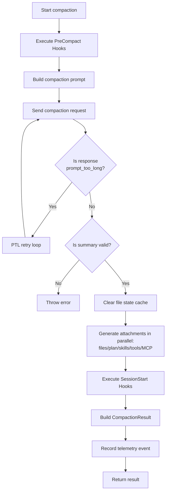
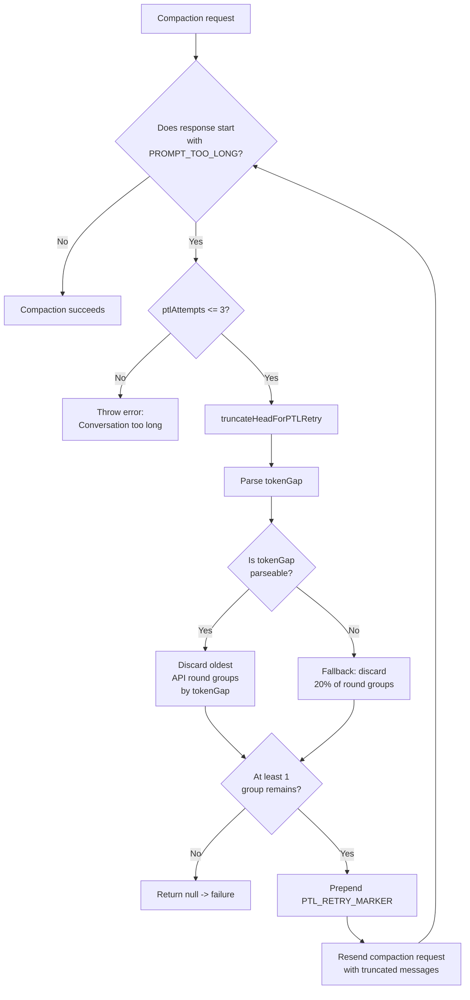
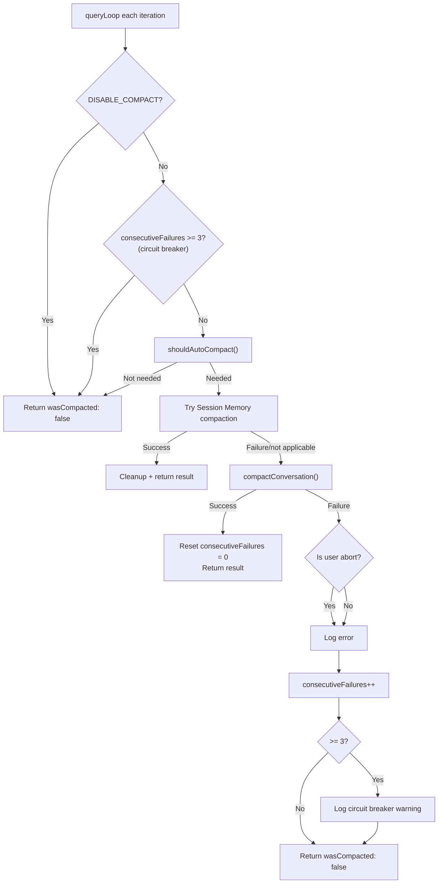

# Chapter 9: Auto-Compaction — When and How Context Gets Compressed

> *"The best compression is the one the user never notices."*

Every long-session user of Claude Code has experienced this moment: you're having the model incrementally refactor a complex module, when suddenly you notice its responses becoming "forgetful" — it forgets an interface signature you explicitly asked to preserve five minutes ago, or it re-suggests an approach you already rejected. The model didn't get dumber — **the context window filled up, and auto-compaction just fired**.

Compaction is the core mechanism of Claude Code's context management. It determines at what point and in what manner your conversation history gets condensed into a summary. Understanding this mechanism means you can predict when it triggers, control what it preserves, and know what to do when it "goes wrong."

This chapter will fully dissect auto-compaction from the source code level across three phases: **threshold determination** (when it triggers), **summary generation** (how it compresses), and **failure recovery** (what happens when it fails).

---

## 9.1 Threshold Calculation: When Auto-Compaction Triggers

### 9.1.1 The Core Formula

The trigger condition for auto-compaction can be expressed as a simple inequality:

```
current token count >= autoCompactThreshold
```

Computing `autoCompactThreshold` involves three constants and two layers of subtraction. Let's derive it step by step from the source code.

**Layer 1: Effective Context Window**

```typescript
// services/compact/autoCompact.ts:30
const MAX_OUTPUT_TOKENS_FOR_SUMMARY = 20_000

// services/compact/autoCompact.ts:33-48
export function getEffectiveContextWindowSize(model: string): number {
  const reservedTokensForSummary = Math.min(
    getMaxOutputTokensForModel(model),
    MAX_OUTPUT_TOKENS_FOR_SUMMARY,
  )
  let contextWindow = getContextWindowForModel(model, getSdkBetas())

  const autoCompactWindow = process.env.CLAUDE_CODE_AUTO_COMPACT_WINDOW
  if (autoCompactWindow) {
    const parsed = parseInt(autoCompactWindow, 10)
    if (!isNaN(parsed) && parsed > 0) {
      contextWindow = Math.min(contextWindow, parsed)
    }
  }

  return contextWindow - reservedTokensForSummary
}
```

The logic here is: subtract a "compaction output reservation" from the model's raw context window. `MAX_OUTPUT_TOKENS_FOR_SUMMARY = 20_000` comes from actual p99.99 compaction output statistics — 99.99% of compaction summaries fit within 17,387 tokens, and 20K is the upper bound with a safety margin.

Note the `Math.min(getMaxOutputTokensForModel(model), MAX_OUTPUT_TOKENS_FOR_SUMMARY)` operation: if a model's maximum output limit is itself below 20K (e.g., certain Bedrock configurations), the model's own limit is used instead.

**Layer 2: Auto-Compaction Buffer**

```typescript
// services/compact/autoCompact.ts:62
export const AUTOCOMPACT_BUFFER_TOKENS = 13_000

// services/compact/autoCompact.ts:72-91
export function getAutoCompactThreshold(model: string): number {
  const effectiveContextWindow = getEffectiveContextWindowSize(model)
  const autocompactThreshold =
    effectiveContextWindow - AUTOCOMPACT_BUFFER_TOKENS

  const envPercent = process.env.CLAUDE_AUTOCOMPACT_PCT_OVERRIDE
  if (envPercent) {
    const parsed = parseFloat(envPercent)
    if (!isNaN(parsed) && parsed > 0 && parsed <= 100) {
      const percentageThreshold = Math.floor(
        effectiveContextWindow * (parsed / 100),
      )
      return Math.min(percentageThreshold, autocompactThreshold)
    }
  }

  return autocompactThreshold
}
```

`AUTOCOMPACT_BUFFER_TOKENS = 13_000` is an additional safety buffer — it ensures that between threshold triggering and actual compaction execution, there's still enough room for extra tokens the current turn might produce (tool call results, system messages, etc.).

### 9.1.2 Threshold Calculation Table

Using Claude Sonnet 4 (200K context window) as an example:

| Calculation Step | Formula | Value |
|---------|------|------|
| Raw context window | `contextWindow` | 200,000 |
| Compaction output reservation | `MAX_OUTPUT_TOKENS_FOR_SUMMARY` | 20,000 |
| Effective context window | `contextWindow - 20,000` | 180,000 |
| Auto-compaction buffer | `AUTOCOMPACT_BUFFER_TOKENS` | 13,000 |
| **Auto-compaction threshold** | **`effectiveWindow - 13,000`** | **167,000** |
| Warning threshold | `autoCompactThreshold - 20,000` | 147,000 |
| Error threshold | `autoCompactThreshold - 20,000` | 147,000 |
| Blocking hard limit | `effectiveWindow - 3,000` | 177,000 |

> **Interactive version**: [Click to view the Token Dashboard animation](compaction-viz.html) — watch how a 200K window gets progressively filled, when compaction triggers, and how old messages get replaced by a summary.

Expressed more visually:

```
|<------------ 200K context window ------------>|
|<---- 167K usable ---->|<- 13K buffer ->|<- 20K compaction output reservation ->|
                        ^                ^
                 Auto-compaction    Effective window
                  trigger point       boundary
```

This means that under default configuration, auto-compaction triggers when your conversation has consumed approximately **83.5%** of the context window.

### 9.1.3 Environment Variable Overrides

Claude Code provides two environment variables for users (or test environments) to override the default thresholds:

**`CLAUDE_CODE_AUTO_COMPACT_WINDOW`** — Override context window size

```typescript
// services/compact/autoCompact.ts:40-46
const autoCompactWindow = process.env.CLAUDE_CODE_AUTO_COMPACT_WINDOW
if (autoCompactWindow) {
  const parsed = parseInt(autoCompactWindow, 10)
  if (!isNaN(parsed) && parsed > 0) {
    contextWindow = Math.min(contextWindow, parsed)
  }
}
```

This variable takes `Math.min(actual window, configured value)` — you can only **shrink** the window, not expand it. Typical use case: setting a smaller window value in CI environments to force more frequent compaction triggering for stability testing.

**`CLAUDE_AUTOCOMPACT_PCT_OVERRIDE`** — Override threshold by percentage

```typescript
// services/compact/autoCompact.ts:79-87
const envPercent = process.env.CLAUDE_AUTOCOMPACT_PCT_OVERRIDE
if (envPercent) {
  const parsed = parseFloat(envPercent)
  if (!isNaN(parsed) && parsed > 0 && parsed <= 100) {
    const percentageThreshold = Math.floor(
      effectiveContextWindow * (parsed / 100),
    )
    return Math.min(percentageThreshold, autocompactThreshold)
  }
}
```

For example, setting `CLAUDE_AUTOCOMPACT_PCT_OVERRIDE=50` makes the threshold 50% of the effective window (90,000 tokens), but again using `Math.min` — this override cannot be *higher* than the default threshold, it can only make compaction trigger earlier.

### 9.1.4 Complete Determination Flow

The `shouldAutoCompact()` function (`autoCompact.ts:160-239`) has a series of guard conditions before comparing token counts:

```
shouldAutoCompact(messages, model, querySource)
  |
  +- querySource is 'session_memory' or 'compact'? -> false (prevent recursion)
  +- querySource is 'marble_origami' (ctx-agent)? -> false (prevent shared state pollution)
  +- isAutoCompactEnabled() returns false? -> false
  |   +- DISABLE_COMPACT env var is truthy? -> false
  |   +- DISABLE_AUTO_COMPACT env var is truthy? -> false
  |   +- User config autoCompactEnabled = false? -> false
  +- REACTIVE_COMPACT experiment mode active? -> false (let reactive compact take over)
  +- Context Collapse active? -> false (collapse owns its own context management)
  |
  +- tokenCount >= autoCompactThreshold? -> true/false
```

Note the detailed source comments on Context Collapse (`autoCompact.ts:199-222`): autocompact triggers at roughly 93% of the effective window, while Context Collapse starts committing at 90% and blocks at 95% — if both run simultaneously, autocompact would "jump the gun" and destroy the fine-grained context that Collapse is preparing to save. Therefore, when Collapse is enabled, proactive autocompact is disabled, with only reactive compact retained as a fallback for 413 errors.

---

## 9.2 Circuit Breaker: Consecutive Failure Protection

### 9.2.1 Problem Background

In the ideal case, context shrinks significantly after compaction, and the next turn doesn't trigger again. But in practice there's a class of "unrecoverable" scenarios: the context contains large amounts of incompressible system messages, attachments, or encoded data, and the post-compaction result still exceeds the threshold, causing immediate re-triggering on the next turn — forming an infinite loop.

Source comments document a real-world scale data point (`autoCompact.ts:68-69`):

> BQ 2026-03-10: 1,279 sessions had 50+ consecutive failures (up to 3,272) in a single session, wasting ~250K API calls/day globally.

**1,279 sessions experienced consecutive failures, with one reaching 3,272 failures**, wasting approximately 250,000 API calls per day globally. This isn't an edge case — it's a systemic problem requiring hard protection.

### 9.2.2 Circuit Breaker Implementation

```typescript
// services/compact/autoCompact.ts:70
const MAX_CONSECUTIVE_AUTOCOMPACT_FAILURES = 3
```

The circuit breaker logic is extremely concise — the entire mechanism is under 20 lines of code:

```typescript
// services/compact/autoCompact.ts:257-265
if (
  tracking?.consecutiveFailures !== undefined &&
  tracking.consecutiveFailures >= MAX_CONSECUTIVE_AUTOCOMPACT_FAILURES
) {
  return { wasCompacted: false }
}
```

State tracking is passed between `queryLoop` iterations via the `AutoCompactTrackingState` type:

```typescript
// services/compact/autoCompact.ts:51-60
export type AutoCompactTrackingState = {
  compacted: boolean
  turnCounter: number
  turnId: string
  consecutiveFailures?: number  // Circuit breaker counter
}
```

- **On success** (`autoCompact.ts:332`): `consecutiveFailures` resets to 0
- **On failure** (`autoCompact.ts:341-349`): Counter increments; after reaching 3, a warning is logged and no further attempts are made
- **After tripping**: All subsequent autocompact requests for the session immediately return `{ wasCompacted: false }`

This design embodies an important principle: **it's better to let users manually run `/compact` than to waste API budget on retries doomed to fail**. The circuit breaker only blocks automatic compaction — users can still trigger it manually via the `/compact` command.

---

## 9.3 Compaction Prompt Dissection: The 9-Section Template

When the threshold triggers, Claude Code needs to send a special prompt to the model asking it to condense the entire conversation into a structured summary. The design of this prompt is critical to compaction quality — it directly determines what's preserved and what's lost in the summary.

### 9.3.1 Three Prompt Variants

The source code defines three compaction prompt variants, each corresponding to a different compaction scenario:

| Variant | Constant Name | Use Case | Summary Scope |
|------|--------|---------|---------|
| **BASE** | `BASE_COMPACT_PROMPT` | Full compaction (manual `/compact` or first auto-compaction) | Entire conversation |
| **PARTIAL** | `PARTIAL_COMPACT_PROMPT` | Partial compaction (preserving early context, only compressing new messages) | Recent messages (after preservation boundary) |
| **PARTIAL_UP_TO** | `PARTIAL_COMPACT_UP_TO_PROMPT` | Prefix compaction (cache hit optimization path) | Conversation portion before the summary |

The core difference between the three lies in the **"scope of vision" for the summary**:

- **BASE** tells the model: "Your task is to create a detailed summary of **the conversation so far**" — summarize everything
- **PARTIAL** tells the model: "Your task is to create a detailed summary of **the RECENT portion** of the conversation — the messages that follow earlier retained context" — only summarize the new portion
- **PARTIAL_UP_TO** tells the model: "This summary will be placed at the start of a continuing session; **newer messages that build on this context will follow after your summary**" — summarize the prefix, providing context for subsequent messages

### 9.3.2 Template Structure Analysis

Taking `BASE_COMPACT_PROMPT` as an example (`prompt.ts:61-143`), the entire prompt consists of 9 structured sections. Below is a section-by-section analysis of the design intent:

| Section | Title | Design Intent | Key Instruction |
|------|------|---------|---------|
| 1 | Primary Request and Intent | Capture the user's **explicit requests**, preventing post-compaction "topic drift" | "Capture all of the user's explicit requests and intents in detail" |
| 2 | Key Technical Concepts | Preserve **contextual anchors** for technical decisions | List all discussed technologies, frameworks, and concepts |
| 3 | Files and Code Sections | Preserve precise **file and code** context | "Include full code snippets where applicable" — note: full code snippets, not summaries |
| 4 | Errors and fixes | Preserve **debugging history** to prevent repeating mistakes | "Pay special attention to specific user feedback" |
| 5 | Problem Solving | Preserve the **problem-solving process**, not just results | "Document problems solved and any ongoing troubleshooting efforts" |
| 6 | All user messages | Preserve **all user messages** (non-tool-results) | "List ALL user messages that are not tool results" — ALL in caps for emphasis |
| 7 | Pending Tasks | Preserve the **incomplete task list** | Only list explicitly requested tasks |
| 8 | Current Work | Preserve the **precise state of current work** | "Describe in detail precisely what was being worked on immediately before this summary request" |
| 9 | Optional Next Step | Preserve **next steps** (with guard conditions) | "ensure that this step is DIRECTLY in line with the user's most recent explicit requests" |

### 9.3.3 The `<analysis>` Draft Block: A Hidden Quality Assurance Mechanism

Before the 9-section summary, the template requires the model to first generate an `<analysis>` block:

```typescript
// prompt.ts:31-44
const DETAILED_ANALYSIS_INSTRUCTION_BASE = `Before providing your final summary,
wrap your analysis in <analysis> tags to organize your thoughts and ensure
you've covered all necessary points. In your analysis process:

1. Chronologically analyze each message and section of the conversation.
   For each section thoroughly identify:
   - The user's explicit requests and intents
   - Your approach to addressing the user's requests
   - Key decisions, technical concepts and code patterns
   - Specific details like:
     - file names
     - full code snippets
     - function signatures
     - file edits
   - Errors that you ran into and how you fixed them
   - Pay special attention to specific user feedback...
2. Double-check for technical accuracy and completeness...`
```

This `<analysis>` block is a **drafting scratchpad** — the model traverses the entire conversation chronologically before generating the final summary. The key phrase is "**Chronologically analyze each message**", which forces the model to process sequentially rather than jumping around, reducing omissions.

But this draft block **does not appear in the final context**. The `formatCompactSummary()` function (`prompt.ts:311-335`) strips it out completely:

```typescript
// prompt.ts:316-319
formattedSummary = formattedSummary.replace(
  /<analysis>[\s\S]*?<\/analysis>/,
  '',
)
```

This is a clever application of chain-of-thought: leverage the `<analysis>` block to improve summary quality, but don't let it consume post-compaction context space. The draft block's tokens are only generated in the compaction API call's output and don't become a context burden for subsequent conversations.

### 9.3.4 NO_TOOLS_PREAMBLE: Preventing Tool Calls

All three variants inject a strong "no tool calls" preamble at the very beginning:

```typescript
// prompt.ts:19-26
const NO_TOOLS_PREAMBLE = `CRITICAL: Respond with TEXT ONLY. Do NOT call any tools.

- Do NOT use Read, Bash, Grep, Glob, Edit, Write, or ANY other tool.
- You already have all the context you need in the conversation above.
- Tool calls will be REJECTED and will waste your only turn — you will fail the task.
- Your entire response must be plain text: an <analysis> block followed by a <summary> block.
`
```

And there's a matching trailer at the end (`prompt.ts:269-272`):

```typescript
const NO_TOOLS_TRAILER =
  '\n\nREMINDER: Do NOT call any tools. Respond with plain text only — ' +
  'an <analysis> block followed by a <summary> block. ' +
  'Tool calls will be rejected and you will fail the task.'
```

Source comments explain why such an "aggressive" prohibition is needed (`prompt.ts:12-18`): compaction requests execute with `maxTurns: 1` (only one response turn allowed). If the model attempts a tool call during this turn, the tool call gets rejected, resulting in **no text output** — the entire compaction fails, falling back to the streaming fallback path. On Sonnet 4.6, this issue occurs at a rate of 2.79%. The dual prohibition at both start and end reduces this problem to negligible levels.

### 9.3.5 PARTIAL Variant Differences

The main differences between `PARTIAL_COMPACT_PROMPT` and `BASE_COMPACT_PROMPT` are:

1. **Scope limitation**: "Focus your summary on what was discussed, learned, and accomplished **in the recent messages only**"
2. **Analysis instruction**: `DETAILED_ANALYSIS_INSTRUCTION_PARTIAL` replaces the BASE version's "Chronologically analyze each message and section of the **conversation**" with "Analyze the **recent messages** chronologically"

`PARTIAL_COMPACT_UP_TO_PROMPT` is more distinctive — its section 8 changes from "Current Work" to "**Work Completed**", and section 9 changes from "Optional Next Step" to "**Context for Continuing Work**". This is because in UP_TO mode, the model only sees the first half of the conversation (the second half will be appended as-is as preserved messages), so the summary needs to provide context for a "continuation" rather than plan next steps.

---

## 9.4 Compaction Execution Flow

### 9.4.1 `compactConversation()` Main Flow

The `compactConversation()` function (`compact.ts:387-704`) is the core orchestrator of compaction. Its main flow can be summarized as:



Several noteworthy details:

**Pre-clear and post-restore** (`compact.ts:518-561`): After compaction completes, the code first clears the `readFileState` cache and `loadedNestedMemoryPaths`, then restores the most important file context via `createPostCompactFileAttachments()`. This is a "forget then recall" strategy — rather than preserving all file contents in the summary (unreliable), it re-reads the most critical files after compaction (highly deterministic). File restoration budget: up to 5 files, total of 50,000 tokens, per-file limit of 5,000 tokens.

**Attachment re-injection** (`compact.ts:566-585`): Compaction consumed the previous delta attachments (deferred tool declarations, agent listings, MCP instructions). The code regenerates these attachments after compaction using an "empty message history" as baseline, ensuring the model has complete tool and instruction context on the first post-compaction turn.

### 9.4.2 Post-Compaction Message Structure

The `CompactionResult` produced by compaction is assembled into the final message array via `buildPostCompactMessages()` (`compact.ts:330-338`):

```
[boundaryMarker, ...summaryMessages, ...messagesToKeep, ...attachments, ...hookResults]
```

Where:
- `boundaryMarker`: A `SystemCompactBoundaryMessage` marking where compaction occurred
- `summaryMessages`: The summary in user message format, containing the preamble generated by `getCompactUserSummaryMessage()` ("This session is being continued from a previous conversation that ran out of context")
- `messagesToKeep`: Recent messages preserved during partial compaction
- `attachments`: File, plan, skill, tool, and other attachments
- `hookResults`: Results from SessionStart hooks

---

## 9.5 PTL Retry: When Compaction Itself Is Too Long

### 9.5.1 Problem Scenario

This is a "recursive" dilemma: your conversation is too long and needs compaction, but **the compaction request itself** exceeds the API's input limit (prompt_too_long). In extremely long sessions (e.g., those consuming 190K+ tokens), sending the entire conversation history to the compaction model may push the compaction request's input tokens to or beyond the context window.

### 9.5.2 Retry Mechanism

The `truncateHeadForPTLRetry()` function (`compact.ts:243-291`) implements a "discard oldest content" retry strategy:



The core logic has three steps:

**Step 1: Group by API rounds**

```typescript
// compact.ts:257
const groups = groupMessagesByApiRound(input)
```

`groupMessagesByApiRound()` (`grouping.ts:22-60`) groups messages by API round boundaries — a new group starts whenever a new assistant message ID appears. This ensures the discard operation doesn't split a tool_use from its corresponding tool_result.

**Step 2: Calculate discard count**

```typescript
// compact.ts:260-272
const tokenGap = getPromptTooLongTokenGap(ptlResponse)
let dropCount: number
if (tokenGap !== undefined) {
  let acc = 0
  dropCount = 0
  for (const g of groups) {
    acc += roughTokenCountEstimationForMessages(g)
    dropCount++
    if (acc >= tokenGap) break
  }
} else {
  dropCount = Math.max(1, Math.floor(groups.length * 0.2))
}
```

If the API's prompt_too_long response includes a specific token gap, the code precisely accumulates from the oldest groups until covering this gap. If the gap isn't parseable (some Vertex/Bedrock error formats differ), it falls back to **discarding 20% of groups** — a conservative but effective heuristic.

**Step 3: Fix message sequence**

```typescript
// compact.ts:278-291
const sliced = groups.slice(dropCount).flat()
if (sliced[0]?.type === 'assistant') {
  return [
    createUserMessage({ content: PTL_RETRY_MARKER, isMeta: true }),
    ...sliced,
  ]
}
return sliced
```

After discarding the oldest groups, the remaining messages' first entry might be an assistant message (because the original conversation's user preamble was in group 0, which got discarded). The API requires the first message to be a user role, so the code inserts a synthetic user marker message `PTL_RETRY_MARKER`.

### 9.5.3 Preventing Marker Accumulation

Note a subtle handling at the beginning of `truncateHeadForPTLRetry()` (`compact.ts:250-255`):

```typescript
const input =
  messages[0]?.type === 'user' &&
  messages[0].isMeta &&
  messages[0].message.content === PTL_RETRY_MARKER
    ? messages.slice(1)
    : messages
```

Before grouping, if the first message in the sequence is a `PTL_RETRY_MARKER` inserted by a previous retry, the code strips it first. Otherwise, this marker would be grouped into group 0, and the 20% fallback strategy might "only discard this marker" — zero progress, and the second retry enters an infinite loop.

### 9.5.4 Retry Limit and Cache Passthrough

```typescript
// compact.ts:227
const MAX_PTL_RETRIES = 3
```

Maximum 3 retries. Each retry not only truncates messages but also updates `cacheSafeParams` (`compact.ts:487-490`) to ensure forked-agent paths also use the truncated messages:

```typescript
retryCacheSafeParams = {
  ...retryCacheSafeParams,
  forkContextMessages: truncated,
}
```

If all 3 retries still fail, it throws `ERROR_MESSAGE_PROMPT_TOO_LONG`, and the user sees: "Conversation too long. Press esc twice to go up a few messages and try again."

---

## 9.6 Complete Orchestration of `autoCompactIfNeeded()`

Chaining all the above mechanisms together, `autoCompactIfNeeded()` (`autoCompact.ts:241-351`) is the entry point called by `queryLoop` on each iteration. Its complete flow:



Note an interesting priority: the code first attempts **Session Memory compaction** (`autoCompact.ts:287-310`), and only falls back to traditional `compactConversation()` when Session Memory is unavailable or can't free sufficient space. Session Memory compaction is a more fine-grained strategy (pruning messages rather than full summarization), which will be discussed in detail in later chapters.

---

## 9.7 What Users Can Do

Having understood the inner mechanics of auto-compaction, here are concrete actions you can take as a user:

### 9.7.1 Observe Compaction Timing

When you see a brief "compacting..." status indicator during a long session, auto-compaction is in progress. Based on the threshold formula, with a 200K context window, this happens at roughly 167K tokens (about 83.5% usage).

### 9.7.2 Manually Compact Ahead of Time

Don't wait for auto-compaction to trigger. Before finishing one subtask and starting the next, proactively run `/compact`. Manual compaction allows you to pass custom instructions:

```
/compact Focus on preserving file modification history and error fix records, keep code snippets complete
```

These custom instructions get appended to the end of the compaction prompt, directly influencing summary content.

### 9.7.3 Leverage Compaction Instructions in CLAUDE.md

You can add a compaction instructions section to your project's `CLAUDE.md`, which will be automatically injected during every compaction:

```markdown
## Compact Instructions
When summarizing the conversation focus on typescript code changes
and also remember the mistakes you made and how you fixed them.
```

### 9.7.4 Adjust Thresholds with Environment Variables

If you find auto-compaction triggers too early (causing unnecessary context loss) or too late (causing frequent prompt_too_long errors), you can fine-tune with environment variables:

```bash
# Trigger compaction at 70% (more conservative, fewer PTL errors)
export CLAUDE_AUTOCOMPACT_PCT_OVERRIDE=70

# Or directly limit the "visible window" to 100K (for slow networks/tight budgets)
export CLAUDE_CODE_AUTO_COMPACT_WINDOW=100000
```

### 9.7.5 Disable Auto-Compaction (Not Recommended)

```bash
# Only disable auto-compaction, keep manual /compact
export DISABLE_AUTO_COMPACT=1

# Completely disable all compaction (including manual)
export DISABLE_COMPACT=1
```

Fully disabling means you must manage context manually, otherwise you'll encounter unrecoverable prompt_too_long errors when the context window is exhausted.

### 9.7.6 Understanding Post-Compaction "Forgetting"

What the model "forgets" after compaction depends entirely on what the 9-section summary template covers. The types of information most easily lost:

1. **Precise code diffs**: While the template requests "full code snippets," extremely long diff lists get truncated
2. **Specific reasons for rejected approaches**: The template focuses on "what was done," with weaker coverage of "why something wasn't done"
3. **Subtle preferences from early conversation**: If you mentioned "don't use lodash" once at the start, this may disappear after multiple compactions

Mitigation strategy: Write critical constraints into `CLAUDE.md` (unaffected by compaction), or explicitly list information to preserve in compaction instructions.

### 9.7.7 Recovery After Circuit Breaker Trips

If you notice the model no longer auto-compacts (circuit breaker tripped after 3 consecutive failures), you can:

1. Manually run `/compact` to attempt compaction
2. If that still fails, start a new session — in some cases the context is beyond recovery

---

## 9.8 Summary

Auto-compaction is one of Claude Code's most critical context management mechanisms, and its design reflects several important engineering principles:

1. **Multi-layer buffering**: 20K output reservation + 13K buffer + 3K blocking hard limit — three lines of defense ensure the system never overflows under any race condition
2. **Progressive degradation**: Session Memory compaction -> traditional compaction -> PTL retry -> circuit breaker — each layer is a fallback for the one above
3. **Observability**: `tengu_compact`, `tengu_compact_failed`, `tengu_compact_ptl_retry` — three telemetry events covering success, failure, and retry paths
4. **User controllability**: Environment variable overrides, custom compaction instructions, manual `/compact` command — giving advanced users sufficient control

The next chapter will explore the post-compaction file state preservation mechanism — compaction can "forget" conversation history, but it shouldn't "forget" which files it's editing.

---

## Version Evolution: v2.1.91 Changes

> The following analysis is based on v2.1.91 bundle signal comparison, combined with v2.1.88 source code inference.

### File State Staleness Detection

v2.1.91's `sdk-tools.d.ts` adds a new `staleReadFileStateHint` field:

```typescript
staleReadFileStateHint?: string;
// Model-facing note listing readFileState entries whose mtime bumped
// during this command (set when WRITE_COMMAND_MARKERS matches)
```

This means that during tool execution, if a Bash command modifies a previously read file, the system attaches a staleness hint to the tool result, informing the model that "file A you previously read has been modified." This complements the post-compaction file state preservation mechanism described in this chapter — compaction addresses "long-term memory," while staleness hints address "single-turn immediacy."
