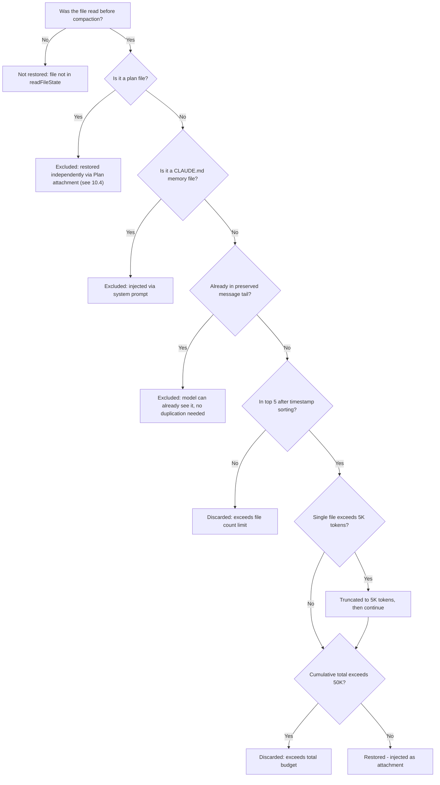
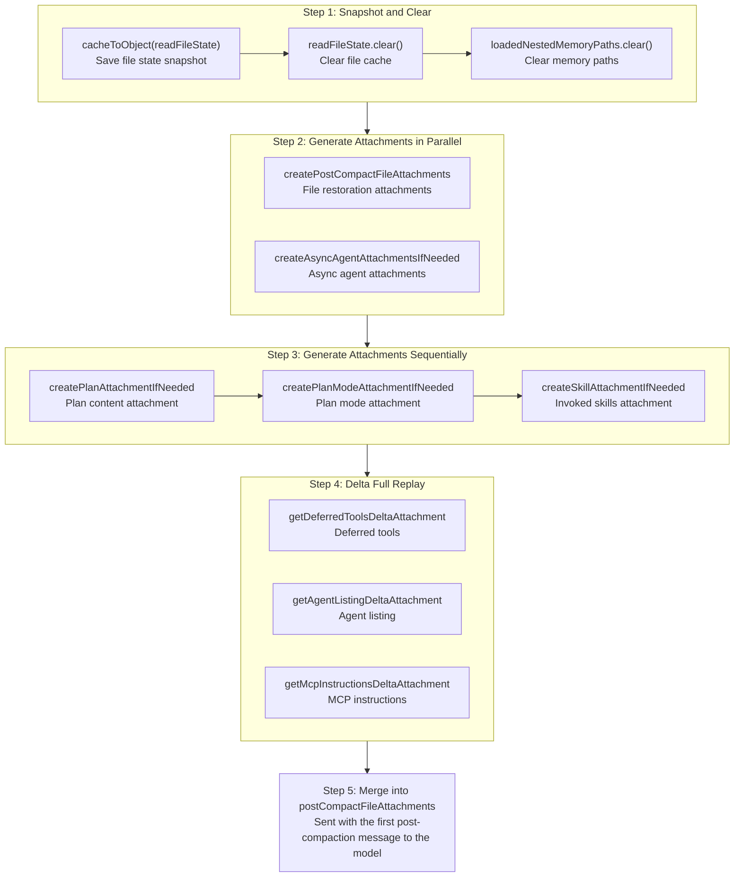

# Chapter 10: Post-Compaction File State Preservation

> *"Compression without restoration is just data loss with extra steps."*

Chapter 9 covered **when compaction triggers** and **how summaries are generated**. But the compaction story doesn't end after summary generation. When a long conversation gets condensed into a single summary message, the model loses all original context — it no longer knows which files it just read, doesn't remember the plan it was executing, and doesn't even know what tools are available. If the first turn after compaction asks the model to continue editing a file it "just" read, and the model blankly `Read`s it again, this not only wastes tokens but also interrupts the user's workflow.

This chapter's topic is **post-compaction state restoration** — how Claude Code, after compaction completes, injects key context the model "needs but has lost" back into the conversation flow through a series of carefully designed attachments. We'll dissect five restoration dimensions one by one: file state, skill content, plan state, delta tool declarations, and content deliberately not restored.

---

## 10.1 Pre-Compaction Snapshot: Save Before Clearing

The first step of compaction restoration isn't what you do after compaction, but **saving the scene before compaction**.

### 10.1.1 `cacheToObject` + `clear`: The Snapshot-Clear Pattern

```typescript
// services/compact/compact.ts:517-522
// Store the current file state before clearing
const preCompactReadFileState = cacheToObject(context.readFileState)

// Clear the cache
context.readFileState.clear()
context.loadedNestedMemoryPaths?.clear()
```

These three lines implement a classic **snapshot-clear** pattern:

1. **Snapshot**: `cacheToObject(context.readFileState)` serializes the in-memory `FileStateCache` (a Map structure) into a plain `Record<string, { content: string; timestamp: number }>` object. This object records every file the model read before compaction — filename, content, and the timestamp of the last read.

2. **Clear**: `context.readFileState.clear()` clears the file state cache, and `context.loadedNestedMemoryPaths?.clear()` clears the loaded nested memory paths.

Why clear first? Because compaction replaces conversation history with a single summary message. From the model's perspective, it's about to "forget" ever reading any files. If the cache isn't cleared, the system would falsely believe the model still "knows" the contents of these files, causing the subsequent file deduplication logic to malfunction. After clearing, the system enters a clean state, then selectively restores the most important files — rather than restoring everything.

### 10.1.2 Why Not Restore Everything?

This question touches the core design philosophy of compaction restoration. During a long session, the model may have read dozens or even hundreds of files. If all of them were injected back after compaction, it would create an absurd cycle: **the token space just freed by compaction would be immediately filled by restored file contents**.

Therefore, the restoration strategy is fundamentally a **budget allocation problem** — selectively restoring the most valuable state within a limited token budget.

---

## 10.2 File Restoration: Most Recent 5 Files, 5K Per File, 50K Total Budget

### 10.2.1 The Five-Constant Budget Framework

```typescript
// services/compact/compact.ts:122-130
export const POST_COMPACT_MAX_FILES_TO_RESTORE = 5
export const POST_COMPACT_TOKEN_BUDGET = 50_000
export const POST_COMPACT_MAX_TOKENS_PER_FILE = 5_000
export const POST_COMPACT_MAX_TOKENS_PER_SKILL = 5_000
export const POST_COMPACT_SKILLS_TOKEN_BUDGET = 25_000
```

These five constants form the complete budget framework for post-compaction restoration. The table below shows their allocation logic:

**Table 10-1: Post-Compaction Token Budget Allocation**

| Budget Category | Constant Name | Limit | Meaning |
|---------|--------|------|------|
| File count limit | `POST_COMPACT_MAX_FILES_TO_RESTORE` | 5 | Restore at most the 5 most recently read files |
| Per-file token limit | `POST_COMPACT_MAX_TOKENS_PER_FILE` | 5,000 | Each file occupies at most 5K tokens |
| File restoration total budget | `POST_COMPACT_TOKEN_BUDGET` | 50,000 | Total tokens across all restored files cannot exceed 50K |
| Per-skill token limit | `POST_COMPACT_MAX_TOKENS_PER_SKILL` | 5,000 | Each skill file truncated to 5K tokens |
| Skill restoration total budget | `POST_COMPACT_SKILLS_TOKEN_BUDGET` | 25,000 | Total tokens across all skills cannot exceed 25K |

Using a 200K context window as an example, the post-compaction summary occupies approximately 10K-20K tokens. File restoration consumes at most 50K, skill restoration at most 25K, totaling roughly 75K-95K — still leaving 100K+ space for subsequent conversation. This is a carefully considered balance: **restore enough context for the model to seamlessly continue working, but not so much that compaction becomes meaningless**.

### 10.2.2 Restoration Logic in Detail

```typescript
// services/compact/compact.ts:1415-1464
export async function createPostCompactFileAttachments(
  readFileState: Record<string, { content: string; timestamp: number }>,
  toolUseContext: ToolUseContext,
  maxFiles: number,
  preservedMessages: Message[] = [],
): Promise<AttachmentMessage[]> {
  const preservedReadPaths = collectReadToolFilePaths(preservedMessages)
  const recentFiles = Object.entries(readFileState)
    .map(([filename, state]) => ({ filename, ...state }))
    .filter(
      file =>
        !shouldExcludeFromPostCompactRestore(
          file.filename,
          toolUseContext.agentId,
        ) && !preservedReadPaths.has(expandPath(file.filename)),
    )
    .sort((a, b) => b.timestamp - a.timestamp)
    .slice(0, maxFiles)
  // ...
}
```

This function's logic breaks down into four steps:

**Step 1: Exclude files that don't need restoration**. `shouldExcludeFromPostCompactRestore` (lines 1674-1705) excludes two types of files:
- **Plan files** — they have their own independent restoration channel (see Section 10.4)
- **CLAUDE.md memory files** — these are injected via system prompts and don't need to be duplicated through the file restoration channel

Additionally, if a file path already appears in the preserved message tail (`preservedReadPaths`), it doesn't need redundant restoration — the model can already see it in context.

**Step 2: Sort by timestamp**. `.sort((a, b) => b.timestamp - a.timestamp)` arranges files in descending order of last read time. The most recently read files are most likely the ones the model needs to operate on next.

**Step 3: Take the top N**. `.slice(0, maxFiles)` takes the 5 most recent files. Note this truncation happens after exclusion filtering — if 3 out of 20 files are excluded, only 17 files participate in sorting, and the top 5 are taken from those.

**Step 4: Generate attachments in parallel**. For selected files, `generateFileAttachment` re-reads file contents in parallel, with each file subject to `POST_COMPACT_MAX_TOKENS_PER_FILE` (5K token) limits. An important detail here: restoration reads the **current content on disk**, not the cached content from the snapshot. If a file was modified externally during compaction (e.g., the user manually edited it in their editor), the restored content is the modified version.

**Step 5: Budget control**. After generating file attachments, there's one more budget gate:

```typescript
// services/compact/compact.ts:1452-1463
let usedTokens = 0
return results.filter((result): result is AttachmentMessage => {
  if (result === null) {
    return false
  }
  const attachmentTokens = roughTokenCountEstimation(jsonStringify(result))
  if (usedTokens + attachmentTokens <= POST_COMPACT_TOKEN_BUDGET) {
    usedTokens += attachmentTokens
    return true
  }
  return false
})
```

Even with only 5 files, if they're all large (each approaching 5K tokens), the total might exceed the 50K budget. This filter acts as the final gatekeeper — accumulating each file's token count in order, discarding remaining files once the total exceeds `POST_COMPACT_TOKEN_BUDGET` (50K).

### 10.2.3 "Preserve vs. Discard" Decision Tree

The following decision tree describes the complete logic for determining whether each file will be restored after compaction:



This decision tree reveals an important design: **restoration is not a simple "most recent N" algorithm, but a multi-layer filtering pipeline**. Exclusion rules, count limits, per-file truncation, and total budget caps — four layers of protection ensure restored content is both valuable and not excessively bloated.

---

## 10.3 Skill Re-injection: Selective Restoration of invokedSkills

### 10.3.1 Why Skills Need Independent Restoration

Skills are Claude Code's extensibility system. When a user invokes a skill during a session (such as `code-review` or `commit`), the skill's instructions are injected into the conversation. After compaction, these instructions disappear along with the rest of the context. But skills often contain critical behavioral constraints — like "must run tests before committing" or "focus on security issues during code review." If they aren't restored, the model may violate these constraints post-compaction.

### 10.3.2 Skill Restoration Mechanism

```typescript
// services/compact/compact.ts:1494-1534
export function createSkillAttachmentIfNeeded(
  agentId?: string,
): AttachmentMessage | null {
  const invokedSkills = getInvokedSkillsForAgent(agentId)

  if (invokedSkills.size === 0) {
    return null
  }

  // Sorted most-recent-first so budget pressure drops the least-relevant skills.
  let usedTokens = 0
  const skills = Array.from(invokedSkills.values())
    .sort((a, b) => b.invokedAt - a.invokedAt)
    .map(skill => ({
      name: skill.skillName,
      path: skill.skillPath,
      content: truncateToTokens(
        skill.content,
        POST_COMPACT_MAX_TOKENS_PER_SKILL,
      ),
    }))
    .filter(skill => {
      const tokens = roughTokenCountEstimation(skill.content)
      if (usedTokens + tokens > POST_COMPACT_SKILLS_TOKEN_BUDGET) {
        return false
      }
      usedTokens += tokens
      return true
    })

  if (skills.length === 0) {
    return null
  }

  return createAttachmentMessage({
    type: 'invoked_skills',
    skills,
  })
}
```

The skill restoration strategy is highly similar to file restoration, but with two key differences:

**Difference 1: Truncate rather than discard**. Source comments (lines 125-128) explain the design intent:

> Skills can be large (verify=18.7KB, claude-api=20.1KB). Previously re-injected unbounded on every compact -> 5-10K tok/compact. Per-skill truncation beats dropping -- instructions at the top of a skill file are usually the critical part.

Skill files can be large (the `verify` skill is 18.7KB, `claude-api` is 20.1KB), but **the instructions at the beginning of a skill file are usually the most critical part**. The `truncateToTokens` function truncates each skill to 5K tokens, preserving the top instructions and discarding the detailed reference content at the tail. This is more refined than a binary "keep all or drop all" strategy.

**Difference 2: Isolation by agent**. `getInvokedSkillsForAgent(agentId)` only returns skills belonging to the current agent. This prevents the main session's skills from leaking into a sub-agent's context, and vice versa.

### 10.3.3 Budget Arithmetic

How many skills can the 25K total budget restore? At 5K tokens per skill, theoretically at most 5 skills. Source comments also confirm this: "Budget sized to hold ~5 skills at the per-skill cap."

But in practice, many skills are under 5K tokens after truncation, so the 25K budget typically covers all invoked skills in a session. Only when a user invokes numerous large skills in a single long session does the budget become a bottleneck — in which case the oldest skills are dropped first.

---

## 10.4 Content Deliberately Not Restored: sentSkillNames

Not all cleared state needs to be restored. One of the most interesting design decisions in the source code is:

```typescript
// services/compact/compact.ts:524-529
// Intentionally NOT resetting sentSkillNames: re-injecting the full
// skill_listing (~4K tokens) post-compact is pure cache_creation with
// marginal benefit. The model still has SkillTool in its schema and
// invoked_skills attachment (below) preserves used-skill content. Ants
// with EXPERIMENTAL_SKILL_SEARCH already skip re-injection via the
// early-return in getSkillListingAttachments.
```

`sentSkillNames` is a module-level `Map<string, Set<string>>` that records which skill name listings have already been sent to the model. If it were reset after compaction, the system would re-inject the full skill listing attachment on the next request — approximately 4K tokens.

But the code **intentionally does not reset** it. The reasons are:
1. **Cost asymmetry**: The 4K token skill listing would be entirely `cache_creation` tokens (new content that needs to be written to cache), but the benefit is marginal — the model can still know about the skill tool's existence through the `SkillTool` schema.
2. **Already-invoked skills are already restored**: The `invoked_skills` attachment from the previous section already restores the content of actually used skills, so the model doesn't need to see the full name listing again.
3. **Experimental skill search**: Environments with `EXPERIMENTAL_SKILL_SEARCH` enabled already skip skill listing injection.

This is a textbook **token-saving engineering decision** — choosing "token cost" over "restoration completeness." 4K tokens may seem small, but they accumulate with each compaction. For long sessions that compact frequently, this represents significant savings.

---

## 10.5 Plan and PlanMode Attachment Preservation

Claude Code's plan mode allows the model to create a detailed plan before executing any operations. After compaction, the plan state must be fully preserved; otherwise, the model will "forget" the plan it was executing.

### 10.5.1 Plan Attachment

```typescript
// services/compact/compact.ts:545-548
const planAttachment = createPlanAttachmentIfNeeded(context.agentId)
if (planAttachment) {
  postCompactFileAttachments.push(planAttachment)
}
```

`createPlanAttachmentIfNeeded` (lines 1470-1486) checks whether the current agent has an active plan file. If so, the plan content is injected as a `plan_file_reference` type attachment. Note that plan files are explicitly excluded from file restoration by `shouldExcludeFromPostCompactRestore`, precisely because they have this independent restoration channel — avoiding the same file being restored twice and wasting budget.

### 10.5.2 PlanMode Attachment

```typescript
// services/compact/compact.ts:552-555
const planModeAttachment = await createPlanModeAttachmentIfNeeded(context)
if (planModeAttachment) {
  postCompactFileAttachments.push(planModeAttachment)
}
```

The Plan attachment restores **plan content**, while the PlanMode attachment restores **mode state**. `createPlanModeAttachmentIfNeeded` (lines 1542-1560) checks whether the user is currently in plan mode (`mode === 'plan'`). If so, it injects a `plan_mode` type attachment containing a `reminderType: 'full'` flag — ensuring the model continues operating in plan mode after compaction rather than reverting to normal execution mode.

These two attachments work in concert: the Plan attachment tells the model "you're executing this plan," and the PlanMode attachment tells the model "you must continue working in plan mode." Missing either one would cause behavioral deviation.

---

## 10.6 Delta Attachments: Re-announcing Tools and Instructions

Compaction doesn't just clear file state — it also clears all previous delta attachments. Delta attachments are "incremental information" the system progressively informs the model about during conversation — newly registered deferred tools, newly discovered agents, newly loaded MCP instructions. After compaction, this information disappears along with the old messages.

### 10.6.1 Full Replay of Three Delta Types

```typescript
// services/compact/compact.ts:563-585
// Compaction ate prior delta attachments. Re-announce from the current
// state so the model has tool/instruction context on the first
// post-compact turn. Empty message history -> diff against nothing ->
// announces the full set.
for (const att of getDeferredToolsDeltaAttachment(
  context.options.tools,
  context.options.mainLoopModel,
  [],
  { callSite: 'compact_full' },
)) {
  postCompactFileAttachments.push(createAttachmentMessage(att))
}
for (const att of getAgentListingDeltaAttachment(context, [])) {
  postCompactFileAttachments.push(createAttachmentMessage(att))
}
for (const att of getMcpInstructionsDeltaAttachment(
  context.options.mcpClients,
  context.options.tools,
  context.options.mainLoopModel,
  [],
)) {
  postCompactFileAttachments.push(createAttachmentMessage(att))
}
```

The source comment reveals this code's clever design: **passing an empty array `[]` as the message history**.

During normal conversation turns, delta attachment functions compare current state against what has already appeared in message history, sending only the "delta." But after compaction there's no message history to compare against — passing an empty array means the diff baseline is empty, so the functions generate **complete** tool and instruction declarations.

The three delta attachment types and their purposes:

| Delta Type | Function | Restored Content |
|-----------|------|---------|
| Deferred tools | `getDeferredToolsDeltaAttachment` | List of tools whose full schemas haven't been loaded yet, letting the model know it can fetch them on demand via `ToolSearch` |
| Agent listing | `getAgentListingDeltaAttachment` | List of available sub-agents, letting the model know it can delegate tasks |
| MCP instructions | `getMcpInstructionsDeltaAttachment` | Instructions and constraints provided by MCP servers, ensuring the model follows external service usage rules |

The `callSite: 'compact_full'` tag is used for telemetry analysis, distinguishing normal incremental declarations from post-compaction full replays.

### 10.6.2 Async Agent Attachments

```typescript
// services/compact/compact.ts:532-539
const [fileAttachments, asyncAgentAttachments] = await Promise.all([
  createPostCompactFileAttachments(
    preCompactReadFileState,
    context,
    POST_COMPACT_MAX_FILES_TO_RESTORE,
  ),
  createAsyncAgentAttachmentsIfNeeded(context),
])
```

`createAsyncAgentAttachmentsIfNeeded` (lines 1568-1599) checks whether there are async agents running in the background or completed agents whose results haven't been retrieved. If so, it generates a `task_status` type attachment for each agent, including the agent's description, status, and progress summary. This prevents the model from "forgetting" about background tasks post-compaction and redundantly launching the same tasks.

Note that file restoration and async agent attachment generation are executed **in parallel** (`Promise.all`) — a performance optimization since the two are independent and there's no reason to wait sequentially.

---

## 10.7 The Complete Restoration Orchestration

Now let's put all restoration steps together and see the complete orchestration of post-compaction state restoration (`compact.ts` lines 517-585):



The key characteristic of this orchestration is **layered and selective**. Not all state is restored, and the restoration methods differ — files are restored by re-reading from disk, skills are restored through truncated re-injection, plans are restored via dedicated attachments, and tool declarations are restored through delta replay. Each type of state has the restoration channel best suited to it.

---

## 10.8 What Users Can Do

Understanding the post-compaction restoration mechanism, you can adopt the following strategies to optimize your long-session experience:

### 10.8.1 Keep File Reads Focused

Only the 5 most recently read files are restored after compaction. If you had the model read 20 files in one conversation, only the last 5 will be automatically restored. This means the "reference files" you had the model read in the first half of the conversation — test cases, type definitions, config files — will likely all be lost after compaction.

**Strategy**: When executing complex tasks, prioritize having the model read files it **needs to edit next**, rather than "reading all related files first." The last files read are most likely to be preserved after compaction. If a file is critical to the task but hasn't been read in a while, consider having the model re-read it when you sense compaction is approaching (e.g., when the conversation has gone 30+ turns), refreshing its timestamp.

### 10.8.2 Truncation Expectations for Large Files

Each file restoration is capped at 5K tokens (approximately 2,000-2,500 lines of code, depending on language). If you're editing an oversized file, the model will only see the beginning of the file after compaction.

**Strategy**: At points where compaction might occur (when you notice the conversation has become very long), explicitly remind the model to focus on specific regions of large files. Or better yet, write key constraints into `CLAUDE.md` — it's never affected by compaction.

### 10.8.3 Post-Compaction Skill Behavior Changes

After skills are truncated to 5K tokens, reference content at the tail of the file may be lost. If a skill's behavior changes after compaction, this may be due to truncation.

**Strategy**: Place the most critical skill instructions at the **beginning** of the skill file, not the end. Claude Code's truncation strategy preserves the head — meaning skill files should be structured as "critical instructions first, supplementary reference after."

### 10.8.4 Using Plan Mode to Survive Compaction

If you're executing a multi-step task, using plan mode ensures the plan is fully preserved after compaction. Plan attachments are not subject to the 50K file budget — they have their own independent restoration channel.

**Strategy**: For complex tasks that might span a compaction boundary, have the model create a plan first (`/plan`), then execute step by step. Even if compaction occurs mid-execution, the model can restore the plan context and continue working.

### 10.8.5 Watch for "Post-Compaction Amnesia" Patterns

If the model suddenly, after compaction:
- Re-reads a file it "just" read — this file may have ranked 6th or lower and wasn't restored
- Forgets about a background agent — check if the agent was marked as `retrieved` or `pending`
- No longer follows an MCP tool's constraints — delta replay usually covers this, but edge cases may have gaps
- Re-proposes a previously rejected approach — summaries tend to preserve "what was done" rather than "what was rejected"

These are all normal engineering trade-offs. Budget is limited, and 100% restoration is neither possible nor necessary. Understanding which information "survives" compaction and which gets lost is a key skill for navigating long sessions.

### 10.8.6 Cumulative Effects of Multiple Compactions

An extremely long session may undergo multiple compactions. Each compaction:
- Clears and rebuilds all file state cache (up to 5 files)
- Re-truncates skill content (each time from original content, no "truncation of truncation")
- Regenerates delta attachments (full replay)

But summaries are **irreversible**. The second compaction's summary is generated from "the first summary + subsequent conversation," with information density decreasing with each pass. After three or four compactions, details from the beginning of the conversation are virtually impossible to preserve.

**Strategy**: For anticipated ultra-long tasks, proactively use `/compact` at key intermediate milestones with custom instructions explicitly listing critical information to preserve. Don't wait for the system to auto-compact — at that point you can't control the summary's focus.

---

## 10.9 Summary

Post-compaction state restoration reflects the fine balance Claude Code strikes between "information completeness" and "token economy":

1. **Snapshot-clear pattern**: Save the scene before clearing, ensuring restoration has a basis and cache state is consistent
2. **Layered budgets**: 50K for file restoration, 25K for skill restoration, an independent plan channel — different types of state have different restoration budgets and strategies
3. **Selective restoration**: Timestamp sorting + exclusion rules + budget control — three filtering layers ensure only the most valuable content is restored
4. **Deliberate non-restoration**: The preservation of `sentSkillNames` is a counter-intuitive but correct decision — the 4K token skill listing injection cost exceeds its benefit
5. **Delta full replay**: Passing empty message history to trigger a full replay is a clever reuse of existing incremental mechanisms

Core insight: Compaction is not "forgetting" — it's "selectively remembering." Understanding the logic of this selection allows you to predict what the model will remember and what it will forget post-compaction, and adjust your workflow accordingly.

---

## Version Evolution: v2.1.91 Changes

> The following analysis is based on v2.1.91 bundle signal comparison, combined with v2.1.88 source code inference.

### staleReadFileStateHint and File State Tracking

v2.1.91 adds a new `staleReadFileStateHint` field in tool result metadata. When tool execution (such as a Bash command) causes the mtime of a previously read file to change, the system sends a staleness hint to the model. This extends the file state tracking system described in this chapter — from "restoring file context post-compaction" to "detecting file changes within a single turn."

In v2.1.88, the `readFileState` cache (`cli/print.ts:1147-1177`) already existed in the source code; v2.1.91 exposes it as a model-perceivable output field.
