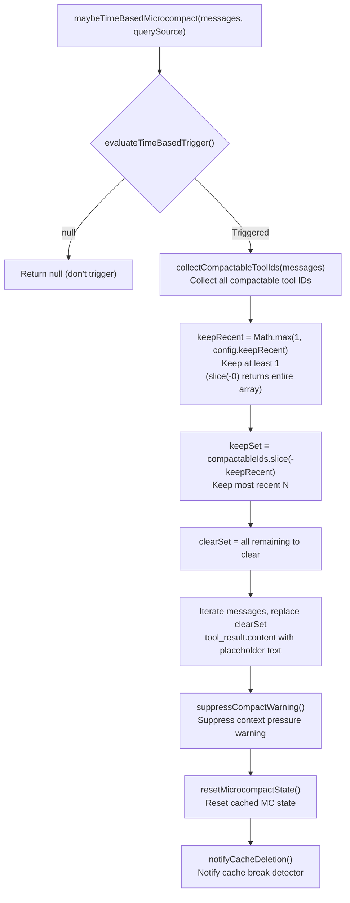
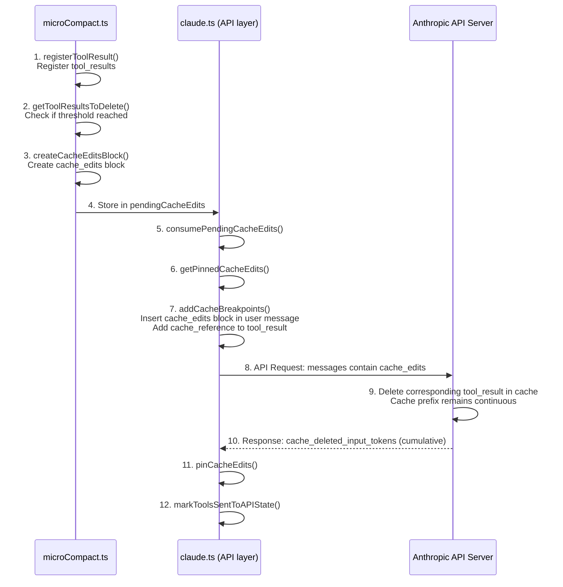

# Chapter 11: Micro-Compaction — Precise Context Pruning

> *"The cheapest token is the one you never send."*

In the previous chapter (Chapter 9), we thoroughly analyzed auto-compaction — when context approaches the window limit, Claude Code condenses the entire conversation into a structured summary. This is a "nuclear option": effective but costly. It loses the original details of the conversation and requires a full LLM call to generate the summary.

This chapter's protagonist is **micro-compaction** — a lightweight context pruning strategy. It doesn't generate summaries, doesn't call the LLM, but instead directly **clears or deletes** old tool call results. The 200 lines of `grep` output from three minutes ago, the config file `cat`'d half an hour ago, the Bash command logs from an hour ago — this information is "stale" for the model's current reasoning task. Micro-compaction's core philosophy is: **rather than letting this stale content occupy precious context space, remove it precisely at the right moment**.

Claude Code implements three micro-compaction mechanisms, which differ fundamentally in trigger conditions, execution approach, and cache impact:

| Dimension | Time-Based Micro-Compaction | Cached Micro-Compaction (cache_edits) | API Context Management |
|------|-----------------|-------------------------|----------------------|
| **Trigger** | Time gap since last assistant message exceeds threshold | Number of compactable tools exceeds threshold | API-side input_tokens exceeds threshold |
| **Execution location** | Client-side (modifies message content) | Server-side (cache_edits directive) | Server-side (context_management strategy) |
| **Cache impact** | Breaks cache prefix (expected behavior, since cache has expired) | Keeps cache prefix intact | Managed by the API layer |
| **Modification approach** | Replaces tool_result.content with placeholder text | Sends cache_edits delete directive | Declarative strategy, API executes automatically |
| **Applicable conditions** | Resuming session after long idle period | Incremental pruning during active sessions | All sessions (ant users, thinking models) |
| **Source entry point** | `maybeTimeBasedMicrocompact()` | `cachedMicrocompactPath()` | `getAPIContextManagement()` |
| **Feature gate** | `tengu_slate_heron` (GrowthBook) | `CACHED_MICROCOMPACT` (build) | Environment variable toggle |

The priority relationship between these three mechanisms is also clear: time-based triggers execute first and short-circuit, cached micro-compaction comes next, and API Context Management exists as an independent declarative layer that's always present.

---

> **Interactive version**: [Click to view the micro-compaction animation](microcompact-viz.html) — evaluate messages one by one: preserve key conclusions, prune redundant details, remove stale content.

## 11.1 Time-Based Micro-Compaction: Batch Cleanup After Cache Expiry

### 11.1.1 Design Intuition

Imagine this scenario: at 10 AM you use Claude Code to complete a complex refactor, then you go to lunch. You come back at 1 PM to continue working — a 3-hour gap.

What happened during those 3 hours? **The server-side prompt cache has expired.** Anthropic's prompt cache has two TTL tiers: 5 minutes (standard) and 1 hour (extended). Regardless of the tier, both have expired after 3 hours. This means your next API call will rewrite the **entire conversation history** into the cache — every single token will be re-billed as cache creation.

The logic of time-based micro-compaction is therefore very natural: **since the cache has expired and the entire prefix needs to be rewritten anyway, you might as well clean out unneeded old content first, making the rewrite smaller and cheaper**.

### 11.1.2 Configuration Parameters

Configuration is delivered via the GrowthBook feature flag `tengu_slate_heron`, typed as `TimeBasedMCConfig`:

```typescript
// services/compact/timeBasedMCConfig.ts:18-28
export type TimeBasedMCConfig = {
  /** Master switch. When false, time-based microcompact is a no-op. */
  enabled: boolean
  /** Trigger when (now - last assistant timestamp) exceeds this many minutes. */
  gapThresholdMinutes: number
  /** Keep this many most-recent compactable tool results. */
  keepRecent: number
}

const TIME_BASED_MC_CONFIG_DEFAULTS: TimeBasedMCConfig = {
  enabled: false,
  gapThresholdMinutes: 60,
  keepRecent: 5,
}
```

Each of the three parameters has its own rationale:

- **`enabled`** defaults to off — this is a gradual rollout feature, enabled incrementally via GrowthBook
- **`gapThresholdMinutes: 60`** aligns with the server's 1-hour cache TTL — this is the "safe choice." Source comments (line 23) explicitly state: "the server's 1h cache TTL is guaranteed expired for all users, so we never force a miss that wouldn't have happened"
- **`keepRecent: 5`** retains the 5 most recent tool results, providing the model with minimal working context

### 11.1.3 Trigger Determination

The `evaluateTimeBasedTrigger()` function (`microCompact.ts:422-444`) is a pure determination function with no side effects:

```typescript
// microCompact.ts:422-444
export function evaluateTimeBasedTrigger(
  messages: Message[],
  querySource: QuerySource | undefined,
): { gapMinutes: number; config: TimeBasedMCConfig } | null {
  const config = getTimeBasedMCConfig()
  if (!config.enabled || !querySource || !isMainThreadSource(querySource)) {
    return null
  }
  const lastAssistant = messages.findLast(m => m.type === 'assistant')
  if (!lastAssistant) {
    return null
  }
  const gapMinutes =
    (Date.now() - new Date(lastAssistant.timestamp).getTime()) / 60_000
  if (!Number.isFinite(gapMinutes) || gapMinutes < config.gapThresholdMinutes) {
    return null
  }
  return { gapMinutes, config }
}
```

Note the guard condition at line 428: `!querySource` immediately returns null. This differs from cached micro-compaction's behavior — `isMainThreadSource()` (lines 249-251) treats `undefined` as the main thread (for cached MC backward compatibility), but time-based triggering **explicitly requires** querySource to be present. Source comments (lines 429-431) explain: `/context`, `/compact`, and other analytical calls invoke `microcompactMessages()` without a source, and they shouldn't trigger time-based cleanup.

### 11.1.4 Execution Logic

When trigger conditions are met, `maybeTimeBasedMicrocompact()` executes the following steps:



The key implementation detail is in `microCompact.ts:470-492` — message modification uses an immutable style:

```typescript
// microCompact.ts:470-492
let tokensSaved = 0
const result: Message[] = messages.map(message => {
  if (message.type !== 'user' || !Array.isArray(message.message.content)) {
    return message
  }
  let touched = false
  const newContent = message.message.content.map(block => {
    if (
      block.type === 'tool_result' &&
      clearSet.has(block.tool_use_id) &&
      block.content !== TIME_BASED_MC_CLEARED_MESSAGE
    ) {
      tokensSaved += calculateToolResultTokens(block)
      touched = true
      return { ...block, content: TIME_BASED_MC_CLEARED_MESSAGE }
    }
    return block
  })
  if (!touched) return message
  return {
    ...message,
    message: { ...message.message, content: newContent },
  }
})
```

Note the guard at line 479: `block.content !== TIME_BASED_MC_CLEARED_MESSAGE` — this prevents double-counting `tokensSaved` for already-cleared content. This is an idempotency guarantee: multiple executions won't alter the tokensSaved statistics.

### 11.1.5 Side Effect Chain

After time-based trigger execution completes, three important side effects are produced:

1. **`suppressCompactWarning()`** (line 511): Micro-compaction freed context space, suppressing the user-visible "context about to fill" warning
2. **`resetMicrocompactState()`** (line 517): Clears the cached MC's tool registration state — since we just modified message content and broke the server cache, all of cached MC's old state (which tools were registered, which were deleted) is invalidated
3. **`notifyCacheDeletion(querySource)`** (line 526): Notifies the `promptCacheBreakDetection` module that the next API response's cache_read_tokens will drop — this is expected behavior, not a cache break bug

The third side effect is particularly subtle. Source comments (lines 520-522) explain why `notifyCacheDeletion` is used instead of `notifyCompaction`: "notifyCacheDeletion (not notifyCompaction) because it's already imported here and achieves the same false-positive suppression — adding the second symbol to the import was flagged by the circular-deps check." This is a pragmatic choice under circular dependency constraints: both functions have the same effect (both prevent false positives), but importing the additional symbol would trigger the circular dependency detector.

---

## 11.2 Cached Micro-Compaction: Precise Surgery Without Breaking the Cache

### 11.2.1 The Core Challenge

Time-based micro-compaction has a fundamental limitation: it **must modify message content**, which means the **cache prefix changes**, and the next API call incurs full cache creation costs. When the cache has already expired, this doesn't matter (it's being rewritten anyway). But during an active session, this is unacceptable — the cache prefix you just accumulated may represent tens of thousands of tokens in cache creation costs.

Cached micro-compaction solves this problem through Anthropic's API `cache_edits` feature: it **doesn't modify local message content**, but instead sends "delete the specified tool results from the server-side cache" directives to the API. The server removes this content in-place within the cache prefix, maintaining prefix continuity — the next request can still hit the existing cache.

### 11.2.2 How cache_edits Works

The following sequence diagram shows the complete lifecycle of cached micro-compaction:



Let's dissect this flow step by step.

### 11.2.3 Tool Registration and Threshold Determination

The `cachedMicrocompactPath()` function (`microCompact.ts:305-399`) first scans all messages, registering compactable tool results:

```typescript
// microCompact.ts:313-329
const compactableToolIds = new Set(collectCompactableToolIds(messages))
// Second pass: register tool results grouped by user message
for (const message of messages) {
  if (message.type === 'user' && Array.isArray(message.message.content)) {
    const groupIds: string[] = []
    for (const block of message.message.content) {
      if (
        block.type === 'tool_result' &&
        compactableToolIds.has(block.tool_use_id) &&
        !state.registeredTools.has(block.tool_use_id)
      ) {
        mod.registerToolResult(state, block.tool_use_id)
        groupIds.push(block.tool_use_id)
      }
    }
    mod.registerToolMessage(state, groupIds)
  }
}
```

Registration happens in two steps: `collectCompactableToolIds()` first collects all `tool_use` IDs from assistant messages that belong to the compactable tool set, then finds the corresponding `tool_result` entries in user messages, registering them grouped by message. Grouping is necessary because cache_edits deletion granularity is per individual tool_result, but trigger determination is based on total tool count.

After registration, `mod.getToolResultsToDelete(state)` is called to get the list of tools to delete. This function's logic is controlled by GrowthBook-configured `triggerThreshold` and `keepRecent` — when the total registered tool count exceeds `triggerThreshold`, keep the most recent `keepRecent`, and mark the rest for deletion.

### 11.2.4 cache_edits Block Lifecycle

When tools need to be deleted, the code creates a `CacheEditsBlock` and stores it in the module-level variable `pendingCacheEdits`:

```typescript
// microCompact.ts:334-339
const toolsToDelete = mod.getToolResultsToDelete(state)

if (toolsToDelete.length > 0) {
  const cacheEdits = mod.createCacheEditsBlock(state, toolsToDelete)
  if (cacheEdits) {
    pendingCacheEdits = cacheEdits
  }
```

The consumer of this `pendingCacheEdits` variable is the API layer's `claude.ts`. Before building API request parameters (line 1531), the code calls `consumePendingCacheEdits()` to retrieve pending edit directives in one shot:

```typescript
// claude.ts:1531-1532
const consumedCacheEdits = cachedMCEnabled ? consumePendingCacheEdits() : null
const consumedPinnedEdits = cachedMCEnabled ? getPinnedCacheEdits() : []
```

The design of `consumePendingCacheEdits()` is **single-consumption** (`microCompact.ts:88-94`): it immediately clears `pendingCacheEdits` after being called. Source comments (lines 1528-1530) explain why consumption can't happen inside `paramsFromContext`: "paramsFromContext is called multiple times (logging, retries), so consuming inside it would cause the first call to steal edits from subsequent calls."

### 11.2.5 Inserting cache_edits into the API Request

The `addCacheBreakpoints()` function (`claude.ts:3063-3162`) is responsible for weaving cache_edits directives into the message array. The core logic has three steps:

**Step 1: Re-insert pinned edits** (lines 3128-3139)

```typescript
// claude.ts:3128-3139
for (const pinned of pinnedEdits ?? []) {
  const msg = result[pinned.userMessageIndex]
  if (msg && msg.role === 'user') {
    if (!Array.isArray(msg.content)) {
      msg.content = [{ type: 'text', text: msg.content as string }]
    }
    const dedupedBlock = deduplicateEdits(pinned.block)
    if (dedupedBlock.edits.length > 0) {
      insertBlockAfterToolResults(msg.content, dedupedBlock)
    }
  }
}
```

On each API call, previously sent cache_edits must be re-sent at the **same positions** — the server needs to see a complete, consistent edit history to correctly rebuild the cache prefix. This is the purpose of `pinnedEdits`.

**Step 2: Insert new edits** (lines 3142-3162)

The new cache_edits block is inserted into the **last user message**, then the position index is pinned via `pinCacheEdits(i, newCacheEdits)`, ensuring subsequent calls re-send at the same position.

**Step 3: Deduplication**

The `deduplicateEdits()` helper function (lines 3116-3125) uses a `seenDeleteRefs` Set to ensure the same `cache_reference` doesn't appear in multiple blocks. This prevents an edge case: the same tool result being marked for deletion in different turns.

### 11.2.6 cache_edits Data Structure

At the API layer, the cache_edits block type definition (`claude.ts:3052-3055`) is quite concise:

```typescript
type CachedMCEditsBlock = {
  type: 'cache_edits'
  edits: { type: 'delete'; cache_reference: string }[]
}
```

Each edit is a `delete` operation pointing to a `cache_reference` — a unique identifier the server assigns to each `tool_result`. The client obtains these references from previous API responses, then references them in subsequent requests to specify which content to delete.

### 11.2.7 Baseline and Delta Tracking

`cachedMicrocompactPath()` records a `baselineCacheDeletedTokens` value when returning results (lines 374-383):

```typescript
// microCompact.ts:374-383
const lastAsst = messages.findLast(m => m.type === 'assistant')
const baseline =
  lastAsst?.type === 'assistant'
    ? ((
        lastAsst.message.usage as unknown as Record<
          string,
          number | undefined
        >
      )?.cache_deleted_input_tokens ?? 0)
    : 0
```

The API-returned `cache_deleted_input_tokens` is a **cumulative value** — it includes the total tokens deleted by all cache_edits operations in the current session. To calculate the actual delta from the current operation, the baseline before the operation must be recorded, then subtracted from the new cumulative value in the API response. This design avoids imprecise token estimation on the client side.

### 11.2.8 Mutual Exclusion with Time-Based Trigger

The entry function `microcompactMessages()` (lines 253-293) defines strict priority:

```typescript
// microCompact.ts:267-270
const timeBasedResult = maybeTimeBasedMicrocompact(messages, querySource)
if (timeBasedResult) {
  return timeBasedResult
}
```

Time-based trigger executes first and short-circuits. Source comments (lines 261-266) explain why: "If the gap since the last assistant message exceeds the threshold, the server cache has expired and the full prefix will be rewritten regardless — so content-clear old tool results now ... Cached MC (cache-editing) is skipped when this fires: editing assumes a warm cache, and we just established it's cold."

This is an elegant mutual exclusion design:

- **Warm cache**: Use cache_edits to delete content without breaking the cache
- **Cold cache**: Use time-based trigger to directly modify content, since the cache has already expired

The two mechanisms never execute simultaneously.

---

## 11.3 API Context Management: Declarative Context Management

### 11.3.1 From Imperative to Declarative

The previous two micro-compaction mechanisms are both **imperative** — the client decides which tools to delete, when, and how. API Context Management is **declarative**: the client only needs to describe "when context exceeds X tokens, clear Y type of content, keep the most recent Z," and the API server executes automatically.

This logic is located in `apiMicrocompact.ts`. The `getAPIContextManagement()` function builds a `ContextManagementConfig` object that's sent with the API request:

```typescript
// apiMicrocompact.ts:59-62
export type ContextManagementConfig = {
  edits: ContextEditStrategy[]
}
```

### 11.3.2 Two Strategy Types

The `ContextEditStrategy` union type defines two server-executable edit strategies:

**Strategy 1: `clear_tool_uses_20250919`**

```typescript
// apiMicrocompact.ts:36-53
| {
    type: 'clear_tool_uses_20250919'
    trigger?: {
      type: 'input_tokens'
      value: number        // Trigger when input tokens exceed this value
    }
    keep?: {
      type: 'tool_uses'
      value: number        // Keep the most recent N tool uses
    }
    clear_tool_inputs?: boolean | string[]  // Which tools' inputs to clear
    exclude_tools?: string[]                // Which tools to exclude
    clear_at_least?: {
      type: 'input_tokens'
      value: number        // Clear at least this many tokens
    }
  }
```

**Strategy 2: `clear_thinking_20251015`**

```typescript
// apiMicrocompact.ts:54-56
| {
    type: 'clear_thinking_20251015'
    keep: { type: 'thinking_turns'; value: number } | 'all'
  }
```

This strategy specifically handles thinking blocks — extended thinking models (like Claude Sonnet 4 with thinking) generate large amounts of thinking process, whose value in subsequent turns decays rapidly.

### 11.3.3 Strategy Composition Logic

`getAPIContextManagement()` composes multiple strategies based on runtime conditions:

```typescript
// apiMicrocompact.ts:64-88
export function getAPIContextManagement(options?: {
  hasThinking?: boolean
  isRedactThinkingActive?: boolean
  clearAllThinking?: boolean
}): ContextManagementConfig | undefined {
  const {
    hasThinking = false,
    isRedactThinkingActive = false,
    clearAllThinking = false,
  } = options ?? {}

  const strategies: ContextEditStrategy[] = []

  // Strategy 1: thinking management
  if (hasThinking && !isRedactThinkingActive) {
    strategies.push({
      type: 'clear_thinking_20251015',
      keep: clearAllThinking
        ? { type: 'thinking_turns', value: 1 }
        : 'all',
    })
  }
  // ...
}
```

The three branches for thinking strategy:

| Condition | Behavior | Reason |
|------|------|------|
| `hasThinking && !isRedactThinkingActive && !clearAllThinking` | `keep: 'all'` | Keep all thinking (normal working state) |
| `hasThinking && !isRedactThinkingActive && clearAllThinking` | `keep: { type: 'thinking_turns', value: 1 }` | Keep only the last 1 turn of thinking (idle > 1 hour = cache expired) |
| `isRedactThinkingActive` | Don't add strategy | Redacted thinking blocks have no model-visible content, no management needed |

Note that `clearAllThinking` sets value to 1 instead of 0 — source comments (line 81) explain: "the API schema requires value >= 1, and omitting the edit falls back to the model-policy default (often 'all'), which wouldn't clear."

### 11.3.4 Two Modes of Tool Clearing

Within the `clear_tool_uses_20250919` strategy, tool clearing has two complementary modes:

**Mode 1: Clear tool results (`clear_tool_inputs`)**

```typescript
// apiMicrocompact.ts:104-124
if (useClearToolResults) {
  const strategy: ContextEditStrategy = {
    type: 'clear_tool_uses_20250919',
    trigger: { type: 'input_tokens', value: triggerThreshold },
    clear_at_least: {
      type: 'input_tokens',
      value: triggerThreshold - keepTarget,
    },
    clear_tool_inputs: TOOLS_CLEARABLE_RESULTS,
  }
  strategies.push(strategy)
}
```

`TOOLS_CLEARABLE_RESULTS` (lines 19-26) contains tools whose **outputs are large but disposable**: Shell commands, Glob, Grep, FileRead, WebFetch, WebSearch. These tools' results are typically search outputs or file contents — the model has already processed them, and clearing them doesn't affect subsequent reasoning.

**Mode 2: Clear tool uses (`exclude_tools`)**

```typescript
// apiMicrocompact.ts:128-149
if (useClearToolUses) {
  const strategy: ContextEditStrategy = {
    type: 'clear_tool_uses_20250919',
    trigger: { type: 'input_tokens', value: triggerThreshold },
    clear_at_least: {
      type: 'input_tokens',
      value: triggerThreshold - keepTarget,
    },
    exclude_tools: TOOLS_CLEARABLE_USES,
  }
  strategies.push(strategy)
}
```

`TOOLS_CLEARABLE_USES` (lines 28-32) contains FileEdit, FileWrite, and NotebookEdit — tools whose **inputs** (i.e., the edit instructions the model sends) are typically larger than their outputs. The semantics of `exclude_tools` is "clear all tool uses except these tools," allowing the API side to clean up more aggressively.

The default parameters for both modes are identical: `triggerThreshold = 180,000` (roughly equal to the auto-compaction warning threshold), `keepTarget = 40,000` (keep the last 40K tokens), `clear_at_least = triggerThreshold - keepTarget = 140,000` (free at least 140K tokens). These values can be overridden via `API_MAX_INPUT_TOKENS` and `API_TARGET_INPUT_TOKENS` environment variables.

---

## 11.4 Compactable Tool Set Inventory

The three micro-compaction mechanisms each define different compactable tool sets. Understanding these differences is crucial for predicting which tool results will be cleared.

### 11.4.1 `COMPACTABLE_TOOLS` (Shared by Time-Based + Cached Micro-Compaction)

```typescript
// microCompact.ts:41-50
const COMPACTABLE_TOOLS = new Set<string>([
  FILE_READ_TOOL_NAME,      // Read
  ...SHELL_TOOL_NAMES,       // Bash (multiple shell variants)
  GREP_TOOL_NAME,            // Grep
  GLOB_TOOL_NAME,            // Glob
  WEB_SEARCH_TOOL_NAME,      // WebSearch
  WEB_FETCH_TOOL_NAME,       // WebFetch
  FILE_EDIT_TOOL_NAME,       // Edit
  FILE_WRITE_TOOL_NAME,      // Write
])
```

### 11.4.2 `TOOLS_CLEARABLE_RESULTS` (API clear_tool_inputs)

```typescript
// apiMicrocompact.ts:19-26
const TOOLS_CLEARABLE_RESULTS = [
  ...SHELL_TOOL_NAMES,
  GLOB_TOOL_NAME,
  GREP_TOOL_NAME,
  FILE_READ_TOOL_NAME,
  WEB_FETCH_TOOL_NAME,
  WEB_SEARCH_TOOL_NAME,
]
```

### 11.4.3 `TOOLS_CLEARABLE_USES` (API exclude_tools)

```typescript
// apiMicrocompact.ts:28-32
const TOOLS_CLEARABLE_USES = [
  FILE_EDIT_TOOL_NAME,       // Edit
  FILE_WRITE_TOOL_NAME,      // Write
  NOTEBOOK_EDIT_TOOL_NAME,   // NotebookEdit
]
```

Key differences:

| Tool | COMPACTABLE_TOOLS | CLEARABLE_RESULTS | CLEARABLE_USES |
|------|:-:|:-:|:-:|
| Shell (Bash) | yes | yes | -- |
| Grep | yes | yes | -- |
| Glob | yes | yes | -- |
| FileRead (Read) | yes | yes | -- |
| WebSearch | yes | yes | -- |
| WebFetch | yes | yes | -- |
| FileEdit (Edit) | yes | -- | yes |
| FileWrite (Write) | yes | -- | yes |
| NotebookEdit | -- | -- | yes |

NotebookEdit only appears in the API's `TOOLS_CLEARABLE_USES` — client-side micro-compaction doesn't handle it. FileEdit and FileWrite clear **results** (tool_result) on the client side, but in API mode they're excluded from `clear_tool_inputs` and handled in `exclude_tools` instead. This layered design lets the client and server each handle the parts best suited to them.

---

## 11.5 Coordinating with Cache Break Detection

### 11.5.1 The Problem: Micro-Compaction Triggers False Positives

The `promptCacheBreakDetection.ts` module continuously monitors `cache_read_tokens` in API responses. When this value drops by more than 5% compared to the last request and the absolute decrease exceeds 2,000 tokens, it reports a "cache break" — this typically means some change (system prompt modification, tool list change) has invalidated the cache prefix.

But micro-compaction **intentionally** reduces cached content. Without coordination, every micro-compaction would trigger a false positive. Claude Code solves this through two notification functions:

### 11.5.2 `notifyCacheDeletion()`

```typescript
// promptCacheBreakDetection.ts:673-682
export function notifyCacheDeletion(
  querySource: QuerySource,
  agentId?: AgentId,
): void {
  const key = getTrackingKey(querySource, agentId)
  const state = key ? previousStateBySource.get(key) : undefined
  if (state) {
    state.cacheDeletionsPending = true
  }
}
```

**When called**: After cached micro-compaction sends cache_edits (`microCompact.ts:366`), and after time-based trigger modifies message content (`microCompact.ts:526`).

**Effect**: Sets `cacheDeletionsPending = true`. When the next API response arrives, `checkResponseForCacheBreak()` (lines 472-481) sees this flag and skips break detection entirely:

```typescript
// promptCacheBreakDetection.ts:472-481
if (state.cacheDeletionsPending) {
  state.cacheDeletionsPending = false
  logForDebugging(
    `[PROMPT CACHE] cache deletion applied, cache read: ${prevCacheRead}
     -> ${cacheReadTokens} (expected drop)`,
  )
  state.pendingChanges = null
  return
}
```

### 11.5.3 `notifyCompaction()`

```typescript
// promptCacheBreakDetection.ts:689-698
export function notifyCompaction(
  querySource: QuerySource,
  agentId?: AgentId,
): void {
  const key = getTrackingKey(querySource, agentId)
  const state = key ? previousStateBySource.get(key) : undefined
  if (state) {
    state.prevCacheReadTokens = null
  }
}
```

**When called**: After full compaction (`compact.ts:699`) and auto-compaction (`autoCompact.ts:303`) complete.

**Effect**: Resets `prevCacheReadTokens` to null, meaning there's no "previous value" for comparison on the next API response — the detector treats it as a "first call" and doesn't report a break.

**The difference between the two functions**:

| Function | Reset approach | Applicable scenario |
|------|---------|---------|
| `notifyCacheDeletion` | Marks `cacheDeletionsPending = true`, skips next detection but preserves baseline | Micro-compaction (partial deletion, baseline still has reference value) |
| `notifyCompaction` | Sets `prevCacheReadTokens` to null, completely resets baseline | Full compaction (message structure completely changed, old baseline is meaningless) |

---

## 11.6 Sub-Agent Isolation

An important scenario the micro-compaction system must handle is **sub-agents**. Claude Code's main thread can fork multiple sub-agents (session_memory, prompt_suggestion, etc.), each with an independent conversation history.

`cachedMicrocompactPath` only executes on the main thread (`microCompact.ts:275-285`):

```typescript
// microCompact.ts:275-285
if (feature('CACHED_MICROCOMPACT')) {
  const mod = await getCachedMCModule()
  const model = toolUseContext?.options.mainLoopModel ?? getMainLoopModel()
  if (
    mod.isCachedMicrocompactEnabled() &&
    mod.isModelSupportedForCacheEditing(model) &&
    isMainThreadSource(querySource)
  ) {
    return await cachedMicrocompactPath(messages, querySource)
  }
}
```

Source comments (lines 272-276) explain the reason: "Only run cached MC for the main thread to prevent forked agents from registering their tool_results in the global cachedMCState, which would cause the main thread to try deleting tools that don't exist in its own conversation."

`cachedMCState` is a module-level global variable. If sub-agents registered their own tool IDs, the main thread would attempt to delete those IDs on its next execution — but they don't exist in the main thread's messages, resulting in invalid cache_edits directives. The `isMainThreadSource(querySource)` guard completely excludes sub-agents from cached micro-compaction.

The implementation of `isMainThreadSource()` (lines 249-251) uses prefix matching rather than exact matching:

```typescript
// microCompact.ts:249-251
function isMainThreadSource(querySource: QuerySource | undefined): boolean {
  return !querySource || querySource.startsWith('repl_main_thread')
}
```

This is because `promptCategory.ts` sets querySource to `'repl_main_thread:outputStyle:<style>'` — if strict `=== 'repl_main_thread'` checking were used, users with non-default output styles would be silently excluded from cached micro-compaction. Source comments (lines 246-248) flag the old exact matching as a "latent bug."

---

## 11.7 What Users Can Do

Understanding the three micro-compaction mechanisms, you can adopt the following strategies to optimize your daily experience:

### 11.7.1 Understanding Why "Tool Results Disappear"

When you notice the model "forgetting" a previous `grep` or `cat` result later in the conversation, this is likely not model hallucination but micro-compaction actively clearing old tool results. Cleared tool results are replaced with `[Old tool result content cleared]` placeholder text. If you need the model to re-reference a search result, simply ask it to re-execute the search — this is more reliable than trying to make the model "recall" cleared content.

### 11.7.2 Expectation Management After Long Breaks

If you leave for more than 1 hour and return to continue a conversation, time-based micro-compaction may have cleared most old tool results (keeping only the 5 most recent). This is by design — since the server cache has expired, clearing old content can significantly reduce the cache creation cost of the next API call. Returning and having the model re-read key files is normal and efficient behavior.

### 11.7.3 Using CLAUDE.md to Preserve Key Context

Micro-compaction only clears tool call results — it doesn't affect `CLAUDE.md` content injected via system prompts. If certain information (such as project conventions, architectural decisions, key file paths) needs to remain effective throughout the entire session, writing them into `CLAUDE.md` is the most reliable approach — they're unaffected by any compaction or micro-compaction mechanism.

### 11.7.4 Cost Awareness for Parallel Tool Calls

When the model simultaneously initiates multiple search or read operations, the aggregate size of these results is limited by the 200K character per-message budget. If you observe some parallel tools' results being persisted to disk (the model will indicate "Output too large, saved to file"), this is the budget mechanism preventing context bloat. You can reduce individual tool output size through more precise search criteria.

### 11.7.5 Awareness of Non-Compactable Tools

Not all tool results are cleared by micro-compaction. `FileEdit`, `FileWrite`, and other write-type tools' **results** are clearable in client-side micro-compaction, but tools like `ToolSearch`, `SendMessage`, etc. are not in the compactable set. Knowing which tool results will be cleared (see the comparison table in Section 11.4) helps you understand the model's behavioral changes during long sessions.

---

## 11.8 Design Pattern Summary

The micro-compaction system showcases several engineering patterns worth studying:

**Layered degradation**: The three mechanisms form a hierarchy — API Context Management serves as a declarative baseline that's always present; cached micro-compaction provides precise surgery in environments supporting cache_edits; time-based trigger serves as the fallback after cache expiry. Each layer has clear preconditions and degradation paths.

**Side effect coordination**: Micro-compaction is not an isolated operation — it must notify the cache break detector (prevent false positives), reset related state (prevent dirty data), and suppress user warnings (prevent confusion). These three side effects are coordinated through explicit function calls (`notifyCacheDeletion`, `resetMicrocompactState`, `suppressCompactWarning`) rather than an event system, maintaining the traceability of the causal chain.

**Single-consumption semantics**: `consumePendingCacheEdits()` immediately clears data after returning it — preventing duplicate consumption during API retry scenarios. This pattern is very practical when one-time state needs to be passed across modules.

**Immutable message modification**: The time-based trigger path uses `map` + spread operators to create new message arrays rather than modifying in place. This ensures that if the micro-compaction logic has a bug, the original messages aren't polluted. Cached micro-compaction goes even further — it **completely avoids modifying** local messages, with all modifications happening server-side.

**Circular dependency avoidance**: `notifyCacheDeletion` is reused in place of `notifyCompaction` solely because importing the latter would trigger the circular dependency detector. This kind of pragmatic compromise is common in large codebases — perfect module boundaries yield to build system constraints. The source comments candidly document this trade-off rather than trying to hide it.

---

## Version Evolution: v2.1.91 Changes

> The following analysis is based on v2.1.91 bundle signal comparison, combined with v2.1.88 source code inference.

### Cold Compact

v2.1.91 introduces the `tengu_cold_compact` event, suggesting a new "cold compact" strategy alongside the existing "hot compact" (urgent, triggered automatically when context is about to fill):

| Comparison | Hot Compact (v2.1.88) | Cold Compact (v2.1.91 inferred) |
|---------|------------------|---------------------|
| Trigger timing | Context reaches blocking threshold | Context approaching full but not yet blocking |
| Urgency | High — can't continue without compacting | Low — can be deferred to next turn |
| User perception | Executes silently | May have dialog confirmation |

### Compaction Dialog

The new `tengu_autocompact_dialog_opened` event indicates v2.1.91 introduces a compaction confirmation UI — users can see a notification before compaction occurs and choose whether to proceed. This improves compaction operation transparency, contrasting with v2.1.88's completely silent compaction.

### Rapid Refill Circuit Breaker

`tengu_auto_compact_rapid_refill_breaker` addresses an edge case: after compaction, if large numbers of tool results quickly refill the context (e.g., reading multiple large files), the system may enter a "compact -> refill -> re-compact" loop. This circuit breaker interrupts the loop when it detects a rapid refill pattern, avoiding pointless API overhead.

### Manual Compaction Tracking

`tengu_autocompact_command` distinguishes user-initiated `/compact` commands from system-triggered auto-compaction, enabling telemetry data to accurately reflect user intent vs. system behavior.
