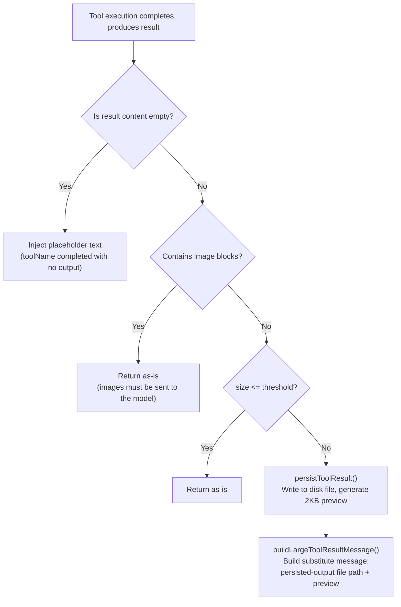
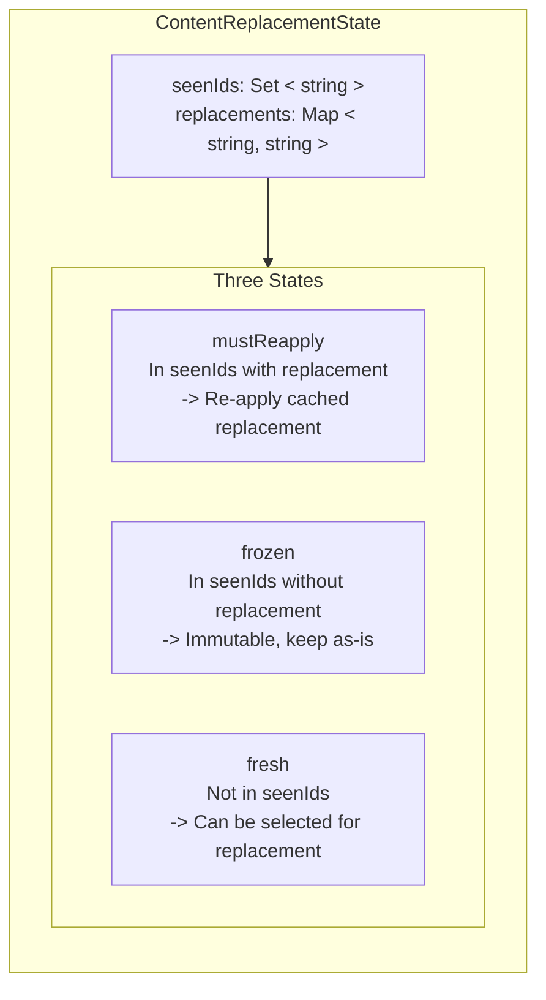
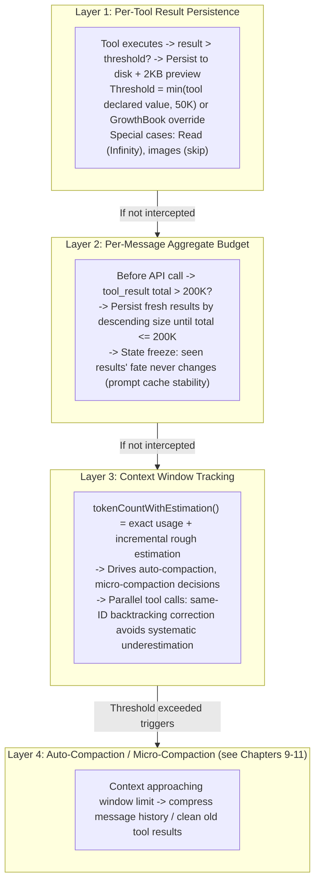

# Chapter 12: Token Budgeting Strategies

## Why This Matters

In Chapters 9-11, we analyzed how Claude Code compresses and prunes after the context window "fills up." But there's an even more fundamental question: **before content enters the context window, how do you control its size?**

A single `grep` returns 80KB of search results, a single `cat` reads a 200KB log file, five parallel tool calls each return 50KB — these are real scenarios. Without control, a single tool result could consume a quarter of the context window, and a set of parallel tool calls could push the context straight to the compaction threshold.

Token budgeting strategies are Claude Code's "entry gate" for context management. They operate at three levels:

1. **Per-tool-result level**: Results exceeding a threshold are persisted to disk, with only a preview shown to the model
2. **Per-message level**: Total results from one round of parallel tool calls cannot exceed 200K characters
3. **Token counting level**: Context window usage is tracked via canonical API or rough estimation

This chapter will dive deep into these three levels of implementation, revealing the engineering trade-offs involved — particularly the token counting pitfalls in parallel tool call scenarios.

---

## 12.1 Tool Result Persistence: The 50K Character Entry Gate

### Core Constants

Tool result size control revolves around two core constants defined in `constants/toolLimits.ts`:

```typescript
// constants/toolLimits.ts:13
export const DEFAULT_MAX_RESULT_SIZE_CHARS = 50_000

// constants/toolLimits.ts:49
export const MAX_TOOL_RESULTS_PER_MESSAGE_CHARS = 200_000
```

The first constant is the global ceiling for a **single tool result** — when a tool's output exceeds 50,000 characters, the full content is written to a disk file, and the model receives only a substitute message containing the file path and a 2,000-byte preview. The second constant is the aggregate ceiling for all tool results within a **single message**, designed to guard against the cumulative effect of parallel tool calls.

The relationship between these two constants is worth noting: 200K / 50K = 4, meaning even if four tools each reach the per-tool ceiling, they're still safe within a single message. But if five or more parallel tools simultaneously return results near the ceiling, the message-level budget enforcement kicks in.

### Persistence Threshold Calculation

The per-tool persistence threshold isn't simply equal to 50K — it's a multi-layer decision:

```typescript
// utils/toolResultStorage.ts:55-78
export function getPersistenceThreshold(
  toolName: string,
  declaredMaxResultSizeChars: number,
): number {
  // Infinity = hard opt-out
  if (!Number.isFinite(declaredMaxResultSizeChars)) {
    return declaredMaxResultSizeChars
  }
  const overrides = getFeatureValue_CACHED_MAY_BE_STALE<Record<
    string, number
  > | null>(PERSIST_THRESHOLD_OVERRIDE_FLAG, {})
  const override = overrides?.[toolName]
  if (
    typeof override === 'number' &&
    Number.isFinite(override) &&
    override > 0
  ) {
    return override
  }
  return Math.min(declaredMaxResultSizeChars, DEFAULT_MAX_RESULT_SIZE_CHARS)
}
```

This function's decision logic forms a priority chain:

| Priority | Condition | Result |
|--------|------|------|
| 1 (highest) | Tool declares `maxResultSizeChars: Infinity` | Never persist (Read tool uses this mechanism) |
| 2 | GrowthBook flag `tengu_satin_quoll` has an override for this tool | Use remote override value |
| 3 | Tool declares a custom `maxResultSizeChars` | `Math.min(declared value, 50_000)` |
| 4 (default) | No special declaration | 50,000 characters |

**Table 12-1: Per-Tool Persistence Threshold Priority Chain**

The first priority is particularly interesting: the Read tool sets its `maxResultSizeChars` to `Infinity`, meaning it's **never** persisted. Source comments (lines 59-61) explain the reason — if the Read tool's output were persisted to a file, the model would need to call Read again to read that file, creating a loop. The Read tool controls output size through its own `maxTokens` parameter and doesn't rely on the general persistence mechanism.

### Persistence Flow

When a tool result exceeds the threshold, the `maybePersistLargeToolResult` function executes the following flow:



**Figure 12-1: Tool Result Persistence Decision Flow**

Two implementation details worth noting:

**Empty result handling** (lines 280-295): Empty `tool_result` content causes certain models (the comments mention "capybara") to mistakenly identify a conversation turn boundary, erroneously ending output. This is because the server-side renderer doesn't insert an `\n\nAssistant:` marker after `tool_result`, and empty content matches the `\n\nHuman:` stop sequence pattern. The solution is injecting a brief placeholder string `(toolName completed with no output)`.

**File write idempotency** (lines 161-172): `persistToolResult` uses `flag: 'wx'` to write files, meaning it throws an `EEXIST` error if the file already exists — the function catches and ignores this error. This design handles the duplicate persistence problem when microcompact replays original messages: `tool_use_id` is unique per invocation, content for the same ID is deterministic, so skipping existing files is safe.

### Post-Persistence Message Format

After persistence, the message the model actually sees looks like this:

```xml
<persisted-output>
Output too large (82.3 KB). Full output saved to:
  /path/to/session/tool-results/toolu_01XYZ.txt

Preview (first 2.0 KB):
[First 2000 bytes of content, truncated at newline boundary]
...
</persisted-output>
```

The preview generation logic (lines 339-356) tries to truncate at newline boundaries to avoid cutting a line in the middle. If the last newline position is before 50% of the limit (meaning either there's only one line or lines are very long), it falls back to the exact byte limit.

---

## 12.2 Per-Message Budget: The 200K Aggregate Ceiling

### Why Message-Level Budget Is Needed

The per-tool 50K ceiling is insufficient for parallel tool call scenarios. Consider this situation: the model simultaneously initiates 10 `Grep` calls searching for different keywords, each returning 40K characters — individually all under the 50K threshold, but totaling 400K characters that would be sent in a single user message to the API. This would immediately consume a large chunk of the context window and potentially trigger unnecessary compaction.

`MAX_TOOL_RESULTS_PER_MESSAGE_CHARS = 200_000` (line 49) is the aggregate budget designed for this scenario. Comments (lines 40-48) clearly state the core design principle: **messages are evaluated independently** — 150K of results in one round and 150K in another are each within budget and don't affect each other.

### Message Grouping Complexity

Parallel tool calls are not trivially represented in Claude Code's internal message format. When the model initiates multiple parallel tool calls, the streaming handler produces a **separate** AssistantMessage record for each `content_block_stop` event, then each `tool_result` follows as an independent user message. So the internal message array looks like:

```
[..., assistant(id=A), user(result_1), assistant(id=A), user(result_2), ...]
```

Note that multiple assistant records **share the same `message.id`**. But before sending to the API, `normalizeMessagesForAPI` merges consecutive user messages into one. The message-level budget must work according to the grouping the API sees, not the scattered internal representation.

The `collectCandidatesByMessage` function (lines 600-638) implements this grouping logic. It groups messages by "assistant message boundaries" — only **previously unseen** assistant `message.id`s create new group boundaries:

```typescript
// utils/toolResultStorage.ts:624-635
const seenAsstIds = new Set<string>()
for (const message of messages) {
  if (message.type === 'user') {
    current.push(...collectCandidatesFromMessage(message))
  } else if (message.type === 'assistant') {
    if (!seenAsstIds.has(message.message.id)) {
      flush()
      seenAsstIds.add(message.message.id)
    }
  }
}
```

There's a subtle edge case here: when parallel tool execution encounters an abort, `agent_progress` messages may be inserted between tool_result messages. If group boundaries were created at progress messages, those tool_results would be split into different sub-budget groups, bypassing the aggregate budget check — but `normalizeMessagesForAPI` would merge them into a single over-budget message on the wire. The code avoids this by only creating groups at assistant messages (ignoring progress, attachment, and other types).

### Budget Enforcement and State Freezing

The core mechanism of message-level budget enforcement is the `enforceToolResultBudget` function (lines 769-908). Its design revolves around a key constraint: **prompt cache stability**. Once the model has seen a tool result (whether full content or substitute preview), this decision must remain consistent across all subsequent API calls. Otherwise, prefix changes would invalidate the prompt cache.

This leads to the "tri-state partition" mechanism:



**Figure 12-2: Tool Result Tri-State Partition and State Transitions**

The execution flow before each API call:

1. **For each message group**, partition candidate tool_results into the above three states
2. **mustReapply**: Retrieve the previously cached substitute string from the Map and re-apply it identically — zero I/O, byte-level consistency
3. **frozen**: Previously seen but not replaced results — can no longer be replaced (doing so would break the prompt cache prefix)
4. **fresh**: New results from this turn — check the aggregate budget; when over budget, select the largest results for persistence in descending size order

The logic for selecting which fresh results to replace is in `selectFreshToReplace` (lines 675-692): sort in descending size, select one by one until the remaining total (frozen + unselected fresh) drops below the budget limit. If frozen results alone exceed the budget, accept the overage — microcompact will eventually clean them up.

### State Marking Timing

There's a carefully designed timing constraint in the code (lines 833-842). Candidates not selected for persistence are **immediately synchronously** marked as seen (added to `seenIds`), while candidates selected for persistence are only marked after `await persistToolResult()` completes — ensuring consistency between `seenIds.has(id)` and `replacements.has(id)`. The comments explain: if an ID appears in `seenIds` but not in `replacements`, it gets classified as frozen (unreplaceable), causing full content to be sent; meanwhile the main thread may be sending the preview — inconsistency would cause prompt cache invalidation.

---

## 12.3 Token Counting: Canonical vs. Rough Estimation

### Two Counting Mechanisms

Claude Code maintains two token counting mechanisms for different scenarios:

| Feature | Canonical Count (API usage) | Rough Estimation |
|------|----------------------|---------|
| Data source | `usage` field in API response | Character length / bytes-per-token factor |
| Accuracy | Exact | Deviation up to +/-50% |
| Availability | After API call completes | Any time |
| Use case | Threshold decisions, budget calculations, billing | Filling gaps between API calls |

**Table 12-2: Comparison of Two Token Counting Mechanisms**

### Canonical Count: From API Usage to Context Size

The API response's `usage` object contains multiple fields. The `getTokenCountFromUsage` function (`utils/tokens.ts:46-53`) combines them into the full context window size:

```typescript
// utils/tokens.ts:46-53
export function getTokenCountFromUsage(usage: Usage): number {
  return (
    usage.input_tokens +
    (usage.cache_creation_input_tokens ?? 0) +
    (usage.cache_read_input_tokens ?? 0) +
    usage.output_tokens
  )
}
```

This calculation includes four components: `input_tokens` (non-cached input for this request), `cache_creation_input_tokens` (tokens newly written to cache), `cache_read_input_tokens` (tokens read from cache), and `output_tokens` (model-generated output). Note the cache-related fields are optional (`?? 0`), since not all API providers return them.

### Rough Estimation: The 4 Bytes/Token Rule

When API usage is unavailable — for example, when new messages are added between two API calls — Claude Code uses character length divided by an empirical factor to estimate token count. The core estimation function is in `services/tokenEstimation.ts:203-208`:

```typescript
// services/tokenEstimation.ts:203-208
export function roughTokenCountEstimation(
  content: string,
  bytesPerToken: number = 4,
): number {
  return Math.round(content.length / bytesPerToken)
}
```

The default of 4 bytes/token is a conservative estimate. Claude's tokenizer has an actual ratio of roughly 3.5-4.5 for English text, with 4 as the empirical median. But actual ratios vary significantly across content types:

| Content Type | Bytes/Token Factor | Source |
|----------|----------------|------|
| Plain text (English, code) | 4 | Default (`tokenEstimation.ts:204`) |
| JSON / JSONL / JSONC | 2 | `bytesPerTokenForFileType` (`tokenEstimation.ts:216-224`) |
| Images (image block) | Fixed 2,000 tokens | `roughTokenCountEstimationForBlock` (lines 400-412) |
| PDF documents (document block) | Fixed 2,000 tokens | Same as above |

**Table 12-3: File-Type-Aware Token Estimation Rules Summary**

JSON files use 2 instead of 4 for a reason clearly explained in the comments (lines 213-215): **dense JSON contains many single-character tokens** (`{`, `}`, `:`, `,`, `"`), which means each token corresponds to roughly 2 bytes on average. If 4 were still used, a 100KB JSON file would be estimated at 25K tokens, while it's actually closer to 50K — this underestimate could cause oversized tool results to slip past persistence, quietly entering the context.

`bytesPerTokenForFileType` (lines 215-224) returns different factors based on file extension:

```typescript
// services/tokenEstimation.ts:215-224
export function bytesPerTokenForFileType(fileExtension: string): number {
  switch (fileExtension) {
    case 'json':
    case 'jsonl':
    case 'jsonc':
      return 2
    default:
      return 4
  }
}
```

### Fixed Estimation for Images and Documents

Images and PDF documents are special cases. The API's actual token billing for images is `(width x height) / 750`, with images scaled to a maximum of 2000x2000 pixels (approximately 5,333 tokens). But in rough estimation, Claude Code uniformly uses a **fixed 2,000 tokens** (lines 400-412).

There's an important engineering consideration here: if an image or PDF's `source.data` (base64 encoded) were fed into the general JSON serialization path, a 1MB PDF would produce roughly 1.33M base64 characters, estimated at about 325K tokens at 4 bytes/token — far exceeding the API's actual charge of ~2,000 tokens. Therefore, the code explicitly checks `block.type === 'image' || block.type === 'document'` before general estimation and returns the fixed value early, avoiding catastrophic overestimation.

---

## 12.4 The Token Counting Pitfall of Parallel Tool Calls

### The Message Interleaving Problem

Parallel tool calls introduce a subtle but serious token counting problem. `tokenCountWithEstimation` — Claude Code's **canonical function** for threshold decisions — has a detailed analysis of this problem in its implementation (`utils/tokens.ts:226-261`).

The root cause lies in the interleaved structure of the message array. When the model initiates two parallel tool calls, the internal message array takes this form:

```
Index:  ... i-3       i-2         i-1          i
Message:... asst(A)   user(tr_1)  asst(A)      user(tr_2)
             ^ usage              ^ same usage
```

The two assistant records **share the same `message.id` and identical `usage`** (since they come from different content blocks of the same API response). If you simply find the last assistant message with `usage` from the end (index i-1), then estimate the messages after it (only `user(tr_2)` at index i), you'll **miss** `user(tr_1)` at index i-2.

But in the next API request, both `user(tr_1)` and `user(tr_2)` **will** appear in the input. This means `tokenCountWithEstimation` would systematically underestimate context size.

```
             Content actually in context
    +--------------------------------------+
    | asst(A) user(tr_1) asst(A) user(tr_2)|
    +--------------------------------------+
              ^                   ^
              Missed!              Only this one estimated

             Corrected estimation range
    +--------------------------------------+
    | asst(A) user(tr_1) asst(A) user(tr_2)|
    +--------------------------------------+
    ^ Backtrack to first assistant with same ID ^
    Estimate all subsequent messages from here
```

**Figure 12-3: Token Count Backtracking Correction for Parallel Tool Calls**

### Same-ID Backtracking Correction

The solution in `tokenCountWithEstimation` is to, after finding the last assistant record with usage, **backtrack** to the first assistant record sharing the same `message.id`:

```typescript
// utils/tokens.ts:235-250
const responseId = getAssistantMessageId(message)
if (responseId) {
  let j = i - 1
  while (j >= 0) {
    const prior = messages[j]
    const priorId = prior ? getAssistantMessageId(prior) : undefined
    if (priorId === responseId) {
      i = j  // Anchor to the earlier same-ID record
    } else if (priorId !== undefined) {
      break  // Hit a different API response, stop backtracking
    }
    j--
  }
}
```

Note three cases in the backtracking logic:

1. `priorId === responseId`: An earlier fragment of the same API response — move the anchor here
2. `priorId !== undefined` (and different ID): Hit another API response — stop backtracking
3. `priorId === undefined`: This is a user/tool_result/attachment message — possibly a tool result interleaved between fragments, continue backtracking

After backtracking completes, all messages after the anchor (including all interleaved tool_results) are included in the rough estimation:

```typescript
// utils/tokens.ts:253-256
return (
  getTokenCountFromUsage(usage) +
  roughTokenCountEstimationForMessages(messages.slice(i + 1))
)
```

The final context size = exact usage from the last API response + rough estimation of all subsequently added messages. This "exact baseline + incremental estimation" hybrid approach balances precision and performance.

### When Not to Use Which Function

Source comments (lines 118-121, lines 207-212) repeatedly emphasize the importance of function selection:

- **`tokenCountWithEstimation`**: The **canonical function**, used for all threshold comparisons (auto-compaction triggering, session memory initialization, etc.)
- **`tokenCountFromLastAPIResponse`**: Only returns the exact token total from the last API call, excluding newly added messages' estimation — not suitable for threshold decisions
- **`messageTokenCountFromLastAPIResponse`**: Only returns `output_tokens` — used solely to measure how many tokens the model generated in a single response, doesn't reflect context window usage

Misusing these functions has real consequences: if `messageTokenCountFromLastAPIResponse` were used to decide whether compaction is needed, the return value might be only a few thousand (one assistant reply's output), while the actual context is already over 180K — compaction would never trigger, ultimately causing API calls to fail by exceeding the window limit.

---

## 12.5 Auxiliary Counting: API Token Counting and Haiku Fallback

### countTokens API

Beyond rough estimation, Claude Code can also obtain precise token counts through the API. `countMessagesTokensWithAPI` (`services/tokenEstimation.ts:140-201`) calls the `anthropic.beta.messages.countTokens` endpoint, passing the complete message list and tool definitions to get an exact `input_tokens` value.

This API is used for scenarios requiring precise counts (such as evaluating tool definition token overhead), but has latency overhead — it requires an additional HTTP round-trip. Therefore, daily threshold decisions use `tokenCountWithEstimation`'s hybrid approach, with API counting reserved for specific scenarios.

### Haiku Fallback

When the `countTokens` API is unavailable (e.g., certain Bedrock configurations), `countTokensViaHaikuFallback` (lines 251-325) uses a clever alternative: send a `max_tokens: 1` request to Haiku (a small model), using the returned `usage` to obtain the precise input token count. The cost is one small model API call, but it achieves precision.

The function considers multiple platform constraints when selecting the fallback model:

- **Vertex global regions**: Haiku is unavailable, fall back to Sonnet
- **Bedrock + thinking blocks**: Haiku 3.5 doesn't support thinking, fall back to Sonnet
- **Other cases**: Use Haiku (lowest cost)

---

## 12.6 End-to-End Token Budget System

Combining all the above mechanisms, Claude Code's token budget forms a multi-layer defense system:



**Figure 12-4: The Four-Layer Token Budget Defense System**

Each layer has clear responsibility boundaries and degradation paths on failure:

- Layer 1 fails (disk persistence error) -> Full result returned as-is, Layers 2 and 4 catch it
- Layer 2's frozen results can't be replaced -> Accept overage, Layer 4's microcompact eventually cleans up
- Layer 3's rough estimation is inaccurate -> May cause compaction to trigger too early or too late, but won't cause data loss

### GrowthBook Dynamic Parameter Tuning

Two core thresholds can be adjusted at runtime via GrowthBook feature flags, without releasing a new version:

- **`tengu_satin_quoll`**: Per-tool persistence threshold override map
- **`tengu_hawthorn_window`**: Per-message aggregate budget global override

`getPerMessageBudgetLimit` (lines 421-434) demonstrates defensive coding for override values — performing `typeof`, `isFinite`, and `> 0` triple checks on GrowthBook-returned values, because the cache layer may leak `null`, `NaN`, or string-typed values.

---

## 12.7 What Users Can Do

### 12.7.1 Control Tool Output Size

When your `grep` or `bash` command returns large output (over 50K characters), results are persisted to disk and the model can only see the first 2KB preview. To avoid this information loss, use more precise search criteria — for example, use `grep -l` (list filenames only) instead of full-text search, or use `head -n 100` to limit command output. This way the model sees complete results rather than a truncated preview.

### 12.7.2 Watch for Parallel Tool Call Accumulation

When the model simultaneously initiates multiple searches, the aggregate size of all results is limited to 200K characters. If you ask the model to "search for these 10 keywords at once," some results may be persisted due to budget overflow. Consider splitting large-scale searches into several smaller rounds, or let the model search incrementally to keep each round's results within budget.

### 12.7.3 Special Considerations for JSON Files

JSON files have 2x the token density of regular code (about 2 bytes per token vs. 4). This means a 100KB JSON file actually consumes about 50K tokens, while a TypeScript file of the same size only consumes about 25K tokens. When having the model read large JSON configs or data files, be aware they put more pressure on the context window.

### 12.7.4 Leverage the Read Tool's Special Status

The Read tool's output is never persisted to disk — it controls size through its own `maxTokens` parameter. This means file contents read via Read are always presented directly to the model, never truncated to a 2KB preview. If you need the model to see a file's complete contents, using Read is more reliable than the `cat` command.

### 12.7.5 Be Aware of Rough Estimation Deviation

Between API calls, Claude Code uses rough estimation (character count / 4) to track context size, with deviation up to +/-50%. This means auto-compaction trigger timing may be earlier or later than expected. If you observe compaction happening at unexpected times, this is typically normal behavior caused by estimation deviation, not a bug.

---

## 12.8 Design Insights

### Conservative vs. Aggressive Estimation

A recurring design trade-off throughout the token budget system is: **it's better to overestimate token count than to underestimate**.

- JSON uses 2 bytes/token instead of 4, because underestimating would cause oversized results to slip past persistence
- Images use a fixed 2,000 tokens instead of base64 length estimation, because the latter would cause catastrophic overestimation (context appears "full" when it actually isn't)
- Parallel tool call backtracking correction exists because missing tool_results would cause systematic underestimation

These choices reflect a principle: **the token budget is a safety mechanism, not an optimization mechanism**. The cost of overestimation is triggering compaction prematurely (minor performance loss); the cost of underestimation is context window overflow (API call failure).

### Prompt Cache's Deep Impact on Budget Design

Most of the message-level budget's complexity — tri-state partition, state freezing, byte-level-consistent re-application — stems from a single external constraint: prompt cache requires prefix stability. Without prompt cache, every API call could freely re-evaluate whether all tool results need persistence. But prompt cache's existence means once the model has "seen" a tool result's full content, subsequent calls must continue sending the full content (otherwise prefix changes invalidate the cache).

This constraint transforms what could be a stateless function ("check size, replace if over") into a **stateful state machine** (`ContentReplacementState`), and the state must survive across session resumes — which is why `ContentReplacementRecord` is persisted to the transcript.

This is a textbook example: **in AI Agent systems, performance optimizations (prompt cache) can retroactively constrain functional design (budget enforcement), creating unexpected architectural coupling**.

---

## Version Evolution: v2.1.91 Changes

> The following analysis is based on v2.1.91 bundle signal comparison.

v2.1.91 adds `tengu_memory_toggled` and `tengu_extract_memories_skipped_no_prose` events. The former tracks memory feature toggle state; the latter indicates that memory extraction is skipped when messages contain no prose content — a budget-aware optimization that avoids performing pointless memory extraction on pure code/tool-result messages.
