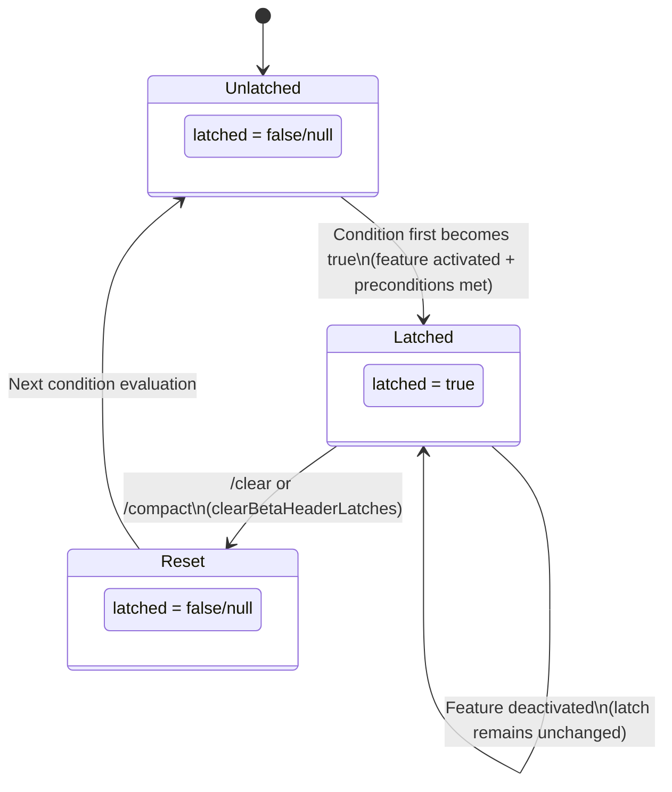

# Chapter 13: Cache Architecture and Breakpoint Design

## Why This Matters

In Chapter 12, we discussed how token budget strategies control the size of content entering the context window. But there is a more insidious cost issue: **even when the content within the context window is completely identical, every API call still pays for the system prompt and tool definitions.**

For a typical Claude Code session, the system prompt is about 11,000 tokens, and the schema definitions for 40+ tools contribute another ~20,000 tokens — these "fixed overheads" alone consume 30,000+ tokens per call. Over a 50-turn session, that means 1,500,000 tokens are processed repeatedly. At Anthropic's pricing, this is a non-trivial cost.

Anthropic's Prompt Caching mechanism was designed to solve exactly this problem: if the prefix of an API request matches a previous request, the server can reuse the cached KV state, reducing costs for the cached portion by 90%. But cache hits have a strict requirement — the prefix must match **byte-for-byte**. A single character change causes a cache miss, i.e., a "cache break."

Claude Code builds a sophisticated cache architecture around this constraint, featuring three cache scope levels, two TTL tiers, and a set of "latching" mechanisms to prevent cache breaks. This chapter dives deep into the design and implementation of this architecture.

---

## 13.1 Anthropic API Prompt Caching Fundamentals

### Prefix Matching Model

Anthropic's prompt caching is based on the **prefix matching** principle. The server treats an API request as a serialized byte stream, comparing byte-by-byte from the beginning. Once a mismatch is found, the cache "breaks" at that point — everything before can be reused, everything after must be recomputed.

This means cache effectiveness depends entirely on the **stability** of the request prefix. The serialization order of an API request is roughly:

```
[System Prompt] → [Tool Definitions] → [Message History]
```

The system prompt and tool definitions sit at the front of the sequence — any changes to them invalidate the entire cache. Message history is appended at the end, so new messages only incur costs for the incremental portion.

### cache_control Markers

To enable caching, you add `cache_control` markers to content blocks in the API request:

```typescript
// Basic form of cache_control
{
  type: 'ephemeral'
}

// Extended form (1P exclusive)
{
  type: 'ephemeral',
  scope: 'global' | 'org',   // Cache scope
  ttl: '5m' | '1h'           // Cache time-to-live
}
```

`type: 'ephemeral'` is the only supported cache type, indicating a temporary cache breakpoint. Claude Code defines an extended tool schema type in `utils/api.ts` (lines 68–78) that includes the full `cache_control` options:

```typescript
// utils/api.ts:68-78
type BetaToolWithExtras = BetaTool & {
  strict?: boolean
  defer_loading?: boolean
  cache_control?: {
    type: 'ephemeral'
    scope?: 'global' | 'org'
    ttl?: '5m' | '1h'
  }
  eager_input_streaming?: boolean
}
```

### Cache Breakpoint Placement

Claude Code carefully places cache breakpoints in requests, generating a unified `cache_control` object through the `getCacheControl()` function (`services/api/claude.ts`, lines 358–374):

```typescript
// services/api/claude.ts:358-374
export function getCacheControl({
  scope,
  querySource,
}: {
  scope?: CacheScope
  querySource?: QuerySource
} = {}): {
  type: 'ephemeral'
  ttl?: '1h'
  scope?: CacheScope
} {
  return {
    type: 'ephemeral',
    ...(should1hCacheTTL(querySource) && { ttl: '1h' }),
    ...(scope === 'global' && { scope }),
  }
}
```

This function appears simple, but every conditional branch embodies a carefully considered caching strategy.

---

## 13.2 Three Cache Scope Levels

Claude Code uses three cache scopes, each corresponding to a different reuse granularity. These scopes are assigned to different parts of the system prompt through the `splitSysPromptPrefix()` function (`utils/api.ts`, lines 321–435).

### Scope Definitions

| Cache Scope | Identifier | Reuse Granularity | Applicable Content | TTL |
|-------------|-----------|-------------------|-------------------|-----|
| **Global Cache** | `'global'` | Cross-organization, cross-user | Static prompts shared across all Claude Code instances | 5 minutes (default) |
| **Organization Cache** | `'org'` | Users within the same organization | Organization-specific but user-agnostic content | 5 min / 1 hour |
| **No Cache** | `null` | No cache_control set | Highly dynamic content | N/A |

**Table 13-1: Three Cache Scope Levels Compared**

> **Interactive version**: [Click to view cache hit animation](cache-viz.html) — step-by-step demonstration of the API request cache matching process, supporting 3 scenario switches (first call / same user / different user), with real-time hit rate and cost savings calculations.

### Global Cache Scope (global)

Global caching is the most aggressive optimization — content marked as `global` can share KV cache across all Claude Code users. This means when User A initiates a request and caches the static portion of the system prompt, User B's next request can directly hit that cache.

The eligibility criteria for global caching are very strict: content must be **completely invariant**, containing no user-specific, organization-specific, or even time-specific information. Claude Code splits the system prompt into static and dynamic parts using a "dynamic boundary marker" (`SYSTEM_PROMPT_DYNAMIC_BOUNDARY`):

```typescript
// utils/api.ts:362-404 (simplified)
if (useGlobalCacheFeature) {
  const boundaryIndex = systemPrompt.findIndex(
    s => s === SYSTEM_PROMPT_DYNAMIC_BOUNDARY,
  )
  if (boundaryIndex !== -1) {
    // Content before the boundary → cacheScope: 'global'
    // Content after the boundary → cacheScope: null
    for (let i = 0; i < systemPrompt.length; i++) {
      if (i < boundaryIndex) {
        staticBlocks.push(block)
      } else {
        dynamicBlocks.push(block)
      }
    }
    // ...
    if (staticJoined)
      result.push({ text: staticJoined, cacheScope: 'global' })
    if (dynamicJoined)
      result.push({ text: dynamicJoined, cacheScope: null })
  }
}
```

Note that dynamic content after the boundary is marked as `cacheScope: null` — it doesn't even use `org`-level caching, because the change frequency of dynamic content is too high, cache hit rates would be extremely low, and marking cache breakpoints would only add complexity to the API request.

### Organization Cache Scope (org)

When global caching is unavailable (e.g., the global cache feature is not enabled, or content contains organization-specific information), Claude Code falls back to the `org` level:

```typescript
// utils/api.ts:411-435 (default mode)
let attributionHeader: string | undefined
let systemPromptPrefix: string | undefined
const rest: string[] = []

for (const block of systemPrompt) {
  if (block.startsWith('x-anthropic-billing-header')) {
    attributionHeader = block
  } else if (CLI_SYSPROMPT_PREFIXES.has(block)) {
    systemPromptPrefix = block
  } else {
    rest.push(block)
  }
}

const result: SystemPromptBlock[] = []
if (attributionHeader)
  result.push({ text: attributionHeader, cacheScope: null })
if (systemPromptPrefix)
  result.push({ text: systemPromptPrefix, cacheScope: 'org' })
const restJoined = rest.join('\n\n')
if (restJoined)
  result.push({ text: restJoined, cacheScope: 'org' })
```

The chunking strategy here reveals an important detail: the **billing attribution header** (`x-anthropic-billing-header`) is marked as `null` and excluded from caching. This is because the attribution header contains user identity information that cannot be shared even at the `org` level. The CLI system prompt prefix (`CLI_SYSPROMPT_PREFIXES`) and remaining system prompt content are both marked as `org`, shared within the same organization.

### Special Handling for MCP Tools

When users configure MCP tools, the global caching strategy changes. Because MCP tool definitions are provided by external servers and their content is unpredictable, including them in global cache would reduce hit rates. Claude Code handles this through the `skipGlobalCacheForSystemPrompt` flag:

```typescript
// utils/api.ts:326-360
if (useGlobalCacheFeature && options?.skipGlobalCacheForSystemPrompt) {
  logEvent('tengu_sysprompt_using_tool_based_cache', {
    promptBlockCount: systemPrompt.length,
  })
  // All content downgraded to org scope, skipping boundary markers
  // ...
}
```

This downgrade is conservative but reasonable — rather than risking frequent global cache misses, it falls back to the more stable `org` level hit rate.

---

## 13.3 Cache TTL Tiers

### Default 5 Minutes vs 1 Hour

Anthropic's prompt caching has a default TTL of 5 minutes. This means if a user doesn't initiate a new API request within 5 minutes, the cache expires. For active coding sessions, 5 minutes is usually sufficient. But for scenarios requiring extended thinking or documentation review, 5 minutes may not be enough.

Claude Code supports upgrading the TTL to 1 hour, decided by the `should1hCacheTTL()` function (`services/api/claude.ts`, lines 393–434):

```typescript
// services/api/claude.ts:393-434
function should1hCacheTTL(querySource?: QuerySource): boolean {
  // 3P Bedrock users opt-in via environment variable
  if (
    getAPIProvider() === 'bedrock' &&
    isEnvTruthy(process.env.ENABLE_PROMPT_CACHING_1H_BEDROCK)
  ) {
    return true
  }

  // Latched eligibility check — prevents mid-session overage flips from changing TTL
  let userEligible = getPromptCache1hEligible()
  if (userEligible === null) {
    userEligible =
      process.env.USER_TYPE === 'ant' ||
      (isClaudeAISubscriber() && !currentLimits.isUsingOverage)
    setPromptCache1hEligible(userEligible)
  }
  if (!userEligible) return false

  // Cache allowlist — also latched to maintain session stability
  let allowlist = getPromptCache1hAllowlist()
  if (allowlist === null) {
    const config = getFeatureValue_CACHED_MAY_BE_STALE(
      'tengu_prompt_cache_1h_config', {}
    )
    allowlist = config.allowlist ?? []
    setPromptCache1hAllowlist(allowlist)
  }

  return (
    querySource !== undefined &&
    allowlist.some(pattern =>
      pattern.endsWith('*')
        ? querySource.startsWith(pattern.slice(0, -1))
        : querySource === pattern,
    )
  )
}
```

### The Latching Mechanism for Eligibility Checks

The most critical design in `should1hCacheTTL()` is **latching**. On the first call, the function evaluates whether the user is eligible for 1-hour TTL, then stores the result in the global `STATE` (`bootstrap/state.ts`):

```typescript
// bootstrap/state.ts:1700-1706
export function getPromptCache1hEligible(): boolean | null {
  return STATE.promptCache1hEligible
}

export function setPromptCache1hEligible(eligible: boolean | null): void {
  STATE.promptCache1hEligible = eligible
}
```

Why is latching necessary? Consider the following scenario:

1. At session start, the user is within their subscription quota (`isUsingOverage === false`), getting 1-hour TTL
2. By turn 30, the user exceeds quota (`isUsingOverage === true`)
3. If TTL drops from 1 hour back to 5 minutes, the serialization of the `cache_control` object changes
4. This change causes the API request prefix to no longer match — **cache break**

A single overage state flip invalidating ~20,000 tokens of system prompt and tool definition cache is clearly unacceptable. The latching mechanism ensures that once the TTL tier is determined at session start, it remains constant throughout the session.

The same latching logic is applied to the GrowthBook allowlist configuration — preventing mid-session GrowthBook disk cache updates from causing TTL behavior changes.

### TTL Tier Decision Table

| Condition | TTL | Notes |
|-----------|-----|-------|
| 3P Bedrock + `ENABLE_PROMPT_CACHING_1H_BEDROCK=1` | 1 hour | Bedrock users manage their own billing |
| Anthropic employee (`USER_TYPE=ant`) | 1 hour | Internal users |
| Claude AI subscriber + not over quota | 1 hour | Must pass GrowthBook allowlist |
| All other users | 5 minutes | Default |

**Table 13-2: Cache TTL Decision Matrix**

---

## 13.4 Beta Header Latching Mechanism

### The Problem: Dynamic Headers Causing Cache Busting

Anthropic API requests include a set of "beta headers" identifying experimental features the client uses. These headers are part of the server-side cache key — adding or removing a header changes the cache key, causing a cache break.

Claude Code has multiple features that can dynamically activate or deactivate mid-session:

- **AFK Mode** (Auto Mode): Automatically executes tasks when the user is away
- **Fast Mode**: Uses a faster but potentially more expensive model
- **Cache Editing** (Cached Microcompact): Performs incremental edits within the cache

Each time one of these features changes state, the corresponding beta header is added or removed, triggering a cache break. The code comment (`services/api/claude.ts`, lines 1405–1410) explicitly describes this problem:

```typescript
// services/api/claude.ts:1405-1410
// Sticky-on latches for dynamic beta headers. Each header, once first
// sent, keeps being sent for the rest of the session so mid-session
// toggles don't change the server-side cache key and bust ~50-70K tokens.
// Latches are cleared on /clear and /compact via clearBetaHeaderLatches().
// Per-call gates (isAgenticQuery, querySource===repl_main_thread) stay
// per-call so non-agentic queries keep their own stable header set.
```

### Latching Implementation

Claude Code's solution is "sticky-on" latching — once a beta header has been sent in a session, it continues to be sent for the remainder of the session, even if the feature that triggered it has been deactivated.

Here is the latching code for three beta headers (`services/api/claude.ts`, lines 1412–1442):

**AFK Mode Header:**

```typescript
// services/api/claude.ts:1412-1423
let afkHeaderLatched = getAfkModeHeaderLatched() === true
if (feature('TRANSCRIPT_CLASSIFIER')) {
  if (
    !afkHeaderLatched &&
    isAgenticQuery &&
    shouldIncludeFirstPartyOnlyBetas() &&
    (autoModeStateModule?.isAutoModeActive() ?? false)
  ) {
    afkHeaderLatched = true
    setAfkModeHeaderLatched(true)
  }
}
```

**Fast Mode Header:**

```typescript
// services/api/claude.ts:1425-1429
let fastModeHeaderLatched = getFastModeHeaderLatched() === true
if (!fastModeHeaderLatched && isFastMode) {
  fastModeHeaderLatched = true
  setFastModeHeaderLatched(true)
}
```

**Cache Editing Header:**

```typescript
// services/api/claude.ts:1431-1442
let cacheEditingHeaderLatched = getCacheEditingHeaderLatched() === true
if (feature('CACHED_MICROCOMPACT')) {
  if (
    !cacheEditingHeaderLatched &&
    cachedMCEnabled &&
    getAPIProvider() === 'firstParty' &&
    options.querySource === 'repl_main_thread'
  ) {
    cacheEditingHeaderLatched = true
    setCacheEditingHeaderLatched(true)
  }
}
```

### Latching State Diagram

All three beta headers follow the same state transition pattern:



**Figure 13-1: Beta Header Latching State Diagram**

Key properties:

1. **One-way latching**: The transition from false to true is irreversible (within the current session)
2. **Conditional triggering**: Each header has its own unique set of preconditions
3. **Session-bound**: Only `/clear` and `/compact` commands reset the latch state
4. **Query isolation**: Conditions like `isAgenticQuery` and `querySource` remain evaluated per-call, ensuring non-agentic queries maintain their own stable header set

### Latching Summary Table

| Beta Header | Latch Variable | Preconditions | Reset Trigger |
|-------------|---------------|---------------|---------------|
| AFK Mode | `afkModeHeaderLatched` | `TRANSCRIPT_CLASSIFIER` enabled + agentic query + 1P only + auto mode active | `/clear`, `/compact` |
| Fast Mode | `fastModeHeaderLatched` | Fast mode available + no cooldown + model supports it + request enables it | `/clear`, `/compact` |
| Cache Editing | `cacheEditingHeaderLatched` | `CACHED_MICROCOMPACT` enabled + cachedMC available + 1P + main thread | `/clear`, `/compact` |

**Table 13-3: Beta Header Latching Details**

---

## 13.5 Thinking Clear Latching

Beyond beta header latching, there is one more special latching mechanism — `thinkingClearLatched` (`services/api/claude.ts`, lines 1446–1456):

```typescript
// services/api/claude.ts:1446-1456
let thinkingClearLatched = getThinkingClearLatched() === true
if (!thinkingClearLatched && isAgenticQuery) {
  const lastCompletion = getLastApiCompletionTimestamp()
  if (
    lastCompletion !== null &&
    Date.now() - lastCompletion > CACHE_TTL_1HOUR_MS
  ) {
    thinkingClearLatched = true
    setThinkingClearLatched(true)
  }
}
```

This latch triggers when more than 1 hour has passed since the last API completion (`CACHE_TTL_1HOUR_MS = 60 * 60 * 1000`). At this point, even with the 1-hour TTL, the cache has already expired. Thinking Clear leverages this signal to optimize thinking block handling — since the cache is already invalid, accumulated thinking content can be cleaned up to reduce token consumption in subsequent requests.

---

## 13.6 Cache Architecture Overview

Combining all the mechanisms above, Claude Code's cache architecture can be summarized in the following layers:

```
┌──────────────────────────────────────────────────────────┐
│                   API Request Construction                │
│                                                          │
│  ┌── System Prompt ──┐   ┌── Tool Defs ──┐   ┌── Msgs ─┐│
│  │                   │   │               │   │         ││
│  │ [attribution]     │   │ [tool 1]      │   │ [msg 1] ││
│  │  scope: null      │   │  scope: org   │   │         ││
│  │                   │   │               │   │ [msg 2] ││
│  │ [prefix]          │   │ [tool 2]      │   │         ││
│  │  scope: org/null  │   │  scope: org   │   │ [msg N] ││
│  │                   │   │               │   │         ││
│  │ [static]          │   │ [tool N]      │   │         ││
│  │  scope: global    │   │  scope: org   │   │         ││
│  │                   │   │               │   │         ││
│  │ [dynamic]         │   │               │   │         ││
│  │  scope: null      │   │               │   │         ││
│  └───────────────────┘   └───────────────┘   └─────────┘│
│                                                          │
│  ────────── Prefix matching direction ──────────────→    │
│                                                          │
├──────────────────────────────────────────────────────────┤
│                     TTL Decision Layer                    │
│                                                          │
│  should1hCacheTTL() → latch → session stability          │
│                                                          │
├──────────────────────────────────────────────────────────┤
│                 Beta Header Latching Layer                │
│                                                          │
│  afkMode / fastMode / cacheEditing → sticky-on           │
│                                                          │
├──────────────────────────────────────────────────────────┤
│                 Cache Break Detection Layer               │
│  (see Chapter 14)                                        │
└──────────────────────────────────────────────────────────┘
```

**Figure 13-2: Claude Code Cache Architecture Overview**

---

## 13.7 Design Insights

### Latching Is the Core Pattern for Cache Stability

Claude Code repeatedly uses the same pattern throughout its caching code: **evaluate once → latch → session stability**. This pattern appears in:

- TTL eligibility checks (`should1hCacheTTL`)
- TTL allowlist configuration
- Beta header send state
- Thinking clear triggering

Every latch serves the same purpose: preventing mid-session state changes from altering the serialized API request, thereby protecting the integrity of the cache prefix.

### Cache Scopes Are a Cost-vs-Hit-Rate Trade-off

The three cache scope levels embody a clear engineering trade-off:

- **global** scope has the highest hit rate (shared across all users), but requires absolutely static content
- **org** scope has moderate hit rates, allowing organization-level differences
- **null** skips cache marking, avoiding ineffective caching attempts that would only add request complexity

Claude Code's strategy is "global if possible, org if not, give up if neither works" — more granular and more effective than a one-size-fits-all approach.

### MCP Tools Are the Cache's Worst Enemy

The introduction of MCP tools presents severe challenges for caching. MCP servers can connect or disconnect mid-session, and tool definitions can change at any time. When MCP tools are detected, the system prompt's global cache is downgraded to org level (`skipGlobalCacheForSystemPrompt`), and the tool caching strategy switches from system prompt embedding to an independent `tool_based` strategy. These degradation measures are further discussed in Chapter 15's cache optimization patterns.

---

## What Users Can Do

Based on the cache architecture analyzed in this chapter, here are practical guidelines for building cache-friendly systems:

1. **Understand prefix matching semantics**: Anthropic's caching uses strict prefix matching. When constructing API requests, always place the most stable, least likely to change content first (static system prompt), and dynamic content (user messages, attachments) last.

2. **Design cache scopes for your system prompts**: If your application serves multiple users, identify which prompt content is globally shared (suitable for `global` scope), which is organization-level (suitable for `org` scope), and which is completely dynamic (don't mark with `cache_control`). A one-size-fits-all caching strategy wastes hit rate.

3. **Use the latching pattern to protect cache key stability**: Any configuration that might change mid-session (feature flags, user quota status, feature toggles) — if it affects the serialized API request — should be latched at session start. The core principle of latching: it's better to use a slightly stale value than to let the cache key change mid-session.

4. **Beware of MCP tools' impact on caching**: If your application integrates external tools (MCP or similar), their dynamism will significantly reduce cache hit rates. Consider handling external tool definitions separately from core tools, or downgrade the caching strategy when external tools are detected.

5. **Monitor `cache_read_input_tokens`**: This is the only reliable indicator of cache health. After establishing a baseline, any significant drop is worth investigating. See Chapter 14 for the cache break detection system.

### Advice for Claude Code Users

1. **Keep your system prompt stable.** Every modification to CLAUDE.md can invalidate the cache prefix. If you frequently edit CLAUDE.md, consider placing experimental instructions at the session level (via `/memory` or in-conversation instructions) rather than persisting them to the file.
2. **Avoid frequent model switching.** Switching models means the cache prefix is completely invalidated — Opus and Sonnet have different system prompts, and all caching starts from zero after a switch. Use Opus for tasks requiring a strong model, and Sonnet for lightweight tasks, in focused batches.
3. **Time your `/compact` usage.** After manual compaction, CC rebuilds the cache prefix. If you know you're about to make many tool calls (e.g., batch file modifications), compacting first can give you a longer effective cache window.
4. **Watch cache hit metrics.** In `--verbose` mode, CC reports `cache_read_input_tokens` — if this number is near zero while `input_tokens` is high, it means the cache is frequently invalidated, and you should investigate.

---

## Summary

This chapter dissected Claude Code's prompt cache architecture:

1. **Prefix matching model** requires byte-for-byte stability of the API request prefix; any change causes a cache break
2. **Three cache scope levels** (global/org/null) make fine-grained trade-offs between hit rate and flexibility
3. **TTL tiers** (5 minutes / 1 hour) guarantee intra-session stability through latching mechanisms
4. **Beta header latching** uses the sticky-on pattern to prevent feature toggles from changing cache keys

These mechanisms together form the cache's "protective layer." But protection alone isn't enough — when cache breaks do occur, the system needs to detect and diagnose the cause. Chapter 14 dives into the two-phase architecture of the cache break detection system.
