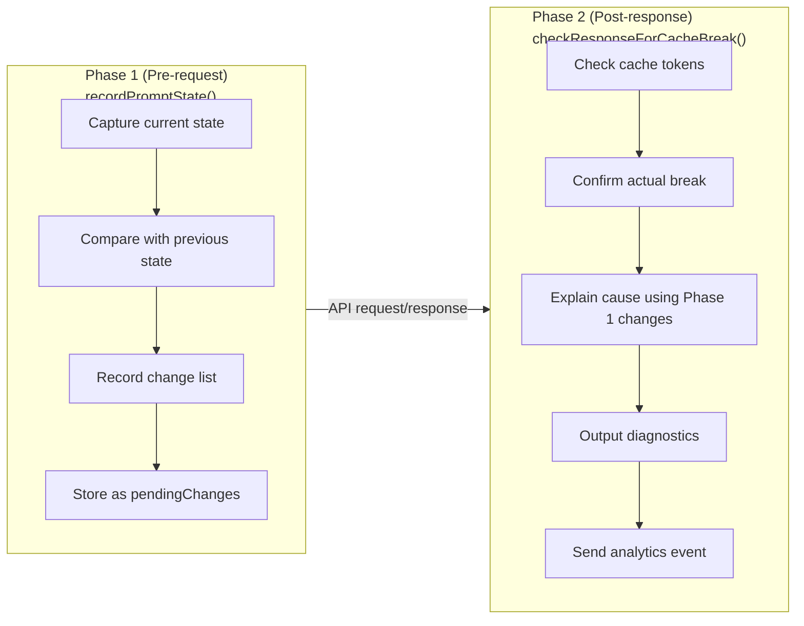

# Chapter 14: Cache Break Detection System

## Why This Matters

In Chapter 13, we saw how Claude Code uses latching mechanisms and carefully designed cache scopes to **prevent** cache breaks. But even with these safeguards, cache breaks still occur — tool definitions may change due to MCP server reconnections, the system prompt may grow due to new attachments, model switches, effort adjustments, and even GrowthBook remote configuration updates can all alter the API request prefix.

What makes this trickier is that cache breaks are "silent." The `cache_read_input_tokens` in the API response drops, but no error message tells you why. Developers only notice costs going up and latency increasing, without knowing the root cause.

Claude Code built a two-phase cache break detection system to solve this problem. The entire system is implemented in `services/api/promptCacheBreakDetection.ts` (728 lines), and is one of the few subsystems in Claude Code dedicated purely to **observability** rather than functionality.

---

## 14.1 Two-Phase Detection Architecture

### Design Rationale

Cache break detection faces a timing problem:

1. **Changes happen before the request is sent**: The system prompt changed, tools were added/removed, beta headers flipped
2. **Break confirmation comes after the response returns**: Only by observing the drop in `cache_read_input_tokens` can you confirm the cache was actually busted

Phase 2 alone is insufficient — by the time the token drop is detected, the request has already been sent and the previous state is lost, making it impossible to trace the cause. Phase 1 alone is also insufficient — many client-side changes don't necessarily cause server-side cache breaks (e.g., the server may not have cached that prefix yet).

Claude Code's solution splits detection into two phases:



**Figure 14-1: Two-Phase Detection Sequence Diagram**

### Call Sites

The two phases are called from `services/api/claude.ts`:

**Phase 1** is called during API request construction (lines 1460–1486):

```typescript
// services/api/claude.ts:1460-1486
if (feature('PROMPT_CACHE_BREAK_DETECTION')) {
  const toolsForCacheDetection = allTools.filter(
    t => !('defer_loading' in t && t.defer_loading),
  )
  recordPromptState({
    system,
    toolSchemas: toolsForCacheDetection,
    querySource: options.querySource,
    model: options.model,
    agentId: options.agentId,
    fastMode: fastModeHeaderLatched,
    globalCacheStrategy,
    betas,
    autoModeActive: afkHeaderLatched,
    isUsingOverage: currentLimits.isUsingOverage ?? false,
    cachedMCEnabled: cacheEditingHeaderLatched,
    effortValue: effort,
    extraBodyParams: getExtraBodyParams(),
  })
}
```

Note two key design decisions:

1. **Excluding defer_loading tools**: The API automatically strips deferred tools — they don't affect the actual cache key. Including them would produce false positives when tools are discovered or MCP servers reconnect.
2. **Passing latched values**: `fastModeHeaderLatched`, `afkHeaderLatched`, `cacheEditingHeaderLatched` are the latched values, not real-time state. Because the cache key is determined by the headers actually sent, not the user's current settings.

**Phase 2** is called after API response processing completes, receiving the cache token statistics from the response.

---

## 14.2 PreviousState: Full State Snapshot

The core of Phase 1 is the `PreviousState` type — it captures all client-side state that could affect the server-side cache key.

### Field Inventory

`PreviousState` is defined in `promptCacheBreakDetection.ts` (lines 28–69), containing 15+ fields:

| Field | Type | Purpose | Change Source |
|-------|------|---------|---------------|
| `systemHash` | `number` | System prompt content hash (excluding cache_control) | Prompt content changes |
| `toolsHash` | `number` | Aggregate tool schema hash (excluding cache_control) | Tool additions/removals or definition changes |
| `cacheControlHash` | `number` | Hash of system blocks' cache_control | Scope or TTL flips |
| `toolNames` | `string[]` | Tool name list | Tool additions/removals |
| `perToolHashes` | `Record<string, number>` | Individual hash per tool | Single tool schema change |
| `systemCharCount` | `number` | Total system prompt character count | Content additions/removals |
| `model` | `string` | Current model identifier | Model switch |
| `fastMode` | `boolean` | Fast Mode state (post-latch) | Fast Mode activation |
| `globalCacheStrategy` | `string` | Cache strategy type | MCP tool discovery/removal |
| `betas` | `string[]` | Sorted beta header list | Beta header changes |
| `autoModeActive` | `boolean` | AFK Mode state (post-latch) | Auto Mode activation |
| `isUsingOverage` | `boolean` | Overage usage state (post-latch) | Quota state changes |
| `cachedMCEnabled` | `boolean` | Cache editing state (post-latch) | Cached MC activation |
| `effortValue` | `string` | Resolved effort value | Effort configuration changes |
| `extraBodyHash` | `number` | Hash of extra request body params | CLAUDE_CODE_EXTRA_BODY changes |
| `callCount` | `number` | Call count for current tracking key | Auto-increment |
| `pendingChanges` | `PendingChanges \| null` | Changes detected by Phase 1 | Phase 1 comparison result |
| `prevCacheReadTokens` | `number \| null` | Cache read tokens from last response | Phase 2 update |
| `cacheDeletionsPending` | `boolean` | Whether cache_edits deletions are pending confirmation | Cached MC delete operations |
| `buildDiffableContent` | `() => string` | Lazily computed diffable content | Used for debug output |

**Table 14-1: Complete PreviousState Field Inventory**

### Hashing Strategy

`PreviousState` contains multiple hash fields serving different detection granularities:

```typescript
// promptCacheBreakDetection.ts:170-179
function computeHash(data: unknown): number {
  const str = jsonStringify(data)
  if (typeof Bun !== 'undefined') {
    const hash = Bun.hash(str)
    return typeof hash === 'bigint' ? Number(hash & 0xffffffffn) : hash
  }
  return djb2Hash(str)
}
```

**The separation of systemHash vs cacheControlHash** deserves special attention:

```typescript
// promptCacheBreakDetection.ts:274-281
const systemHash = computeHash(strippedSystem)  // excluding cache_control
const cacheControlHash = computeHash(           // cache_control only
  system.map(b => ('cache_control' in b ? b.cache_control : null)),
)
```

`systemHash` hashes the system prompt content after stripping `cache_control` markers via `stripCacheControl()`. `cacheControlHash` hashes only the `cache_control` markers. Why separate them? Because a cache scope flip (global to org) or TTL flip (1h to 5m) doesn't change the prompt text content — if you only look at `systemHash`, these flips would be missed. After separation, `cacheControlChanged` can independently capture these kinds of changes.

**On-demand computation of perToolHashes** is also a performance optimization:

```typescript
// promptCacheBreakDetection.ts:285-286
const computeToolHashes = () =>
  computePerToolHashes(strippedTools, toolNames)
```

`perToolHashes` is a per-tool hash table used to pinpoint exactly which tool changed when the aggregate tool schema hash changes. But computing per-tool hashes is expensive (N `jsonStringify` calls), so it's only triggered when `toolsHash` changes. The comment (line 37) cites BigQuery data: **77% of tool schema changes are a single tool's description changing, not tool additions/removals**. `perToolHashes` is designed precisely to diagnose that 77%.

### Tracking Key and Isolation Strategy

Each query source maintains an independent `PreviousState`, stored in a Map:

```typescript
// promptCacheBreakDetection.ts:101-107
const previousStateBySource = new Map<string, PreviousState>()

const MAX_TRACKED_SOURCES = 10

const TRACKED_SOURCE_PREFIXES = [
  'repl_main_thread',
  'sdk',
  'agent:custom',
  'agent:default',
  'agent:builtin',
]
```

The tracking key is computed by the `getTrackingKey()` function (lines 149–158):

```typescript
// promptCacheBreakDetection.ts:149-158
function getTrackingKey(
  querySource: QuerySource,
  agentId?: AgentId,
): string | null {
  if (querySource === 'compact') return 'repl_main_thread'
  for (const prefix of TRACKED_SOURCE_PREFIXES) {
    if (querySource.startsWith(prefix)) return agentId || querySource
  }
  return null
}
```

Several important design decisions:

1. **compact shares the main thread's tracking state**: Compaction uses the same `cacheSafeParams` and shares the cache key, so it should share the detection state
2. **Sub-agents are isolated by agentId**: Prevents false positives between multiple concurrent agent instances of the same type
3. **Untracked query sources** return `null`: `speculation`, `session_memory`, `prompt_suggestion`, and other short-lived agents only run 1–3 turns and have no value for before/after comparison
4. **Map capacity limit**: `MAX_TRACKED_SOURCES = 10`, preventing unbounded memory growth from many sub-agent agentIds

---

## 14.3 Phase 1: recordPromptState() Deep Dive

### First Call: Establishing the Baseline

On the first call to `recordPromptState()`, there is no previous state to compare against. The function only does two things:

1. Checks the Map capacity, evicting the oldest entry if the limit is reached
2. Creates the initial `PreviousState` snapshot with `pendingChanges` set to `null`

```typescript
// promptCacheBreakDetection.ts:298-328
if (!prev) {
  while (previousStateBySource.size >= MAX_TRACKED_SOURCES) {
    const oldest = previousStateBySource.keys().next().value
    if (oldest !== undefined) previousStateBySource.delete(oldest)
  }

  previousStateBySource.set(key, {
    systemHash,
    toolsHash,
    cacheControlHash,
    toolNames,
    // ... all initial values
    callCount: 1,
    pendingChanges: null,
    prevCacheReadTokens: null,
    cacheDeletionsPending: false,
    buildDiffableContent: lazyDiffableContent,
    perToolHashes: computeToolHashes(),
  })
  return
}
```

### Subsequent Calls: Change Detection

On subsequent calls, the function compares each field against the previous state:

```typescript
// promptCacheBreakDetection.ts:332-346
const systemPromptChanged = systemHash !== prev.systemHash
const toolSchemasChanged = toolsHash !== prev.toolsHash
const modelChanged = model !== prev.model
const fastModeChanged = isFastMode !== prev.fastMode
const cacheControlChanged = cacheControlHash !== prev.cacheControlHash
const globalCacheStrategyChanged =
  globalCacheStrategy !== prev.globalCacheStrategy
const betasChanged =
  sortedBetas.length !== prev.betas.length ||
  sortedBetas.some((b, i) => b !== prev.betas[i])
const autoModeChanged = autoModeActive !== prev.autoModeActive
const overageChanged = isUsingOverage !== prev.isUsingOverage
const cachedMCChanged = cachedMCEnabled !== prev.cachedMCEnabled
const effortChanged = effortStr !== prev.effortValue
const extraBodyChanged = extraBodyHash !== prev.extraBodyHash
```

If any field has changed, the function constructs a `PendingChanges` object:

```typescript
// promptCacheBreakDetection.ts:71-99
type PendingChanges = {
  systemPromptChanged: boolean
  toolSchemasChanged: boolean
  modelChanged: boolean
  fastModeChanged: boolean
  cacheControlChanged: boolean
  globalCacheStrategyChanged: boolean
  betasChanged: boolean
  autoModeChanged: boolean
  overageChanged: boolean
  cachedMCChanged: boolean
  effortChanged: boolean
  extraBodyChanged: boolean
  addedToolCount: number
  removedToolCount: number
  systemCharDelta: number
  addedTools: string[]
  removedTools: string[]
  changedToolSchemas: string[]
  previousModel: string
  newModel: string
  prevGlobalCacheStrategy: string
  newGlobalCacheStrategy: string
  addedBetas: string[]
  removedBetas: string[]
  prevEffortValue: string
  newEffortValue: string
  buildPrevDiffableContent: () => string
}
```

`PendingChanges` records not just **whether** something changed (boolean flags), but also **how** it changed (which tools were added/removed, the added/removed beta header lists, character count deltas, etc.). These details are crucial for the break explanation in Phase 2.

### Precise Attribution of Tool Changes

When `toolSchemasChanged` is true, the system further analyzes which specific tools changed:

```typescript
// promptCacheBreakDetection.ts:366-378
if (toolSchemasChanged) {
  const newHashes = computeToolHashes()
  for (const name of toolNames) {
    if (!prevToolSet.has(name)) continue
    if (newHashes[name] !== prev.perToolHashes[name]) {
      changedToolSchemas.push(name)
    }
  }
  prev.perToolHashes = newHashes
}
```

This code categorizes tool changes into three types:
- **Added tools**: In the new list but not the old (`addedTools`)
- **Removed tools**: In the old list but not the new (`removedTools`)
- **Schema changes**: Tool still exists but its schema hash differs (`changedToolSchemas`)

The third category is the most common — AgentTool and SkillTool descriptions embed dynamic agent lists and command lists that change with session state.

---

## 14.4 Phase 2: checkResponseForCacheBreak() Deep Dive

### Break Determination Criteria

Phase 2 is called after the API response returns. The core logic determines whether the cache was truly busted:

```typescript
// promptCacheBreakDetection.ts:485-493
const tokenDrop = prevCacheRead - cacheReadTokens
if (
  cacheReadTokens >= prevCacheRead * 0.95 ||
  tokenDrop < MIN_CACHE_MISS_TOKENS
) {
  state.pendingChanges = null
  return
}
```

The determination uses a dual threshold:

1. **Relative threshold**: Cache read tokens dropped by more than 5% (`< prevCacheRead * 0.95`)
2. **Absolute threshold**: Drop exceeds 2,000 tokens (`MIN_CACHE_MISS_TOKENS = 2_000`)

Both conditions must be met **simultaneously** to trigger a break alert. This avoids two types of false positives:

- Small fluctuations: Natural variation in cache token counts (a few hundred tokens) doesn't trigger alerts
- Ratio amplification: When the baseline is small (e.g., 1,000 tokens), 5% fluctuation is only 50 tokens — not worth alerting

### Special Case: Cache Deletion

Cache editing (Cached Microcompact) can actively delete content blocks from the cache via `cache_edits`. This legitimately causes `cache_read_input_tokens` to drop — this is expected behavior and should not trigger a break alert:

```typescript
// promptCacheBreakDetection.ts:473-481
if (state.cacheDeletionsPending) {
  state.cacheDeletionsPending = false
  logForDebugging(
    `[PROMPT CACHE] cache deletion applied, cache read: ` +
    `${prevCacheRead} → ${cacheReadTokens} (expected drop)`,
  )
  state.pendingChanges = null
  return
}
```

The `cacheDeletionsPending` flag is set through the `notifyCacheDeletion()` function (lines 673–682), called by the cache editing module when sending delete operations.

### Special Case: Compaction

The compaction operation (`/compact`) significantly reduces message count, causing cache read tokens to naturally drop. The `notifyCompaction()` function (lines 689–698) handles this by resetting `prevCacheReadTokens` to `null` — the next call is treated as a "first call" with no comparison:

```typescript
// promptCacheBreakDetection.ts:689-698
export function notifyCompaction(
  querySource: QuerySource,
  agentId?: AgentId,
): void {
  const key = getTrackingKey(querySource, agentId)
  const state = key ? previousStateBySource.get(key) : undefined
  if (state) {
    state.prevCacheReadTokens = null
  }
}
```

---

## 14.5 Break Explanation Engine

Once a cache break is confirmed, the system uses the `PendingChanges` collected in Phase 1 to construct human-readable explanations. The explanation engine is located in `checkResponseForCacheBreak()` at lines 495–588:

### Client-Side Attribution

If any change flag in `PendingChanges` is true, the system generates corresponding explanation text:

```typescript
// promptCacheBreakDetection.ts:496-563 (simplified)
const parts: string[] = []
if (changes) {
  if (changes.modelChanged) {
    parts.push(`model changed (${changes.previousModel} → ${changes.newModel})`)
  }
  if (changes.systemPromptChanged) {
    const charInfo = charDelta > 0 ? ` (+${charDelta} chars)` : ` (${charDelta} chars)`
    parts.push(`system prompt changed${charInfo}`)
  }
  if (changes.toolSchemasChanged) {
    const toolDiff = changes.addedToolCount > 0 || changes.removedToolCount > 0
      ? ` (+${changes.addedToolCount}/-${changes.removedToolCount} tools)`
      : ' (tool prompt/schema changed, same tool set)'
    parts.push(`tools changed${toolDiff}`)
  }
  if (changes.betasChanged) {
    const added = changes.addedBetas.length ? `+${changes.addedBetas.join(',')}` : ''
    const removed = changes.removedBetas.length ? `-${changes.removedBetas.join(',')}` : ''
    parts.push(`betas changed (${[added, removed].filter(Boolean).join(' ')})`)
  }
  // ... similar explanation logic for other fields
}
```

The explanation engine's design principle is **specific over abstract**: rather than simply saying "cache broke," it precisely lists which fields changed and by how much.

### Independent Reporting Logic for cacheControl Changes

In the explanation engine, `cacheControlChanged` has a special reporting condition:

```typescript
// promptCacheBreakDetection.ts:528-535
if (
  changes.cacheControlChanged &&
  !changes.globalCacheStrategyChanged &&
  !changes.systemPromptChanged
) {
  parts.push('cache_control changed (scope or TTL)')
}
```

`cacheControlChanged` is only reported independently when neither the global cache strategy nor the system prompt has changed. The reason: if the global cache strategy changed (e.g., switching from `tool_based` to `system_prompt`), the `cache_control` change is merely a **consequence** of the strategy change and doesn't need redundant reporting. Similarly, if the system prompt changed, `cache_control` may have only changed because new content blocks restructured the cache markers.

### TTL Expiry Detection

When no client-side changes are detected (`parts.length === 0`), the system checks whether TTL expiry may have caused the cache invalidation:

```typescript
// promptCacheBreakDetection.ts:566-588
const lastAssistantMsgOver5minAgo =
  timeSinceLastAssistantMsg !== null &&
  timeSinceLastAssistantMsg > CACHE_TTL_5MIN_MS
const lastAssistantMsgOver1hAgo =
  timeSinceLastAssistantMsg !== null &&
  timeSinceLastAssistantMsg > CACHE_TTL_1HOUR_MS

let reason: string
if (parts.length > 0) {
  reason = parts.join(', ')
} else if (lastAssistantMsgOver1hAgo) {
  reason = 'possible 1h TTL expiry (prompt unchanged)'
} else if (lastAssistantMsgOver5minAgo) {
  reason = 'possible 5min TTL expiry (prompt unchanged)'
} else if (timeSinceLastAssistantMsg !== null) {
  reason = 'likely server-side (prompt unchanged, <5min gap)'
} else {
  reason = 'unknown cause'
}
```

TTL expiry detection calculates the time interval by finding the timestamp of the most recent assistant message in the message history. The two TTL constants are defined at the top of the file (lines 125–126):

```typescript
// promptCacheBreakDetection.ts:125-126
const CACHE_TTL_5MIN_MS = 5 * 60 * 1000
export const CACHE_TTL_1HOUR_MS = 60 * 60 * 1000
```

### Server-Side Attribution: "90% of Breaks Are Server-Side"

The most critical comment is at lines 573–576:

```typescript
// promptCacheBreakDetection.ts:573-576
// Post PR #19823 BQ analysis:
// when all client-side flags are false and the gap is under TTL, ~90% of breaks
// are server-side routing/eviction or billed/inference disagreement. Label
// accordingly instead of implying a CC bug hunt.
```

This comment references a BigQuery data analysis conclusion: **when no client-side changes are detected and the time interval is within TTL, approximately 90% of cache breaks are attributable to the server side**. Specific causes include:

1. **Server-side routing changes**: The request was routed to a different server instance that doesn't have the cache
2. **Server-side cache eviction**: During high load, the server proactively evicts low-priority cache entries
3. **Billing/inference inconsistency**: Inference actually used the cache, but the billing system reported different token counts

This finding changed the break explanation wording — from implying "Claude Code has a bug" to explicitly labeling "likely server-side," preventing developers from wasting time hunting for non-existent client-side issues.

---

## 14.6 Diagnostic Output

The final output of break detection includes two parts:

### Analytics Event

The `tengu_prompt_cache_break` event is sent to BigQuery for fleet-wide analysis:

```typescript
// promptCacheBreakDetection.ts:590-644
logEvent('tengu_prompt_cache_break', {
  systemPromptChanged: changes?.systemPromptChanged ?? false,
  toolSchemasChanged: changes?.toolSchemasChanged ?? false,
  modelChanged: changes?.modelChanged ?? false,
  // ... all change flags
  addedTools: (changes?.addedTools ?? []).map(sanitizeToolName).join(','),
  removedTools: (changes?.removedTools ?? []).map(sanitizeToolName).join(','),
  changedToolSchemas: (changes?.changedToolSchemas ?? []).map(sanitizeToolName).join(','),
  addedBetas: (changes?.addedBetas ?? []).join(','),
  removedBetas: (changes?.removedBetas ?? []).join(','),
  callNumber: state.callCount,
  prevCacheReadTokens: prevCacheRead,
  cacheReadTokens,
  cacheCreationTokens,
  timeSinceLastAssistantMsg: timeSinceLastAssistantMsg ?? -1,
  lastAssistantMsgOver5minAgo,
  lastAssistantMsgOver1hAgo,
  requestId: requestId ?? '',
})
```

The analytics event records the complete set of change flags, token statistics, time intervals, and request IDs, enabling subsequent BigQuery analysis to slice across different dimensions (by change type, by time window, by query source, etc.).

### Debug Diff File and Logs

When client-side changes are detected, the system generates a diff file showing line-by-line differences between the before and after states:

```typescript
// promptCacheBreakDetection.ts:648-660
let diffPath: string | undefined
if (changes?.buildPrevDiffableContent) {
  diffPath = await writeCacheBreakDiff(
    changes.buildPrevDiffableContent(),
    state.buildDiffableContent(),
  )
}

const summary = `[PROMPT CACHE BREAK] ${reason} ` +
  `[source=${querySource}, call #${state.callCount}, ` +
  `cache read: ${prevCacheRead} → ${cacheReadTokens}, ` +
  `creation: ${cacheCreationTokens}${diffSuffix}]`

logForDebugging(summary, { level: 'warn' })
```

The diff file is generated by `writeCacheBreakDiff()` (lines 708–727), using the `createPatch` library to create standard unified diff format, saved in the temp directory. The filename includes a random suffix to avoid collisions.

### Tool Name Sanitization

The break detection system needs to report changed tool names in analytics events. But MCP tool names are user-configured and may contain file paths or other sensitive information. The `sanitizeToolName()` function (lines 183–185) addresses this:

```typescript
// promptCacheBreakDetection.ts:183-185
function sanitizeToolName(name: string): string {
  return name.startsWith('mcp__') ? 'mcp' : name
}
```

All tool names starting with `mcp__` are uniformly replaced with `'mcp'`, while built-in tool names are a fixed vocabulary and can be safely included in analytics.

---

## 14.7 Complete Detection Flow

Combining both phases, the complete cache break detection flow is as follows:

```
User enters new query
     │
     ▼
┌──────────────────────────────────┐
│ Construct API Request            │
│ (system prompt + tools + msgs)   │
└────────────────┬─────────────────┘
                 │
                 ▼
┌──────────────────────────────────┐
│ recordPromptState()  [Phase 1]   │
│                                  │
│ ① Compute all hashes            │
│ ② Look up previousState         │
│ ③ No prev → create initial snap │
│ ④ Has prev → compare field by   │
│    field                         │
│ ⑤ Changes found → generate      │
│    PendingChanges                │
│ ⑥ Update previousState          │
└────────────────┬─────────────────┘
                 │
                 ▼
         [Send API Request]
                 │
                 ▼
         [Receive API Response]
                 │
                 ▼
┌──────────────────────────────────┐
│ checkResponseForCacheBreak()     │
│ [Phase 2]                        │
│                                  │
│ ① Get previousState             │
│ ② Exclude haiku model           │
│ ③ Check cacheDeletionsPending   │
│ ④ Calculate token drop          │
│ ⑤ Apply dual threshold          │
│   (> 5% AND > 2,000 tokens)     │
│ ⑥ No break → clear pending,    │
│   return                         │
│ ⑦ Break confirmed → build       │
│   explanation                    │
│   - Client changes → list them  │
│   - No changes + past TTL →     │
│     TTL expiry                   │
│   - No changes + within TTL →   │
│     server-side                  │
│ ⑧ Send analytics event          │
│ ⑨ Write diff file               │
│ ⑩ Output debug log              │
└──────────────────────────────────┘
```

**Figure 14-2: Complete Cache Break Detection Flow**

---

## 14.8 Excluded Models and Cleanup Mechanisms

### Excluded Models

Not all models are suitable for cache break detection:

```typescript
// promptCacheBreakDetection.ts:129-131
function isExcludedModel(model: string): boolean {
  return model.includes('haiku')
}
```

The Haiku model is excluded from detection due to its different caching behavior. This avoids false positives caused by model differences.

### Cleanup Mechanisms

The system provides three cleanup functions for different scenarios:

```typescript
// promptCacheBreakDetection.ts:700-706
// Clean up tracking state when an agent ends
export function cleanupAgentTracking(agentId: AgentId): void {
  previousStateBySource.delete(agentId)
}

// Full reset (/clear command)
export function resetPromptCacheBreakDetection(): void {
  previousStateBySource.clear()
}
```

`cleanupAgentTracking` is called when a sub-agent ends, releasing the memory occupied by its `PreviousState`. `resetPromptCacheBreakDetection` is called when the user executes `/clear`, clearing all tracking state.

---

## 14.9 Design Insights

### Two Phases Is the Only Correct Architecture

The two-phase architecture for cache break detection isn't a design choice — it's the only correct solution dictated by the problem's timing constraints. The reasoning: the original state only exists before the request is sent, while break confirmation can only happen after the response returns. Any attempt to accomplish both in a single phase would lose critical information.

### "90% Server-Side" Changed Engineering Decisions

After discovering that most cache breaks are server-side, the Claude Code team shifted their optimization focus from "eliminating all client-side changes" to "ensuring client-side changes are controllable." This explains why the latching mechanisms from Chapter 13 are so important — they don't need to eliminate 100% of cache breaks, only ensure the 10% that clients can control no longer cause problems.

### Observability Before Optimization

The entire cache break detection system performs no cache optimization — it's purely observability infrastructure. But it's this observability that makes the optimization patterns in Chapter 15 possible: without precise break detection, you can't quantify the effect of optimizations, nor can you discover new optimization opportunities. The `tengu_prompt_cache_break` event data in BigQuery directly drove the discovery and validation of multiple optimization patterns.

---

## What Users Can Do

Based on the cache break detection mechanism analyzed in this chapter, here are practical guidelines for monitoring and diagnosing cache breaks:

1. **Establish a cache baseline for your application**: Record the typical value of `cache_read_input_tokens` in normal sessions. Without a baseline, you can't determine whether a drop is anomalous. Claude Code uses a dual threshold (>5% AND >2,000 tokens) to filter noise — you should also set reasonable thresholds for your scenario.

2. **Distinguish client-side changes from server-side causes**: When observing a cache hit rate drop, first check whether the client has changed (system prompt, tool definitions, beta headers, etc.). If the client hasn't changed and the time interval is within TTL, it's most likely server-side routing or eviction — don't waste time hunting for non-existent client-side bugs.

3. **Build a state snapshot mechanism for your requests**: If you need to diagnose cache breaks, record key state before each request (system prompt hash, tool schema hash, request header list). Only by capturing state before the request can you trace change causes after the response.

4. **Note that TTL expiry is a common legitimate cause**: If there's a long pause between user requests (over 5 minutes or 1 hour, depending on your TTL tier), natural cache expiry is normal and doesn't need special handling.

5. **Do fine-grained attribution for tool changes**: If your application uses dynamic tool sets (MCP, etc.), when tool schema changes are detected, further distinguish between tool additions/removals and single tool schema changes. The latter is more common (Claude Code data shows 77% of tool changes fall in this category) and easier to solve with session-level caching.

### Advice for Claude Code Users

1. **Understand cache break observability signals.** The `tengu_prompt_cache_break` event records every cache break — if you're building your own agent, implementing similar break detection can help you quickly identify cache invalidation causes.
2. **Don't put timestamps in system prompts.** CC "memoizes" the date string (only changes once per day) precisely to avoid invalidating the cache prefix due to date changes. Your agent should also avoid placing frequently changing content within cached regions.
3. **Place dynamic content outside cached segments.** CC uses `SYSTEM_PROMPT_DYNAMIC_BOUNDARY` to separate stable content from dynamic content — the stable part is cacheable, the dynamic part is recomputed each time. When designing system prompts, put "constitutional rules" first and "runtime state" last.

---

## Summary

This chapter deeply analyzed Claude Code's cache break detection system:

1. **Two-phase architecture**: `recordPromptState()` captures state and detects changes before the request; `checkResponseForCacheBreak()` confirms breaks and generates diagnostics after the response
2. **PreviousState with 15+ fields**: Covers all client-side state that could affect the server-side cache key
3. **Break explanation engine**: Distinguishes between client-side changes, TTL expiry, and server-side causes, providing precise attribution
4. **Data-driven insight**: The "90% of breaks are server-side" finding changed the entire cache optimization strategy

The next chapter turns to proactive optimization — how Claude Code reduces cache breaks at the source through 7+ named cache optimization patterns.
