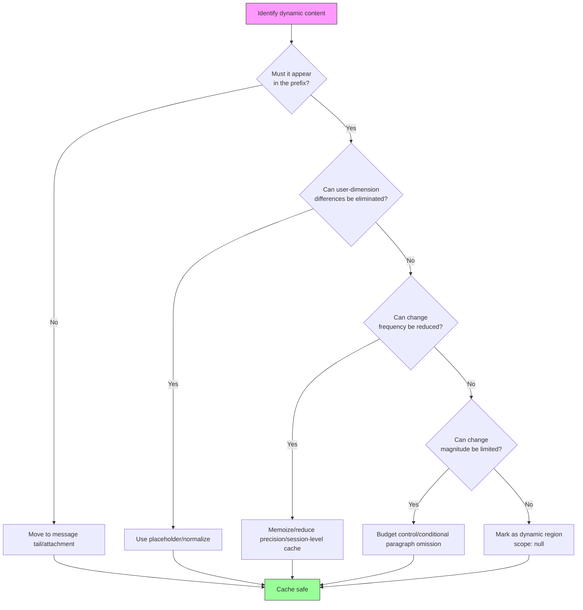

# Chapter 15: Cache Optimization Patterns

## Why This Matters

Chapter 13 analyzed the defensive layer of the cache architecture, and Chapter 14 built the detection capability for cache breaks. This chapter shifts to **offense** — how Claude Code eliminates or reduces cache breaks at the source through a series of named optimization patterns.

These optimization patterns were not designed all at once. Each one originated from real data captured by the cache break detection system introduced in Chapter 14 via BigQuery. When `tengu_prompt_cache_break` events revealed a particular break cause recurring repeatedly, the engineering team designed a targeted optimization pattern to eliminate it.

This chapter introduces 7+ named cache optimization patterns, from simple date memoization to complex tool schema caching. Each pattern follows the same framework: **identify the change source, understand the nature of the change, turn dynamic into static**.

---

## Pattern Summary

Before diving into each pattern, here's a global view:

| # | Pattern Name | Change Source | Optimization Strategy | Key File | Impact Scope |
|---|-------------|--------------|----------------------|----------|-------------|
| 1 | Date Memoization | Date changes at midnight | `memoize(getLocalISODate)` | `constants/common.ts` | System prompt |
| 2 | Monthly Granularity | Date changes daily | Use "Month YYYY" instead of full date | `constants/common.ts` | Tool prompts |
| 3 | Agent List as Attachment | Agent list changes dynamically | Move from tool description to message attachment | `tools/AgentTool/prompt.ts` | Tool schema (10.2% cache_creation) |
| 4 | Skill List Budget | Skill count growth | Limit to 1% of context window | `tools/SkillTool/prompt.ts` | Tool schema |
| 5 | $TMPDIR Placeholder | User UID embedded in path | Replace with `$TMPDIR` | `tools/BashTool/prompt.ts` | Tool prompt / global cache |
| 6 | Conditional Paragraph Omission | Feature flags change prompt | Conditionally omit rather than add | Various system prompts | System prompt prefix |
| 7 | Tool Schema Cache | GrowthBook flips / dynamic content | Session-level Map cache | `utils/toolSchemaCache.ts` | All tool schemas |

**Table 15-1: 7+ Cache Optimization Pattern Summary**

---

## 15.1 Pattern One: Date Memoization — getSessionStartDate()

### The Problem

Claude Code's system prompt includes the current date (`currentDate`) to help the model understand temporal context. The date is obtained via the `getLocalISODate()` function:

```typescript
// constants/common.ts:4-15
export function getLocalISODate(): string {
  if (process.env.CLAUDE_CODE_OVERRIDE_DATE) {
    return process.env.CLAUDE_CODE_OVERRIDE_DATE
  }

  const now = new Date()
  const year = now.getFullYear()
  const month = String(now.getMonth() + 1).padStart(2, '0')
  const day = String(now.getDate()).padStart(2, '0')
  return `${year}-${month}-${day}`
}
```

The problem lies in **midnight crossover**: if a user initiates a request at 23:59, the system prompt contains `2026-04-01`; when the user initiates the next request at 00:01, the date becomes `2026-04-02`. This single character change is enough to bust the entire system prompt prefix cache — approximately 11,000 tokens need to be recomputed.

### The Solution

```typescript
// constants/common.ts:24
export const getSessionStartDate = memoize(getLocalISODate)
```

`getSessionStartDate` wraps `getLocalISODate` with lodash's `memoize` — the function captures the date on its first call and returns the same value forever after, regardless of whether the actual date has changed.

The source comments (lines 17–23) explain the trade-off in detail:

```typescript
// constants/common.ts:17-23
// Memoized for prompt-cache stability — captures the date once at session start.
// The main interactive path gets this behavior via memoize(getUserContext) in
// context.ts; simple mode (--bare) calls getSystemPrompt per-request and needs
// an explicit memoized date to avoid busting the cached prefix at midnight.
// When midnight rolls over, getDateChangeAttachments appends the new date at
// the tail (though simple mode disables attachments, so the trade-off there is:
// stale date after midnight vs. ~entire-conversation cache bust — stale wins).
```

### Design Trade-off

The trade-off is clear: **stale date vs full cache bust**. The choice of a stale date is justified because:

1. Date information is not critical for most programming tasks
2. When midnight does occur, `getDateChangeAttachments` appends the new date at the message tail — this doesn't affect the prefix cache
3. Simple mode (`--bare`) disables the attachment mechanism, so memoization must happen at the source

### Impact

This single-line optimization eliminates one full-prefix cache bust per day. For users working across midnight, this saves approximately 11,000 tokens in cache_creation costs.

---

## 15.2 Pattern Two: Monthly Granularity — getLocalMonthYear()

### The Problem

Date memoization solves the midnight crossover in the system prompt, but tool prompts also need time information. If tool prompts use the full date (`YYYY-MM-DD`), every midnight causes the schema cache for tools containing that date to invalidate. Tool schemas sit near the front of the API request, so their changes are more destructive than system prompt changes.

### The Solution

```typescript
// constants/common.ts:28-33
export function getLocalMonthYear(): string {
  const date = process.env.CLAUDE_CODE_OVERRIDE_DATE
    ? new Date(process.env.CLAUDE_CODE_OVERRIDE_DATE)
    : new Date()
  return date.toLocaleString('en-US', { month: 'long', year: 'numeric' })
}
```

`getLocalMonthYear()` returns a "Month YYYY" format (e.g., "April 2026") instead of a full date. **The change frequency drops from daily to monthly.**

The comment (line 27) explains the design intent:

```
// Returns "Month YYYY" (e.g. "February 2026") in the user's local timezone.
// Changes monthly, not daily — used in tool prompts to minimize cache busting.
```

### Division of Two Time Precisions

| Usage Context | Function | Precision | Change Frequency | Location |
|--------------|----------|-----------|-----------------|----------|
| System prompt | `getSessionStartDate()` | Day | Once per session | System prompt |
| Tool prompts | `getLocalMonthYear()` | Month | Once per month | Tool schema |

This division reflects a fundamental principle: **the closer content is to the front of the API request, the lower its change frequency needs to be**.

---

## 15.3 Pattern Three: Agent List Moved from Tool Description to Message Attachment

### The Problem

The AgentTool's tool description embedded a list of available agents — each agent's name, type, and description. This list is dynamic: MCP server async connections bring new agents, `/reload-plugins` refreshes the plugin list, and permission mode changes alter the available agent set.

Each time the list changes, the AgentTool's tool schema changes, invalidating the entire tool schema array's cache. Tool schemas sit after the system prompt in the API request — their changes not only invalidate their own cache but also all downstream message caches.

The source comment (`tools/AgentTool/prompt.ts`, lines 50–57) quantifies the severity of this problem:

```typescript
// tools/AgentTool/prompt.ts:50-57
// The dynamic agent list was ~10.2% of fleet cache_creation tokens: MCP async
// connect, /reload-plugins, or permission-mode changes mutate the list →
// description changes → full tool-schema cache bust.
```

**10.2% of all cache_creation tokens were attributable to this problem.**

### The Solution

```typescript
// tools/AgentTool/prompt.ts:59-64
export function shouldInjectAgentListInMessages(): boolean {
  if (isEnvTruthy(process.env.CLAUDE_CODE_AGENT_LIST_IN_MESSAGES)) return true
  if (isEnvDefinedFalsy(process.env.CLAUDE_CODE_AGENT_LIST_IN_MESSAGES))
    return false
  return getFeatureValue_CACHED_MAY_BE_STALE('tengu_agent_list_attach', false)
}
```

The solution moves the dynamic agent list out of the AgentTool's tool description and injects it via message attachments instead. The tool description becomes static text, describing only AgentTool's generic capabilities; the available agent list is appended as an `agent_listing_delta` attachment to user messages.

The key insight of this migration: **attachments are appended at the message tail and don't affect the prefix cache**. Agent list changes only add token costs to new messages, without invalidating the cached tool schema.

### Impact

Eliminated 10.2% of cache_creation tokens — the single largest improvement among all optimization patterns. Controlled via the GrowthBook feature flag `tengu_agent_list_attach` for gradual rollout, with the environment variable `CLAUDE_CODE_AGENT_LIST_IN_MESSAGES` preserved as a manual override.

---

## 15.4 Pattern Four: Skill List Budget (1% Context Window)

### The Problem

SkillTool, similar to AgentTool, embeds a list of available skills in its tool description. As the skill ecosystem grows (built-in skills + project skills + plugin skills), the list can become very long. More importantly, skill loading is dynamic — different projects have different `.claude/` configurations, and plugins can be loaded or unloaded mid-session.

### The Solution

```typescript
// tools/SkillTool/prompt.ts:20-23
// Skill listing gets 1% of the context window (in characters)
export const SKILL_BUDGET_CONTEXT_PERCENT = 0.01
export const CHARS_PER_TOKEN = 4
export const DEFAULT_CHAR_BUDGET = 8_000 // Fallback: 1% of 200k × 4
```

SkillTool imposes a strict budget limit on the skill list: **total list size must not exceed 1% of the context window**. For a 200K context window, this is approximately 8,000 characters.

The budget calculation function (lines 31–41):

```typescript
// tools/SkillTool/prompt.ts:31-41
export function getCharBudget(contextWindowTokens?: number): number {
  if (Number(process.env.SLASH_COMMAND_TOOL_CHAR_BUDGET)) {
    return Number(process.env.SLASH_COMMAND_TOOL_CHAR_BUDGET)
  }
  if (contextWindowTokens) {
    return Math.floor(
      contextWindowTokens * CHARS_PER_TOKEN * SKILL_BUDGET_CONTEXT_PERCENT,
    )
  }
  return DEFAULT_CHAR_BUDGET
}
```

Additionally, each skill entry's description is truncated:

```typescript
// tools/SkillTool/prompt.ts:29
export const MAX_LISTING_DESC_CHARS = 250
```

The comment (lines 25–28) explains the design logic:

```
// Per-entry hard cap. The listing is for discovery only — the Skill tool loads
// full content on invoke, so verbose whenToUse strings waste turn-1 cache_creation
// tokens without improving match rate.
```

### The Essence of the Cache Optimization

The 1% budget control achieves cache optimization in two ways:

1. **Limiting tool description size**: Shorter descriptions mean fewer bytes that need to match exactly
2. **Budget trimming reduces churn**: When new skills are loaded but the budget is already full, they aren't included in the list — the list doesn't change, the cache doesn't break

This is a "budget equals stability" pattern: by limiting the maximum size of dynamic content, it indirectly controls the magnitude of cache key changes.

---

## 15.5 Pattern Five: $TMPDIR Placeholder

### The Problem

BashTool's prompt needs to tell the model which temporary directory path it can write to. Claude Code uses `getClaudeTempDir()` to obtain this path, typically in the format `/private/tmp/claude-{UID}/`, where `{UID}` is the user's system UID.

The problem: different users have different UIDs, so the path string differs. If this path is embedded in the tool prompt, it prevents **cross-user global cache hits**. User A's `/private/tmp/claude-1001/` and User B's `/private/tmp/claude-1002/` are different byte sequences that can't be shared even within the global cache scope.

### The Solution

```typescript
// tools/BashTool/prompt.ts:186-190
// Replace the per-UID temp dir literal (e.g. /private/tmp/claude-1001/) with
// "$TMPDIR" so the prompt is identical across users — avoids busting the
// cross-user global prompt cache. The sandbox already sets $TMPDIR at runtime.
const claudeTempDir = getClaudeTempDir()
const normalizeAllowOnly = (paths: string[]): string[] =>
  [...new Set(paths)].map(p => (p === claudeTempDir ? '$TMPDIR' : p))
```

The solution is elegant and concise: replace the user-specific temporary directory path with the `$TMPDIR` placeholder. Since Claude Code's sandbox environment already sets `$TMPDIR` to the correct directory, the model using `$TMPDIR` to reference the temp directory works identically to using the absolute path.

The prompt also explicitly instructs the model to use `$TMPDIR`:

```typescript
// tools/BashTool/prompt.ts:258-260
'For temporary files, always use the `$TMPDIR` environment variable. ' +
'TMPDIR is automatically set to the correct sandbox-writable directory ' +
'in sandbox mode. Do NOT use `/tmp` directly - use `$TMPDIR` instead.',
```

### Impact

This optimization makes BashTool's prompt **byte-for-byte identical** across all users, enabling global cache scope prefix sharing. For BashTool — the most frequently used tool — global cache hits on its schema mean significant cost savings.

---

## 15.6 Pattern Six: Conditional Paragraph Omission

### The Problem

The system prompt contains paragraphs that only appear under certain conditions: a feature flag being enabled adds an explanation, a capability being available inserts guidance. When these conditions flip mid-session (e.g., GrowthBook's remote configuration updates), the appearance/disappearance of paragraphs changes the system prompt content, causing cache breaks.

### The Solution

The core principle of the conditional paragraph omission pattern is: **better to not say it than to say it and then remove it**. Specific implementation approaches include:

1. **Replace conditional paragraphs with static text**: If an explanation has minimal impact on model behavior, simply always include it (or always exclude it), avoiding conditional logic
2. **Move conditional content after the dynamic boundary**: If conditional inclusion is necessary, place it after `SYSTEM_PROMPT_DYNAMIC_BOUNDARY`, which doesn't participate in global caching (see Chapter 13)
3. **Use the attachment mechanism instead of inline conditionals**: Similar to Pattern Three's agent list, append conditional content as attachments at the message tail

This pattern doesn't have a single implementation location — it's a design principle that permeates the construction of system prompts and tool prompts. Its essence is ensuring that system prompt blocks in the API request prefix maintain **monotonic stability** throughout the session lifecycle: content either always exists or never exists, never appearing/disappearing due to external condition flips.

---

## 15.7 Pattern Seven: Tool Schema Cache — getToolSchemaCache()

### The Problem

Tool schema serialization (`toolToAPISchema()`) is a complex process involving multiple runtime decisions:

1. **GrowthBook feature flags**: `tengu_tool_pear` (strict mode), `tengu_fgts` (fine-grained tool streaming), and other flags control optional fields in the schema
2. **Dynamic output from tool.prompt()**: Some tools' description text contains runtime information
3. **MCP tool schemas**: Schemas provided by external servers may change mid-session

Recomputing tool schemas for every API request means: if GrowthBook refreshes its cache mid-session (which can happen at any time), and a flag value flips from `true` to `false`, the tool schema serialization result changes — cache break.

### The Solution

```typescript
// utils/toolSchemaCache.ts:1-27
// Session-scoped cache of rendered tool schemas. Tool schemas render at server
// position 2 (before system prompt), so any byte-level change busts the entire
// ~11K-token tool block AND everything downstream. GrowthBook gate flips
// (tengu_tool_pear, tengu_fgts), MCP reconnects, or dynamic content in
// tool.prompt() drift all cause this churn. Memoizing per-session locks the schema
// bytes at first render — mid-session GB refreshes no longer bust the cache.

type CachedSchema = BetaTool & {
  strict?: boolean
  eager_input_streaming?: boolean
}

const TOOL_SCHEMA_CACHE = new Map<string, CachedSchema>()

export function getToolSchemaCache(): Map<string, CachedSchema> {
  return TOOL_SCHEMA_CACHE
}

export function clearToolSchemaCache(): void {
  TOOL_SCHEMA_CACHE.clear()
}
```

`TOOL_SCHEMA_CACHE` is a module-level Map keyed by tool name (or a composite key including `inputJSONSchema`), caching the fully serialized schema. Once a tool's schema is rendered and cached on the first request, subsequent requests reuse the cached value directly, without calling `tool.prompt()` or re-evaluating GrowthBook flags.

### Cache Key Design

The cache key design has a subtle but critical consideration (`utils/api.ts`, lines 147–149):

```typescript
// utils/api.ts:147-149
const cacheKey =
  'inputJSONSchema' in tool && tool.inputJSONSchema
    ? `${tool.name}:${jsonStringify(tool.inputJSONSchema)}`
    : tool.name
```

Most tools use their name as the key — each tool name is unique and the schema doesn't change within a session. But `StructuredOutput` is a special case: its name is always `'StructuredOutput'`, but different workflow calls pass different `inputJSONSchema`. If only the name were used as the key, the schema cached on the first call would be incorrectly reused in subsequent different workflows.

The source comment notes the severity of this bug:

```
// StructuredOutput instances share the name 'StructuredOutput' but carry
// different schemas per workflow call — name-only keying returned a stale
// schema (5.4% → 51% err rate, see PR#25424).
```

**The error rate jumped from 5.4% to 51%** — this isn't a subtle cache consistency issue but a severe functional bug. It was resolved by including `inputJSONSchema` in the cache key.

### Lifecycle

The lifecycle of `TOOL_SCHEMA_CACHE` is bound to the session:

- **Creation**: Populated tool-by-tool on the first call to `toolToAPISchema()`
- **Read**: Reused for every subsequent API request
- **Clearing**: `clearToolSchemaCache()` is called on user logout (via `auth.ts`), ensuring new sessions don't reuse stale schemas from old sessions

Note that `clearToolSchemaCache` is placed in `utils/toolSchemaCache.ts`, a standalone leaf module, rather than `utils/api.ts`. The comment explains why:

```
// Lives in a leaf module so auth.ts can clear it without importing api.ts
// (which would create a cycle via plans→settings→file→growthbook→config→
// bridgeEnabled→auth).
```

A seemingly simple cache Map requires careful module splitting to avoid circular dependencies — a common challenge in large TypeScript projects.

---

## 15.8 The Common Essence of These Patterns

Looking back at all seven patterns, the following diagram illustrates the optimization decision flow they all share:



**Figure 15-1: Cache Optimization Pattern Decision Flow**

Several common principles can be extracted:

### Principle One: Push Dynamic Content Toward the Request Tail

The API request's prefix matching model means: **the earlier the content, the more destructive its changes**. Therefore:

- Date memoization (Pattern One) locks the date in the system prompt
- Agent list as attachment (Pattern Three) moves the dynamic list from tool schema (front) to message attachment (tail)
- Conditional paragraph omission (Pattern Six) ensures prefix content doesn't flutter

### Principle Two: Reduce Change Frequency

When content must appear in the prefix, reducing its change frequency is the next best option:

- Monthly granularity (Pattern Two) reduces date changes from daily to monthly
- Skill list budget (Pattern Four) reduces list changes through budget trimming
- Tool schema cache (Pattern Seven) reduces change frequency from per-request to per-session

### Principle Three: Eliminate User-Dimension Differences

The prerequisite for global caching is that all users see the same prefix:

- $TMPDIR placeholder (Pattern Five) eliminates path differences caused by user UIDs
- Date memoization also indirectly serves this — users in different time zones may have different dates at the same moment

### Principle Four: Measure First, Optimize Second

The discovery of every pattern depends on the cache break detection system from Chapter 14:

- 10.2% of cache_creation tokens attributed to the agent list — this number came from BigQuery analysis
- 77% of tool changes are single tool schema changes — this drove the tool schema cache design
- GrowthBook flag flips as a break cause — this drove the introduction of session-level caching

Without the observability infrastructure, these patterns would never have been discovered.

---

## What Users Can Do

These patterns apply beyond Claude Code — any application using the Anthropic API (or similar prefix caching mechanisms) can learn from them.

### Advice for API Callers

1. **Audit your system prompt**: Identify dynamic content within it (dates, usernames, configuration values) and push them to the end of the system prompt or into messages
2. **Lock down tool schemas**: Tool definitions should remain constant within a session. If you must dynamically change the tool list, consider using message attachments instead
3. **Monitor cache_read_input_tokens**: This is the only indicator of whether caching is working properly. If it drops unexpectedly mid-session, you have a cache break
4. **Understand prefix order**: Changes to content before a `cache_control` breakpoint invalidate that breakpoint's cache. When constructing requests, place the most stable content first

### Common Pitfalls

| Pitfall | Cause | Solution |
|---------|-------|----------|
| Embedding timestamps in system prompts | Changes every request | Use session-level memoization |
| Dynamic tool lists | MCP connect/disconnect changes the list | Attachment mechanism or defer_loading |
| User-specific paths | Different users, different bytes | Environment variable placeholders |
| Feature flags directly affecting schemas | Remote config refresh | Session-level cache |
| Frequent model switching | Model is part of the cache key | Keep model selection as stable as possible |

### Advice for Claude Code Users

1. **Leverage the 1-hour cache window.** CC's prompt cache TTL is 1 hour — if you work continuously within an hour, subsequent requests enjoy increasingly higher cache hit rates. Avoid expecting caches to remain valid after long breaks.
2. **Reuse sessions rather than frequently creating new ones.** New session = new cache prefix = zero hits. Using `--resume` to restore an existing session is more cost-efficient than creating a new one.
3. **Monitor `cache_creation_input_tokens` vs `cache_read_input_tokens`.** The former is the "tuition" you pay for caching, the latter is the "return." A healthy session should show creation being high in the first few turns, then read dominating thereafter.
4. **If building an agent, implement cache edit pinning.** CC's `pinCacheEdits()` / `consumePendingCacheEdits()` pattern allows modifying message content without breaking the cache prefix — an advanced optimization worth borrowing.

---

## Summary

This chapter introduced Claude Code's 7 cache optimization patterns:

1. **Date memoization**: `memoize(getLocalISODate)` eliminates midnight cache busting
2. **Monthly granularity**: `getLocalMonthYear()` reduces tool prompt date change frequency from daily to monthly
3. **Agent list as attachment**: Eliminated 10.2% of cache_creation tokens
4. **Skill list budget**: A hard 1% context window budget controls list size and change
5. **$TMPDIR placeholder**: Eliminates user-dimension differences, enabling global cache
6. **Conditional paragraph omission**: Ensures prefix content doesn't flutter due to feature toggles
7. **Tool schema cache**: Session-level Map isolates GrowthBook flips and dynamic content

Together, these patterns embody a core insight: **cache optimization is not an isolated concern, but something that permeates every location in the system that produces dynamic content**. From date formats to path strings, from tool descriptions to feature flags — any "seemingly unimportant" change can invalidate tens of thousands of cached tokens. Claude Code's approach treats cache stability as a first-class citizen, making explicit cache-friendly design decisions at every point where dynamic content is generated.

With this, Part 4 "Prompt Caching" concludes. Chapter 13 established the defensive layer of cache architecture (scopes, TTL, latching), Chapter 14 built detection capability (two-phase detection, explanation engine), and Chapter 15 demonstrated offensive measures (7+ optimization patterns). The three chapters together form a complete cache engineering system: **Defense, Detection, Optimization**.

The next part turns to the safety and permissions system — another domain requiring systematic engineering thinking. See Chapter 16.
