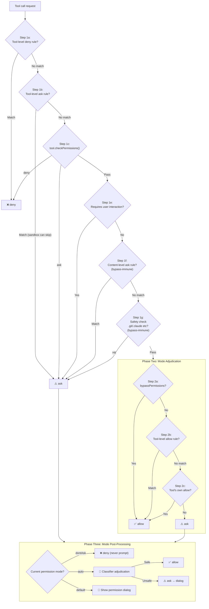

# Chapter 16: Permission System

<p align="right">
  <a href="../../part5/ch16.html">Read the Chinese original</a>
</p>

> **Positioning**: This chapter analyzes Claude Code's six permission modes, three-layer rule matching mechanism, and the complete validation-permission-classification pipeline. Prerequisites: Chapter 4 (startup flow). Target audience: readers wanting to understand CC's six permission modes and three-stage permission pipeline, or developers needing to design a permission model for their own Agent.

## Why This Matters

An AI Agent capable of executing arbitrary shell commands and reading/writing any file in a user's codebase — the design quality of its permission system directly determines the upper bound of user trust. Too permissive, and users face security risks — malicious prompt injection could trigger `rm -rf /` or steal SSH keys; too restrictive, and every operation prompts a confirmation dialog, reducing the AI coding assistant to an "automation tool that requires constant human clicking."

Claude Code's permission system attempts to find a balance between these two extremes: through six permission modes, a three-layer rule matching mechanism, and a complete validation-permission-classification pipeline, it achieves tiered control where "safe operations pass automatically, dangerous operations require manual confirmation, and ambiguous cases are adjudicated by an AI classifier."

This chapter will thoroughly dissect the design and implementation of this permission system.

---

## 16.1 Six Permission Modes

The Permission Mode is the highest-level control switch of the entire system. Users cycle through modes via Shift+Tab or specify one through the `--permission-mode` CLI argument. All modes are defined in `types/permissions.ts`:

```typescript
// types/permissions.ts:16-22
export const EXTERNAL_PERMISSION_MODES = [
  'acceptEdits',
  'bypassPermissions',
  'default',
  'dontAsk',
  'plan',
] as const
```

Internally there are two additional non-public modes — `auto` and `bubble` — forming the complete type union:

```typescript
// types/permissions.ts:28-29
export type InternalPermissionMode = ExternalPermissionMode | 'auto' | 'bubble'
export type PermissionMode = InternalPermissionMode
```

Here is each mode's behavioral description:

| Mode | Symbol | Behavior | Typical Scenario |
|------|--------|----------|------------------|
| `default` | (none) | All tool calls require user confirmation | First-time use, high-security environments |
| `acceptEdits` | `>>` | File edits within the working directory pass automatically; shell commands still require confirmation | Daily coding assistance |
| `plan` | `⏸` | AI can only read and search; no write operations are executed | Code review, architecture planning |
| `bypassPermissions` | `>>` | Skips all permission checks (except safety checks) | Batch operations in trusted environments |
| `dontAsk` | `>>` | Converts all `ask` decisions to `deny`; never prompts for confirmation | Automated CI/CD pipelines |
| `auto` | `>>` | AI classifier automatically adjudicates; internal use only | Anthropic internal development |

Each mode has a corresponding configuration object (`PermissionMode.ts:42-91`) containing title, abbreviation, symbol, and color key. Notably, the `auto` mode is registered through a `feature('TRANSCRIPT_CLASSIFIER')` compile-time feature gate — in external builds this code is completely removed by Bun's dead code elimination.

### Mode Switching Cycle Logic

`getNextPermissionMode` (`getNextPermissionMode.ts:34-79`) defines the Shift+Tab cycle order:

```
External users: default → acceptEdits → plan → [bypassPermissions] → default
Internal users: default → [bypassPermissions] → [auto] → default
```

Internal users skip `acceptEdits` and `plan` because `auto` mode replaces both their functions. `bypassPermissions` only appears in the cycle when the `isBypassPermissionsModeAvailable` flag is `true`. The `auto` mode requires both a feature gate and a runtime availability check:

```typescript
// getNextPermissionMode.ts:17-29
function canCycleToAuto(ctx: ToolPermissionContext): boolean {
  if (feature('TRANSCRIPT_CLASSIFIER')) {
    const gateEnabled = isAutoModeGateEnabled()
    const can = !!ctx.isAutoModeAvailable && gateEnabled
    // ...
    return can
  }
  return false
}
```

### Side Effects of Mode Transitions

Switching modes is not just changing an enum value — `transitionPermissionMode` (`permissionSetup.ts:597-646`) handles transition side effects:

1. **Entering plan mode**: Calls `prepareContextForPlanMode`, saving the current mode to `prePlanMode`
2. **Entering auto mode**: Calls `stripDangerousPermissionsForAutoMode`, removing dangerous allow rules (detailed below)
3. **Leaving auto mode**: Calls `restoreDangerousPermissions`, restoring stripped rules
4. **Leaving plan mode**: Sets the `hasExitedPlanMode` state flag

---

## 16.2 Permission Rule System

Permission modes are coarse-grained switches; permission rules provide fine-grained control. A rule consists of three parts:

```typescript
// types/permissions.ts:75-79
export type PermissionRule = {
  source: PermissionRuleSource
  ruleBehavior: PermissionBehavior    // 'allow' | 'deny' | 'ask'
  ruleValue: PermissionRuleValue
}
```

Where `PermissionRuleValue` specifies the target tool and an optional content qualifier:

```typescript
// types/permissions.ts:67-70
export type PermissionRuleValue = {
  toolName: string
  ruleContent?: string    // e.g., "npm install", "git:*"
}
```

### Rule Source Hierarchy

Rules have eight sources (`types/permissions.ts:54-62`), ranked from highest to lowest priority:

| Source | Location | Sharing |
|--------|----------|---------|
| `policySettings` | Enterprise managed policy | Pushed to all users |
| `projectSettings` | `.claude/settings.json` | Committed to git, team-shared |
| `localSettings` | `.claude/settings.local.json` | Gitignored, local only |
| `userSettings` | `~/.claude/settings.json` | User global |
| `flagSettings` | `--settings` CLI argument | Runtime |
| `cliArg` | `--allowed-tools` and other CLI arguments | Runtime |
| `command` | Command-line subcommand context | Runtime |
| `session` | In-session temporary rules | Current session only |

### Rule String Format and Parsing

Rules are stored as strings in configuration files, formatted as `ToolName` or `ToolName(content)`. Parsing is handled by `permissionRuleParser.ts`'s `permissionRuleValueFromString` function (lines 93-133), which handles escaped parentheses — since rule content itself may contain parentheses (e.g., `python -c "print(1)"`).

Special case: both `Bash()` and `Bash(*)` are treated as tool-level rules (no content qualifier), equivalent to `Bash`.

---

## 16.3 Three Rule Matching Modes

Shell command permission rules support three matching modes, parsed by `shellRuleMatching.ts`'s `parsePermissionRule` function (lines 159-184) into a discriminated union type:

```typescript
// shellRuleMatching.ts:25-38
export type ShellPermissionRule =
  | { type: 'exact'; command: string }
  | { type: 'prefix'; prefix: string }
  | { type: 'wildcard'; pattern: string }
```

### Exact Matching

Rules without wildcards require an exact command match:

| Rule | Matches | Does Not Match |
|------|---------|----------------|
| `npm install` | `npm install` | `npm install lodash` |
| `git status` | `git status` | `git status --short` |

### Prefix Matching (Legacy `:*` Syntax)

Rules ending with `:*` use prefix matching — this is a legacy syntax for backward compatibility:

| Rule | Matches | Does Not Match |
|------|---------|----------------|
| `npm:*` | `npm install`, `npm run build`, `npm test` | `npx create-react-app` |
| `git:*` | `git add .`, `git commit -m "msg"` | `gitk` |

Prefix extraction is performed by `permissionRuleExtractPrefix` (lines 43-48): the regex `/^(.+):\*$/` captures everything before `:*` as the prefix.

### Wildcard Matching

Rules containing an unescaped `*` (excluding trailing `:*`) use wildcard matching. `matchWildcardPattern` (lines 90-154) converts the pattern into a regular expression:

| Rule | Matches | Does Not Match |
|------|---------|----------------|
| `git add *` | `git add .`, `git add src/main.ts`, bare `git add` | `git commit` |
| `docker build -t *` | `docker build -t myapp` | `docker run myapp` |
| `echo \*` | `echo *` (literal asterisk) | `echo hello` |

Wildcard matching has a carefully designed behavior: when a pattern ends with ` *` (space plus wildcard) and the entire pattern contains only one unescaped `*`, the trailing space and arguments are optional. This means `git *` matches both `git add` and bare `git` (lines 142-145). This keeps wildcard semantics consistent with prefix rules like `git:*`.

The escape mechanism uses null-byte sentinel placeholders (lines 14-17) to prevent confusion between `\*` (literal asterisk) and `*` (wildcard) during regex conversion:

```typescript
// shellRuleMatching.ts:14-17
const ESCAPED_STAR_PLACEHOLDER = '\x00ESCAPED_STAR\x00'
const ESCAPED_BACKSLASH_PLACEHOLDER = '\x00ESCAPED_BACKSLASH\x00'
```

---

## 16.4 Validation-Permission-Classification Pipeline

> **Interactive version**: [Click to view the permission decision tree animation](permission-viz.html) — select different tool call scenarios (Read file / Bash rm / Edit / Write .env) and watch how requests flow through the three-stage pipeline.

When the AI model initiates a tool call, the request passes through a three-stage pipeline to determine whether it should execute. The core entry point is `hasPermissionsToUseTool` (`permissions.ts:473`), which calls the internal function `hasPermissionsToUseToolInner` to execute the first two stages, then handles the third stage's classifier logic in the outer layer.



### Phase One: Rule Validation

This is the most defensive phase; all exit paths take priority over mode adjudication. Key steps:

**Steps 1a-1b** (`permissions.ts:1169-1206`) check tool-level deny and ask rules. If `Bash` is denied as a whole, any Bash command is rejected. Tool-level ask rules have one exception: when sandbox is enabled and `autoAllowBashIfSandboxed` is on, sandboxed commands can skip the ask rule.

**Step 1c** (`permissions.ts:1214-1223`) calls the tool's own `checkPermissions()` method. Each tool type (Bash, FileEdit, PowerShell, etc.) implements its own permission checking logic. For example, the Bash tool parses the command, checks subcommands, and matches allow/deny rules.

**Step 1f** (`permissions.ts:1244-1250`) is a critical design: content-level ask rules (like `Bash(npm publish:*)`) must prompt even in `bypassPermissions` mode. This is because user-explicitly-configured ask rules represent clear security intent — "I want to confirm before publishing."

**Step 1g** (`permissions.ts:1255-1258`) is equally bypass-immune: write operations to `.git/`, `.claude/`, `.vscode/`, and shell configuration files (`.bashrc`, `.zshrc`, etc.) always require confirmation.

### Phase Two: Mode Adjudication

If the tool call passed through Phase One without being denied or forced to ask, it enters mode adjudication. `bypassPermissions` mode allows directly at this point. In other modes, allow rules and the tool's own allow decision are checked.

### Phase Three: Mode Post-Processing

This is the final gate of the permission decision pipeline. `dontAsk` mode converts all ask decisions to deny, suitable for non-interactive environments (`permissions.ts:505-517`). `auto` mode launches the AI classifier for adjudication — the most complex path in the entire permission system (detailed below).

---

## 16.5 `isDangerousBashPermission()`: Protecting the Classifier's Safety Boundary

When a user switches from another mode to `auto` mode, the system calls `stripDangerousPermissionsForAutoMode` to temporarily strip certain allow rules. Stripped rules are not deleted but saved in the `strippedDangerousRules` field, and restored when leaving auto mode.

The core function for determining whether a rule is "dangerous" is `isDangerousBashPermission` (`permissionSetup.ts:94-147`):

```typescript
// permissionSetup.ts:94-107
export function isDangerousBashPermission(
  toolName: string,
  ruleContent: string | undefined,
): boolean {
  if (toolName !== BASH_TOOL_NAME) { return false }
  if (ruleContent === undefined || ruleContent === '') { return true }
  const content = ruleContent.trim().toLowerCase()
  if (content === '*') { return true }
  // ...check DANGEROUS_BASH_PATTERNS
}
```

Dangerous rule patterns include five forms:

1. **Tool-level allow**: `Bash` (no ruleContent) or `Bash(*)` — allows all commands
2. **Standalone wildcard**: `Bash(*)` — equivalent to tool-level allow
3. **Interpreter prefix**: `Bash(python:*)` — allows arbitrary Python code execution
4. **Interpreter wildcard**: `Bash(python *)` — same as above
5. **Interpreter with flag wildcard**: `Bash(python -*)` — allows `python -c 'arbitrary code'`

Dangerous command prefixes are defined in `dangerousPatterns.ts:44-80`:

```typescript
// dangerousPatterns.ts:44-80
export const DANGEROUS_BASH_PATTERNS: readonly string[] = [
  ...CROSS_PLATFORM_CODE_EXEC,  // python, node, ruby, perl, ssh, etc.
  'zsh', 'fish', 'eval', 'exec', 'env', 'xargs', 'sudo',
  // Additional Anthropic-internal patterns...
]
```

Cross-platform code execution entry points (`CROSS_PLATFORM_CODE_EXEC`, lines 18-42) cover all major script interpreters (python/node/ruby/perl/php/lua), package runners (npx/bunx/npm run), shells (bash/sh), and remote command execution tools (ssh).

Internal users additionally include `gh`, `curl`, `wget`, `git`, `kubectl`, `aws`, etc. — these are excluded in external builds by a `process.env.USER_TYPE === 'ant'` gate.

PowerShell has a corresponding `isDangerousPowerShellPermission` (`permissionSetup.ts:157-233`) that additionally detects PowerShell-specific dangerous commands: `Invoke-Expression`, `Start-Process`, `Add-Type`, `New-Object`, etc., and handles `.exe` suffix variants (`python.exe`, `npm.exe`).

---

## 16.6 Path Permission Validation and UNC Protection

File operation permission validation is executed by `pathValidation.ts`'s `validatePath` function (lines 373-485). This is a multi-step security pipeline:

### Path Validation Pipeline

```
Input path
  │
  ├─ 1. Strip quotes, expand ~ ──→ cleanPath
  ├─ 2. UNC path detection ──→ Reject if matched
  ├─ 3. Dangerous tilde variant detection (~root, ~+, ~-) ──→ Reject if matched
  ├─ 4. Shell expansion syntax detection ($VAR, %VAR%) ──→ Reject if matched
  ├─ 5. Glob pattern detection ──→ Reject for writes; validate base directory for reads
  ├─ 6. Resolve to absolute path + symlink resolution
  └─ 7. isPathAllowed() multi-step check
```

### UNC Path NTLM Leak Protection

On Windows, when an application accesses a UNC path (e.g., `\\attacker-server\share\file`), the operating system automatically sends NTLM authentication credentials for authentication. Attackers can exploit this mechanism: through prompt injection, they can make the AI read or write to a UNC path pointing to a malicious server, thereby stealing the user's NTLM hash.

`containsVulnerableUncPath` (`shell/readOnlyCommandValidation.ts:1562`) detects three UNC path variants:

```typescript
// readOnlyCommandValidation.ts:1562-1596
export function containsVulnerableUncPath(pathOrCommand: string): boolean {
  if (getPlatform() !== 'windows') { return false }

  // 1. Backslash UNC: \\server\share
  const backslashUncPattern = /\\\\[^\s\\/]+(?:@(?:\d+|ssl))?(?:[\\/]|$|\s)/i

  // 2. Forward-slash UNC: //server/share (excluding :// in URLs)
  const forwardSlashUncPattern = /(?<!:)\/\/[^\s\\/]+(?:@(?:\d+|ssl))?(?:[\\/]|$|\s)/i

  // 3. Mixed separators: /\\server (Cygwin/bash environments)
  // ...
}
```

Note the second regex uses a `(?<!:)` negative lookbehind to exclude URLs like `https://` — a legitimate double-slash use case. The hostname pattern `[^\s\\/]+` uses an exclusion set rather than a character whitelist, to catch Unicode homoglyph attacks (e.g., substituting Cyrillic 'а' for Latin 'a').

### TOCTOU Protection

Path validation also defends against multiple TOCTOU (Time-of-Check-to-Time-of-Use) attacks:

- **Dangerous tilde variants** (lines 401-411): `~root` is resolved as a relative path to `/cwd/~root/...` during validation, but Shell expands it to `/var/root/...` at execution time
- **Shell variable expansion** (lines 423-436): `$HOME/.ssh/id_rsa` is a literal string during validation, but Shell expands it to the actual path at execution time
- **Zsh equals expansion** (same): `=rg` expands to `/usr/bin/rg` in Zsh

All these cases are defended by rejecting paths containing specific characters (`$`, `%`, `=`), requiring manual user confirmation.

### `isPathAllowed()` Multi-Step Check

After path sanitization, `isPathAllowed` (`pathValidation.ts:141-263`) performs the final permission adjudication:

1. **Deny rules take priority**: Any matching deny rule immediately rejects
2. **Internally editable paths**: Plan files, scratchpads, agent memory, and other internal paths under `~/.claude/` are automatically allowed for editing
3. **Safety checks**: Write operations to dangerous directories (`.git/`, `.claude/`) and shell configuration files are flagged for confirmation
4. **Working directory check**: When the path is within the allowed working directory, `read` operations pass automatically; `write` operations require `acceptEdits` mode
5. **Sandbox write whitelist**: When sandbox is enabled, its configured writable directories are automatically allowed
6. **Allow rules**: Matching allow rules grant permission

---

## 16.7 Auto Mode's Classifier Pipeline

When the permission mode is `auto` and a tool call reaches Phase Three's ask decision, the system launches the YOLO classifier (`yoloClassifier.ts`) for AI adjudication. The classifier's design philosophy is: in most cases, AI can determine whether an operation is safe.

### Safe Tool Whitelist

Not all tools need to go through the classifier. `classifierDecision.ts` defines a safety whitelist (`SAFE_YOLO_ALLOWLISTED_TOOLS`, lines 56-94), containing read-only operations (FileRead, Grep, Glob), metadata operations (Task-related tools), and UI tools (EnterPlanMode, AskUserQuestion). Whitelisted tools are directly allowed.

### acceptEdits Fast Path

Before calling the classifier, the system simulates an `acceptEdits` mode check (`permissions.ts:600-648`): if the tool would be allowed in `acceptEdits` mode (e.g., file edits within the working directory), the classifier is skipped and permission is granted directly. This avoids unnecessary API calls. However, `Agent` (sub-agent) and `REPL` (code execution) tools are explicitly excluded — their safety cannot be determined by path alone.

### Consecutive Denial Tracking

`denialTracking.ts` implements a consecutive denial counter. When the classifier denies operations multiple consecutive times, the system degrades to manual prompting mode — a safety net for potential classifier misjudgments. Each successful tool call resets the counter.

### The Classifier's Two-Stage Architecture

The YOLO classifier (`yoloClassifier.ts`) uses a two-stage decision process:

1. **Stage 1 (Fast)**: Low-latency model makes a quick judgment
2. **Stage 2 (Thinking)**: When Stage 1 is uncertain, a more powerful model performs deeper analysis

The classifier receives the current session context (tool call history, user messages) and the command awaiting adjudication, returning a `shouldBlock` boolean and a reason description. The result structure contains detailed telemetry fields (token usage, latency, request IDs) for subsequent analysis.

---

## 16.8 Dangerous File and Directory Protection

`filesystem.ts` defines two categories of protected objects:

```typescript
// filesystem.ts:57-79
export const DANGEROUS_FILES = [
  '.gitconfig', '.gitmodules',
  '.bashrc', '.bash_profile', '.zshrc', '.zprofile', '.profile',
  '.ripgreprc', '.mcp.json', '.claude.json',
] as const

export const DANGEROUS_DIRECTORIES = [
  '.git', '.vscode', '.idea', '.claude',
] as const
```

These files and directories can be used for code execution or data exfiltration:
- `.gitconfig` can configure `core.sshCommand` to execute arbitrary code
- `.bashrc`/`.zshrc` execute automatically on every Shell startup
- `.vscode/settings.json` can configure tasks and auto-run in terminals

Write operations to these paths are flagged as `safetyCheck` type in `checkPathSafetyForAutoEdit`, with bypass immunity — user confirmation is required even in `bypassPermissions` mode. However, in `auto` mode, some safety checks (such as sensitive file paths) are marked as `classifierApprovable: true`, allowing the classifier to automatically approve them when context is sufficient.

### Dangerous Removal Path Detection

`isDangerousRemovalPath` (`pathValidation.ts:331-367`) prevents deletion of root directories, home directories, Windows drive roots, and their direct children (`/usr`, `/tmp`, `C:\Windows`). It also handles path separator normalization — in Windows environments both `C:\\Windows` and `C:/Windows` are correctly identified.

---

## 16.9 Shadowed Rule Detection

When users configure contradictory permission rules — for example, denying `Bash` in project settings but allowing `Bash(git:*)` in local settings — the allow rule will never take effect. `shadowedRuleDetection.ts`'s `UnreachableRule` type (lines 19-25) records such cases:

```typescript
export type UnreachableRule = {
  rule: PermissionRule
  reason: string
  shadowedBy: PermissionRule
  shadowType: ShadowType       // 'ask' | 'deny'
  fix: string
}
```

The system detects and alerts users about which allow rules are shadowed by higher-priority deny/ask rules, and how to fix them.

---

## 16.10 Permission Update Persistence

Permission updates are described via the `PermissionUpdate` union type (`types/permissions.ts:98-131`), supporting six operations: `addRules`, `replaceRules`, `removeRules`, `setMode`, `addDirectories`, `removeDirectories`. Each operation specifies a target storage location (`PermissionUpdateDestination`).

When a user selects "Always allow" in the permission dialog, the system generates an `addRules` update, typically targeting `localSettings` (local settings, not committed to git). The shell tool's suggestion generation function (`shellRuleMatching.ts:189-228`) generates exact match or prefix match suggestions based on command characteristics.

---

## 16.11 Design Reflections

Claude Code's permission system demonstrates several noteworthy design principles:

**Defense in depth.** Deny rules intercept at the front of the pipeline, safety checks have bypass immunity, and auto mode strips dangerous rules upon entry — multiple layers of protection ensure that a single point of failure doesn't create a security gap.

**Safety intent is non-overridable.** User-explicitly-configured ask rules (Step 1f) and system safety checks (Step 1g) are not affected by `bypassPermissions` mode. This design acknowledges the value of bypass mode (batch operation efficiency) while protecting the safety boundaries that users intentionally set.

**TOCTOU consistency.** The path validation system rejects all path patterns that could produce semantic differences between "validation time" and "execution time" (shell variables, tilde variants, Zsh equals expansion), rather than trying to parse them correctly — choosing a safe, conservative strategy over a "clever" compatibility one.

**Classifier as safety net, not replacement.** The auto mode classifier is not a replacement for permission checks but a supplementary layer after rule validation. It only handles the gray areas where "rules don't have a clear answer," with a consecutive denial degradation mechanism to prevent system runaway.

These principles together form a permission architecture that balances security and usability — neither losing the AI Agent's value through excessive conservatism, nor exposing users to risk through excessive trust.

---

## What Users Can Do

### Permission Mode Selection Recommendations

- **Daily development**: Use `acceptEdits` mode — file edits pass automatically, shell commands still require confirmation, the best balance of security and efficiency
- **Code review/architecture exploration**: Use `plan` mode — AI can only read and search, eliminating accidental modifications
- **Batch automation tasks**: Use `bypassPermissions` mode — but note that safety checks (write operations to `.git/`, `.bashrc`, etc.) still require confirmation

### Rule Configuration Tips

- Use `.claude/settings.json` (project-level) to define team-shared allow/deny rules, committed to git
- Use `.claude/settings.local.json` (local-level) to define personal preference rules, automatically gitignored
- Use wildcard syntax to simplify rules: `Bash(git *)` allows all git subcommands
- If allow rules don't take effect after configuring deny rules, check for rule shadowing — the system will indicate shadowed rules and suggest fixes

### Security Considerations

- Even with `bypassPermissions` enabled, write operations to dangerous files like `.gitconfig`, `.bashrc`, `.zshrc` still require confirmation — this is intentional security design
- When using `auto` mode, the system automatically strips dangerous Bash allow rules (like `Bash(python:*)`); they are restored when leaving auto mode
- Shift+Tab can switch between modes at any time

---

## Version Evolution: v2.1.91 Changes

> The following analysis is based on v2.1.91 bundle signal comparison, combined with v2.1.88 source code inference.

### Auto Mode Formalization

In v2.1.88, `auto` mode already existed in internal code (`resetAutoModeOptInForDefaultOffer.ts`, `spawnMultiAgent.ts:227`) but did not appear in `sdk-tools.d.ts`'s public API definition. v2.1.91 formally includes it:

```diff
- mode?: "acceptEdits" | "bypassPermissions" | "default" | "dontAsk" | "plan";
+ mode?: "acceptEdits" | "auto" | "bypassPermissions" | "default" | "dontAsk" | "plan";
```

This means SDK users can now explicitly request auto mode through the public API — i.e., automatic permission approval driven by the TRANSCRIPT_CLASSIFIER.

### Bash Security Pipeline Simplification

v2.1.91 removes all infrastructure related to the tree-sitter WASM AST parser:

| Removed Signal | Original Purpose |
|---------------|------------------|
| `tengu_tree_sitter_load` | WASM module load tracking |
| `tengu_tree_sitter_security_divergence` | AST vs regex parsing divergence detection |
| `tengu_tree_sitter_shadow` | Shadow mode parallel testing |
| `tengu_bash_security_check_triggered` | 23 security check triggers |
| `CLAUDE_CODE_DISABLE_COMMAND_INJECTION_CHECK` | Injection check disable switch |

**Removal reason**: v2.1.88 source code comment CC-643 documented a performance issue — complex compound commands triggered `splitCommand` producing exponential subcommand arrays, each executing tree-sitter parsing + ~20 validators + logEvent, causing microtask chain starvation of the event loop and triggering REPL 100% CPU freezes.

v2.1.91 reverts to a pure JavaScript regex/shell-quote scheme. The `treeSitterAnalysis.ts` (507-line AST-level analysis) described in Section 16.x of this chapter applies only to v2.1.88.
