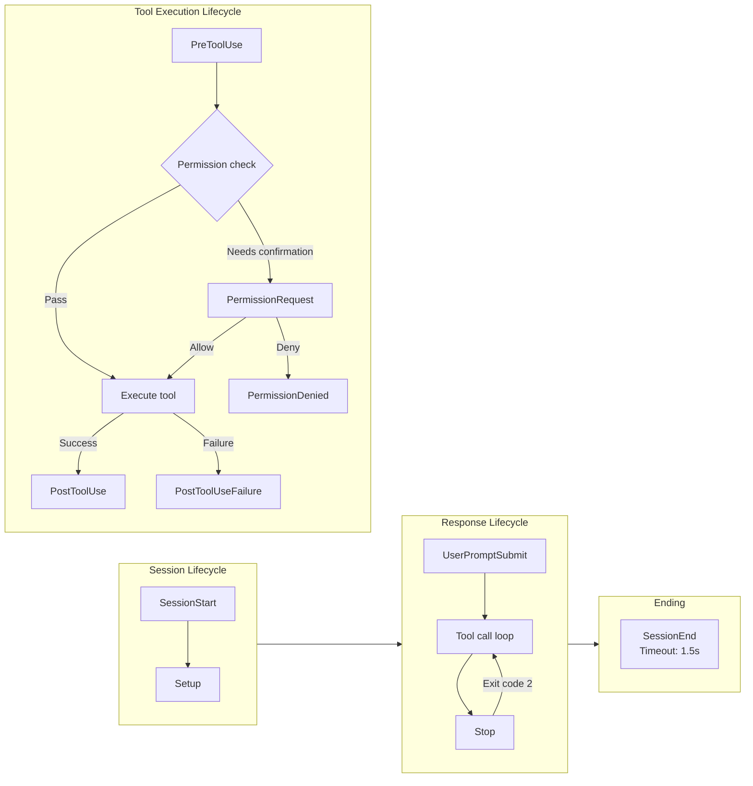
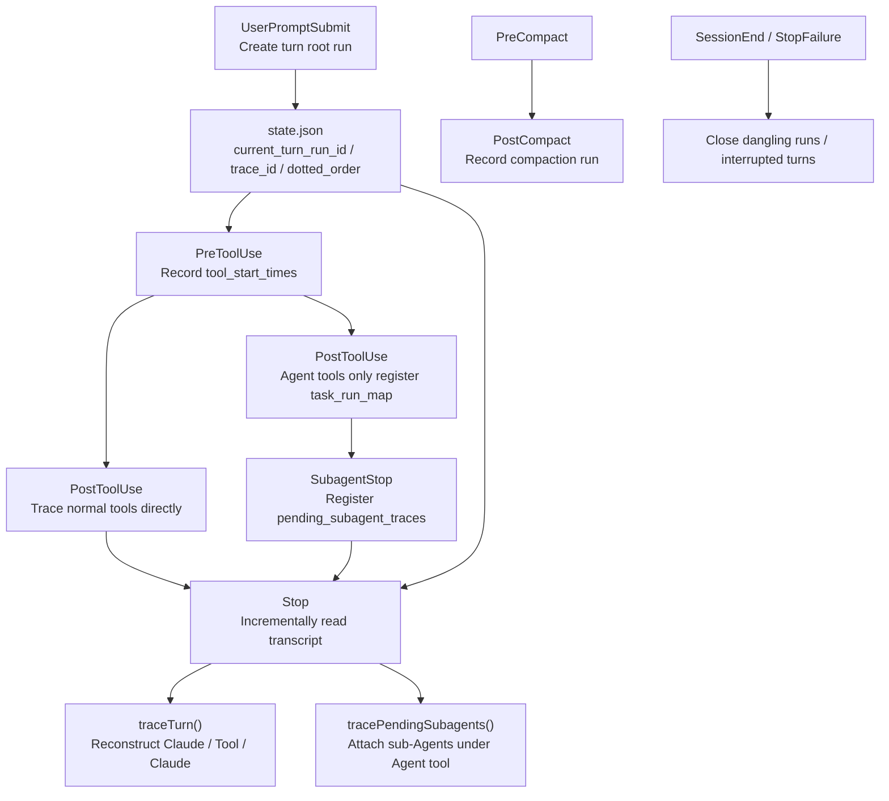

# Chapter 18: Hooks — User-Defined Interception Points

<p align="right">
  <a href="../../part5/ch18.html">Read the Chinese original</a>
</p>

> **Positioning**: This chapter analyzes the Hooks system — the mechanism for registering custom Shell commands, LLM prompts, or HTTP requests at 26 event points in the Agent lifecycle. Prerequisites: Chapter 16 (Permission System). Target audience: readers wanting to understand CC's user-defined interception point mechanism, or developers looking to implement a hook system in their own Agent.

## Why This Matters

Claude Code's permission system (Chapter 16) and YOLO classifier (Chapter 17) provide built-in security defenses, but they are all "pre-configured" — users cannot insert their own logic at critical nodes of the tool execution pipeline. The Hooks system fills this gap: it allows users to register custom shell commands, LLM prompts, HTTP requests, or Agent validators at 26 event points in the AI Agent lifecycle, enabling any workflow customization from "format checking" to "auto-deployment."

This is not a simple "callback function" mechanism. The Hooks system must solve four core challenges: Trust — where is the security boundary for arbitrary command execution? Timeout — how to prevent blocking the entire Agent loop when a Hook hangs? Semantics — how does a Hook's exit code translate into an "allow" or "block" decision? And configuration isolation — how do Hook configurations from multiple sources merge without interfering with each other?

This chapter will thoroughly dissect this mechanism from the source code level.

### Hook Event Lifecycle Overview



---

## 18.1 Complete List of Hook Event Types

The Hooks system supports 26 event types, defined in `hooksConfigManager.ts`'s `getHookEventMetadata` function (lines 28-264). They can be grouped into five categories by lifecycle phase:

### Tool Execution Lifecycle

| Event | Trigger Timing | matcher Field | Exit Code 2 Behavior |
|-------|---------------|---------------|---------------------|
| `PreToolUse` | Before tool execution | `tool_name` | Blocks tool call; stderr sent to model |
| `PostToolUse` | After successful tool execution | `tool_name` | stderr immediately sent to model |
| `PostToolUseFailure` | After failed tool execution | `tool_name` | stderr immediately sent to model |
| `PermissionRequest` | When permission dialog is displayed | `tool_name` | Uses Hook's decision |
| `PermissionDenied` | After auto mode classifier rejects a tool call | `tool_name` | — |

`PreToolUse` is the most commonly used Hook point. Its `hookSpecificOutput` supports three permission decisions (lines 72-78, `types/hooks.ts`):

```typescript
// types/hooks.ts:72-78
z.object({
  hookEventName: z.literal('PreToolUse'),
  permissionDecision: permissionBehaviorSchema().optional(),
  permissionDecisionReason: z.string().optional(),
  updatedInput: z.record(z.string(), z.unknown()).optional(),
  additionalContext: z.string().optional(),
})
```

Note the `updatedInput` field — Hooks can not only decide "whether to allow" but also modify the tool's input parameters. This makes "rewriting commands" possible: for example, automatically adding `--no-verify` before every `git push`.

### Session Lifecycle

| Event | Trigger Timing | matcher Field | Special Behavior |
|-------|---------------|---------------|-----------------|
| `SessionStart` | New session/resume/clear/compact | `source` (startup/resume/clear/compact) | stdout sent to Claude; blocking errors ignored |
| `SessionEnd` | When session ends | `reason` (clear/logout/prompt_input_exit/other) | Timeout only 1.5 seconds |
| `Setup` | During repo initialization and maintenance | `trigger` (init/maintenance) | stdout sent to Claude |
| `Stop` | Before Claude is about to end its response | — | Exit code 2 continues the conversation |
| `StopFailure` | When API error causes turn to end | `error` (rate_limit/authentication_failed/...) | fire-and-forget |
| `UserPromptSubmit` | When user submits a prompt | — | Exit code 2 blocks processing and erases original prompt |

The `SessionStart` Hook has a unique capability: through the `CLAUDE_ENV_FILE` environment variable, Hooks can write bash export statements to a specified file, and these environment variables will take effect in all subsequent BashTool commands (lines 917-926, `hooks.ts`):

```typescript
// hooks.ts:917-926
if (
  !isPowerShell &&
  (hookEvent === 'SessionStart' ||
    hookEvent === 'Setup' ||
    hookEvent === 'CwdChanged' ||
    hookEvent === 'FileChanged') &&
  hookIndex !== undefined
) {
  envVars.CLAUDE_ENV_FILE = await getHookEnvFilePath(hookEvent, hookIndex)
}
```

### Multi-Agent Lifecycle

| Event | Trigger Timing | matcher Field |
|-------|---------------|---------------|
| `SubagentStart` | When sub-Agent starts | `agent_type` |
| `SubagentStop` | Before sub-Agent is about to end response | `agent_type` |
| `TeammateIdle` | When a teammate is about to enter idle state | — |
| `TaskCreated` | When a task is created | — |
| `TaskCompleted` | When a task is completed | — |

### File and Configuration Changes

| Event | Trigger Timing | matcher Field |
|-------|---------------|---------------|
| `FileChanged` | When a watched file changes | Filename (e.g., `.envrc\|.env`) |
| `CwdChanged` | After working directory changes | — |
| `ConfigChange` | When config files change during session | `source` (user_settings/project_settings/...) |
| `InstructionsLoaded` | When CLAUDE.md or rule files are loaded | `load_reason` (session_start/path_glob_match/...) |

### Compaction, MCP Interaction, and Worktree

| Event | Trigger Timing | matcher Field |
|-------|---------------|---------------|
| `PreCompact` | Before conversation compaction | `trigger` (manual/auto) |
| `PostCompact` | After conversation compaction | `trigger` (manual/auto) |
| `Elicitation` | When MCP server requests user input | `mcp_server_name` |
| `ElicitationResult` | After user responds to MCP elicitation | `mcp_server_name` |
| `WorktreeCreate` | When creating an isolated worktree | — |
| `WorktreeRemove` | When removing a worktree | — |

---

## 18.2 Four Hook Types

The Hooks system supports four persistable Hook types, plus two runtime-registered internal types. All persistable type schemas are defined in `schemas/hooks.ts`'s `buildHookSchemas` function (lines 31-163).

### command Type: Shell Commands

The most basic and commonly used type:

```typescript
// schemas/hooks.ts:32-65
const BashCommandHookSchema = z.object({
  type: z.literal('command'),
  command: z.string(),
  if: IfConditionSchema(),
  shell: z.enum(SHELL_TYPES).optional(),   // 'bash' | 'powershell'
  timeout: z.number().positive().optional(),
  statusMessage: z.string().optional(),
  once: z.boolean().optional(),            // Remove after single execution
  async: z.boolean().optional(),           // Background execution, non-blocking
  asyncRewake: z.boolean().optional(),     // Background execution, rewake model on exit code 2
})
```

The `shell` field controls interpreter selection (lines 790-791, `hooks.ts`) — default is `bash` (actually uses `$SHELL`, supporting bash/zsh/sh); `powershell` uses `pwsh`. The two execution paths are completely separate: the bash path handles Windows Git Bash path conversion (`C:\Users\foo` -> `/c/Users/foo`), automatic `bash` prefix for `.sh` files, and `CLAUDE_CODE_SHELL_PREFIX` wrapping; the PowerShell path skips all of these, using native Windows paths.

The `if` field provides fine-grained conditional filtering. It uses permission rule syntax (e.g., `Bash(git *)`), evaluated at the Hook matching phase rather than after spawn — avoiding spawning useless processes for non-matching commands (lines 1390-1421, `hooks.ts`):

```typescript
// hooks.ts:1390-1421
async function prepareIfConditionMatcher(
  hookInput: HookInput,
  tools: Tools | undefined,
): Promise<IfConditionMatcher | undefined> {
  if (
    hookInput.hook_event_name !== 'PreToolUse' &&
    hookInput.hook_event_name !== 'PostToolUse' &&
    hookInput.hook_event_name !== 'PostToolUseFailure' &&
    hookInput.hook_event_name !== 'PermissionRequest'
  ) {
    return undefined
  }
  // ...reuses permission rule parser and tool's preparePermissionMatcher
}
```

### prompt Type: LLM Evaluation

Sends Hook input to a lightweight LLM for evaluation:

```typescript
// schemas/hooks.ts:67-95
const PromptHookSchema = z.object({
  type: z.literal('prompt'),
  prompt: z.string(),     // Uses $ARGUMENTS placeholder to inject Hook input JSON
  if: IfConditionSchema(),
  model: z.string().optional(),  // Defaults to small fast model
  statusMessage: z.string().optional(),
  once: z.boolean().optional(),
})
```

### agent Type: Agent Validator

More powerful than prompt — it launches a complete Agent loop to verify a condition:

```typescript
// schemas/hooks.ts:128-163
const AgentHookSchema = z.object({
  type: z.literal('agent'),
  prompt: z.string(),     // "Verify that unit tests ran and passed."
  if: IfConditionSchema(),
  timeout: z.number().positive().optional(),  // Default 60 seconds
  model: z.string().optional(),  // Defaults to Haiku
  statusMessage: z.string().optional(),
  once: z.boolean().optional(),
})
```

The source code has an important design note (lines 130-141): the `prompt` field was previously wrapped by `.transform()` into a function, causing loss during `JSON.stringify` — this bug was tracked as gh-24920/CC-79 and has been fixed.

### http Type: Webhook

POSTs Hook input to a specified URL:

```typescript
// schemas/hooks.ts:97-126
const HttpHookSchema = z.object({
  type: z.literal('http'),
  url: z.string().url(),
  if: IfConditionSchema(),
  timeout: z.number().positive().optional(),
  headers: z.record(z.string(), z.string()).optional(),
  allowedEnvVars: z.array(z.string()).optional(),
  statusMessage: z.string().optional(),
  once: z.boolean().optional(),
})
```

`headers` supports environment variable interpolation (`$VAR_NAME` or `${VAR_NAME}`), but only variables listed in `allowedEnvVars` are resolved — an explicit whitelist mechanism to prevent accidental leakage of sensitive environment variables.

Note: HTTP Hooks do not support `SessionStart` and `Setup` events (lines 1853-1864, `hooks.ts`), because sandbox ask callbacks would deadlock in headless mode.

### Internal Types: callback and function

These two types cannot be defined through configuration files; they're only for SDK and internal component registration. The `callback` type is used for attribution hooks, session file access hooks, and other internal features; the `function` type is used by structured output enforcers registered through Agent frontmatter.

---

## 18.3 Execution Model

### Async Generator Architecture

`executeHooks` is the core function of the entire system (lines 1952-2098, `hooks.ts`), declared as `async function*` — an async generator:

```typescript
// hooks.ts:1952-1977
async function* executeHooks({
  hookInput,
  toolUseID,
  matchQuery,
  signal,
  timeoutMs = TOOL_HOOK_EXECUTION_TIMEOUT_MS,
  toolUseContext,
  messages,
  forceSyncExecution,
  requestPrompt,
  toolInputSummary,
}: { /* ... */ }): AsyncGenerator<AggregatedHookResult> {
```

This design allows callers to receive Hook execution results incrementally via `for await...of`, enabling streaming processing. Each Hook yields a progress message before execution and yields the final result after completion.

### Timeout Strategy

The timeout strategy is divided into two tiers based on event type:

**Default timeout: 10 minutes.** Defined at line 166:

```typescript
// hooks.ts:166
const TOOL_HOOK_EXECUTION_TIMEOUT_MS = 10 * 60 * 1000
```

This longer timeout applies to most Hook events — user CI scripts, test suites, and build commands may take several minutes.

**SessionEnd timeout: 1.5 seconds.** Defined at lines 175-182:

```typescript
// hooks.ts:174-182
const SESSION_END_HOOK_TIMEOUT_MS_DEFAULT = 1500
export function getSessionEndHookTimeoutMs(): number {
  const raw = process.env.CLAUDE_CODE_SESSIONEND_HOOKS_TIMEOUT_MS
  const parsed = raw ? parseInt(raw, 10) : NaN
  return Number.isFinite(parsed) && parsed > 0
    ? parsed
    : SESSION_END_HOOK_TIMEOUT_MS_DEFAULT
}
```

SessionEnd Hooks run during close/clear and must have extremely tight timeout constraints — otherwise users would wait 10 minutes after pressing Ctrl+C before they could exit. 1.5 seconds serves as both the default timeout for individual Hooks and the overall AbortSignal limit (since all Hooks execute in parallel). Users can override via the `CLAUDE_CODE_SESSIONEND_HOOKS_TIMEOUT_MS` environment variable.

Each Hook can also specify its own timeout through the `timeout` field (seconds), which overrides the default (lines 877-879):

```typescript
// hooks.ts:877-879
const hookTimeoutMs = hook.timeout
  ? hook.timeout * 1000
  : TOOL_HOOK_EXECUTION_TIMEOUT_MS
```

### Async Background Hooks

Hooks can enter background execution in two ways:

1. **Configuration declaration**: Setting `async: true` or `asyncRewake: true` (lines 995-1029)
2. **Runtime declaration**: Hook outputs `{"async": true}` JSON on the first line (lines 1117-1164)

The key difference is `asyncRewake`: when this flag is set, the background Hook doesn't register in the async registry. Instead, upon completion, it checks the exit code — if exit code 2, it enqueues the error message as a `task-notification` via `enqueuePendingNotification`, rewaking the model to continue processing (lines 205-244).

A subtle detail during background Hook execution: stdin must be written before backgrounding, otherwise bash's `read -r line` will return exit code 1 due to EOF — this bug was tracked as gh-30509/CC-161 (comment at lines 1001-1008).

### Prompt Request Protocol

The command type Hook supports a bidirectional interaction protocol: the Hook process can write JSON-formatted prompt requests to stdout, Claude Code will display a selection dialog to the user, and the user's selection is sent back via stdin:

```typescript
// types/hooks.ts:28-40
export const promptRequestSchema = lazySchema(() =>
  z.object({
    prompt: z.string(),       // Request ID
    message: z.string(),      // Message displayed to user
    options: z.array(
      z.object({
        key: z.string(),
        label: z.string(),
        description: z.string().optional(),
      }),
    ),
  }),
)
```

This protocol is serialized — multiple prompt requests are processed sequentially (the `promptChain` at line 1064), ensuring responses don't arrive out of order.

---

## 18.4 Exit Code Semantics

Exit codes are the primary communication protocol between Hooks and Claude Code:

| Exit Code | Semantics | Behavior |
|-----------|-----------|----------|
| **0** | Success/allow | stdout/stderr not displayed (or only shown in transcript mode) |
| **2** | Blocking error | stderr sent to model; blocks current operation |
| **Other** | Non-blocking error | stderr only displayed to user; operation continues |

However, different event types interpret exit codes differently. Here are the key differences:

- **PreToolUse**: Exit code 2 blocks the tool call and sends stderr to the model; exit code 0's stdout/stderr are not displayed
- **Stop**: Exit code 2 sends stderr to the model and **continues the conversation** (rather than ending it) — this is the implementation basis for "continue coding" mode
- **UserPromptSubmit**: Exit code 2 blocks processing, **erases the original prompt**, and only displays stderr to the user
- **SessionStart/Setup**: Blocking errors are ignored — these events don't allow Hooks to block the startup flow
- **StopFailure**: fire-and-forget; all output and exit codes are ignored

### JSON Output Protocol

Beyond exit codes, Hooks can also pass structured information through stdout JSON output. The `parseHookOutput` function's (lines 399-451) logic is: if stdout begins with `{`, attempt JSON parsing and Zod schema validation; otherwise treat it as plain text.

The complete JSON output schema is defined in `types/hooks.ts:50-176`. Core fields include:

```typescript
// types/hooks.ts:50-66
export const syncHookResponseSchema = lazySchema(() =>
  z.object({
    continue: z.boolean().optional(),       // false = stop execution
    suppressOutput: z.boolean().optional(), // true = hide stdout
    stopReason: z.string().optional(),      // Message when continue=false
    decision: z.enum(['approve', 'block']).optional(),
    reason: z.string().optional(),
    systemMessage: z.string().optional(),   // Warning displayed to user
    hookSpecificOutput: z.union([/* per-event-type specific output */]).optional(),
  }),
)
```

`hookSpecificOutput` is a discriminated union, with each event type having its own specialized fields. For example, the `PermissionRequest` event (lines 121-133) supports `allow`/`deny` decisions and permission updates:

```typescript
// types/hooks.ts:121-133
z.object({
  hookEventName: z.literal('PermissionRequest'),
  decision: z.union([
    z.object({
      behavior: z.literal('allow'),
      updatedInput: z.record(z.string(), z.unknown()).optional(),
      updatedPermissions: z.array(permissionUpdateSchema()).optional(),
    }),
    z.object({
      behavior: z.literal('deny'),
      message: z.string().optional(),
      interrupt: z.boolean().optional(),
    }),
  ]),
})
```

---

## 18.5 Trust Gating

The security gate for Hook execution is implemented by the `shouldSkipHookDueToTrust` function (lines 286-296):

```typescript
// hooks.ts:286-296
export function shouldSkipHookDueToTrust(): boolean {
  const isInteractive = !getIsNonInteractiveSession()
  if (!isInteractive) {
    return false  // Trust is implicit in SDK mode
  }
  const hasTrust = checkHasTrustDialogAccepted()
  return !hasTrust
}
```

The rule is simple but critical:

1. **Non-interactive mode (SDK)**: Trust is implicit; all Hooks execute directly
2. **Interactive mode**: **All** Hooks require trust dialog confirmation

The code comment (lines 267-285) explains in detail "why all": Hook configurations are captured at the `captureHooksConfigSnapshot()` stage, which happens before the trust dialog is displayed. Although most Hooks wouldn't execute before trust confirmation through normal program flow, there were historically two vulnerabilities — `SessionEnd` Hooks executed even when users rejected trust, and `SubagentStop` Hooks executed when sub-Agents completed before trust confirmation. The defense-in-depth principle requires uniform checking for all Hooks.

The `executeHooks` function also performs a centralized check before execution (lines 1993-1999):

```typescript
// hooks.ts:1993-1999
if (shouldSkipHookDueToTrust()) {
  logForDebugging(
    `Skipping ${hookName} hook execution - workspace trust not accepted`,
  )
  return
}
```

Additionally, the `disableAllHooks` setting provides more extreme control (lines 1978-1979) — if set in policySettings, it disables all Hooks including managed Hooks; if set in non-managed settings, it only disables non-managed Hooks (managed Hooks still run).

---

## 18.6 Configuration Snapshot Tracking

Hook configurations are not read in real-time on each execution but managed through a snapshot mechanism. `hooksConfigSnapshot.ts` defines this system:

### Snapshot Capture

`captureHooksConfigSnapshot()` (lines 95-97) is called once at application startup:

```typescript
// hooksConfigSnapshot.ts:95-97
export function captureHooksConfigSnapshot(): void {
  initialHooksConfig = getHooksFromAllowedSources()
}
```

### Source Filtering

`getHooksFromAllowedSources()` (lines 18-53) implements multi-layer filtering logic:

1. If policySettings sets `disableAllHooks: true`, return empty configuration
2. If policySettings sets `allowManagedHooksOnly: true`, return only managed hooks
3. If the `strictPluginOnlyCustomization` policy is enabled, block hooks from user/project/local settings
4. If non-managed settings set `disableAllHooks`, only managed hooks run
5. Otherwise return the merged configuration from all sources

### Snapshot Updates

When users modify Hook configuration via the `/hooks` command, `updateHooksConfigSnapshot()` (lines 104-112) is called:

```typescript
// hooksConfigSnapshot.ts:104-112
export function updateHooksConfigSnapshot(): void {
  resetSettingsCache()  // Ensure reading latest settings from disk
  initialHooksConfig = getHooksFromAllowedSources()
}
```

Note the `resetSettingsCache()` call — without it, the snapshot might use stale cached settings. This is because the file watcher's stability threshold may not have triggered yet (the comment mentions this).

---

## 18.7 Matching and Deduplication

### Matcher Patterns

Each Hook configuration can specify a `matcher` field for precise trigger condition filtering. The `matchesPattern` function (lines 1346-1381) supports three modes:

1. **Exact match**: `Write` matches only the tool name `Write`
2. **Pipe-separated**: `Write|Edit` matches `Write` or `Edit`
3. **Regular expression**: `^Write.*` matches all tool names starting with `Write`

The determination is based on string content: if it only contains `[a-zA-Z0-9_|]`, it's treated as a simple match; otherwise as regex.

### Deduplication Mechanism

The same command may be defined in multiple configuration sources (user/project/local); deduplication is handled by the `hookDedupKey` function (lines 1453-1455):

```typescript
// hooks.ts:1453-1455
function hookDedupKey(m: MatchedHook, payload: string): string {
  return `${m.pluginRoot ?? m.skillRoot ?? ''}\0${payload}`
}
```

Key design: the dedup key is namespaced by source context — the same `echo hello` command in different plugin directories won't be deduplicated (because expanding `${CLAUDE_PLUGIN_ROOT}` points to different files), but the same command across user/project/local settings within the same source will be merged into one.

`callback` and `function` type Hooks skip deduplication — each instance is unique. When all matching Hooks are callback/function types, there's also a fast path (lines 1723-1729) that completely skips the 6-round filtering and Map construction; micro-benchmarks show a 44x performance improvement.

---

## 18.8 Practical Configuration Examples

### Example 1: PreToolUse Format Check

Automatically run a format check before every TypeScript file write:

```json
{
  "hooks": {
    "PreToolUse": [
      {
        "matcher": "Write|Edit",
        "hooks": [
          {
            "type": "command",
            "command": "FILE=$(echo $ARGUMENTS | jq -r '.file_path') && prettier --check \"$CLAUDE_PROJECT_DIR/$FILE\" 2>&1 || echo '{\"decision\":\"block\",\"reason\":\"File does not pass prettier formatting\"}'",
            "if": "Write(*.ts)",
            "statusMessage": "Checking formatting..."
          }
        ]
      }
    ]
  }
}
```

This configuration demonstrates several key capabilities:

- `matcher: "Write|Edit"` uses pipe separation to match two tools
- `if: "Write(*.ts)"` uses permission rule syntax for further filtering — in this example, it only applies to `.ts` files. The `if` field supports any permission rule pattern, such as `"Bash(git *)"` to match only git commands, `"Edit(src/**)"` to match only edits in the src directory, `"Read(*.py)"` to match only Python file reads
- `$CLAUDE_PROJECT_DIR` environment variable is automatically set to the project root directory (lines 813-816)
- Hook input JSON is passed via stdin; the Hook can reference it with `$ARGUMENTS` or read directly from stdin
- The `decision: "block"` in the JSON output protocol blocks non-conforming writes

### Example 2: SessionStart Environment Init + Stop Auto-Verification

Combine SessionStart and Stop Hooks to implement an "auto development environment":

```json
{
  "hooks": {
    "SessionStart": [
      {
        "matcher": "startup",
        "hooks": [
          {
            "type": "command",
            "command": "echo 'export NODE_ENV=development' >> $CLAUDE_ENV_FILE && echo '{\"hookSpecificOutput\":{\"hookEventName\":\"SessionStart\",\"additionalContext\":\"Dev environment configured. Node: '$(node -v)'\"}}'",
            "statusMessage": "Setting up dev environment..."
          }
        ]
      }
    ],
    "Stop": [
      {
        "hooks": [
          {
            "type": "agent",
            "prompt": "Check if there are uncommitted changes. If so, create an appropriate commit message and commit them. Verify the commit was successful.",
            "timeout": 120,
            "model": "claude-sonnet-4-6",
            "statusMessage": "Auto-committing changes..."
          }
        ]
      }
    ]
  }
}
```

This example demonstrates:

- SessionStart Hook uses `CLAUDE_ENV_FILE` to inject environment variables into subsequent Bash commands
- `additionalContext` sends information to Claude as context
- Stop Hook uses the `agent` type to launch a complete verification Agent
- `timeout: 120` overrides the default 60-second timeout

---

## 18.9 Hook Source Hierarchy and Merging

The `getHooksConfig` function (lines 1492-1566) is responsible for merging Hook configurations from different sources into a unified list. Sources ranked from highest to lowest priority:

1. **Configuration snapshot** (settings.json merged result): Obtained via `getHooksConfigFromSnapshot()`
2. **Registered Hooks** (SDK callback + plugin native Hooks): Obtained via `getRegisteredHooks()`
3. **Session Hooks** (Hooks registered by Agent frontmatter): Obtained via `getSessionHooks()`
4. **Session function Hooks** (structured output enforcers, etc.): Obtained via `getSessionFunctionHooks()`

When the `allowManagedHooksOnly` policy is enabled, non-managed Hooks from sources 2-4 are skipped. This filtering happens at the merge stage, not the execution stage — fundamentally blocking non-managed Hooks from entering the execution pipeline.

The `hasHookForEvent` function (lines 1582-1593) is a lightweight existence check — it doesn't build the complete merged list but returns immediately after finding the first match. This is used for short-circuit optimization on hot paths (like `InstructionsLoaded` and `WorktreeCreate` events), avoiding unnecessary `createBaseHookInput` and `getMatchingHooks` calls when no Hook configuration exists.

---

## 18.10 Process Management and Shell Branching

The Hook process spawn logic (lines 940-984) is divided into two completely independent paths based on shell type:

**Bash path:**
```typescript
// hooks.ts:976-983
const shell = isWindows ? findGitBashPath() : true
child = spawn(finalCommand, [], {
  env: envVars,
  cwd: safeCwd,
  shell,
  windowsHide: true,
})
```

On Windows, Git Bash is used instead of cmd.exe — meaning all paths must be in POSIX format. `windowsPathToPosixPath()` is a pure JS regex conversion (with LRU-500 cache), requiring no shell-out to cygpath.

**PowerShell path:**
```typescript
// hooks.ts:967-972
child = spawn(pwshPath, buildPowerShellArgs(finalCommand), {
  env: envVars,
  cwd: safeCwd,
  windowsHide: true,
})
```

Uses `-NoProfile -NonInteractive -Command` arguments — skips user profile scripts (faster, more deterministic), fails fast rather than hanging when input is needed.

A subtle safety check: before spawn, it verifies that the directory returned by `getCwd()` exists (lines 931-938). When an Agent worktree is removed, AsyncLocalStorage may return a deleted path; in this case, it falls back to `getOriginalCwd()`.

### Plugin Hook Variable Substitution

When Hooks come from plugins, template variables in the command string are replaced before spawn (lines 818-857):

- `${CLAUDE_PLUGIN_ROOT}`: Plugin's installation directory
- `${CLAUDE_PLUGIN_DATA}`: Plugin's persistent data directory
- `${user_config.X}`: Option values configured by users via `/plugin`

Replacement order matters: plugin variables are replaced before user config variables — this prevents `${CLAUDE_PLUGIN_ROOT}` literals in user config values from being double-parsed. If the plugin directory doesn't exist (possibly due to GC races or concurrent session deletions), the code throws an explicit error before spawn (lines 831-836), rather than letting the command exit with code 2 after failing to find the script — which would be misinterpreted as "intentional blocking."

Plugin options are also exposed as environment variables (lines 898-906), named in the format `CLAUDE_PLUGIN_OPTION_<KEY>`, where KEY is uppercased with non-identifier characters replaced by underscores. This allows Hook scripts to read configuration via environment variables rather than using `${user_config.X}` templates in command strings.

---

## 18.11 Case Study: Building LangSmith Runtime Tracing with Hooks

The open-source project `langsmith-claude-code-plugins` provides a highly representative case: **it doesn't modify Claude Code source code, nor does it proxy Anthropic API requests, yet it can trace turns, tool calls, sub-Agents, and compaction events.** This demonstrates that the Hooks system's value goes beyond "executing a script at some event point" — it's sufficient to constitute an external integration surface.

The plugin's key idea can be summarized in one sentence:

> **Use Hooks to collect lifecycle signals, use the transcript as a fact log, use a local state machine to reassemble scattered signals into a complete trace tree.**

It relies not on black magic, but on several capabilities officially exposed by Claude Code:

1. Plugins can include their own `hooks/hooks.json`, mounting command-type Hooks on multiple lifecycle events
2. Hooks receive structured JSON via stdin, not some vague environment variable
3. All Hook inputs include `session_id`, `transcript_path`, `cwd`
4. `Stop` / `SubagentStop` additionally carry high-value fields like `last_assistant_message`, `agent_transcript_path`
5. Hook commands can use `${CLAUDE_PLUGIN_ROOT}` to reference the plugin's own bundle directory
6. `async: true` allows plugins to make network deliveries in the background without blocking the main interaction path

### How an External Plugin Assembles a Complete Trace

The LangSmith plugin registers 9 Hook events:

| Hook Event | Purpose |
|-----------|---------|
| `UserPromptSubmit` | Create a LangSmith root run for the current turn |
| `PreToolUse` | Record tool's actual start time |
| `PostToolUse` | Trace normal tools; reserve parent run for Agent tools |
| `Stop` | Incrementally read transcript, reconstruct turn/llm/tool hierarchy |
| `StopFailure` | Close dangling runs on API errors |
| `SubagentStop` | Record sub-Agent transcript path, defer to main `Stop` for unified processing |
| `PreCompact` | Record compaction start time |
| `PostCompact` | Trace compaction event and summary |
| `SessionEnd` | Clean up on user exit or `/clear`, completing interrupted turns |

Their collaboration relationships are as follows:



The most notable aspect of this flow is: **no single Hook can independently complete tracing.** The real design isn't "just read the transcript in Stop and you're done," but rather assembling the partial signals contributed by each lifecycle event.

### Core One: UserPromptSubmit Establishes the Root Node First

The plugin creates a `Claude Code Turn` root run when the `UserPromptSubmit` event fires, and writes the following state to a local state file:

- `current_turn_run_id`
- `current_trace_id`
- `current_dotted_order`
- `current_turn_number`
- `last_line`

This way, subsequent `PostToolUse`, `Stop`, and `PostCompact` all know which parent node to attach their runs under.

This is a critical design choice. Many people intuitively place tracing in `Stop` to "generate everything at once," but that loses two capabilities:

1. Cannot provide a stable parent run identifier for **an in-progress turn**
2. Cannot correctly attach subsequent async events (like tool execution, compaction) under the current turn

The significance of `UserPromptSubmit` isn't "the user sent a message," but rather **establishing a global anchor for this round of interaction.**

### Core Two: Transcript Is the Fact Log, Hooks Are Just Auxiliary Signals

The real content reconstruction happens in the `Stop` Hook.

The plugin doesn't rely on a single field in Hook input to construct the full turn trace. Instead, it treats `transcript_path` as the authoritative event log, incrementally reading new JSONL lines since the last processing, then:

1. Merges assistant streaming chunks by `message.id`
2. Pairs `tool_use` with subsequent `tool_result`
3. Organizes one round of user input into a `Turn`
4. Converts the `Turn` into LangSmith's hierarchical structure:
   `Claude Code Turn -> Claude(llm) -> Tool -> Claude(llm) ...`

An important judgment underlies this approach: **Hooks provide points in time; the transcript provides factual ordering.**

If relying only on Hooks:
- You know "some tool executed"
- But you may not know which LLM call it followed
- Accurately recovering complete context before and after tool calls is also difficult

If relying only on the transcript:
- You can recover message and tool ordering
- But you can't get tools' actual wall-clock start/end times
- You also can't promptly sense host-level events like compaction, session end, API failure

So the plugin's real technique isn't the transcript, nor the hooks, but their **role separation**:

- Transcript is responsible for **semantic truth**
- Hooks are responsible for **runtime metadata**

### Core Three: Why PreToolUse / PostToolUse Are Still Needed

If `Stop` can already recover tool calls from the transcript, why are `PreToolUse` / `PostToolUse` still needed?

The answer: because the transcript is more like **message history** than a **precise tool timer.**

The LangSmith plugin uses these two Hooks for two things:

1. `PreToolUse` records `tool_use_id -> start_time`
2. `PostToolUse` immediately creates a tool run for normal tools upon completion and records the `tool_use_id` into `traced_tool_use_ids`

This way, `Stop` can skip already-traced normal tools during transcript replay, avoiding duplicate run creation. Additionally, `last_tool_end_time` helps `Stop` correct timing errors caused by transcript flush latency.

In other words:

- `Stop` solves **semantic reconstruction**
- `Pre/PostToolUse` solves **timing precision**

This is a very typical host extension pattern: **semantic logs and performance timing come from different signal sources and cannot be forcibly merged into one source.**

### Core Four: Why Sub-Agent Tracking Must Be in Three Stages

The plugin's most elegant part is how it tracks sub-Agents.

Claude Code officially provides two key puzzle pieces:

1. `SubagentStop` event
2. `agent_transcript_path`

These two alone aren't enough. The plugin also needs to know: **which Agent tool run should this sub-Agent be attached under?**

So it adopts a three-stage design:

**Stage One: PostToolUse Handles Agent Tools**

When the tool return contains an `agentId`, the plugin doesn't immediately create the final Agent tool run but registers the following in `task_run_map`:

- `run_id`
- `dotted_order`
- `deferred.start_time`
- `deferred.end_time`
- `deferred.inputs / outputs`

**Stage Two: SubagentStop Only Queues, Doesn't Trace Immediately**

After `SubagentStop` receives `agent_id`, `agent_type`, and `agent_transcript_path`, it only appends to `pending_subagent_traces` without immediately making LangSmith requests.

**Stage Three: Main Stop Does Unified Settlement**

After the main thread `Stop` completes the turn:

1. Re-reads shared state
2. Merges `task_run_map`
3. Retrieves `pending_subagent_traces`
4. Reads sub-Agent transcript
5. Creates an intermediate `Subagent` chain under the Agent tool run
6. Traces each sub-Agent's internal turns one by one

The reason for these three steps is that `PostToolUse` and `SubagentStop` may both be async Hooks with race conditions. If `SubagentStop` immediately traces upon receiving the transcript path, it might:

- Not yet have the corresponding Agent tool run ID
- Not know the parent dotted order
- End up producing a dangling subagent trace

This case very clearly demonstrates: **Claude Code's Hook system is not a linear callback model but a concurrent event source. External plugins must provide their own state coordination layer.**

### Core Five: Why It Can Track Compaction Runs

Compaction tracing isn't something the plugin guesses from the transcript — it directly leverages the two official events `PreCompact` / `PostCompact`.

Its approach is simple but effective:

1. `PreCompact` records the current time as `compaction_start_time`
2. `PostCompact` reads `trigger` and `compact_summary`
3. Uses these three pieces of information to create a `Context Compaction` run

This shows that what Claude Code exposes to plugins isn't just "before and after tool" classic Hook points — even **Agent-internal self-maintenance behavior** like context compaction is exposed as a first-class event. This is precisely why external observability plugins can track "compaction runs."

### What Claude Code Actually Provides This Plugin

From source code analysis, the truly critical Claude Code "features" the LangSmith plugin leverages are six:

| Host Capability | Why It's Critical |
|----------------|-------------------|
| `hooks/hooks.json` plugin entry | Allows plugins to register command-type Hooks in host lifecycle |
| Structured stdin JSON | Hooks receive field-structured input; no need to parse log text themselves |
| `transcript_path` | Plugins can treat transcript as a durable event log for incremental reading |
| `last_assistant_message` | `Stop` can patch the tail response not yet fully flushed to transcript |
| `agent_transcript_path` + `SubagentStop` | Sub-Agent tracing becomes possible, rather than only seeing Task tools in the main thread |
| `${CLAUDE_PLUGIN_ROOT}` + `async: true` | Plugins can stably reference their own bundle and put network delivery in the background |

This is also why it's not a generic "terminal recorder." It relies on **plugin host interfaces deliberately designed by Claude Code**, not coincidentally usable side effects.

### Boundary: It's Not API-Level Tracing

Although this plugin can produce quite complete runtime tracing, its boundaries are also clear:

1. **It traces the Claude Code runtime, not the underlying API's raw requests.**
   What it sees is structure reconstructed from transcript and hook input, not every raw field from the Anthropic API.

2. **Sub-Agents can currently only be traced after completion.**
   This isn't the plugin author being lazy — it's determined by the signal surface: only when `SubagentStop` occurs does the plugin get the complete `agent_transcript_path`. If the user interrupts a sub-Agent mid-run, the README explicitly acknowledges such subagent runs won't be traced.

3. **Compaction events only show the summary, not all intermediate states within compaction.**
   `PostCompact` exposes `trigger + compact_summary`, sufficient for observability but not a complete compaction debug dump.

### What This Means for Agent Builders

The most valuable takeaway from this case isn't "how to integrate with LangSmith," but rather a more general architectural principle it reveals:

> **When a host already provides lifecycle Hooks and persistent transcripts, external plugins can reconstruct high-quality runtime observation without patching the main system.**

Three reusable lessons underlie this:

1. **Look first for the host's exposed structured event surface, not for packet capture.**
2. **Treat the transcript as the fact log, treat Hooks as meta-event patches.**
3. **Design a local state machine for concurrent Hooks, handling deduplication, pairing, and deferred settlement.**

If you want to provide external observability for your own Agent system, this case can serve almost as a template: **don't rush to expose the entire internal state machine — just expose a few key Hook fields and a durable transcript, and third parties can build quite powerful integrations.**

---

### Version Evolution: v2.1.92 — Dynamic Stop Hook Management

> The following analysis is based on v2.1.92 bundle string signal inference, without complete source code evidence.

v2.1.92 adds three new events: `tengu_stop_hook_added`, `tengu_stop_hook_command`, `tengu_stop_hook_removed`. This reveals an important architectural evolution: **Hook configuration is moving from purely static to runtime-manageable**.

#### From Static to Dynamic

In v2.1.88 (the basis for all preceding analysis in this chapter), Hook configuration was entirely static. You defined Hooks in `settings.json`, `.claude/settings.json`, or `plugin.json`, loaded at session startup, immutable during the session. Want to change a Hook? Edit the config file, restart the session.

v2.1.92 breaks this limitation — at least for Stop Hooks. The three new events correspond to three operations in a complete CRUD lifecycle:

- `stop_hook_added`: Add a Stop Hook at runtime
- `stop_hook_command`: A Stop Hook is executed
- `stop_hook_removed`: Remove a Stop Hook at runtime

This means users can say mid-session "from now on, run tests after every stop," the Agent calls some command to register a Stop Hook, and thereafter every time the Agent Loop stops, that Hook triggers — no need to exit the session, edit configuration, and re-enter.

#### Why Stop Hooks Got Dynamic Management First

This choice is not accidental. Stop Hooks have three characteristics making them most suitable for dynamic management:

1. **Strong task relevance**: Stop Hooks' typical use is "what to do after the Agent completes a round" — run tests, auto-commit, format code, send notifications. These needs change with tasks: when writing code you want `cargo check` to run automatically; when writing docs you don't.

2. **Low security risk**: Stop Hooks trigger after the Agent stops, not affecting the Agent's decision process. By contrast, PreToolUse Hooks can block tool execution (see Section 18.3); dynamically modifying them would introduce security risks — an attacker could use prompt injection to make the Agent remove safety-check Hooks.

3. **Clear user intent**: Adding and removing Stop Hooks is the user's explicit action, not an Agent autonomous decision. The `added` and `removed` in the event names (rather than `auto_added`) suggest these are user-driven operations.

#### Design Philosophy: Gradual Opening of Hook Management

Placing this change in the context of the Hook system's overall architecture, v2.1.88's Hooks had four sources (see Section 18.6): command-type (settings.json), SDK callbacks, registered (`getRegisteredHooks`), and plugin-native (plugin hooks.json). All four were static configurations.

v2.1.92's dynamic Stop Hooks can be viewed as a **fifth source — runtime user commands**. This aligns with the "progressive autonomy" philosophy (see Chapter 27): users gradually adjust the Agent's behavior during the session, rather than having to fully plan all configuration before the session starts.

It's foreseeable that if dynamic management of Stop Hooks proves successful, it may extend to PostToolUse Hooks ("for this task, run lint after every file write") — but dynamic management of PreToolUse Hooks should be more cautious, since it directly affects security policy.

---

## Pattern Distillation

### Pattern One: Exit Code as Protocol

**Problem solved**: A lightweight semantic communication mechanism is needed between shell commands and host processes.

**Code template**: Define clear exit code semantics — `0` means success/allow, `2` means blocking error (stderr sent to model), other values mean non-blocking errors (only displayed to user). Different event types can assign different semantics to the same exit code (e.g., Stop event's exit code 2 means "continue conversation").

**Precondition**: Hook developers need a documented exit code contract.

### Pattern Two: Config Snapshot Isolation

**Problem solved**: Configuration files may be modified at runtime, causing inconsistent behavior.

**Code template**: Capture a configuration snapshot at startup (`captureHooksConfigSnapshot`); use the snapshot at runtime instead of reading in real-time. Only update the snapshot on explicit user modification (`updateHooksConfigSnapshot`); reset the settings cache before update to ensure reading the latest values.

**Precondition**: Configuration change frequency is lower than execution frequency.

### Pattern Three: Namespaced Deduplication

**Problem solved**: The same Hook command may appear in multiple configuration sources, requiring deduplication without cross-context merging.

**Code template**: The dedup key includes source context (like plugin directory path); the same command in different plugins remains independent, while the same command across user/project/local tiers within the same source is merged.

**Precondition**: Hooks have clear source identifiers.

### Pattern Four: Host Signal Reconstruction

**Problem solved**: External plugins want to build high-quality tracing, but the host exposes scattered lifecycle events, not a ready-made trace tree.

**Code template**: Use Hooks to collect meta-events (start time, end time, sub-task paths, compaction summary), use the transcript as a fact log for replaying semantic order, then maintain cursors, parent-child mappings, and pending queues through local state files, ultimately reconstructing the complete hierarchy in external systems.

**Precondition**: The host exposes at minimum structured Hook input and an incrementally readable transcript.

---

## Summary

The Hooks system's design reflects several engineering trade-offs:

1. **Flexibility vs. security**: Through trust gating and exit code semantics, it balances "allowing arbitrary command execution" with "preventing malicious exploitation"
2. **Synchronous vs. asynchronous**: The three-tier strategy of async generators + background Hooks + asyncRewake lets users choose their level of blocking
3. **Simple vs. powerful**: From simple shell commands to complete Agent validators, four types cover different complexity needs
4. **Isolation vs. sharing**: Configuration snapshot mechanism + namespaced dedup keys ensure multi-source configurations don't interfere with each other
5. **Host interface vs. deep intrusion**: As long as the Hook surface and transcript are well-designed, external plugins can achieve strong observability without patching the main system

The next chapter will examine another user customization mechanism — the CLAUDE.md instruction system, which doesn't influence behavior through code execution but directly controls model output through natural language instructions.
