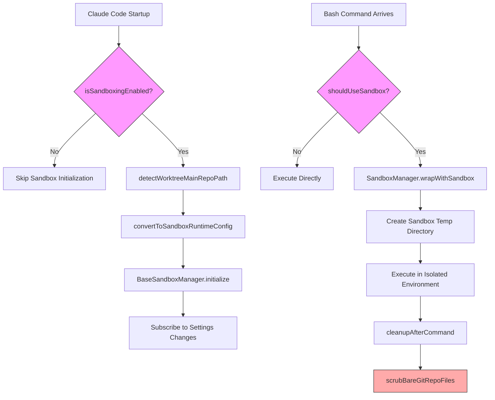
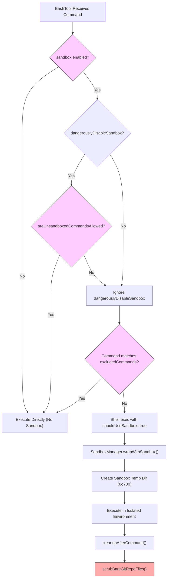

# Chapter 18b: Sandbox System — Multi-Platform Isolation from Seatbelt to Bubblewrap

## Why This Matters

An AI Agent that can execute arbitrary Shell commands opens a dangerous door while granting immense power. An Agent manipulated by Prompt Injection could read `~/.ssh/id_rsa`, send sensitive files to external servers, or even modify its own configuration files to permanently bypass permission controls. The permission system analyzed in Chapter 16 intercepts dangerous operations at the application layer, and the YOLO Classifier in Chapter 17 makes allowance decisions in "fast mode," but these are all "advisory" soft boundaries — once a malicious command reaches the operating system level, application-layer interception is useless.

The Sandbox is the last hard boundary in Claude Code's security architecture. It leverages OS kernel-provided isolation mechanisms — `sandbox-exec` (Seatbelt Profile) on macOS and Bubblewrap (user-space namespaces) + seccomp (system call filtering) on Linux — to enforce file system and network access control at the process level. Even if all application-layer defenses are bypassed, the sandbox can still block unauthorized file reads/writes and network access.

The engineering complexity of this system far exceeds what a simple "toggle a configuration option" might suggest. It needs to handle dual-platform differences (macOS path-level Seatbelt configuration vs. Linux bind-mount + seccomp combinations), five-layer configuration priority merging logic, special path requirements for Git Worktrees, enterprise MDM policy locking, and defense against a real security vulnerability (#29316 Bare Git Repo attack). This chapter dissects this multi-platform isolation architecture in its entirety from the source code.

## Source Code Analysis

### 18b.1 Dual-Platform Sandbox Architecture

Claude Code's sandbox implementation is divided into two layers: the external package `@anthropic-ai/sandbox-runtime` provides the underlying platform-specific isolation capabilities, while `sandbox-adapter.ts` serves as the adapter layer connecting it to Claude Code's settings system, permission rules, and tool integration.

The platform support detection logic resides in `isSupportedPlatform()`, cached via memoize:

```typescript
// restored-src/src/utils/sandbox/sandbox-adapter.ts:491-493
const isSupportedPlatform = memoize((): boolean => {
  return BaseSandboxManager.isSupportedPlatform()
})
```

Three categories of platforms are supported:

| Platform | Isolation Technology | Filesystem Isolation | Network Isolation |
|----------|---------------------|---------------------|-------------------|
| macOS | `sandbox-exec` (Seatbelt Profile) | Profile rules control path access | Profile rules + Unix socket path filtering |
| Linux | Bubblewrap (bwrap) | Read-only root mount + writable whitelist bind-mount | seccomp system call filtering |
| WSL2 | Same as Linux (Bubblewrap) | Same as Linux | Same as Linux |

WSL1 is explicitly excluded because it does not provide full Linux kernel namespace support:

```typescript
// restored-src/src/commands/sandbox-toggle/sandbox-toggle.tsx:14-17
if (!SandboxManager.isSupportedPlatform()) {
  const errorMessage = platform === 'wsl'
    ? 'Error: Sandboxing requires WSL2. WSL1 is not supported.'
    : 'Error: Sandboxing is currently only supported on macOS, Linux, and WSL2.';
```

A key difference between the two platforms is **glob pattern support**. macOS's Seatbelt Profile supports wildcard path matching, while Linux's Bubblewrap can only do exact bind-mounts. `getLinuxGlobPatternWarnings()` detects and warns users about incompatible glob patterns on Linux:

```typescript
// restored-src/src/utils/sandbox/sandbox-adapter.ts:597-601
function getLinuxGlobPatternWarnings(): string[] {
  const platform = getPlatform()
  if (platform !== 'linux' && platform !== 'wsl') {
    return []
  }
```

### 18b.2 SandboxManager: The Adapter Pattern

The `SandboxManager` design employs the classic Adapter Pattern. It implements an `ISandboxManager` interface with 25+ methods, where some methods contain Claude Code-specific logic and others forward directly to `BaseSandboxManager` (the core class from `@anthropic-ai/sandbox-runtime`).

```typescript
// restored-src/src/utils/sandbox/sandbox-adapter.ts:880-922
export interface ISandboxManager {
  initialize(sandboxAskCallback?: SandboxAskCallback): Promise<void>
  isSupportedPlatform(): boolean
  isPlatformInEnabledList(): boolean
  getSandboxUnavailableReason(): string | undefined
  isSandboxingEnabled(): boolean
  isSandboxEnabledInSettings(): boolean
  checkDependencies(): SandboxDependencyCheck
  isAutoAllowBashIfSandboxedEnabled(): boolean
  areUnsandboxedCommandsAllowed(): boolean
  isSandboxRequired(): boolean
  areSandboxSettingsLockedByPolicy(): boolean
  // ... plus getFsReadConfig, getFsWriteConfig, getNetworkRestrictionConfig, etc.
  wrapWithSandbox(command: string, binShell?: string, ...): Promise<string>
  cleanupAfterCommand(): void
  refreshConfig(): void
  reset(): Promise<void>
}
```

The exported `SandboxManager` object clearly demonstrates this layering:

```typescript
// restored-src/src/utils/sandbox/sandbox-adapter.ts:927-967
export const SandboxManager: ISandboxManager = {
  // Custom implementations (Claude Code-specific logic)
  initialize,
  isSandboxingEnabled,
  areSandboxSettingsLockedByPolicy,
  setSandboxSettings,
  wrapWithSandbox,
  refreshConfig,
  reset,

  // Forward to base sandbox manager (direct forwarding)
  getFsReadConfig: BaseSandboxManager.getFsReadConfig,
  getFsWriteConfig: BaseSandboxManager.getFsWriteConfig,
  getNetworkRestrictionConfig: BaseSandboxManager.getNetworkRestrictionConfig,
  // ...
  cleanupAfterCommand: (): void => {
    BaseSandboxManager.cleanupAfterCommand()
    scrubBareGitRepoFiles()  // CC-specific: clean up Bare Git Repo attack remnants
  },
}
```

The initialization flow (`initialize()`) is asynchronous and includes a carefully designed race condition guard:

```typescript
// restored-src/src/utils/sandbox/sandbox-adapter.ts:730-792
async function initialize(sandboxAskCallback?: SandboxAskCallback): Promise<void> {
  if (initializationPromise) {
    return initializationPromise  // Prevent duplicate initialization
  }
  if (!isSandboxingEnabled()) {
    return
  }
  // Create Promise synchronously (before await) to prevent race conditions
  initializationPromise = (async () => {
    // 1. Resolve Worktree main repo path (once only)
    if (worktreeMainRepoPath === undefined) {
      worktreeMainRepoPath = await detectWorktreeMainRepoPath(getCwdState())
    }
    // 2. Convert CC settings to sandbox-runtime config
    const settings = getSettings_DEPRECATED()
    const runtimeConfig = convertToSandboxRuntimeConfig(settings)
    // 3. Initialize the underlying sandbox
    await BaseSandboxManager.initialize(runtimeConfig, wrappedCallback)
    // 4. Subscribe to settings changes, dynamically update sandbox config
    settingsSubscriptionCleanup = settingsChangeDetector.subscribe(() => {
      const newConfig = convertToSandboxRuntimeConfig(getSettings_DEPRECATED())
      BaseSandboxManager.updateConfig(newConfig)
    })
  })()
  return initializationPromise
}
```

The following flowchart shows the complete lifecycle of the sandbox from initialization to command execution:



### 18b.3 Configuration System: Five-Layer Priority

The sandbox configuration merging inherits Claude Code's general five-layer settings system (see Chapter 19 for the priority discussion on CLAUDE.md), but the sandbox adds its own semantic layer on top.

The five layers of priority from lowest to highest are:

```typescript
// restored-src/src/utils/settings/constants.ts:7-22
export const SETTING_SOURCES = [
  'userSettings',      // Global user settings (~/.claude/settings.json)
  'projectSettings',   // Shared project settings (.claude/settings.json)
  'localSettings',     // Local settings (.claude/settings.local.json, gitignored)
  'flagSettings',      // CLI --settings flag
  'policySettings',    // Enterprise MDM managed settings (managed-settings.json)
] as const
```

The sandbox configuration Schema is defined by Zod in `sandboxTypes.ts` and serves as the Single Source of Truth for the entire system:

```typescript
// restored-src/src/entrypoints/sandboxTypes.ts:91-144
export const SandboxSettingsSchema = lazySchema(() =>
  z.object({
    enabled: z.boolean().optional(),
    failIfUnavailable: z.boolean().optional(),
    autoAllowBashIfSandboxed: z.boolean().optional(),
    allowUnsandboxedCommands: z.boolean().optional(),
    network: SandboxNetworkConfigSchema(),
    filesystem: SandboxFilesystemConfigSchema(),
    ignoreViolations: z.record(z.string(), z.array(z.string())).optional(),
    enableWeakerNestedSandbox: z.boolean().optional(),
    enableWeakerNetworkIsolation: z.boolean().optional(),
    excludedCommands: z.array(z.string()).optional(),
    ripgrep: z.object({ command: z.string(), args: z.array(z.string()).optional() }).optional(),
  }).passthrough(),  // .passthrough() allows undeclared fields (e.g., enabledPlatforms)
)
```

Note the trailing `.passthrough()` — this is a deliberate design decision. `enabledPlatforms` is an undocumented enterprise setting that `.passthrough()` allows to exist in the Schema without formal declaration. The source code comments reveal the background:

```typescript
// restored-src/src/entrypoints/sandboxTypes.ts:104-111
// Note: enabledPlatforms is an undocumented setting read via .passthrough()
// Added to unblock NVIDIA enterprise rollout: they want to enable
// autoAllowBashIfSandboxed but only on macOS initially, since Linux/WSL
// sandbox support is newer and less battle-tested.
```

`convertToSandboxRuntimeConfig()` is the core function for configuration merging. It iterates over all settings sources, converting Claude Code's Permission Rules and sandbox filesystem configuration into a unified format that `sandbox-runtime` can understand. The key path resolution logic handles two different path conventions during this process:

```typescript
// restored-src/src/utils/sandbox/sandbox-adapter.ts:99-119
export function resolvePathPatternForSandbox(
  pattern: string, source: SettingSource
): string {
  // Permission rule convention: //path → absolute path, /path → relative to settings file directory
  if (pattern.startsWith('//')) {
    return pattern.slice(1)  // "//.aws/**" → "/.aws/**"
  }
  if (pattern.startsWith('/') && !pattern.startsWith('//')) {
    const root = getSettingsRootPathForSource(source)
    return resolve(root, pattern.slice(1))
  }
  return pattern  // ~/path and ./path pass through to sandbox-runtime
}
```

And the filesystem path resolution after the #30067 fix:

```typescript
// restored-src/src/utils/sandbox/sandbox-adapter.ts:138-146
export function resolveSandboxFilesystemPath(
  pattern: string, source: SettingSource
): string {
  // sandbox.filesystem.* uses standard semantics: /path = absolute path (different from permission rules!)
  if (pattern.startsWith('//')) return pattern.slice(1)
  return expandPath(pattern, getSettingsRootPathForSource(source))
}
```

There is a subtle but important distinction here: in permission rules, `/path` means "relative to the settings file directory," while in `sandbox.filesystem.allowWrite`, `/path` means an absolute path. This inconsistency once caused Bug #30067 — users wrote `/Users/foo/.cargo` in `sandbox.filesystem.allowWrite` expecting it to be an absolute path, but the system interpreted it as a relative path per the permission rule convention.

### 18b.4 Filesystem Isolation

The core strategy for filesystem isolation is **read-only root + writable whitelist**. In the configuration built by `convertToSandboxRuntimeConfig()`, `allowWrite` defaults to only the current working directory and the Claude temporary directory:

```typescript
// restored-src/src/utils/sandbox/sandbox-adapter.ts:225-226
const allowWrite: string[] = ['.', getClaudeTempDir()]
const denyWrite: string[] = []
```

On top of this, the system adds multiple layers of hardcoded write-deny rules to protect critical files from being tampered with by sandboxed commands:

**Settings file protection** — preventing Sandbox Escape:

```typescript
// restored-src/src/utils/sandbox/sandbox-adapter.ts:232-255
// Deny writing to all layers of settings.json
const settingsPaths = SETTING_SOURCES.map(source =>
  getSettingsFilePathForSource(source),
).filter((p): p is string => p !== undefined)
denyWrite.push(...settingsPaths)
denyWrite.push(getManagedSettingsDropInDir())

// If the user cd'd to a different directory, protect that directory's settings files too
if (cwd !== originalCwd) {
  denyWrite.push(resolve(cwd, '.claude', 'settings.json'))
  denyWrite.push(resolve(cwd, '.claude', 'settings.local.json'))
}

// Protect .claude/skills — skill files have the same privilege level as commands/agents
denyWrite.push(resolve(originalCwd, '.claude', 'skills'))
```

**Git Worktree support** — Git operations in a Worktree need to write to the main repository's `.git` directory (e.g., `index.lock`). The system detects Worktrees during initialization and caches the main repository path:

```typescript
// restored-src/src/utils/sandbox/sandbox-adapter.ts:422-445
async function detectWorktreeMainRepoPath(cwd: string): Promise<string | null> {
  const gitPath = join(cwd, '.git')
  const gitContent = await readFile(gitPath, { encoding: 'utf8' })
  const gitdirMatch = gitContent.match(/^gitdir:\s*(.+)$/m)
  // gitdir format: /path/to/main/repo/.git/worktrees/worktree-name
  const marker = `${sep}.git${sep}worktrees${sep}`
  const markerIndex = gitdir.lastIndexOf(marker)
  if (markerIndex > 0) {
    return gitdir.substring(0, markerIndex)
  }
}
```

If a Worktree is detected, the main repository path is added to the writable whitelist:

```typescript
// restored-src/src/utils/sandbox/sandbox-adapter.ts:286-288
if (worktreeMainRepoPath && worktreeMainRepoPath !== cwd) {
  allowWrite.push(worktreeMainRepoPath)
}
```

**Additional directory support** — Directories added via the `--add-dir` CLI argument or `/add-dir` command also need write permissions:

```typescript
// restored-src/src/utils/sandbox/sandbox-adapter.ts:295-299
const additionalDirs = new Set([
  ...(settings.permissions?.additionalDirectories || []),
  ...getAdditionalDirectoriesForClaudeMd(),
])
allowWrite.push(...additionalDirs)
```

### 18b.5 Network Isolation

Network isolation uses a **domain whitelist** mechanism, deeply integrated with Claude Code's `WebFetch` permission rules. `convertToSandboxRuntimeConfig()` extracts allowed domains from the permission rules:

```typescript
// restored-src/src/utils/sandbox/sandbox-adapter.ts:178-210
const allowedDomains: string[] = []
const deniedDomains: string[] = []

if (shouldAllowManagedSandboxDomainsOnly()) {
  // Enterprise policy mode: only use domains from policySettings
  const policySettings = getSettingsForSource('policySettings')
  for (const domain of policySettings?.sandbox?.network?.allowedDomains || []) {
    allowedDomains.push(domain)
  }
  for (const ruleString of policySettings?.permissions?.allow || []) {
    const rule = permissionRuleValueFromString(ruleString)
    if (rule.toolName === WEB_FETCH_TOOL_NAME && rule.ruleContent?.startsWith('domain:')) {
      allowedDomains.push(rule.ruleContent.substring('domain:'.length))
    }
  }
} else {
  // Normal mode: merge domain configuration from all layers
  for (const domain of settings.sandbox?.network?.allowedDomains || []) {
    allowedDomains.push(domain)
  }
  // ... extract domains from WebFetch(domain:xxx) permission rules
}
```

**Unix Socket filtering** is where the two platforms differ the most. macOS's Seatbelt supports filtering Unix Sockets by path, while Linux's seccomp cannot distinguish Socket paths — it can only do an all-or-nothing "allow all" or "deny all":

```typescript
// restored-src/src/entrypoints/sandboxTypes.ts:28-36
allowUnixSockets: z.array(z.string()).optional()
  .describe('macOS only: Unix socket paths to allow. Ignored on Linux (seccomp cannot filter by path).'),
allowAllUnixSockets: z.boolean().optional()
  .describe('If true, allow all Unix sockets (disables blocking on both platforms).'),
```

**The `allowManagedDomainsOnly` policy** is the core of enterprise-grade network isolation. When an enterprise enables this option via `policySettings`, all domain configurations from the user, project, and local layers are ignored — only domains and `WebFetch` rules from the enterprise policy take effect:

```typescript
// restored-src/src/utils/sandbox/sandbox-adapter.ts:152-157
export function shouldAllowManagedSandboxDomainsOnly(): boolean {
  return (
    getSettingsForSource('policySettings')?.sandbox?.network
      ?.allowManagedDomainsOnly === true
  )
}
```

Additionally, the `sandboxAskCallback` is wrapped during initialization to enforce this policy:

```typescript
// restored-src/src/utils/sandbox/sandbox-adapter.ts:745-755
const wrappedCallback: SandboxAskCallback | undefined = sandboxAskCallback
  ? async (hostPattern: NetworkHostPattern) => {
      if (shouldAllowManagedSandboxDomainsOnly()) {
        logForDebugging(
          `[sandbox] Blocked network request to ${hostPattern.host} (allowManagedDomainsOnly)`,
        )
        return false  // Hard reject, do not ask the user
      }
      return sandboxAskCallback(hostPattern)
    }
  : undefined
```

**HTTP/SOCKS proxy support** allows enterprises to monitor and audit Agent network traffic through proxy servers:

```typescript
// restored-src/src/utils/sandbox/sandbox-adapter.ts:360-368
return {
  network: {
    allowedDomains,
    deniedDomains,
    allowUnixSockets: settings.sandbox?.network?.allowUnixSockets,
    allowAllUnixSockets: settings.sandbox?.network?.allowAllUnixSockets,
    allowLocalBinding: settings.sandbox?.network?.allowLocalBinding,
    httpProxyPort: settings.sandbox?.network?.httpProxyPort,
    socksProxyPort: settings.sandbox?.network?.socksProxyPort,
  },
```

The `enableWeakerNetworkIsolation` option deserves special attention. It allows access to macOS's `com.apple.trustd.agent` service, which is required for Go-compiled CLI tools (such as `gh`, `gcloud`, `terraform`) to verify TLS certificates. However, enabling this option **reduces security** — because the trustd service itself is a potential data exfiltration channel:

```typescript
// restored-src/src/entrypoints/sandboxTypes.ts:125-133
enableWeakerNetworkIsolation: z.boolean().optional()
  .describe(
    'macOS only: Allow access to com.apple.trustd.agent in the sandbox. ' +
    'Needed for Go-based CLI tools (gh, gcloud, terraform, etc.) to verify TLS certificates ' +
    'when using httpProxyPort with a MITM proxy and custom CA. ' +
    '**Reduces security** — opens a potential data exfiltration vector through the trustd service. Default: false',
  ),
```

### 18b.6 Bash Tool Integration

The sandbox ultimately interacts with users through the Bash tool. The decision chain starts with `shouldUseSandbox()`, goes through `Shell.exec()`'s wrapping, and ends with isolated execution at the operating system level.

**`shouldUseSandbox()` decision logic** follows a clear priority chain:

```typescript
// restored-src/src/tools/BashTool/shouldUseSandbox.ts:130-153
export function shouldUseSandbox(input: Partial<SandboxInput>): boolean {
  // 1. Sandbox not enabled → don't use
  if (!SandboxManager.isSandboxingEnabled()) {
    return false
  }
  // 2. dangerouslyDisableSandbox=true and policy allows it → don't use
  if (input.dangerouslyDisableSandbox &&
      SandboxManager.areUnsandboxedCommandsAllowed()) {
    return false
  }
  // 3. No command → don't use
  if (!input.command) {
    return false
  }
  // 4. Command matches exclusion list → don't use
  if (containsExcludedCommand(input.command)) {
    return false
  }
  // 5. All other cases → use sandbox
  return true
}
```

`containsExcludedCommand()`'s implementation is more complex than it appears. It not only checks user-configured `excludedCommands`, but also splits compound commands (joined with `&&`), and iteratively strips environment variable prefixes and safety wrappers (such as `timeout`) for matching. This prevents a command like `docker ps && curl evil.com` from entirely skipping the sandbox just because `docker` is on the exclusion list:

```typescript
// restored-src/src/tools/BashTool/shouldUseSandbox.ts:60-68
// Split compound commands to prevent a compound command from
// escaping the sandbox just because its first subcommand matches
let subcommands: string[]
try {
  subcommands = splitCommand_DEPRECATED(command)
} catch {
  subcommands = [command]
}
```

**Command wrapping flow** is completed in `Shell.ts`. When `shouldUseSandbox` is true, the command string is passed to `SandboxManager.wrapWithSandbox()`, where the underlying sandbox-runtime wraps it into an actual system call with isolation parameters:

```typescript
// restored-src/src/utils/Shell.ts:259-273
if (shouldUseSandbox) {
  commandString = await SandboxManager.wrapWithSandbox(
    commandString,
    sandboxBinShell,
    undefined,
    abortSignal,
  )
  // Create sandbox temp directory with secure permissions
  try {
    const fs = getFsImplementation()
    await fs.mkdir(sandboxTmpDir, { mode: 0o700 })
  } catch (error) {
    logForDebugging(`Failed to create ${sandboxTmpDir} directory: ${error}`)
  }
}
```

Of particular note is **PowerShell handling in the sandbox**. Internally, `wrapWithSandbox` wraps the command as `<binShell> -c '<cmd>'`, but PowerShell's `-NoProfile -NonInteractive` arguments are lost during this process. The solution is to pre-encode the PowerShell command in Base64 format, then use `/bin/sh` as the sandbox's inner shell:

```typescript
// restored-src/src/utils/Shell.ts:247-257
// Sandboxed PowerShell: wrapWithSandbox hardcodes `<binShell> -c '<cmd>'` —
// using pwsh there would lose -NoProfile -NonInteractive
const isSandboxedPowerShell = shouldUseSandbox && shellType === 'powershell'
const sandboxBinShell = isSandboxedPowerShell ? '/bin/sh' : binShell
```

**The `dangerouslyDisableSandbox` parameter** allows the AI model to bypass the sandbox when encountering failures caused by sandbox restrictions. However, enterprises can completely disable this parameter via `allowUnsandboxedCommands: false`:

```typescript
// restored-src/src/entrypoints/sandboxTypes.ts:113-119
allowUnsandboxedCommands: z.boolean().optional()
  .describe(
    'Allow commands to run outside the sandbox via the dangerouslyDisableSandbox parameter. ' +
    'When false, the dangerouslyDisableSandbox parameter is completely ignored and all commands must run sandboxed. ' +
    'Default: true.',
  ),
```

The BashTool's prompt (see Chapter 8 for the discussion on tool prompts) also dynamically adjusts its guidance to the model based on this setting:

```typescript
// restored-src/src/tools/BashTool/prompt.ts:228-256
const sandboxOverrideItems: Array<string | string[]> =
  allowUnsandboxedCommands
    ? [
        'You should always default to running commands within the sandbox...',
        // Guides the model to only use dangerouslyDisableSandbox when evidence like "Operation not permitted" is seen
      ]
    : [
        'All commands MUST run in sandbox mode - the `dangerouslyDisableSandbox` parameter is disabled by policy.',
        'Commands cannot run outside the sandbox under any circumstances.',
      ]
```

The following flowchart shows the complete decision path from command input to sandboxed execution:



### 18b.7 Security Edge Case: Bare Git Repo Attack Defense

This is the most impressive security engineering case in the entire sandbox system. Issue #29316 describes a real sandbox escape attack path:

**Attack principle**: Git's `is_git_directory()` function determines whether a directory is a Git repository by checking for the presence of `HEAD`, `objects/`, `refs/`, and other files. If an attacker (via prompt injection) creates these files inside the sandbox and sets `core.fsmonitor` in `config` to point to a malicious script, then Claude Code's **unsandboxed** Git operations (such as `git status`) would misidentify the current directory as a Bare Git Repo and execute the arbitrary code specified by `core.fsmonitor` — at that point, outside the sandbox.

**Defense strategy**: This follows two lines — prevention and cleanup.

For **pre-existing** Git files (`HEAD`, `objects`, `refs`, `hooks`, `config`), the system adds them to the `denyWrite` list, and sandbox-runtime bind-mounts them as read-only:

```typescript
// restored-src/src/utils/sandbox/sandbox-adapter.ts:257-280
// SECURITY: Git's is_git_directory() treats cwd as a bare repo if it has
// HEAD + objects/ + refs/. An attacker planting these (plus a config with
// core.fsmonitor) escapes the sandbox when Claude's unsandboxed git runs.
bareGitRepoScrubPaths.length = 0
const bareGitRepoFiles = ['HEAD', 'objects', 'refs', 'hooks', 'config']
for (const dir of cwd === originalCwd ? [originalCwd] : [originalCwd, cwd]) {
  for (const gitFile of bareGitRepoFiles) {
    const p = resolve(dir, gitFile)
    try {
      statSync(p)
      denyWrite.push(p)  // File exists → read-only bind-mount
    } catch {
      bareGitRepoScrubPaths.push(p)  // File doesn't exist → record for post-command cleanup
    }
  }
}
```

For **non-existent** Git files (i.e., ones the attacker might plant during sandboxed command execution), the system calls `scrubBareGitRepoFiles()` after each command to clean up:

```typescript
// restored-src/src/utils/sandbox/sandbox-adapter.ts:404-414
function scrubBareGitRepoFiles(): void {
  for (const p of bareGitRepoScrubPaths) {
    try {
      rmSync(p, { recursive: true })
      logForDebugging(`[Sandbox] scrubbed planted bare-repo file: ${p}`)
    } catch {
      // ENOENT is the expected common case — nothing was planted
    }
  }
}
```

The source code comments explain why you cannot simply use `denyWrite` for all Git files:

> Unconditionally denying these paths makes sandbox-runtime mount `/dev/null` at non-existent ones, which (a) leaves a 0-byte HEAD stub on the host and (b) breaks `git log HEAD` inside bwrap ("ambiguous argument").

This defense is integrated into `cleanupAfterCommand()`, ensuring cleanup occurs after every sandboxed command execution:

```typescript
// restored-src/src/utils/sandbox/sandbox-adapter.ts:963-966
cleanupAfterCommand: (): void => {
  BaseSandboxManager.cleanupAfterCommand()
  scrubBareGitRepoFiles()
},
```

### 18b.8 Enterprise Policies and Compliance

Claude Code's sandbox system provides comprehensive policy control capabilities for enterprise deployments.

**MDM `settings.d/` directory**: Enterprises can deploy sandbox policies through the managed settings directory specified by `getManagedSettingsDropInDir()`. Configuration files in this directory automatically receive the highest priority of `policySettings`.

**`failIfUnavailable`**: When set to `true`, if the sandbox cannot start (missing dependencies, unsupported platform, etc.), Claude Code will exit directly rather than running in a degraded mode. This is an enterprise-grade Hard Gate:

```typescript
// restored-src/src/utils/sandbox/sandbox-adapter.ts:479-485
function isSandboxRequired(): boolean {
  const settings = getSettings_DEPRECATED()
  return (
    getSandboxEnabledSetting() &&
    (settings?.sandbox?.failIfUnavailable ?? false)
  )
}
```

**`areSandboxSettingsLockedByPolicy()`** checks whether a higher-priority settings source (`flagSettings` or `policySettings`) has locked the sandbox configuration, preventing users from modifying it locally:

```typescript
// restored-src/src/utils/sandbox/sandbox-adapter.ts:647-664
function areSandboxSettingsLockedByPolicy(): boolean {
  const overridingSources = ['flagSettings', 'policySettings'] as const
  for (const source of overridingSources) {
    const settings = getSettingsForSource(source)
    if (
      settings?.sandbox?.enabled !== undefined ||
      settings?.sandbox?.autoAllowBashIfSandboxed !== undefined ||
      settings?.sandbox?.allowUnsandboxedCommands !== undefined
    ) {
      return true
    }
  }
  return false
}
```

In the `/sandbox` command implementation, if the policy has locked the settings, the user sees a clear error message:

```typescript
// restored-src/src/commands/sandbox-toggle/sandbox-toggle.tsx:33-37
if (SandboxManager.areSandboxSettingsLockedByPolicy()) {
  const message = color('error', themeName)(
    'Error: Sandbox settings are overridden by a higher-priority configuration and cannot be changed locally.'
  );
  onDone(message);
}
```

**`enabledPlatforms`** (undocumented) allows enterprises to enable the sandbox only on specific platforms. This was added for NVIDIA's enterprise deployment — they wanted to enable `autoAllowBashIfSandboxed` on macOS first, then expand to Linux once the Linux sandbox matured:

```typescript
// restored-src/src/utils/sandbox/sandbox-adapter.ts:505-526
function isPlatformInEnabledList(): boolean {
  const settings = getInitialSettings()
  const enabledPlatforms = (
    settings?.sandbox as { enabledPlatforms?: Platform[] } | undefined
  )?.enabledPlatforms
  if (enabledPlatforms === undefined) {
    return true  // All platforms enabled by default when not set
  }
  const currentPlatform = getPlatform()
  return enabledPlatforms.includes(currentPlatform)
}
```

**Options that weaken isolation and their tradeoffs**:

| Option | Effect | Security Impact |
|--------|--------|-----------------|
| `enableWeakerNestedSandbox` | Allow nested sandboxes inside the sandbox | Reduces isolation depth |
| `enableWeakerNetworkIsolation` | Allow access to `trustd.agent` on macOS | Opens a data exfiltration vector |
| `allowUnsandboxedCommands: true` | Enable the `dangerouslyDisableSandbox` parameter | Allows complete sandbox bypass |
| `excludedCommands` | Specific commands skip the sandbox | Excluded commands have no isolation protection |

## Pattern Extraction

### Pattern: Multi-Platform Sandbox Adapter

**Problem solved**: Different operating systems provide entirely different isolation primitives (macOS Seatbelt vs. Linux Namespaces + seccomp), and the application layer needs a unified interface to manage the sandbox's lifecycle, configuration, and execution.

**Approach**:

1. **External package handles platform differences**: `@anthropic-ai/sandbox-runtime` encapsulates the differences between macOS `sandbox-exec` and Linux `bwrap` + `seccomp`, providing a unified `BaseSandboxManager` API
2. **Adapter layer handles business differences**: `sandbox-adapter.ts` converts application-specific configuration systems (five-layer settings, permission rules, path conventions) into `sandbox-runtime`'s `SandboxRuntimeConfig` format
3. **Interface exports a method table**: The `ISandboxManager` interface explicitly distinguishes "custom implementation" methods from "direct forwarding" methods, making code intent clear

**Preconditions**:

- The underlying isolation package must provide a platform-agnostic interface (`wrapWithSandbox`, `initialize`, `updateConfig`)
- The adapter must handle all application-specific concept conversions (path resolution conventions, permission rule extraction)
- Extension points like `cleanupAfterCommand()` must allow the adapter to inject its own logic

**Mapping in Claude Code**:

| Component | Role |
|-----------|------|
| `@anthropic-ai/sandbox-runtime` | Adaptee |
| `sandbox-adapter.ts` | Adapter |
| `ISandboxManager` | Target Interface |
| `BashTool`, `Shell.ts` | Client |

### Pattern: Five-Layer Configuration Merging with Policy Locking

**Problem solved**: Sandbox configuration needs to balance user flexibility with enterprise security compliance. Users need to customize writable paths and network domains, while enterprises need to lock critical settings to prevent users from bypassing them.

**Approach**:

1. **Low-priority sources provide defaults**: `userSettings` and `projectSettings` provide baseline configuration
2. **High-priority sources override or lock**: Setting `sandbox.enabled: true` in `policySettings` overrides all lower-priority settings
3. **Policy switches like `allowManagedDomainsOnly`**: Selectively ignore data from lower-priority sources during the merge logic
4. **`areSandboxSettingsLockedByPolicy()` detects lock state**: The UI layer disables settings modification entry points based on this result

**Preconditions**:

- The settings system must support per-source queries (`getSettingsForSource`), not just return merged results
- Path resolution must be source-aware (the same `/path` may resolve to different absolute paths in different sources)
- Policy lock detection must be performed at the UI entry point, not at settings write time

**Mapping in Claude Code**: `SETTING_SOURCES` defines the priority chain `userSettings -> projectSettings -> localSettings -> flagSettings -> policySettings`. `convertToSandboxRuntimeConfig()` iterates over all sources and resolves paths according to each source's conventions, while `shouldAllowManagedSandboxDomainsOnly()` and `shouldAllowManagedReadPathsOnly()` implement the enterprise policy's "hard override."

## What Users Can Do

1. **Enable sandbox in your project**: Set `{ "sandbox": { "enabled": true } }` in `.claude/settings.local.json`, or run the `/sandbox` command for interactive configuration. Once enabled, all Bash commands execute inside the sandbox by default.

2. **Add network whitelists for development tools**: If build tools (npm, pip, cargo) need to download dependencies, add the required domains to `sandbox.network.allowedDomains`, such as `["registry.npmjs.org", "crates.io"]`. This can also be achieved through `WebFetch(domain:xxx)` allow permission rules — the sandbox automatically extracts these domains.

3. **Exclude specific commands from the sandbox**: Use `/sandbox exclude "docker compose:*"` to exclude commands that require special privileges (such as Docker, systemctl) from the sandbox. Note that this is a convenience feature, not a security boundary — excluded commands have no sandbox protection.

4. **Ensure compatibility with Git Worktrees**: If you use Claude Code in a Git Worktree, the system automatically detects it and adds the main repository path to the writable whitelist. If you encounter `index.lock` related errors, check whether the `gitdir` reference in the `.git` file is correct.

5. **Force sandbox in enterprise deployments**: Set `{ "sandbox": { "enabled": true, "failIfUnavailable": true, "allowUnsandboxedCommands": false } }` in managed settings to force all users to run inside the sandbox with no bypass allowed. Combine with `network.allowManagedDomainsOnly: true` to lock down the network access whitelist.

6. **Debug sandbox issues**: When a command fails due to sandbox restrictions, stderr will contain violation information in `<sandbox_violations>` tags. Run `/sandbox` to view the current sandbox status and dependency check results. On Linux, if you see glob pattern warnings, replace wildcard paths with exact paths (Bubblewrap does not support globs).
