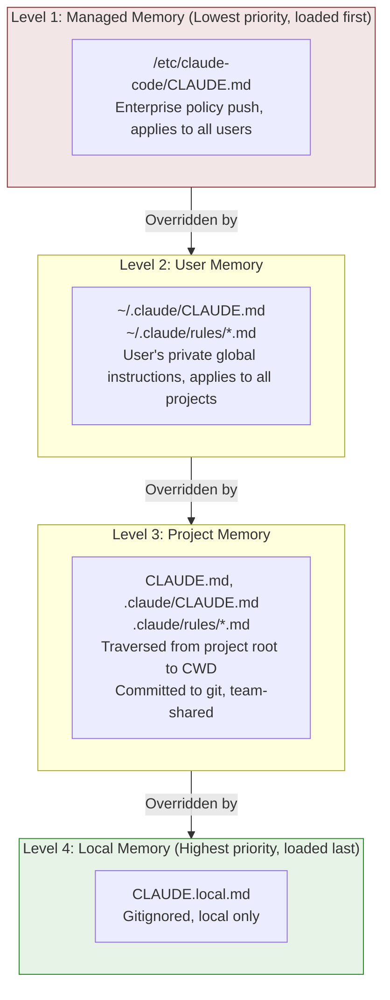

# Chapter 19: CLAUDE.md — User Instructions as an Override Layer

<p align="right">
  <a href="../../part5/ch19.html">Read the Chinese original</a>
</p>

## Why This Matters

If the Hooks system (Chapter 18) is the channel through which users extend Agent behavior via **code execution**, then CLAUDE.md is the channel for controlling model output via **natural language instructions**. This is not a simple "configuration file" — it's a complete instruction injection system with four-level priority cascading, transitive file inclusion, path-scoped rules, HTML comment stripping, and explicit override semantics declaration.

CLAUDE.md's design philosophy can be summed up in one sentence: **User instructions override the model's default behavior.** This isn't rhetoric — it's literally injected into the system prompt:

```typescript
// claudemd.ts:89-91
const MEMORY_INSTRUCTION_PROMPT =
  'Codebase and user instructions are shown below. Be sure to adhere to these instructions. ' +
  'IMPORTANT: These instructions OVERRIDE any default behavior and you MUST follow them exactly as written.'
```

This chapter will dissect the complete chain from file discovery, content processing, to final injection into the prompt, examining the source code implementation of this system.

---

## 19.1 Four-Level Loading Priority

The CLAUDE.md system uses a four-level priority model, explicitly defined in the comments at the top of the `claudemd.ts` file (lines 1-26). Files are loaded in **reverse priority order** — the last loaded has the highest priority, because the model has higher "attention" to content at the end of the conversation:



### Loading Implementation

The `getMemoryFiles` function (lines 790-1075) implements the complete loading logic. It's an async function wrapped with `memoize` — results are cached after the first call within the same process lifetime:

**Step One: Managed Memory (lines 803-823)**

```typescript
// claudemd.ts:804-822
const managedClaudeMd = getMemoryPath('Managed')
result.push(
  ...(await processMemoryFile(managedClaudeMd, 'Managed', processedPaths, includeExternal)),
)
const managedClaudeRulesDir = getManagedClaudeRulesDir()
result.push(
  ...(await processMdRules({
    rulesDir: managedClaudeRulesDir,
    type: 'Managed',
    processedPaths,
    includeExternal,
    conditionalRule: false,
  })),
)
```

The Managed Memory path is typically `/etc/claude-code/CLAUDE.md` — the standard location for enterprise IT departments to push policies via MDM (Mobile Device Management).

**Step Two: User Memory (lines 826-847)**

Only loaded when the `userSettings` configuration source is enabled. User Memory has a privilege: `includeExternal` is always `true` (line 833), meaning `@include` directives in user-level CLAUDE.md can reference files outside the project directory.

**Step Three: Project Memory (lines 849-920)**

This is the most complex step. The code traverses from CWD upward to the filesystem root, collecting `CLAUDE.md`, `.claude/CLAUDE.md`, and `.claude/rules/*.md` at every level along the way:

```typescript
// claudemd.ts:851-857
const dirs: string[] = []
const originalCwd = getOriginalCwd()
let currentDir = originalCwd
while (currentDir !== parse(currentDir).root) {
  dirs.push(currentDir)
  currentDir = dirname(currentDir)
}
```

Then processes from root direction toward CWD (the `dirs.reverse()` at line 878), ensuring files closer to CWD are loaded later and have higher priority.

An interesting edge case handling: git worktrees (lines 859-884). When running from within a worktree (e.g., `.claude/worktrees/<name>/`), upward traversal passes through both the worktree root directory and the main repository root directory. Both contain `CLAUDE.md`, leading to duplicate loading. The code detects `isNestedWorktree` to skip Project-type files in the main repository directory — but `CLAUDE.local.md` is still loaded because it's gitignored and only exists in the main repository.

**Step Four: Local Memory (interspersed within Project traversal)**

At each directory level, `CLAUDE.local.md` is loaded after Project files (lines 922-933), but only if the `localSettings` configuration source is enabled.

**Additional directory (`--add-dir`) support (lines 936-977):**

Enabled via the `CLAUDE_CODE_ADDITIONAL_DIRECTORIES_CLAUDE_MD` environment variable, CLAUDE.md files from directories specified by `--add-dir` arguments are also loaded. These files are marked as `Project` type, with loading logic identical to standard Project Memory (CLAUDE.md, .claude/CLAUDE.md, .claude/rules/*.md). Notably, `isSettingSourceEnabled('projectSettings')` is not checked here — because `--add-dir` is an explicit user action, and the SDK's default empty `settingSources` shouldn't block it.

**AutoMem and TeamMem (lines 979-1007):**

After the four standard Memory levels, two special types are also loaded — auto-memory (`MEMORY.md`) and team memory. These types have their own feature flag controls and independent truncation strategies (handled by `truncateEntrypointContent` for line count and byte count limits).

### Controllable Configuration Source Switches

Each level (except Managed) is controlled by `isSettingSourceEnabled()`:

- `userSettings`: Controls User Memory
- `projectSettings`: Controls Project Memory (CLAUDE.md and rules)
- `localSettings`: Controls Local Memory

In SDK mode, `settingSources` defaults to an empty array, meaning only Managed Memory takes effect unless explicitly enabled — this embodies the principle of least privilege for SDK consumers.

---

## 19.2 @include Directive

CLAUDE.md supports the `@include` syntax for referencing other files, enabling modular instruction organization.

### Syntax Format

`@include` uses a concise `@`-prefix-plus-path syntax (comment at lines 19-24):

| Syntax | Meaning |
|--------|---------|
| `@path` or `@./path` | Relative to the current file's directory |
| `@~/path` | Relative to the user's home directory |
| `@/absolute/path` | Absolute path |
| `@path#section` | With fragment identifier (`#` and after are ignored) |
| `@path\ with\ spaces` | Backslash-escaped spaces |

### Path Extraction

Path extraction is implemented by the `extractIncludePathsFromTokens` function (lines 451-535). It receives a token stream pre-processed by the marked lexer, not raw text — ensuring the following rules:

1. **`@` in code blocks is ignored**: `code` and `codespan` type tokens are skipped (lines 496-498)
2. **`@` in HTML comments is ignored**: The comment portion of `html` type tokens is skipped, but `@` in residual text after comments is still processed (lines 502-514)
3. **Only text nodes are processed**: Recurses into `tokens` and `items` substructures (lines 522-529)

The path extraction regex (line 459):

```typescript
// claudemd.ts:459
const includeRegex = /(?:^|\s)@((?:[^\s\\]|\\ )+)/g
```

This regex matches a non-whitespace character sequence after `@`, while supporting `\ ` escaped spaces.

### Transitive Inclusion and Circular Reference Protection

The `processMemoryFile` function (lines 618-685) recursively processes `@include`. Two key safety mechanisms:

**Circular reference protection**: Tracks already-processed file paths via a `processedPaths` Set (lines 629-630). Paths are normalized before comparison via `normalizePathForComparison`, handling Windows drive letter case differences (`C:\Users` vs `c:\Users`):

```typescript
// claudemd.ts:629-630
const normalizedPath = normalizePathForComparison(filePath)
if (processedPaths.has(normalizedPath) || depth >= MAX_INCLUDE_DEPTH) {
  return []
}
```

**Maximum depth limit**: `MAX_INCLUDE_DEPTH = 5` (line 537), preventing excessively deep nesting.

**External file security**: When `@include` points to a file outside the project directory, it's not loaded by default (lines 667-669). Only User Memory level files or explicit user approval of `hasClaudeMdExternalIncludesApproved` allows external inclusion. If unapproved external includes are detected, the system displays a warning (`shouldShowClaudeMdExternalIncludesWarning`, lines 1420-1430).

### Symlink Handling

Every file is resolved through `safeResolvePath` to handle symlinks before processing (lines 640-643). If a file is a symlink, the resolved real path is also added to `processedPaths` — preventing circular reference detection bypass via symlinks.

---

## 19.3 frontmatter paths: Scope Limiting

`.md` files in the `.claude/rules/` directory can limit their applicability through the YAML frontmatter `paths` field — rules are only injected into context when the file path Claude is operating on matches these glob patterns.

### frontmatter Parsing

The `parseFrontmatterPaths` function (lines 254-279) handles the `paths` field in frontmatter:

```typescript
// claudemd.ts:254-279
function parseFrontmatterPaths(rawContent: string): {
  content: string
  paths?: string[]
} {
  const { frontmatter, content } = parseFrontmatter(rawContent)
  if (!frontmatter.paths) {
    return { content }
  }
  const patterns = splitPathInFrontmatter(frontmatter.paths)
    .map(pattern => {
      return pattern.endsWith('/**') ? pattern.slice(0, -3) : pattern
    })
    .filter((p: string) => p.length > 0)
  if (patterns.length === 0 || patterns.every((p: string) => p === '**')) {
    return { content }
  }
  return { content, paths: patterns }
}
```

Note the `/**` suffix handling — the `ignore` library treats `path` as matching both the path itself and all contents within, so `/**` is redundant and is automatically removed. If all patterns are `**` (matching everything), it's treated as having no glob constraint.

### Path Syntax

The `splitPathInFrontmatter` function (`frontmatterParser.ts:189-232`) supports complex path syntax:

```yaml
---
paths: src/**/*.ts, tests/**/*.test.ts
---
```

Or YAML list format:

```yaml
---
paths:
  - src/**/*.ts
  - tests/**/*.test.ts
---
```

Brace expansion is also supported — `src/*.{ts,tsx}` expands to `["src/*.ts", "src/*.tsx"]` (the `expandBraces` function at `frontmatterParser.ts:240-266`). This expander recursively handles multi-level braces: `{a,b}/{c,d}` produces `["a/c", "a/d", "b/c", "b/d"]`.

### YAML Parsing Fault Tolerance

The frontmatter YAML parsing (`frontmatterParser.ts:130-175`) has two levels of fault tolerance:

1. **First attempt**: Parse the raw frontmatter text directly
2. **Retry on failure**: Automatically quote values containing YAML special characters via `quoteProblematicValues`

This retry mechanism solves a common problem: glob patterns like `**/*.{ts,tsx}` contain YAML's flow mapping indicator `{}`, causing direct parsing to fail. `quoteProblematicValues` (lines 85-121) detects special characters (`{}[]*, &#!|>%@``) in simple `key: value` lines and automatically wraps them with double quotes. Already-quoted values are skipped.

This means users can directly write `paths: src/**/*.{ts,tsx}` without manually adding quotes — the parser will automatically add quotes and retry after the first YAML parsing failure.

### Conditional Rule Matching

Conditional rule matching is executed by the `processConditionedMdRules` function (lines 1354-1397). It loads rule files and then uses the `ignore()` library (gitignore-compatible glob matching) to filter target file paths:

```typescript
// claudemd.ts:1370-1396
return conditionedRuleMdFiles.filter(file => {
  if (!file.globs || file.globs.length === 0) {
    return false
  }
  const baseDir =
    type === 'Project'
      ? dirname(dirname(rulesDir))  // Parent of .claude directory
      : getOriginalCwd()            // managed/user rules use project root
  const relativePath = isAbsolute(targetPath)
    ? relative(baseDir, targetPath)
    : targetPath
  if (!relativePath || relativePath.startsWith('..') || isAbsolute(relativePath)) {
    return false
  }
  return ignore().add(file.globs).ignores(relativePath)
})
```

Key design details:

- **Project rules**' glob base directory is the directory containing the `.claude` directory
- **Managed/User rules**' glob base directory is `getOriginalCwd()` — i.e., the project root
- Paths outside the base directory (`..` prefix) are excluded — they cannot match base-directory-relative globs
- On Windows, `relative()` across drive letters returns an absolute path, which is also excluded

### Unconditional Rules vs. Conditional Rules

The `processMdRules` function's (lines 697-788) `conditionalRule` parameter controls which type of rules are loaded:

- `conditionalRule: false`: Loads files **without** `paths` frontmatter — these are unconditional rules, always injected into context
- `conditionalRule: true`: Loads files **with** `paths` frontmatter — these are conditional rules, only injected when matched

At session startup, unconditional rules along the CWD-to-root path and managed/user-level unconditional rules are all pre-loaded. Conditional rules are only loaded on-demand when Claude operates on specific files.

---

## 19.4 HTML Comment Stripping

HTML comments in CLAUDE.md are stripped before injection into context. This allows maintainers to leave comments in instruction files that they don't want Claude to see.

The `stripHtmlComments` function (lines 292-301) uses the marked lexer to identify block-level HTML comments:

```typescript
// claudemd.ts:292-301
export function stripHtmlComments(content: string): {
  content: string
  stripped: boolean
} {
  if (!content.includes('<!--')) {
    return { content, stripped: false }
  }
  return stripHtmlCommentsFromTokens(new Lexer({ gfm: false }).lex(content))
}
```

The `stripHtmlCommentsFromTokens` function's (lines 303-334) processing logic is precise and cautious:

1. Only processes `html` type tokens that start with `<!--` and contain `-->`
2. **Unclosed comments** (`<!--` without a corresponding `-->`) are preserved — this prevents a single typo from silently swallowing the rest of the file's content
3. **Residual content** after comments is preserved — e.g., `<!-- note --> Use bun` preserves ` Use bun`
4. `<!-- -->` within inline code and code blocks is unaffected — the lexer has already marked them as `code`/`codespan` types

An implementation detail worth noting: the `gfm: false` option (line 300). This is because `~` in `@include` paths would be parsed as strikethrough markup by marked in GFM mode — disabling GFM avoids this conflict. HTML block detection is a CommonMark rule, unaffected by GFM settings.

### Avoiding Spurious contentDiffersFromDisk

The `parseMemoryFileContent` function (lines 343-399) contains an elegant optimization: content is only reconstructed through tokens when the file actually contains `<!--` (lines 370-374). This isn't just a performance consideration — marked normalizes `\r\n` to `\n` during lexing, and if an unnecessary token round-trip is performed on a CRLF file, it would spuriously trigger the `contentDiffersFromDisk` flag, causing the cache system to think the file was modified.

---

## 19.5 Prompt Injection

### Final Injection Format

The `getClaudeMds` function (lines 1153-1195) assembles all loaded memory files into the final system prompt string:

```typescript
// claudemd.ts:1153-1195
export const getClaudeMds = (
  memoryFiles: MemoryFileInfo[],
  filter?: (type: MemoryType) => boolean,
): string => {
  const memories: string[] = []
  for (const file of memoryFiles) {
    if (filter && !filter(file.type)) continue
    if (file.content) {
      const description =
        file.type === 'Project'
          ? ' (project instructions, checked into the codebase)'
          : file.type === 'Local'
            ? " (user's private project instructions, not checked in)"
            : " (user's private global instructions for all projects)"
      memories.push(`Contents of ${file.path}${description}:\n\n${content}`)
    }
  }
  if (memories.length === 0) {
    return ''
  }
  return `${MEMORY_INSTRUCTION_PROMPT}\n\n${memories.join('\n\n')}`
}
```

Each file's injection format is:

```
Contents of /path/to/CLAUDE.md (type description):

[file content]
```

All files are prefixed with a unified instruction header (`MEMORY_INSTRUCTION_PROMPT`), explicitly telling the model:

> "Codebase and user instructions are shown below. Be sure to adhere to these instructions. IMPORTANT: These instructions OVERRIDE any default behavior and you MUST follow them exactly as written."

This "override" declaration isn't decorative — it leverages Claude model's high compliance with explicit instructions in system prompts. By explicitly declaring "these instructions override default behavior" in the prompt, CLAUDE.md content gains influence equal to (or even greater than) the built-in system prompt.

### The Role of Type Descriptions

Each file's type description isn't just for human reading — it helps the model understand the source and authority of instructions:

| Type | Description | Semantic Implication |
|------|-------------|---------------------|
| Project | `project instructions, checked into the codebase` | Team consensus, should be strictly followed |
| Local | `user's private project instructions, not checked in` | Personal preference, moderate flexibility |
| User | `user's private global instructions for all projects` | User habits, cross-project consistency |
| AutoMem | `user's auto-memory, persists across conversations` | Learned knowledge, for reference |
| TeamMem | `shared team memory, synced across the organization` | Organizational knowledge, wrapped in `<team-memory-content>` tags |

---

## 19.6 Size Budget

### 40K Character Limit

The recommended maximum size for a single memory file is 40,000 characters (line 93):

```typescript
// claudemd.ts:93
export const MAX_MEMORY_CHARACTER_COUNT = 40000
```

The `getLargeMemoryFiles` function (lines 1132-1134) is used to detect files exceeding this limit:

```typescript
// claudemd.ts:1132-1134
export function getLargeMemoryFiles(files: MemoryFileInfo[]): MemoryFileInfo[] {
  return files.filter(f => f.content.length > MAX_MEMORY_CHARACTER_COUNT)
}
```

This limit is not a hard block — it's a warning threshold. The system prompts users when oversized files are detected but doesn't prevent loading. The actual upper bound is constrained by the entire system prompt's token budget (see Chapter 12); oversized CLAUDE.md files squeeze out other context space.

### AutoMem and TeamMem Truncation

For auto-memory and team memory types, there is stricter truncation logic (lines 382-385):

```typescript
// claudemd.ts:382-385
let finalContent = strippedContent
if (type === 'AutoMem' || type === 'TeamMem') {
  finalContent = truncateEntrypointContent(strippedContent).content
}
```

`truncateEntrypointContent` comes from `memdir/memdir.ts` and enforces both line count and byte count limits — auto-memory may grow over time with usage and requires more aggressive truncation strategies.

---

## 19.7 File Change Tracking

### contentDiffersFromDisk Flag

The `MemoryFileInfo` type (lines 229-243) includes two cache-related fields:

```typescript
// claudemd.ts:229-243
export type MemoryFileInfo = {
  path: string
  type: MemoryType
  content: string
  parent?: string
  globs?: string[]
  contentDiffersFromDisk?: boolean
  rawContent?: string
}
```

When `contentDiffersFromDisk` is `true`, `content` is the processed version (frontmatter stripped, HTML comments stripped, truncated), and `rawContent` preserves the raw disk content. This allows the cache system to record "file has been read" (for deduplication and change detection) while not forcing Edit/Write tools to re-Read before operating — because what's injected into context is the processed version, not exactly equal to disk content.

### Cache Invalidation Strategy

`getMemoryFiles` uses lodash `memoize` caching (line 790). Cache clearing has two semantics:

**Clear without triggering Hook (`clearMemoryFileCaches`, lines 1119-1122)**: For pure cache correctness scenarios — worktree entry/exit, settings sync, `/memory` dialog.

**Clear and trigger InstructionsLoaded Hook (`resetGetMemoryFilesCache`, lines 1124-1130)**: For scenarios where instructions are truly reloaded into context — session startup, compaction.

```typescript
// claudemd.ts:1124-1130
export function resetGetMemoryFilesCache(
  reason: InstructionsLoadReason = 'session_start',
): void {
  nextEagerLoadReason = reason
  shouldFireHook = true
  clearMemoryFileCaches()
}
```

`shouldFireHook` is a one-time flag — set to `false` after the Hook fires (lines 1102-1108's `consumeNextEagerLoadReason`), preventing duplicate firing within the same loading round. This flag's consumption doesn't depend on whether a Hook is actually configured — even without an InstructionsLoaded Hook, the flag is consumed; otherwise subsequent Hook registration + cache clearing would produce a spurious `session_start` trigger.

---

## 19.8 File Type Support and Security Filtering

### Allowed File Extensions

The `@include` directive only loads text files. The `TEXT_FILE_EXTENSIONS` set (lines 96-227) defines 120+ allowed extensions, covering:

- Markdown and text: `.md`, `.txt`, `.text`
- Data formats: `.json`, `.yaml`, `.yml`, `.toml`, `.xml`, `.csv`
- Programming languages: from `.js` to `.rs`, from `.py` to `.go`, from `.java` to `.swift`
- Configuration files: `.env`, `.ini`, `.cfg`, `.conf`
- Build files: `.cmake`, `.gradle`, `.sbt`

File extension checking is performed in the `parseMemoryFileContent` function (lines 343-399):

```typescript
// claudemd.ts:349-353
const ext = extname(filePath).toLowerCase()
if (ext && !TEXT_FILE_EXTENSIONS.has(ext)) {
  logForDebugging(`Skipping non-text file in @include: ${filePath}`)
  return { info: null, includePaths: [] }
}
```

This prevents binary files (images, PDFs, etc.) from being loaded into memory — such content is not only meaningless but could consume large amounts of token budget.

### claudeMdExcludes Exclusion Patterns

The `isClaudeMdExcluded` function (lines 547-573) supports users excluding specific CLAUDE.md file paths via the `claudeMdExcludes` setting:

```typescript
// claudemd.ts:547-573
function isClaudeMdExcluded(filePath: string, type: MemoryType): boolean {
  if (type !== 'User' && type !== 'Project' && type !== 'Local') {
    return false  // Managed, AutoMem, TeamMem are never excluded
  }
  const patterns = getInitialSettings().claudeMdExcludes
  if (!patterns || patterns.length === 0) {
    return false
  }
  // ...picomatch matching logic
}
```

Exclusion patterns support glob syntax, and handle macOS symlink issues — `/tmp` on macOS actually points to `/private/tmp`, and the `resolveExcludePatterns` function (lines 581-612) resolves symlink prefixes in absolute path patterns, ensuring both sides use the same real path for comparison.

---

## 19.9 What Users Can Do: CLAUDE.md Writing Best Practices

Based on source code analysis, here are practical recommendations for writing CLAUDE.md:

### Leverage Priority Cascading

```
~/.claude/CLAUDE.md          # Personal preferences: code style, language settings
project/CLAUDE.md             # Team conventions: tech stack, architecture standards
project/.claude/rules/*.md    # Fine-grained rules: organized by domain
project/CLAUDE.local.md       # Local overrides: debug configs, personal toolchain
```

Local Memory has the highest priority — if the team convention uses 4-space indentation but you prefer 2 spaces, override it in `CLAUDE.local.md`.

### Use @include for Modularization

```markdown
# CLAUDE.md

@./docs/coding-standards.md
@./docs/api-conventions.md
@~/.claude/snippets/common-patterns.md
```

Note: `@include` has a maximum depth of 5 levels, and circular references are silently ignored. External files (paths outside the project directory) are not loaded by default at the Project Memory level — User-level `@include` is not subject to this restriction.

### Use frontmatter paths for On-Demand Loading

```markdown
---
paths: src/api/**/*.ts, src/api/**/*.test.ts
---

# API Development Guidelines

- All API endpoints must have corresponding integration tests
- Use Zod for request/response validation
- Error responses follow RFC 7807 Problem Details format
```

This rule is only injected when Claude operates on TypeScript files under `src/api/` — avoiding unrelated rules occupying precious context space. Brace expansion is also supported: `src/*.{ts,tsx}` will match both `.ts` and `.tsx` files.

### Use HTML Comments to Hide Internal Notes

```markdown
<!-- TODO: Update this specification after API v3 release -->
<!-- This rule was temporarily added due to the gh-12345 bug -->

All database queries must use parameterized statements; string concatenation is prohibited.
```

HTML comments are stripped before being injected into Claude's context. But note: unclosed `<!--` is preserved — this is intentional security design.

### Control File Size

The recommended maximum for a single CLAUDE.md is 40,000 characters. If instructions are too numerous, prefer these strategies:

1. **Split into multiple files in the `.claude/rules/` directory** — each file focused on one topic
2. **Use frontmatter paths for on-demand loading** — unrelated rules don't consume context
3. **Use `@include` to reference external documents** — avoid duplicating information in CLAUDE.md

### Understand Override Semantics

CLAUDE.md content is not "suggestions" — through `MEMORY_INSTRUCTION_PROMPT`'s explicit declaration, they are marked as instructions that must be followed. This means:

- Writing "Prohibit using the `any` type" is more effective than "Try to avoid using the `any` type" — the model will strictly comply with clear prohibitions
- Contradictory instructions (different CLAUDE.md levels giving opposite requirements) are resolved by the last loaded (highest priority) winning — but the model may try to reconcile, so avoid direct contradictions
- Each file's path and type description are injected into context — the model can see where instructions come from, which affects its compliance judgment

### Leverage the `.claude/rules/` Directory Structure

The rules directory supports recursive subdirectories — allowing organization by team or module:

```
.claude/rules/
  frontend/
    react-patterns.md
    css-conventions.md
  backend/
    api-design.md
    database-rules.md
  testing/
    unit-test-rules.md
    e2e-rules.md
```

All `.md` files are either loaded (unconditional rules) or matched on-demand (conditional rules with `paths` frontmatter). Symlinks are supported but resolved to real paths — circular references are detected via a `visitedDirs` Set.

---

## 19.10 Exclusion Mechanism and Rule Directory Traversal

### .claude/rules/ Recursive Traversal

The `processMdRules` function (lines 697-788) recursively traverses the `.claude/rules/` directory and its subdirectories, loading all `.md` files. It handles several edge cases:

1. **Symlinked directories**: Resolved via `safeResolvePath`, with cycle detection through a `visitedDirs` Set (lines 712-714)
2. **Permission errors**: `ENOENT`, `EACCES`, `ENOTDIR` are silently handled — missing directories are not errors (lines 734-738)
3. **Dirent optimization**: Non-symlinks use Dirent methods to determine file/directory type, avoiding extra `stat` calls (lines 748-752)

### InstructionsLoaded Hook Integration

When memory files finish loading, if an `InstructionsLoaded` Hook is configured, it's triggered once for each loaded file (lines 1042-1071). The Hook input includes:

- `file_path`: File path
- `memory_type`: User/Project/Local/Managed
- `load_reason`: session_start/nested_traversal/path_glob_match/include/compact
- `globs`: frontmatter paths patterns (optional)
- `parent_file_path`: Parent file path of `@include` (optional)

This provides complete instruction loading tracking for auditing and observability. AutoMem and TeamMem types are intentionally excluded — they are independent memory systems and don't fall under the semantic scope of "instructions."

---

## Pattern Distillation

### Pattern One: Layered Override Configuration

**Problem solved**: Users at different levels (enterprise admins, individual users, teams, local developers) need to exert varying degrees of control over the same system.

**Code template**: Define clear priority levels (Managed -> User -> Project -> Local), load in reverse priority order (last loaded has highest priority). Each layer can override or supplement the previous one. Control whether each layer takes effect via `isSettingSourceEnabled()` switches.

**Precondition**: The LLM being used has higher attention to content at the end of messages (recency bias).

### Pattern Two: Explicit Override Declaration

**Problem solved**: The model may ignore user configuration and output according to default behavior.

**Code template**: Before injecting user instructions, add an explicit meta-instruction — "These instructions OVERRIDE any default behavior and you MUST follow them exactly as written." — leveraging the model's high compliance with explicit instructions.

**Precondition**: The instruction injection point is in the system prompt or high-authority message.

### Pattern Three: Conditional On-Demand Loading

**Problem solved**: The context window is limited; unrelated rules waste token budget.

**Code template**: Declare the rule's applicable scope (glob patterns) through frontmatter's `paths` field. Load unconditional rules at startup; conditional rules are injected on-demand only when the Agent operates on files matching the paths. Use the `ignore()` library for gitignore-compatible glob matching.

**Precondition**: The association between rules and file paths can be determined in advance.

---

## Summary

The CLAUDE.md system's core design philosophy is **layered overriding**: from enterprise policies to personal preferences, each layer can be overridden or supplemented by the next. This architecture shares similarities with CSS's cascading mechanism, git's `.gitignore` inheritance, and npm's `.npmrc` hierarchy — all finding balance between "global defaults" and "local customization."

Several design choices worth borrowing for AI Agent builders:

1. **Explicit override declaration**: `MEMORY_INSTRUCTION_PROMPT` tells the model "these instructions override default behavior" — not relying on the model to self-determine priority
2. **On-demand loading**: frontmatter paths ensure rules only occupy context when relevant — in the 200K token arena, every token is a scarce resource
3. **Clear security boundaries**: External file inclusion requires explicit approval, binary files are filtered, HTML comment stripping only processes closed comments
4. **Separated cache semantics**: The distinction between `clearMemoryFileCaches` vs `resetGetMemoryFilesCache` prevents side effects during cache invalidation

---

## Version Evolution: v2.1.91 Changes

> The following analysis is based on v2.1.91 bundle signal comparison.

v2.1.91 adds new `tengu_hook_output_persisted` and `tengu_pre_tool_hook_deferred` events, tracking hook output persistence and pre-tool hook deferred execution respectively. These events run parallel to the CLAUDE.md instruction system described in this chapter — CLAUDE.md controls behavior through natural language, Hooks control behavior through code execution, and together they form the user-customization harness layer.
