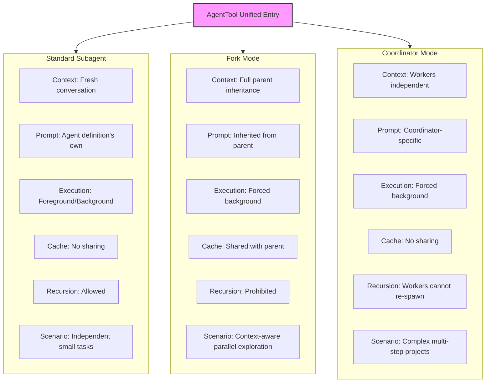
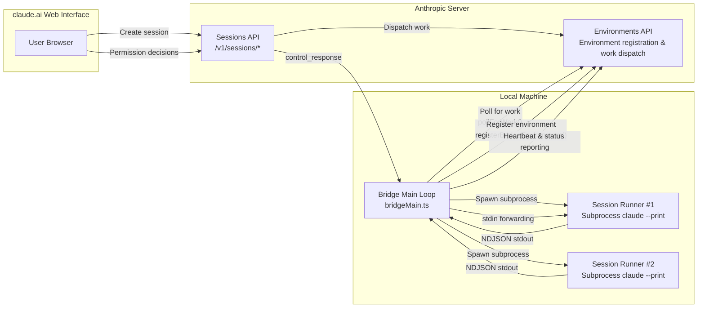

# Chapter 20: Agent Spawning and Orchestration

> **Positioning**: This chapter analyzes how Claude Code implements multi-Agent spawning and orchestration through three modes: Subagent, Fork, and Coordinator. Prerequisites: Chapters 3 and 4. Target audience: readers who want to understand how CC spawns sub-Agents (Subagent/Fork/Coordinator), or developers building multi-Agent systems.

## Why Multiple Agents Are Needed

A single Agent Loop's context window is a finite resource. When task scale exceeds what a single conversation can hold -- for example, "investigate the root cause of this bug, fix it, run tests, write a PR" -- a single Agent must either cram intermediate results into the context or repeatedly compress and lose details. The more fundamental issue is: **a single Agent cannot parallelize**, yet software engineering tasks are naturally suited to divide-and-conquer.

Claude Code provides three progressively heavier multi-Agent patterns: **Subagent**, **Fork Mode**, and **Coordinator Mode**. They share a single entry point -- `AgentTool` -- but have fundamental differences in context inheritance, execution model, and lifecycle management. This chapter will dissect these three modes layer by layer, along with the verification Agent and tool pool assembly logic built around them.

The Teams system is covered in Chapter 20b, and Ultraplan remote planning in Chapter 20c.

---

> **Interactive version**: [Click to view the Agent spawning animation](agent-spawn-viz.html) -- Watch as the main Agent spawns 3 subagents to work in parallel, with context passing and isolation.

## 20.1 AgentTool: The Unified Agent Spawning Entry Point

All Agent spawning goes through a single tool. `AgentTool` is defined in `tools/AgentTool/AgentTool.tsx`, with `name` set to `'Agent'` (line 226) and an alias for the legacy `'Task'` (line 228).

### Dynamic Schema Composition

AgentTool's input Schema is not static -- it is dynamically composed based on Feature Flags and runtime conditions:

```typescript
// tools/AgentTool/AgentTool.tsx:82-88
const baseInputSchema = lazySchema(() => z.object({
  description: z.string().describe('A short (3-5 word) description of the task'),
  prompt: z.string().describe('The task for the agent to perform'),
  subagent_type: z.string().optional(),
  model: z.enum(['sonnet', 'opus', 'haiku']).optional(),
  run_in_background: z.boolean().optional()
}));
```

The base Schema contains five fields. When multi-Agent features (Agent Swarms) are enabled, `name`, `team_name`, and `mode` fields are also merged (lines 93-97); the `isolation` field supports `'worktree'` (all builds) or `'remote'` (internal builds); when background tasks are disabled or Fork mode is enabled, the `run_in_background` field is `.omit()`-removed (lines 122-124).

This dynamic Schema composition has an important design intent: **the parameter list the model sees precisely reflects the capabilities it can currently use**. When Fork mode is enabled, the model doesn't see `run_in_background` because in Fork mode all Agents are automatically backgrounded (line 557) -- the model doesn't need to and shouldn't explicitly control this.

### AsyncLocalStorage Context Isolation

When multiple Agents run concurrently in the same process (e.g., the user presses Ctrl+B to background one Agent and immediately starts another), how do you isolate their identity information? The answer is `AsyncLocalStorage`.

```typescript
// utils/agentContext.ts:24
import { AsyncLocalStorage } from 'async_hooks'

// utils/agentContext.ts:93
const agentContextStorage = new AsyncLocalStorage<AgentContext>()

// utils/agentContext.ts:108-109
export function runWithAgentContext<T>(context: AgentContext, fn: () => T): T {
  return agentContextStorage.run(context, fn)
}
```

The source code comment (`agentContext.ts` lines 17-21) directly explains why `AppState` isn't used:

> When agents are backgrounded (ctrl+b), multiple agents can run concurrently in the same process. AppState is a single shared state that would be overwritten, causing Agent A's events to incorrectly use Agent B's context. AsyncLocalStorage isolates each async execution chain, so concurrent agents don't interfere with each other.

`AgentContext` is a discriminated union type, distinguished by the `agentType` field:

| Context Type | `agentType` Value | Purpose | Key Fields |
|:---:|:---:|:---|:---|
| `SubagentContext` | `'subagent'` | Subagent spawned by the Agent tool | `agentId`, `subagentName`, `isBuiltIn` |
| `TeammateAgentContext` | `'teammate'` | Teammate Agent (Swarm member) | `agentName`, `teamName`, `planModeRequired`, `isTeamLead` |

Both context types have an `invokingRequestId` field (lines 43-49, lines 77-83), used to track who spawned this Agent. The `consumeInvokingRequestId()` function (lines 163-178) implements "sparse edge" semantics: each spawn/resume emits `invokingRequestId` only on the first API event, then returns `undefined` afterward, avoiding duplicate marking.

---

## 20.2 Three Agent Modes

### Mode One: Standard Subagent

This is the most basic mode. The model specifies `subagent_type` when calling the `Agent` tool, AgentTool looks up a matching definition from registered Agent definitions, then starts a **brand new** conversation.

The routing logic is at `AgentTool.tsx` lines 322-356:

```typescript
// tools/AgentTool/AgentTool.tsx:322-323
const effectiveType = subagent_type
  ?? (isForkSubagentEnabled() ? undefined : GENERAL_PURPOSE_AGENT.agentType);
```

When `subagent_type` is not specified and Fork mode is off, the default `general-purpose` type is used.

Built-in Agent definitions are registered in `builtInAgents.ts` (lines 45-72), including:

| Agent Type | Purpose | Tool Restrictions | Model |
|:---:|:---|:---|:---:|
| `general-purpose` | General tasks: search, analysis, multi-step operations | All tools | Default |
| `verification` | Verify implementation correctness | Edit tools prohibited | Inherited |
| `Explore` | Code exploration | - | - |
| `Plan` | Task planning | - | - |
| `claude-code-guide` | Usage guide | - | - |

The key characteristic of subagents is **context isolation**: they start from scratch and only see the `prompt` passed by the parent Agent. System prompts are also independently generated (lines 518-534). This means the subagent doesn't know the parent Agent's conversation history -- it's like "a smart colleague who just walked into the room."

### Mode Two: Fork Mode

Fork mode is an experimental feature, jointly controlled by build-time gating via `feature('FORK_SUBAGENT')` and runtime conditions:

```typescript
// tools/AgentTool/forkSubagent.ts:32-39
export function isForkSubagentEnabled(): boolean {
  if (feature('FORK_SUBAGENT')) {
    if (isCoordinatorMode()) return false
    if (getIsNonInteractiveSession()) return false
    return true
  }
  return false
}
```

The fundamental difference between Fork mode and standard subagents is **context inheritance**. Fork child processes inherit the parent Agent's complete conversation context and system prompt:

```typescript
// tools/AgentTool/forkSubagent.ts:60-71
export const FORK_AGENT = {
  agentType: FORK_SUBAGENT_TYPE,
  tools: ['*'],
  maxTurns: 200,
  model: 'inherit',
  permissionMode: 'bubble',
  source: 'built-in',
  baseDir: 'built-in',
  getSystemPrompt: () => '',  // Not used -- inherits parent's system prompt
} satisfies BuiltInAgentDefinition
```

Note `model: 'inherit'` and `getSystemPrompt: () => ''` -- Fork child processes use the parent Agent's model (maintaining consistent context length) and the parent Agent's already-rendered system prompt (maintaining byte-identical content to maximize prompt cache hits).

#### Prompt Cache Sharing

The core value of Fork mode lies in **prompt cache sharing**. The `buildForkedMessages()` function (`forkSubagent.ts` lines 107-164) constructs a message structure that ensures all Fork child processes produce byte-identical API request prefixes:

1. Preserve the parent Agent's complete assistant messages (all `tool_use` blocks, thinking, text)
2. Construct identical placeholder `tool_result` for each `tool_use` block (lines 142-150, using fixed text `'Fork started — processing in background'`)
3. Only append a per-child instruction text block at the end

```
[...history messages, assistant(all tool_use blocks), user(placeholder tool_results..., instruction)]
```

Only the last text block differs per child, maximizing cache hit rate.

#### Recursive Fork Protection

Fork child processes retain the `Agent` tool in their tool pool (for cache consistency), but calls are intercepted at invocation time (lines 332-334):

```typescript
// tools/AgentTool/AgentTool.tsx:332-334
if (toolUseContext.options.querySource === `agent:builtin:${FORK_AGENT.agentType}`
    || isInForkChild(toolUseContext.messages)) {
  throw new Error('Fork is not available inside a forked worker.');
}
```

The detection mechanism has two layers: the primary check uses `querySource` (compression-resistant -- won't be lost even if messages are rewritten by autocompact), and the backup check scans messages for the `<fork-boilerplate>` tag (lines 78-89).

### Mode Three: Coordinator Mode

Coordinator Mode is activated via the environment variable `CLAUDE_CODE_COORDINATOR_MODE`:

```typescript
// coordinator/coordinatorMode.ts:36-41
export function isCoordinatorMode(): boolean {
  if (feature('COORDINATOR_MODE')) {
    return isEnvTruthy(process.env.CLAUDE_CODE_COORDINATOR_MODE)
  }
  return false
}
```

In this mode, the main Agent becomes a **coordinator that doesn't code directly**, with its tool set reduced to orchestration tools: `Agent` (spawn Workers), `SendMessage` (send follow-up instructions to Workers), `TaskStop` (stop Workers), etc. Workers have the actual coding tools.

The coordinator's system prompt (`coordinatorMode.ts` lines 111-368) is a detailed orchestration protocol defining a four-phase workflow:

| Phase | Executor | Purpose |
|:---:|:---:|:---|
| Research | Workers (parallel) | Investigate the codebase, locate problems |
| Synthesis | **Coordinator** | Read results, understand the problem, write implementation specs |
| Implementation | Workers | Modify code per spec, commit |
| Verification | Workers | Test whether changes are correct |

The most emphasized principle in the prompt is **"never delegate understanding"** (lines 256-259):

> Never write "based on your findings" or "based on the research." These phrases delegate understanding to the worker instead of doing it yourself.

The `getCoordinatorUserContext()` function (lines 80-109) generates Worker tool context information, including the list of tools and MCP servers available to Workers. When the Scratchpad feature is enabled, it also informs the coordinator that a shared directory can be used for cross-Worker knowledge persistence (lines 104-106).

### Supplement: `/btw` Side Question as a Tool-less Fork

`/btw` is not a fourth Agent mode, but it's a very important **side-channel special case** for understanding Claude Code's capability matrix. The command definition itself is `local-jsx` and `immediate: true`, so it can maintain an independent overlay while the main thread is still streaming output, without being covered by normal tool UI.

On the execution path, `/btw` doesn't queue into the main Loop but rather `runSideQuestion()` calls `runForkedAgent()`: it inherits the parent session's cache-safe prefix and current conversation context, but explicitly rejects all tools via `canUseTool`, limits `maxTurns` to 1, and sets `skipCacheWrite` to avoid writing a new cache prefix for this one-off suffix. In other words, `/btw` is a "full context + zero tools + single-turn answer" dimensionally-reduced version.

From the capability matrix perspective, it forms a symmetric relationship with standard subagents:

- **Standard Subagent**: Retains tool capabilities but typically starts from a new context
- **`/btw`**: Retains context capabilities but removes tools and multi-turn execution

This symmetry is important because it reveals that Claude Code's delegation system is not a binary switch but independently trims along three dimensions: "context, tools, and number of turns." Users don't always want "another Agent that can do everything" -- sometimes they just want "an answer to a side question with no side effects using the current context."

### Three-Mode Comparison



| Dimension | Standard Subagent | Fork Mode | Coordinator Mode |
|:---:|:---:|:---:|:---:|
| Context Inheritance | None (fresh conversation) | Full inheritance | None (Workers independent) |
| System Prompt | Agent definition's own | Inherited from parent | Coordinator-specific prompt |
| Model Selection | Overridable | Inherited from parent | Not overridable |
| Execution Mode | Foreground/Background | Forced background | Forced background |
| Cache Sharing | None | Shared with parent | None |
| Tool Pool | Independently assembled | Inherited from parent | Workers independently assembled |
| Recursive Spawning | Allowed | Prohibited | Workers cannot re-spawn |
| Gating Method | Always available | Build + runtime | Build + environment variable |
| Use Case | Independent small tasks | Context-aware parallel exploration | Complex multi-step projects |

---

## 20.4 Verification Agent

The Verification Agent is the most elegantly designed among the built-in Agents. Its system prompt (`built-in/verificationAgent.ts` lines 10-128) spans approximately 120 lines -- essentially an engineering specification for "how to perform real verification."

### Core Design Principles

The Verification Agent has two explicitly stated failure modes (lines 12-13):

1. **Verification avoidance**: Finding excuses not to execute when faced with checks -- reading code, narrating test steps, writing "PASS," then moving on
2. **Fooled by the first 80%**: Seeing a nice UI or passing test suite and tending to pass, without noticing that half the buttons don't work

### Strict Read-Only Constraints

The Verification Agent is explicitly prohibited from modifying the project:

```typescript
// built-in/verificationAgent.ts:139-145
disallowedTools: [
  AGENT_TOOL_NAME,
  EXIT_PLAN_MODE_TOOL_NAME,
  FILE_EDIT_TOOL_NAME,
  FILE_WRITE_TOOL_NAME,
  NOTEBOOK_EDIT_TOOL_NAME,
],
```

However, it **can** write temporary test scripts in the temp directory (`/tmp`) -- this permission is sufficient for writing temporary test tools without polluting the project.

### VERDICT Determination

The Verification Agent's output must end with a strictly formatted verdict (lines 117-128):

| Verdict | Meaning |
|:---:|:---|
| `VERDICT: PASS` | Verification passed |
| `VERDICT: FAIL` | Issues found, including specific error output and reproduction steps |
| `VERDICT: PARTIAL` | Environmental limitations prevented full verification (not "uncertain") |

`PARTIAL` is only for environmental limitations (no test framework, tool unavailable, server won't start) -- it cannot be used for "I'm not sure if this is a bug."

### Adversarial Probing

The Verification Agent's prompt requires running at least one adversarial probe (lines 63-69): concurrent requests, boundary values, idempotency, orphaned operations, etc. If all checks are just "returns 200" or "test suite passes," that only confirms the happy path and doesn't count as real verification.

---

## 20.7 Independent Tool Pool Assembly

Each Worker's tool pool is independently assembled, not inheriting the parent Agent's restrictions (lines 573-577):

```typescript
// tools/AgentTool/AgentTool.tsx:573-577
const workerPermissionContext = {
  ...appState.toolPermissionContext,
  mode: selectedAgent.permissionMode ?? 'acceptEdits'
};
const workerTools = assembleToolPool(workerPermissionContext, appState.mcp.tools);
```

The only exception is Fork mode: Fork child processes use the parent's exact tool array (`useExactTools: true`, lines 631-633) because differences in tool definitions would break prompt cache.

### MCP Server Waiting and Validation

Agent definitions can declare required MCP servers (`requiredMcpServers`). AgentTool checks whether these servers are available before startup (lines 369-409) and waits up to 30 seconds while MCP servers are still connecting (lines 379-391), with early-exit logic -- if a required server has already failed, it stops waiting for other servers.

---

## 20.8 Design Insights

**Why three modes instead of one?** This stems from a fundamental trade-off: **context sharing vs. execution isolation**. Standard subagents provide maximum isolation but no context; Fork provides maximum context sharing but cannot recurse; Coordinator mode sits in between -- Workers are isolated but the coordinator maintains a global view. No single universal solution can satisfy all scenarios.

**The flat team structure design philosophy.** Prohibiting teammates from spawning teammates isn't just a technical constraint -- it reflects an organizational principle: in an effective team, coordination should be centralized at one node (Leader), rather than forming arbitrarily deep delegation chains. This aligns with the intuition of "avoiding overly deep call stacks" in software engineering.

**The Verification Agent's "anti-pattern checklist" design.** The Verification Agent's prompt explicitly lists typical failure modes of LLMs acting as verifiers (lines 53-61) and requires it to "recognize its own rationalizing excuses." This meta-cognition prompting is an engineering compensation for LLMs' inherent weaknesses -- not expecting the model not to make these mistakes, but making the model aware that it tends to make these mistakes.

---

## What Users Can Do

**Leverage multi-Agent modes to improve work efficiency:**

1. **Use subagents for independent investigations.** When you need to complete an independent subtask without disturbing the main conversation context (e.g., "find all callers of this API"), having the model start a subagent is the best choice. The subagent has its own context window, returns a summary when done, and doesn't pollute the main conversation.

2. **Understand Coordinator Mode's four-phase workflow.** If your organization has enabled Coordinator Mode (`CLAUDE_CODE_COORDINATOR_MODE=true`), understanding its Research -> Synthesis -> Implementation -> Verification four-phase workflow helps you collaborate better. Note especially: the coordinator doesn't code directly -- it only handles understanding problems and assigning tasks.

3. **Use the Verification Agent for quality gates.** After completing complex changes, you can explicitly request running the Verification Agent. Its read-only constraints and adversarial probing design make it a reliable "second pair of eyes."

4. **Worktree isolation protects the main branch.** When an Agent uses `isolation: 'worktree'`, all modifications happen in a temporary git worktree. Worktrees without changes are automatically cleaned up, while those with changes retain their branches -- meaning you can confidently let the Agent try experimental modifications.

---

## 20.9 Remote Execution: Bridge Architecture

The preceding sections analyzed three Agent spawning modes -- Subagent, Fork, Coordinator -- all running in the local process. But Claude Code is more than just a local CLI tool. The Bridge subsystem (`restored-src/src/bridge/`, 33 files total) extends Agent execution capability beyond network boundaries, allowing users to remotely trigger Agent sessions on the local machine from the claude.ai Web interface. If Fork is "process-level Agent splitting on the local machine," then Bridge is "cross-network Agent projection."

### Three-Component Architecture

Bridge's design follows the classic client-server-worker pattern. The entire system consists of three components:



**Bridge Main Loop** (`bridgeMain.ts`) is the core orchestrator. It starts a persistent polling loop via `runBridgeLoop()` (line 141): registering the local environment with the server, then repeatedly calling `pollForWork()` to get new session requests. Whenever new work arrives, Bridge uses `SessionSpawner` to spawn a child Claude Code process to execute the actual Agent task.

**Session Runner** (`sessionRunner.ts`) manages each subprocess's lifecycle. It creates a factory via `createSessionSpawner()` (line 248); each `.spawn()` call starts a new `claude --print` subprocess, configured in `--input-format stream-json --output-format stream-json` NDJSON streaming mode (lines 287-299). The subprocess's stdout is parsed line-by-line via `readline`, extracting tool call activities (`extractActivities`) and permission requests (`control_request`).

### JWT Authentication Flow

Bridge authentication is based on a two-layer JWT (JSON Web Token) system: the outer layer is an OAuth token for environment registration and management APIs; the inner layer is a Session Ingress Token (prefix `sk-ant-si-`) for the subprocess's actual inference requests.

`jwtUtils.ts`'s `createTokenRefreshScheduler()` (line 72) implements an elegant token renewal scheduler. Its core logic:

1. **Decode JWT expiry**. The `decodeJwtPayload()` function (line 21) strips the `sk-ant-si-` prefix, then decodes the Base64url-encoded payload segment to extract the `exp` claim. Note that **signatures are not verified** here -- Bridge only needs to know the expiry time; verification is done server-side.

2. **Proactive renewal**. The scheduler proactively initiates refresh 5 minutes before token expiry (`TOKEN_REFRESH_BUFFER_MS`, line 52), avoiding failed requests from using expired tokens.

3. **Generation counting to prevent races**. Each session maintains a generation counter (line 94); both `schedule()` and `cancel()` increment the generation number. When the async `doRefresh()` completes, it checks whether the current generation matches the one at launch time (line 178) -- if not, the session has been rescheduled or cancelled, and the refresh result should be discarded. This pattern effectively prevents orphaned timer issues caused by concurrent refreshes.

4. **Failure retry with circuit breaking**. After 3 consecutive failures (`MAX_REFRESH_FAILURES`, line 58), retries stop to avoid infinite loops when the token source is completely unavailable. Each failure waits 60 seconds before retrying.

### Session Forwarding and Permission Proxying

Bridge's most elegant design lies in remote permission proxying. When a subprocess needs to perform a sensitive operation (such as writing a file or running a shell command), it emits a `control_request` message via stdout. `sessionRunner.ts`'s NDJSON parser detects such messages (lines 417-431) and calls the `onPermissionRequest` callback to forward the request to the server.

`bridgePermissionCallbacks.ts` defines the permission proxy's type contract:

```typescript
// restored-src/src/bridge/bridgePermissionCallbacks.ts:3-8
type BridgePermissionResponse = {
  behavior: 'allow' | 'deny'
  updatedInput?: Record<string, unknown>
  updatedPermissions?: PermissionUpdate[]
  message?: string
}
```

The user's allow/deny decision made on the Web interface is passed back to Bridge via `control_response` messages, which Bridge then forwards to the Session Runner via the subprocess's stdin. This forms a complete permission loop: subprocess request -> Bridge forwarding -> server -> Web interface -> user decision -> return via the same path.

Token updates are also done via stdin. `SessionHandle.updateAccessToken()` (`sessionRunner.ts` line 527) wraps the new token as an `update_environment_variables` message written to the subprocess's stdin; the subprocess's StructuredIO handler directly sets `process.env`, so subsequent authentication headers automatically use the new token.

### Capacity Management

Bridge must handle capacity concerns for multiple concurrent sessions. `types.ts` defines three spawn modes (SpawnMode, lines 68-69):

| Mode | Behavior | Use Case |
|------|----------|----------|
| `single-session` | Single session, exit on completion | Default mode, simplest |
| `worktree` | Independent git worktree per session | Parallel multi-session, no interference |
| `same-dir` | All sessions share working directory | Lightweight but conflict-prone |

`bridgeMain.ts`'s default maximum concurrent sessions is 32 (`SPAWN_SESSIONS_DEFAULT`, line 83), and multi-session functionality is progressively rolled out via GrowthBook Feature Gate (`tengu_ccr_bridge_multi_session`, line 97).

`capacityWake.ts` implements the capacity wake primitive (`createCapacityWake()` at line 28). When all session slots are full, the polling loop sleeps. Two events wake it: (a) an external abort signal (shutdown), or (b) a session completing and freeing a slot. This module abstracts the previously duplicated wake logic from `bridgeMain.ts` and `replBridge.ts` into a shared primitive -- as its comment states: "both poll loops previously duplicated byte-for-byte" (line 8).

Each session also has timeout protection: 24 hours by default (`DEFAULT_SESSION_TIMEOUT_MS`, `types.ts` line 2). Timed-out sessions are proactively killed by Bridge's watchdog, first sending SIGTERM, then SIGKILL after a grace period.

### Relationship to Agent Spawning

Bridge is the natural extension of the Agent spawning mechanisms discussed in the first half of this chapter along the network dimension. If we place the three Agent modes and Bridge on the same spectrum:

| Dimension | Subagent | Fork | Coordinator | Bridge |
|-----------|---------|------|------------|--------|
| Execution Location | Same process | Subprocess | Subprocess group | Remote subprocess |
| Context Inheritance | None | Full snapshot | Summary passing | None (independent session) |
| Trigger Source | LLM autonomous | LLM autonomous | LLM autonomous | User via Web |
| Permission Model | Inherits parent | Inherits parent | Inherits parent | Remote proxy return |
| Lifecycle | Parent-managed | Parent-managed | Coordinator-managed | Bridge polling loop managed |

A Bridge session is essentially a remote subagent without context inheritance -- it uses the exact same `claude --print` execution mode, but session creation, permission decisions, and lifecycle management all cross network boundaries. `sessionRunner.ts`'s `createSessionSpawner()` is conceptually isomorphic to AgentTool's subprocess spawning, differing only in trigger source and communication channel.

The elegance of this design lies in the fact that regardless of whether an Agent executes locally or remotely, its core Agent Loop (see Chapter 3) doesn't need to change at all. Bridge simply wraps a layer of network transport and authentication protocol around the Loop's exterior, maintaining the kernel's simplicity.
