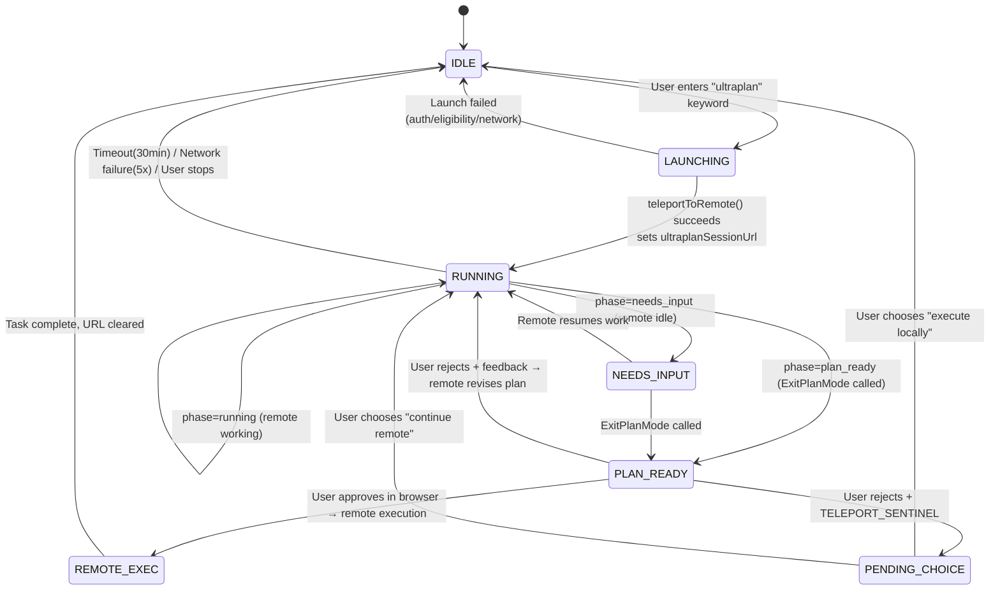

# Chapter 20c: Ultraplan -- Remote Multi-Agent Planning

### Why Ultraplan Is Needed

The multi-Agent orchestration described earlier in this chapter is all **local** -- Agents run in the user's terminal, occupy terminal I/O, and share the context window with the user. Ultraplan solves a different problem: **offloading the planning phase to remote**, keeping the user's terminal available.

| Dimension | Local Plan Mode | Ultraplan |
|-----------|----------------|-----------|
| Execution location | Local terminal | CCR (Claude Code on the web) remote container |
| Model | Current session model | Forced Opus 4.6 (GrowthBook `tengu_ultraplan_model` config) |
| Exploration method | Single Agent sequential exploration | Optional multi-Agent parallel exploration (depending on prompt variant) |
| Timeout | No hard timeout | 30 minutes (GrowthBook `tengu_ultraplan_timeout_seconds`, default 1800) |
| User terminal | Blocked | Stays available, user can continue other work |
| Result delivery | Executed directly in session | "Execute remotely and create PR" or "teleport back to local terminal for execution" |
| Approval | Terminal dialog | Browser PlanModal |

### Architecture Overview

Ultraplan consists of 5 core modules:

```
┌──────────────────────────────────────────────────────────────┐
│                    User Terminal (Local)                       │
│                                                              │
│  PromptInput.tsx                processUserInput.ts           │
│  ┌─────────────┐              ┌──────────────────┐           │
│  │ Keyword      │─→ Rainbow    │ "ultraplan"       │          │
│  │ detection    │   highlight  │ replacement       │          │
│  │ + toast      │              │ → /ultraplan cmd   │          │
│  └─────────────┘              └────────┬─────────┘           │
│                                        ↓                     │
│  commands/ultraplan.tsx ──────────────────────────            │
│  ┌─────────────────────────────────────────────┐             │
│  │ launchUltraplan()                           │             │
│  │  ├─ checkRemoteAgentEligibility()           │             │
│  │  ├─ buildUltraplanPrompt(blurb, seed, id)   │             │
│  │  ├─ teleportToRemote() ──→ CCR session      │             │
│  │  ├─ registerRemoteAgentTask()               │             │
│  │  └─ startDetachedPoll() ──→ Background poll │             │
│  └───────────────────────────┬─────────────────┘             │
│                              ↓                               │
│  utils/ultraplan/ccrSession.ts                               │
│  ┌─────────────────────────────────────────────┐             │
│  │ pollForApprovedExitPlanMode()               │             │
│  │  ├─ Poll remote session events every 3s     │             │
│  │  ├─ ExitPlanModeScanner.ingest() state machine│           │
│  │  └─ Phase detection: running → needs_input → ready│       │
│  └───────────────────────────┬─────────────────┘             │
│                              ↓                               │
│  Task system Pill display                                     │
│  ◇ ultraplan (running)                                       │
│  ◇ ultraplan needs your input (remote idle)                  │
│  ◆ ultraplan ready (plan ready)                              │
└──────────────────────────────────────────────────────────────┘
                               ↕ HTTP polling
┌──────────────────────────────────────────────────────────────┐
│                   CCR Remote Container                        │
│                                                              │
│  Opus 4.6 + plan mode permissions                            │
│  ├─ Explore codebase (Glob/Grep/Read)                        │
│  ├─ Optional: Task tool spawns parallel subagents            │
│  ├─ Call ExitPlanMode to submit plan                         │
│  └─ Wait for user approval (approve/reject/teleport to local)│
└──────────────────────────────────────────────────────────────┘
```

### What CCR Is -- The Meaning of "Working Remotely"

The "CCR Remote Container" in the architecture diagram stands for **Claude Code Remote** (Claude Code on the web), essentially a complete Claude Code instance running on Anthropic's servers:

```
Your terminal (local CLI client)          Anthropic cloud (CCR container)
┌──────────────────────┐            ┌────────────────────────────┐
│ Only responsible for: │            │ Running:                    │
│ · Bundle and upload   │──HTTP──→   │ · Complete Claude Code      │
│   codebase            │            │   instance                  │
│ · Display task Pill   │            │ · Opus 4.6 model (forced)   │
│ · Poll status every 3s│←─poll──    │ · Your codebase copy        │
│ · Receive final plan  │            │   (bundle)                  │
│                      │            │ · Glob/Grep/Read etc. tools  │
│ You can continue      │            │ · Optional: multiple         │
│ other work            │            │   subagents in parallel      │
│                      │            │ · Plan mode permissions       │
│                      │            │   (read-only)                │
└──────────────────────┘            └────────────────────────────┘
```

The CCR container is created via `teleportToRemote()`. At launch, your codebase is bundled and uploaded, and the remote end gains full code access. The remote Agent Loop sends requests to the Claude API, exactly as when you use Claude Code locally -- the difference is it uses the Opus 4.6 model, runs on Anthropic's infrastructure, and doesn't occupy your terminal.

### What Users Can Do

**Trigger methods**:

1. **Keyword trigger** -- naturally write "ultraplan" in your prompt:
   ```
   ultraplan refactor the auth module to support both OAuth2 and API key methods
   ```
2. **Slash command** -- explicitly invoke `/ultraplan <description>`

**Prerequisites** (`checkRemoteAgentEligibility()` checks):
- Logged into Claude Code via OAuth
- Subscription level supports remote Agents (Pro/Max/Team/Enterprise)
- Feature Flag `ULTRAPLAN` enabled for account (GrowthBook server-side control)

**Checking availability**: After typing text containing "ultraplan", if the keyword shows rainbow highlighting and a toast notification "This prompt will launch an ultraplan session in Claude Code on the web" appears, the feature is enabled. No reaction means the feature flag is not enabled for your account.

**Usage flow**:

```
1. Enter a prompt containing "ultraplan"
2. Confirm the launch dialog
3. Terminal shows CCR URL, you can continue other work
4. Task bar Pill shows progress:
   ◇ ultraplan               → Remote exploring codebase
   ◇ ultraplan needs your input → Need to act in browser
   ◆ ultraplan ready          → Plan ready, awaiting approval
5. Approve plan in browser:
   a. Approve → Execute remotely and create Pull Request
   b. Reject + feedback → Remote revises based on feedback and resubmits
   c. Teleport to local → Plan returns to your terminal for execution
6. To stop midway, cancel through the task system
```

**Source code locations**:

| File | Lines | Responsibility |
|------|-------|---------------|
| `commands/ultraplan.tsx` | 470 | Main command: launch, poll, stop, error handling |
| `utils/ultraplan/ccrSession.ts` | 350 | Poll state machine, ExitPlanModeScanner, phase detection |
| `utils/ultraplan/keyword.ts` | 128 | Keyword detection: trigger rules, context exclusions |
| `state/AppStateStore.ts` | -- | State fields: `ultraplanSessionUrl`, `ultraplanPendingChoice`, etc. |
| `tasks/RemoteAgentTask/` | -- | Remote task registration and lifecycle management |
| `components/PromptInput/PromptInput.tsx` | -- | Keyword rainbow highlight + toast |

### Keyword Trigger System

Users don't need to type `/ultraplan` -- simply writing "ultraplan" naturally in the prompt triggers it.

```typescript
// restored-src/src/utils/ultraplan/keyword.ts
export function findUltraplanTriggerPositions(text: string): TriggerPosition[]
export function hasUltraplanKeyword(text: string): boolean
export function replaceUltraplanKeyword(text: string): string
```

**Exclusion rules** -- "ultraplan" in the following contexts will not trigger:

| Context | Example | Reason |
|---------|---------|--------|
| Inside quotes/backticks | `` `ultraplan` `` | Code reference |
| In paths | `src/ultraplan/foo.ts` | File path |
| In identifiers | `--ultraplan-mode` | CLI argument |
| Before file extensions | `ultraplan.tsx` | Filename |
| After question mark | `ultraplan?` | Asking about the feature, not triggering |
| Starting with `/` | `/ultraplan` | Goes through slash command path |

After triggering, `processUserInput.ts` replaces the keyword with `/ultraplan {rewritten prompt}` and routes to the command handler.

### State Machine: Lifecycle Management

Ultraplan uses 5 AppState fields to manage its lifecycle:

```typescript
// restored-src/src/state/AppStateStore.ts
ultraplanLaunching?: boolean         // Launching (prevents duplicate launches, ~5s window)
ultraplanSessionUrl?: string         // Active session URL (disables keyword trigger when present)
ultraplanPendingChoice?: {           // Approved plan awaiting user's execution location choice
  plan: string
  sessionId: string
  taskId: string
}
ultraplanLaunchPending?: {           // Pre-launch confirmation dialog state
  blurb: string
}
isUltraplanMode?: boolean            // Remote-side flag (set via set_permission_mode)
```

**State transition diagram**:



### Polling and Phase Detection

`startDetachedPoll()` runs as a background async IIFE, not blocking the terminal:

```typescript
// restored-src/src/utils/ultraplan/ccrSession.ts

const POLL_INTERVAL_MS = 3000             // Poll every 3 seconds
const MAX_CONSECUTIVE_FAILURES = 5        // Give up after 5 consecutive network errors
const ULTRAPLAN_TIMEOUT_MS = 30 * 60 * 1000  // 30-minute timeout
```

**ExitPlanModeScanner** is a pure stateless event processor that extracts signals from the remote session event stream:

```typescript
// Scan result types
type ScanResult =
  | { kind: 'approved'; plan: string }    // User approved (remote execution)
  | { kind: 'teleport'; plan: string }    // User rejected + teleport marker (local execution)
  | { kind: 'rejected'; id: string }      // Normal rejection (revise and resubmit)
  | { kind: 'pending' }                   // ExitPlanMode called, awaiting approval
  | { kind: 'terminated'; subtype: string } // Session terminated
  | { kind: 'unchanged' }                 // No new signals
```

**Phase detection logic**:

```typescript
// Determine current phase of remote session
const quietIdle =
  (sessionStatus === 'idle' || sessionStatus === 'requires_action') &&
  newEvents.length === 0

const phase: UltraplanPhase = scanner.hasPendingPlan
  ? 'plan_ready'      // ExitPlanMode called, awaiting browser approval
  : quietIdle
    ? 'needs_input'    // Remote idle, may need user input
    : 'running'        // Working normally
```

### GrowthBook-Driven Prompt Variants (New in v2.1.91)

v2.1.91 introduced the `tengu_ultraplan_prompt_identifier` event, exposing a **GrowthBook-controlled prompt variant system**. At least 3 prompt variants were extracted from the bundle:

**Variant 1: `simple_plan` (default)** -- Lightweight single-agent planning

```
You're running in a remote planning session.
Run a lightweight planning process, consistent with how you would
in regular plan mode:
- Explore the codebase directly with Glob, Grep, and Read.
- Do not spawn subagents.
When you've settled on an approach, call ExitPlanMode with the plan.
```

**Variant 2: Multi-agent exploration** -- Uses Task tool to spawn parallel subagents

```
Produce an exceptionally thorough implementation plan using
multi-agent exploration.
Instructions:
1. Use the Task tool to spawn parallel agents to explore different
   aspects of the codebase simultaneously:
   - One agent to understand the relevant existing code and architecture
   - One agent to find all files that will need modification
   - One agent to identify potential risks, edge cases, and dependencies
2. Synthesize their findings into a detailed, step-by-step plan.
3. Use the Task tool to spawn a critique agent to review the plan.
4. Incorporate the critique feedback, then call ExitPlanMode.
```

**Variant switching mechanism**:

```typescript
// v2.1.91 bundle reverse engineering
function getPromptIdentifier(): string {
  // Read from GrowthBook, default "simple_plan"
  let id = getFeatureValue('tengu_ultraplan_prompt_identifier', 'simple_plan')
  return isValidId(id) ? id : 'simple_plan'
}

function getTimeout(): number {
  // Read from GrowthBook, default 1800 seconds (30 minutes)
  return getFeatureValue('tengu_ultraplan_timeout_seconds', 1800) * 1000
}
```

This means Anthropic can A/B test different planning strategies through GrowthBook without shipping new releases. The `tengu_ultraplan_config` event records the specific configuration combination used at each launch.

### Plan Teleport Protocol

When a user rejects a plan in the browser but chooses "teleport back to local terminal," the browser injects a sentinel string in the feedback:

```typescript
const ULTRAPLAN_TELEPORT_SENTINEL = '__ULTRAPLAN_TELEPORT_LOCAL__'
```

The remote-side prompt explicitly instructs the model to recognize this sentinel:

> If the feedback contains `__ULTRAPLAN_TELEPORT_LOCAL__`, DO NOT implement -- the plan has been teleported to the user's local terminal. Respond only with "Plan teleported. Return to your terminal to continue."

The local `ExitPlanModeScanner` detects the sentinel, extracts the plan text, and sets `ultraplanPendingChoice`, popping up a choice dialog for the user to decide whether to execute locally or continue remotely.

### Error Handling Matrix

| Error | Reason Code | When It Occurs | Recovery Strategy |
|-------|------------|----------------|-------------------|
| `UltraplanPollError` | `terminated` | Remote session abnormally terminated | Notify user + archive session |
| `UltraplanPollError` | `timeout_pending` | 30-minute timeout, plan reached pending | Notify + archive |
| `UltraplanPollError` | `timeout_no_plan` | 30-minute timeout, ExitPlanMode never called | Notify + archive |
| `UltraplanPollError` | `network_or_unknown` | 5 consecutive network errors | Notify + archive |
| `UltraplanPollError` | `stopped` | User manually stopped | Early exit, kill handles archival |
| Launch error | `precondition` | Auth/subscription/eligibility insufficient | Notify user |
| Launch error | `bundle_fail` | Bundle creation failed | Notify user |
| Launch error | `teleport_null` | Remote session creation returned null | Notify user |
| Launch error | `unexpected_error` | Exception | Archive orphan session + clear URL |

### Telemetry Event Overview

| Event | Source Version | Trigger | Key Metadata |
|-------|---------------|---------|-------------|
| `tengu_ultraplan_keyword` | v2.1.88 | Keyword detected in user input | -- |
| `tengu_ultraplan_launched` | v2.1.88 | CCR session created successfully | `has_seed_plan`, `model`, `prompt_identifier` |
| `tengu_ultraplan_approved` | v2.1.88 | Plan approved | `duration_ms`, `plan_length`, `reject_count`, `execution_target` |
| `tengu_ultraplan_awaiting_input` | v2.1.88 | Phase becomes needs_input | -- |
| `tengu_ultraplan_failed` | v2.1.88 | Poll error | `duration_ms`, `reason`, `reject_count` |
| `tengu_ultraplan_create_failed` | v2.1.88 | Launch failed | `reason`, `precondition_errors` |
| `tengu_ultraplan_model` | v2.1.88 | GrowthBook config name | Model ID (default Opus 4.6) |
| `tengu_ultraplan_config` | **v2.1.91** | Records config combination at launch | Model + timeout + prompt variant |
| `tengu_ultraplan_keyword` | **v2.1.91** | (Reused) Enhanced trigger tracking | -- |
| `tengu_ultraplan_prompt_identifier` | **v2.1.91** | GrowthBook config name | Prompt variant ID |
| `tengu_ultraplan_stopped` | **v2.1.91** | User manually stopped | -- |
| `tengu_ultraplan_timeout_seconds` | **v2.1.91** | GrowthBook config name | Timeout seconds (default 1800) |

### Pattern Distillation: Remote Offloading Pattern

Ultraplan embodies a reusable architectural pattern -- **remote offloading**:

```
Local Terminal                     Remote Container
┌──────────┐                   ┌──────────────┐
│ Fast      │───create session──→ │ Long-running  │
│ feedback  │                   │ High-compute  │
│ Stays     │                   │ model         │
│ available │←──poll status──   │ Multi-agent   │
│           │                   │ parallel      │
│ Pill      │                   │              │
│ display   │←──plan ready──   │ ExitPlanMode │
│ ◇/◆      │                   │              │
│ status    │                   │              │
│           │                   │              │
│ Choose    │───approve/       │ Execute/     │
│ execution │   teleport──→    │ stop         │
└──────────┘                   └──────────────┘
```

**Core design decisions**:

1. **Async separation**: `startDetachedPoll()` launches as an async IIFE, immediately returns a user-friendly message without blocking the terminal event loop
2. **State machine-driven UI**: Three phases (running/needs_input/plan_ready) map to task Pill visual states (open/filled diamond), letting users sense remote progress without opening a browser
3. **Sentinel protocol**: `__ULTRAPLAN_TELEPORT_LOCAL__` uses tool result text as an inter-process communication channel -- simple but effective
4. **GrowthBook-driven variants**: Model, timeout, and prompt variant are all remotely configurable feature flags, supporting A/B testing without releases
5. **Orphan protection**: All error paths execute `archiveRemoteSession()` for archival, preventing CCR session leaks

### Subagent Enhancements (v2.1.91)

v2.1.91 also added multiple subagent-related events, complementing Ultraplan's multi-agent strategy:

- `tengu_forked_agent_default_turns_exceeded` -- Forked agent exceeded default turn limit, triggering cost control
- `tengu_subagent_lean_schema_applied` -- Subagent uses lean schema (reducing context usage)
- `tengu_subagent_md_report_blocked` -- Subagent blocked when attempting to generate CLAUDE.md report (security boundary)
- `tengu_mcp_subagent_prompt` -- MCP subagent prompt injection tracking
- `CLAUDE_CODE_AGENT_COST_STEER` (new environment variable) -- Subagent cost steering mechanism
