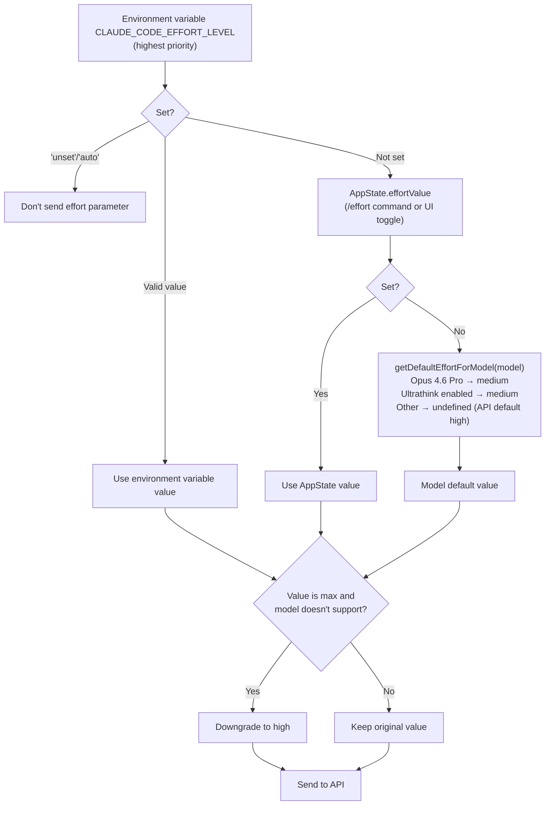

# Chapter 21: Effort, Fast Mode, and Thinking

## Why Layered Reasoning Control Is Needed

Model reasoning depth is not a case of "more is always better." Deeper thinking means higher latency, more token consumption, and lower throughput. For tasks like "rename variable `foo` to `bar`," having Opus 4.6 spend 10 seconds on deep reasoning is wasteful; for "refactor the entire authentication module's error handling," a quick shallow response produces low-quality code.

Claude Code controls reasoning depth through three independent but cooperating mechanisms: **Effort** (reasoning effort level), **Fast Mode** (acceleration mode), and **Thinking** (chain-of-thought configuration). Each has different configuration sources, priority rules, and model compatibility requirements, jointly determining the reasoning behavior of each API call. This chapter will dissect these three mechanisms one by one, and analyze how they cooperate at runtime.

---

## 21.1 Effort: Reasoning Effort Level

Effort is a native Claude API parameter that controls how much "thinking time" the model invests before generating a response. Claude Code builds a multi-layer priority chain on top of this.

### Four Levels

```typescript
// utils/effort.ts:13-18
export const EFFORT_LEVELS = [
  'low',
  'medium',
  'high',
  'max',
] as const satisfies readonly EffortLevel[]
```

| Level | Description (lines 224-235) | Restriction |
|:---:|:---|:---|
| `low` | Quick, direct implementation, minimal overhead | - |
| `medium` | Balanced approach, standard implementation and testing | - |
| `high` | Comprehensive implementation with extensive testing and documentation | - |
| `max` | Deepest reasoning capability | Opus 4.6 only |

The `max` level's model restriction is hardcoded in `modelSupportsMaxEffort()` (lines 53-65): only `opus-4-6` and internal models are supported. When other models attempt to use `max`, it's downgraded to `high` (line 164).

### Priority Chain

Effort's actual value is determined by a clear three-layer priority chain:

```typescript
// utils/effort.ts:152-167
export function resolveAppliedEffort(
  model: string,
  appStateEffortValue: EffortValue | undefined,
): EffortValue | undefined {
  const envOverride = getEffortEnvOverride()
  if (envOverride === null) {
    return undefined  // Environment variable set to 'unset'/'auto': don't send effort parameter
  }
  const resolved =
    envOverride ?? appStateEffortValue ?? getDefaultEffortForModel(model)
  if (resolved === 'max' && !modelSupportsMaxEffort(model)) {
    return 'high'
  }
  return resolved
}
```

Priority from highest to lowest:



### Differentiated Model Defaults

The `getDefaultEffortForModel()` function (lines 279-329) reveals a nuanced default value strategy:

```typescript
// utils/effort.ts:309-319
if (model.toLowerCase().includes('opus-4-6')) {
  if (isProSubscriber()) {
    return 'medium'
  }
  if (
    getOpusDefaultEffortConfig().enabled &&
    (isMaxSubscriber() || isTeamSubscriber())
  ) {
    return 'medium'
  }
}
```

Opus 4.6 defaults to `medium` for Pro subscribers (not `high`) -- this is an A/B tested decision (controlled via GrowthBook's `tengu_grey_step2`, lines 268-276). The source code comment (lines 307-308) carries an explicit warning:

> IMPORTANT: Do not change the default effort level without notifying the model launch DRI and research. Default effort is a sensitive setting that can greatly affect model quality and bashing.

When the Ultrathink feature is enabled, all models that support effort also default to `medium` (lines 322-324), because Ultrathink will boost effort to `high` when user input contains keywords -- `medium` becomes a baseline that can be dynamically elevated.

### Numeric Effort (Internal Only)

Beyond the four string levels, internal users can also use numeric effort (lines 198-216):

```typescript
// utils/effort.ts:202-216
export function convertEffortValueToLevel(value: EffortValue): EffortLevel {
  if (typeof value === 'string') {
    return isEffortLevel(value) ? value : 'high'
  }
  if (process.env.USER_TYPE === 'ant' && typeof value === 'number') {
    if (value <= 50) return 'low'
    if (value <= 85) return 'medium'
    if (value <= 100) return 'high'
    return 'max'
  }
  return 'high'
}
```

Numeric effort cannot be persisted to settings files (`toPersistableEffort()` function, lines 95-105, filters out all numbers) -- it only exists at session runtime. This is an experimental mechanism that should not accidentally leak into users' `settings.json`.

### Effort Persistence Boundaries

The filtering logic of `toPersistableEffort()` reveals a subtle design: the `max` level is also not persisted for external users (line 101), only valid for the current session. This means `max` set via `/effort max` will revert to the model default at next launch -- this is intentional, preventing users from forgetting to turn off max and consuming excessive resources long-term.

---

## 21.2 Fast Mode: Opus 4.6 Acceleration

Fast Mode (internal codename "Penguin Mode") is a mode that lets Sonnet-class models use Opus 4.6 as an "accelerator" -- when the user's primary model isn't Opus, specific requests can be routed to Opus 4.6 for higher-quality responses.

### Availability Check Chain

Fast Mode availability goes through multiple layers of checks:

```typescript
// utils/fastMode.ts:38-40
export function isFastModeEnabled(): boolean {
  return !isEnvTruthy(process.env.CLAUDE_CODE_DISABLE_FAST_MODE)
}
```

After the top-level switch, `getFastModeUnavailableReason()` checks the following conditions (lines 72-140):

1. **Statsig remote kill switch** (`tengu_penguins_off`): Highest-priority remote switch
2. **Non-native binary**: Optional check, controlled via GrowthBook
3. **SDK mode**: Not available by default in Agent SDK unless explicitly opted in
4. **Non-first-party provider**: Bedrock/Vertex/Foundry not supported
5. **Organization-level disable**: Organization status returned by API

### Model Binding

Fast Mode is hard-bound to Opus 4.6:

```typescript
// utils/fastMode.ts:143-147
export const FAST_MODE_MODEL_DISPLAY = 'Opus 4.6'

export function getFastModeModel(): string {
  return 'opus' + (isOpus1mMergeEnabled() ? '[1m]' : '')
}
```

`isFastModeSupportedByModel()` also returns `true` only for Opus 4.6 (lines 167-176) -- meaning if the user is already using Opus 4.6 as their primary model, Fast Mode is itself.

### Cooldown State Machine

Fast Mode's runtime state is an elegant state machine:

```typescript
// utils/fastMode.ts:183-186
export type FastModeRuntimeState =
  | { status: 'active' }
  | { status: 'cooldown'; resetAt: number; reason: CooldownReason }
```

```
┌─────────────────────────────────────────────────────────────┐
│               Fast Mode Cooldown State Machine               │
│                                                             │
│   ┌──────────┐    triggerFastModeCooldown()   ┌──────────┐ │
│   │          │──────────────────────────────►│          │ │
│   │  active  │                               │ cooldown │ │
│   │          │◄──────────────────────────────│          │ │
│   └──────────┘    Date.now() >= resetAt      └──────────┘ │
│       │                                          │         │
│       │ handleFastModeRejectedByAPI()            │         │
│       │ handleFastModeOverageRejection()         │         │
│       ▼                                          │         │
│   ┌──────────┐                                   │         │
│   │ disabled │  (orgStatus = {status:'disabled'})│         │
│   │ (perm.)  │◄──────────────────────────────────┘         │
│   └──────────┘  (if reason is not out_of_credits)          │
│                                                             │
│   Trigger reasons (CooldownReason):                        │
│   • 'rate_limit'  — API 429 rate limit                     │
│   • 'overloaded'  — Service overloaded                     │
│                                                             │
│   Cooldown expiry auto-recovers                            │
│   (check timing: getFastModeRuntimeState())                │
└─────────────────────────────────────────────────────────────┘
```

When cooldown is triggered (`triggerFastModeCooldown()`, lines 214-233), the system records the cooldown end timestamp and reason, sends analytics events, and notifies the UI via Signal:

```typescript
// utils/fastMode.ts:214-233
export function triggerFastModeCooldown(
  resetTimestamp: number,
  reason: CooldownReason,
): void {
  runtimeState = { status: 'cooldown', resetAt: resetTimestamp, reason }
  hasLoggedCooldownExpiry = false
  logEvent('tengu_fast_mode_fallback_triggered', {
    cooldown_duration_ms: cooldownDurationMs,
    cooldown_reason: reason,
  })
  cooldownTriggered.emit(resetTimestamp, reason)
}
```

Cooldown expiry detection is **lazy** -- no timers are used; instead, it checks on every call to `getFastModeRuntimeState()` (lines 199-212). This avoids unnecessary timer resource consumption; the `cooldownExpired` signal only fires when the state is next queried.

### Organization-Level Status Prefetch

Whether an organization allows Fast Mode is determined via API prefetch. The `prefetchFastModeStatus()` function (lines 407-532) calls the `/api/claude_code_penguin_mode` endpoint at startup, with results cached in the `orgStatus` variable.

Prefetching has throttle protection (30-second minimum interval, lines 383-384) and debounce (only one inflight request at a time, lines 416-420). On authentication failure, it automatically attempts OAuth token refresh (lines 466-479).

When network requests fail, internal users default to allowed (not blocking internal development), while external users fall back to the disk-cached `penguinModeOrgEnabled` value (lines 511-520).

### Three-State Output

The `getFastModeState()` function compresses all state into three user-visible states:

```typescript
// utils/fastMode.ts:319-335
export function getFastModeState(
  model: ModelSetting,
  fastModeUserEnabled: boolean | undefined,
): 'off' | 'cooldown' | 'on' {
  const enabled =
    isFastModeEnabled() &&
    isFastModeAvailable() &&
    !!fastModeUserEnabled &&
    isFastModeSupportedByModel(model)
  if (enabled && isFastModeCooldown()) {
    return 'cooldown'
  }
  if (enabled) {
    return 'on'
  }
  return 'off'
}
```

These three states map to different visual feedback in the UI -- `on` shows an acceleration icon, `cooldown` shows a temporary degradation notice, `off` shows nothing.

---

## 21.3 Thinking Configuration

Thinking (chain-of-thought / extended thinking) controls whether and how the model outputs its reasoning process.

### Three Modes

```typescript
// utils/thinking.ts:10-13
export type ThinkingConfig =
  | { type: 'adaptive' }
  | { type: 'enabled'; budgetTokens: number }
  | { type: 'disabled' }
```

| Mode | API Behavior | Applicable Conditions |
|:---:|:---|:---|
| `adaptive` | Model decides whether and how much to think | Opus 4.6, Sonnet 4.6, and other new models |
| `enabled` | Fixed token budget chain-of-thought | Older Claude 4 models that don't support adaptive |
| `disabled` | No chain-of-thought output | API key validation and other low-overhead calls |

### Model Compatibility Layers

Three independent capability detection functions handle different levels of Thinking support:

**`modelSupportsThinking()`** (lines 90-110): Detects whether the model supports chain-of-thought.

```typescript
// utils/thinking.ts:105-109
if (provider === 'foundry' || provider === 'firstParty') {
  return !canonical.includes('claude-3-')  // All Claude 4+ supported
}
return canonical.includes('sonnet-4') || canonical.includes('opus-4')
```

For first-party and Foundry providers: all models except Claude 3 are supported. For third-party providers (Bedrock/Vertex): only Sonnet 4+ and Opus 4+ -- reflecting model availability differences in third-party deployments.

**`modelSupportsAdaptiveThinking()`** (lines 113-144): Detects whether the model supports adaptive mode.

```typescript
// utils/thinking.ts:119-123
if (canonical.includes('opus-4-6') || canonical.includes('sonnet-4-6')) {
  return true
}
```

Only 4.6 version models explicitly support adaptive. For unknown model strings, first-party and Foundry default to `true` (line 143), third-party defaults to `false` -- the source comment explains why (lines 136-141):

> Newer models (4.6+) are all trained on adaptive thinking and MUST have it enabled for model testing. DO NOT default to false for first party, otherwise we may silently degrade model quality.

**`shouldEnableThinkingByDefault()`** (lines 146-162): Decides whether Thinking is enabled by default.

```typescript
// utils/thinking.ts:146-162
export function shouldEnableThinkingByDefault(): boolean {
  if (process.env.MAX_THINKING_TOKENS) {
    return parseInt(process.env.MAX_THINKING_TOKENS, 10) > 0
  }
  const { settings } = getSettingsWithErrors()
  if (settings.alwaysThinkingEnabled === false) {
    return false
  }
  return true
}
```

Priority: `MAX_THINKING_TOKENS` environment variable > `alwaysThinkingEnabled` in settings > default enabled.

### Three-Mode Comparison

```
┌─────────────────────────────────────────────────────────────────────┐
│                    Thinking Three-Mode Comparison                    │
├──────────────┬────────────────┬──────────────────┬─────────────────┤
│              │ adaptive       │ enabled          │ disabled        │
├──────────────┼────────────────┼──────────────────┼─────────────────┤
│ Think budget │ Model decides  │ Fixed budgetTkns │ No thinking     │
│ API param    │ {type:'adaptive│ {type:'enabled', │ No thinking     │
│              │  '}            │  budget_tokens:N}│ param or disable│
│ Supported    │ Opus/Sonnet 4.6│ All Claude 4     │ All models      │
│ models       │                │ series           │                 │
│ Default      │ Preferred for  │ Fallback for     │ When explicitly │
│ state        │ 4.6 models     │ older 4 series   │ disabled        │
│ Interaction  │ Effort controls│ Budget controls  │ N/A             │
│ with Effort  │ thinking depth │ thinking ceiling  │                 │
│ Use case     │ Most convos    │ When precise     │ API validation, │
│              │                │ budget needed    │ tool schema etc │
└──────────────┴────────────────┴──────────────────┴─────────────────┘
```

### API-Level Application

In `services/api/claude.ts` (lines 1602-1622), ThinkingConfig is converted to actual API parameters:

```typescript
// services/api/claude.ts:1604-1622 (simplified)
if (hasThinking && modelSupportsThinking(options.model)) {
  if (!isEnvTruthy(process.env.CLAUDE_CODE_DISABLE_ADAPTIVE_THINKING)
      && modelSupportsAdaptiveThinking(options.model)) {
    thinking = { type: 'adaptive' }
  } else {
    let thinkingBudget = getMaxThinkingTokensForModel(options.model)
    if (thinkingConfig.type === 'enabled' && thinkingConfig.budgetTokens !== undefined) {
      thinkingBudget = thinkingConfig.budgetTokens
    }
    thinking = { type: 'enabled', budget_tokens: thinkingBudget }
  }
}
```

The decision logic is: prefer adaptive -> if adaptive isn't supported, use fixed budget -> user-specified budget overrides default. The environment variable `CLAUDE_CODE_DISABLE_ADAPTIVE_THINKING` is the final escape hatch, allowing forced fallback to fixed-budget mode.

---

## 21.4 Ultrathink: Keyword-Triggered Effort Boost

Ultrathink is a clever interaction design: when a user includes the `ultrathink` keyword in their message, Effort is automatically boosted from `medium` to `high`.

### Gating Mechanism

Ultrathink is double-gated:

```typescript
// utils/thinking.ts:19-24
export function isUltrathinkEnabled(): boolean {
  if (!feature('ULTRATHINK')) {
    return false
  }
  return getFeatureValue_CACHED_MAY_BE_STALE('tengu_turtle_carbon', true)
}
```

The build-time Feature Flag (`ULTRATHINK`) controls whether code is included in the build artifact, and the GrowthBook runtime Flag (`tengu_turtle_carbon`) controls whether it's enabled for the current user.

### Keyword Detection

```typescript
// utils/thinking.ts:29-31
export function hasUltrathinkKeyword(text: string): boolean {
  return /\bultrathink\b/i.test(text)
}
```

Detection uses word boundary matching (`\b`), case-insensitive. The `findThinkingTriggerPositions()` function (lines 36-58) further returns position information for each match, for UI highlighting.

Note a detail in the source code (lines 42-44 comment): a new regex literal is created on each call rather than reusing a shared instance, because `String.prototype.matchAll` copies state from the source regex's `lastIndex` -- if sharing an instance with `hasUltrathinkKeyword`'s `.test()`, `lastIndex` would leak between calls.

### Attachment Injection

Ultrathink's effort boost is implemented through the attachment system (`utils/attachments.ts` lines 1446-1452):

```typescript
// utils/attachments.ts:1446-1452
function getUltrathinkEffortAttachment(input: string | null): Attachment[] {
  if (!isUltrathinkEnabled() || !input || !hasUltrathinkKeyword(input)) {
    return []
  }
  logEvent('tengu_ultrathink', {})
  return [{ type: 'ultrathink_effort', level: 'high' }]
}
```

This attachment is converted to a system reminder message injected into the conversation (`utils/messages.ts` lines 4170-4175):

```typescript
case 'ultrathink_effort': {
  return wrapMessagesInSystemReminder([
    createUserMessage({
      content: `The user has requested reasoning effort level: ${attachment.level}. Apply this to the current turn.`,
      isMeta: true,
    }),
  ])
}
```

Ultrathink doesn't directly modify `resolveAppliedEffort()`'s output -- it informs the model through the message system that "the user requested higher reasoning effort," letting the model adjust on its own in adaptive thinking mode. This is a pure prompt-level intervention that doesn't change API parameters.

### Synergy with Default Effort

Ultrathink's design pairs perfectly with Opus 4.6's default `medium` effort:

1. Default effort is `medium` (fast responses for most requests)
2. When the user needs deep reasoning, they type `ultrathink`
3. The attachment system injects an effort boost message
4. The model increases reasoning depth in adaptive thinking mode

The elegance of this design: the user gets a **semantic control interface** -- no need to understand the technical details of effort parameters, just write `ultrathink` in the message when "deeper thinking is needed."

### Rainbow UI

When Ultrathink is activated, the UI displays the keyword in rainbow colors (lines 60-86):

```typescript
// utils/thinking.ts:60-68
const RAINBOW_COLORS: Array<keyof Theme> = [
  'rainbow_red',
  'rainbow_orange',
  'rainbow_yellow',
  'rainbow_green',
  'rainbow_blue',
  'rainbow_indigo',
  'rainbow_violet',
]
```

The `getRainbowColor()` function cyclically assigns colors based on character index, with a set of shimmer variants for sparkle effects. This visual feedback lets users know Ultrathink has been recognized and activated.

---

## 21.5 How the Three Mechanisms Cooperate

Effort, Fast Mode, and Thinking don't work in isolation. Their interaction on the API call path forms a multi-layer control panel:

```
User Input
  │
  ├─ Contains "ultrathink"? ──► Inject ultrathink_effort attachment
  │
  ▼
resolveAppliedEffort(model, appState.effortValue)
  │
  ├─ env CLAUDE_CODE_EFFORT_LEVEL ──► Use directly
  ├─ appState.effortValue ──► Set via /effort command
  └─ getDefaultEffortForModel() ──► Opus 4.6 Pro → 'medium'
  │
  ▼
Effort value ──► effort parameter sent to API
  │
  ▼
Fast Mode check
  │
  ├─ getFastModeState() = 'on' ──► Route to Opus 4.6
  ├─ getFastModeState() = 'cooldown' ──► Use original model
  └─ getFastModeState() = 'off' ──► Use original model
  │
  ▼
Thinking configuration
  │
  ├─ modelSupportsAdaptiveThinking()? ──► { type: 'adaptive' }
  ├─ modelSupportsThinking()? ──► { type: 'enabled', budget_tokens: N }
  └─ Neither supported ──► { type: 'disabled' }
  │
  ▼
API call: messages.create({
  model, effort, thinking, ...
})
```

Key interaction points:

- **Effort + Thinking**: When Effort is `medium` and Thinking is `adaptive`, the model may choose less reasoning. When Ultrathink boosts Effort to `high`, adaptive thinking correspondingly increases reasoning depth.
- **Fast Mode + Effort**: Fast Mode changes the model (routing to Opus 4.6), while Effort changes the reasoning depth of the same model. The two are orthogonal.
- **Fast Mode + Thinking**: When Fast Mode routes requests to Opus 4.6, that model supports adaptive thinking, so the Thinking configuration automatically upgrades.

---

## 21.6 Design Insights

**The philosophy of "medium" as default.** Opus 4.6 defaults to `medium` effort for Pro users rather than the intuitive `high`, reflecting a profound trade-off: most programming interactions don't need the deepest reasoning, and lowering default effort can significantly improve throughput and reduce latency. The Ultrathink mechanism then provides a **zero-friction upgrade path** -- users don't need to leave the conversation flow to adjust settings, just add a word to their sentence.

**The lazy state check pattern.** Fast Mode cooldown expiry detection uses no timers, instead lazily computing on each state query (lines 199-212). This pattern appears multiple times in Claude Code -- it avoids timer resource overhead and race conditions, at the cost of state transition time precision depending on query frequency. For UI-driven systems, this cost is virtually zero.

**Three-layer capability detection structure.** `modelSupportsThinking` -> `modelSupportsAdaptiveThinking` -> `shouldEnableThinkingByDefault` forms a decision chain from "can it be used" to "should it be enabled." Each layer considers different factors (model capability, provider differences, user preferences), and each carries explicit "do not modify without notifying the responsible person" warning comments. This multi-layer protection reflects the sensitivity of reasoning configuration to model quality -- a careless default value change could degrade the experience for the entire user base.

**Cautious persistence boundaries.** `max` effort not persisted for external users, numeric effort not persisted, Fast Mode's per-session opt-in option -- these design choices all follow the same principle: **high-cost configurations should not leak across sessions**. A user enabling `max` in one session is a conscious choice; but if that choice is silently carried into the next session, it may become a forgotten resource drain.

---

## What Users Can Do

**Tune reasoning depth to match task complexity:**

1. **Use the `/effort` command to adjust reasoning level.** For simple code changes (renaming variables, adding comments), `/effort low` can significantly reduce latency. For complex architecture decisions or bug investigations, `/effort high` or `max` (Opus 4.6 only) provides deeper analysis.

2. **Type `ultrathink` in messages to trigger deep reasoning.** When using Opus 4.6 with default effort at `medium`, adding the `ultrathink` keyword temporarily boosts to `high`-level reasoning -- no need to leave the conversation flow to adjust settings.

3. **Fix Effort via environment variables.** If your team has a unified reasoning strategy, set `CLAUDE_CODE_EFFORT_LEVEL=high` in `.env` or startup scripts. Setting it to `unset` or `auto` will completely skip the effort parameter, letting the API use server-side defaults.

4. **Understand Fast Mode's cooldown mechanism.** When Fast Mode (Opus 4.6 acceleration) enters cooldown due to rate limiting, the system automatically falls back to the original model. Cooldown is temporary and auto-recovers on expiry -- no manual intervention needed.

5. **Note the Thinking mode and model matching.** Opus 4.6 and Sonnet 4.6 support `adaptive` thinking mode (model decides thinking depth itself), while older Claude 4 models use fixed-budget mode. To force-disable adaptive thinking, set the environment variable `CLAUDE_CODE_DISABLE_ADAPTIVE_THINKING=true`.

6. **`max` effort does not persist across sessions.** This is by design -- preventing forgotten `max` from draining excessive resources long-term. Each new session restores to the model default.

---

## Version Evolution: v2.1.91 Changes

> The following analysis is based on v2.1.91 bundle signal comparison, combined with v2.1.88 source code inference.

### Agent Cost Control

v2.1.91 adds the environment variable `CLAUDE_CODE_AGENT_COST_STEER`, suggesting the introduction of a subagent cost steering mechanism. Combined with the new `tengu_forked_agent_default_turns_exceeded` event, v2.1.91 provides more granular cost control in multi-agent scenarios -- not only limiting individual agent thinking budgets (as described in this chapter), but also steering resource consumption at the aggregate level.
