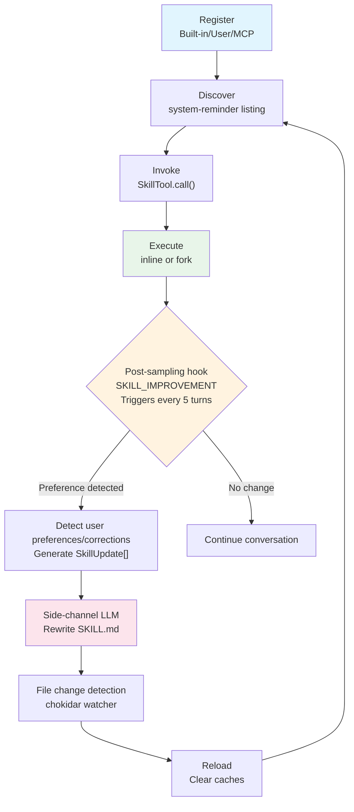

# Chapter 22: Skills System -- From Built-In to User-Defined

## Why This Matters

In previous chapters, we analyzed Claude Code's tool system, permission model, and context management. But a key extension layer has been weaving through all these systems: **the Skill system**.

When a user types `/batch migrate from react to vue`, Claude Code is not executing a "command" -- it's loading a carefully crafted prompt template, injecting it into the context window, causing the model to act according to a predefined workflow. The essence of the skill system is **callable prompt templates** -- it encodes repeatedly validated best practices as Markdown files, injected into the conversation flow via the `Skill` tool.

This design philosophy brings a profound engineering implication: skills are not code logic, but **structured knowledge**. A skill file can define which tools it needs, which model to use, and what execution context to run in, but its core is always a piece of Markdown text -- interpreted and executed by an LLM.

This chapter will start from built-in skills and progressively reveal the registration, discovery, loading, execution, and improvement mechanisms.

---

## 22.1 The Nature of Skills: Command Types and Registration

### BundledSkillDefinition Structure

Every skill is ultimately represented as a `Command` object. Built-in skills are registered through the `registerBundledSkill` function, with the following definition type:

```typescript
// skills/bundledSkills.ts:15-41
export type BundledSkillDefinition = {
  name: string
  description: string
  aliases?: string[]
  whenToUse?: string
  argumentHint?: string
  allowedTools?: string[]
  model?: string
  disableModelInvocation?: boolean
  userInvocable?: boolean
  isEnabled?: () => boolean
  hooks?: HooksSettings
  context?: 'inline' | 'fork'
  agent?: string
  files?: Record<string, string>
  getPromptForCommand: (
    args: string,
    context: ToolUseContext,
  ) => Promise<ContentBlockParam[]>
}
```

This type reveals several key dimensions of skills:

| Field | Purpose | Typical Value |
|-------|---------|---------------|
| `name` | Skill invocation name, corresponds to `/name` syntax | `"batch"`, `"simplify"` |
| `whenToUse` | Tells the model **when** to proactively invoke this skill | Appears in system-reminder |
| `allowedTools` | Tools auto-authorized during skill execution | `['Read', 'Grep', 'Glob']` |
| `context` | Execution context -- `inline` injects into main conversation, `fork` runs in a subagent | `'fork'` |
| `disableModelInvocation` | Prevents model from proactively calling, only user explicit input | `true` (batch) |
| `files` | Reference files bundled with the skill, extracted to disk on first call | verify skill's validation script |
| `getPromptForCommand` | **Core**: Generates prompt content injected into context | Returns `ContentBlockParam[]` |

The registration flow itself is straightforward -- `registerBundledSkill` converts the definition to a standard `Command` object and pushes it into an internal array:

```typescript
// skills/bundledSkills.ts:53-100
export function registerBundledSkill(definition: BundledSkillDefinition): void {
  const { files } = definition
  let skillRoot: string | undefined
  let getPromptForCommand = definition.getPromptForCommand

  if (files && Object.keys(files).length > 0) {
    skillRoot = getBundledSkillExtractDir(definition.name)
    let extractionPromise: Promise<string | null> | undefined
    const inner = definition.getPromptForCommand
    getPromptForCommand = async (args, ctx) => {
      extractionPromise ??= extractBundledSkillFiles(definition.name, files)
      const extractedDir = await extractionPromise
      const blocks = await inner(args, ctx)
      if (extractedDir === null) return blocks
      return prependBaseDir(blocks, extractedDir)
    }
  }

  const command: Command = {
    type: 'prompt',
    name: definition.name,
    // ... field mapping ...
    source: 'bundled',
    loadedFrom: 'bundled',
    getPromptForCommand,
  }
  bundledSkills.push(command)
}
```

Note the `extractionPromise ??= ...` pattern at line 67 -- this is a "memoized Promise." When multiple concurrent callers simultaneously trigger the first call, they all wait on **the same Promise**, avoiding race conditions that would cause duplicate file writes.

### File Extraction Safety Measures

Built-in skill reference file extraction involves security-sensitive filesystem operations. The source code uses the `O_NOFOLLOW | O_EXCL` flag combination (lines 176-184) in `safeWriteFile`, with 0o600 permissions. The comment explicitly explains the threat model:

```typescript
// skills/bundledSkills.ts:169-175
// The per-process nonce in getBundledSkillsRoot() is the primary defense
// against pre-created symlinks/dirs. Explicit 0o700/0o600 modes keep the
// nonce subtree owner-only even on umask=0, so an attacker who learns the
// nonce via inotify on the predictable parent still can't write into it.
```

This is a typical **defense in depth** design -- the per-process nonce is the primary defense, `O_NOFOLLOW` and `O_EXCL` are supplementary defenses.

---

## 22.2 Built-In Skills Inventory

All built-in skills are registered in the `initBundledSkills` function in `skills/bundled/index.ts`. Based on source analysis, built-in skills fall into two categories: **unconditionally registered** and **registered by Feature Flag**.

### Table 22-1: Built-In Skills Inventory

| Skill Name | Registration Condition | Function Summary | Execution Mode | User Invocable |
|------------|----------------------|------------------|----------------|----------------|
| `update-config` | Unconditional | Configure Claude Code via settings.json | inline | Yes |
| `keybindings` | Unconditional | Customize keyboard shortcuts | inline | Yes |
| `verify` | `USER_TYPE === 'ant'` | Verify code changes by running the app | inline | Yes |
| `debug` | Unconditional | Enable debug logs and diagnose issues | inline | Yes (model invocation disabled) |
| `lorem-ipsum` | Unconditional | Dev/test placeholder | inline | Yes |
| `skillify` | `USER_TYPE === 'ant'` | Capture current session as reusable skill | inline | Yes (model invocation disabled) |
| `remember` | `USER_TYPE === 'ant'` | Review and organize agent memory layers | inline | Yes |
| `simplify` | Unconditional | Review changed code for quality and efficiency | inline | Yes |
| `batch` | Unconditional | Parallel worktree agents for large-scale changes | inline | Yes (model invocation disabled) |
| `stuck` | `USER_TYPE === 'ant'` | Diagnose frozen/slow Claude Code sessions | inline | Yes |
| `dream` | `KAIROS \|\| KAIROS_DREAM` | autoDream memory consolidation | inline | Yes |
| `hunter` | `REVIEW_ARTIFACT` | Review artifacts | inline | Yes |
| `loop` | `AGENT_TRIGGERS` | Timed loop prompt execution | inline | Yes |
| `schedule` | `AGENT_TRIGGERS_REMOTE` | Create remote timed agent triggers | inline | Yes |
| `claude-api` | `BUILDING_CLAUDE_APPS` | Build apps using Claude API | inline | Yes |
| `claude-in-chrome` | `shouldAutoEnableClaudeInChrome()` | Chrome browser integration | inline | Yes |
| `run-skill-generator` | `RUN_SKILL_GENERATOR` | Skill generator | inline | Yes |

**Table 22-1: Built-in skill registration conditions inventory**

Feature Flag-gated skills use `require()` dynamic import rather than ESM's `import()`. The source has corresponding eslint-disable comments at lines 36-38 -- this is because Bun's build-time tree-shaking relies on static analysis, `feature()` calls are evaluated by Bun at compile time to boolean constants, thereby completely eliminating the entire `require()` branch in non-matching build configurations.

### Typical Skill Dissection: batch

The `batch` skill (`skills/bundled/batch.ts`) is an excellent sample for understanding how skills work. Its prompt template defines a three-phase workflow:

1. **Research and Planning Phase**: Enter Plan Mode, launch a foreground subagent to research the codebase, decompose into 5-30 independent work units
2. **Parallel Execution Phase**: Launch a background `worktree`-isolated agent for each work unit
3. **Progress Tracking Phase**: Maintain a status table, aggregate PR links

```typescript
// skills/bundled/batch.ts:9-10
const MIN_AGENTS = 5
const MAX_AGENTS = 30
```

The key engineering decision is `disableModelInvocation: true` (line 109) -- the batch skill **can only** be triggered by the user explicitly typing `/batch`; the model cannot autonomously decide to start a large-scale parallel refactor. This is a reasonable safety boundary -- batch operations create numerous worktrees and PRs, and autonomous triggering would be too risky.

### Typical Skill Dissection: simplify

The `simplify` skill demonstrates another common pattern -- launching **three parallel review agents** via `AgentTool`:

1. **Code reuse review**: Search for existing utility functions, flag duplicate implementations
2. **Code quality review**: Detect redundant state, parameter bloat, copy-paste, unnecessary comments
3. **Efficiency review**: Detect excess computation, missing concurrency, hot path bloat, memory leaks

These three agents run in parallel, with results aggregated for unified fixing -- the skill prompt itself encodes "human code review best practices" knowledge.

### Typical Skill Dissection: skillify (Session-to-Skill Distiller)

`skillify` is the most "meta" skill in the system -- its job is to **extract repeatable workflows from the current session into new skill files**. Source located at `skills/bundled/skillify.ts`.

**Gating**: `USER_TYPE === 'ant'` (line 159), only available to Anthropic internal users. `disableModelInvocation: true` (line 177), can only be triggered manually via `/skillify`.

```typescript
// skills/bundled/skillify.ts:158-162
export function registerSkillifySkill(): void {
  if (process.env.USER_TYPE !== 'ant') {
    return
  }
  // ...
}
```

**Data sources**: skillify's prompt template (lines 22-156) dynamically injects two contexts at runtime:

1. **Session Memory summary**: Obtained via `getSessionMemoryContent()` for the current session's structured summary (see Chapter 24 Session Memory section)
2. **User message extraction**: Via `extractUserMessages()` extracting all user messages after the compact boundary

```typescript
// skills/bundled/skillify.ts:179-194
async getPromptForCommand(args, context) {
  const sessionMemory =
    (await getSessionMemoryContent()) ?? 'No session memory available.'
  const userMessages = extractUserMessages(
    getMessagesAfterCompactBoundary(context.messages),
  )
  // ...
}
```

**Four-round interview structure**: skillify's prompt defines a structured four-round interview, all conducted via the `AskUserQuestion` tool (not plain text output), ensuring users have clear choices:

| Round | Goal | Key Decision |
|-------|------|-------------|
| Round 1 | High-level confirmation | Skill name, description, goals and success criteria |
| Round 2 | Detail supplement | Step list, parameter definitions, inline vs fork, storage location |
| Round 3 | Step-by-step refinement | Success criteria per step, deliverables, human checkpoints, parallelization opportunities |
| Round 4 | Final confirmation | Trigger conditions, trigger phrases, edge cases |

The prompt particularly emphasizes "pay attention to places where the user corrected you" (`Pay special attention to places where the user corrected you during the session`) -- these corrections often contain the most valuable tacit knowledge and should be encoded as hard rules in the skill.

**Generated SKILL.md format**: Skills generated by skillify follow standard frontmatter format with several key annotation conventions:
- Each step **must** include `Success criteria`
- Parallelizable steps use sub-numbering (3a, 3b)
- Steps requiring user action are marked `[human]`
- `allowed-tools` uses least-privilege mode (e.g., `Bash(gh:*)` rather than `Bash`)

skillify and SKILL_IMPROVEMENT (Section 22.8) are complementary: skillify creates skills from scratch, SKILL_IMPROVEMENT continuously improves them during use. Together they form a complete "create -> improve" lifecycle loop.

---

## 22.3 User-Defined Skills: Discovery and Loading in loadSkillsDir.ts

### Skill File Structure

User-defined skills follow a directory format:

```
.claude/skills/
  my-skill/
    SKILL.md        ← Main file (frontmatter + Markdown body)
    reference.ts    ← Optional reference file
```

`SKILL.md` files use YAML frontmatter to declare metadata:

```yaml
---
description: My custom skill
when_to_use: When the user asks for X
allowed-tools: Read, Grep, Bash
context: fork
model: opus
effort: high
arguments: [target, scope]
paths: src/components/**
---

# Skill prompt content here...
```

### Four-Layer Loading Priority

`getSkillDirCommands` function (`loadSkillsDir.ts:638`) loads skills from four sources in parallel, priority from highest to lowest:

```typescript
// skills/loadSkillsDir.ts:679-713
const [
  managedSkills,      // 1. Policy-managed skills (enterprise deployment)
  userSkills,         // 2. User global skills (~/.claude/skills/)
  projectSkillsNested,// 3. Project skills (.claude/skills/)
  additionalSkillsNested, // 4. --add-dir additional directories
  legacyCommands,     // 5. Legacy /commands/ directory (deprecated)
] = await Promise.all([
  loadSkillsFromSkillsDir(managedSkillsDir, 'policySettings'),
  loadSkillsFromSkillsDir(userSkillsDir, 'userSettings'),
  // ... project and additional directories ...
  loadSkillsFromCommandsDir(cwd),
])
```

Each source is independently switch-controlled:

| Source | Switch Condition | Directory Path |
|--------|-----------------|----------------|
| Policy managed | `!CLAUDE_CODE_DISABLE_POLICY_SKILLS` | `<managed>/.claude/skills/` |
| User global | `isSettingSourceEnabled('userSettings') && !skillsLocked` | `~/.claude/skills/` |
| Project local | `isSettingSourceEnabled('projectSettings') && !skillsLocked` | `.claude/skills/` (walks up) |
| --add-dir | Same as above | `<dir>/.claude/skills/` |
| Legacy commands | `!skillsLocked` | `.claude/commands/` |

**Table 22-2: Skill loading sources and switch conditions**

The `skillsLocked` flag comes from `isRestrictedToPluginOnly('skills')` -- when enterprise policy restricts to plugin-only skills, all local skill loading is skipped.

### Frontmatter Parsing

The `parseSkillFrontmatterFields` function (lines 185-265) is the shared parsing entry point for all skill sources. Fields it handles include:

```typescript
// skills/loadSkillsDir.ts:185-206
export function parseSkillFrontmatterFields(
  frontmatter: FrontmatterData,
  markdownContent: string,
  resolvedName: string,
): {
  displayName: string | undefined
  description: string
  allowedTools: string[]
  argumentHint: string | undefined
  whenToUse: string | undefined
  model: ReturnType<typeof parseUserSpecifiedModel> | undefined
  disableModelInvocation: boolean
  hooks: HooksSettings | undefined
  executionContext: 'fork' | undefined
  agent: string | undefined
  effort: EffortValue | undefined
  shell: FrontmatterShell | undefined
  // ...
}
```

Notable is the `effort` field (lines 228-235) -- skills can specify their own "effort level," overriding the global setting. Invalid effort values are silently ignored with a debug log, following the lenient parsing principle.

### Variable Substitution at Prompt Execution

`createSkillCommand`'s `getPromptForCommand` method (lines 344-399) performs the following processing chain when a skill is invoked:

```
Raw Markdown
    │
    ▼
Add "Base directory" prefix (if baseDir exists)
    │
    ▼
Argument substitution ($1, $2 or named arguments)
    │
    ▼
${CLAUDE_SKILL_DIR} → Skill directory path
    │
    ▼
${CLAUDE_SESSION_ID} → Current session ID
    │
    ▼
Shell command execution (!`command` syntax, MCP skills skip this step)
    │
    ▼
Return ContentBlockParam[]
```

**Figure 22-1: Skill prompt variable substitution flow**

The security boundary is explicit at line 374:

```typescript
// skills/loadSkillsDir.ts:372-376
// Security: MCP skills are remote and untrusted — never execute inline
// shell commands (!`…` / ```! … ```) from their markdown body.
if (loadedFrom !== 'mcp') {
  finalContent = await executeShellCommandsInPrompt(...)
}
```

MCP-sourced skills are treated as **untrusted** -- their `!command` syntax in Markdown won't be executed. This is a key defense against remote prompt injection leading to arbitrary command execution.

### Deduplication Mechanism

After loading, symbolic links are resolved via `realpath` to detect duplicates:

```typescript
// skills/loadSkillsDir.ts:728-734
const fileIds = await Promise.all(
  allSkillsWithPaths.map(({ skill, filePath }) =>
    skill.type === 'prompt'
      ? getFileIdentity(filePath)
      : Promise.resolve(null),
  ),
)
```

The source comment (lines 107-117) specifically mentions why `realpath` is used instead of inodes -- some virtual filesystems, container environments, or NFS mounts report unreliable inode values (e.g., inode 0 or precision loss on ExFAT).

---

## 22.4 Conditional Skills: Path Filtering and Dynamic Activation

### paths Frontmatter

Skills can declare through `paths` frontmatter that they only activate when the user operates on files at specific paths:

```yaml
---
paths: src/components/**, src/hooks/**
---
```

In `getSkillDirCommands` (lines 771-790), skills with `paths` don't immediately appear in the skill list:

```typescript
// skills/loadSkillsDir.ts:771-790
const unconditionalSkills: Command[] = []
const newConditionalSkills: Command[] = []
for (const skill of deduplicatedSkills) {
  if (
    skill.type === 'prompt' &&
    skill.paths &&
    skill.paths.length > 0 &&
    !activatedConditionalSkillNames.has(skill.name)
  ) {
    newConditionalSkills.push(skill)
  } else {
    unconditionalSkills.push(skill)
  }
}
for (const skill of newConditionalSkills) {
  conditionalSkills.set(skill.name, skill)
}
```

Conditional skills are stored in a `conditionalSkills` Map, waiting for **file operation-triggered activation**. When a user operates on a file matching the path via Read/Write/Edit tools, the `activateConditionalSkillsForPaths` function (lines 1001-1033) uses the `ignore` library for gitignore-style path matching, moving matching skills from the pending Map to the active set:

```typescript
// skills/loadSkillsDir.ts:1007-1033
for (const [name, skill] of conditionalSkills) {
  // ... path matching logic ...
  conditionalSkills.delete(name)
  activatedConditionalSkillNames.add(name)
}
```

Once activated, skill names are recorded in `activatedConditionalSkillNames` -- this Set is **not reset** when caches are cleared (`clearSkillCaches` only clears loading caches, not activation state), ensuring "once you touch a file, the skill stays available for the entire session" semantics.

### Dynamic Directory Discovery

Beyond conditional skills, the `discoverSkillDirsForPaths` function (lines 861-915) also implements **subdirectory-level skill discovery**. When users operate on deeply nested files, the system walks up from the file's directory to cwd, checking at each level whether a `.claude/skills/` directory exists. This allows each package in a monorepo to have its own skill set.

The discovery process has two safety checks:
1. **gitignore check**: Paths like `node_modules/pkg/.claude/skills/` are skipped
2. **Dedup check**: Already-checked paths are recorded in a `dynamicSkillDirs` Set, avoiding repeated `stat()` calls on nonexistent directories

---

## 22.5 MCP Skill Bridging: mcpSkillBuilders.ts

### Circular Dependency Problem

MCP skills (skills injected via MCP server connections) face a classic engineering problem: circular dependencies. Loading MCP skills requires the `createSkillCommand` and `parseSkillFrontmatterFields` functions from `loadSkillsDir.ts`, but `loadSkillsDir.ts`'s import chain ultimately reaches MCP client code, forming a cycle.

`mcpSkillBuilders.ts` breaks this cycle through a **one-time registration pattern**:

```typescript
// skills/mcpSkillBuilders.ts:26-44
export type MCPSkillBuilders = {
  createSkillCommand: typeof createSkillCommand
  parseSkillFrontmatterFields: typeof parseSkillFrontmatterFields
}

let builders: MCPSkillBuilders | null = null

export function registerMCPSkillBuilders(b: MCPSkillBuilders): void {
  builders = b
}

export function getMCPSkillBuilders(): MCPSkillBuilders {
  if (!builders) {
    throw new Error(
      'MCP skill builders not registered — loadSkillsDir.ts has not been evaluated yet',
    )
  }
  return builders
}
```

The source comment (lines 9-23) explains in detail why dynamic `import()` can't be used -- Bun's bunfs virtual filesystem causes module path resolution failures, and literal dynamic imports, while working in bunfs, would cause dependency-cruiser to detect new cycle violations.

Registration happens during `loadSkillsDir.ts`'s module initialization -- through `commands.ts`'s static import chain, this code executes early in startup, well before any MCP server establishes a connection.

---

## 22.6 Skill Search: EXPERIMENTAL_SKILL_SEARCH

### Remote Skill Discovery

At `SkillTool.ts` lines 108-116, the `EXPERIMENTAL_SKILL_SEARCH` flag gates loading of the remote skill search module:

```typescript
// tools/SkillTool/SkillTool.ts:108-116
const remoteSkillModules = feature('EXPERIMENTAL_SKILL_SEARCH')
  ? {
      ...(require('../../services/skillSearch/remoteSkillState.js') as ...),
      ...(require('../../services/skillSearch/remoteSkillLoader.js') as ...),
      ...(require('../../services/skillSearch/telemetry.js') as ...),
      ...(require('../../services/skillSearch/featureCheck.js') as ...),
    }
  : null
```

Remote skills use the `_canonical_<slug>` naming prefix -- in `validateInput` (lines 378-396), these skills bypass the local command registry for direct lookup:

```typescript
// tools/SkillTool/SkillTool.ts:381-395
const slug = remoteSkillModules!.stripCanonicalPrefix(normalizedCommandName)
if (slug !== null) {
  const meta = remoteSkillModules!.getDiscoveredRemoteSkill(slug)
  if (!meta) {
    return {
      result: false,
      message: `Remote skill ${slug} was not discovered in this session.`,
      errorCode: 6,
    }
  }
  return { result: true }
}
```

Remote skills load SKILL.md content from AKI/GCS (with local caching), and during execution **do not** perform shell command substitution or argument interpolation -- they are treated as declarative, pure Markdown.

At the permission level, remote skills receive auto-authorization (lines 488-504), but this authorization is placed **after** deny rule checks -- user-configured `Skill(_canonical_:*) deny` rules still take effect.

---

## 22.7 Skill Budget Constraints: 1% Context Window and Three-Level Truncation

### Budget Calculation

The space skills lists occupy in the context window is strictly controlled. Core constants are defined in `tools/SkillTool/prompt.ts`:

```typescript
// tools/SkillTool/prompt.ts:21-29
export const SKILL_BUDGET_CONTEXT_PERCENT = 0.01  // 1% of context window
export const CHARS_PER_TOKEN = 4
export const DEFAULT_CHAR_BUDGET = 8_000  // Fallback: 1% of 200k × 4
export const MAX_LISTING_DESC_CHARS = 250  // Per-entry hard cap
```

Budget formula: `contextWindowTokens x 4 x 0.01`. For a 200K token context window, this means 8,000 characters -- roughly 40 skills' names and descriptions.

### Three-Level Truncation Cascade

When the skill list exceeds budget, the `formatCommandsWithinBudget` function (lines 70-171) executes a three-level truncation cascade:

```
┌──────────────────────────────────────────────┐
│          Level 1: Full descriptions           │
│   "- batch: Research and plan a large-scale   │
│    change, then execute it in parallel..."    │
│                                               │
│   If total size ≤ budget → output             │
└─────────────────────┬────────────────────────┘
                      │ Exceeded
                      ▼
┌──────────────────────────────────────────────┐
│          Level 2: Truncated descriptions      │
│   Built-in skills keep full desc (never trunc)│
│   Non-built-in descs truncated to maxDescLen  │
│   maxDescLen = (remaining budget - name        │
│   overhead) / skill count                     │
│                                               │
│   If maxDescLen ≥ 20 → output                 │
└─────────────────────┬────────────────────────┘
                      │ maxDescLen < 20
                      ▼
┌──────────────────────────────────────────────┐
│          Level 3: Names only                  │
│   Built-in skills keep full descriptions      │
│   Non-built-in skills show name only          │
│   "- my-custom-skill"                         │
└──────────────────────────────────────────────┘
```

**Figure 22-2: Three-level truncation cascade strategy**

The key insight in this design is **built-in skills are never truncated** (lines 93-99). The reason is that built-in skills are validated core functionality -- their `whenToUse` descriptions are critical for the model's matching decisions. User-defined skills, once truncated, can still access detailed content through the `SkillTool`'s full loading mechanism at invocation time -- the listing is only for **discovery**, not for **execution**.

Each skill entry is also subject to the `MAX_LISTING_DESC_CHARS = 250` hard cap -- even in Level 1 mode, overly long `whenToUse` strings are truncated to 250 characters. The source comment explains:

> The listing is for discovery only -- the Skill tool loads full content on invoke, so verbose whenToUse strings waste turn-1 cache_creation tokens without improving match rate.

---

## 22.8 Skill Lifecycle: From Registration to Improvement

### Complete Lifecycle Flow



**Figure 22-3: Complete skill lifecycle flow**

### Phase One: Registration

- **Built-in skills**: `initBundledSkills()` registers synchronously at startup
- **User skills**: `getSkillDirCommands()` caches first load result via `memoize`
- **MCP skills**: Registered via `getMCPSkillBuilders()` after MCP server connection

### Phase Two: Discovery

Skills are discovered by the model through two mechanisms:
1. **system-reminder listing**: Names and descriptions of all loaded skills are injected into `<system-reminder>` tags
2. **Skill tool description**: `SkillTool.prompt` contains invocation instructions

### Phase Three: Invocation and Execution

`SkillTool.call` method (lines 580-841) handles invocation logic, with the core branch at line 622:

```typescript
// tools/SkillTool/SkillTool.ts:621-632
if (command?.type === 'prompt' && command.context === 'fork') {
  return executeForkedSkill(...)
}
// ... inline execution path ...
```

- **inline mode**: Skill prompt is injected into the main conversation's message stream; the model executes in the same context
- **fork mode**: Launches a subagent in an isolated context; returns a result summary upon completion

Inline mode implements tool authorization and model override injection through `contextModifier` -- it doesn't modify global state but chain-wraps the `getAppState()` function.

### Phase Four: Improvement (SKILL_IMPROVEMENT)

`skillImprovement.ts` implements a post-sampling hook that automatically detects user preferences and corrections during skill execution. This feature is protected by double gating:

```typescript
// utils/hooks/skillImprovement.ts:176-181
export function initSkillImprovement(): void {
  if (
    feature('SKILL_IMPROVEMENT') &&
    getFeatureValue_CACHED_MAY_BE_STALE('tengu_copper_panda', false)
  ) {
    registerPostSamplingHook(createSkillImprovementHook())
  }
}
```

`feature('SKILL_IMPROVEMENT')` is build-time gating (only `ant` builds include this code), `tengu_copper_panda` is a runtime GrowthBook flag. Double gating means even in internal builds, this feature can be remotely disabled.

**Trigger conditions**: Only runs when **project-level skills** (`projectSettings:` prefix) have been invoked in the current session (`findProjectSkill()` check). Triggers analysis every 5 user messages (`TURN_BATCH_SIZE = 5`):

```typescript
// utils/hooks/skillImprovement.ts:84-87
const userCount = count(context.messages, m => m.type === 'user')
if (userCount - lastAnalyzedCount < TURN_BATCH_SIZE) {
  return false
}
```

**Detection prompt**: The analyzer looks for three types of signals -- requests to add/modify/delete steps ("can you also ask me X"), preference expressions ("use a casual tone"), and corrections ("no, do X instead"). It explicitly ignores one-time conversations and behaviors already in the skill.

**Two-phase processing**:

1. **Detection phase**: Sends recent conversation fragments (only new messages since last check, not full history) to a small fast model (`getSmallFastModel()`), outputting `SkillUpdate[]` array stored in AppState
2. **Application phase**: `applySkillImprovement` (line 188 onwards) rewrites `.claude/skills/<name>/SKILL.md` via an **independent side-channel LLM call**. Uses `temperatureOverride: 0` for deterministic output and explicitly instructs "preserve frontmatter as-is, don't delete existing content unless explicitly replacing"

The entire process is fire-and-forget, not blocking the main conversation. File changes from the rewrite are detected by Phase Five's file watcher and trigger hot reload.

**Complementary relationship with skillify**: skillify (Section 22.2) creates skills from scratch -- after completing a workflow, the user manually calls `/skillify` and generates a SKILL.md through four interview rounds. SKILL_IMPROVEMENT continuously improves during use -- automatically detecting preference changes on each skill execution and updating definitions. Together they form the "create -> improve" lifecycle loop.

### Phase Five: Change Detection and Reload

`skillChangeDetector.ts` uses a chokidar file watcher to detect skill file changes:

```typescript
// utils/skills/skillChangeDetector.ts:27-28
const FILE_STABILITY_THRESHOLD_MS = 1000
const FILE_STABILITY_POLL_INTERVAL_MS = 500
```

When changes are detected:
1. Wait for 1-second file stability threshold
2. Aggregate multiple change events within a 300ms debounce window
3. Clear skill caches and command caches
4. Notify all subscribers via `skillsChanged` signal

Particularly notable is the platform adaptation at line 62:

```typescript
// utils/skills/skillChangeDetector.ts:62
const USE_POLLING = typeof Bun !== 'undefined'
```

Bun's native `fs.watch()` has a `PathWatcherManager` deadlock issue (oven-sh/bun#27469) -- when the file watch thread is delivering events, closing the watcher causes both threads to hang forever on `__ulock_wait2`. The source chose stat() polling as a temporary solution, annotating the upstream fix removal plan.

---

## 22.9 Skill Tool Permission Model

### Auto-Authorization Conditions

Not all skill invocations require user confirmation. In `SkillTool.checkPermissions` (lines 529-538), skills meeting the `skillHasOnlySafeProperties` condition are auto-authorized:

```typescript
// tools/SkillTool/SkillTool.ts:875-908
const SAFE_SKILL_PROPERTIES = new Set([
  'type', 'progressMessage', 'contentLength', 'model', 'effort',
  'source', 'name', 'description', 'isEnabled', 'isHidden',
  'aliases', 'argumentHint', 'whenToUse', 'paths', 'version',
  'disableModelInvocation', 'userInvocable', 'loadedFrom',
  // ...
])
```

This is an **allowlist pattern** -- only skills declaring allowlisted properties get auto-authorized. If new properties are added to the `PromptCommand` type in the future, they default to **requiring permission** until explicitly added to the allowlist. Skills containing sensitive fields like `allowedTools`, `hooks`, etc. trigger user confirmation dialogs.

### Permission Rule Matching

Permission checks support exact matching and prefix wildcards:

```typescript
// tools/SkillTool/SkillTool.ts:451-467
const ruleMatches = (ruleContent: string): boolean => {
  const normalizedRule = ruleContent.startsWith('/')
    ? ruleContent.substring(1)
    : ruleContent
  if (normalizedRule === commandName) return true
  if (normalizedRule.endsWith(':*')) {
    const prefix = normalizedRule.slice(0, -2)
    return commandName.startsWith(prefix)
  }
  return false
}
```

This means users can configure `Skill(review:*) allow` to authorize all skills starting with `review` in one go.

---

## Pattern Distillation

Reusable patterns extracted from the skill system design:

**Pattern One: Memoized Promise Pattern**
- **Problem solved**: Race conditions when multiple concurrent callers simultaneously trigger first initialization
- **Pattern**: `extractionPromise ??= extractBundledSkillFiles(...)` -- using `??=` ensures only one Promise is created, all callers wait on the same result
- **Precondition**: Initialization operation is idempotent and results are reusable

**Pattern Two: Allowlist Security Model**
- **Problem solved**: New properties are safe by default -- unknown properties require permission
- **Pattern**: `SAFE_SKILL_PROPERTIES` allowlist only contains known-safe fields; new fields automatically enter the "permission required" path
- **Precondition**: Property set grows over time, safety needs conservative defaults

**Pattern Three: Layered Trust and Capability Degradation**
- **Problem solved**: Extensions from different sources have different trust levels
- **Pattern**: Built-in skills (never truncated) > User local skills (truncatable, can execute shell) > MCP remote skills (shell prohibited, auto-auth subject to deny rules)
- **Precondition**: System accepts input from multiple trust domains

**Pattern Four: Budget-Aware Progressive Degradation**
- **Problem solved**: Displaying variable numbers of entries under limited resources (context window)
- **Pattern**: Three-level truncation cascade (full descriptions -> truncated descriptions -> names only), high-priority entries never truncated
- **Precondition**: Entry count is unpredictable, resource budget is fixed

---

## What Users Can Do

**Create and use custom skills to boost productivity:**

1. **Create your own skills.** Write a Markdown file in `.claude/skills/my-skill/SKILL.md`, declare metadata via YAML frontmatter (description, allowed tools, execution context, etc.), and use it via `/my-skill` or automatic model invocation.

2. **Use `paths` frontmatter for conditional activation.** If a skill is only needed when operating in specific directories (e.g., `paths: src/components/**`), it won't appear in all conversations but auto-activates when you operate on matching files -- saving precious context window space.

3. **Use `/skillify` to capture sessions as skills.** If you've established an effective workflow in a conversation, `/skillify` can automatically convert it into a reusable skill file.

4. **Understand the 1% budget limit.** The skill listing takes only 1% of the context window (~8000 characters); exceeding it triggers truncation. Keeping `whenToUse` descriptions concise helps display more skills within the limited budget.

5. **Use permission prefix wildcards.** Configuring `Skill(my-prefix:*) allow` authorizes all skills starting with `my-prefix` at once, reducing confirmation dialog interruptions.

6. **Note MCP skill security restrictions.** Shell command syntax (`!command`) in remote MCP skills won't be executed -- this is a security defense against remote prompt injection. If your skill needs to execute shell commands, use local skills.

---

## 22.10 Summary

The skill system is Claude Code's core mechanism for encoding **best practice knowledge** into executable workflows. Its design follows several key principles:

1. **Prompts as code**: Skills aren't traditional plugin APIs -- they're Markdown text interpreted and executed by LLMs. This makes the barrier to creating and iterating skills extremely low.

2. **Layered trust**: Built-in skills are never truncated, MCP skills prohibit shell execution, remote skills get auto-authorization but are subject to deny rules -- each source has a different trust level.

3. **Self-improvement**: The `SKILL_IMPROVEMENT` mechanism lets skills automatically evolve based on user feedback during use -- a closed "learning from use" loop.

4. **Budget awareness**: The 1% context window hard budget and three-level truncation cascade ensure skill discovery doesn't crowd out actual work's context space.

In the next chapter, we'll examine Claude Code's extensibility from another angle -- peeking at the system's evolution direction through the unreleased feature pipeline behind 89 Feature Flags in the source code.

---

## Version Evolution: v2.1.91 Changes

> The following analysis is based on v2.1.91 bundle signal comparison.

v2.1.91 adds the `tengu_bridge_client_presence_enabled` event and `CLAUDE_CODE_DISABLE_CLAUDE_API_SKILL` environment variable. The former indicates that the IDE bridging protocol has added client presence detection capability; the latter provides a runtime switch to disable the built-in Claude API skill -- potentially used in enterprise compliance scenarios to restrict specific skill availability.
