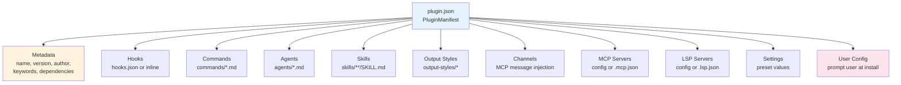
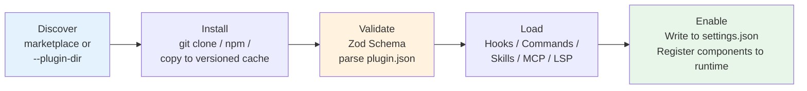
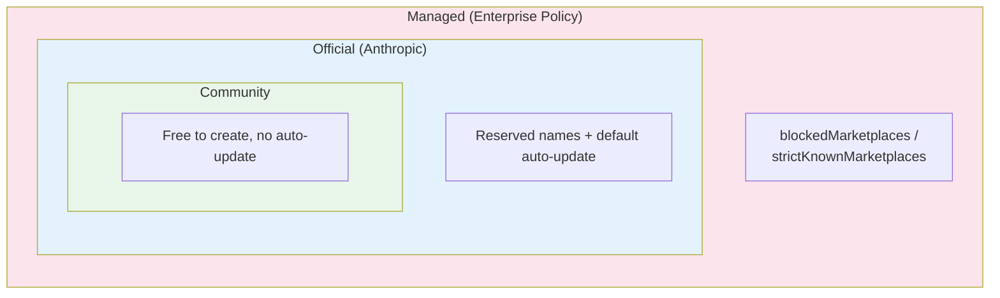

# Chapter 22b: Plugin System -- Extension Engineering from Packaging to Marketplace

> **Positioning**: This chapter analyzes Claude Code's Plugin system -- the top-level container of the extension architecture, covering the complete engineering from packaging and distribution to marketplace. Prerequisites: Chapter 22. Target audience: readers who want to understand the extension engineering of CC plugins from packaging to marketplace.

## Why This Matters

Chapter 22 analyzed the skill system -- how Claude Code turns Markdown files into model-executable instructions. But skills are just the tip of the iceberg of Claude Code's extension mechanisms. When you want to package a set of skills, several Hooks, a couple of MCP servers, and a suite of custom commands into a distributable product, what you need isn't the skill system but the **plugin system**.

A Plugin is the top-level container of Claude Code's extension architecture. It answers not "how to define a capability" but a series of harder questions: **How to discover capabilities? How to trust them? How to install, update, and uninstall them? How to let a thousand users use the same plugin without interfering with each other?**

The engineering complexity of these questions far exceeds skills themselves. Claude Code uses nearly 1,700 lines of Zod Schema to define the plugin manifest format, 25 discriminated union error types to handle loading failures, versioned caching to isolate different plugin versions, and secure storage to separate sensitive configuration. This infrastructure gives a closed-source AI Agent product extension capabilities similar to an open-source ecosystem -- and this is the core design this chapter will analyze.

If Chapter 22 analyzed "what's inside a plugin," this chapter analyzes "how the plugin container itself is designed."

## Source Code Analysis

### 22b.1 Plugin Manifest: Nearly 1,700 Lines of Zod Schema Design

Everything about a plugin starts with `plugin.json` -- a JSON manifest file defining the plugin's metadata and all components it provides. This manifest's validation Schema takes 1,681 lines (`schemas.ts`), making it the largest single Schema definition in Claude Code.

The manifest's top-level structure is composed of 11 sub-Schemas:

```typescript
// restored-src/src/utils/plugins/schemas.ts:884-898
export const PluginManifestSchema = lazySchema(() =>
  z.object({
    ...PluginManifestMetadataSchema().shape,
    ...PluginManifestHooksSchema().partial().shape,
    ...PluginManifestCommandsSchema().partial().shape,
    ...PluginManifestAgentsSchema().partial().shape,
    ...PluginManifestSkillsSchema().partial().shape,
    ...PluginManifestOutputStylesSchema().partial().shape,
    ...PluginManifestChannelsSchema().partial().shape,
    ...PluginManifestMcpServerSchema().partial().shape,
    ...PluginManifestLspServerSchema().partial().shape,
    ...PluginManifestSettingsSchema().partial().shape,
    ...PluginManifestUserConfigSchema().partial().shape,
  }),
)
```

Except for `MetadataSchema`, the remaining 10 sub-Schemas all use `.partial()` -- meaning a plugin can provide any subset. A Hook-only plugin and a plugin providing a complete toolchain share the same manifest format, just filling different fields.



Three things are worth noting about this design.

**First, path security validation.** All file paths in the manifest must start with `./` and cannot contain `..`. This prevents plugins from accessing other files on the host system through path traversal.

**Second, marketplace name reservation.** Manifest validation applies multiple filtering layers to marketplace names:

```typescript
// restored-src/src/utils/plugins/schemas.ts:19-28
export const ALLOWED_OFFICIAL_MARKETPLACE_NAMES = new Set([
  'claude-code-marketplace',
  'claude-code-plugins',
  'claude-plugins-official',
  'anthropic-marketplace',
  'anthropic-plugins',
  'agent-skills',
  'life-sciences',
  'knowledge-work-plugins',
])
```

The validation chain includes: no spaces, no path separators, no impersonating official names, no reserved name `inline` (for `--plugin-dir` session plugins) or `builtin` (for built-in plugins). All validations are completed in `MarketplaceNameSchema` (lines 216-245), using Zod's `.refine()` chain expression.

**Third, commands can be defined inline.** Besides loading from files, commands can also be inlined via `CommandMetadataSchema`:

```typescript
// restored-src/src/utils/plugins/schemas.ts:385-416
export const CommandMetadataSchema = lazySchema(() =>
  z.object({
      source: RelativeCommandPath().optional(),
      content: z.string().optional(),
      description: z.string().optional(),
      argumentHint: z.string().optional(),
      // ...
  }),
)
```

`source` (file path) and `content` (inline Markdown) are mutually exclusive. This lets small plugins embed command content directly in `plugin.json` without creating additional Markdown files.

### 22b.2 Lifecycle: 5 Phases from Discovery to Component Loading

A plugin goes through 5 phases from files on disk to being used by Claude Code:



The **discovery phase** has two sources (in order of precedence):

```typescript
// restored-src/src/utils/plugins/pluginLoader.ts:1-33
// Plugin Discovery Sources (in order of precedence):
// 1. Marketplace-based plugins (plugin@marketplace format in settings)
// 2. Session-only plugins (from --plugin-dir CLI flag or SDK plugins option)
```

The key design in the **installation phase** is **versioned caching**. Each plugin is copied to `~/.claude/plugins/cache/{marketplace}/{plugin}/{version}/` rather than running from its original location. This guarantees: different versions of the same plugin don't interfere; uninstalling only requires deleting the cache directory; offline scenarios can boot from cache.

The **loading phase** uses `memoize` to ensure each component loads only once. `getPluginCommands()` and `getPluginSkills()` are both memoized async factory functions. This matters for Agent performance -- Hooks may fire on every tool call, and re-parsing Markdown files each time would accumulate latency.

Component loading priority is also noteworthy. In `loadAllCommands()`, the registration order is:

1. Bundled skills (compiled-in at build time)
2. Built-in plugin skills (skills provided by built-in plugins)
3. Skill directory commands (user local `~/.claude/skills/`)
4. Workflow commands
5. **Plugin commands** (commands from marketplace-installed plugins)
6. Plugin skills
7. Built-in commands

This ordering means: user local custom skills take priority over same-named plugin commands -- user customization is never overridden by plugins.

### 22b.3 Trust Model: Layered Trust and Pre-Install Audit

The plugin system faces a trust challenge unique to Agents: plugins aren't just passive UI extensions -- they can inject commands before and after tool execution via Hooks, provide new tools via MCP servers, and even influence model behavior through skills.

Claude Code's response is **layered trust**.

**Layer one: Persistent security warning.** In the plugin management interface, the `PluginTrustWarning` component is always visible:

```typescript
// restored-src/src/commands/plugin/PluginTrustWarning.tsx:1-31
// "Make sure you trust a plugin before installing, updating, or using it"
```

This is not a one-time popup confirmation, but a **persistently displayed** warning in the `/plugin` management interface. Users see it every time they enter the plugin management interface -- safer than "confirm once at installation and never mention it again," but not as disruptive as popping up on every operation.

**Layer two: Project-level trust.** The `TrustDialog` component performs a security audit on the project directory, checking for MCP servers, Hooks, bash permissions, API key helpers, dangerous environment variables, etc. Trust state is stored in the project configuration's `hasTrustDialogAccepted` field, and searches up the directory hierarchy -- if a parent directory has been trusted, child directories inherit trust.

**Layer three: Sensitive value isolation.** Plugin options marked `sensitive: true` are stored in secure storage (keychain on macOS, `.credentials.json` on other platforms), not in `settings.json`:

```typescript
// restored-src/src/utils/plugins/pluginOptionsStorage.ts:1-13
// Storage splits by `sensitive`:
//   - `sensitive: true`  → secureStorage (keychain on macOS, .credentials.json elsewhere)
//   - everything else    → settings.json `pluginConfigs[pluginId].options`
```

At load time, the two sources are merged, with secure storage taking priority:

```typescript
// restored-src/src/utils/plugins/pluginOptionsStorage.ts:56-77
export const loadPluginOptions = memoize(
  (pluginId: string): PluginOptionValues => {
    // ...
    // secureStorage wins on collision — schema determines destination so
    // collision shouldn't happen, but if a user hand-edits settings.json we
    // trust the more secure source.
    return { ...nonSensitive, ...sensitive }
  },
)
```

The source code comment reveals a practical consideration: `memoize` is not just a performance optimization but a security necessity -- each keychain read triggers a `security find-generic-password` subprocess (~50-100ms), and if Hooks fire on every tool call, not memoizing would cause noticeable latency.

### 22b.4 Marketplace System: Discovery, Installation, and Dependency Resolution

The Plugin Marketplace is a JSON manifest describing a set of installable plugins. Marketplace sources support 9 types:

```typescript
// restored-src/src/utils/plugins/schemas.ts:906-907
export const MarketplaceSourceSchema = lazySchema(() =>
  z.discriminatedUnion('source', [
    // url, github, git, npm, file, directory, hostPattern, pathPattern, settings
  ]),
)
```

These types cover almost all distribution methods from direct URLs to GitHub repositories to npm packages to local directories. `hostPattern` and `pathPattern` even support auto-recommending marketplaces based on the user's hostname or project path -- designed for enterprise deployment scenarios.

Marketplace loading uses **graceful degradation**:

```typescript
// restored-src/src/utils/plugins/marketplaceHelpers.ts
loadMarketplacesWithGracefulDegradation() // Single marketplace failure doesn't affect others
```

The function name itself is a design declaration: in a multi-source system, failure of any single source should not render the entire system unavailable.

**Dependency resolution** is another important mechanism. Plugins can declare dependencies in the manifest:

```typescript
// restored-src/src/utils/plugins/schemas.ts:313-318
dependencies: z
  .array(DependencyRefSchema())
  .optional()
  .describe(
    'Plugins that must be enabled for this plugin to function. Bare names (no "@marketplace") are resolved against the declaring plugin\'s own marketplace.',
  ),
```

Bare names (like `my-dep`) are automatically resolved to the declaring plugin's marketplace -- avoiding redundant marketplace name writing when forcing dependencies from the same marketplace.

**Installation scopes** are divided into 4 levels:

| Scope | Storage Location | Visibility | Typical Use |
|-------|-----------------|------------|-------------|
| `user` | `~/.claude/plugins/` | All projects | Personal common tools |
| `project` | `.claude/plugins/` | All project collaborators | Team standard tools |
| `local` | `.claude-code.json` | Current session | Temporary testing |
| `managed` | `managed-settings.json` | Policy-controlled | Enterprise unified management |

The design of these four scopes is analogous to Git's configuration hierarchy (system -> global -> local), but with an added `managed` layer for enterprise policy control.

### 22b.5 Error Governance: 25 Error Variants with Type-Safe Handling

Most plugin systems handle errors with string matching -- "if error message contains 'not found'". Claude Code uses a much stricter approach: **discriminated union**.

```typescript
// restored-src/src/types/plugin.ts:101-283
export type PluginError =
  | { type: 'path-not-found'; source: string; plugin?: string; path: string; component: PluginComponent }
  | { type: 'git-auth-failed'; source: string; plugin?: string; gitUrl: string; authType: 'ssh' | 'https' }
  | { type: 'git-timeout'; source: string; plugin?: string; gitUrl: string; operation: 'clone' | 'pull' }
  | { type: 'network-error'; source: string; plugin?: string; url: string; details?: string }
  | { type: 'manifest-parse-error'; source: string; plugin?: string; manifestPath: string; parseError: string }
  | { type: 'manifest-validation-error'; source: string; plugin?: string; manifestPath: string; validationErrors: string[] }
  // ... 16+ more variants
  | { type: 'marketplace-blocked-by-policy'; source: string; marketplace: string; blockedByBlocklist?: boolean; allowedSources: string[] }
  | { type: 'dependency-unsatisfied'; source: string; plugin: string; dependency: string; reason: 'not-enabled' | 'not-found' }
  | { type: 'generic-error'; source: string; plugin?: string; error: string }
```

25 unique error types (26 union variants, where `lsp-config-invalid` appears twice), each with context fields specific to that error. `git-auth-failed` carries `authType` (ssh or https), `marketplace-blocked-by-policy` carries `allowedSources` (list of allowed sources), `dependency-unsatisfied` carries `reason` (not enabled or not found).

The source code comment also reveals a progressive strategy:

```typescript
// restored-src/src/types/plugin.ts:86-99
// IMPLEMENTATION STATUS:
// Currently used in production (2 types):
// - generic-error: Used for various plugin loading failures
// - plugin-not-found: Used when plugin not found in marketplace
//
// Planned for future use (10 types - see TODOs in pluginLoader.ts):
// These unused types support UI formatting and provide a clear roadmap for
// improving error specificity.
```

Define complete types first, then implement progressively -- this is a "type-first" evolution strategy. Defining 22 error types doesn't require implementing all of them immediately, but once defined, new error handling code has clear target types instead of constantly adding new string cases.

### 22b.6 Auto-Update and Recommendations: Three Recommendation Sources

The plugin system's "pull" (user proactive installation) and "push" (system-recommended installation) both have complete designs.

**Auto-update** defaults to enabled only for official marketplaces, but excludes certain ones:

```typescript
// restored-src/src/utils/plugins/schemas.ts:35
const NO_AUTO_UPDATE_OFFICIAL_MARKETPLACES = new Set(['knowledge-work-plugins'])
```

After updates complete, users are notified via the notification system to execute `/reload-plugins` to refresh (see Chapter 18 on the Hook system). There's an elegant race condition handling here: updates may complete before the REPL is mounted, so notifications use a `pendingNotification` queue buffer.

The **recommendation system** has three sources:

1. **Claude Code Hint**: External tools (such as SDKs) output `<claude-code-hint />` tags via stderr; CC parses these and recommends corresponding plugins
2. **LSP detection**: When editing files with specific extensions, if the system has a corresponding LSP binary but no related plugin is installed, automatic recommendation occurs
3. **Custom recommendations**: Via the general-purpose state machine provided by `usePluginRecommendationBase`

All three sources share a key constraint: **each plugin is recommended at most once per session** (show-once semantics). This is implemented via configuration persistence -- already-recommended plugin IDs are recorded in config files, avoiding cross-session repetition. The recommendation menu also has a 30-second auto-dismiss mechanism, distinguishing between user active cancellation and timeout dismissal for different analytics events.

### 22b.7 Command Migration Pattern: Progressive Evolution from Built-In to Plugin

Claude Code is progressively migrating built-in commands to plugins. The `createMovedToPluginCommand` factory function reveals this evolution strategy:

```typescript
// restored-src/src/commands/createMovedToPluginCommand.ts:22-65
export function createMovedToPluginCommand({
  name, description, progressMessage,
  pluginName, pluginCommand,
  getPromptWhileMarketplaceIsPrivate,
}: Options): Command {
  return {
    type: 'prompt',
    // ...
    async getPromptForCommand(args, context) {
      if (process.env.USER_TYPE === 'ant') {
        return [{ type: 'text', text: `This command has been moved to a plugin...` }]
      }
      return getPromptWhileMarketplaceIsPrivate(args, context)
    },
  }
}
```

This function solves a practical problem: **how to migrate commands while the marketplace isn't yet public?** The answer is to split by user type -- internal users (`USER_TYPE === 'ant'`) see plugin installation instructions, while external users see the original inline prompt. Once the marketplace goes public, the `getPromptWhileMarketplaceIsPrivate` parameter and branching logic can be removed.

Already-migrated commands include `pr-comments` (PR comment fetching) and `security-review` (security audit). Post-migration commands are named in `pluginName:commandName` format, maintaining namespace isolation.

The deeper significance of this pattern: **Claude Code is evolving from a feature-complete monolith into a platform**. Built-in commands becoming plugins means these capabilities can be replaced, extended, or recombined by the community -- without forking the entire project.

### 22b.8 Plugin's Agent Design Philosophy Significance

Returning to the higher-level perspective. Why does an AI Agent need a plugin system?

**Traditional software plugin systems** (like VS Code, Vim) solve "letting users customize editor behavior" -- essentially UI and feature extensions. But an **AI Agent's plugin system** solves a fundamentally different problem: **runtime composability of Agent capabilities**.

What a Claude Code Agent can do in each session depends on which tools, skills, and Hooks it has loaded. The plugin system makes this capability set dynamically adjustable:

1. **Capability unloadability**: Users can disable an entire plugin to shut down a group of related capabilities. This isn't traditional "turning off a feature" -- it's letting the Agent lose an entire dimension of cognitive and behavioral capability at runtime.

2. **Capability source diversification**: Agent capabilities no longer come only from one organization's development team, but from multiple providers in the marketplace. The existence of `createMovedToPluginCommand` proves this direction -- even Anthropic's own built-in commands are migrating to plugins.

3. **User control of capability boundaries**: 4-level installation scopes (user/project/local/managed) let different stakeholders control different levels of capability boundaries. Enterprise administrators use `managed` policies to restrict allowed marketplaces and plugins; project leads use `project` scope for team-wide configuration; developers use `user` scope for personal preferences.

4. **Trust as a capability precondition**: In traditional plugin systems, trust checking is a one-time confirmation at installation. In an Agent context, trust carries greater weight -- a trusted plugin can execute commands **before and after every tool call** via Hooks (see Chapter 18) and provide **new tools** to the model via MCP servers. This is why Claude Code's trust model is layered and continuous, rather than one-time.

From this perspective, the `PluginManifest`'s 11 sub-Schemas don't just "define what a plugin can provide" -- they define **11 pluggable dimensions of Agent capability**.

### 22b.9 A Third Path Between Open Source and Closed Source

Claude Code is a closed-source commercial product. But its plugin system creates an interesting middle ground -- **closed core + open ecosystem**.

The **marketplace name reservation mechanism** (Section 22b.1) reveals the concrete implementation of this strategy. 8 official reserved names protect Anthropic's brand namespace, but the `MarketplaceNameSchema` validation logic **intentionally doesn't block indirect variations**:

```typescript
// restored-src/src/utils/plugins/schemas.ts:7-13
// This validation blocks direct impersonation attempts like "anthropic-official",
// "claude-marketplace", etc. Indirect variations (e.g., "my-claude-marketplace")
// are not blocked intentionally to avoid false positives on legitimate names.
```

This is a carefully weighed design: strict enough to prevent impersonation, but lenient enough not to suppress the community from using the word "claude" to build their own marketplaces.

The **differentiated auto-update strategy** also reflects this positioning. Official marketplaces default to auto-update enabled, community marketplaces default to disabled -- this gives the official marketplace a distribution advantage without blocking the existence of community marketplaces.

The **`managed` layer of installation scopes** further reveals commercial considerations. Enterprises can control allowed marketplaces and plugins through `managed-settings.json` (read-only policy file). This satisfies the enterprise customer need of "my employees can only use approved plugins" while retaining extension flexibility within the approved scope.



This three-layer structure lets Claude Code find a balance between commercial and open:

- **For Anthropic**: Keep the core product closed-source, control quality and security through the official marketplace
- **For the community**: Provide a complete plugin API and marketplace mechanism, allowing third-party distribution
- **For enterprises**: Provide governance capability through the policy layer, meeting compliance requirements

The takeaway for Agent ecosystem builders: **you don't need to open-source your core to achieve ecosystem effects**. You just need to open extension interfaces, provide distribution infrastructure (marketplace), and establish governance mechanisms (trust + policy), and the community can build value around your Agent.

However, this pattern has an inherent risk: **the ecosystem depends on platform goodwill**. If the platform tightens plugin APIs, restricts marketplace admission, or changes distribution rules, ecosystem participants have no fork fallback -- this is the fundamental disadvantage of a closed core compared to open-source foundation governance. Claude Code currently reduces this risk through open manifest formats and multi-source marketplace mechanisms, but long-term ecosystem health still depends on the platform's governance commitment.

---

## Pattern Distillation

### Pattern One: Manifest as Contract

**Problem solved**: How does an extension system validate third-party contributions without introducing runtime errors?

**Code template**: Define the complete manifest format using a Schema validation library (e.g., Zod), with each field carrying type, constraints, and description. Manifest validation completes during the loading phase, with validation failures producing structured errors rather than runtime exceptions. All file paths must start with `./`, and `..` traversal is not allowed.

**Precondition**: The extension system accepts configuration files from untrusted sources.

### Pattern Two: Type-First Evolution

**Problem solved**: How to progressively improve error handling in a large system without a one-time refactor of all error sites?

**Code template**: Define the complete discriminated union error types first (22 types), but only use them at a few sites (2 types), with the rest marked as "planned for future use." New code has clear target types, and old code can be migrated gradually.

**Precondition**: The team is willing to tolerate temporarily unused type definitions, treating them as a "type roadmap" rather than "dead code."

### Pattern Three: Sensitive Value Shunting

**Problem solved**: How to securely store API keys, passwords, and other sensitive values in plugin configuration?

**Code template**: Mark each configuration field in the Schema as `sensitive: true/false`. Shunt during storage -- sensitive values go to system secure storage (e.g., macOS keychain), non-sensitive values go to regular config files. At read time, merge both sources with secure storage taking priority. Use `memoize` caching to avoid repeated secure storage access.

**Precondition**: The target platform provides a secure storage API (keychain, credential manager, etc.).

### Pattern Four: Closed Core, Open Ecosystem

**Problem solved**: How does a closed-source product achieve the extension effects of an open-source ecosystem?

**Core approach**: Open extension manifest format + multi-source marketplace discovery + layered policy control (see the full analysis in Section 22b.9). Key design: reserve brand namespace but don't restrict community use of brand terms; official marketplace has distribution advantages but doesn't exclude third-party marketplaces.

**Risk**: Ecosystem health depends on the platform's governance commitment, lacking a fork fallback.

**Precondition**: The product already has a sufficient user base to make the ecosystem attractive.

---

## What Users Can Do

1. **Build your own plugins**: Create `plugin.json`, place component files in `commands/`, `skills/`, `hooks/`, and validate the manifest format with `claude plugin validate`. Start with a minimal single-Hook plugin, then gradually add components.

2. **Design plugin trust boundaries**: If your plugin needs API keys, mark them as `sensitive: true` in `userConfig`. Don't hardcode sensitive values in command strings -- use `${user_config.KEY}` template variables and let Claude Code's storage system handle security.

3. **Use installation scopes to manage team tools**: Install team standard tools in `project` scope (`.claude/plugins/`), and personal preference tools in `user` scope. This way `.claude/plugins/` can be committed to Git, and team members automatically get a unified toolset.

4. **Reference Claude Code's layering when designing plugin systems for your own Agent**: Manifest validation (defending against third-party input) + versioned cache (isolation) + secure storage shunting (protecting sensitive values) + policy layer (enterprise governance). These four layers are the minimum viable plugin infrastructure.

5. **Consider the "command migration" strategy**: If your Agent has built-in features planned for community maintenance, reference the `createMovedToPluginCommand` branching pattern -- internal users migrate and test first, external users maintain the existing experience, then switch uniformly once the marketplace goes public.
