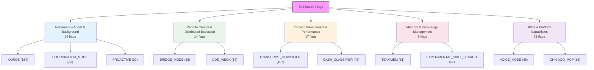
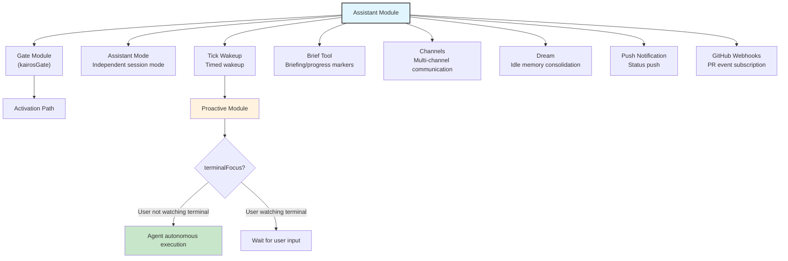
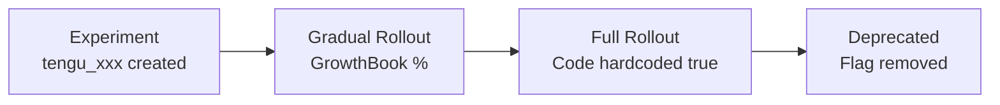

# Chapter 23: The Unreleased Feature Pipeline -- The Roadmap Behind 89 Feature Flags

> **Positioning**: This chapter analyzes the unreleased feature pipeline gated by 89 Feature Flags in the Claude Code source code and their implementation depth. Prerequisites: none, can be read independently. Target audience: readers who want to understand how CC manages its unreleased feature pipeline through 89 Feature Flags, or developers who want to implement a feature flag system in their own product.

## Why This Matters

In the preceding 22 chapters, we analyzed Claude Code's publicly released features. But the source code hides another dimension: **89 Feature Flags gate features not yet open to all users**. These flags are implemented through Bun's build-time `feature()` function -- the compiler evaluates `feature('FLAG_NAME')` to `true` or `false` under different build configurations, and dead code elimination completely removes the disabled branch.

This means code gated by `feature('KAIROS')` doesn't exist at all in public builds -- it only appears in internal builds (`USER_TYPE === 'ant'`) or experimental branches. But in our restored source code, both branches of every flag are preserved, giving us a unique perspective to examine Claude Code's feature evolution direction.

This chapter categorizes these 89 flags into five major groups by functional domain, analyzing the implementation depth and interrelationships of core unreleased features. It must be emphasized: **this chapter's analysis is based on observable implementation state in source code; we do not speculate on business strategy or predict release timelines.** A flag's existence does not equate to an imminent feature release -- many flags may be experimental prototypes, A/B test configurations, or abandoned exploration directions.

---

## 23.1 Feature Flag Mechanism

### Build-Time Evaluation

Claude Code uses the `feature()` function provided by Bun's `bun:bundle` module:

```typescript
import { feature } from 'bun:bundle'

if (feature('KAIROS')) {
  const { registerDreamSkill } = require('./dream.js')
  registerDreamSkill()
}
```

`feature()` is replaced at build time with a literal `true` or `false`. When the result is `false`, the entire `if` block is removed during tree-shaking. This explains why gated code uses `require()` instead of `import()` -- `require()` is an expression that can appear inside `if` blocks, allowing dead code elimination to remove it along with its module dependencies.

### Reference Counts and Maturity Inference

By counting each flag's references in the source code, we can roughly infer implementation depth:

| Reference Range | Meaning | Typical Flags |
|----------------|---------|---------------|
| 100+ | Deep integration, touches multiple core subsystems | KAIROS (154), TRANSCRIPT_CLASSIFIER (107) |
| 30-99 | Feature complete, woven into multiple modules | TEAMMEM (51), VOICE_MODE (46), PROACTIVE (37) |
| 10-29 | Fairly complete, involves specific subsystems | CONTEXT_COLLAPSE (20), CHICAGO_MCP (16) |
| 3-9 | Initial implementation or limited scope | TOKEN_BUDGET (9), WEB_BROWSER_TOOL (4) |
| 1-2 | Prototype/exploration stage or pure toggle | ULTRATHINK (1), ABLATION_BASELINE (1) |

**Table 23-1: Feature Flag reference counts and maturity inference**

High reference counts don't necessarily mean "about to release" -- KAIROS's 154 references may precisely indicate it's a complex system undergoing long-term progressive integration.

---

## 23.2 All 89 Flags Categorized

By functional domain, the 89 flags can be divided into five major categories:



### Table 23-2: Autonomous Agent & Background Execution (18)

| Flag | Refs | Description |
|------|------|-------------|
| `KAIROS` | 154 | Assistant mode core: background autonomous agent, tick wakeup mechanism |
| `PROACTIVE` | 37 | Autonomous work mode: terminal focus awareness, proactive actions |
| `KAIROS_BRIEF` | 39 | Brief mode: send progress messages to user |
| `KAIROS_CHANNELS` | 19 | Channel system: multi-channel communication |
| `KAIROS_DREAM` | 1 | autoDream memory consolidation trigger |
| `KAIROS_PUSH_NOTIFICATION` | 4 | Push notifications: send status updates to user |
| `KAIROS_GITHUB_WEBHOOKS` | 3 | GitHub Webhook subscription: PR event triggers |
| `AGENT_TRIGGERS` | 11 | Timed triggers (local cron) |
| `AGENT_TRIGGERS_REMOTE` | 2 | Remote timed triggers (cloud cron) |
| `BG_SESSIONS` | 11 | Background session management (ps/logs/attach/kill) |
| `COORDINATOR_MODE` | 32 | Coordinator mode: cross-agent task coordination |
| `BUDDY` | 15 | Companion mode: floating UI bubble |
| `ULTRAPLAN` | 10 | Ultraplan: structured task decomposition UI |
| `VERIFICATION_AGENT` | 4 | Verification agent: auto-verify task completion |
| `BUILTIN_EXPLORE_PLAN_AGENTS` | 1 | Built-in explore/plan agent types |
| `FORK_SUBAGENT` | 4 | Subagent fork execution mode |
| `MONITOR_TOOL` | 13 | Monitor tool: background process monitoring |
| `TORCH` | 1 | Torch command (purpose unclear) |

### Table 23-3: Remote Control & Distributed Execution (14)

| Flag | Refs | Description |
|------|------|-------------|
| `BRIDGE_MODE` | 28 | Bridge mode core: remote control protocol |
| `DAEMON` | 3 | Daemon mode: background daemon worker |
| `SSH_REMOTE` | 4 | SSH remote connection |
| `DIRECT_CONNECT` | 5 | Direct connect mode |
| `CCR_AUTO_CONNECT` | 3 | Claude Code Remote auto-connect |
| `CCR_MIRROR` | 4 | CCR mirror mode: read-only remote mirror |
| `CCR_REMOTE_SETUP` | 1 | CCR remote setup command |
| `SELF_HOSTED_RUNNER` | 1 | Self-hosted runner |
| `BYOC_ENVIRONMENT_RUNNER` | 1 | Bring-your-own-compute environment runner |
| `UDS_INBOX` | 17 | Unix Domain Socket inbox: inter-process communication |
| `LODESTONE` | 6 | Protocol registration (lodestone:// handler) |
| `CONNECTOR_TEXT` | 7 | Connector text block processing |
| `DOWNLOAD_USER_SETTINGS` | 5 | Download user settings from cloud |
| `UPLOAD_USER_SETTINGS` | 2 | Upload user settings to cloud |

### Table 23-4: Context Management & Performance (17)

| Flag | Refs | Description |
|------|------|-------------|
| `CONTEXT_COLLAPSE` | 20 | Context collapse: fine-grained context management |
| `REACTIVE_COMPACT` | 4 | Reactive compaction: on-demand compact triggers |
| `CACHED_MICROCOMPACT` | 12 | Cached micro-compaction strategy |
| `COMPACTION_REMINDERS` | 1 | Compaction reminder mechanism |
| `TOKEN_BUDGET` | 9 | Token budget tracking UI and budget control |
| `PROMPT_CACHE_BREAK_DETECTION` | 9 | Prompt cache break detection |
| `HISTORY_SNIP` | 15 | History snip command |
| `BREAK_CACHE_COMMAND` | 2 | Force cache break command |
| `ULTRATHINK` | 1 | Ultra thinking mode |
| `TREE_SITTER_BASH` | 3 | Tree-sitter Bash parser |
| `TREE_SITTER_BASH_SHADOW` | 5 | Tree-sitter Bash shadow mode (A/B testing) |
| `BASH_CLASSIFIER` | 45 | Bash command classifier |
| `TRANSCRIPT_CLASSIFIER` | 107 | Transcript classifier (auto mode) |
| `STREAMLINED_OUTPUT` | 1 | Streamlined output mode |
| `ABLATION_BASELINE` | 1 | Ablation experiment baseline |
| `FILE_PERSISTENCE` | 3 | File persistence timing |
| `OVERFLOW_TEST_TOOL` | 2 | Overflow test tool |

### Table 23-5: Memory & Knowledge Management (9)

| Flag | Refs | Description |
|------|------|-------------|
| `TEAMMEM` | 51 | Team memory synchronization |
| `EXTRACT_MEMORIES` | 7 | Automatic memory extraction |
| `AGENT_MEMORY_SNAPSHOT` | 2 | Agent memory snapshot |
| `AWAY_SUMMARY` | 2 | Away summary: generate progress summary when user leaves |
| `MEMORY_SHAPE_TELEMETRY` | 3 | Memory structure telemetry |
| `SKILL_IMPROVEMENT` | 1 | Automatic skill improvement (post-sampling hook) |
| `RUN_SKILL_GENERATOR` | 1 | Skill generator |
| `EXPERIMENTAL_SKILL_SEARCH` | 21 | Experimental remote skill search |
| `MCP_SKILLS` | 9 | MCP server skill discovery |

### Table 23-6: UI/UX & Platform Capabilities (31)

| Flag | Refs | Description |
|------|------|-------------|
| `VOICE_MODE` | 46 | Voice mode: streaming speech-to-text |
| `WEB_BROWSER_TOOL` | 4 | Web browser tool (Bun WebView) |
| `TERMINAL_PANEL` | 4 | Terminal panel |
| `HISTORY_PICKER` | 4 | History picker UI |
| `MESSAGE_ACTIONS` | 5 | Message actions (copy/edit shortcuts) |
| `QUICK_SEARCH` | 5 | Quick search UI |
| `AUTO_THEME` | 2 | Auto theme switching |
| `NATIVE_CLIPBOARD_IMAGE` | 2 | Native clipboard image support |
| `NATIVE_CLIENT_ATTESTATION` | 1 | Native client attestation |
| `POWERSHELL_AUTO_MODE` | 2 | PowerShell auto mode |
| `CHICAGO_MCP` | 16 | Computer Use MCP integration |
| `MCP_RICH_OUTPUT` | 3 | MCP rich text output |
| `TEMPLATES` | 6 | Task templates/categorization |
| `WORKFLOW_SCRIPTS` | 10 | Workflow scripts |
| `REVIEW_ARTIFACT` | 4 | Review artifacts |
| `BUILDING_CLAUDE_APPS` | 1 | Building Claude Apps skill |
| `COMMIT_ATTRIBUTION` | 12 | Git commit attribution tracking |
| `HOOK_PROMPTS` | 1 | Hook prompts |
| `NEW_INIT` | 2 | New initialization flow |
| `HARD_FAIL` | 2 | Hard fail mode |
| `SHOT_STATS` | 10 | Tool call statistics distribution |
| `ANTI_DISTILLATION_CC` | 1 | Anti-distillation protection |
| `COWORKER_TYPE_TELEMETRY` | 2 | Coworker type telemetry |
| `ENHANCED_TELEMETRY_BETA` | 2 | Enhanced telemetry beta |
| `PERFETTO_TRACING` | 1 | Perfetto performance tracing |
| `SLOW_OPERATION_LOGGING` | 1 | Slow operation logging |
| `DUMP_SYSTEM_PROMPT` | 1 | Export system prompt |
| `ALLOW_TEST_VERSIONS` | 2 | Allow test versions |
| `UNATTENDED_RETRY` | 1 | Unattended retry |
| `IS_LIBC_GLIBC` | 1 | glibc runtime detection |
| `IS_LIBC_MUSL` | 1 | musl runtime detection |

---

## 23.3 Deep Analysis of Core Unreleased Features

### KAIROS: Background Autonomous Assistant

KAIROS is the most-referenced flag (154 occurrences), with code traces touching almost all core subsystems. From source analysis, the following architecture can be reconstructed:



**Figure 23-1: KAIROS assistant mode architecture diagram**

KAIROS's core concept can be inferred from the following code patterns:

**Entry point** (`main.tsx:80-81`):
```typescript
const assistantModule = feature('KAIROS')
  ? require('./assistant/index.js') as typeof import('./assistant/index.js')
  : null
const kairosGate = feature('KAIROS')
  ? require('./assistant/gate.js') as typeof import('./assistant/gate.js')
  : null
```

**Tick wakeup mechanism** (`REPL.tsx:2115, 2605, 2634, 2738`): KAIROS checks at multiple REPL lifecycle points whether it should "wake up" -- including after message processing, during input idle, and on terminal focus changes. When the user leaves the terminal (`!terminalFocusRef.current`), the system can autonomously execute waiting tasks.

**Brief Tool integration** (`main.tsx:2201`):
```typescript
const briefVisibility = feature('KAIROS') || feature('KAIROS_BRIEF')
  ? isBriefEnabled()
    ? 'Call SendUserMessage at checkpoints to mark where things stand.'
    : 'The user will see any text you output.'
  : 'The user will see any text you output.'
```

When Brief mode is enabled, the system prompt instructs the model to use `SendUserMessage` to report progress at key checkpoints -- rather than outputting all intermediate text. This is a communication pattern designed for background autonomous execution.

**Team Context** (`main.tsx:3035`):
```typescript
teamContext: feature('KAIROS')
  ? assistantTeamContext ?? computeInitialTeamContext?.()
  : computeInitialTeamContext?.()
```

KAIROS introduces a "team context" concept -- when the agent runs in assistant mode, it needs to understand its position within a larger collaboration graph.

### PROACTIVE Mode

PROACTIVE (37 references) is highly coupled with KAIROS -- in source code, they almost always appear as `feature('PROACTIVE') || feature('KAIROS')` (`REPL.tsx:194, 2115, 2605`, etc.). This suggests PROACTIVE is a sub-feature or predecessor of KAIROS -- when the full KAIROS assistant mode is unavailable, PROACTIVE provides a lighter-weight "proactive work" capability.

The key behavioral difference at `REPL.tsx:2776`:

```typescript
...((feature('PROACTIVE') || feature('KAIROS'))
  && proactiveModule?.isProactiveActive()
  && !terminalFocusRef.current
  ? { /* autonomous execution config */ }
  : {})
```

The condition combination `isProactiveActive() && !terminalFocusRef.current` reveals the core mechanism: **when the user isn't watching the terminal and proactive mode is activated, the agent gains autonomous execution permissions**. This is a permission escalation based on physical attention signals -- the user's terminal focus state becomes the gating condition for agent autonomy.

### VOICE_MODE: Streaming Speech-to-Text

VOICE_MODE (46 references) touches input, configuration, keybindings, and service layers:

**Voice STT service** (`services/voiceStreamSTT.ts:3`):
```typescript
// Only reachable in ant builds (gated by feature('VOICE_MODE') in useVoice.ts import).
```

**Keybinding** (`keybindings/defaultBindings.ts:96`):
```typescript
...(feature('VOICE_MODE') ? { space: 'voice:pushToTalk' } : {})
```

Space is bound as push-to-talk -- the standard voice input interaction pattern. Voice integration involves multiple hooks in `useVoiceIntegration.tsx`: `useVoiceEnabled`, `useVoiceState`, `useVoiceInterimTranscript`, along with `startVoice`/`stopVoice`/`toggleVoice` control functions.

**Configuration integration** (`tools/ConfigTool/supportedSettings.ts:144`): voice is registered as a configurable setting, enabling it via `/config set voiceEnabled true`.

### WEB_BROWSER_TOOL: Bun WebView

WEB_BROWSER_TOOL (4 references) has few but key implementation traces:

```typescript
// main.tsx:1571
const hint = feature('WEB_BROWSER_TOOL')
  && typeof Bun !== 'undefined' && 'WebView' in Bun
  ? CLAUDE_IN_CHROME_SKILL_HINT_WITH_WEBBROWSER
  : CLAUDE_IN_CHROME_SKILL_HINT
```

This reveals the technology choice: the web browser tool is based on **Bun's built-in WebView**, not external browser automation tools like Playwright or Puppeteer. The runtime detection `typeof Bun !== 'undefined' && 'WebView' in Bun` indicates this depends on Bun's not-yet-stable WebView API.

In the REPL (`REPL.tsx:272, 4585`), WebBrowserTool has its own panel component `WebBrowserPanel`, which can be displayed alongside the main conversation in fullscreen mode.

### BRIDGE_MODE + DAEMON: Remote Control

BRIDGE_MODE (28 references) and DAEMON (3 references) form the infrastructure for remote control:

**Entry point** (`entrypoints/cli.tsx:100-165`):
```typescript
if (feature('DAEMON') && args[0] === '--daemon-worker') {
  // Start daemon worker
}
if (feature('BRIDGE_MODE') && (args[0] === 'remote-control' || args[0] === 'rc'
    || args[0] === 'remote' || args[0] === 'sync' || args[0] === 'bridge')) {
  // Start remote control/bridge
}
if (feature('DAEMON') && args[0] === 'daemon') {
  // Start daemon process
}
```

DAEMON provides a `--daemon-worker` background worker process and a `daemon` management command. BRIDGE_MODE provides multiple subcommand aliases (`remote-control`, `rc`, `remote`, `sync`, `bridge`) -- this alias richness suggests the team is still exploring the best user-facing naming.

The bridge core is in `bridge/bridgeEnabled.ts`, providing multiple check functions:

```typescript
// bridge/bridgeEnabled.ts:32
return feature('BRIDGE_MODE')  // isBridgeEnabled

// bridge/bridgeEnabled.ts:51
return feature('BRIDGE_MODE')  // isBridgeOutboundEnabled

// bridge/bridgeEnabled.ts:127
return feature('BRIDGE_MODE')  // isRemoteControlEnabled
```

CCR_MIRROR (4 references) is a sub-mode of BRIDGE_MODE -- read-only mirroring, allowing remote observation without control.

### TRANSCRIPT_CLASSIFIER: auto Mode

TRANSCRIPT_CLASSIFIER (107 references) is the second-most-referenced flag, implementing a new permission mode -- `auto`:

```typescript
// types/permissions.ts:35
...(feature('TRANSCRIPT_CLASSIFIER') ? (['auto'] as const) : ([] as const))
```

Between existing `plan` (confirm every tool call) and `auto-accept` (auto-accept all), `auto` mode introduces a middle ground based on **transcript classification**. The system uses a classifier to analyze session content and dynamically decide whether user confirmation is needed.

`checkAndDisableAutoModeIfNeeded` (`REPL.tsx:2772`) suggests auto mode has a safety degradation mechanism -- when the classifier detects risky operations, it can automatically exit auto mode back to a confirmation-required state.

BASH_CLASSIFIER (45 references) is a related component of TRANSCRIPT_CLASSIFIER, specifically for Bash command classification and safety assessment.

### CONTEXT_COLLAPSE: Fine-Grained Context Management

CONTEXT_COLLAPSE (20 references) is deeply integrated in the compact subsystem:

```typescript
// services/compact/autoCompact.ts:179
if (feature('CONTEXT_COLLAPSE')) { ... }

// services/compact/autoCompact.ts:215
if (feature('CONTEXT_COLLAPSE')) { ... }
```

From its integration points, CONTEXT_COLLAPSE is present in autoCompact, postCompactCleanup, sessionRestore, and the query engine. It introduces a `CtxInspectTool` (`tools.ts:110`) allowing the model to actively inspect and manage context window state. Unlike current full compaction, CONTEXT_COLLAPSE likely implements more granular "collapse" semantics -- selectively collapsing some tool call results while preserving other critical context.

REACTIVE_COMPACT (4 references) is another compaction experiment -- reactive triggering, rather than timed triggering based on token thresholds.

### TEAMMEM: Team Memory Synchronization

TEAMMEM (51 references) implements cross-session team knowledge synchronization:

```typescript
// services/teamMemorySync/watcher.ts:253
if (!feature('TEAMMEM')) { return }
```

The team memory system comprises three core components:
1. **watcher** (`teamMemorySync/watcher.ts`): Watches for changes to team memory files
2. **secretGuard** (`teamMemSecretGuard.ts`): Prevents sensitive information from leaking into team memory
3. **memdir integration** (`memdir/memdir.ts`): Incorporates the team memory layer into the memdir path system

From reference patterns, TEAMMEM's implementation is fairly mature -- 51 references cover the full flow of memory reads/writes, prompt construction, secret scanning, and file synchronization.

---

## 23.4 Inferring System Evolution from Flag Clusters

### Cluster One: Autonomous Agent Ecosystem

KAIROS + PROACTIVE + KAIROS_BRIEF + KAIROS_CHANNELS + KAIROS_DREAM + KAIROS_PUSH_NOTIFICATION + KAIROS_GITHUB_WEBHOOKS + AGENT_TRIGGERS + AGENT_TRIGGERS_REMOTE + BG_SESSIONS + COORDINATOR_MODE + BUDDY + ULTRAPLAN + VERIFICATION_AGENT + MONITOR_TOOL

This is the largest flag cluster (15+), whose logical relationships can be reconstructed as:

```
                    KAIROS (core)
                        │
          ┌─────────────┼──────────────┐
          │             │              │
     PROACTIVE      KAIROS_BRIEF   KAIROS_DREAM
   (autonomous     (briefing       (idle memory
    execution)      communication)  consolidation)
          │             │
          │        ┌────┴────┐
          │        │         │
          │   CHANNELS  PUSH_NOTIFICATION
          │   (multi-      (status
          │    channel)     push)
          │
     ┌────┴────┐
     │         │
  BG_SESSIONS  AGENT_TRIGGERS
  (background    (timed
   sessions)      triggers)
     │              │
     │         AGENT_TRIGGERS_REMOTE
     │            (remote triggers)
     │
COORDINATOR_MODE ── ULTRAPLAN
  (cross-agent      (structured
   coordination)     planning)
          │
          │
     BUDDY          VERIFICATION_AGENT
   (companion UI)    (auto-verification)
          │
     MONITOR_TOOL
    (process monitor)
```

**Figure 23-2: Autonomous Agent Flag Cluster Relationship Diagram**

This cluster describes an evolution path from "passively responding to user input" to "proactively working in the background continuously." KAIROS is the core engine, PROACTIVE provides focus-aware autonomy, AGENT_TRIGGERS provides timed wakeup, BG_SESSIONS provides background persistence, COORDINATOR_MODE provides multi-agent orchestration.

### Cluster Two: Remote/Distributed Capabilities

BRIDGE_MODE + DAEMON + SSH_REMOTE + DIRECT_CONNECT + CCR_AUTO_CONNECT + CCR_MIRROR + CCR_REMOTE_SETUP + SELF_HOSTED_RUNNER + BYOC_ENVIRONMENT_RUNNER + LODESTONE

This cluster revolves around "running Claude Code in environments outside the user's machine":

| Capability Layer | Flags | Description |
|-----------------|-------|-------------|
| Protocol | LODESTONE | Register `lodestone://` protocol handler |
| Transport | BRIDGE_MODE, UDS_INBOX | WebSocket bridge + Unix Socket IPC |
| Connection | SSH_REMOTE, DIRECT_CONNECT | SSH and direct connect as two access methods |
| Management | CCR_AUTO_CONNECT, CCR_MIRROR | Auto-connect, read-only mirror |
| Execution | DAEMON, SELF_HOSTED_RUNNER, BYOC | Daemon, self-hosted, BYOC runners |
| Sync | DOWNLOAD/UPLOAD_USER_SETTINGS | Cloud config sync |

**Table 23-7: Remote/Distributed Capability Layers**

### Cluster Three: Context Intelligence

CONTEXT_COLLAPSE + REACTIVE_COMPACT + CACHED_MICROCOMPACT + COMPACTION_REMINDERS + TOKEN_BUDGET + PROMPT_CACHE_BREAK_DETECTION + HISTORY_SNIP

These flags describe ongoing optimization of context management. Compared to the existing compact mechanisms analyzed in Chapters 9-12, these flags represent next-generation context management:
- **From timed to reactive compaction** (REACTIVE_COMPACT)
- **From full compaction to selective collapse** (CONTEXT_COLLAPSE)
- **From passive to active cache management** (PROMPT_CACHE_BREAK_DETECTION)
- **From implicit to explicit budget control** (TOKEN_BUDGET)

### Cluster Four: Security Classification and Permissions

TRANSCRIPT_CLASSIFIER + BASH_CLASSIFIER + ANTI_DISTILLATION_CC + NATIVE_CLIENT_ATTESTATION + HARD_FAIL

This cluster revolves around "more granular security control." TRANSCRIPT_CLASSIFIER's `auto` mode is an important direction -- it represents a shift from "binary permissions" (confirm all or accept all) to "intelligent permissions" (dynamic decisions based on content analysis). ANTI_DISTILLATION_CC hints at an intellectual property protection mechanism for model output.

---

## 23.5 Flag Maturity Spectrum

```
Refs    Flag Count  Maturity Stage
━━━━━━━━━━━━━━━━━━━━━━━━━━━━━━━━━━━━━━━━━
100+       2     Deep integration    ██
 30-99     6     Full weaving        ██████
 10-29    12     Module integration  ████████████
  3-9     27     Initial impl        ███████████████████████████
  1-2     42     Prototype/explore   ██████████████████████████████████████████
```

**Figure 23-3: Maturity distribution of 89 flags**

The distribution shows a clear **long tail**: 47% of flags (42) have only 1-2 references, at prototype or pure toggle stage. Only 2 flags reached 100+ deep integration. This matches the typical feature funnel of software products -- among many exploratory experiments, only a few ultimately become core features.

It's worth noting the distinction between reference count and **cross-module distribution**. KAIROS's 154 references are spread across at least 15 files including `main.tsx`, `REPL.tsx`, `commands.ts`, `prompts.ts`, `print.ts`, `sessionStorage.ts` -- this broad integration means enabling KAIROS requires touching multiple facets of the system. By contrast, TEAMMEM's 51 references are primarily concentrated in `memdir/`, `teamMemorySync/`, and `services/mcp/` -- this localized integration is easier to independently enable and test.

---

## 23.6 Build Configuration Inference

From flag gating patterns, at least three build configurations can be inferred:

### Public Build
Most flags are `false`. Known publicly enabled features (basic skill system, tool chain) don't need flag gating -- they're the "default path" of the source code.

### Internal Build (Ant Build)
`USER_TYPE === 'ant'` checks appear in multiple skill registration logics (`verify.ts:13`, `remember.ts:5`, `stuck.ts`, etc.). Internal builds enable more experimental features including EXPERIMENTAL_SKILL_SEARCH, SKILL_IMPROVEMENT, etc.

### Experiment Build
Certain flag combinations may represent A/B test configurations -- TREE_SITTER_BASH and TREE_SITTER_BASH_SHADOW naming patterns suggest a "shadow mode" experiment. ABLATION_BASELINE explicitly identifies an ablation experiment baseline configuration.

---

## 23.7 Dependencies Between Unreleased Features

Some flags have implicit dependencies, inferable from `&&` combinations in code:

```typescript
// commands.ts:77
feature('DAEMON') && feature('BRIDGE_MODE')  // daemon depends on bridge

// skills/bundled/index.ts:35
feature('KAIROS') || feature('KAIROS_DREAM')  // dream can be independent of full KAIROS

// main.tsx:1728
(feature('KAIROS') || feature('KAIROS_BRIEF')) && baseTools.length > 0

// main.tsx:2184
(feature('KAIROS') || feature('KAIROS_BRIEF'))
  && !getIsNonInteractiveSession()
  && !getUserMsgOptIn()
  && getInitialSettings().defaultView === 'chat'
```

Key dependency relationships:

**Table 23-8: Key inter-flag dependencies**

| Dependent | Dependency | Relationship |
|-----------|-----------|-------------|
| DAEMON | BRIDGE_MODE | Must be co-enabled |
| KAIROS_DREAM | KAIROS | Can be independent, but usually coexist |
| KAIROS_BRIEF | KAIROS | Can be independently enabled |
| KAIROS_CHANNELS | KAIROS | Usually coexist |
| CCR_MIRROR | BRIDGE_MODE | CCR_MIRROR is a sub-mode of BRIDGE |
| CCR_AUTO_CONNECT | BRIDGE_MODE | Requires Bridge infrastructure |
| AGENT_TRIGGERS_REMOTE | AGENT_TRIGGERS | Remote extends local |
| MCP_SKILLS | MCP infrastructure | Extends existing MCP client |

---

## 23.8 Impact on Existing Architecture

These 89 flags' impact on existing architecture can be understood from several levels:

### Context Management Layer

CONTEXT_COLLAPSE and REACTIVE_COMPACT will change the compaction mechanisms we analyzed in Chapters 9-11. The current autoCompact's timed checks based on token thresholds may be replaced by more granular reactive strategies -- triggering localized collapse immediately when a tool call returns large amounts of results, rather than waiting until the overall token count exceeds the threshold.

### Permission Layer

TRANSCRIPT_CLASSIFIER's auto mode represents a paradigm shift in the permission system. The current binary model (plan vs auto-accept) may evolve into a ternary model, where auto mode uses an ML classifier to assess the risk level of each operation in real time.

### Tool Layer

New tools like WEB_BROWSER_TOOL, TERMINAL_PANEL, and MONITOR_TOOL expand the agent's perception and action capabilities. In particular, WEB_BROWSER_TOOL's dependency on Bun WebView means browser capability will be natively integrated, rather than implemented through external processes (like Playwright).

### Execution Model Layer

KAIROS + DAEMON + BRIDGE_MODE collectively point to a "continuous background execution" model -- Claude Code is no longer just an interactive REPL, but can work continuously in the background as a daemon, be remotely controlled via Bridge, and report progress via Push Notifications.

---

## 23.9 Summary

The 89 Feature Flags reveal engineering depth in Claude Code far beyond its currently public features. By functional domain:

- **Autonomous Agent Ecosystem** (18 flags): With KAIROS at the core, building a complete capability stack for background autonomous execution, timed triggers, and multi-agent coordination
- **Remote/Distributed Execution** (14 flags): Bridge + Daemon + SSH/Direct Connect, enabling cross-machine remote control and distributed execution
- **Context Management Optimization** (17 flags): Evolution from timed full compaction to reactive selective collapse
- **Memory & Knowledge Management** (9 flags): Team memory synchronization, automatic memory extraction, skill self-improvement
- **UI/UX & Platform Capabilities** (31 flags): Voice input, browser integration, terminal panels, and other new interaction modalities

From the maturity distribution, KAIROS (154 references) and TRANSCRIPT_CLASSIFIER (107 references) are the two most deeply integrated systems -- their code traces have penetrated deep into Claude Code's core architecture. Meanwhile, the 42 flags with only 1-2 references represent a large number of exploratory experiments, most of which will likely never become public features.

These flags collectively paint a picture of Claude Code's engineering preparation for evolving from an "interactive coding assistant" to a "background autonomous development agent." However, existence in source code does not equate to product plans -- the essence of feature flags is to let teams safely explore and experiment, without committing to every experiment becoming a product.

---

## Pattern Distillation

**Pattern One: Build-Time Dead Code Elimination**
- **Problem solved**: Experimental code should not appear in production builds
- **Pattern**: `feature('FLAG')` replaced at compile time with literal `true`/`false`, `if (false) { require(...) }` entire branch and dependencies removed by tree-shaking
- **Precondition**: Build tool supports compile-time constant substitution and dead code elimination

**Pattern Two: Reference Count Maturity Inference**
- **Problem solved**: Assessing the integration depth of experimental features in a large codebase
- **Pattern**: Count flag references in source and their cross-module distribution -- 100+ references means deep integration, 1-2 means prototype stage
- **Precondition**: Consistent flag naming and access through a unified API

**Pattern Three: Flag Cluster Dependency Management**
- **Problem solved**: Enable ordering and dependency relationships between related features
- **Pattern**: Express hard dependencies via `feature('A') && feature('B')`, soft associations via `feature('A') || feature('B')`; sub-features can be independent of parent features (e.g., `KAIROS_DREAM` can be independent of full `KAIROS`)
- **Precondition**: Hierarchical dependency relationships exist between features

---

## What Users Can Do

**Understanding Feature Flags to Better Use Claude Code:**

1. **Check available experimental features.** Some flags are exposed to users via environment variables -- e.g., `CLAUDE_CODE_COORDINATOR_MODE` controls Coordinator Mode. Consult the official documentation to learn which experimental features can be enabled via environment variables.

2. **Understand build version differences.** Public, internal (`USER_TYPE=ant`), and experimental builds have different feature sets. If you're using an enterprise or internal build, more features may be available (such as `verify`, `remember`, `stuck` and other skills).

3. **Watch for KAIROS-related assistant mode.** KAIROS is the most-referenced flag (154 references), representing Claude Code's evolution toward a "background autonomous agent." When these features are gradually made public, understanding its terminal focus awareness, timed wakeup, and briefing communication mechanisms will help you better leverage them.

4. **Note the emergence of auto permission mode.** TRANSCRIPT_CLASSIFIER's `auto` permission mode is a smart middle ground between `plan` (confirm all) and `auto-accept` (accept all). When publicly available, it may be the best default choice for most users.

5. **Understand that flag existence does not equal feature commitment.** 47% of the 89 flags have only 1-2 references, at prototype stage. Don't base feature expectations on flag existence in source code -- the essence of flags is to let teams safely explore and experiment.

---

## 23.x Feature Flag Lifecycle

The 89 Feature Flags are not a static list -- they have clear lifecycle stages. From v2.1.88 to v2.1.91 comparison:

### Four-Stage Lifecycle



| Stage | Characteristics | v2.1.88->v2.1.91 Example |
|-------|----------------|--------------------------|
| **Experiment** | `feature('FLAG_NAME')` guards code blocks | `TREE_SITTER_BASH_SHADOW` (shadow testing AST parsing) |
| **Gradual Rollout** | GrowthBook server controls rollout % | `ULTRAPLAN` (remote planning, opened by subscription level) |
| **Full Rollout** | `feature()` call DCE'd or hardcoded true | `TRANSCRIPT_CLASSIFIER` (v2.1.91 auto mode public suggests full rollout) |
| **Deprecated** | Flag and related code removed together | `TREE_SITTER_BASH` (v2.1.91 removed tree-sitter) |

### GrowthBook Dynamic Evaluation

Feature Flags are evaluated at runtime through GrowthBook SDK (`restored-src/src/utils/growthbook.ts`):

```typescript
// Two read modes
feature('FLAG_NAME')                    // Synchronous, uses local cache
getFeatureValue_CACHED_MAY_BE_STALE(    // Async, explicitly marked potentially stale
  'tengu_config_name', defaultValue
)
```

The `_CACHED_MAY_BE_STALE` suffix is a deliberate naming design -- reminding callers the value may not be current and should not be used for decisions requiring strong consistency. CC uses this pattern in Ultraplan's model selection (`getUltraplanModel()`) and event sampling rates (`shouldSampleEvent()`).

### v2.1.91 Change Comparison

| Flag | v2.1.88 Status | v2.1.91 Status | Stage Change |
|------|---------------|---------------|-------------|
| `TREE_SITTER_BASH` | Experiment (feature gate) | Removed | Experiment -> Deprecated |
| `TREE_SITTER_BASH_SHADOW` | Gradual (shadow test) | Removed | Gradual -> Deprecated |
| `ULTRAPLAN` | Experiment/Gradual | Gradual (+5 new telemetry events) | Continued gradual |
| `TRANSCRIPT_CLASSIFIER` | Gradual | Possibly full (auto mode public) | Gradual -> Full? |
| `TEAMMEM` | Gradual | Gradual (`TENGU_HERRING_CLOCK`) | Continued gradual |

### Version Tracking Method

Without source maps, extracting GrowthBook configuration name changes via `scripts/extract-signals.sh` can indirectly infer flag lifecycles -- new configuration names = new experiments, disappeared configuration names = ended experiments. See Appendix E and `docs/reverse-engineering-guide.md` for details.
