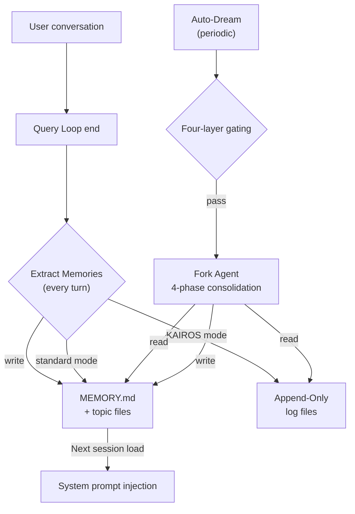

# Chapter 24: Cross-Session Memory -- From Forgetfulness to Persistent Learning

> **Positioning**: This chapter analyzes Claude Code's six-layer cross-session memory architecture -- a complete system from raw signal capture to structured knowledge distillation. Prerequisites: Chapter 5. Target audience: readers who want to understand how CC implements a cross-session memory system that evolves from forgetfulness to persistent learning.

## Why This Matters

An AI Agent without memory is essentially a stateless function: each call starts from zero, not knowing who the user is, what was done last time, or which decisions have already been made. Users are forced to repeat the same context in every new session -- "I'm a backend engineer," "this project builds with Bun," "don't mock the database in tests." This repetition wastes time and, more importantly, destroys the continuity of human-machine collaboration.

Claude Code's answer is a **six-layer memory architecture**, from raw signal capture to structured knowledge distillation, from in-session summaries to cross-session persistence, constructing a complete "learning ability." These six subsystems have clear divisions of labor:

| Subsystem | Core File | Frequency | Responsibility |
|-----------|----------|-----------|----------------|
| Memdir | `memdir/memdir.ts` | Every session load | MEMORY.md index + topic files, injected into system prompt |
| Extract Memories | `services/extractMemories/extractMemories.ts` | Every turn end | Fork agent auto-extracts memories |
| Session Memory | `services/SessionMemory/sessionMemory.ts` | Periodic trigger | Rolling session summary, used for compaction |
| Transcript Persistence | `utils/sessionStorage.ts` | Every message | JSONL session record storage and recovery |
| Agent Memory | `tools/AgentTool/agentMemory.ts` | Agent lifecycle | Subagent persistence + VCS snapshots |
| Auto-Dream | `services/autoDream/autoDream.ts` | Daily | Nightly memory consolidation and pruning |

These subsystems were mentioned in passing in previous chapters -- Chapter 9 introduced auto-compaction, Chapter 10 discussed post-compaction file state retention, Chapter 19 analyzed CLAUDE.md loading, Chapter 20 covered fork agent mode, Chapter 23 mentioned KAIROS and TEAMMEM feature flags. But memory's **creation, lifecycle, and cross-session persistence** as a complete system has never been fully analyzed. This chapter fills that gap.

## Source Code Analysis

### 24.1 Memdir Architecture: MEMORY.md Index and Topic Files

Memdir is the storage layer of the entire memory system -- all memories ultimately land as files in this directory structure.

#### Path Resolution

The memory directory location is determined by `getAutoMemPath()` in `paths.ts`, following a three-level priority chain:

```typescript
// restored-src/src/memdir/paths.ts:223-235
export const getAutoMemPath = memoize(
  (): string => {
    const override = getAutoMemPathOverride() ?? getAutoMemPathSetting()
    if (override) {
      return override
    }
    const projectsDir = join(getMemoryBaseDir(), 'projects')
    return (
      join(projectsDir, sanitizePath(getAutoMemBase()), AUTO_MEM_DIRNAME) + sep
    ).normalize('NFC')
  },
  () => getProjectRoot(),
)
```

Resolution order:
1. `CLAUDE_COWORK_MEMORY_PATH_OVERRIDE` environment variable (Cowork space-level mount)
2. `autoMemoryDirectory` setting (restricted to trusted sources only: policy/flag/local/user settings, **excluding** projectSettings to prevent malicious repositories from redirecting write paths)
3. Default path: `~/.claude/projects/<sanitized-git-root>/memory/`

Notably, `getAutoMemBase()` uses `findCanonicalGitRoot()` rather than `getProjectRoot()`, meaning all worktrees of the same repository share one memory directory. This is a deliberate design decision -- memory is about the project, not the working directory.

#### Index and Truncation

`MEMORY.md` is the entry point of the memory system -- an index file where each line points to a topic file. The system injects it into the system prompt at each session start. To prevent index bloat from consuming precious context space, `memdir.ts` applies dual truncation:

```typescript
// restored-src/src/memdir/memdir.ts:34-38
export const ENTRYPOINT_NAME = 'MEMORY.md'
export const MAX_ENTRYPOINT_LINES = 200
export const MAX_ENTRYPOINT_BYTES = 25_000
```

Truncation logic is cascading: first by lines (200 lines, natural boundary), then byte check (25KB); if byte truncation needs to cut mid-line, it falls back to the last newline. This "lines first, then bytes" strategy is experience-driven -- comments note that p97 content length is within limits, but p100 observed 197KB still within 200 lines, indicating extremely long lines exist in index files.

`truncateEntrypointContent()` (`memdir.ts:57-103`) appends a WARNING message after cascading truncation, telling the model the index was truncated and suggesting moving detailed content to topic files (full analysis of the truncation function is in Chapter 19). This is a clever self-healing mechanism -- the model will see this warning next time it organizes memory and act accordingly.

#### Topic File Format

Each memory is stored as an independent Markdown file with YAML frontmatter:

```markdown
---
name: Memory name
description: One-line description (used to judge relevance)
type: user | feedback | project | reference
---

Memory content...
```

Four types form a closed classification system:
- **user**: User role, preferences, knowledge level
- **feedback**: User corrections and guidance for Agent behavior
- **project**: Ongoing work, goals, deadlines
- **reference**: Pointers to external systems (Linear projects, Grafana dashboards)

The scanner in `memoryScan.ts` only reads the first 30 lines of each file to parse frontmatter, avoiding excessive IO with many memory files:

```typescript
// restored-src/src/memdir/memoryScan.ts:21-22
const MAX_MEMORY_FILES = 200
const FRONTMATTER_MAX_LINES = 30
```

Scan results are sorted by modification time descending, keeping at most 200 files. This means the longest-unupdated memories are naturally phased out.

#### KAIROS Log Mode

When KAIROS (long-running assistant mode) is activated, the memory write strategy switches from "directly update topic file + MEMORY.md" to "append to daily log file":

```typescript
// restored-src/src/memdir/paths.ts:246-251
export function getAutoMemDailyLogPath(date: Date = new Date()): string {
  const yyyy = date.getFullYear().toString()
  const mm = (date.getMonth() + 1).toString().padStart(2, '0')
  const dd = date.getDate().toString().padStart(2, '0')
  return join(getAutoMemPath(), 'logs', yyyy, mm, `${yyyy}-${mm}-${dd}.md`)
}
```

Path format: `memory/logs/YYYY/MM/YYYY-MM-DD.md`. This append-only strategy avoids frequent rewrites to the same file during long sessions -- distillation is left to nightly Auto-Dream processing.

### 24.2 Extract Memories: Automatic Memory Extraction

Extract Memories is the "perception layer" of the memory system -- at the end of each query turn, a fork agent silently analyzes the conversation and extracts information worth persisting.

#### Trigger Mechanism

Extraction is triggered in `stopHooks.ts`, at the end of the query loop (see Chapter 4 for the discussion of stop hooks):

```typescript
// restored-src/src/query/stopHooks.ts:141-156
if (
  feature('EXTRACT_MEMORIES') &&
  !toolUseContext.agentId &&
  isExtractModeActive()
) {
  void extractMemoriesModule!.executeExtractMemories(
    stopHookContext,
    toolUseContext.appendSystemMessage,
  )
}
if (!toolUseContext.agentId) {
  void executeAutoDream(stopHookContext, toolUseContext.appendSystemMessage)
}
```

Two key constraints:
1. **Main Agent only**: `!toolUseContext.agentId` excludes subagent stop hooks
2. **Fire-and-forget**: `void` prefix means extraction runs asynchronously, not blocking the next query turn

#### Throttle Mechanism

Not every query turn triggers extraction. The `tengu_bramble_lintel` feature flag controls frequency (default value 1, meaning run every turn):

```typescript
// restored-src/src/services/extractMemories/extractMemories.ts:377-385
if (!isTrailingRun) {
  turnsSinceLastExtraction++
  if (
    turnsSinceLastExtraction <
    (getFeatureValue_CACHED_MAY_BE_STALE('tengu_bramble_lintel', null) ?? 1)
  ) {
    return
  }
}
turnsSinceLastExtraction = 0
```

#### Mutual Exclusion with Main Agent

When the main Agent itself writes memory files (e.g., user explicitly asks "remember this"), the fork agent skips extraction for that turn:

```typescript
// restored-src/src/services/extractMemories/extractMemories.ts:121-148
function hasMemoryWritesSince(
  messages: Message[],
  sinceUuid: string | undefined,
): boolean {
  // ... checks assistant messages for Edit/Write tool calls targeting autoMemPath
}
```

This avoids two agents simultaneously writing to the same file. When the main agent writes, the cursor advances directly to the latest message, ensuring those messages won't be redundantly processed by subsequent extraction.

#### Permission Isolation

The fork agent's permissions are strictly limited:

`createAutoMemCanUseTool()` (`extractMemories.ts:171-222`) implements:

- **Allow**: Read/Grep/Glob (read-only tools, unrestricted)
- **Allow**: Bash (only `isReadOnly`-passing commands -- `ls`, `find`, `grep`, `cat`, etc.)
- **Allow**: Edit/Write (only paths within `memoryDir`, validated via `isAutoMemPath()`)
- **Deny**: All other tools (MCP, Agent, write-capable Bash, etc.)

This permission function is shared by both Extract Memories and Auto-Dream (see section 24.6).

#### Extraction Prompt

The extraction agent's prompt explicitly instructs efficient operation:

```typescript
// restored-src/src/services/extractMemories/prompts.ts:39
`You have a limited turn budget. ${FILE_EDIT_TOOL_NAME} requires a prior
${FILE_READ_TOOL_NAME} of the same file, so the efficient strategy is:
turn 1 — issue all ${FILE_READ_TOOL_NAME} calls in parallel for every file
you might update; turn 2 — issue all ${FILE_WRITE_TOOL_NAME}/${FILE_EDIT_TOOL_NAME}
calls in parallel.`
```

It also explicitly prohibits investigation behavior -- "Do not waste any turns attempting to investigate or verify that content further." This is because the fork agent inherits the main conversation's complete context (including prompt cache) and doesn't need additional information gathering. Maximum turns limited to 5 (`maxTurns: 5`), preventing the agent from falling into verification loops.

### 24.3 Session Memory: Rolling Session Summary

Session Memory solves a different problem: **in-session** information retention. When the context window nears saturation and auto-compaction is about to trigger (see Chapter 9), the compactor needs to know which information is important. Session Memory provides this signal.

#### Trigger Conditions

Session Memory registers as a post-sampling hook (`registerPostSamplingHook`), running after each model sampling. Actual extraction is protected by triple thresholds:

```typescript
// restored-src/src/services/SessionMemory/sessionMemoryUtils.ts:32-36
export const DEFAULT_SESSION_MEMORY_CONFIG: SessionMemoryConfig = {
  minimumMessageTokensToInit: 10000,   // First trigger: 10K tokens
  minimumTokensBetweenUpdate: 5000,    // Update interval: 5K tokens
  toolCallsBetweenUpdates: 3,          // Minimum tool calls: 3
}
```

Trigger logic (`sessionMemory.ts:134-181`) requires:
1. **Initialization threshold**: First triggers when the context window reaches 10K tokens
2. **Update conditions**: Token threshold (5K) **must** be met, plus either (a) tool call count >= 3, or (b) the last assistant turn had no tool calls (a natural conversation breakpoint)

This means Session Memory won't trigger in short conversations, nor interrupt workflow during dense tool calling.

#### Summary Template

The summary file uses a fixed section structure (`prompts.ts:11-41`):

```markdown
# Session Title
# Current State
# Task specification
# Files and Functions
# Workflow
# Errors & Corrections
# Codebase and System Documentation
# Learnings
# Key results
# Worklog
```

Each section has a size limit (`MAX_SECTION_LENGTH = 2000` tokens), total file not exceeding 12,000 tokens (see Chapter 12 for the discussion on token budget strategies). When the budget is exceeded, the prompt asks the agent to proactively compress the least important parts.

#### Relationship with Auto-Compaction

Session Memory's initialization gate `initSessionMemory()` checks `isAutoCompactEnabled()` -- if auto-compaction is disabled, Session Memory also won't run. This is because Session Memory's primary consumer is the compaction system. The summary file `summary.md` is injected during compaction, providing the compactor with the critical signal of "what is important" (see Chapter 9 `sessionMemoryCompact.ts`).

#### Difference from Extract Memories

| Dimension | Session Memory | Extract Memories |
|-----------|---------------|-----------------|
| Persistence scope | Within session | Cross-session |
| Storage location | `~/.claude/projects/<root>/<session-id>/session-memory/` | `~/.claude/projects/<root>/memory/` |
| Trigger timing | Token threshold + tool call threshold | Every turn end |
| Consumer | Compaction system | Next session's system prompt |
| Content structure | Fixed section template | Free-form topic files |

Both run in parallel without interference -- Session Memory focuses on "what was done in this session," Extract Memories focuses on "what information is worth keeping cross-session."

### 24.4 Transcript Persistence: JSONL Session Storage

`sessionStorage.ts` (5,105 lines, one of the largest single files in the source) handles persisting complete session records as JSONL (JSON Lines) format.

#### Storage Format

Each message serializes to one JSON line, appended to the session file. Storage path: `~/.claude/projects/<root>/<session-id>.jsonl`. JSONL was chosen for performance -- incremental appending only needs `appendFile`, no need to parse and rewrite the entire file.

In addition to standard user/assistant messages, session records contain several special entry types:

| Entry Type | Purpose |
|-----------|---------|
| `file_history_snapshot` | File history snapshot, used to restore file state after compaction (see Chapter 10) |
| `attribution_snapshot` | Attribution snapshot, recording the source of each file modification |
| `context_collapse_snapshot` | Compaction boundary marker, recording where compaction occurred and which messages were preserved |
| `content_replacement` | Content replacement record, used for output truncation in REPL mode |

#### Session Resume

When users resume sessions via `claude --resume`, `sessionStorage.ts` rebuilds the complete message chain from the JSONL file. The resume process:
1. Parses all JSONL entries
2. Rebuilds the message tree based on `uuid`/`parentUuid`
3. Applies compaction boundary markers (`context_collapse_snapshot`), restoring to the post-compaction state
4. Rebuilds file history snapshots, ensuring the model's understanding of file state is consistent with disk

This makes cross-session "continuation" possible -- users can close their terminal at the end of the day and resume the exact same conversation context the next day.

### 24.5 Agent Memory: Subagent Persistence

Subagents (see Chapter 20) have their own memory needs -- a recurring code review agent needs to remember team code style preferences; a test agent needs to remember the project's test framework configuration.

#### Three-Scope Model

`agentMemory.ts` defines three memory scopes:

```typescript
// restored-src/src/tools/AgentTool/agentMemory.ts:12-13
export type AgentMemoryScope = 'user' | 'project' | 'local'
```

| Scope | Path | VCS Committable | Purpose |
|-------|------|----------------|---------|
| `user` | `~/.claude/agent-memory/<agentType>/` | No | Cross-project user-level preferences |
| `project` | `<cwd>/.claude/agent-memory/<agentType>/` | Yes | Team-shared project knowledge |
| `local` | `<cwd>/.claude/agent-memory-local/<agentType>/` | No | Machine-specific project configuration |

Each scope independently maintains its own `MEMORY.md` index and topic files, using exactly the same `buildMemoryPrompt()` as Memdir to construct system prompt content.

#### VCS Snapshot Sync

`agentMemorySnapshot.ts` solves a practical problem: `project` scope memory should be shareable via Git across teams, but `.claude/agent-memory/` is in `.gitignore`. The solution is a separate snapshot directory:

```typescript
// restored-src/src/tools/AgentTool/agentMemorySnapshot.ts:31-33
export function getSnapshotDirForAgent(agentType: string): string {
  return join(getCwd(), '.claude', SNAPSHOT_BASE, agentType)
}
```

Snapshots track versions via `updatedAt` timestamps in `snapshot.json`. When a snapshot is detected to be newer than local memory, three strategies are offered:

```typescript
// restored-src/src/tools/AgentTool/agentMemorySnapshot.ts:98-144
export async function checkAgentMemorySnapshot(
  agentType: string,
  scope: AgentMemoryScope,
): Promise<{
  action: 'none' | 'initialize' | 'prompt-update'
  snapshotTimestamp?: string
}> {
  // No snapshot → 'none'
  // No local memory → 'initialize' (copy snapshot to local)
  // Snapshot newer → 'prompt-update' (prompt model to merge)
}
```

`initialize` directly copies files; `prompt-update` doesn't auto-overwrite but tells the model via prompt "new team knowledge is available," letting the model decide how to merge. This avoids loss of local customizations that could result from automatic overwriting.

### 24.6 Auto-Dream: Automatic Memory Consolidation

Auto-Dream is the memory system's "sleep phase" -- a background consolidation task requiring both a time gate (default 24 hours) and a session gate (default 5 new sessions) to trigger. It comprehensively organizes scattered memory fragments, prunes outdated information, and maintains memory system health.

#### Four-Layer Gating System

Auto-Dream triggering passes through four checks, ordered from lowest to highest cost (`autoDream.ts:95-191`):

**Layer One: Master Gate**

```typescript
// restored-src/src/services/autoDream/autoDream.ts:95-100
function isGateOpen(): boolean {
  if (getKairosActive()) return false  // KAIROS mode uses disk-skill dream
  if (getIsRemoteMode()) return false
  if (!isAutoMemoryEnabled()) return false
  return isAutoDreamEnabled()
}
```

KAIROS mode is excluded because KAIROS has its own dream skill (triggered manually via `/dream`). Remote mode (CCR) is excluded because persistent storage is unreliable. `isAutoDreamEnabled()` checks user settings and the `tengu_onyx_plover` feature flag (`config.ts:13-21`).

**Layer Two: Time Gate**

```typescript
// restored-src/src/services/autoDream/autoDream.ts:131-141
let lastAt: number
try {
  lastAt = await readLastConsolidatedAt()
} catch { ... }
const hoursSince = (Date.now() - lastAt) / 3_600_000
if (!force && hoursSince < cfg.minHours) return
```

Default `minHours = 24`, at least 24 hours since last consolidation. Time info obtained via lock file mtime -- one `stat` system call.

**Layer Three: Session Gate**

```typescript
// restored-src/src/services/autoDream/autoDream.ts:153-171
let sessionIds: string[]
try {
  sessionIds = await listSessionsTouchedSince(lastAt)
} catch { ... }
const currentSession = getSessionId()
sessionIds = sessionIds.filter(id => id !== currentSession)
if (!force && sessionIds.length < cfg.minSessions) return
```

Default `minSessions = 5`, at least 5 new sessions modified since last consolidation. Current session excluded (its mtime is always latest). Scanning has a 10-minute cooldown (`SESSION_SCAN_INTERVAL_MS = 10 * 60 * 1000`), preventing repeated session list scanning every turn once the time gate passes.

**Layer Four: Lock Gate** -- After passing three checks, a concurrency lock must be acquired. If another process is consolidating, the current one gives up. Lock mechanism implementation details in the next section.

#### PID Lock Mechanism

Concurrency control uses a `.consolidate-lock` file (`consolidationLock.ts`):

```typescript
// restored-src/src/services/autoDream/consolidationLock.ts:16-19
const LOCK_FILE = '.consolidate-lock'
const HOLDER_STALE_MS = 60 * 60 * 1000  // 1 hour
```

This lock file carries dual semantics:
- **mtime** = `lastConsolidatedAt` (timestamp of last successful consolidation)
- **file content** = holder's PID

Lock acquisition flow:
1. `stat` + `readFile` to get mtime and PID
2. If mtime is within 1 hour and PID is alive -> occupied, return `null`
3. If PID is dead or mtime expired -> reclaim lock
4. Write own PID
5. Re-read to verify (prevents race when two processes reclaim simultaneously)

```typescript
// restored-src/src/services/autoDream/consolidationLock.ts:46-84
export async function tryAcquireConsolidationLock(): Promise<number | null> {
  // ... stat + readFile ...
  await writeFile(path, String(process.pid))
  // Double check: two reclaimers both write → the later writer wins the PID
  let verify: string
  try {
    verify = await readFile(path, 'utf8')
  } catch { return null }
  if (parseInt(verify.trim(), 10) !== process.pid) return null
  return mtimeMs ?? 0
}
```

Failure rollback via `rollbackConsolidationLock()` restores mtime to the pre-acquisition value. If `priorMtime` is 0 (no lock file existed before), the lock file is deleted. This ensures a failed consolidation doesn't block the next retry.

#### Four-Phase Consolidation Prompt

The consolidation agent receives a structured four-phase prompt:

```
Phase 1 — Orient: ls memory directory, read MEMORY.md, browse topic files
Phase 2 — Gather: Search logs and session records for new signals
Phase 3 — Consolidate: Merge into existing files, resolve contradictions, relative dates → absolute dates
Phase 4 — Prune & Index: Keep MEMORY.md within 200 lines / 25KB
```

The prompt particularly emphasizes "merge over create" (`Merging new signal into existing topic files rather than creating near-duplicates`) and "correct over preserve" (`if today's investigation disproves an old memory, fix it at the source`) -- preventing infinite memory file growth.

In auto-trigger scenarios, the prompt also appends additional constraint information -- `Tool constraints for this run` and the session list:

```typescript
// restored-src/src/services/autoDream/autoDream.ts:216-221
const extra = `
**Tool constraints for this run:** Bash is restricted to read-only commands...
Sessions since last consolidation (${sessionIds.length}):
${sessionIds.map(id => `- ${id}`).join('\n')}`
```

#### Fork Agent Constraints

Consolidation executes via `runForkedAgent` (see Chapter 20 for fork agent mode), using the `createAutoMemCanUseTool` permission function described in section 24.2. Key constraints:

```typescript
// restored-src/src/services/autoDream/autoDream.ts:224-233
const result = await runForkedAgent({
  promptMessages: [createUserMessage({ content: prompt })],
  cacheSafeParams: createCacheSafeParams(context),
  canUseTool: createAutoMemCanUseTool(memoryRoot),
  querySource: 'auto_dream',
  forkLabel: 'auto_dream',
  skipTranscript: true,
  overrides: { abortController },
  onMessage: makeDreamProgressWatcher(taskId, setAppState),
})
```

- `cacheSafeParams: createCacheSafeParams(context)` -- Inherits parent's prompt cache, significantly reducing token cost
- `skipTranscript: true` -- Not recorded in session history (consolidation is a background operation and should not pollute the user's conversation record)
- `onMessage` -- Progress callback, capturing Edit/Write paths to update the DreamTask UI

#### Task UI Integration

`DreamTask.ts` exposes Auto-Dream in Claude Code's background task UI (footer pill and Shift+Down dialog):

```typescript
// restored-src/src/tasks/DreamTask/DreamTask.ts:25-41
export type DreamTaskState = TaskStateBase & {
  type: 'dream'
  phase: DreamPhase               // 'starting' | 'updating'
  sessionsReviewing: number
  filesTouched: string[]
  turns: DreamTurn[]
  abortController?: AbortController
  priorMtime: number              // For rollback on kill
}
```

Users can actively terminate a dream task from the UI. The `kill` method aborts the fork agent via `abortController.abort()`, then rolls back the lock file's mtime to ensure the next session can retry:

```typescript
// restored-src/src/tasks/DreamTask/DreamTask.ts:136-156
async kill(taskId, setAppState) {
  updateTaskState<DreamTaskState>(taskId, setAppState, task => {
    task.abortController?.abort()
    priorMtime = task.priorMtime
    return { ...task, status: 'killed', ... }
  })
  if (priorMtime !== undefined) {
    await rollbackConsolidationLock(priorMtime)
  }
}
```

#### Extract Memories vs Auto-Dream Complementary Relationship

The two subsystems form a **high-frequency incremental + low-frequency global** complementary architecture:



| Dimension | Extract Memories | Auto-Dream |
|-----------|-----------------|------------|
| Frequency | Every turn (throttleable via flag) | Daily (24h + 5 sessions) |
| Input | Recent N messages | Entire memory directory + session records |
| Operations | Create/update topic files | Merge, prune, resolve contradictions |
| Analogy | Short-term → long-term memory encoding | Memory consolidation during sleep |

In KAIROS mode, this complementarity is even more pronounced: Extract Memories only writes append-only logs (raw signal stream), Auto-Dream distills logs into structured topic files during daily consolidation. In standard mode, Extract Memories directly updates topic files, Auto-Dream handles periodic pruning and deduplication.

## Pattern Distillation

### Pattern One: Multi-Layer Memory Architecture

**Problem solved**: A single storage strategy cannot simultaneously satisfy high-frequency writes and high-quality retrieval.

**Pattern**: Divide the memory system into three layers -- raw signal layer (logs/session records), structured knowledge layer (topic files), index layer (MEMORY.md). Each layer has independent write frequency and quality requirements.

```
Raw signals ──(every turn)──→ Structured knowledge ──(daily)──→ Index
  (logs)                      (topic files)                    (MEMORY.md)
  High freq, low quality      Med freq, med quality            Low freq, high quality
```

**Precondition**: Requires background processing capability (fork agent), requires predictable storage budget (truncation mechanism).

### Pattern Two: Background Extraction via Fork Agent

**Problem solved**: Memory extraction requires model reasoning but cannot block the user's interaction loop.

**Pattern**: Launch a fork agent at query loop end, inherit parent's prompt cache (reduce cost), apply strict permission isolation (can only write to memory directory), set tool call and turn limits (prevent runaway). Coordinate with main agent via mutual exclusion checks (`hasMemoryWritesSince`).

**Precondition**: Prompt cache mechanism available, fork agent infrastructure ready (see Chapter 20), memory directory path determined.

### Pattern Three: File mtime as State

**Problem solved**: Auto-Dream needs to persist "last consolidation time" and "current holder" without introducing an external database.

**Pattern**: Use one lock file; its mtime is `lastConsolidatedAt`, content is holder PID. Implement read, acquire, rollback via `stat`/`utimes`/`writeFile`. PID liveness detection + 1-hour expiry provides crash recovery.

**Precondition**: File system supports millisecond-precision mtime, process PIDs are not reused within a reasonable time window.

### Pattern Four: Budget-Constrained Memory Injection

**Problem solved**: Unbounded memory growth eventually crowds out useful context space.

**Pattern**: Apply multi-level truncation -- MEMORY.md max 200 lines / 25KB, topic files capped at `MAX_MEMORY_FILES = 200`, Session Memory 2000 tokens per section / 12000 total. Append warning messages on truncation, forming a self-healing loop.

**Precondition**: Determined context budget (see Chapter 12), truncated content can still provide meaningful information.

### Pattern Five: Complementary Frequency Design

**Problem solved**: Single-frequency memory processing either loses information (too infrequent) or accumulates noise (too frequent).

**Pattern**: Dual-frequency strategy -- high-frequency incremental extraction (every turn / every N turns) captures all potentially valuable signals; low-frequency global consolidation (daily) prunes noise, resolves contradictions, merges duplicates. The former tolerates false positives (remembering unimportant things); the latter fixes false positives (deleting unimportant memories).

**Precondition**: Sufficient time difference between the two processing frequencies (at least one order of magnitude), high-frequency operation cost is controllable (inheriting prompt cache).

## What Users Can Do

### Manage MEMORY.md

Understanding the 200-line limit is key. If your project's memory index exceeds 200 lines, later entries get truncated. Manually edit MEMORY.md to ensure the most important entries are first, moving details to topic files. Keep each index entry under 150 characters per line.

### Understand What Gets Remembered

Four types each have best uses:
- **feedback** is the most valuable type -- it directly changes Agent behavior. "Don't mock the database in tests" is more useful than "we use PostgreSQL"
- **user** helps Agent adjust communication style and suggestion depth
- **project** has time sensitivity, needs periodic cleanup
- **reference** is shortcuts to external resources, keep brief

### Control Automatic Memory

- `CLAUDE_CODE_DISABLE_AUTO_MEMORY=1` completely disables all auto-memory features
- `settings.json` with `autoMemoryEnabled: false` disables per-project
- `autoDreamEnabled: false` disables only nightly consolidation, preserving instant extraction

### Manually Trigger Consolidation

Don't want to wait for daily auto-trigger? Use the `/dream` command for instant memory consolidation. Particularly useful:
- After completing a large refactor, to update project context
- After team member switches, to organize personal preferences
- When you notice outdated or contradictory memory files

### Supplement Memory with CLAUDE.md

CLAUDE.md and the memory system are complementary:
- CLAUDE.md stores **instructions that should not be modified** -- coding standards, architecture constraints, team processes
- The memory system stores **knowledge that can evolve** -- user preferences, project context, external references

If information should not be pruned or modified by Auto-Dream, put it in CLAUDE.md rather than the memory system.

---

## Version Evolution: v2.1.91 Memory System Changes

> The following analysis is based on v2.1.91 bundle signal comparison, combined with v2.1.88 source code inference.

### Memory Feature Toggle

v2.1.91 adds the `tengu_memory_toggled` event, suggesting a runtime toggle for memory functionality -- users can dynamically enable or disable cross-session memory during a session. This differs from v2.1.88 where memory was always enabled (if the Feature Flag was on).

### No-Prose Skip Optimization

The `tengu_extract_memories_skipped_no_prose` event indicates v2.1.91 added content detection before memory extraction: if messages contain no prose content (pure code, tool results, JSON output), memory extraction is skipped -- avoiding expensive LLM extraction on meaningless content.

This is a **budget-aware optimization**: memory extraction requires extra API calls, and extracting from purely technical interactions (batch file reads, test runs) not only wastes cost but may produce low-quality memory entries.

### Team Memory

v2.1.91 adds the `tengu_team_mem_*` event series (sync_pull, sync_push, push_suppressed, secret_skipped, etc.), indicating team memory has moved from experiment to active use.

Team memory is stored at `~/.claude/projects/{project}/memory/team/`, independent from personal memory. Key mechanisms:
- **Synchronization**: `sync_pull` / `sync_push` events indicate inter-member sync
- **Security filtering**: `secret_skipped` events indicate sensitive content (API keys, passwords) won't be written to shared memory
- **Write suppression**: `push_suppressed` events indicate write limits (possibly frequency or capacity)
- **Entry cap**: `entries_capped` events indicate team memory has a capacity limit

See Chapter 20b for the team memory security protection analysis within Teams implementation details.
