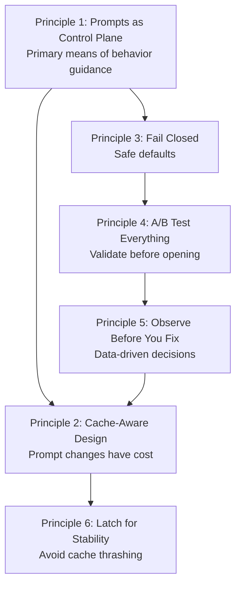

# Chapter 25: Harness Engineering Principles

## Why This Matters

In the preceding six parts, we dissected every subsystem of Claude Code at the source code level — tool registration, Agent Loop, system prompts, context compaction, prompt caching, permission security, and the skill system. These analyses revealed a wealth of implementation details, but if we stop at the level of "how it works," we would waste the most valuable output of reverse engineering: **reusable engineering principles**.

This chapter distills 6 core Harness Engineering principles from the source code analyses in the preceding 23 chapters. Each principle has clear source code traceability, applicable scenarios, and anti-pattern warnings. The common theme across these principles is: **in AI Agent systems, the best way to control behavior is not to write more code, but to design better constraints**.

---

## Claude Code's Position in the Agent Loop Architecture Spectrum

Before distilling principles, it's worth answering a meta-question: **What type of Agent architecture is Claude Code?**

Academics categorize Agent Loops into six patterns: monolithic loop (ReAct-style reasoning-action interleaving), hierarchical agents (goal-task-execution three-tier), distributed multi-agent (multi-role collaboration), reflection/metacognitive loop (Reflexion-style self-improvement), tool-augmented loop (external tool-driven state updates), and learning/online update loop (memory persistence and strategy iteration). Most frameworks (LangGraph, AutoGen, CrewAI) choose one or two patterns as their core abstraction.

What makes Claude Code unique is: **it is not a pure implementation of any single pattern, but a pragmatic hybrid of all six**.

```
┌─────────────────────────────────────────────────────────────┐
│           Claude Code Architecture Spectrum Position         │
├──────────────────────┬──────────────────────────────────────┤
│ Academic Pattern     │ CC Implementation                    │
├──────────────────────┼──────────────────────────────────────┤
│ Monolithic Loop      │ queryLoop() — core Agent Loop (ch03) │
│ Tool-Augmented Loop  │ 40+ tools in ReAct-style (ch02-04)  │
│ Hierarchical Agent   │ Coordinator Mode layers (ch20)      │
│ Distributed Multi-   │ Team parallel + Ultraplan remote     │
│   Agent              │   delegation (ch20)                  │
│ Reflection (weak)    │ Advisor Tool + stop hooks (ch21)    │
│ Learning (weak)      │ Cross-session memory + CLAUDE.md    │
│                      │   persistence (ch24)                │
└──────────────────────┴──────────────────────────────────────┘
```

This hybrid is not a design mistake, but a pragmatic choice. CC's core is a monolithic `queryLoop()` (pattern one), but on top of that:

- **Tool augmentation** is the default behavior — each iteration may invoke tools, obtain observations, and update state, which is exactly the "reasoning-action interleaving" of ReAct
- **Hierarchical agents** are enabled on demand — Coordinator Mode splits "planning" and "execution" into different tiers, with the upper tier only making decisions and the lower tier only executing
- **Distributed multi-agent** is enabled on demand — Team mode lets multiple Agents collaborate through `SendMessageTool`, and Ultraplan offloads planning to remote containers
- **Reflection** is implicit — there is no explicit Reflexion memory, but Advisor Tool provides a "critic" role, and stop hooks provide "post-execution checks"
- **Learning** is persistent — cross-session memory (`~/.claude/memory/`) and CLAUDE.md allow the Agent to accumulate experience across sessions, but without updating model weights

This "simple by default, complex on demand" architectural philosophy permeates all the principles distilled in this chapter.

---

## Source Code Analysis

### 25.1 Principle One: Prompts as the Control Plane

**Definition**: Guide model behavior through system prompt segments rather than hardcoding restrictions in code logic.

The vast majority of Claude Code's behavior guidance is achieved through prompts, not through if/else branches in code. The most typical example is the minimalism directive:

```typescript
// restored-src/src/constants/prompts.ts:203
"Don't create helpers, utilities, or abstractions for one-time operations.
Don't design for hypothetical future requirements. The right amount of
complexity is what the task actually requires — no speculative abstractions,
but no half-finished implementations either. Three similar lines of code
is better than a premature abstraction."
```

This text is not a code comment — it is an actual instruction sent to the model. Claude Code does not detect at the code level whether the model is over-engineering (which is technically nearly impossible), but instead directly tells the model "don't do this" through natural language.

The same pattern pervades the entire system prompt architecture (see Chapter 5 for details). `systemPromptSections.ts` organizes system prompts into multiple composable sections, each with a clear cache scope (`scope: 'global'` or `null`). This design means behavior adjustments only require modifying text — no code changes, no test changes, no release process needed.

Tool prompts are the quintessential embodiment of this principle (see Chapter 8 for details). BashTool's Git Safety Protocol — "never skip hooks, never amend, prefer specific file git add" — is expressed entirely through prompt text. If the team someday decides to allow amend, they only need to delete one line of prompt text, without touching any execution logic.

Going further, Claude Code doesn't stuff all behavior switches into the main system prompt. `<system-reminder>` serves as an **out-of-band control channel**: Plan Mode's multi-stage workflow (interview → explore → plan → approve → execute), Todo/Task gentle reminders, Read tool's empty file/offset warnings, and ToolSearch's deferred tool hints are all meta-instructions conditionally injected into the message stream, rather than rewrites of the main system prompt. In other words, Claude Code separates the "stable constitution" and "runtime switches" into two layers of control plane: the former pursues stability and cacheability, the latter pursues on-demand, short-lived, and replaceable characteristics.

**Applicability boundary**: Use code to handle structural constraints (permissions, token budgets), use prompts to handle behavioral constraints (style, strategy, preferences).

**Anti-pattern: Hardcoded behavior**. Writing detectors and interceptors for every undesirable model behavior, ultimately producing a massive rules engine that can never keep up with the pace of model capability evolution.

---

### 25.2 Principle Two: Cache-Aware Design Is Non-Negotiable

**Definition**: Every prompt change has a cost measured in `cache_creation` tokens, and system design must treat cache stability as a first-class constraint.

The `SYSTEM_PROMPT_DYNAMIC_BOUNDARY` marker (`restored-src/src/constants/prompts.ts:114-115`) divides the system prompt into two regions:

```typescript
// restored-src/src/constants/prompts.ts:105-115
/**
 * Boundary marker separating static (cross-org cacheable) content
 * from dynamic content.
 * Everything BEFORE this marker in the system prompt array can use
 * scope: 'global'.
 * Everything AFTER contains user/session-specific content and should
 * not be cached.
 */
export const SYSTEM_PROMPT_DYNAMIC_BOUNDARY =
  '__SYSTEM_PROMPT_DYNAMIC_BOUNDARY__'
```

`splitSysPromptPrefix()` (`restored-src/src/utils/api.ts:321-435`) implements three code paths to ensure cache breakpoints are placed correctly: MCP-present tool-based caching, global cache + boundary marker, and default org-level caching. This function's complexity comes entirely from cache optimization needs — if you didn't care about caching, you'd just concatenate strings.

The cache break detection system (see Chapter 14 for details) tracks nearly 20 fields of before/after state changes (`restored-src/src/services/api/promptCacheBreakDetection.ts:28-69`), including `systemHash`, `toolsHash`, `cacheControlHash`, `perToolHashes`, `betas`, and more. Any change in any field can trigger cache invalidation.

The Beta Header latching mechanism is an extreme case: **once a beta header has been sent, it continues to be sent forever, even if the corresponding feature is disabled** — because ceasing to send it would change the request signature, invalidating approximately 50-70K tokens of cached prefix. The source code comment explicitly documents the reason for latching:

```typescript
// restored-src/src/services/api/promptCacheBreakDetection.ts:47-48
/** AFK_MODE_BETA_HEADER presence — should NOT break cache anymore
 *  (sticky-on latched in claude.ts). Tracked to verify the fix. */
```

Date memoization (`getSessionStartDate()`) is another example: if a session crosses midnight, the date the model sees will "expire" — but this is intentional, because a date string change would break the cache prefix.

**Anti-pattern: Frequent prompt changes**. The agent list was once inlined in the system prompt, accounting for 10.2% of global `cache_creation` tokens (see Chapter 15 for details). The solution was to move it to `system-reminder` messages — which are outside the cache segment, so modifications don't affect the cache.

`/btw` and SDK `side_question` push this thinking in another direction: **cache-safe sideband queries**. Instead of inserting an ordinary turn into the main conversation, they reuse the cache-safe prefix snapshot saved by the main thread during the stop hooks phase, append a single `<system-reminder>` side question, launch a one-shot, tool-free fork, and explicitly `skipCacheWrite`. The result: the side question can share the parent session's prefix cache without polluting the main conversation history with its own Q&A.

---

### 25.3 Principle Three: Fail Closed, Open Explicitly

**Definition**: System defaults should choose the safest option; dangerous operations are only allowed after explicit declaration.

The `buildTool()` factory function sets defensive defaults for every tool property:

```typescript
// restored-src/src/Tool.ts:748-761
/**
 * Defaults (fail-closed where it matters):
 * - `isConcurrencySafe` → `false` (assume not safe)
 * - `isReadOnly` → `false` (assume writes)
 * - `isDestructive` → `false`
 * - `checkPermissions` → `{ behavior: 'allow', updatedInput }`
 *   (defer to general permission system)
 * - `toAutoClassifierInput` → `''`
 *   (skip classifier — security-relevant tools must override)
 */
const TOOL_DEFAULTS = {
  isEnabled: () => true,
  isConcurrencySafe: (_input?: unknown) => false,
  isReadOnly: (_input?: unknown) => false,
  ...
}
```

This means new tools are **not concurrency-safe by default** — `partitionToolCalls()` (`restored-src/src/services/tools/toolOrchestration.ts:91-116`) places tools that haven't declared `isConcurrencySafe: true` into the serial queue. When the `isConcurrencySafe` call throws an exception, the catch block also returns `false` — a conservative fallback:

```typescript
// restored-src/src/services/tools/toolOrchestration.ts:98-108
const isConcurrencySafe = parsedInput?.success
  ? (() => {
      try {
        return Boolean(tool?.isConcurrencySafe(parsedInput.data))
      } catch {
        // If isConcurrencySafe throws, treat as not concurrency-safe
        // to be conservative
        return false
      }
    })()
  : false
```

The permission system follows the same principle (see Chapter 16 for details). Permission modes range from most restrictive to most permissive: `default` → `acceptEdits` → `plan` → `bypassPermissions` → `auto` → `dontAsk`. The system defaults to `default` — users must actively choose a more permissive mode.

The YOLO classifier's denial tracking is another manifestation (`restored-src/src/utils/permissions/denialTracking.ts:12-15`): `DENIAL_LIMITS` specifies that after 3 consecutive or 20 total classifier denials, the system automatically falls back to manual user confirmation — **when automated decision-making is unreliable, fall back to human decision-making** (see Chapter 27, Pattern Two for the complete code).

**Anti-pattern: Default open, close after incidents**. Tools are concurrency-safe by default, and a tool with side effects produces a race condition during parallel execution — this kind of bug is extremely difficult to reproduce and diagnose.

---

### 25.4 Principle Four: A/B Test Everything

**Definition**: Behavior changes are first validated within internal user groups, and only expanded to all users after data-confirmed success.

Claude Code has 89 Feature Flags (see Chapter 23 for details), a significant portion of which are used for A/B testing. What's most noteworthy is not the number of flags, but the gating patterns.

The `USER_TYPE === 'ant'` gate is the most direct staging mechanism (see Chapter 7 for details). The source code contains numerous ant-only sections, such as the Capybara v8 over-commenting mitigation:

```typescript
// restored-src/src/constants/prompts.ts:205-213
...(process.env.USER_TYPE === 'ant'
  ? [
      `Default to writing no comments. Only add one when the WHY
       is non-obvious...`,
      // @[MODEL LAUNCH]: capy v8 thoroughness counterweight
      // (PR #24302) — un-gate once validated on external via A/B
      `Before reporting a task complete, verify it actually works...`,
    ]
  : []),
```

The comment `un-gate once validated on external via A/B` clearly demonstrates this workflow: **first validate internally, then roll out to external users through A/B testing once confirmed effective**.

GrowthBook integration provides more granular experimentation capabilities: `tengu_*`-prefixed Feature Flags are controlled through a remote configuration server, supporting percentage-based gradual rollout. The existence of both `_CACHED_MAY_BE_STALE` and `_CACHED_WITH_REFRESH` caching strategies (see Chapter 7 for details) reflects "cache-aware A/B testing" — flag value switching should not cause cache invalidation.

**Anti-pattern: Big Bang releases**. Pushing behavior changes directly to all users. In the AI Agent domain, the impact of behavior changes is typically not "crashes" but "not good enough" or "too aggressive" — requiring quantitative metrics and control groups to detect.

---

### 25.5 Principle Five: Observe Before You Fix

**Definition**: Before attempting to fix a problem, first establish observability infrastructure to understand the full picture.

The cache break detection system (`restored-src/src/services/api/promptCacheBreakDetection.ts`) is a paradigm of this principle. This system doesn't fix any problems — its entire responsibility is to **observe and report**:

1. **Before the call**: `recordPromptState()` captures a snapshot of nearly 20 fields
2. **After the call**: `checkResponseForCacheBreak()` compares before and after states, identifying which field changed
3. **Generate explanations**: Translates into human-readable reasons — "system prompt changed", "TTL likely expired"
4. **Generate diffs**: `createPatch()` outputs before/after prompt state comparisons

Particularly noteworthy is the comment style in `PreviousState` (`restored-src/src/services/api/promptCacheBreakDetection.ts:36-37`):

```typescript
/** Per-tool schema hash. Diffed to name which tool's description changed
 *  when toolSchemasChanged but added=removed=0 (77% of tool breaks per
 *  BQ 2026-03-22). AgentTool/SkillTool embed dynamic agent/command lists. */
perToolHashes: Record<string, number>
```

The reference to specific BigQuery query dates and percentage data (77%) indicates the team is using data-driven design for observability granularity — not randomly tracking all fields, but discovering from production data that "most tool schema changes come from a specific tool's description changing," then adding per-tool hashes in a targeted manner.

The YOLO classifier's `CLAUDE_CODE_DUMP_AUTO_MODE=1` (see Chapter 17 for details) follows the same pattern: providing complete input/output export capability so developers can precisely understand "why the classifier rejected this operation."

**Anti-pattern: Fix by intuition**. Seeing cache hit rate drop and rolling back the most recent change, when the actual cause might be a Beta Header switch, TTL expiration, or MCP tool list change.

---

### 25.6 Principle Six: Latch for Stability

**Definition**: Once a state is entered, don't oscillate — state thrashing is more harmful than a suboptimal state.

The "Latch" pattern appears in multiple places throughout Claude Code:

**Beta Header latching** (see Chapter 13 for details): `afkModeHeaderLatched`, `fastModeHeaderLatched`, `cacheEditingHeaderLatched`. Once a Beta Header is sent for the first time in a session, all subsequent requests continue to send it, even if the feature is disabled. Reason: ceasing to send it changes the request signature, causing cache prefix invalidation.

**Cache TTL eligibility latching** (see Chapter 13 for details): `should1hCacheTTL()` executes only once in a session, and the result is latched. The source code comment (`promptCacheBreakDetection.ts:50-51`) confirms:

```typescript
/** Overage state flip — should NOT break cache anymore (eligibility is
 *  latched session-stable in should1hCacheTTL). Tracked to verify the fix. */
isUsingOverage: boolean
```

**Auto-compaction circuit breaker** (`restored-src/src/services/compact/autoCompact.ts:67-70`):

```typescript
// Stop trying autocompact after this many consecutive failures.
// BQ 2026-03-10: 1,279 sessions had 50+ consecutive failures
// (up to 3,272) in a single session, wasting ~250K API calls/day globally.
const MAX_CONSECUTIVE_AUTOCOMPACT_FAILURES = 3
```

After 3 consecutive failures, the system latches into a "stop compacting" state. The BigQuery data in the comment (1,279 sessions, 250K API calls/day) provides ample engineering justification.

**Anti-pattern: State thrashing**. Recalculating configuration on every request, causing state to oscillate between different values. In caching systems, this means cache keys constantly change, driving hit rates toward zero.

---

## Pattern Distillation

### Six Principles Summary Table

| Principle | Core Source Code Trace | Anti-pattern |
|-----------|----------------------|--------------|
| Prompts as Control Plane | `prompts.ts:203` + `system-reminder` injection chain — main prompt and message-level reminders cooperate | Hardcoded behavior: writing detectors for every undesired behavior |
| Cache-Aware Design | `prompts.ts:114` + `stopHooks/forkedAgent` — dynamic content externalization and sideband reuse | Frequent prompt changes: agent list inlined consuming 10.2% cache_creation |
| Fail Closed | `Tool.ts:748-761` — `isConcurrencySafe: false` | Default open: new tools directly concurrency-safe, fix races later |
| A/B Test Everything | `prompts.ts:210` — `un-gate once validated via A/B` | Big Bang release: changes pushed directly to all users |
| Observe Before You Fix | `promptCacheBreakDetection.ts:36` — 77% data-driven | Fix by intuition: rolling back without looking at data |
| Latch for Stability | `autoCompact.ts:68-70` — 250K API calls/day lesson | State thrashing: recalculating all state on every request |

**Table 25-1: Summary of the Six Harness Engineering Principles**

### Relationships Between Principles



**Figure 25-1: Relationship diagram of the six Harness Engineering principles**

Starting from **Prompts as Control Plane**: since behavior is primarily controlled by prompts, prompt changes require **Cache-Aware Design** to control costs and **Latch for Stability** to prevent thrashing. The safety boundaries of behavior are ensured by **Fail Closed**, and the transition from closed to open requires **A/B Testing** for validation. When problems arise, **Observe Before You Fix** ensures understanding the full picture before taking action, with observation results feeding back into cache-aware design.

### Pattern: Prompt-Driven Behavior Control

- **Problem solved**: How to guide AI model behavior without coupling to model capability iterations
- **Core approach**: Express behavioral expectations through natural language prompts, use code only for structural constraints
- **Precondition**: The model has sufficient instruction-following capability

### Pattern: Out-of-Band Control Channel

- **Problem solved**: High-frequency runtime guidance bloats the main system prompt, causes thrashing, and breaks the cache
- **Core approach**: Keep stable behavioral constitution in the system prompt, put short-lived, conditional guidance in meta-messages like `<system-reminder>`
- **Precondition**: The model can distinguish between user intent and harness-injected control messages

### Pattern: Cache Prefix Stabilization

- **Problem solved**: Prompt cache frequently invalidated by minor changes
- **Core approach**: Static/dynamic boundary separation + date memoization + header latching + schema caching
- **Precondition**: Using an API that supports prefix caching

### Pattern: Cache-Safe Sideband Query

- **Problem solved**: Quick side questions interrupt the main loop or break the main session's cache prefix
- **Core approach**: Save the main thread's cache-safe prefix snapshot, fork a constrained single-shot query, results not written back to the main conversation history
- **Precondition**: The runtime can reuse the parent's cache-safe message prefix and isolate the sidechain's state and transcript

### Pattern: Fail-Closed Defaults

- **Problem solved**: New components introduce security or concurrency risks
- **Core approach**: All properties default to the safest values, explicit declaration required to unlock
- **Precondition**: Clear definitions of "safe" and "unsafe" exist

---

## What You Can Do

1. **Separate behavioral directives from code logic**. Create behavioral configuration files (similar to CLAUDE.md) so behavior adjustments don't require code changes
2. **Design cache boundaries before introducing prompt caching**. Distinguish between cross-user shared content and session-level content
3. **Audit your defaults**. For every configuration option, ask: if the user doesn't set it, is the system's behavior the safest or the most dangerous?
4. **Design gradual rollout plans for critical behavior changes**. Even with only two user groups (internal/external), it's safer than a full release
5. **Add logging before fixing**. When cache hit rates drop or model behavior is anomalous, record the full context first, then attempt fixes
6. **Identify the "latch points" in your system**. Which states should not change during a session's lifetime? Design stability mechanisms proactively
7. **Move high-frequency guidance out of the main prompt**. Stable rules go in the system prompt, short-lived runtime switches go in `system-reminder` or attachment messages
8. **Design a separate sidechain for quick side questions**. Prefer implementations that are "tool-free, single-turn, cache-reusing, results not written back to the main thread" over hard-inserting into the main conversation
