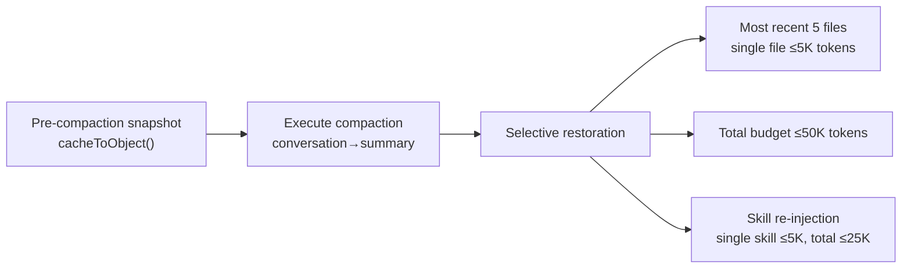
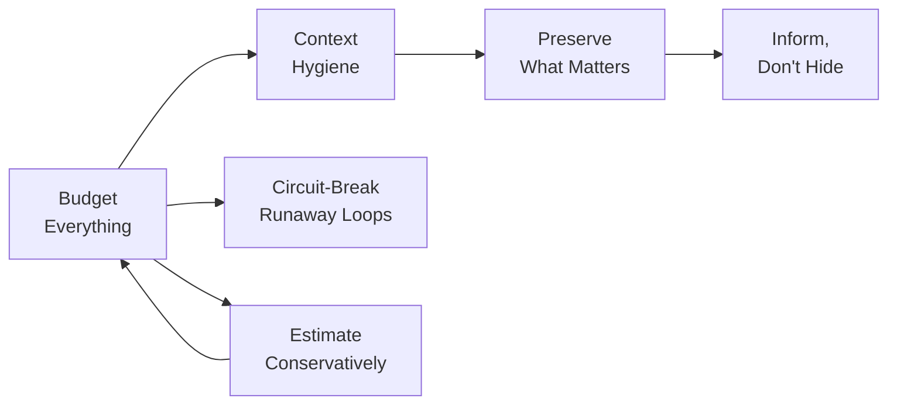

# Chapter 26: Context Management as a Core Competency

## Why This Matters

If you had to pick the single most underrated subsystem from Claude Code's entire codebase, it would be context management. The permission system is eye-catching, the Agent Loop is the core, and prompt engineering is widely known — but context management is the key infrastructure that determines whether an AI Agent can "continue working effectively."

A 200K token context window seems generous, but in real-world scenarios it's consumed faster than you'd expect: system prompts take about 15-20K, each tool call result takes 5-50K, and after a few rounds of file reads and code searches, you've already used half. More critically, the context window is not just a "capacity" issue — it's an "information density" issue. When the window is filled with stale tool results, redundant file contents, and resolved discussions, the model's attention is diluted and response quality degrades.

The context management system analyzed in Part Three (Chapters 9-12) reveals 6 core principles, with a common theme: **the context window is a scarce resource that must be managed as carefully as memory**.

---

## Source Code Analysis

### 26.1 Principle One: Budget Everything

**Definition**: Every piece of content entering the context window must have a clear token budget cap, no exceptions.

Claude Code's budget system covers every content source in the context window:

| Content Source | Budget Limit | Source Location |
|---------------|-------------|----------------|
| Single tool result | 50K characters | `restored-src/src/constants/toolLimits.ts:13` |
| All tool results in a single message | 200K characters | `restored-src/src/constants/toolLimits.ts:49` |
| File read | Default 2000 lines + offset/limit progressive reading | See Chapter 8 for details |
| Skill listing | 1% of context window | `restored-src/src/tools/SkillTool/prompt.ts:20-23` |
| Post-compaction file restoration | Max 5 files, 5K tokens per file, 50K total | `restored-src/src/services/compact/compact.ts:122` |
| Post-compaction skill restoration | 5K tokens per skill, 25K total | See Chapter 10 for details |
| Agent description list | Moved to attachments to control main prompt size | See Chapter 15 for details |

**Table 26-1: Claude Code's token budget system**

Note the granularity of the design: there's not just a "total budget," but also "per-item budgets." The sources for both:

```typescript
// restored-src/src/constants/toolLimits.ts:13
export const DEFAULT_MAX_RESULT_SIZE_CHARS = 50_000

// restored-src/src/constants/toolLimits.ts:49
export const MAX_TOOL_RESULTS_PER_MESSAGE_CHARS = 200_000
```

`MAX_TOOL_RESULTS_PER_MESSAGE_CHARS = 200_000` prevents N parallel tools from simultaneously returning large results and flooding the context — even if each tool result is within 50K, 10 parallel tools could produce 500K characters. The per-message budget is a safeguard against this "legitimate but dangerous" combination.

The 1% budget for the skill listing is particularly noteworthy:

```typescript
// restored-src/src/tools/SkillTool/prompt.ts:20-23
// Skill listing gets 1% of the context window (in characters)
export const SKILL_BUDGET_CONTEXT_PERCENT = 0.01
export const CHARS_PER_TOKEN = 4
export const DEFAULT_CHAR_BUDGET = 8_000 // Fallback: 1% of 200k × 4
```

As users install more and more skills, the skill listing could grow without bound. Claude Code's solution is a three-level truncation cascade: first truncate descriptions (`MAX_LISTING_DESC_CHARS = 250`), then truncate low-priority skills, and finally retain only the names of built-in skills. This ensures the skill listing never occupies more than 1% of the context window — even if the user has installed 1,000 skills.

**Anti-pattern: Unbounded content injection**. Injecting tool results, file contents, or configuration information into the context window without limits, ultimately filling the context with low-information-density content.

---

### 26.2 Principle Two: Context Hygiene

**Definition**: Context management is not just about compressing content already in the window, but about proactively filtering out high-cost information irrelevant to the current agent's goals before injection.

Claude Code implements this principle thoroughly within its sub-agent system. Read-only agents like `Explore` / `Plan` don't inherit the main agent's complete control plane: `runAgent()` proactively omits `CLAUDE.md` hierarchical directives when conditions are met, and further removes `gitStatus` for `Explore` / `Plan`. The reason is not that this information is never useful, but that it's typically **dead weight** for read-only search agents: commit conventions, PR rules, and lint constraints only need to be interpreted by the main agent; stale `git status` may take up tens of KB but can't help with code searching.

More importantly, this trimming happens **when generating the sub-agent's context**, not as a compression fix-up after token pressure builds. Standard sub-agents isolate search noise within their own conversation, returning only a condensed result to the parent; `Explore` even defaults to `omitClaudeMd: true`. This is the essence of "context hygiene": don't let low-information-density content enter the window first, then hope the compression system cleans up afterward.

**Anti-pattern: Full inheritance**. Stuffing every helper agent with the complete system prompt, `CLAUDE.md`, git status, recent tool outputs, and user preferences, resulting in every read-only query redundantly paying for an expensive prefix.

---

### 26.3 Principle Three: Preserve What Matters

**Definition**: Compaction is necessary, but post-compaction must selectively restore the most critical context.

Auto-compaction (see Chapter 9 for details) compresses the entire conversation history into a summary, freeing context space. But compaction loses specific code content, file paths, and precise line number references. If the model completely loses the contents of files it previously read after compaction, it needs to re-read them, wasting tool calls and user wait time.

Claude Code's solution is **post-compaction restoration** (see Chapter 10 for details):

```typescript
// restored-src/src/services/compact/compact.ts:122
export const POST_COMPACT_MAX_FILES_TO_RESTORE = 5
```

The restoration strategy flow:



**Figure 26-1: Compaction-restoration flow**

The key to the restoration strategy is **selectivity**: not restoring all files, but the most recent 5; not restoring complete file contents, but truncating within 5K tokens; total not exceeding 50K. These numbers reflect carefully considered trade-offs: **restoring too much is equivalent to not compacting, restoring too little is equivalent to over-compacting**.

The skill restoration design is equally refined. Post-compaction doesn't re-inject the names of already-sent skills (`sentSkillNames`), because the model still holds SkillTool's Schema — it knows the skill system exists, it just forgot the specific skill contents. This saves approximately 4K tokens.

**Anti-pattern: Full compaction or full preservation**. Either restoring nothing (model forced to start from scratch) or attempting to preserve everything (compaction effectiveness is zero).

---

### 26.4 Principle Four: Inform, Don't Hide

**Definition**: When content is truncated or compressed, the model must be informed about what happened, allowing it to proactively obtain the complete information.

Claude Code practices this principle at multiple levels:

**Tool result truncation notification**. When a tool result exceeds 50K characters (`DEFAULT_MAX_RESULT_SIZE_CHARS`), the complete result is written to disk (`restored-src/src/utils/toolResultStorage.ts`), and the model receives a preview message including truncation notice and the disk path to the full content. The model thus knows: (1) what it sees is not everything, (2) how to get everything.

**Cache micro-compaction notification** (see Chapter 11 for details). When `cache_edits` removes old tool results, `notifyCacheDeletion()` informs the model that "some old tool results have been cleaned up." This prevents the model from referencing content that no longer exists.

**File read pagination**. FileReadTool reads 2000 lines by default, supporting pagination through offset/limit parameters. The tool description explicitly explains this behavior — the model knows it only sees the first 2000 lines by default and can specify an offset when it needs later content.

**Explicit declaration in compaction summaries**. The compaction prompt (see Chapter 9 for details) requires the summary to include "where progress stands" and "what still needs to be done" — ensuring the post-compaction model knows which stage of the task it's at. The `<analysis>` draft block in the compaction prompt (`restored-src/src/services/compact/prompt.ts:31`) lets the model first analyze the conversation content, then generate a structured summary — the analysis block is removed during formatting and doesn't occupy final context space.

**Anti-pattern: Silent truncation**. Truncating tool results or deleting context content without the model's knowledge. The model may make incorrect decisions based on incomplete information, or "fabricate" content it can't quite remember — because it doesn't know its information is incomplete.

---

### 26.5 Principle Five: Circuit-Break Runaway Loops

**Definition**: When an automated process fails consecutively, there must be a mechanism to force a stop, rather than retrying infinitely.

The auto-compaction circuit breaker is the most direct implementation. `MAX_CONSECUTIVE_AUTOCOMPACT_FAILURES = 3` (`restored-src/src/services/compact/autoCompact.ts:70`) — after 3 consecutive failures, stop trying. The source code comment (see Chapter 25, Principle Six for the complete code reference) documents the engineering rationale for this number: BigQuery data showed 1,279 sessions experienced 50+ consecutive compaction failures (up to 3,272), wasting approximately 250K API calls per day.

More broadly, Claude Code implements similar circuit-breaking mechanisms across multiple subsystems:

| Subsystem | Circuit Break Condition | Circuit Break Behavior | Source Location |
|-----------|----------------------|----------------------|----------------|
| Auto-compaction | 3 consecutive failures | Stop compacting until session end | `autoCompact.ts:70` |
| YOLO classifier | 3 consecutive/20 total denials | Fall back to manual user confirmation | `denialTracking.ts:12-15` |
| max_output_tokens recovery | Max 3 retries | Stop retrying, accept truncated output | See Chapter 3 for details |
| Prompt-too-long | Drop oldest turns → drop 20% | Degraded handling, not infinite dropping | See Chapter 9 for details |

**Table 26-2: Claude Code's circuit breakers at a glance**

Each circuit breaker follows the same pattern: **set a reasonable retry limit, degrade to a safe but functionally limited state when exceeded, rather than crashing or infinite looping**.

**Anti-pattern: Infinite retry**. "Compaction failed? Try again. Failed again? Try with different parameters." This is especially dangerous in AI Agents — each retry consumes API calls (real money), and the failure reason is often systemic (context too large to compress within the summary token budget), so retrying won't change the result.

---

### 26.6 Principle Six: Estimate Conservatively

**Definition**: In token counting and budget allocation, it's better to overestimate consumption than to underestimate — underestimation leads to overflow, overestimation only wastes slightly more space.

Claude Code's token estimation chooses the conservative direction in every scenario (see Chapter 12 for details):

| Content Type | Estimation Strategy | Conservatism Level | Reason |
|-------------|-------------------|-------------------|--------|
| Plain text | 4 bytes/token | Moderate | English is actually ~3.5-4.5 |
| JSON content | 2 bytes/token | Highly conservative | Structural characters tokenize inefficiently |
| Images/documents | Fixed 2000 tokens | Highly conservative | Actual formula is width×height/750, but fixed value used when metadata unavailable |
| Cache tokens | From API usage | Exact (when available) | Only API-returned counts are authoritative |

**Table 26-3: Token estimation strategy comparison**

Estimating JSON at 2 bytes/token is a particularly meaningful design choice. JSON structural characters (`{}`, `[]`, `""`, `:`, `,`) tokenize far less efficiently than natural language — 100 bytes of JSON might consume 40-50 tokens, while 100 bytes of English only needs 25-30 tokens. If you use the generic 4 bytes/token estimate, JSON-dense tool results would be severely underestimated, potentially causing context overflow.

The skill listing budget also reflects this (`restored-src/src/tools/SkillTool/prompt.ts:22`): `CHARS_PER_TOKEN = 4` is used to convert token budgets to character budgets — using the most conservative characters/token ratio to ensure no overspending.

The benefits of conservative estimation far outweigh the costs. The worst case of overestimating token consumption is triggering compaction early — the user waits a few extra seconds. The worst case of underestimating token consumption is a `prompt_too_long` error — the API call fails, requiring emergency context dropping, potentially losing critical information.

**Anti-pattern: The illusion of exact counting**. Attempting to precisely calculate token counts on the client side. Only the API server-side tokenizer can provide exact values — any client-side count is an estimate. Since it's an estimate, it should be biased toward the safe direction.

---

## Pattern Distillation

### Six Principles Summary Table

| Principle | Core Source Code Trace | Anti-pattern |
|-----------|----------------------|--------------|
| Budget Everything | `toolLimits.ts:13,49` — 50K per item, 200K per message | Unbounded content injection |
| Context Hygiene | `runAgent.ts:385-404` — read-only agents omit `CLAUDE.md` and `gitStatus` | Full inheritance |
| Preserve What Matters | `compact.ts:122` — restore most recent 5 files | Full compaction or full preservation |
| Inform, Don't Hide | `toolResultStorage.ts` — provide disk path when truncating | Silent truncation |
| Circuit-Break Runaway Loops | `autoCompact.ts:70` — stop after 3 consecutive failures | Infinite retry |
| Estimate Conservatively | `SkillTool/prompt.ts:22` — `CHARS_PER_TOKEN = 4` | The illusion of exact counting |

**Table 26-4: Summary of the Six Context Management Principles**

### Relationships Between Principles



**Figure 26-2: Relationship diagram of the six context management principles**

**Budget Everything** is the foundation — defining the token cap for each content source. **Context Hygiene** determines what content shouldn't enter the current window at all. **Preserve What Matters** handles post-compaction restoration, **Inform, Don't Hide** ensures the model knows what's been truncated, **Circuit-Break Runaway Loops** prevents automated processes from exceeding budgets, and **Estimate Conservatively** ensures budgets aren't circumvented by underestimation.

### Pattern: Tiered Token Budget

- **Problem solved**: Multiple content sources competing for limited context space
- **Core approach**: Independent budget per source + total budget, with truncation cascade handling for overage
- **Code template**: Per-item limit (50K) → aggregate limit (200K/message) → global limit (context window - output reserve - buffer)
- **Precondition**: Ability to estimate content's token consumption before injection

### Pattern: Context Hygiene

- **Problem solved**: Read-only helper agents repeatedly inheriting irrelevant but expensive prefix content
- **Core approach**: Omit context irrelevant to the current responsibility at spawn time, and isolate exploration noise within sub-conversations
- **Precondition**: Ability to distinguish which context the current agent will actually consume

### Pattern: Compaction-Restoration Cycle

- **Problem solved**: Compaction loses critical context
- **Core approach**: Pre-compaction snapshot → compact → selectively restore most recent/most important content
- **Precondition**: Ability to track which content was "most recently used"

### Pattern: Circuit Breaker

- **Problem solved**: Automated processes infinitely looping under abnormal conditions
- **Core approach**: Stop after N consecutive failures, degrade to safe state
- **Precondition**: Defined criteria for "failure" and post-degradation behavior

---

## What You Can Do

1. **Audit your Agent's context consumption**. Measure how many tokens each content source consumes in real-world scenarios, and identify the biggest consumers
2. **Set size limits for tool results**. Ensure file reads, database queries, and API call results have character/line count caps
3. **Slim down read-only helpers**. Search-type and planning-type agents should not inherit the complete `CLAUDE.md`, git status, and recent tool outputs by default
4. **Implement post-compaction restoration**. If your Agent uses context compression, design a restoration strategy — so the post-compaction model doesn't need to start from zero
5. **Inform the model when truncating**. Tell the model "this is truncated, the full version is here" — this is far better than silently truncating and having the model discover the information gap on its own
6. **Add circuit breakers**. Set retry limits for any potentially looping automated process. Degraded operation is always better than an infinite loop
