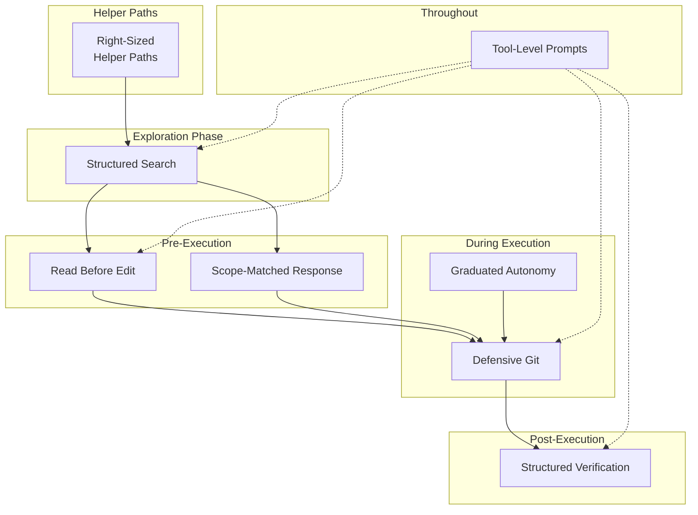

# Chapter 27: Production-Grade AI Coding Patterns

## Why This Matters

The preceding two chapters distilled "principles" — high-level guidance on how to think about harness engineering and context management. This chapter is different: we focus on **8 specific, directly reusable coding patterns**. Each pattern is extracted from Claude Code's actual implementation, with clear problem definitions, implementation approaches, and source code evidence.

These patterns share a common trait: they look simple enough to seem trivial, but have been repeatedly validated as necessary in production environments. "Read before edit" — who would edit without reading? But Claude Code enforces it with tool errors, because AI models do indeed skip reading and edit directly. "Defensive Git" — of course you shouldn't force push, but Claude Code emphasizes it with entire prompt paragraphs, because models under pressure do indeed choose the shortest path.

---

## Source Code Analysis

### 27.1 Pattern One: Read Before Edit

**Problem**: AI models may attempt to edit files without reading the current contents, causing edits based on stale or incorrect assumptions.

Claude Code enforces this through a **dual-layer safeguard**:

1. **Prompt layer** (soft constraint): FileEditTool's description explicitly states "You must use your Read tool at least once in the conversation before editing. This tool will error if you attempt an edit without reading the file" (see Chapter 8 for details)
2. **Code layer** (hard constraint): FileEditTool's `call()` method checks whether the current conversation contains a Read call for the target file before executing an edit. If not, it returns an error

The design significance of the dual-layer safeguard is: prompts are "soft constraints" — the model follows them most of the time, but under certain conditions (context too long causing instructions to be "forgotten," attention drift in multi-turn conversations) they may be ignored. The code layer is a "hard constraint" — even if the model ignores the prompt, the tool itself refuses to execute.

| Dimension | Description |
|-----------|-------------|
| **Implementation** | Prompt instruction (soft constraint) + tool code check (hard constraint) |
| **Source reference** | FileEditTool prompt (see Chapter 8 for details) |
| **Applicable scenario** | Any tool that needs to modify existing content |
| **Anti-pattern** | Relying solely on prompt instructions without enforcing at the code layer |

---

### 27.2 Pattern Two: Graduated Autonomy

**Problem**: AI Agents need to find a balance between "asking the user at every step" (low efficiency) and "never asking" (high risk).

Claude Code designed a permission mode gradient from most restrictive to most permissive (see Chapter 16 for details):

```
default → acceptEdits → plan → bypassPermissions → auto → dontAsk
  │           │           │           │               │       │
  │           │           │           │               │       └── Full autonomy
  │           │           │           │               └── Classifier auto-decides
  │           │           │           └── Skip permission checks
  │           │           └── Plan only, don't execute
  │           └── Auto-accept edits, confirm others
  └── Confirm every step
```

The key design isn't the modes themselves, but **automation with fallback**. `auto` mode uses the YOLO classifier (see Chapter 17 for details) to automatically make permission decisions, but has two safety valves. The denial tracking implementation is remarkably concise:

```typescript
// restored-src/src/utils/permissions/denialTracking.ts:12-15
export const DENIAL_LIMITS = {
  maxConsecutive: 3,
  maxTotal: 20,
} as const

// restored-src/src/utils/permissions/denialTracking.ts:40-44
export function shouldFallbackToPrompting(
  state: DenialTrackingState
): boolean {
  return (
    state.consecutiveDenials >= DENIAL_LIMITS.maxConsecutive ||
    state.totalDenials >= DENIAL_LIMITS.maxTotal
  )
}
```

When the classifier denies operations 3 consecutive times or 20 times total, the system permanently falls back to manual user confirmation. This means even in the most autonomous mode, the system retains the ability to fall back to human decision-making. Autonomy is not "all or nothing," but a continuous spectrum, with a safety net at every position.

| Dimension | Description |
|-----------|-------------|
| **Implementation** | Multi-level permission modes + classifier auto-decision + denial tracking fallback |
| **Source reference** | Permission modes (Chapter 16), YOLO classifier (Chapter 17), `denialTracking.ts:12-44` |
| **Applicable scenario** | Any AI Agent system requiring human-machine collaboration |
| **Anti-pattern** | Binary permissions: only "manual" and "automatic," with no middle ground or safety fallback |

---

### 27.3 Pattern Three: Defensive Git

**Problem**: AI models may choose the "shortest path" when executing Git operations, leading to data loss or hard-to-recover states.

Claude Code embeds a complete Git Safety Protocol in the BashTool prompt (see Chapter 8 for details), with core rules including:

1. **Never skip hooks** (`--no-verify`): pre-commit hooks are the project's quality gates
2. **Never amend** (unless the user explicitly requests it): `git commit --amend` modifies the previous commit, and using it after a hook failure would overwrite the user's previous commit
3. **Prefer specific files**: `git add <specific-files>` rather than `git add -A`, to avoid accidentally adding `.env` or credential files
4. **Never force push to main/master**: warn even if the user requests it
5. **Create a new commit rather than amend**: after a hook failure, the commit didn't happen — at that point `--amend` would modify the **previous** commit

Rule 5 is especially important. When a hook fails, the model's natural inclination is "fix the problem, then amend" — but the prompt explicitly explains the causal relationship:

> A pre-commit hook failure means the commit **did not happen** — so `--amend` would modify the **previous** commit, which may destroy prior work or lose changes. The correct action is to fix the issue, re-stage, and create a **new** commit.

The existence of these rules indicates that models do indeed make these mistakes. Training data contains numerous Git tutorials that recommend amend to "fix the last commit" — without distinguishing between hook failures and normal commits.

| Dimension | Description |
|-----------|-------------|
| **Implementation** | Explicit safety protocols in tool prompts, covering common dangerous operation paths |
| **Source reference** | BashTool prompt's Git Safety Protocol (see Chapter 8 for details) |
| **Applicable scenario** | Any system that allows AI to perform Git operations |
| **Anti-pattern** | Relying on the model's "common sense" — the model's Git knowledge comes from tutorials that don't distinguish context |

---

### 27.4 Pattern Four: Structured Verification

**Problem**: AI models may claim "tests passed" or "code is correct" without actually running verification.

Claude Code establishes a clear verification chain in the system prompt (see Chapter 6 for details): run tests → check output → report honestly. This seemingly simple flow is reinforced through multiple mechanisms:

**Reversibility awareness**. Operations are graded by risk, and the model is expected to treat them differently:

| Operation Type | Examples | Required Model Behavior |
|---------------|----------|----------------------|
| Reversible | Edit files, create files, read-only commands | Execute directly |
| Irreversible | Delete files, force push, send messages | Confirm then execute |
| High risk | `rm -rf`, DROP TABLE, kill processes | Explain risk + confirm |

**Scope constraints**. The model is told "authorization for X does not extend to Y" — fixing a bug does not authorize modifying test cases or skipping tests.

**Ant-only reinforcement directives**. Capybara v8 added explicit countermeasures against the model's tendency to "claim completion without verification":

```typescript
// restored-src/src/constants/prompts.ts:211
// @[MODEL LAUNCH]: capy v8 thoroughness counterweight
`Before reporting a task complete, verify it actually works: run the
test, execute the script, check the output. Minimum complexity means
no gold-plating, not skipping the finish line. If you can't verify
(no test exists, can't run the code), say so explicitly rather than
claiming success.`
```

The `@[MODEL LAUNCH]` annotation indicates this is a model-version-specific behavioral correction — when the model is upgraded, the team reassesses whether this directive is still needed.

| Dimension | Description |
|-----------|-------------|
| **Implementation** | Verification chain (run→check→report) + reversibility grading + scope constraints |
| **Source reference** | System prompt verification directives (Chapter 6), `prompts.ts:211` |
| **Applicable scenario** | Any scenario requiring AI to modify code and verify correctness |
| **Anti-pattern** | Trusting the model's self-reporting without requiring actual test output |

---

### 27.5 Pattern Five: Scope-Matched Response

**Problem**: AI models tend to "incidentally" do extra things — refactoring while fixing bugs, updating docs while adding features — causing change scope to spiral out of control.

Claude Code's system prompt contains a series of extremely specific scope restriction directives (see Chapter 6 for details). The most critical set comes from `getSimpleDoingTasksSection()`:

```typescript
// restored-src/src/constants/prompts.ts:200-203
"Don't add features, refactor code, or make 'improvements' beyond what
 was asked. A bug fix doesn't need surrounding code cleaned up. A simple
 feature doesn't need extra configurability. Don't add docstrings,
 comments, or type annotations to code you didn't change."

"Don't add error handling, fallbacks, or validation for scenarios that
 can't happen. Trust internal code and framework guarantees."

"Don't create helpers, utilities, or abstractions for one-time operations.
 Don't design for hypothetical future requirements. ... Three similar
 lines of code is better than a premature abstraction."
```

Note the specificity of these directives — not abstract "keep it simple," but decidable rules: "don't add docstrings to code you didn't modify," "three repeated lines are better than a premature abstraction."

Another elegant scope restriction is "authorization doesn't extend." A user approved a `git push`, and the model might interpret this as "the user authorizes all Git operations." The prompt breaks this reasoning: the scope of authorization is what was explicitly specified, nothing beyond it.

| Dimension | Description |
|-----------|-------------|
| **Implementation** | Explicit scope restrictions in system prompt + minimum complexity principle |
| **Source reference** | `prompts.ts:200-203` (minimalism directive set) |
| **Applicable scenario** | Any AI-assisted coding scenario |
| **Anti-pattern** | Encouraging "thoroughness" — "please ensure code quality" gives the model unlimited scope |

---

### 27.6 Pattern Six: Tool-Level Prompts Over Generic Instructions

**Problem**: Too many instructions in the generic system prompt make it difficult for the model to recall the right instruction at the right time.

Claude Code lets each tool carry its own behavioral harness (see Chapter 8 for details), rather than stuffing all behavioral instructions into the system prompt:

| Location | Content |
|----------|---------|
| System prompt | General behavioral directives, output format, security principles |
| BashTool description | Git safety protocol, sandbox configuration, background task instructions |
| FileEditTool description | "Read before edit," minimal unique `old_string`, `replace_all` usage |
| FileReadTool description | Default line count, offset/limit pagination, PDF page ranges |
| GrepTool description | ripgrep syntax, multiline matching, "always use Grep instead of grep" |
| AgentTool description | Fork guidance, isolation mode, "don't peek at fork output" |
| SkillTool description | Budget constraints, three-level truncation cascade, built-in skills priority |

The advantage of tool-level prompts is **temporal alignment**: when the model decides to call BashTool, BashTool's description (including the Git safety protocol) is within its attention focus. If the Git safety protocol were in the system prompt, the model would need to "recall" it from tens of thousands of tokens of context — unreliable in long sessions.

Another advantage of tool-level prompts is **cache efficiency**. Tool descriptions, as part of the `tools` parameter, occupy a relatively stable position in API requests. Modifying a tool description only affects the tool list hash, not the system prompt segment — the `perToolHashes` in cache break detection (`restored-src/src/services/api/promptCacheBreakDetection.ts:36-38`) exists precisely to track which tool's description changed, rather than invalidating the entire cache prefix.

| Dimension | Description |
|-----------|-------------|
| **Implementation** | Behavioral directives follow tool descriptions, naturally entering the model's attention when the tool is invoked |
| **Source reference** | Each tool's prompt field (see Chapter 8 for details), `promptCacheBreakDetection.ts:36-38` |
| **Applicable scenario** | Any AI Agent that provides multiple tools |
| **Anti-pattern** | Centralized instruction library — all instructions in the system prompt, with declining compliance rates in long sessions |

---

### 27.7 Pattern Seven: Structured Search Over Shell Text Parsing

**Problem**: If the model directly consumes raw output from `grep`, `find`, `ls` and other shell commands, it must parse `path:line:text`, newline-separated paths, count summaries, and various noise prefixes on every round. As search rounds multiply, this "having the model repeatedly do string splitting" approach wastes both context and reasoning budget.

Claude Code's search design already partially reflects the opposite direction: **search is not a use case of Bash, but an independent read-only tool** (see Chapter 8 for details). Both `GrepTool` and `GlobTool` use dedicated implementations under the hood rather than shell pipelines, and internally produce structured results first, then serialize them into the minimal form consumable by the model as `tool_result`.

`GrepTool`'s internal output includes search pattern, file list, matching content, counts, and pagination information:

```typescript
// Simplified from GrepTool's outputSchema
{
  mode: 'content' | 'files_with_matches' | 'count',
  numFiles,
  filenames,
  content,
  numLines,
  numMatches,
  appliedLimit,
  appliedOffset,
}
```

`GlobTool`'s internal output is likewise a structured object, not the raw stdout of `rg --files` fed directly to the model:

```typescript
// Simplified from GlobTool's outputSchema
{
  durationMs,
  numFiles,
  filenames,
  truncated,
}
```

But what's more interesting is the next step: Claude Code **does not** fully JSON-serialize these objects back to the model. Instead, it chooses a "structured internally, textualized externally" compromise. `GrepTool` in `files_with_matches` mode returns only a file path list, in `count` mode returns `path:count` summaries, and only in `content` mode returns actual matching lines; `GlobTool` only returns path lists and a truncation hint. This shows the real optimization target is not "structure itself," but **letting the harness own structure while the model only sees the minimum information needed for the current decision**.

From a harness engineering perspective, this leads to a pattern more important than `grep`/`glob` themselves: **phased search protocol**. Ideal agent-native search shouldn't let the model gulp down large volumes of matching lines upfront, but should split into three layers:

1. **Candidate file layer**: First return paths, stable IDs, modification times, and other lightweight metadata, answering "which files are worth looking at"
2. **Hit summary layer**: Then return match counts per file, first hit position, and first excerpt, answering "which files to expand first"
3. **Snippet expansion layer**: Finally return precise snippets and line numbers only for selected files, answering "which specific code segment to look at"

Claude Code hasn't fully split these three layers into independent tools yet, but the existing implementation already has two key prerequisites: **dedicated search tools** and **structured intermediate results**. Further evidence is that `ToolSearchTool` can already return `tool_reference` — a richer block type, not limited to plain text. This indicates that in harnesses like Claude Code, "model directly parsing shell text" is not the only option, and may not even be the best one.

| Dimension | Description |
|-----------|-------------|
| **Implementation** | Dedicated Grep/Glob tools + structured intermediate results + textualized minimal return |
| **Source reference** | `GrepTool.ts` / `GlobTool.ts` `outputSchema` and `mapToolResultToToolResultBlockParam()`; `ToolSearchTool.ts` `tool_reference` return |
| **Applicable scenario** | Large codebase exploration, multi-round search, sub-agent investigation, systems requiring strict context cost control |
| **Anti-pattern** | Degrading search to Bash `grep/find/cat` text pipelines, having the model re-parse strings on every round |

---

### 27.8 Pattern Eight: Right-Sized Helper Paths

**Problem**: If all queries follow the main loop's heavy model, full tool pool, and multi-turn agent loop, lightweight helper paths become expensive, slow, and often granted more capability surface than the task requires.

Claude Code's approach is not to bluntly "globally switch to a small model," but to reduce **the most expensive dimension** per call site. Session title generation and tool usage summaries both go through `queryHaiku()`; `claude.ts` also classifies `compact`, `side_question`, `extract_memories`, etc. as `non-agentic queries`. Meanwhile, `/btw` doesn't spin up a new Agent with a small model, but inherits the parent session context, launches a one-shot side query via `runForkedAgent()`, and reduces tool capability to 0 and turns to 1.

This shows Claude Code's real pattern is not simply "local model selection," but the more general **capability right-sizing**: sometimes shrinking the model, sometimes shrinking tools, sometimes shrinking turns, sometimes shrinking context. Standard sub-agents, forks, `/btw`, and title/summary helpers each trim along different dimensions.

| Path | Context | Tools | Turns | Model |
|------|---------|-------|-------|-------|
| Main Loop | Full main conversation | Full tool pool | Multi-turn | Main model |
| Standard Sub-Agent | New context | Assembled per role | Multi-turn | Overridable |
| `/btw` | Inherits parent context | All disabled | Single-turn | Inherits parent model |
| Title/Summary helper | Minimal input | No tools | Single-turn | Haiku |

The most valuable takeaway here is: **don't give every helper path the same "full-featured Agent" form**. Side Questions are lightweight because they only retain the capability needed to "answer the current question"; title generation is cheap because it only retains the model strength needed to "generate a short string." Claude Code treats "model size, tool permissions, turn budget, context inheritance" as four independently scalable knobs, not a globally unified configuration.

| Dimension | Description |
|-----------|-------------|
| **Implementation** | Independently reduce model/tools/turns/context per call site |
| **Source reference** | `sessionTitle.ts`, `toolUseSummaryGenerator.ts`, `claude.ts`, `sideQuestion.ts` |
| **Applicable scenario** | Title generation, summaries, quick side questions, memory extraction, read-only investigation, and other helper paths |
| **Anti-pattern** | All helper queries using the main model, full tool pool, and multi-turn loop |

---

## Pattern Distillation

### Eight Patterns Summary Table

| Pattern | Implementation | Source Reference |
|---------|---------------|-----------------|
| Read Before Edit | Prompt (soft) + tool code check (hard) | FileEditTool (Chapter 8) |
| Graduated Autonomy | Multi-level permissions + classifier + denial tracking fallback | `denialTracking.ts:12-44` |
| Defensive Git | Complete safety protocol in tool prompts | BashTool prompt (Chapter 8) |
| Structured Verification | Run→check→report + reversibility grading | `prompts.ts:211` |
| Scope-Matched Response | Specific, decidable scope restriction directives | `prompts.ts:200-203` |
| Tool-Level Prompts | Behavioral directives attached to corresponding tools | Each tool's prompt + `perToolHashes` |
| Structured Search | Dedicated search tools + structured intermediate results + phased expansion | `GrepTool.ts`, `GlobTool.ts`, `ToolSearchTool.ts` |
| Right-Sized Helper Paths | Reduce model/tools/turns/context per call site | `sessionTitle.ts`, `toolUseSummaryGenerator.ts`, `sideQuestion.ts` |

**Table 27-1: Summary of the eight production-grade patterns**

### Pattern Positions in the Tool Execution Lifecycle



**Figure 27-1: Position of the eight patterns in the tool execution lifecycle**

**Right-Sized Helper Paths** operates on helper paths — it decides whether a helper query truly needs a heavy model, full tools, and multi-turn state. **Structured Search** sits at the earliest exploration phase — it determines what search results the model sees, and at what granularity these results enter the context. **Tool-Level Prompts** spans the entire lifecycle — the other seven patterns are all implemented through tool prompts. **Read Before Edit** and **Scope-Matched Response** constrain pre-execution preparation. **Defensive Git** and **Graduated Autonomy** control safety boundaries during execution. **Structured Verification** ensures post-execution correctness.

### Global Pattern: Dual-Layer Constraint

- **Problem solved**: Prompts alone cannot 100% guarantee model compliance with rules
- **Core approach**: For high-risk behaviors, use prompts as "soft constraints" and code as "hard constraints"
- **Code template**: Tool description states the rule → `call()` method checks preconditions → returns error when unsatisfied
- **Precondition**: Ability to detect preconditions at the code layer

### Global Pattern: Safety Gradient

- **Problem solved**: Different tasks require different degrees of autonomy
- **Core approach**: Multi-level modes, each with a clear safety net
- **Precondition**: Ability to assess the risk level of operations

### Global Pattern: Phased Search Protocol

- **Problem solved**: Open-ended codebase searches quickly consume context and force the model to repeatedly parse text results
- **Core approach**: First return candidate files, then hit summaries, then expand precise snippets on demand
- **Precondition**: Search tools can return pagination, counts, and stable references, not just raw stdout

### Global Pattern: Capability Right-Sizing

- **Problem solved**: Helper queries default to inheriting the main thread's full capabilities, making costs and risks higher than necessary
- **Core approach**: Independently reduce model, tools, turns, or context per call site, rather than offering only one "full-featured agent"
- **Precondition**: The runtime can independently control model routing, tool permissions, and turn budgets

---

## What You Can Do

1. **Implement dual-layer constraints for critical behaviors**. If violating a behavior would cause irreversible consequences, don't rely solely on prompts — add precondition checks in tool code
2. **Design permission gradients, not binary switches**. Provide at least 3 autonomy levels for the Agent: manual confirmation, classifier auto-decision (with fallback), and full autonomy
3. **Explicitly explain causal relationships in Git operation prompts**. "Don't amend" isn't enough — explain "amending after a hook failure modifies the previous commit, causing change loss"
4. **Require the model to show verification output**. Don't accept a textual report of "tests passed" — require showing actual test output
5. **Replace vague instructions with specific rules**. Replace "maintain code quality" with "don't add comments to unmodified code," "three repeated lines are better than a premature abstraction"
6. **Attach behavioral directives to corresponding tools**. Git safety rules go in the Bash tool description, file operation rules go in the file tool description — don't pile everything into the system prompt
7. **Don't make the model repeatedly parse shell search text**. Split search into "candidate files → hit summaries → precise snippets" three steps, which is more context-efficient than returning large `grep` output upfront
8. **Don't give every helper full capabilities**. Title, summary, side question, and memory extraction paths should each trim model, tools, or turns separately, rather than copying the main Loop
