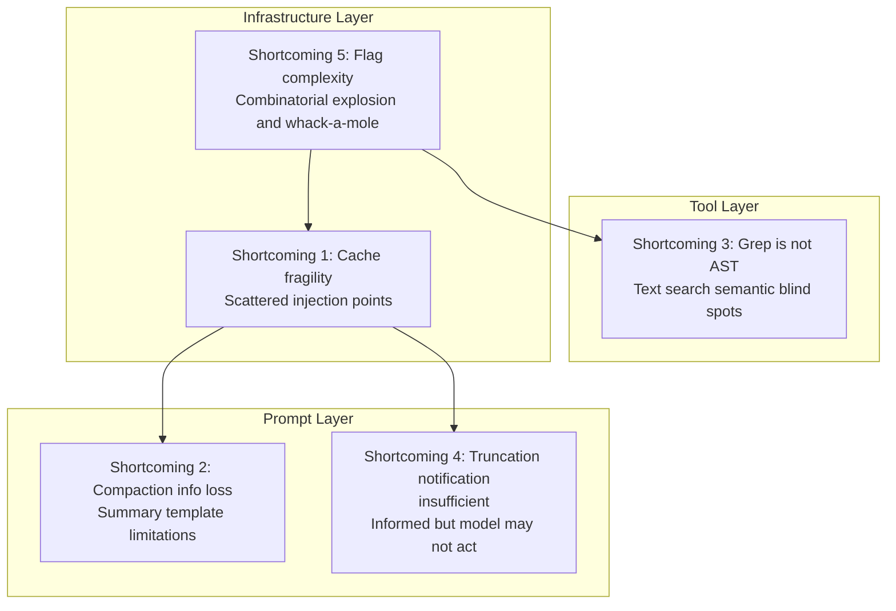
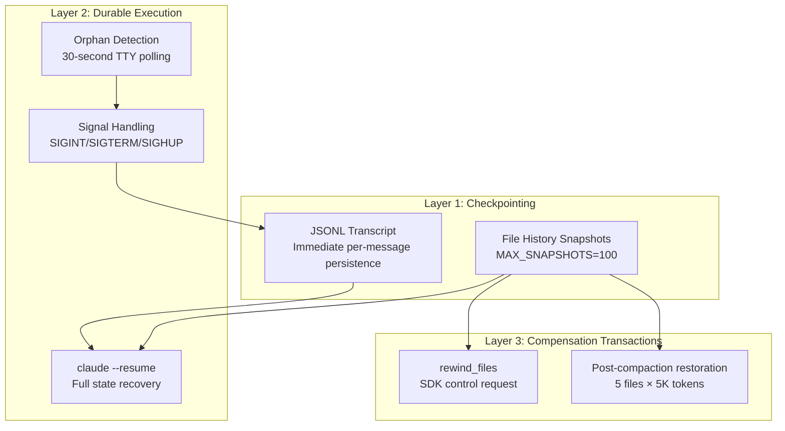

# Chapter 28: Where Claude Code Falls Short (And What You Can Fix)

## Why This Matters

The preceding three chapters distilled Claude Code's excellent designs — harness engineering principles, context management strategies, production-grade coding patterns. But a serious technical analysis cannot only discuss "what it got right" — it must also objectively examine "where it falls short."

This chapter lists 5 design shortcomings observable from the source code. Each shortcoming includes three parts: **problem description** (what it is), **source code evidence** (why it's a problem), and **improvement suggestions** (what can be done).

It should be emphasized: these analyses are entirely at the engineering design level and do not involve evaluations of the Anthropic team's capabilities. Every "shortcoming" is a reasonable choice within specific engineering trade-offs — these choices simply have observable costs.

---

## Source Code Analysis

### 28.1 Shortcoming One: Cache Fragility — Scattered Injection Points Create Cache Break Risks

#### Problem Description

Claude Code's prompt caching system relies on a core assumption: **content before `SYSTEM_PROMPT_DYNAMIC_BOUNDARY` remains unchanged throughout the session**. But multiple scattered injection points can modify this region:

- Conditional sections in `systemPromptSections.ts`: included or excluded based on Feature Flags or runtime state
- MCP connection/disconnection events: `DANGEROUS_uncachedSystemPromptSection()` explicitly marks "will break cache"
- Tool list changes: MCP servers going up/down cause `tools` parameter hash changes
- GrowthBook Flag switches: remote configuration changes cause serialized tool schema changes

#### Source Code Evidence

The cache break detection system needing to track nearly 20 fields (`restored-src/src/services/api/promptCacheBreakDetection.ts:28-69`) is direct evidence — if the cache were stable, such a complex detection system to explain "why it broke" wouldn't be needed.

The naming of `DANGEROUS_uncachedSystemPromptSection()` itself is a warning marker — the `DANGEROUS` prefix in the function name indicates the team is well aware it breaks cache, but in certain scenarios (MCP state changes) there's no better alternative.

The agent list was once inlined in the system prompt, accounting for 10.2% of global `cache_creation` tokens (see Chapter 15 for details). Although it was later moved to attachments, this demonstrates that even experienced teams can inadvertently place unstable content within the cache segment.

The three code paths in `splitSysPromptPrefix()` (`restored-src/src/utils/api.ts:321-435`) — MCP tool-based, global+boundary, and default org-level — derive their complexity entirely from handling "various changes that might occur within the cache segment." The source code comments explicitly mark cross-references:

```typescript
// restored-src/src/constants/prompts.ts:110-112
// WARNING: Do not remove or reorder this marker without updating
// cache logic in:
// - src/utils/api.ts (splitSysPromptPrefix)
// - src/services/api/claude.ts (buildSystemPromptBlocks)
```

This kind of cross-file `WARNING` comment is a signal of architectural fragility — components are coupled through implicit conventions rather than explicit interfaces.

#### Improvement Suggestions

**Centralize prompt construction**. Transform scattered injection into centralized construction:

1. **Build phase**: All sections are assembled in a central function, with an overall hash calculated after assembly
2. **Immutability constraint**: Enforce compile-time or runtime immutability checks on cache segment content — any content that changes during a session is forced outside the cache segment
3. **Change auditing**: Automatically detect before commit "whether unstable content has been added within the cache segment"

---

### 28.2 Shortcoming Two: Compaction Information Loss — 9-Section Summary Template Cannot Preserve All Reasoning Chains

#### Problem Description

Auto-compaction (see Chapter 9 for details) uses a structured prompt template requiring the model to generate a conversation summary. The compaction prompt (`restored-src/src/services/compact/prompt.ts`) requires the `<analysis>` block to include:

```typescript
// restored-src/src/services/compact/prompt.ts:31-44
"1. Chronologically analyze each message and section of the conversation.
    For each section thoroughly identify:
    - The user's explicit requests and intents
    - Your approach to addressing the user's requests
    - Key decisions, technical concepts and code patterns
    - Specific details like:
      - file names
      - full code snippets
      - function signatures
      ..."
```

This is a carefully designed checklist, but has a fundamental limitation: **the model's reasoning chains and failed attempts are lost in compaction**.

Specific types of information lost:

- **Failed approaches**: The model tried approach A but failed, then used approach B successfully — post-compaction only preserves "used approach B to solve the problem," while approach A's failure experience is lost
- **Decision context**: The reasoning for why approach B was chosen over approach A is simplified to a conclusion
- **Precise references**: Specific file paths and line numbers may be generalized in the summary — "modified the authentication module" rather than "modified `auth/middleware.ts:42-67`"

#### Source Code Evidence

The compaction token budget is `MAX_OUTPUT_TOKENS_FOR_SUMMARY = 20_000` (`restored-src/src/services/compact/autoCompact.ts:30`). Compression ratios can reach 7:1 or higher — at such compression ratios, information loss is inevitable.

The post-compaction file restoration mechanism (`POST_COMPACT_MAX_FILES_TO_RESTORE = 5`, `restored-src/src/services/compact/compact.ts:122`) partially mitigates the problem, but only restores file contents, not reasoning chains.

The existence of `NO_TOOLS_PREAMBLE` (`restored-src/src/services/compact/prompt.ts:19-25`) hints at another compaction quality issue: the model sometimes attempts to call tools instead of generating summary text during compaction (2.79% occurrence rate on Sonnet 4.6), requiring explicit prohibition. This means the compaction task itself is not trivial for the model.

#### Improvement Suggestions

**Structured information extraction + tiered compaction**:

1. **Structured extraction**: Use a dedicated step before compaction to extract structured information — file modification lists, failed approach lists, decision graphs — stored as JSON rather than natural language summaries
2. **Tiered compaction**: Split the conversation into a "fact layer" (file modifications, command outputs) and a "reasoning layer" (why things were done this way). Fact layer uses extractive compression (direct extraction), reasoning layer uses abstractive compression (current approach)
3. **Failure memory**: Specifically preserve a "tried but failed approaches" list, preventing the post-compaction model from repeating past failures

---

### 28.3 Shortcoming Three: Grep Is Not an AST — Text Search Misses Semantic Relationships

#### Problem Description

Claude Code's code search is entirely based on GrepTool (text regex matching) and GlobTool (filename pattern matching). This works well in most scenarios, but cannot cover **semantic-level code relationships**:

- **Dynamic imports**: `require(variableName)` — the variable is a runtime value, and text search cannot track it
- **Re-exports**: `export { default as Foo } from './bar'` — not correctly tracked when searching for `Foo`'s definition
- **String references**: Tool names registered as strings (`name: 'Bash'`) — searching for tool usage points requires searching both strings and variable names
- **Type inference**: TypeScript's type inference means many variables lack explicit annotations — searching for usage locations of a specific type is incomplete

#### Source Code Evidence

Claude Code's own tool list contains 40+ tools (see Chapter 2 for details), but no AST query tool. The system prompt explicitly guides the model to use Grep instead of Bash's grep (see Chapter 8 for details) — but this merely moves text search from one tool to another, without elevating the semantic level of search.

In Claude Code's own codebase (1,902 TypeScript files), the impact of these omissions is observable. For example: Feature Flags are used via `feature('KAIROS')` calls — searching the string `KAIROS` can find usage points, but searching for calls to the `feature` function returns results for all 89 flags with enormous noise. Without AST queries, there's no way to express "find locations where `feature()` is called with parameter value `KAIROS`."

#### Improvement Suggestions

**Add LSP (Language Server Protocol) integration**:

1. **Type lookup**: Query a variable's inferred type through TypeScript Language Server
2. **Go to definition**: Handle the complete chain of re-exports, type aliases, and dynamic imports
3. **Find references**: Find all usage locations of a symbol, including indirect usage through type inference
4. **Call hierarchy**: Query a function's callers and callees, building a call graph

The infrastructure for LSP integration already shows signs in the source code — some experimental LSP-related code paths can be observed in Feature Flag analysis (see Chapter 23 for details), but they are not widely enabled yet. The combination of Grep + LSP would be more powerful than pure Grep or pure LSP alone: Grep handles fast full-text search and pattern matching, LSP handles precise semantic queries.

---

### 28.4 Shortcoming Four: Informing About Truncation ≠ Acting on It — Large Results Written to Disk But the Model May Not Re-Read

#### Problem Description

When a tool result exceeds 50K characters (`DEFAULT_MAX_RESULT_SIZE_CHARS`, `restored-src/src/constants/toolLimits.ts:13`), the handling strategy is: write the complete result to disk, return a preview message (see Chapter 12 for details).

The problem is: **the model may not re-read**. The model makes judgments based on the preview — if the preview looks "sufficient" (e.g., the first 50K characters of search results already contain some relevant results), the model may not read the full content. But critical information might be just past the truncation point.

#### Source Code Evidence

`restored-src/src/utils/toolResultStorage.ts` implements the large result persistence logic. When truncating, the model receives:

```
[Result truncated. Full output saved to /tmp/claude-tool-result-xxx.txt]
[Showing first 50000 characters of N total]
```

This follows the "Inform, Don't Hide" principle from Chapter 25 — the model is informed that truncation occurred. But "informing" and "ensuring the model acts" are two different things.

The root cause is **the attention economy**: the model must decide what to do next at every step. Reading the full truncated file means one more tool call, waiting a few more seconds — if the model judges the preview is "good enough," it will skip this step. But this judgment itself may be wrong, because the model **cannot see** the content after the truncation point.

#### Improvement Suggestions

**Smart preview + proactive suggestions**:

1. **Structured preview**: Instead of truncating to the first N characters, extract a summary — total matches in search results, file distribution, context around the first and last N matches
2. **Relevance hints**: Add to the preview "Results contain M total matches, currently showing only the first K. If you're looking for a specific file or pattern, consider viewing the full content"
3. **Auto-pagination**: When truncating, don't just save to disk and wait for the model to come read — paginate the results and display pagination information in the preview for the model to continue on demand

---

### 28.5 Shortcoming Five: Feature Flag Complexity — Emergent Behavior of 89 Flags

#### Problem Description

Claude Code has 89 Feature Flags (see Chapter 23 for details), controlled through two mechanisms:

1. **Build-time**: The `feature()` function evaluates at compile time, with dead code elimination removing disabled branches
2. **Runtime**: GrowthBook `tengu_*`-prefixed flags fetched via API

The problem is the **interaction effects** between flags. 89 binary flags theoretically produce 2^89 combinations. Even if only 10% of flags interact, the combinatorial space is enormous.

#### Source Code Evidence

The following are observable flag interaction examples from the source code:

| Flag A | Flag B | Interaction |
|--------|--------|------------|
| `KAIROS` | `PROACTIVE` | Assistant mode and proactive work mode have overlapping activation mechanisms |
| `COORDINATOR_MODE` | `TEAMMEM` | Both involve multi-agent communication, using different messaging mechanisms |
| `BRIDGE_MODE` | `DAEMON` | Bridge mode requires daemon support, but lifecycle management is independent |
| `FAST_MODE` | `ULTRATHINK` | Faster output and deep thinking may conflict in effort configuration |

**Table 28-1: Feature Flag interaction examples**

The latching mechanism (see Chapter 25, Principle Six) is a mitigation against flag interaction complexity — fixing certain states to reduce runtime combinations. But latching itself also adds to comprehension difficulty: the system's current behavior depends not only on the current flag values, but also on **the sequence of flag value changes throughout the session history**.

Tool schema caching (`getToolSchemaCache()`, see Chapter 15 for details) is another mitigation — computing the tool list once per session, preventing mid-session flag switches from causing schema changes. But this means flags switched mid-session won't affect the tool list — both a feature and a limitation.

Each latch-related field in `promptCacheBreakDetection.ts` carries a `Tracked to verify the fix` comment:

```typescript
// restored-src/src/services/api/promptCacheBreakDetection.ts:47-55
/** AFK_MODE_BETA_HEADER presence — should NOT break cache anymore
 *  (sticky-on latched in claude.ts). Tracked to verify the fix. */
autoModeActive: boolean
/** Overage state flip — should NOT break cache anymore (eligibility is
 *  latched session-stable in should1hCacheTTL). Tracked to verify the fix. */
isUsingOverage: boolean
/** Cache-editing beta header presence — should NOT break cache anymore
 *  (sticky-on latched in claude.ts). Tracked to verify the fix. */
cachedMCEnabled: boolean
```

Three fields, three instances of `should NOT break cache anymore`, three instances of `Tracked to verify the fix` — indicating that state changes in these flags **had previously** caused cache breaks, and the team fixed them one by one and added tracking to verify the fixes are effective. This is the classic "whack-a-mole" pattern — no systematic solution to flag interaction issues, just fixing cases as they surface.

#### Improvement Suggestions

**Flag dependency graph + mutual exclusion constraints**:

1. **Explicit dependency declarations**: Each flag declares its dependencies on other flags (`KAIROS_DREAM` depends on `KAIROS`), building tooling to validate dependency relationships at compile time
2. **Mutual exclusion constraints**: Declare flag combinations that cannot be enabled simultaneously
3. **Combinatorial testing**: Run automated tests on critical flag combinations, covering at least all pairwise combinations
4. **Flag state visualization**: In debug mode, output all flag values and latch states to help diagnose behavioral anomalies

---

## Pattern Distillation

### Five Shortcomings Summary Table

| Shortcoming | Source Code Evidence | Improvement Suggestion |
|-------------|---------------------|----------------------|
| Cache fragility | `promptCacheBreakDetection.ts` tracks 18 fields | Centralized construction + immutability constraints |
| Compaction information loss | `compact/prompt.ts` compression ratio 7:1+ | Structured extraction + tiered compaction |
| Grep is not an AST | No AST query tool among 40+ tools | LSP integration |
| Truncation notification insufficient | `toolResultStorage.ts` preview not guaranteed to be read | Smart preview + auto-pagination |
| Flag complexity | 3 `Tracked to verify the fix` comments | Flag dependency graph + mutual exclusion constraints |

**Table 28-2: Summary of the five shortcomings**

### Three Defense Layers and the Five Shortcomings



**Figure 28-1: Distribution of the five shortcomings across the three defense layers**

The two infrastructure-layer shortcomings (cache fragility, flag complexity) are the deepest — they affect overall system behavior and have the highest cost to fix. The two prompt-layer shortcomings (compaction information loss, silent truncation) are easier to mitigate — improving the compaction template or preview format doesn't require large-scale refactoring. The tool-layer shortcoming (Grep is not an AST) falls between the two — adding an LSP tool requires a new external dependency but doesn't change the core architecture.

### Anti-pattern: Scattered Injection

- **Problem**: Multiple independent injection points modifying the same shared state, making state changes unpredictable
- **Identification signal**: A complex detection system needed to explain "why did the state change"
- **Solution direction**: Centralized construction + immutability constraints

### Anti-pattern: Irreversible Lossy Compression

- **Problem**: Information lost after compression cannot be recovered
- **Identification signal**: Post-compaction model repeats previously attempted failed approaches
- **Solution direction**: Structured extraction of key information, tiered storage

---

## What You Can Do

### What You Can Act on Directly

1. **Cache fragility**: Control the variables you can through CLAUDE.md — keep project CLAUDE.md stable, avoid frequent modifications. Monitor `cache_creation` token consumption in your API bills
2. **Silent truncation**: Add a directive in CLAUDE.md: "When tool results are truncated, always use the Read tool to view the full content." Not 100% guaranteed to be followed, but improves probability
3. **Grep's limitations**: Add LSP capabilities through MCP servers (see Chapter 22 for details). The community already has TypeScript LSP and Python LSP MCP integrations

### What Needs Awareness But Can't Be Directly Fixed

4. **Compaction information loss**: If the model "forgets" previously attempted approaches in long sessions, remind it manually. Critical technical decisions can be recorded in CLAUDE.md (which is not compacted)
5. **Feature Flag complexity**: An internal architecture issue, but understanding it helps explain why Claude Code's behavior is sometimes "inconsistent" — it may be caused by flag interactions

---

### Shortcomings Are the Other Side of Trade-offs

| Shortcoming | The Other Side of the Trade-off |
|-------------|-------------------------------|
| Cache fragility | Flexible prompt composition capability |
| Compaction information loss | Ability to work continuously for hundreds of turns within a 200K window |
| Grep is not an AST | Zero external dependencies, cross-language universality |
| Truncation notification insufficient | Preventing context from being swamped by a single large result |
| Flag complexity | Rapid iteration and A/B testing capability |

**Table 28-3: The five shortcomings and their corresponding engineering trade-offs**

Understanding these trade-offs is more valuable than simply criticizing shortcomings. In your own AI Agent system, you may face the same choices — and Claude Code's experience can help you foresee the long-term costs of each option.

---

## CC's Fault Tolerance Architecture: Three-Layer Protection

Academic literature classifies Agent system fault tolerance into three layers: checkpointing, durable execution, and idempotent/compensation transactions. Claude Code has engineering implementations at all three layers, but they were scattered across different chapters in this book without being presented as a unified architecture.

### Layer One: Checkpointing

CC does persistent checkpointing along two dimensions:

**File history snapshots** (`fileHistory.ts:39-52`):

```typescript
// restored-src/src/utils/fileHistory.ts:39-52
export type FileHistorySnapshot = {
  messageId: UUID
  trackedFileBackups: Record<string, FileHistoryBackup>
  timestamp: Date
}
```

After each tool modifies a file, CC creates a snapshot: the file's content hash + modification time + version number. Backups are stored in `~/.claude/file-backups/`, using content-addressed storage to prevent duplicate storage. A maximum of 100 snapshots are retained (`MAX_SNAPSHOTS = 100`).

**Session transcript persistence** (`sessionStorage.ts`):

Each message is appended in JSONL format to `~/.claude/projects/{project-id}/sessions/{sessionId}.jsonl`. This is not periodic saves — it's immediate persistence for every message. After a crash, the JSONL file is the recovery source.

### Layer Two: Durable Execution (Graceful Shutdown + Resume)

**Signal handling** (`gracefulShutdown.ts:256-276`):

CC registers handlers for SIGINT, SIGTERM, and SIGHUP signals. More cleverly, it includes **orphan detection** (lines 278-296): every 30 seconds it checks stdin/stdout TTY validity, and on macOS, when the terminal is closed (file descriptors revoked), it proactively triggers graceful shutdown.

**Cleanup priority sequence** (`gracefulShutdown.ts:431-511`):

```
1. Exit fullscreen mode + print resume hint (immediate)
2. Execute registered cleanup functions (2-second timeout, throws CleanupTimeoutError on timeout)
3. Execute SessionEnd hooks (allows user-custom cleanup)
4. Flush telemetry data (500ms cap)
5. Failsafe timer: max(5s, hookTimeout + 3.5s) then force exit
```

**Crash recovery**: `claude --resume {sessionId}` loads the complete message history, file history snapshots, and attribution state from the JSONL file (`sessionRestore.ts:99-150`). The recovered session is consistent with the pre-crash state — the user can continue working from the interruption point.

### Layer Three: Compensation Transactions (File Rewind)

When the model makes incorrect modifications, CC provides two compensation mechanisms:

**SDK Rewind control request** (`controlSchemas.ts:308-315`):

```typescript
SDKControlRewindFilesRequest {
  subtype: 'rewind_files',
  user_message_id: string,  // Revert to this message's file state
  dry_run?: boolean,        // Preview changes without executing
}
```

The Rewind algorithm (`fileHistory.ts:347-591`) finds the target snapshot, compares the current state with the snapshot state file by file: if a file doesn't exist in the target version it's deleted, if the content differs it's restored from `~/.claude/file-backups/`.

**Post-compaction file restoration** (`compact.ts:122-129`, see ch10 for details):

| Constant | Value | Purpose |
|----------|-------|---------|
| `POST_COMPACT_MAX_FILES_TO_RESTORE` | 5 | Max 5 files restored |
| `POST_COMPACT_TOKEN_BUDGET` | 50,000 | Total restoration budget |
| `POST_COMPACT_MAX_TOKENS_PER_FILE` | 5,000 | Per-file cap |

Restoration prioritizes by access time (most recently accessed first), skips files already in retained messages, and uses FileReadTool to re-read the latest content.

### Three-Layer Unified View



**Figure 28-x: CC's three-layer fault tolerance architecture**

### Implications for Agent Builders

1. **Persist every message immediately, not periodically**. CC chose JSONL append writes over periodic snapshots, because every Agent step may modify the filesystem — any un-persisted step is unrecoverable
2. **Checkpoint granularity = user message**. File history snapshots are tied to `messageId`, making rewind semantics clear: "go back to the file state at this message"
3. **Failsafe timers are non-negotiable**. The failsafe timer in `gracefulShutdown.ts` ensures that even if all cleanup functions hang, the process eventually exits — this is critical for health checks by system monitors (systemd, Docker)
4. **Compensation needs a dry_run mode**. The `rewind_files` `dry_run` parameter lets users preview changes before deciding to execute — an essential pattern for irreversible operations
