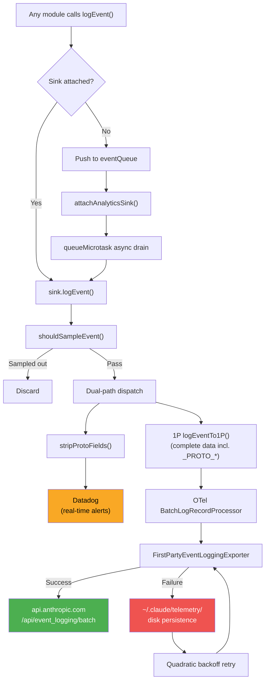
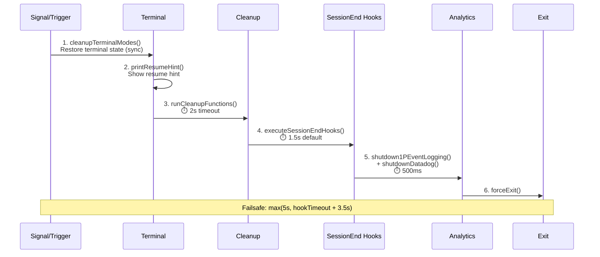

# Chapter 29: Observability Engineering — From logEvent to Production-Grade Telemetry

## Why This Matters

CLI tool observability faces a unique set of constraints: no persistent server-side, code runs on user devices, the network may drop at any time, and users are highly sensitive to privacy. Traditional web services can instrument on the server side and collect centralized logs, but Claude Code must complete the entire pipeline — from event collection, PII filtering, batch delivery to failure retry — on the client.

Claude Code built a 5-layer telemetry system for this:

| Layer | Responsibility | Key File |
|-------|---------------|----------|
| **Event Entry** | `logEvent()` queue-attach pattern | `services/analytics/index.ts` |
| **Routing & Dispatch** | Dual-path dispatch (Datadog + 1P) | `services/analytics/sink.ts` |
| **PII Safety** | Type-system-level protection + runtime filtering | `services/analytics/metadata.ts` |
| **Delivery Resilience** | OTel batch processing + disk-persistent retry | `services/analytics/firstPartyEventLoggingExporter.ts` |
| **Remote Control** | Feature Flag circuit breaker (Kill Switch) | `services/analytics/sinkKillswitch.ts` |

This chapter provides a complete analysis of this system, starting from a single `logEvent()` call and tracing how an event flows through sampling, PII filtering, dual-path dispatch, batch delivery, and failure retry, ultimately reaching a Datadog dashboard or Anthropic's internal data lake.

---

> **Interactive version**: [Click to view the telemetry pipeline animation](telemetry-viz.html) — watch how logEvent() flows through type checking, sampling, PII filtering, and finally reaches Datadog/1P/OTel.

## Source Code Analysis

### 29.1 Telemetry Pipeline Architecture: From logEvent() to the Data Lake

Claude Code's telemetry pipeline uses a **queue-attach pattern**: events can be produced at the very earliest stage of application startup, while the telemetry backend may not yet be initialized. The solution is to cache events in a queue first, then asynchronously drain when the backend is ready.

```typescript
// restored-src/src/services/analytics/index.ts:80-84
// Event queue for events logged before sink is attached
const eventQueue: QueuedEvent[] = []

// Sink - initialized during app startup
let sink: AnalyticsSink | null = null
```

`logEvent()` is the global entry point — the entire codebase logs events through this function. When the sink is not yet attached, events are pushed to the queue:

```typescript
// restored-src/src/services/analytics/index.ts:133-144
export function logEvent(
  eventName: string,
  metadata: LogEventMetadata,
): void {
  if (sink === null) {
    eventQueue.push({ eventName, metadata, async: false })
    return
  }
  sink.logEvent(eventName, metadata)
}
```

When `attachAnalyticsSink()` is called, the queue is asynchronously drained via `queueMicrotask()`, avoiding blocking the startup path:

```typescript
// restored-src/src/services/analytics/index.ts:101-122
if (eventQueue.length > 0) {
  const queuedEvents = [...eventQueue]
  eventQueue.length = 0
  // ... ant-only logging (omitted)
  queueMicrotask(() => {
    for (const event of queuedEvents) {
      if (event.async) {
        void sink!.logEventAsync(event.eventName, event.metadata)
      } else {
        sink!.logEvent(event.eventName, event.metadata)
      }
    }
  })
}
```

This design has an important property: `index.ts` **has no dependencies** (the comment explicitly states "This module has NO dependencies to avoid import cycles"). This means any module can safely import `logEvent` without triggering circular imports.

The actual Sink implementation is in `sink.ts`, responsible for dual-path dispatch:

```typescript
// restored-src/src/services/analytics/sink.ts:48-72
function logEventImpl(eventName: string, metadata: LogEventMetadata): void {
  const sampleResult = shouldSampleEvent(eventName)
  if (sampleResult === 0) {
    return
  }
  const metadataWithSampleRate =
    sampleResult !== null
      ? { ...metadata, sample_rate: sampleResult }
      : metadata
  if (shouldTrackDatadog()) {
    void trackDatadogEvent(eventName, stripProtoFields(metadataWithSampleRate))
  }
  logEventTo1P(eventName, metadataWithSampleRate)
}
```

Note two key details:

1. **Sampling executes before dispatch** — `shouldSampleEvent()` decides whether to drop the event based on GrowthBook remote configuration, with the sample rate attached to metadata for downstream calibration.
2. **Datadog receives `stripProtoFields()`-processed data** — all `_PROTO_*`-prefixed PII fields are stripped; while the 1P channel receives complete data.

The following Mermaid diagram shows the complete path from event creation to final storage:



The remote circuit breaker mechanism is implemented via `sinkKillswitch.ts`, using a deliberately obfuscated GrowthBook configuration name:

```typescript
// restored-src/src/services/analytics/sinkKillswitch.ts:4
const SINK_KILLSWITCH_CONFIG_NAME = 'tengu_frond_boric'
```

The configuration value is a `{ datadog?: boolean, firstParty?: boolean }` object, where setting `true` disables the corresponding channel. This design allows Anthropic to remotely disable telemetry without releasing a new version — for example, when an event type unexpectedly carries sensitive data, the bleeding can be stopped within minutes. For details on the Feature Flag mechanism, see Chapter 23.

### 29.2 PII Safety Architecture: Type-System-Level Protection

Claude Code's PII protection doesn't rely on code reviews and documentation conventions, but **enforces at compile time** through TypeScript's type system. The core is two `never` type markers:

```typescript
// restored-src/src/services/analytics/index.ts:19
export type AnalyticsMetadata_I_VERIFIED_THIS_IS_NOT_CODE_OR_FILEPATHS = never

// restored-src/src/services/analytics/index.ts:33
export type AnalyticsMetadata_I_VERIFIED_THIS_IS_PII_TAGGED = never
```

Why use `never` types? Because `never` cannot hold any value — it can only be assigned via `as` forced casting. This means every time a developer wants to log a string in a telemetry event, they must write `myString as AnalyticsMetadata_I_VERIFIED_THIS_IS_NOT_CODE_OR_FILEPATHS`. This verbose type name itself is a checklist: "I verified this is not code or file paths."

Looking back at the `logEvent()` signature shown in Section 29.1, its metadata parameter type is `{ [key: string]: boolean | number | undefined }` — note **no strings accepted**. The source code comment explicitly states: "intentionally no strings unless AnalyticsMetadata_I_VERIFIED_THIS_IS_NOT_CODE_OR_FILEPATHS, to avoid accidentally logging code/filepaths." To pass strings, you must use the marker type for forced casting.

For scenarios that genuinely need to log PII data (such as skill names, MCP server names), `_PROTO_` prefix fields are used:

```typescript
// restored-src/src/services/analytics/firstPartyEventLoggingExporter.ts:719-724
const {
  _PROTO_skill_name,
  _PROTO_plugin_name,
  _PROTO_marketplace_name,
  ...rest
} = formatted.additional
const additionalMetadata = stripProtoFields(rest)
```

`_PROTO_*` field routing logic:
- **Datadog**: `sink.ts` calls `stripProtoFields()` before dispatch to strip all `_PROTO_*` fields, so Datadog never sees PII
- **1P Exporter**: Destructures known `_PROTO_*` fields and promotes them to top-level proto fields (stored in BigQuery privileged columns), then executes `stripProtoFields()` again on remaining fields to prevent unrecognized new fields from leaking

The handling of MCP tool names demonstrates a graduated disclosure strategy:

```typescript
// restored-src/src/services/analytics/metadata.ts:70-77
export function sanitizeToolNameForAnalytics(
  toolName: string,
): AnalyticsMetadata_I_VERIFIED_THIS_IS_NOT_CODE_OR_FILEPATHS {
  if (toolName.startsWith('mcp__')) {
    return 'mcp_tool' as AnalyticsMetadata_I_VERIFIED_THIS_IS_NOT_CODE_OR_FILEPATHS
  }
  return toolName as AnalyticsMetadata_I_VERIFIED_THIS_IS_NOT_CODE_OR_FILEPATHS
}
```

MCP tool names have the format `mcp__<server>__<tool>`, where the server name may expose user configuration information (PII-medium). By default, all MCP tools are replaced with `'mcp_tool'`. But there are three exception cases that allow recording detailed names:

1. Cowork mode (`entrypoint=local-agent`) — no ZDR concept
2. `claudeai-proxy` type MCP servers — from the claude.ai official list
3. Servers whose URLs match the official MCP registry

File extension handling is equally cautious — extensions longer than 10 characters are replaced with `'other'`, because excessively long "extensions" may be hashed filenames (e.g., `key-hash-abcd-123-456`).

### 29.3 1P Event Delivery: OpenTelemetry + Disk-Persistent Retry

The 1P (First Party) channel is the core of Claude Code's telemetry — it delivers events to Anthropic's self-hosted `/api/event_logging/batch` endpoint, stored in BigQuery for offline analysis.

The architecture is based on the OpenTelemetry SDK:

```typescript
// restored-src/src/services/analytics/firstPartyEventLogger.ts:362-389
const eventLoggingExporter = new FirstPartyEventLoggingExporter({
  maxBatchSize: maxExportBatchSize,
  skipAuth: batchConfig.skipAuth,
  maxAttempts: batchConfig.maxAttempts,
  path: batchConfig.path,
  baseUrl: batchConfig.baseUrl,
  isKilled: () => isSinkKilled('firstParty'),
})
firstPartyEventLoggerProvider = new LoggerProvider({
  resource,
  processors: [
    new BatchLogRecordProcessor(eventLoggingExporter, {
      scheduledDelayMillis,
      maxExportBatchSize,
      maxQueueSize,
    }),
  ],
})
```

OTel's `BatchLogRecordProcessor` triggers export when any of these conditions are met:
- Time interval reached (default 10 seconds, configurable via `tengu_1p_event_batch_config` remote configuration)
- Batch size limit reached (default 200 events)
- Queue full (default 8192 events)

But the real engineering challenge is in the custom `FirstPartyEventLoggingExporter` (806 lines). This Exporter layers CLI-tool-required resilience on top of standard OTel export:

**Batch sharding + inter-batch delay**: Large event batches are split into multiple small batches (each at most `maxBatchSize`), with 100ms delays between batches:

```typescript
// restored-src/src/services/analytics/firstPartyEventLoggingExporter.ts:379-421
private async sendEventsInBatches(
  events: FirstPartyEventLoggingEvent[],
): Promise<FirstPartyEventLoggingEvent[]> {
  const batches: FirstPartyEventLoggingEvent[][] = []
  for (let i = 0; i < events.length; i += this.maxBatchSize) {
    batches.push(events.slice(i, i + this.maxBatchSize))
  }
  // ...
  for (let i = 0; i < batches.length; i++) {
    const batch = batches[i]!
    try {
      await this.sendBatchWithRetry({ events: batch })
    } catch (error) {
      // Short-circuit all subsequent batches on first batch failure
      for (let j = i; j < batches.length; j++) {
        failedBatchEvents.push(...batches[j]!)
      }
      break
    }
    if (i < batches.length - 1 && this.batchDelayMs > 0) {
      await sleep(this.batchDelayMs)
    }
  }
  return failedBatchEvents
}
```

Note the short-circuit logic: when the first batch fails, it assumes the endpoint is unavailable and immediately marks all remaining batches as failed, avoiding futile network requests.

**Quadratic backoff retry**: Failed events use quadratic backoff (matching the Statsig SDK strategy):

```typescript
// restored-src/src/services/analytics/firstPartyEventLoggingExporter.ts:451-455
// Quadratic backoff (matching Statsig SDK): base * attempts²
const delay = Math.min(
  this.baseBackoffDelayMs * this.attempts * this.attempts,
  this.maxBackoffDelayMs,
)
```

Default parameters: `baseBackoffDelayMs=500`, `maxBackoffDelayMs=30000`, `maxAttempts=8`. Eight export attempts produce at most 7 backoff delays: 500ms → 2s → 4.5s → 8s → 12.5s → 18s → 24.5s (events are discarded after the 8th attempt fails, with no further backoff).

**401 degraded retry**: On authentication failure, it automatically retries without auth rather than giving up:

```typescript
// restored-src/src/services/analytics/firstPartyEventLoggingExporter.ts:593-611
if (
  useAuth &&
  axios.isAxiosError(error) &&
  error.response?.status === 401
) {
  // 401 auth error, retrying without auth
  const response = await axios.post(this.endpoint, payload, {
    timeout: this.timeout,
    headers: baseHeaders,
  })
  this.logSuccess(payload.events.length, false, response.data)
  return
}
```

This design handles scenarios where the OAuth token has expired but cannot be silently refreshed — telemetry data can still reach the server through the unauthenticated channel, just without user identity association on the server side.

**Disk persistence**: Failed export events are appended to JSONL files:

```typescript
// restored-src/src/services/analytics/firstPartyEventLoggingExporter.ts:44-46
function getStorageDir(): string {
  return path.join(getClaudeConfigHomeDir(), 'telemetry')
}
```

File path format is `~/.claude/telemetry/1p_failed_events.<sessionId>.<batchUUID>.json`. Uses `appendFile` for append writes. Since each session uses a unique session ID + batch UUID for file naming, there's effectively no scenario of multiple processes concurrently writing to the same file.

**Auto-retransmit on startup**: The Exporter constructor calls `retryPreviousBatches()`, scanning failed files from other batch UUIDs under the same session ID and retransmitting them in the background:

```typescript
// restored-src/src/services/analytics/firstPartyEventLoggingExporter.ts:137-138
// Retry any failed events from previous runs of this session (in background)
void this.retryPreviousBatches()
```

**Runtime hot-reload**: When GrowthBook configuration refreshes, `reinitialize1PEventLoggingIfConfigChanged()` can rebuild the entire pipeline without losing events — through a sequence of null logger (new events paused) → `forceFlush()` old provider → initialize new provider → old provider background shutdown.

| Feature | 1P Exporter | Standard OTel HTTP Exporter |
|---------|-------------|---------------------------|
| Batch sharding | Split by maxBatchSize, 100ms inter-batch delay | None (single batch send) |
| Failure handling | Disk persistence + quadratic backoff + short-circuit | Limited retry then discard (in-memory, no persistence) |
| Authentication | OAuth → 401 degraded to unauthenticated | Fixed headers |
| Cross-session recovery | Startup scan and retransmit previous failures | None |
| Remote control | Killswitch + GrowthBook hot config | None |
| PII handling | `_PROTO_*` promotion + `stripProtoFields()` | None |

### 29.4 Datadog Integration: Curated Event Allowlist

The Datadog channel is used for **real-time alerting**, complementing the 1P channel's offline analysis. Its core design feature is a curated allowlist:

```typescript
// restored-src/src/services/analytics/datadog.ts:19-64 (excerpt)
const DATADOG_ALLOWED_EVENTS = new Set([
  'chrome_bridge_connection_succeeded',
  'chrome_bridge_connection_failed',
  // ... chrome_bridge_* events
  'tengu_api_error',
  'tengu_api_success',
  'tengu_cancel',
  'tengu_exit',
  'tengu_init',
  'tengu_started',
  'tengu_tool_use_error',
  'tengu_tool_use_success',
  'tengu_uncaught_exception',
  'tengu_unhandled_rejection',
  // ... approximately 38 events total
])
```

Only events on the list are sent to Datadog — this limits the data exposure surface to external services. Combined with `stripProtoFields()` PII stripping, Datadog only sees safe, limited operational data.

Datadog uses a public client token (`pubbbf48e6d78dae54bceaa4acf463299bf`), batch flush interval of 15 seconds, batch limit of 100 entries, and network timeout of 5 seconds.

The tag system (TAG_FIELDS) covers key dimensions: `arch`, `platform`, `model`, `userType`, `toolName`, `subscriptionType`, etc. Note that MCP tools are further compressed to `'mcp'` at the Datadog level (rather than `'mcp_tool'`), to reduce cardinality.

The user bucketing design is noteworthy:

```typescript
// restored-src/src/services/analytics/datadog.ts:295-298
const getUserBucket = memoize((): number => {
  const userId = getOrCreateUserID()
  const hash = createHash('sha256').update(userId).digest('hex')
  return parseInt(hash.slice(0, 8), 16) % NUM_USER_BUCKETS
})
```

User IDs are hashed and assigned to one of 30 buckets. This allows approximating unique user counts by counting unique buckets, while avoiding the cardinality explosion and privacy issues of directly recording user IDs.

### 29.5 API Call Observability: From Request to Retry

API calls are Claude Code's most critical operation path — each Agent Loop iteration (see Chapter 3 for details) triggers at least one API call, producing a complete telemetry event chain. `services/api/logging.ts` implements a **three-event model**:

1. **`tengu_api_query`**: Recorded when the request is sent, including model name, token budget, cache configuration
2. **`tengu_api_success`**: Recorded on request success, including performance metrics
3. **`tengu_api_error`**: Recorded on request failure, including error type and status code

Performance metrics are particularly noteworthy:

- **TTFT (Time to First Token)**: Time from request sent to receiving the first token, measuring model startup latency
- **TTLT (Time to Last Token)**: Time from request sent to receiving the last token, measuring overall response time
- **Total duration**: Including network round-trip
- **Independent timestamps for each retry**

Retry telemetry is implemented via `services/api/withRetry.ts`. Each retry is recorded as an independent event (`tengu_api_retry`), carrying retry reason, backoff time, and HTTP status code.

429/529 status codes have differentiated handling:
- **429 (Rate Limited)**: Standard backoff, triggers 30-minute cooldown in Fast Mode (see Chapter 21 for details)
- **529 (Overloaded)**: Server-side overload, more aggressive backoff strategy
- **Background requests**: Quick abandon, don't block user foreground operations

Gateway fingerprint detection is a defensive design — when users access the API through proxy gateways (such as LiteLLM, Helicone, Portkey, Cloudflare, Kong), Claude Code detects and records the gateway type. This helps Anthropic distinguish between its own API issues and problems introduced by third-party proxies.

### 29.6 Tool Execution Telemetry

Tool execution records four event types via `services/tools/toolExecution.ts`:

- **`tengu_tool_use_success`**: Tool executed successfully
- **`tengu_tool_use_error`**: Tool execution error
- **`tengu_tool_use_cancelled`**: User cancelled
- **`tengu_tool_use_rejected_in_prompt`**: Permission denied

Each event carries execution duration, result size (bytes), and file extension (security-filtered). For MCP tools, the graduated disclosure strategy described in Section 29.2 is followed.

The complete tool execution lifecycle (validateInput → checkPermissions → call → postToolUse hooks) was analyzed in detail in Chapter 4 and is not repeated here.

### 29.7 Cache Efficiency Tracking

The cache break detection system (`promptCacheBreakDetection.ts`) is the intersection of telemetry and cache optimization. It snapshots `PreviousState` before each API call (containing 15+ fields including systemHash, toolsHash, cacheControlHash) and compares actual cache hit results after receiving the response.

When a cache break is detected (`cache_read_input_tokens` drops by more than 2000 tokens), a `tengu_prompt_cache_break` event is generated carrying 20+ fields of break context. The 2000-token noise filtering threshold prevents false positives from minor fluctuations.

This system's detailed design was analyzed in depth in Chapter 14; here we only note its position in the telemetry system: it is a paradigm practice of Claude Code's "observe before you fix" philosophy (see Chapter 25 for details).

### 29.8 Three Debug/Diagnostic Channels

Claude Code provides three independent debug/diagnostic channels, each with different use cases and PII policies:

| Channel | File | Trigger | PII Policy | Output Location | Use Case |
|---------|------|---------|-----------|----------------|----------|
| **Debug Log** | `utils/debug.ts` | `--debug` or `/debug` | May contain PII | `~/.claude/debug/<session>.log` | Developer debugging, on by default for ant |
| **Diagnostic Log** | `utils/diagLogs.ts` | `CLAUDE_CODE_DIAGNOSTICS_FILE` env var | **PII strictly prohibited** | Container-specified path | Container monitoring, via session-ingress |
| **Error Log** | `utils/errorLogSink.ts` | Automatic (ant-only file output) | Error information (controlled) | `~/.claude/errors/<date>.jsonl` | Error retrospective analysis |

**Debug Log** (`utils/debug.ts`) supports multiple activation methods:

```typescript
// restored-src/src/utils/debug.ts:44-57
export const isDebugMode = memoize((): boolean => {
  return (
    runtimeDebugEnabled ||
    isEnvTruthy(process.env.DEBUG) ||
    isEnvTruthy(process.env.DEBUG_SDK) ||
    process.argv.includes('--debug') ||
    process.argv.includes('-d') ||
    isDebugToStdErr() ||
    process.argv.some(arg => arg.startsWith('--debug=')) ||
    getDebugFilePath() !== null
  )
})
```

Ant users (Anthropic internal) write debug logs by default; external users need to explicitly enable them. The `/debug` command supports runtime activation (`enableDebugLogging()`) without restarting the session. Log files automatically create a `latest` symlink pointing to the most recent log file for quick access.

The log level system supports 5-level filtering (verbose → debug → info → warn → error), controlled via the `CLAUDE_CODE_DEBUG_LOG_LEVEL` environment variable. The `--debug=pattern` syntax supports filtering logs for specific modules.

**Diagnostic Log** (`utils/diagLogs.ts`) is a PII-safe container diagnostic channel — designed to be read by container environment managers and sent to the session-ingress service:

```typescript
// restored-src/src/utils/diagLogs.ts:27-31
export function logForDiagnosticsNoPII(
  level: DiagnosticLogLevel,
  event: string,
  data?: Record<string, unknown>,
): void {
```

The `NoPII` suffix in the function name is a deliberate naming convention — it both reminds the caller and facilitates code review. The output format is JSONL (one JSON object per line), containing timestamp, level, event name, and data. Synchronous writes (`appendFileSync`) are used because it's frequently called on the shutdown path.

The `withDiagnosticsTiming()` wrapper function automatically generates `_started` and `_completed` event pairs for async operations, with attached `duration_ms`.

### 29.9 Distributed Tracing: OpenTelemetry + Perfetto

Claude Code's tracing system is split into two layers: OTel-based structured tracing, and Perfetto-based visual tracing.

**OTel tracing** (`utils/telemetry/sessionTracing.ts`) uses a three-level span hierarchy:

1. **Interaction Span**: Wraps a user request → Claude response cycle
2. **LLM Request Span**: A single API call
3. **Tool Span**: A single tool execution (with child spans: blocked_on_user, tool.execution, hook)

Span context propagates via `AsyncLocalStorage`, ensuring correct parent-child association across async call chains. Agent hierarchy (main agent → sub-agent) is expressed through parent-child span relationships.

An important engineering detail is **orphan span cleanup**:

```typescript
// restored-src/src/utils/telemetry/sessionTracing.ts:79
const SPAN_TTL_MS = 30 * 60 * 1000 // 30 minutes
```

Active spans are scanned every 60 seconds, and spans that haven't ended within 30 minutes are force-closed and removed from the registry. This handles span leaks caused by abnormal interruptions (such as stream cancellation, uncaught exceptions during tool execution). `activeSpans` uses `WeakRef` to allow GC to reclaim unreachable span contexts.

Feature gate control (`ENHANCED_TELEMETRY_BETA`) keeps tracing off by default, enabling it via environment variables or GrowthBook gradual rollout per user group.

**Perfetto tracing** (`utils/telemetry/perfettoTracing.ts`) is ant-only visual tracing — generating Chrome Trace Event format JSON files analyzable in ui.perfetto.dev:

```typescript
// restored-src/src/utils/telemetry/perfettoTracing.ts:16
// Enable via CLAUDE_CODE_PERFETTO_TRACE=1 or CLAUDE_CODE_PERFETTO_TRACE=<path>
```

Trace files contain:
- Agent hierarchy relationships (using process IDs to distinguish different agents)
- API request details (TTFT, TTLT, cache hit rate, speculative flag)
- Tool execution details (name, duration, token usage)
- User input wait time

The event array has an upper bound guard (`MAX_EVENTS = 100_000`), and when reached, the oldest half is evicted — this prevents long-running sessions (such as cron-driven sessions) from growing memory indefinitely. Metadata events (process/thread names) are exempt from eviction because the Perfetto UI needs them for track labels.

### 29.10 Crash Recovery and Graceful Shutdown

`utils/gracefulShutdown.ts` (529 lines) implements Claude Code's graceful shutdown sequence — the key to "last mile" telemetry data delivery.

Shutdown trigger sources include: SIGINT (Ctrl+C), SIGTERM, SIGHUP, and macOS-specific **orphan process detection**:

```typescript
// restored-src/src/utils/gracefulShutdown.ts:281-296
if (process.stdin.isTTY) {
  orphanCheckInterval = setInterval(() => {
    if (getIsScrollDraining()) return
    if (!process.stdout.writable || !process.stdin.readable) {
      clearInterval(orphanCheckInterval)
      void gracefulShutdown(129)
    }
  }, 30_000)
  orphanCheckInterval.unref()
}
```

macOS doesn't always send SIGHUP when the terminal is closed, but instead revokes TTY file descriptors. Every 30 seconds, stdout/stdin are checked for continued availability.

The shutdown sequence uses a **cascading timeout** design:



Key design decisions:

1. **Terminal mode restoration executes first** — before any async operations, synchronously restore terminal state. If SIGKILL occurs during cleanup, at least the terminal won't be in a corrupted state.
2. **Cleanup functions have independent timeouts** (2 seconds) — implemented via `Promise.race`, preventing MCP connection hangs.
3. **SessionEnd hooks have a budget** (default 1.5 seconds) — user-configurable via `CLAUDE_CODE_SESSIONEND_HOOKS_TIMEOUT_MS`.
4. **Analytics flush capped at 500ms** — previously unlimited, causing the 1P Exporter to wait for all pending axios POSTs (each with 10-second timeout), potentially consuming the entire failsafe budget.
5. **Failsafe timer** dynamically calculated: `max(5000, sessionEndTimeoutMs + 3500)`, ensuring the hook budget gets sufficient time.

`forceExit()` handles extreme cases — when `process.exit()` throws due to a dead terminal (EIO error), it falls back to `SIGKILL`:

```typescript
// restored-src/src/utils/gracefulShutdown.ts:213-222
try {
  process.exit(exitCode)
} catch (e) {
  if ((process.env.NODE_ENV as string) === 'test') {
    throw e
  }
  process.kill(process.pid, 'SIGKILL')
}
```

Uncaught exceptions and unhandled Promise rejections are recorded through dual channels — both written to PII-free diagnostic logs and sent to analytics:

```typescript
// restored-src/src/utils/gracefulShutdown.ts:301-310
process.on('uncaughtException', error => {
  logForDiagnosticsNoPII('error', 'uncaught_exception', {
    error_name: error.name,
    error_message: error.message.slice(0, 2000),
  })
  logEvent('tengu_uncaught_exception', {
    error_name:
      error.name as AnalyticsMetadata_I_VERIFIED_THIS_IS_NOT_CODE_OR_FILEPATHS,
  })
})
```

Note that `error.name` (e.g., "TypeError") is judged as non-sensitive information and can be safely recorded. Error messages are truncated to 2000 characters to prevent long stack traces from consuming excessive storage.

### 29.11 Cost Tracking and Usage Visualization

`cost-tracker.ts` manages Claude Code's runtime cost accounting — tracking USD cost, token usage (input/output/cache creation/cache read), code line changes, and persisting across sessions.

The cost state contains a complete resource consumption snapshot:

```typescript
// restored-src/src/cost-tracker.ts:71-80
type StoredCostState = {
  totalCostUSD: number
  totalAPIDuration: number
  totalAPIDurationWithoutRetries: number
  totalToolDuration: number
  totalLinesAdded: number
  totalLinesRemoved: number
  lastDuration: number | undefined
  modelUsage: { [modelName: string]: ModelUsage } | undefined
}
```

Cost state is stored in the project configuration (`.claude.state`), keyed by `lastSessionId`. Only when the session ID matches is the previous cost data restored, preventing cross-contamination between different sessions. After each successful API call, `addToTotalSessionCost()` accumulates token usage and records it to the telemetry pipeline via `logEvent`, making cost data available for both local display and remote analysis.

The `/cost` command's output differentiates between subscribers and non-subscribers — subscribers see more detailed usage breakdowns, while non-subscribers focus on helping understand consumption patterns.

---

## Pattern Distillation

### Pattern 1: Type-System-Level PII Protection

**Problem**: Telemetry events may accidentally contain sensitive data (file paths, code snippets, user configuration). Code reviews and documentation conventions cannot reliably prevent this.

**Solution**: Use `never` type markers to force developers to explicitly declare data safety.

```typescript
// Pattern template
type PII_VERIFIED = never
function logEvent(data: { [k: string]: number | boolean | undefined }): void
// To pass a string, you must:
logEvent({ name: value as PII_VERIFIED })
```

**Precondition**: Using TypeScript or a similar strong type system. The type marker's name must be sufficiently descriptive to make the `as` casting itself a review.

### Pattern 2: Dual-Path Telemetry Delivery

**Problem**: A single telemetry channel cannot simultaneously satisfy real-time alerting (low latency, low cost) and offline analysis (complete data, high reliability).

**Solution**: Dispatch telemetry to two channels — the real-time channel uses an allowlist and PII stripping, the offline channel retains complete data.

**Precondition**: The two channels have different security levels and SLAs. The allowlist requires ongoing maintenance.

### Pattern 3: Disk-Persistent Retry

**Problem**: CLI tools run on user devices, networks are unreliable, and processes may terminate at any time. In-memory retry queues are lost with process exit.

**Solution**: Failed events are appended to disk files (JSONL format, one file per session), and on startup, previous session's failed events are scanned and retransmitted.

**Precondition**: The filesystem is available with write permissions. Events don't contain data requiring encrypted storage (PII already filtered before writing).

### Pattern 4: Curated Event Allowlist

**Problem**: Sending events to external services (Datadog) requires controlling the data exposure surface. New event types may accidentally carry sensitive information.

**Solution**: Use a `Set` to define an explicit allowlist. Events not on the list are silently discarded. New events must be explicitly added to the list, creating a review checkpoint.

**Precondition**: The allowlist needs to be updated as features iterate, otherwise new events will never reach external services.

### Pattern 5: Cascading Timeout Graceful Shutdown

**Problem**: Multiple cleanup tasks need to be completed on process exit (terminal restoration, session saving, hook execution, telemetry flushing), but any step may hang.

**Solution**: Independent timeout per layer + overall failsafe. Priority: terminal restoration (synchronous, first) → data persistence → hooks → telemetry. Failsafe timeout = max(hard floor, hook budget + margin).

**Precondition**: The priority between cleanup tasks is clearly defined. The most critical operation (terminal restoration) must be synchronous.

---

## CC's OpenTelemetry Implementation: From logEvent to Standardized Telemetry

The preceding analysis covered CC's 860+ `tengu_*` events and `logEvent()` call patterns. But at a deeper layer, CC built a **complete OpenTelemetry telemetry infrastructure**, unifying event logging, distributed tracing, and metric measurement into the OTel standard framework.

### Three OTel Scopes

CC registers three independent OTel scopes, each with distinct responsibilities:

| Scope | OTel Component | Purpose |
|-------|---------------|---------|
| `com.anthropic.claude_code.events` | Logger | Event logging (860+ tengu events) |
| `com.anthropic.claude_code.tracing` | Tracer | Distributed tracing (API calls, tool execution) |
| `com.anthropic.claude_code` | Meter | Metric measurement (OTLP/Prometheus/BigQuery) |

```typescript
// restored-src/src/utils/telemetry/instrumentation.ts:602-606
const eventLogger = logs.getLogger(
  'com.anthropic.claude_code.events',
  MACRO.VERSION,
)
```

### Span Hierarchy Structure

CC's tracing system defines 6 span types forming a clear parent-child hierarchy:

```
claude_code.interaction (Root Span: one user interaction)
  ├─ claude_code.llm_request (API call)
  ├─ claude_code.tool (Tool invocation)
  │   ├─ claude_code.tool.blocked_on_user (Waiting for permission approval)
  │   └─ claude_code.tool.execution (Actual execution)
  └─ claude_code.hook (Hook execution, beta tracing)
```

Each span carries standardized attributes (`sessionTracing.ts:162-166`):

| Span Type | Key Attributes |
|-----------|---------------|
| `interaction` | `session_id`, `platform`, `arch` |
| `llm_request` | `model`, `speed`(fast/normal), `query_source`(agent name) |
| `llm_request` response | `duration_ms`, `input_tokens`, `output_tokens`, `cache_read_tokens`, `cache_creation_tokens`, `ttft_ms`, `success` |
| `tool` | `tool_name`, `tool_input` (beta tracing) |

`ttft_ms` (Time to First Token) is one of the most critical latency metrics for LLM applications — CC natively records it in span attributes.

### Context Propagation: AsyncLocalStorage

CC uses Node.js `AsyncLocalStorage` for span context propagation (`sessionTracing.ts:65-76`):

```typescript
const interactionContext = new AsyncLocalStorage<SpanContext | undefined>()
const toolContext = new AsyncLocalStorage<SpanContext | undefined>()
const activeSpans = new Map<string, WeakRef<SpanContext>>()
```

Two independent AsyncLocalStorage instances track interaction-level and tool-level context respectively. `WeakRef` + 30-minute TTL periodic cleanup (scanning every 60 seconds) prevents orphan spans from leaking memory.

### Event Export Pipeline

`logEvent()` is not a simple `console.log`. It goes through the complete OTel pipeline:

```
logEvent("tengu_api_query", metadata)
  ↓
Sampling check (tengu_event_sampling_config)
  ↓ Pass
Logger.emit({ body: eventName, attributes: {...} })
  ↓
BatchLogRecordProcessor (5-second interval / 200-entry batch)
  ↓
FirstPartyEventLoggingExporter (custom LogRecordExporter)
  ↓
POST /api/event_logging/batch → api.anthropic.com
  ↓ On failure
Append to ~/.claude/config/telemetry/1p_failed_events.{session}.{batch}.json
  ↓ Retry
Quadratic backoff: delay = min(500ms × attempts², 30000ms), max 8 attempts
```

**Remote circuit breaker**: GrowthBook configuration `tengu_frond_boric` controls the entire sink's on/off switch — Anthropic can urgently disable telemetry export without a release.

### Datadog Dual-Write

In addition to 1P export, CC also dual-writes **some** events to Datadog (`datadog.ts:19-64`):

- Allowlist mechanism: Only exports core events with `tengu_api_*`, `tengu_compact_*`, `tengu_tool_use_*` and similar prefixes (approximately 60 prefix patterns)
- Batching: 100 entries/batch, 15-second interval
- Endpoint: `https://http-intake.logs.us5.datadoghq.com/api/v2/logs`

This dual-write strategy is a classic "production observability tiering": 1P collects full-volume events for long-term analysis, Datadog collects core events for real-time alerting and dashboards.

### Beta Tracing: Richer Tracing Data

CC also has a separate "beta tracing" system (`betaSessionTracing.ts`), controlled by the environment variable `ENABLE_BETA_TRACING_DETAILED=1`:

| Standard Tracing | Beta Tracing Additional Attributes |
|-----------------|----------------------------------|
| model, duration_ms | + `system_prompt_hash`, `system_prompt_preview` |
| input_tokens, output_tokens | + `response.model_output`, `response.thinking_output` |
| tool_name | + `tool_input` (complete input content) |
| — | + `new_context` (new message delta per turn) |

Content truncation threshold is 60KB (Honeycomb limit is 64KB). SHA-256 hashing is used for deduplication — identical system prompts are only recorded once.

### Metric Exporter Ecosystem

CC supports 5 metric exporters (`instrumentation.ts:130-215`), covering mainstream observability platforms:

| Exporter | Protocol | Export Interval | Purpose |
|----------|----------|----------------|---------|
| OTLP (gRPC) | `@opentelemetry/exporter-metrics-otlp-grpc` | 60s | Standard OTel backends |
| OTLP (HTTP) | `@opentelemetry/exporter-metrics-otlp-http` | 60s | HTTP-compatible backends |
| Prometheus | `@opentelemetry/exporter-prometheus` | Pull | Grafana ecosystem |
| BigQuery | Custom `BigQueryMetricsExporter` | 5min | Long-term analysis |
| Console | `ConsoleMetricExporter` | 60s | Debugging |

### Prompt Replay: Supportability Debugging Internal Tool

Claude Code has an internal-user-facing (`USER_TYPE === 'ant'`) debugging tool — `dumpPrompts.ts`, which transparently serializes each API request to a JSONL file on every API call, supporting post-hoc replay of the complete prompt interaction history.

File write path is `~/.claude/dump-prompts/{sessionId}.jsonl`, with one JSON object per line in four types:

| Type | Trigger | Content |
|------|---------|---------|
| `init` | First API call | System prompt, tool schema, model metadata |
| `system_update` | When system prompt or tools change | Same as init, but marked as incremental update |
| `message` | Each new user message | User message only (assistant messages captured in response) |
| `response` | After API success | Complete streaming chunks or JSON response |

```typescript
// restored-src/src/services/api/dumpPrompts.ts:146-167
export function createDumpPromptsFetch(
  agentIdOrSessionId: string,
): ClientOptions['fetch'] {
  const filePath = getDumpPromptsPath(agentIdOrSessionId)
  return async (input, init?) => {
    // ...
    // Defer so it doesn't block the actual API call —
    // this is debug tooling for /issue, not on the critical path.
    setImmediate(dumpRequest, init.body as string, timestamp, state, filePath)
    // ...
  }
}
```

The most noteworthy design in this code is **`setImmediate` deferred serialization** (line 167). System prompts + tool schemas can easily be several MB; synchronous serialization would block the actual API call. `setImmediate` pushes serialization to the next event loop tick, ensuring the debugging tool doesn't impact user experience.

Change detection uses **two-level fingerprinting**: first a lightweight `initFingerprint` (`model|toolNames|systemLength`, lines 74-88) for quick "is the structure the same?" checks, then only does the expensive `JSON.stringify + SHA-256 hash` when the structure has changed. This avoids paying 300ms serialization cost for unchanged system prompts in every round of multi-turn conversation.

Additionally, `dumpPrompts.ts` maintains an in-memory cache of the 5 most recent API requests (`MAX_CACHED_REQUESTS = 5`, line 14), for the `/issue` command to quickly obtain recent request context when users report bugs — no JSONL file parsing needed.

Implications for Agent builders: **Debugging tools should be zero-cost sidecars**. `dumpPrompts` achieves "always-on but performance-neutral" debugging capability through three mechanisms: `setImmediate` deferral, fingerprint deduplication, and in-memory caching. If your Agent needs similar prompt replay functionality, this pattern can be directly reused.

### Implications for Agent Builders

1. **Use OTel standards from day one**. CC didn't build a custom telemetry protocol — it uses standard `Logger`, `Tracer`, `Meter`, enabling integration with any OTel-compatible backend. Your Agent should do the same
2. **Span hierarchy should reflect Agent Loop structure**. The `interaction → llm_request / tool` hierarchy directly maps to one iteration of the Agent Loop. When designing spans, first draw your Agent Loop structure diagram
3. **Sampling is essential**. 860+ events exported at full volume would create enormous costs. CC controls each event's sample rate via GrowthBook remote configuration — this is far more flexible than hardcoding `if (Math.random() < 0.01)` in code
4. **Dual-write to different backends for different purposes**. 1P full-volume + Datadog core = long-term analysis + real-time alerting. Don't try to satisfy all needs with one backend
5. **AsyncLocalStorage is the tracing weapon for Node.js Agents**. It lets you avoid manually passing context objects — span parent-child relationships propagate automatically through execution context

---

## What You Can Do

### Debug Logging

- **Enable at startup**: `claude --debug` or `claude -d`
- **Enable at runtime**: Type `/debug` in the conversation
- **Filter specific modules**: `claude --debug=api` to see only API-related logs
- **Output to stderr**: `claude --debug-to-stderr` or `claude -d2e` (convenient for piping)
- **Specify output file**: `claude --debug-file=/path/to/log`

Logs are located in the `~/.claude/debug/` directory, with a `latest` symlink pointing to the most recent file.

### Performance Analysis

- **Perfetto tracing** (ant-only): `CLAUDE_CODE_PERFETTO_TRACE=1 claude`
- Trace files located at `~/.claude/traces/trace-<session-id>.json`
- Open in [ui.perfetto.dev](https://ui.perfetto.dev) to view the visual timeline

### Cost Viewing

- Type `/cost` in the conversation to see current session token usage and costs
- Cost data persists across sessions — cumulative values from the previous session are automatically loaded on resume

### Privacy Controls

- Claude Code's telemetry follows standard opt-out mechanisms
- Third-party API provider (Bedrock, Vertex) calls do not produce telemetry
- Observability data does not contain user code content or file paths (guaranteed by the type system)
