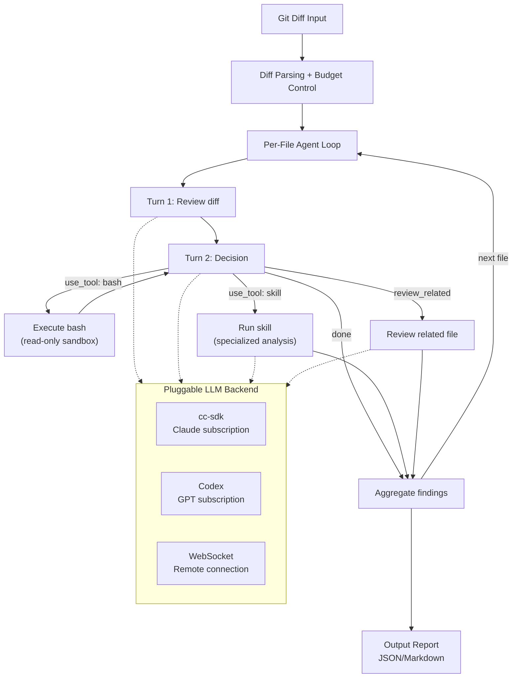
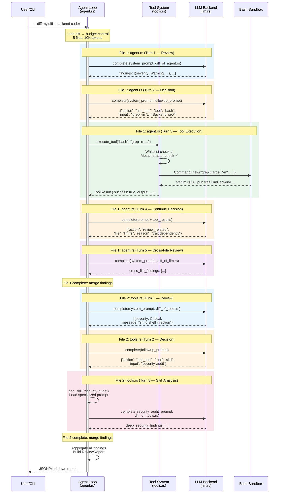
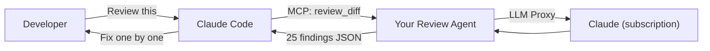
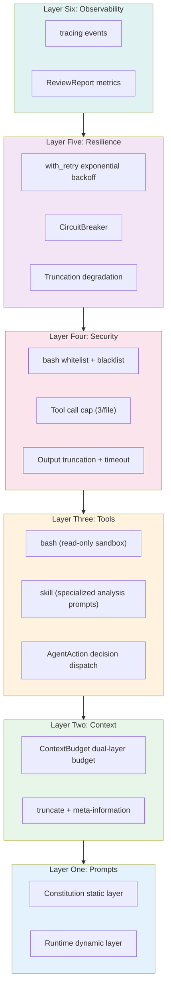

# Chapter 30: Build Your Own AI Agent — From Claude Code Patterns to Practice

## Why This Chapter Exists

### Why Not "Build Your Own Claude Code"

Readers might expect: since the previous 29 chapters dissected every Claude Code subsystem, this chapter should teach you how to reassemble one. But that's precisely what we **won't** do.

Claude Code is a **product** — 40+ tools, specific UI interactions, specific session formats, specific billing integrations. Replicating these implementation details is pointless: your Agent doesn't need to be a coding assistant — it might be a security scanner, data pipeline monitor, code review tool, or customer service bot. If we taught "how to implement Claude Code's FileEditTool," it would be completely non-transferable in a different context.

What the first 29 chapters of this book distilled are not implementation details, but **patterns** — prompt layering, context budgeting, tool sandboxing, graduated permissions, circuit-break retry, structured observability. These patterns are not tied to any specific product form and can be transferred to any Agent scenario.

So what this chapter does is: use a **completely different Agent** (code review, not coding assistant), a **completely different language** (Rust, not TypeScript), a **completely different execution model** (controlling the Agent Loop yourself, not delegating to Claude Code) — to demonstrate how the same 22 patterns combine in application. If patterns can survive this kind of cross-scenario, cross-language, cross-architecture transfer, they're not Claude Code-specific knowledge but truly reusable Agent engineering principles.

### Combining Patterns Is Harder Than Understanding Them Individually

Chapters 25-27 distilled 22 named patterns and principles. But the value of patterns lies not in enumeration — but in combination. Understanding "**Budget Everything**" (see Chapter 26) alone isn't hard, but when it needs to work alongside "**Inform, Don't Hide**" (see Chapter 26) without breaking "**Cache-Aware Design**" (see Chapter 25), engineering complexity rises steeply.

This chapter uses a **truly runnable project** (~800 lines of Rust) to demonstrate how to turn these patterns from analytical results into your own code.

Our project is a **Rust code review Agent** — input a Git diff, output a structured review report. We chose this scenario because it naturally covers the core dimensions of Agent construction: needs to read files (context management), search code (tool orchestration), analyze issues (prompt control), control permissions (security constraints), handle failures (resilience), and track quality (observability). And every developer has done code review, so the scenario needs no further explanation.

## 30.1 Project Definition: Code Review Agent

### cc-sdk: Claude Code's Rust SDK

Before introducing the project, let's meet our core dependency — [`cc-sdk`](https://crates.io/crates/cc-sdk) ([GitHub](https://github.com/zhanghandong/claude-code-api-rs)). This is a community-maintained Rust SDK that interacts with the Claude Code CLI via subprocess. It offers three usage modes:

| Mode | API | Agent Loop | Tools | Auth Method | Suitable For |
|------|-----|-----------|-------|-------------|-------------|
| **Full Agent** | `cc_sdk::query()` | CC internal | CC built-in tools | API key or CC subscription | Needs Agent to autonomously read/write files, execute commands |
| **Interactive Client** | `ClaudeSDKClient` | CC internal | CC built-in tools | API key or CC subscription | Multi-turn conversation, session management |
| **LLM Proxy** | `cc_sdk::llm::query()` | **Your code** | **None (all disabled)** | CC subscription (no API key needed) | Input is known, only need text analysis |

LLM Proxy mode (new in v0.8.1) is the key for this chapter — it treats the Claude Code CLI as a pure LLM proxy, with `--tools ""` disabling all tools, `PermissionMode::DontAsk` rejecting any tool requests, and `max_turns: 1` limiting to a single turn. More importantly, it uses Claude Code subscription authentication, requiring no separate `ANTHROPIC_API_KEY`.

### Project Definition

The project's inputs, outputs, and constraints are as follows:

- **Input**: A unified diff file (from `git diff` or a PR)
- **Output**: A structured review report (JSON or Markdown), where each finding includes file, line number, severity level, category, and fix suggestions
- **Constraints**: Read-only (doesn't modify reviewed code), has a token budget, trackable

The key architectural decision is: **the Agent Loop is in our own code**, with the LLM backend being pluggable. Through the `LlmBackend` trait, the same Agent can be driven by Claude (cc-sdk) or GPT (Codex subscription), without modifying any review logic.

Complete code is in this project's `examples/code-review-agent/` directory.



Each file review goes through at most 3 LLM calls (review → decide → followup), plus at most 3 tool calls. The LLM never directly executes tools — it outputs JSON requests (`AgentAction`), and our Rust code decides whether and how to execute them.

> **Why control the Agent Loop yourself?** Delegating to Claude Code's built-in Agent (`cc_sdk::query`) is simpler, but you lose fine-grained control: you can't implement per-file circuit breaking, budget allocation, tool whitelisting, and cross-backend switching. Controlling the loop yourself means every decision point is explicit — this is the core of harness engineering.

The project's code architecture directly maps to the six layers we'll discuss:

| Code Module | Corresponding Layer | Core Patterns Applied |
|------------|-------------------|---------------------|
| `prompts.rs` | L1 Prompt Architecture | Prompts as control plane, out-of-band control channel, tool-level prompts |
| `context.rs` | L2 Context Management | Budget everything, context hygiene, inform don't hide |
| `agent.rs` + `tools.rs` | L3 Tools & Search | Read before edit, structured search |
| `llm.rs` + `tools.rs` | L4 Security & Permissions | Fail closed, graduated autonomy |
| `resilience.rs` | L5 Resilience | Finite retry budget, circuit-break runaway loops, right-sized helper paths |
| `agent.rs` (tracing) | L6 Observability | Observe before you fix, structured verification |

Next we dissect layer by layer, each layer first examining the pattern prototype from Claude Code source code, then the Rust implementation.

## 30.2 Layer One: Prompt Architecture

**Applied patterns**: **Prompts as Control Plane** (see Chapter 25), **Out-of-Band Control Channel** (see Chapter 25), **Tool-Level Prompts** (see Chapter 27), **Scope-Matched Response** (see Chapter 27)

### Patterns in CC Source Code

Claude Code's prompt architecture has a key design: **separating stable parts from volatile parts**. The stable parts are cached (don't break prompt cache), the volatile parts are explicitly marked as "dangerous":

```typescript
// restored-src/src/constants/systemPromptSections.ts:20-24
export function systemPromptSection(
  name: string,
  compute: ComputeFn,
): SystemPromptSection {
  return { name, compute, cacheBreak: false }
}
```

```typescript
// restored-src/src/constants/systemPromptSections.ts:32-38
export function DANGEROUS_uncachedSystemPromptSection(
  name: string,
  compute: ComputeFn,
  _reason: string,
): SystemPromptSection {
  return { name, compute, cacheBreak: true }
}
```

The `DANGEROUS_` prefix is not decoration — it's an engineering constraint. Any prompt section that needs to be recomputed every turn must be created through this function, forcing the developer to fill in the `_reason` parameter explaining why cache breaking is needed. This is the embodiment of the **Out-of-Band Control Channel** pattern: constraining behavior through function signatures rather than comments.

### Rust Implementation

Our code review Agent adopts the same layered approach, but with a simpler implementation — a "Constitution" layer and a "Runtime" layer:

```rust
// examples/code-review-agent/src/prompts.rs:38-42
pub fn build_system_prompt(pr_info: &PrInfo) -> String {
    let constitution = build_constitution();
    let runtime = build_runtime_section(pr_info);
    format!("{constitution}\n\n---\n\n{runtime}")
}
```

The Constitution layer is static — review principles, severity level definitions, output format specifications. This content is identical across all review sessions:

```rust
// examples/code-review-agent/src/prompts.rs:45-84
fn build_constitution() -> String {
    r#"# Code Review Agent — Constitution

You are a code review agent. Your job is to review diffs and produce
a structured list of findings.

## Review Principles
1. **Correctness first**: Flag logic errors, off-by-one bugs...
2. **Security**: Identify injection vulnerabilities...
// ...

## Output Format
You MUST output a JSON array of finding objects..."#
        .to_string()
}
```

The Runtime layer is dynamic — current PR title, list of changed files, language-specific rules inferred from file extensions:

```rust
// examples/code-review-agent/src/prompts.rs:113-154
fn infer_language_rules(files: &[String]) -> String {
    let mut rules = Vec::new();
    let mut seen_rust = false;
    // ...
    for file in files {
        if !seen_rust && file.ends_with(".rs") {
            seen_rust = true;
            rules.push("## Rust-Specific Rules\n- Check for `.unwrap()`...");
        }
        // TypeScript, Python rules similar...
    }
    rules.join("\n\n")
}
```

The **Scope-Matched Response** pattern is reflected in the output format design: we require the model to output a JSON array rather than free text, with each finding having a fixed field structure. This isn't for aesthetics — it's so downstream `parse_findings_from_response` can reliably parse results.

## 30.3 Layer Two: Context Management

**Applied patterns**: **Budget Everything** (see Chapter 26), **Context Hygiene** (see Chapter 26), **Inform, Don't Hide** (see Chapter 26), **Estimate Conservatively** (see Chapter 26)

### Patterns in CC Source Code

Claude Code has three layers of budget constraints for context management: per-tool result cap, per-message aggregate cap, global context window. The key constants are defined in the same file:

```typescript
// restored-src/src/constants/toolLimits.ts:13
export const DEFAULT_MAX_RESULT_SIZE_CHARS = 50_000

// restored-src/src/constants/toolLimits.ts:22
export const MAX_TOOL_RESULT_TOKENS = 100_000

// restored-src/src/constants/toolLimits.ts:49
export const MAX_TOOL_RESULTS_PER_MESSAGE_CHARS = 200_000
```

When content is truncated, CC doesn't silently discard — it preserves meta-information, telling the model where the full content is:

```typescript
// restored-src/src/utils/toolResultStorage.ts:30-34
export const PERSISTED_OUTPUT_TAG = '<persisted-output>'
export const PERSISTED_OUTPUT_CLOSING_TAG = '</persisted-output>'
export const TOOL_RESULT_CLEARED_MESSAGE = '[Old tool result content cleared]'
```

This is **Inform, Don't Hide** — truncation is unavoidable, but the model must know it happened and where the full information is.

### Rust Implementation

Our Agent implements the same dual-layer budget: per-file cap + total budget. The `ContextBudget` struct checks before allocation and records after:

```rust
// examples/code-review-agent/src/context.rs:12-45
pub struct ContextBudget {
    pub max_total_tokens: usize,
    pub max_file_tokens: usize,
    pub used_tokens: usize,
}

impl ContextBudget {
    pub fn remaining(&self) -> usize {
        self.max_total_tokens.saturating_sub(self.used_tokens)
    }

    pub fn try_consume(&mut self, tokens: usize) -> bool {
        if self.used_tokens + tokens <= self.max_total_tokens {
            self.used_tokens += tokens;
            true
        } else {
            false
        }
    }
}
```

**Context Hygiene** is reflected in the `apply_budget` function — for each file, first check total budget remaining, then apply per-file cap, with exceeded files skipped rather than silently discarded:

```rust
// examples/code-review-agent/src/context.rs:201-245
pub fn apply_budget(diff: &DiffContext, budget: &mut ContextBudget) -> (DiffContext, usize) {
    let mut files = Vec::new();
    let mut skipped = 0;

    for file in &diff.files {
        if budget.remaining() == 0 {
            warn!(file = %file.path, "Skipping file — total token budget exhausted");
            skipped += 1;
            continue;
        }
        let effective_max = budget.max_file_tokens.min(budget.remaining());
        let (content, was_truncated) = truncate_file_content(&file.diff, effective_max);
        // ...
    }
    (DiffContext { files }, skipped)
}
```

Meta-information is injected on truncation — when file content is truncated, we explicitly tell the model the original size:

```rust
// examples/code-review-agent/src/context.rs:100-102
truncated.push_str(&format!(
    "\n[Truncated: full file has {total_lines} lines, showing first {lines_shown}]"
));
```

Token estimation uses a **conservative estimation** strategy — based on byte length divided by 4 (Rust's `str::len()` returns byte count), which for ASCII code approximately equals character count, and is even more conservative for non-ASCII content:

```rust
// examples/code-review-agent/src/context.rs:66-69
pub fn estimate_tokens(text: &str) -> usize {
    (text.len() + 3) / 4  // Conservative estimate: ~4 bytes/token
}
```

## 30.4 Layer Three: Tools and Search

**Applied patterns**: **Read Before Edit** (see Chapter 27), **Structured Search** (see Chapter 27)

### Patterns in CC Source Code

Claude Code's FileEditTool has a hard constraint — if you haven't read the file first, the edit directly errors:

```typescript
// restored-src/src/tools/FileEditTool/prompt.ts:4-6
function getPreReadInstruction(): string {
  return `\n- You must use your \`${FILE_READ_TOOL_NAME}\` tool at least once
    in the conversation before editing. This tool will error if you
    attempt an edit without reading the file. `
}
```

This is not a suggestion, it's enforced. Meanwhile, search tools (Grep, Glob) are marked as safe concurrent read-only operations:

```typescript
// restored-src/src/tools/GrepTool/GrepTool.ts:183-187
isConcurrencySafe() { return true }
isReadOnly() { return true }
```

### Rust Implementation

Our Agent implements its own tool system, inspired by [just-bash](https://github.com/vercel-labs/just-bash) — bash itself is a universal tool interface, and LLMs naturally know how to use it. But unlike just-bash, our tools execute in a **read-only sandbox**:

```rust
// examples/code-review-agent/src/tools.rs — tool safety constraints
const ALLOWED_COMMANDS: &[&str] = &[
    "cat", "head", "tail", "wc", "grep", "find", "ls", "sort", "awk", "sed", ...
];

const BLOCKED_COMMANDS: &[&str] = &[
    "rm", "mv", "curl", "python", "bash", "npm", ...
];
```

The LLM requests tools via `AgentAction::UseTool`, and our code validates and executes:

```rust
// examples/code-review-agent/src/review.rs — Agent decisions
pub enum AgentAction {
    Done,
    ReviewRelated { file: String, reason: String },
    UseTool { tool: String, input: String, reason: String },
}
```

Two tool types:
- **bash**: Read-only commands (`cat file | grep pattern`), executed in a subprocess sandbox
- **skill**: Specialized analysis prompts (`security-audit`, `performance-review`, `rust-idioms`, `api-review`), loaded by our code and sent through the current LLM backend

This is the **Structured Search** pattern in practice: the LLM states a need ("I want to see this function's definition"), our code decides how to satisfy it (execute `grep -rn 'fn validate_input' src/`). Tool execution results are passed back to the LLM, which continues analysis.

## 30.5 Layer Four: Security and Permissions

**Applied patterns**: **Fail Closed** (see Chapter 25), **Graduated Autonomy** (see Chapter 27)

### Patterns in CC Source Code

Claude Code defines 5 external permission modes (alphabetical order):

```typescript
// restored-src/src/types/permissions.ts:16-22
export const EXTERNAL_PERMISSION_MODES = [
  'acceptEdits',
  'bypassPermissions',
  'default',
  'dontAsk',
  'plan',
] as const
```

Ordered from most to least restrictive: `plan` (plan only, don't execute) > `default` (confirm every step) > `acceptEdits` (auto-accept edits) > `dontAsk` (reject unapproved tools) > `bypassPermissions` (full autonomy). This is **Graduated Autonomy** — users can progressively loosen permissions based on trust level. **Fail Closed** is reflected in the `default` mode design: when uncertain whether to allow, the default answer is "no."

### Rust Implementation

Our review Agent implements multi-layer **Fail Closed**:

| Security Layer | Mechanism | Effect |
|---------------|-----------|--------|
| LLM Backend | `LlmBackend` trait, pure text interface | LLM cannot directly execute any operation |
| Tool Whitelist | `ALLOWED_COMMANDS` with read-only commands only | bash can only `cat`/`grep`, not `rm`/`curl` |
| Tool Blacklist | `BLOCKED_COMMANDS` explicitly blocks dangerous commands | Double insurance |
| Output Redirection | Block `>` operator | Cannot write files through bash |
| Call Limit | Max 3 tool calls per file | Prevent LLM from entering tool call death loops |
| Timeout | 30-second timeout per tool execution | Prevent commands from hanging |
| Output Truncation | Tool output limited to 50KB | Prevent large files from consuming context |

This is **Graduated Autonomy** in practice — three permission levels coexist within the same Agent:

1. **Turn 1 (Review)**: LLM only sees the diff, no tool access
2. **Turn 2+ (Tools)**: LLM can request read-only bash or skills, but our code validates and executes
3. **MCP mode**: External Agents (like Claude Code) can invoke our Agent, forming nested authorization

## 30.6 Layer Five: Resilience

**Applied patterns**: **Finite Retry Budget** (see Chapter 6b), **Circuit-Break Runaway Loops** (see Chapter 26), **Right-Sized Helper Paths** (see Chapter 27)

### Patterns in CC Source Code

Claude Code's retry logic has two key constraints — total retry count and specific error retry caps:

```typescript
// restored-src/src/services/api/withRetry.ts:52-54
const DEFAULT_MAX_RETRIES = 10
const FLOOR_OUTPUT_TOKENS = 3000
const MAX_529_RETRIES = 3
```

The Circuit Breaker pattern appears in auto-compaction — if compaction fails 3 consecutive times, stop trying:

```typescript
// restored-src/src/services/compact/autoCompact.ts:67-70
// Stop trying autocompact after this many consecutive failures.
// BQ 2026-03-10: 1,279 sessions had 50+ consecutive failures (up to 3,272)
// in a single session, wasting ~250K API calls/day globally.
const MAX_CONSECUTIVE_AUTOCOMPACT_FAILURES = 3
```

The data in the source code comment demonstrates the necessity of circuit breakers: before this constant was added, 1,279 sessions accumulated over 50 consecutive failures, wasting approximately 250,000 API calls per day. This is why **Circuit-Breaking Runaway Loops** is not optional.

### Rust Implementation

Our `with_retry` function implements exponential backoff retry with a 30-second cap. This is a simplified version of production-grade retry — CC's implementation also includes jitter (random perturbation) to avoid the "thundering herd" effect of synchronized multi-client retries:

```rust
// examples/code-review-agent/src/resilience.rs:34-68
pub async fn with_retry<F, Fut, T>(config: &RetryConfig, mut operation: F) -> Result<T>
where
    F: FnMut() -> Fut,
    Fut: Future<Output = Result<T>>,
{
    for attempt in 0..=config.max_retries {
        match operation().await {
            Ok(value) => return Ok(value),
            Err(e) => {
                if attempt < config.max_retries {
                    let delay_ms = (config.base_delay_ms * 2u64.saturating_pow(attempt))
                        .min(MAX_BACKOFF_MS);
                    warn!(attempt, delay_ms, error = %e, "Operation failed, retrying");
                    tokio::time::sleep(Duration::from_millis(delay_ms)).await;
                }
                last_error = Some(e);
            }
        }
    }
    Err(last_error.expect("at least one attempt must have been made"))
}
```

`CircuitBreaker` uses an atomic counter to track consecutive failure count. In our per-file review loop, it integrates directly into the Agent Loop — 3 consecutive file failures stop reviewing remaining files, avoiding meaningless API waste:

```rust
// examples/code-review-agent/src/main.rs:107-130
let circuit_breaker = CircuitBreaker::new(3);

for file in &constrained_diff.files {
    if !circuit_breaker.check() {
        warn!("Circuit breaker OPEN — skipping remaining files");
        break;
    }
    // ... call LLM with retry ...
    match result {
        Ok(response_text) => { circuit_breaker.record_success(); /* ... */ }
        Err(e) => { circuit_breaker.record_failure(); /* ... */ }
    }
}
```

`CircuitBreaker` itself:

```rust
// examples/code-review-agent/src/resilience.rs:74-118
pub struct CircuitBreaker {
    max_failures: u32,
    failures: AtomicU32,
}

impl CircuitBreaker {
    pub fn check(&self) -> bool {
        self.failures.load(Ordering::Relaxed) < self.max_failures
    }
    pub fn record_failure(&self) { /* atomic increment, warn at threshold */ }
    pub fn record_success(&self) { self.failures.store(0, Ordering::Relaxed); }
}
```

**Right-Sized Helper Paths** is reflected in the context management layer — when a file exceeds the per-file token budget, the Agent doesn't abandon the review but degrades to reviewing only the truncated portion (see Section 30.3's truncation logic). This is more practical than "all or nothing."

## 30.7 Layer Six: Observability

**Applied patterns**: **Observe Before You Fix** (see Chapter 25), **Structured Verification** (see Chapter 27)

### Patterns in CC Source Code

Claude Code's event logging has a unique type safety design — the `logEvent` function's `metadata` parameter uses the `LogEventMetadata` type, which only allows `boolean | number | undefined` as values, excluding `string` at the type definition level to prevent accidentally writing code or file paths into telemetry logs:

```typescript
// restored-src/src/services/analytics/index.ts:133-144
export function logEvent(
  eventName: string,
  // intentionally no strings unless
  // AnalyticsMetadata_I_VERIFIED_THIS_IS_NOT_CODE_OR_FILEPATHS,
  // to avoid accidentally logging code/filepaths
  metadata: LogEventMetadata,
): void {
  if (sink === null) {
    eventQueue.push({ eventName, metadata, async: false })
    return
  }
  sink.logEvent(eventName, metadata)
}
```

The marker type name `AnalyticsMetadata_I_VERIFIED_THIS_IS_NOT_CODE_OR_FILEPATHS` serves as a visual warning during code review — if you need to explicitly pass a string, you must go through this type's "declaration."

### Rust Implementation

We use the `tracing` crate to record structured events at key points. The `review_started` and `review_completed` events cover the Agent's complete lifecycle:

```rust
// examples/code-review-agent/src/main.rs:68-75
info!(
    diff = %cli.diff.display(),
    max_tokens = cli.max_tokens,
    max_file_tokens = cli.max_file_tokens,
    "review_started"
);

// Per-file review events
info!(file = %file.path, tokens = file.estimated_tokens, "Reviewing file");
info!(file = %file.path, findings = findings.len(), "File review complete");

// Summary event
info!(summary = %report.summary_line(), "review_completed");
```

`ReviewReport` itself is an observability structure — it records review coverage (reviewed vs skipped), token consumption, duration, and cost:

```rust
// examples/code-review-agent/src/review.rs:46-59
pub struct ReviewReport {
    pub files_reviewed: usize,
    pub files_skipped: usize,
    pub total_tokens_used: u64,
    pub duration_ms: u64,
    pub findings: Vec<Finding>,
    pub cost_usd: Option<f64>,
}
```

These metrics let you answer key questions: How many files were reviewed? How many skipped? How many tokens per finding? How much did the entire review cost? **Observe Before You Fix** means before optimizing anything, you first need to be able to see it.

## 30.8 Live Demo: Agent Reviewing Its Own Code

The best test is having the Agent review itself. We use `git diff --no-index` to generate a diff containing all 5 Rust source files (1261 lines of new code), then run the review:

```
$ cargo run -- --diff /tmp/new-code-review.diff

review_started  diff=/tmp/new-code-review.diff max_tokens=50000
Parsed diff into per-file chunks  file_count=5
Budget applied  files_to_review=5 files_skipped=0 tokens_used=10171
Reviewing file  file=context.rs   tokens=2579
File review complete  file=context.rs   findings=5
Reviewing file  file=main.rs      tokens=1651
File review complete  file=main.rs      findings=5
Reviewing file  file=prompts.rs   tokens=1722
File review complete  file=prompts.rs   findings=5
Reviewing file  file=resilience.rs tokens=1580
File review complete  file=resilience.rs findings=5
Reviewing file  file=review.rs    tokens=2639
File review complete  file=review.rs    findings=5
review_completed  25 findings (0 critical, 10 warnings, 15 info) across 5 files in 128.3s
```

The Agent reviewed 5 files one by one in 128 seconds, finding 25 issues. Here are a few representative findings:

**Diff parsing boundary bug** (Warning):
> `splitn(2, " b/")` will split incorrectly when file paths contain spaces. For example, `diff --git a/foo b/bar b/foo b/bar` will break at the ` b/` within the `a/` path.

**Atomic counter overflow** (Warning):
> `record_failure`'s `fetch_add(1, Relaxed)` has no overflow protection. If called continuously, the counter will wrap from `u32::MAX` back to 0, inadvertently closing the circuit breaker.

**JSON parsing fragility** (Warning):
> `extract_json_array`'s bracket matching doesn't handle `[` and `]` inside JSON string values, potentially causing premature matching or delayed matching.

**Performance optimization suggestion** (Info):
> `content.lines().count()` traverses once to count total lines, then the `for` loop traverses again. For large files, this is a redundant double traversal.

After switching to the Codex (GPT-5.4) backend to review the same code, the Agent demonstrated cross-file follow-up capability — when reviewing `agent.rs`, it autonomously decided to also examine `llm.rs` (due to trait dependencies), producing 39 findings across 8 files in 67 seconds. Same Agent Loop, swap the LLM backend and you can compare review quality across different models.

### Bootstrapping: Agent Discovers and Fixes Its Own Security Vulnerability

The most compelling test is having the Agent review its own tool system code (`tools.rs`). The Codex backend returned 2 Critical findings:

> **Shell command injection** (Critical): The bash tool executes commands via `sh -c`, so shell metacharacters are interpreted — even if the first token is on the whitelist. `cat file; uname -a`, `grep foo $(id)`, or backtick substitution can all bypass `is_command_allowed`.

This is a **real security vulnerability**. The fix:

1. **Stop using `sh -c`** — switch to `Command::new(program).args(args)` for direct execution, bypassing the shell interpreter
2. **Block all shell metacharacters**: `;|&`$(){}`, intercepting before commands reach execution
3. **Add 5 injection attack tests**: semicolon chaining, pipe, subshell, backticks, `&&` chaining

```rust
// Before fix: sh -c interprets shell metacharacters
let mut cmd = Command::new("sh");
cmd.arg("-c").arg(command);  // ← "cat file; rm -rf /" executes two commands

// After fix: direct execution, no shell
const SHELL_METACHARACTERS: &[char] = &[';', '|', '&', '`', '$', '(', ')'];
if command.contains(SHELL_METACHARACTERS) {
    return blocked("Shell metacharacters not allowed");
}
let mut cmd = Command::new(program);
cmd.args(args);  // ← arguments are not shell-interpreted
```

This process demonstrates a complete Agent-driven development cycle: **Agent reviews → discovers vulnerability → developer fixes → Agent verifies fix**. More importantly, it shows why the code review Agent's security layer (Layer Four) itself needs to be reviewed — no system can guarantee security through design alone; continuous review cycles are the defense line.

### Agent Workflow Panorama

The following sequence diagram shows the complete interaction when the Agent reviews two files with a dependency relationship — including initial review, tool calls, cross-file follow-up, and final aggregation:



> **Interactive version**: [Click to view animated visualization](agent-viz.html) — step through, pause, adjust speed, click each step for detailed explanations.

This diagram clearly shows the six layers collaborating at runtime:

- **L1 Prompts**: `system_prompt` and `followup_prompt` control each LLM call's behavior
- **L2 Context**: Budget control determines which files are loaded and which are truncated
- **L3 Tools**: Agent autonomously decides to call bash (find code) or skill (deep analysis)
- **L4 Security**: Tool system validates whitelist and metacharacters before execution
- **L5 Resilience**: Each LLM call has retry + circuit breaker protection (omitted from diagram)
- **L6 Observability**: Each colored block has corresponding tracing events

These findings validate the six-layer architecture working in concert: the prompt layer's Constitution defines review principles and output format, the context layer's budget control ensures all files fit within budget, the Agent Loop cycles per-file with deep analysis via the tool system, the resilience layer's retry and circuit breakers protect the entire cycle, and the observability layer's tracing events let us see each file's review progress, tool calls, and finding counts.

## 30.9 Closing the Loop: Let Claude Code Use Your Agent

The ultimate validation of building an Agent is having it be used by other Agents. Our code review Agent can be exposed as a Claude Code tool through MCP (Model Context Protocol, see Chapter 22 on the skill system).

Simply add the `--serve` argument, and the Agent switches from CLI to MCP Server mode, communicating with Claude Code via stdio:

```rust
// examples/code-review-agent/src/mcp.rs (core definition)
#[tool(description = "Review a unified diff file for bugs, security issues, and code quality.")]
async fn review_diff(&self, Parameters(req): Parameters<ReviewDiffRequest>) -> String {
    // Reuse the complete Agent Loop: load diff → budget control → per-file LLM → aggregate
    match self.do_review(req).await {
        Ok(report) => serde_json::to_string_pretty(&report).unwrap_or_default(),
        Err(e) => format!("{{\"error\": \"{e}\"}}"),
    }
}
```

Register in Claude Code's `settings.json`:

```json
{
  "mcpServers": {
    "code-review": {
      "command": "cargo",
      "args": ["run", "--manifest-path", "/path/to/Cargo.toml", "--", "--serve"]
    }
  }
}
```

After that, Claude Code can naturally invoke the `review_diff` tool — say "review this diff for me" in conversation, and CC calls your Agent, gets structured findings, then fixes them one by one. This forms a complete loop:



Learning patterns from CC source code, using those patterns to build your own Agent, then letting CC use it — this is the practical significance of harness engineering.

## 30.10 Complete Architecture Review

Stacking the six layers together forms the complete Agent architecture:



The following table summarizes each layer's corresponding CC patterns and book chapters:

| Layer | Core Patterns | Source | CC Key Source Files |
|-------|-------------|--------|-------------------|
| L1 Prompts | Prompts as control plane, out-of-band control channel, tool-level prompts, scope-matched response | ch25, ch27 | `systemPromptSections.ts` |
| L2 Context | Budget everything, context hygiene, inform don't hide, estimate conservatively | ch26 | `toolLimits.ts`, `toolResultStorage.ts` |
| L3 Tools | Read before edit, structured search | ch27 | `FileEditTool/prompt.ts`, `GrepTool.ts` |
| L4 Security | Fail closed, graduated autonomy | ch25, ch27 | `types/permissions.ts` |
| L5 Resilience | Finite retry budget, circuit-break runaway loops, right-sized helper paths | ch6b, ch26, ch27 | `withRetry.ts`, `autoCompact.ts` |
| L6 Observability | Observe before you fix, structured verification | ch25, ch27 | `analytics/index.ts` |

Of the 22 named patterns, this chapter covers **16 (73%)**. The 6 not covered — cache-aware design, A/B test everything, preserve what matters, defensive Git, dual watchdog, cache break detection — either need larger system scale to be meaningful (A/B testing) or are tightly bound to specific subsystems (cache break detection, defensive Git).

## Pattern Distillation

### Pattern: Six-Layer Agent Construction Stack

- **Problem solved**: Agent construction lacks systematic methodology, with developers often focusing only on "calling the model" while neglecting surrounding engineering
- **Core approach**: Layer from prompts → context → tools → security → resilience → observability, with each layer having clear responsibility boundaries
- **Precondition**: Understanding the single-layer patterns from the first 29 chapters of this book, especially the principle distillation in Chapters 25-27
- **CC mapping**: Each layer directly corresponds to a Claude Code subsystem — `systemPrompt`, `compaction`, `toolSystem`, `permissions`, `retry`, `telemetry`

### Pattern: Pattern Composition Over Pattern Stacking

- **Problem solved**: 22 patterns individually all have value, but may conflict when used in combination
- **Core approach**: Identify relationships between patterns — complementary or tension
  - **Complementary**: Context hygiene + inform don't hide (truncate content but preserve meta-information, see 30.3)
  - **Complementary**: Fail closed + graduated autonomy (locked by default + upgrade on demand, see 30.5)
  - **Tension**: Budget everything vs cache-aware design (truncation may break cache breakpoints)
  - **Tension**: Read before edit vs token budget (reading the complete file may exceed budget)
- **Resolving tension**: Add meta-information injection to truncation behavior, letting the budget system maintain the model's awareness even when truncating

## What You Can Do

Six recommendations, one per layer:

1. **Prompt layer**: Split your system prompt into a static "constitution" and a dynamic "runtime" part. The constitution goes into version control, the runtime part is generated per call. This isn't just code organization — if you later integrate prompt caching, the static part can be directly reused.

2. **Context layer**: Set explicit token budgets for every input channel to your Agent, and inject meta-information when truncating (see Section 30.3's implementation). Letting the model know it's not seeing everything is far better than silently truncating.

3. **Tool layer**: Learn from just-bash's insight — bash is a universal tool interface that LLMs naturally know how to use. But always add sandboxing: whitelist allowed commands, block output redirection, limit call counts. Let the LLM request tools (`AgentAction::UseTool`), your code validates and executes. Also, skills don't need external system dependencies — they're just specialized analysis prompt templates, managed and loaded by your Agent itself.

4. **Security layer**: Multi-layer fail-closed is more reliable than single-layer. Our Agent has 7 security constraint layers (whitelist + blacklist + redirection blocking + call limit + timeout + output truncation + LLM doesn't directly execute tools). If any one layer is bypassed, the others remain effective.

5. **Resilience layer**: Set caps on retries, set circuit breakers on consecutive failures. Unlimited retry is not resilience — it's waste. CC source code comments (see Section 30.6) demonstrate that unbroken retry loops cause staggering resource waste.

6. **Observability layer**: Before writing the first line of business logic, integrate tracing. The `review_started` and `review_completed` events are enough for you to answer "what is the Agent doing" and "how well is it doing." All subsequent optimization builds on observation data — optimization without data is guesswork.
