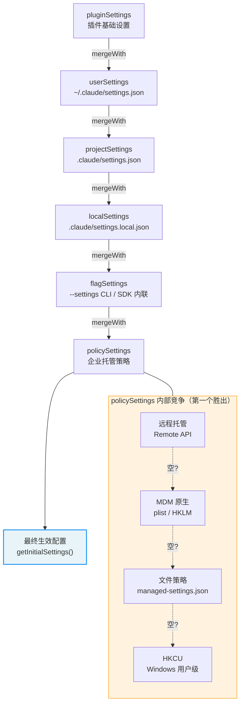

# 附录 B：环境变量参考

本附录列出 Claude Code v2.1.88 中用户可配置的关键环境变量。按功能域分组，仅列出影响用户可见行为的变量，省略内部遥测和平台检测类变量。

## 上下文压缩

| 变量 | 效果 | 默认值 |
|------|------|-------|
| `CLAUDE_CODE_AUTO_COMPACT_WINDOW` | 覆盖上下文窗口大小（token） | 模型默认值 |
| `CLAUDE_AUTOCOMPACT_PCT_OVERRIDE` | 以百分比覆盖自动压缩阈值（0-100） | 计算值 |
| `DISABLE_AUTO_COMPACT` | 完全禁用自动压缩 | `false` |

## Effort 与推理

| 变量 | 效果 | 有效值 |
|------|------|-------|
| `CLAUDE_CODE_EFFORT_LEVEL` | 覆盖 effort 级别 | `low`、`medium`、`high`、`max`、`auto`、`unset` |
| `CLAUDE_CODE_DISABLE_FAST_MODE` | 禁用 Fast Mode 加速输出 | `true`/`false` |
| `DISABLE_INTERLEAVED_THINKING` | 禁用扩展思考 | `true`/`false` |
| `MAX_THINKING_TOKENS` | 覆盖思考 token 上限 | 模型默认值 |

## 工具与输出限制

| 变量 | 效果 | 默认值 |
|------|------|-------|
| `BASH_MAX_OUTPUT_LENGTH` | Bash 命令最大输出字符数 | 8,000 |
| `CLAUDE_CODE_GLOB_TIMEOUT_SECONDS` | Glob 搜索超时（秒） | 默认值 |

## 权限与安全

| 变量 | 效果 | 注意 |
|------|------|------|
| `CLAUDE_CODE_DUMP_AUTO_MODE` | 导出 YOLO 分类器请求/响应 | 仅调试用 |
| `CLAUDE_CODE_DISABLE_COMMAND_INJECTION_CHECK` | 禁用 Bash 命令注入检测 | 降低安全性 |

## API 与认证

| 变量 | 效果 | 安全等级 |
|------|------|---------|
| `ANTHROPIC_API_KEY` | Anthropic API 认证密钥 | 凭证 |
| `ANTHROPIC_BASE_URL` | 自定义 API 端点（代理支持） | 可重定向 |
| `ANTHROPIC_MODEL` | 覆盖默认模型 | 安全 |
| `CLAUDE_CODE_USE_BEDROCK` | 通过 AWS Bedrock 路由推理 | 安全 |
| `CLAUDE_CODE_USE_VERTEX` | 通过 Google Vertex AI 路由推理 | 安全 |
| `CLAUDE_CODE_EXTRA_BODY` | 向 API 请求追加额外字段 | 高级用途 |
| `ANTHROPIC_CUSTOM_HEADERS` | 自定义 HTTP 请求头 | 安全 |

## 模型选择

| 变量 | 效果 | 示例 |
|------|------|------|
| `ANTHROPIC_DEFAULT_HAIKU_MODEL` | 自定义 Haiku 模型 ID | 模型字符串 |
| `ANTHROPIC_DEFAULT_SONNET_MODEL` | 自定义 Sonnet 模型 ID | 模型字符串 |
| `ANTHROPIC_DEFAULT_OPUS_MODEL` | 自定义 Opus 模型 ID | 模型字符串 |
| `ANTHROPIC_SMALL_FAST_MODEL` | 快速推理模型（如用于摘要） | 模型字符串 |
| `CLAUDE_CODE_SUBAGENT_MODEL` | 子 Agent 使用的模型 | 模型字符串 |

## 提示词缓存

| 变量 | 效果 | 默认值 |
|------|------|-------|
| `CLAUDE_CODE_ENABLE_PROMPT_CACHING` | 启用提示词缓存 | `true` |
| `DISABLE_PROMPT_CACHING` | 完全禁用提示词缓存 | `false` |

## 会话与调试

| 变量 | 效果 | 用途 |
|------|------|------|
| `CLAUDE_CODE_DEBUG_LOG_LEVEL` | 日志详细程度 | `silent`/`error`/`warn`/`info`/`verbose` |
| `CLAUDE_CODE_PROFILE_STARTUP` | 启用启动性能剖析 | 调试 |
| `CLAUDE_CODE_PROFILE_QUERY` | 启用查询管线剖析 | 调试 |
| `CLAUDE_CODE_JSONL_TRANSCRIPT` | 将会话记录写为 JSONL | 文件路径 |
| `CLAUDE_CODE_TMPDIR` | 覆盖临时目录 | 路径 |

## 输出与格式

| 变量 | 效果 | 默认值 |
|------|------|-------|
| `CLAUDE_CODE_SIMPLE` | 最小系统提示词模式 | `false` |
| `CLAUDE_CODE_DISABLE_TERMINAL_TITLE` | 禁用设置终端标题 | `false` |
| `CLAUDE_CODE_NO_FLICKER` | 减少全屏模式闪烁 | `false` |

## MCP（Model Context Protocol）

| 变量 | 效果 | 默认值 |
|------|------|-------|
| `MCP_TIMEOUT` | MCP 服务器连接超时（ms） | 10,000 |
| `MCP_TOOL_TIMEOUT` | MCP 工具调用超时（ms） | 30,000 |
| `MAX_MCP_OUTPUT_TOKENS` | MCP 工具输出 token 上限 | 默认值 |

## 网络与代理

| 变量 | 效果 | 注意 |
|------|------|------|
| `HTTP_PROXY` / `HTTPS_PROXY` | HTTP/HTTPS 代理 | 可重定向 |
| `NO_PROXY` | 绕过代理的主机列表 | 安全 |
| `NODE_EXTRA_CA_CERTS` | 额外 CA 证书 | 影响 TLS 信任 |

## 路径与配置

| 变量 | 效果 | 默认值 |
|------|------|-------|
| `CLAUDE_CONFIG_DIR` | 覆盖 Claude 配置目录 | `~/.claude` |

---

## 版本演化：v2.1.91 新增变量

| 变量 | 效果 | 说明 |
|------|------|------|
| `CLAUDE_CODE_AGENT_COST_STEER` | 子代理成本引导 | 控制多代理场景下的资源消耗 |
| `CLAUDE_CODE_RESUME_THRESHOLD_MINUTES` | 会话恢复时间阈值 | 控制会话恢复的时间窗口 |
| `CLAUDE_CODE_RESUME_TOKEN_THRESHOLD` | 会话恢复 Token 阈值 | 控制会话恢复的 Token 预算 |
| `CLAUDE_CODE_USE_ANTHROPIC_AWS` | AWS 认证路径 | 启用 Anthropic AWS 基础设施认证 |
| `CLAUDE_CODE_SKIP_ANTHROPIC_AWS_AUTH` | 跳过 AWS 认证 | AWS 不可用时的回退路径 |
| `CLAUDE_CODE_DISABLE_CLAUDE_API_SKILL` | 禁用 Claude API 技能 | 企业合规场景控制 |
| `CLAUDE_CODE_PLUGIN_KEEP_MARKETPLACE_ON_FAILURE` | 插件市场容错 | 市场获取失败时保留缓存版本 |
| `CLAUDE_CODE_REMOTE_SETTINGS_PATH` | 远程设置路径覆盖 | 企业部署自定义设置 URL |

### v2.1.91 移除的变量

| 变量 | 原效果 | 移除原因 |
|------|--------|---------|
| `CLAUDE_CODE_DISABLE_COMMAND_INJECTION_CHECK` | 禁用命令注入检查 | Tree-sitter 基础设施整体移除 |
| `CLAUDE_CODE_DISABLE_MOUSE_CLICKS` | 禁用鼠标点击 | 功能废弃 |
| `CLAUDE_CODE_MCP_INSTR_DELTA` | MCP 指令增量 | 功能重构 |

---

## 配置优先级体系

环境变量只是 Claude Code 配置系统的一个切面。完整的配置体系由 6 层来源构成，按优先级从低到高合并（merge）——后者覆盖前者。理解这个优先级链对诊断"为什么我的设置没有生效"至关重要。

### 六层优先级模型

配置来源定义在 `restored-src/src/utils/settings/constants.ts:7-22`，合并逻辑实现在 `restored-src/src/utils/settings/settings.ts:644-796` 的 `loadSettingsFromDisk()` 函数中：

| 优先级 | 来源标识 | 文件路径 / 来源 | 说明 |
|--------|---------|----------------|------|
| 0 (最低) | pluginSettings | 插件提供的基础设置 | 只包含白名单字段（如 `agent`），作为所有文件来源的底层 |
| 1 | `userSettings` | `~/.claude/settings.json` | 用户全局设置，跨所有项目生效 |
| 2 | `projectSettings` | `$PROJECT/.claude/settings.json` | 项目共享设置，提交到版本控制 |
| 3 | `localSettings` | `$PROJECT/.claude/settings.local.json` | 项目本地设置，自动加入 `.gitignore` |
| 4 | `flagSettings` | `--settings` CLI 参数 + SDK 内联设置 | 命令行或 SDK 传入的临时覆盖 |
| 5 (最高) | `policySettings` | 企业托管策略（多来源竞争） | 企业管理员强制策略，见下文 |

### 合并语义

合并使用 lodash 的 `mergeWith` 进行深度合并（deep merge），自定义合并器定义在 `restored-src/src/utils/settings/settings.ts:538-547`：

- **对象**：递归合并，后来源的字段覆盖前来源
- **数组**：合并并去重（`mergeArrays`），而非替换——这意味着多层来源的 `permissions.allow` 规则会累加
- **`undefined` 值**：在 `updateSettingsForSource` 中被解释为"删除该键"（`restored-src/src/utils/settings/settings.ts:482-486`）

这个数组合并语义特别重要：如果用户在 `userSettings` 中允许了一个工具，又在 `projectSettings` 中允许了另一个工具，最终的 `permissions.allow` 列表包含两者。这使得多层权限配置可以叠加而非互相覆盖。

### 策略设置（policySettings）的四层竞争

策略设置（`policySettings`）本身有一个内部优先级链，采用"第一个有内容的来源胜出"（first source wins）策略，实现在 `restored-src/src/utils/settings/settings.ts:322-345`：

| 子优先级 | 来源 | 说明 |
|---------|------|------|
| 1 (最高) | 远程托管设置（Remote Managed Settings） | 从 API 同步的企业策略缓存 |
| 2 | MDM 原生策略（HKLM / macOS plist） | 通过 `plutil` 或 `reg query` 读取的系统级策略 |
| 3 | 文件策略（`managed-settings.json` + `managed-settings.d/*.json`） | Drop-in 目录支持，按字母序合并 |
| 4 (最低) | HKCU 用户策略（仅 Windows） | 用户级注册表设置 |

注意策略设置与其他来源的合并行为不同：策略内部的四个子来源是**竞争关系**（第一个胜出），而策略整体与其他来源是**叠加关系**（深度合并到配置链顶部）。

### 覆盖链流程图

**图 B-1：配置优先级覆盖链**

### 缓存与失效

配置加载有两层缓存机制（`restored-src/src/utils/settings/settingsCache.ts`）：

1. **文件级缓存**：`parseSettingsFile()` 缓存每个文件的解析结果，避免重复 JSON 解析
2. **会话级缓存**：`getSettingsWithErrors()` 缓存合并后的最终结果，整个会话复用

缓存通过 `resetSettingsCache()` 统一失效——当用户通过 `/config` 命令或 `updateSettingsForSource()` 修改设置时触发。设置文件变更检测由 `restored-src/src/utils/settings/changeDetector.ts` 负责，通过文件系统监听（watch）驱动 React 组件的重新渲染。

### 诊断建议

当某个设置"不生效"时，按以下顺序排查：

1. **确认来源**：用 `/config` 命令查看当前生效的配置和来源标注
2. **检查优先级**：高优先级来源是否覆盖了你的设置？`policySettings` 是最强的覆盖者
3. **检查数组合并**：权限规则是累加的——如果 `deny` 规则出现在高优先级来源中，低优先级的 `allow` 无法覆盖
4. **检查缓存**：在同一会话中修改 `.json` 文件后，配置可能仍在缓存中——重启会话或使用 `/config` 触发刷新
