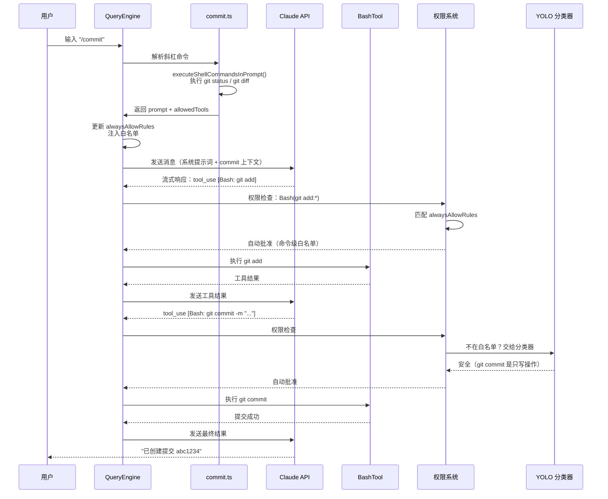
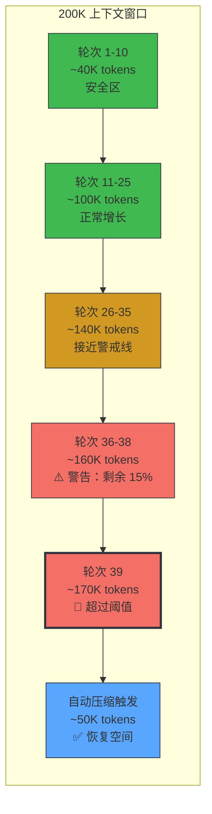
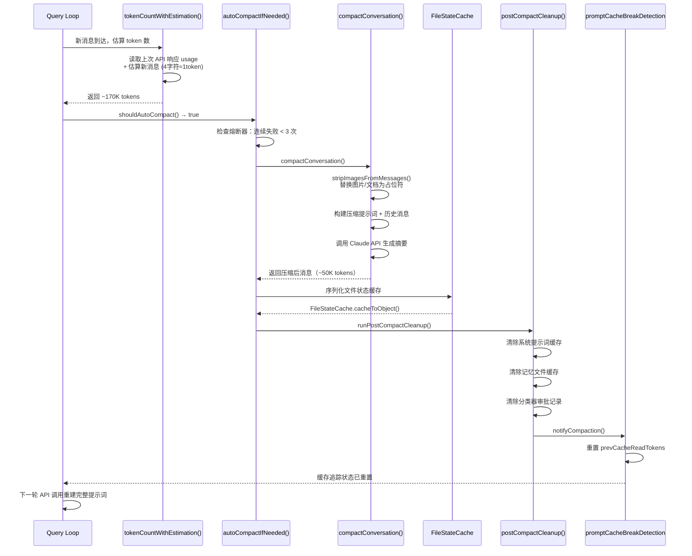
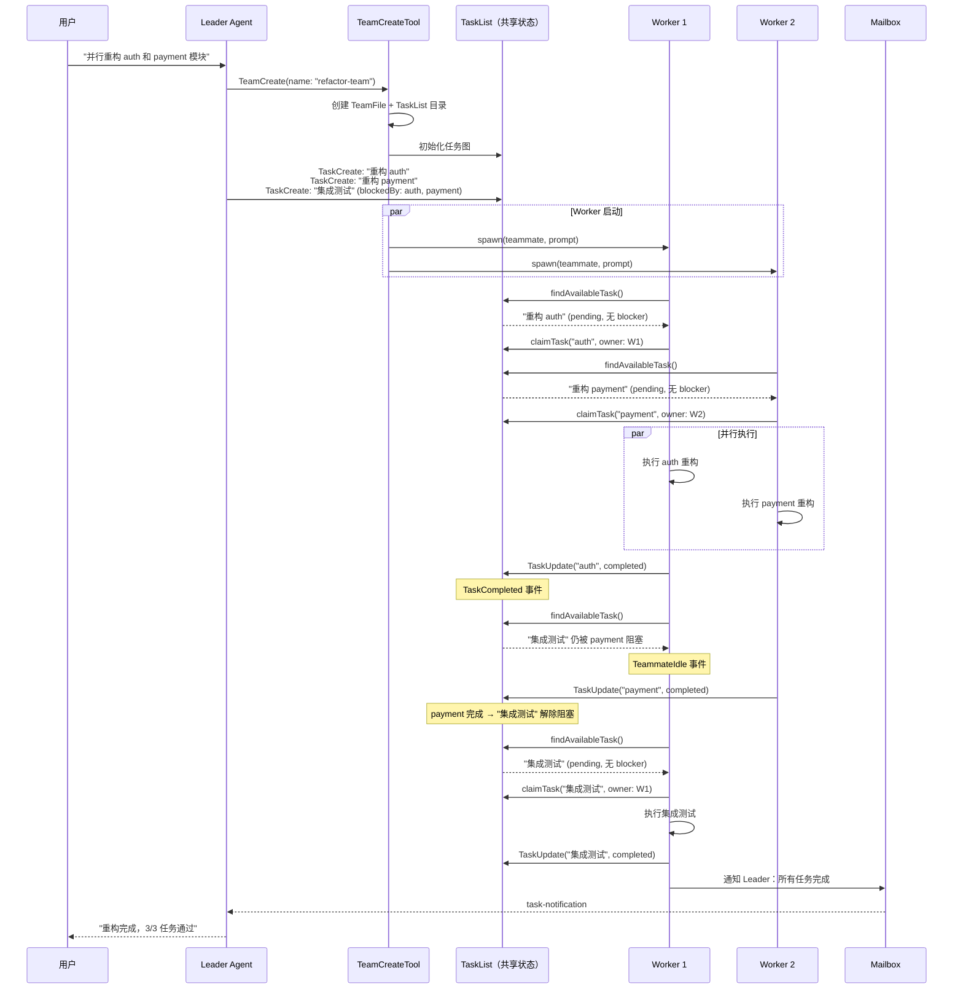

# 附录 F：端到端案例追踪

> 本附录通过三个完整的请求生命周期追踪，将全书各章的分析串联起来。每个案例从用户输入开始，经过多个子系统，到最终输出结束。阅读这些案例时，建议对照引用的章节深入了解每个阶段的内部机制。

---

## 案例 1：一次 `/commit` 的完整旅程

> 串联章节：第 3 章（Agent Loop）→ 第 5 章（系统提示词）→ 第 4 章（工具编排）→ 第 16 章（权限系统）→ 第 17 章（YOLO 分类器）→ 第 13 章（缓存命中）

### 场景

用户在一个 git 仓库中输入 `/commit`。Claude Code 需要：检查工作区状态、生成提交信息、执行 git commit，全程自动审批白名单内的 git 命令。

### 请求流程



### 子系统交互详解

**阶段 1：命令解析（第 3 章）**

用户输入 `/commit` 后，`QueryEngine.processUserInput()` 识别斜杠命令前缀，从命令注册表中查找 `commit` 命令定义（`restored-src/src/commands/commit.ts:6-82`）。命令定义包含两个关键字段：

- `allowedTools`：`['Bash(git add:*)', 'Bash(git status:*)', 'Bash(git commit:*)']`——限定模型只能使用这三类 git 命令
- `getPromptContent()`：在发送给 API 之前，先通过 `executeShellCommandsInPrompt()` 在本地执行 `git status` 和 `git diff HEAD`，将真实的仓库状态嵌入提示词

这意味着模型收到的不是一个空泛的"请帮我提交"指令，而是包含了当前 diff 的完整上下文。

**阶段 2：权限注入（第 16 章）**

`QueryEngine` 在调用 API 前，将 `allowedTools` 写入 `AppState.toolPermissionContext.alwaysAllowRules.command`（`restored-src/src/QueryEngine.ts:477-486`）。这一步的效果是：本轮对话中，所有匹配 `Bash(git add:*)` 模式的工具调用都会被自动批准，无需用户确认。

**阶段 3：API 调用与缓存（第 5 章、第 13 章）**

系统提示词在 API 调用时被分成多个带 `cache_control` 标记的 block（`restored-src/src/utils/api.ts:72-84`）。如果用户之前已经执行过其他命令，系统提示词的前缀部分（工具定义、基本规则）可能命中提示词缓存，只有 `/commit` 注入的新上下文需要重新处理。

**阶段 4：工具执行与分类（第 4 章、第 17 章）**

模型返回 `tool_use` 块后，权限系统按优先级检查：

1. 先查 `alwaysAllowRules`——`git add` 和 `git status` 直接匹配白名单
2. 对于 `git commit`，如果不在白名单内，交给 YOLO 分类器（`restored-src/src/utils/permissions/yoloClassifier.ts:54-68`）判断安全性
3. `BashTool` 执行实际命令，通过 `bashPermissions.ts` 做 AST 级别的命令解析

**阶段 5：归因计算**

提交完成后，`commitAttribution.ts`（`restored-src/src/utils/commitAttribution.ts:548-743`）计算 Claude 的字符贡献比例，决定是否在 commit message 中添加 `Co-Authored-By` 署名。

### 这个案例展示了什么

一次简单的 `/commit` 背后，至少涉及 6 个子系统的协作：命令系统提供上下文注入、权限系统提供白名单自动审批、YOLO 分类器兜底判断、BashTool 执行实际命令、提示词缓存减少重复计算、归因模块处理署名。这正是驾驭工程的核心——每个子系统各司其职，通过 Agent Loop 的统一循环协调运作。

---

## 案例 2：触发自动压缩的长对话

> 串联章节：第 9 章（自动压缩）→ 第 10 章（文件状态保留）→ 第 11 章（微压缩）→ 第 12 章（Token 预算）→ 第 13 章（缓存架构）→ 第 26 章（上下文管理原则）

### 场景

用户在一个大型代码库中进行长时间的重构对话。经过约 40 轮交互后，上下文窗口接近 200K token 上限，触发自动压缩。

### Token 消耗时间线



### 关键阈值

| 阈值 | 计算方式 | 约值 | 作用 |
|------|---------|------|------|
| 上下文窗口 | `MODEL_CONTEXT_WINDOW_DEFAULT` | 200,000 | 模型最大输入 |
| 有效窗口 | 上下文窗口 - max_output_tokens | ~180,000 | 预留输出空间 |
| 压缩阈值 | 有效窗口 - 13K buffer | ~167,000 | 触发自动压缩 |
| 警告阈值 | 有效窗口 - 20K | ~160,000 | 日志警告 |
| 阻塞阈值 | 有效窗口 - 3K | ~177,000 | 强制执行 /compact |

来源：`restored-src/src/services/compact/autoCompact.ts:28-91`，`restored-src/src/utils/context.ts:8-9`

### 压缩执行流程



### 子系统交互详解

**阶段 1：Token 计数（第 12 章）**

每轮 API 调用后，`tokenCountWithEstimation()`（`restored-src/src/utils/tokens.ts:226-261`）读取上次响应中的 `input_tokens + cache_creation_input_tokens + cache_read_input_tokens`，再加上此后新增消息的估算值（4 字符约 1 token）。这个函数是所有上下文管理决策的数据基础。

**阶段 2：阈值判断（第 9 章）**

`shouldAutoCompact()`（`restored-src/src/services/compact/autoCompact.ts:225-226`）将 token 计数与压缩阈值（~167K）比较。超过阈值后，还要检查熔断器——如果连续 3 次压缩失败，就停止重试（第 260-265 行）。这是第 26 章"熔断失控循环"原则的具体实现。

**阶段 3：压缩执行（第 9 章）**

`compactConversation()`（`restored-src/src/services/compact/compact.ts:122-200`）执行实际压缩：

1. 剥离图片和文档内容，替换为 `[image]`/`[document]` 占位符
2. 构建压缩提示词，将完整历史消息发送给 Claude 生成摘要
3. 返回压缩后的消息数组（从约 400 条消息减少到约 80 条）

**阶段 4：文件状态保留（第 10 章）**

压缩前，`FileStateCache`（`restored-src/src/utils/fileStateCache.ts:30-143`）将所有已缓存的文件路径、内容、时间戳序列化。这些数据作为 attachment 注入到压缩后的消息中，确保模型在压缩后仍然"记得"哪些文件被读取和编辑过。缓存采用 LRU 策略，上限 100 条目、25MB 总大小。

**阶段 5：缓存失效（第 13 章）**

压缩完成后，`runPostCompactCleanup()`（`restored-src/src/services/compact/postCompactCleanup.ts:31-77`）执行全面清理：

- 清除系统提示词缓存（`getUserContext.cache.clear()`）
- 清除记忆文件缓存
- 清除 YOLO 分类器的审批记录
- 通知缓存追踪模块重置状态（`notifyCompaction()`）

这意味着压缩后的第一次 API 调用必须重建完整的系统提示词——提示词缓存会完全 miss。这是压缩的隐藏成本：你节省了上下文空间，但付出了一次完整的缓存重建。

### 这个案例展示了什么

自动压缩不是一个孤立的功能，而是 Token 计数、阈值判断、摘要生成、文件状态保留、缓存失效五个子系统的协作。它体现了第 26 章的核心原则：**上下文管理是 Agent 的核心能力，不是附加功能**。每一步都在"保留足够信息"和"释放足够空间"之间做精确权衡。

---

## 案例 3：多 Agent 协作执行

> 串联章节：第 20 章（Agent 派生）→ 第 20b 章（Teams 调度内核）→ 第 5 章（系统提示词变体）→ 第 25 章（驾驭工程原则）

### 场景

用户要求 Claude Code 并行重构多个模块。主 Agent 创建一个 Team，分配任务给子 Agent，子 Agent 通过 TaskList 自动领取和完成任务。

### Agent 通信序列



### 子系统交互详解

**阶段 1：Team 创建（第 20 章、第 20b 章）**

`TeamCreateTool`（`restored-src/src/tools/AgentTool/AgentTool.tsx`）执行两件事：创建 `TeamFile` 配置和初始化对应的 TaskList 目录。正如第 20b 章分析的：**Team = TaskList**——团队和任务表是同一个运行时对象的两个视图。

Worker 的物理后端由 `detectAndGetBackend()` 决定（`restored-src/src/utils/swarm/backends/`）：

| 后端 | 进程模型 | 检测条件 |
|------|---------|---------|
| Tmux | 独立 CLI 进程 | 默认后端（Linux/macOS） |
| iTerm2 | 独立 CLI 进程 | macOS + iTerm2 |
| In-Process | AsyncLocalStorage 隔离 | 无 tmux/iTerm2 |

**阶段 2：任务图构建（第 20b 章）**

Leader 创建的任务不是简单的 Todo 列表，而是带有 `blocks`/`blockedBy` 依赖关系的 DAG（`restored-src/src/utils/tasks.ts`）：

```typescript
// restored-src/src/utils/tasks.ts
{
  id: "auth",
  status: "pending",
  blocks: ["integration-test"],
  blockedBy: [],
}
{
  id: "integration-test",
  status: "pending",
  blocks: [],
  blockedBy: ["auth", "payment"],
}
```

这种设计让 Leader 可以一次性声明所有任务及其依赖，"什么时候可以并行"交给运行时判断。

**阶段 3：自动 Claim（第 20b 章）**

`useTaskListWatcher.ts` 中的 `findAvailableTask()` 是 Swarm 的最小调度器：

1. 筛选 `status === 'pending'` 且 `owner` 为空的任务
2. 检查 `blockedBy` 中的任务是否都已完成
3. 找到后 `claimTask()` 原子抢占 owner

这实现了第 25 章的核心原则之一：**调度和推理分离**——模型不需要在自然语言中判断任务依赖，运行时已经把候选工作缩减到一个明确任务。

**阶段 4：上下文隔离（第 20 章）**

每个 In-Process Worker 通过 `AsyncLocalStorage`（`restored-src/src/utils/teammateContext.ts:41-64`）维护独立上下文：

```typescript
// restored-src/src/utils/teammateContext.ts:41
const teammateStorage = new AsyncLocalStorage<TeammateContext>();
```

`TeammateContext` 包含 `agentId`、`agentName`、`teamName`、`parentSessionId` 等字段。这确保了同进程内的多个 Agent 不会互相污染状态。

**阶段 5：事件面（第 20b 章）**

Worker 完成任务后，触发两类事件（`restored-src/src/query/stopHooks.ts`）：

- `TaskCompleted`：标记任务完成，可能解除其他任务的 blocker
- `TeammateIdle`：Worker 进入空闲，回到 TaskList 寻找新任务

这使得 Teams 是 pull + push 的混合模型——空闲 Worker 主动拉取任务，同时任务完成事件推送给 Leader。

**阶段 6：通信（第 20b 章）**

Worker 之间不直接对话。所有协作通过两个渠道：

- **TaskList**（共享文件系统状态）：`~/.claude/tasks/{team-name}/`
- **Mailbox**（持久化消息队列）：`~/.claude/teams/{team}/inboxes/*.json`

`task-notification` 消息被注入 Leader 的消息流时，提示词明确要求通过 `<task-notification>` 标签区分（不是用户输入）。

### 这个案例展示了什么

多 Agent 协作的核心不是"让 Agent 互相聊天"，而是**共享任务图 + 原子 Claim + 回合结束事件**构成的协作内核。Claude Code 的 Swarm 本质上是一个分布式调度器：Leader 声明任务依赖、Worker 自动领取、运行时管理并发冲突。这是第 25 章"先把协作状态外化，再让不同执行单元围绕它协作"原则的直接体现。
