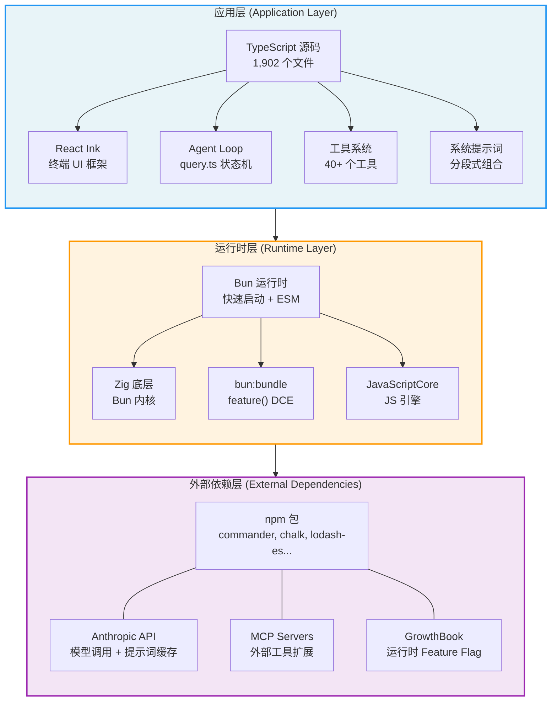

# 第1章：AI 编码 Agent 的完整技术栈

## 为什么这很重要

要理解一个 AI 编码 Agent 如何从"接收用户输入"走到"在你的代码库中执行操作"，首先必须理解它的技术栈（technology stack）。技术栈不仅决定了性能天花板，更决定了架构边界——哪些事情可以在编译时完成，哪些必须推迟到运行时，哪些需要模型自己去决策。

Claude Code 的技术栈选择揭示了一个核心理念：**AI 编码 Agent 不是传统的 CLI 工具，它是一个"在分发状态下（on distribution）运行"的系统——模型不仅使用工具，还能编写自己的工具**。这意味着整个技术栈必须为"模型作为一等公民"而设计，从入口点的启动优化到 Feature Flag 的构建时消除，每一层都在为这个目标服务。

本章将建立一个贯穿全书的核心概念——**三层架构**——并通过源码分析展示它如何在 Claude Code v2.1.88 中具体落地。

---

## 1.1 技术栈概览：TypeScript + React Ink + Bun

Claude Code 的技术选型可以用一句话概括：**用 TypeScript 获得类型安全，用 React Ink 获得终端 UI 的组件化能力，用 Bun 获得启动速度和构建时优化**。

### TypeScript：应用层的语言

整个代码库由 1,902 个 TypeScript 源文件组成。TypeScript 的类型系统在 AI Agent 开发中有一个独特优势：工具的输入/输出 Schema 可以直接从类型定义生成，而这些 Schema 又直接成为发送给模型的 JSON Schema——类型定义、运行时验证和模型指令三者合一。

### React Ink：终端 UI 框架

Claude Code 的交互界面不是传统的 readline REPL，而是一个完整的 React 应用。React Ink 将 React 的组件模型带入终端，使得复杂的 UI 状态管理（流式输出、多工具并行显示、权限对话框）可以用声明式的方式表达。主要的 UI 组件位于 `restored-src/src/screens/REPL.tsx`，它本身就是一个超过 5,000 行的 React 组件。

### Bun：运行时与构建工具

Bun 在这里承担双重角色：

1. **运行时**：比 Node.js 更快的启动速度，对 CLI 工具至关重要——用户期望输入 `claude` 后立即看到响应
2. **构建工具**：通过 `bun:bundle` 提供的 `feature()` 函数实现编译时死代码消除（Dead Code Elimination, DCE），这是整个 Feature Flag 系统的基石

---

## 1.2 入口点分析：`main.tsx` 的启动编排

`main.tsx` 是整个应用的入口点，它的前 20 行代码就展示了一种经过深思熟虑的启动优化策略。

### 并行预取（Parallel Prefetch）

```typescript
// restored-src/src/main.tsx:1-20
import { profileCheckpoint, profileReport } from './utils/startupProfiler.js';
profileCheckpoint('main_tsx_entry');

import { startMdmRawRead } from './utils/settings/mdm/rawRead.js';
startMdmRawRead();

import { ensureKeychainPrefetchCompleted, startKeychainPrefetch }
  from './utils/secureStorage/keychainPrefetch.js';
startKeychainPrefetch();
```

注意这里的代码组织方式：每个 `import` 后面紧跟一个立即执行的副作用调用（side-effect call）。源码注释（`restored-src/src/main.tsx:1-8`）明确解释了设计意图：

1. **`profileCheckpoint`**：在任何重量级模块求值开始前标记入口时间点
2. **`startMdmRawRead`**：启动 MDM（Mobile Device Management）子进程（macOS 上的 `plutil` / Windows 上的 `reg query`），使其与后续约 135ms 的 import 评估并行执行
3. **`startKeychainPrefetch`**：并行启动两个 macOS Keychain 读取操作（OAuth 令牌和旧版 API 密钥）——如果不做预取，`isRemoteManagedSettingsEligible()` 会通过同步 spawn 顺序读取，每次启动多花约 65ms

这三个操作遵循同一个模式：**将 I/O 密集型操作提前到模块加载的"死时间"中并行执行**。这不是偶然的优化——ESLint 注释 `// eslint-disable-next-line custom-rules/no-top-level-side-effects` 表明团队有一条自定义规则禁止顶层副作用，这里是经过审慎考虑后的豁免。

### 延迟导入（Lazy Import）

在并行预取之后，`main.tsx` 展示了第二种启动优化策略——条件性延迟导入：

```typescript
// restored-src/src/main.tsx:69-81
const getTeammateUtils = () =>
  require('./utils/teammate.js') as typeof import('./utils/teammate.js');
const getTeammatePromptAddendum = () =>
  require('./utils/swarm/teammatePromptAddendum.js') as ...;

const coordinatorModeModule = feature('COORDINATOR_MODE')
  ? require('./coordinator/coordinatorMode.js') as ...
  : null;

const assistantModule = feature('KAIROS')
  ? require('./assistant/index.js') as ...
  : null;
```

这里有两种不同的延迟加载策略：

- **函数包装的 `require`**（如 `getTeammateUtils`）：用于打破循环依赖（`teammate.ts -> AppState.tsx -> ... -> main.tsx`），每次调用时才解析模块
- **Feature Flag 守卫的 `require`**（如 `coordinatorModeModule`）：利用 Bun 的 `feature()` 实现构建时消除——当 `COORDINATOR_MODE` 为 `false` 时，整个 `require` 表达式及其导入的模块树都会在构建产物中被移除

### Feature Flag 作为门控

从第 21 行开始，`feature('...')` 函数的身影贯穿整个入口文件：

```typescript
// restored-src/src/main.tsx:21
import { feature } from 'bun:bundle';
```

这个来自 `bun:bundle` 的 `feature()` 函数是理解整个 Feature Flag 系统的关键。它不是运行时的条件判断——它是一个**编译时常量**。当 Bun 打包器处理 `feature('X')` 时，会根据构建配置将其替换为 `true` 或 `false` 字面量，然后 JavaScript 引擎的死代码消除会移除不可达的分支。注意 `bun:bundle` 的 `feature()` 并非 Bun 公开文档化的 API，而是 Anthropic 构建流水线中的定制条件编译机制。

---

## 1.3 三层架构

Claude Code 的架构可以分为三层，每一层有明确的职责边界。这个架构模型将在后续章节中反复引用——第3章的 Agent Loop 运行在应用层，第4章的工具执行编排跨越应用层和运行时层，第13-15章的缓存优化则涉及所有三层的协作。



### 应用层（TypeScript）

应用层是所有业务逻辑所在的地方。它包含：

- **Agent Loop**（`query.ts`）：核心状态机，编排"模型调用 → 工具执行 → 继续判定"的循环（详见第3章）
- **工具系统**（`tools.ts` + `tools/` 目录）：40+ 个工具的注册、权限检查和执行（详见第2章）
- **系统提示词**（`constants/prompts.ts`）：分段式组合的提示词架构（详见第5章）
- **React Ink UI**（`screens/REPL.tsx`）：终端界面的声明式渲染

### 运行时层（Bun/Zig/JSC）

运行时层提供三个关键能力：

1. **快速启动**：Bun 的启动速度比 Node.js 快数倍，对 CLI 工具体验至关重要
2. **构建时优化**：`bun:bundle` 的 `feature()` 函数实现编译时 Feature Flag 消除
3. **JavaScript 引擎**：Bun 底层使用 JavaScriptCore（JSC，Safari 的 JS 引擎）而非 V8，配合 Zig 编写的底层运行时内核

### 外部依赖层

外部依赖层包括：

- **npm 包**：`commander`（CLI 参数解析）、`chalk`（终端着色）、`lodash-es`（实用函数）等
- **Anthropic API**：模型调用和提示词缓存（Prompt Cache）的服务端
- **MCP Servers**：Model Context Protocol 服务器，提供外部工具扩展能力
- **GrowthBook**：运行时 A/B 测试和 Feature Flag 服务

### 层间边界的意义

三层架构的关键在于**层间的信息流方向**：

- 应用层 → 运行时层：TypeScript 代码编译为 JavaScript，`feature()` 调用在此时被解析
- 运行时层 → 外部依赖层：HTTP 请求、npm 包加载、MCP 连接
- 外部依赖层 → 应用层：模型响应、工具结果、Feature Flag 值——这些信息**向上穿透**两层回到应用层

理解这个穿透路径很重要：当 GrowthBook 返回一个 `tengu_*` Feature Flag 的新值时，它影响的不是构建时的 `feature()` 函数（那些在构建时已经固化），而是运行时的条件逻辑。Claude Code 中存在**两套并行的 Feature Flag 机制**：构建时的 `feature()` 和运行时的 GrowthBook，它们服务于不同的目的（后面详述）。

---

## 1.4 为什么 "On Distribution" 很重要

"On distribution" 是理解 Claude Code 架构决策的一个关键概念。传统的 CLI 工具在**开发时**定义好所有功能，然后分发给用户。但 AI 编码 Agent 不同——它在**被用户使用时**，其行为由模型动态决定。

具体来说：

1. **模型选择工具**：Agent Loop 的每次迭代中，模型决定调用哪个工具、传入什么参数。工具的 `description` 和 `inputSchema` 不仅是文档——它们是发送给模型的指令
2. **模型编写自己的工具**：通过 `BashTool`，模型可以执行任意 shell 命令；通过 `FileWriteTool`，模型可以创建新文件；通过 `SkillTool`，模型可以加载和执行用户定义的提示词模板
3. **模型作用于自己的上下文**：通过压缩（Compaction）、微压缩（Microcompact）和上下文折叠（Context Collapse），模型参与管理自己的上下文窗口

这意味着技术栈必须考虑一个传统软件不需要考虑的维度：**模型作为运行时的一部分，它的行为不完全由代码控制，而是由提示词、工具描述和上下文共同塑造**。

这就是为什么 Feature Flag 系统如此重要——它不仅控制代码路径，还控制模型能"看到"哪些工具。当 `feature('WEB_BROWSER_TOOL')` 为 `false` 时，`WebBrowserTool` 不仅不会被加载，它的整个模块树都从构建产物中消失，模型永远无法知道它的存在：

```typescript
// restored-src/src/tools.ts:117-119
const WebBrowserTool = feature('WEB_BROWSER_TOOL')
  ? require('./tools/WebBrowserTool/WebBrowserTool.js').WebBrowserTool
  : null;
```

---

## 1.5 构建时死代码消除：`feature()` 的工作原理

`feature()` 函数来自 Bun 的打包器模块 `bun:bundle`，它在 Claude Code 中被大量使用来实现构建时的条件编译。

### 机制

当 Bun 的打包器遇到 `feature('X')` 调用时：

1. 查找构建配置中 `X` 的值
2. 将 `feature('X')` 替换为字面量 `true` 或 `false`
3. JavaScript 引擎的优化器识别出不可达分支并将其移除

这意味着以下代码：

```typescript
const SleepTool = feature('PROACTIVE') || feature('KAIROS')
  ? require('./tools/SleepTool/SleepTool.js').SleepTool
  : null;
```

在 `PROACTIVE=false, KAIROS=false` 的构建中会变成：

```typescript
const SleepTool = false || false
  ? require('./tools/SleepTool/SleepTool.js').SleepTool
  : null;
```

进而被优化为 `const SleepTool = null;`，而 `SleepTool.js` 及其整个依赖树都不会出现在最终的 bundle 中。

### 使用模式

在 `tools.ts` 中，`feature()` 的使用呈现四种模式：单 Flag 守卫、多 Flag OR 组合、多 Flag AND 组合、数组展开。这些模式在 `commands.ts` 中同样出现（`restored-src/src/commands.ts:59-100`），用于控制 slash 命令的可用性。工具注册管线的完整分析详见第2章。

### 与运行时 Flag 的区别

Claude Code 中存在两套 Feature Flag 机制，容易混淆：

| 维度 | 构建时 `feature()` | 运行时 GrowthBook `tengu_*` |
|------|--------------------|-----------------------------|
| 解析时机 | Bun 打包时 | 会话启动时从 GrowthBook 拉取 |
| 影响范围 | 代码是否存在于 bundle | 代码逻辑的运行时分支 |
| 修改方式 | 需要重新构建和发布 | 服务端配置即时生效 |
| 典型用途 | 实验性功能的完整模块树消除 | A/B 测试、渐进灰度 |
| 示例 | `feature('KAIROS')` | `tengu_ultrathink_enabled` |

两者互补：`feature()` 用于"这个功能是否存在"，GrowthBook 用于"这个功能对哪些用户开放"。一个功能通常先由 `feature()` 守卫其模块加载，再由 GrowthBook 控制其运行时行为。

---

## 1.6 89 个 Feature Flag 全景

通过对源码中所有 `feature('...')` 调用的提取，我们得到 89 个构建时 Feature Flag。按功能分类如下：

| 分类 | Feature Flag | 简述 |
|------|-------------|------|
| **核心 Agent 循环** | `REACTIVE_COMPACT` | 响应式压缩——根据上下文动态触发 |
| | `CONTEXT_COLLAPSE` | 上下文折叠——结构化的上下文修剪 |
| | `CACHED_MICROCOMPACT` | 缓存感知的微压缩 |
| | `TOKEN_BUDGET` | Token 预算追踪器 |
| | `HISTORY_SNIP` | 历史记录精确裁剪 |
| | `COMPACTION_REMINDERS` | 压缩后的上下文提醒注入 |
| **工具与能力** | `WEB_BROWSER_TOOL` | 内置浏览器工具（Bun WebView） |
| | `MONITOR_TOOL` | 监控工具 |
| | `OVERFLOW_TEST_TOOL` | 溢出测试工具 |
| | `TERMINAL_PANEL` | 终端面板捕获 |
| | `WORKFLOW_SCRIPTS` | 工作流脚本系统 |
| | `POWERSHELL_AUTO_MODE` | PowerShell 自动模式 |
| | `TREE_SITTER_BASH` | Tree-sitter Bash 解析 |
| | `TREE_SITTER_BASH_SHADOW` | Tree-sitter Bash 影子模式 |
| | `BASH_CLASSIFIER` | Bash 命令分类器 |
| **助手与自主模式** | `KAIROS` | 助手模式——后台自主 Agent |
| | `KAIROS_BRIEF` | 助手模式简报 |
| | `KAIROS_CHANNELS` | 助手模式频道 |
| | `KAIROS_DREAM` | 助手模式记忆整理（autoDream） |
| | `KAIROS_GITHUB_WEBHOOKS` | 助手模式 GitHub Webhook |
| | `KAIROS_PUSH_NOTIFICATION` | 助手模式推送通知 |
| | `PROACTIVE` | 主动模式——自主感知终端焦点 |
| | `AWAY_SUMMARY` | 离开摘要 |
| **多 Agent 编排** | `COORDINATOR_MODE` | 协调者模式——多 Worker 编排 |
| | `FORK_SUBAGENT` | 子 Agent 分叉执行 |
| | `TEAMMEM` | 队友记忆共享 |
| | `UDS_INBOX` | Unix Domain Socket 消息收件箱 |
| | `VERIFICATION_AGENT` | 验证 Agent |
| | `BUILTIN_EXPLORE_PLAN_AGENTS` | 内置探索/计划 Agent |
| **远程与分布式** | `BRIDGE_MODE` | 远程控制桥接 |
| | `DAEMON` | 后台守护进程 |
| | `CCR_AUTO_CONNECT` | CCR 自动连接 |
| | `CCR_MIRROR` | CCR 镜像 |
| | `CCR_REMOTE_SETUP` | CCR 远程设置 |
| | `SSH_REMOTE` | SSH 远程模式 |
| | `DIRECT_CONNECT` | 直连模式 |
| | `SELF_HOSTED_RUNNER` | 自托管 Runner |
| | `BYOC_ENVIRONMENT_RUNNER` | BYOC 环境 Runner |
| **技能系统** | `EXPERIMENTAL_SKILL_SEARCH` | 实验性技能搜索 |
| | `RUN_SKILL_GENERATOR` | 技能生成器 |
| | `SKILL_IMPROVEMENT` | 技能改进 |
| | `MCP_SKILLS` | MCP 技能桥接 |
| | `BUILDING_CLAUDE_APPS` | 构建 Claude 应用技能 |
| **用户界面** | `VOICE_MODE` | 语音模式 |
| | `BUDDY` | 伴侣精灵（动画角色） |
| | `AUTO_THEME` | 自动主题切换 |
| | `MESSAGE_ACTIONS` | 消息操作（交互按钮） |
| | `NATIVE_CLIPBOARD_IMAGE` | 原生剪贴板图片 |
| | `HISTORY_PICKER` | 历史选择器 |
| | `STREAMLINED_OUTPUT` | 精简输出模式 |
| | `QUICK_SEARCH` | 快速搜索 |
| | `CONNECTOR_TEXT` | 连接器文本 |
| **调度与触发** | `AGENT_TRIGGERS` | Agent 定时触发器（Cron） |
| | `AGENT_TRIGGERS_REMOTE` | 远程 Agent 触发器 |
| | `BG_SESSIONS` | 后台会话 |
| | `TEMPLATES` | 模板系统（任务模板） |
| **安全与权限** | `TRANSCRIPT_CLASSIFIER` | 会话转录分类器 |
| | `HOOK_PROMPTS` | Hook 提示词 |
| | `ANTI_DISTILLATION_CC` | 反蒸馏保护 |
| | `NATIVE_CLIENT_ATTESTATION` | 原生客户端证明 |
| **记忆与上下文** | `EXTRACT_MEMORIES` | 记忆提取 |
| | `AGENT_MEMORY_SNAPSHOT` | Agent 记忆快照 |
| | `MEMORY_SHAPE_TELEMETRY` | 记忆形状遥测 |
| | `FILE_PERSISTENCE` | 文件持久化 |
| **计划与执行** | `ULTRAPLAN` | 超级计划模式 |
| | `ULTRATHINK` | 超级思考模式 |
| | `REVIEW_ARTIFACT` | 审查工件 |
| | `UNATTENDED_RETRY` | 无人值守重试 |
| **遥测与调试** | `ENHANCED_TELEMETRY_BETA` | 增强遥测（Beta） |
| | `COWORKER_TYPE_TELEMETRY` | 协作者类型遥测 |
| | `PERFETTO_TRACING` | Perfetto 跟踪 |
| | `SLOW_OPERATION_LOGGING` | 慢操作日志 |
| | `SHOT_STATS` | Shot 统计 |
| | `PROMPT_CACHE_BREAK_DETECTION` | 提示词缓存中断检测 |
| | `BREAK_CACHE_COMMAND` | 缓存中断命令 |
| **MCP 扩展** | `CHICAGO_MCP` | Chicago MCP 集成 |
| | `MCP_RICH_OUTPUT` | MCP 富输出 |
| **实验性** | `ABLATION_BASELINE` | 消融基线测试 |
| | `DUMP_SYSTEM_PROMPT` | 导出系统提示词 |
| | `LODESTONE` | Lodestone 引导系统 |
| | `TORCH` | Torch 功能 |
| **设置与配置** | `DOWNLOAD_USER_SETTINGS` | 下载用户设置 |
| | `UPLOAD_USER_SETTINGS` | 上传用户设置 |
| | `NEW_INIT` | 新版初始化流程 |
| | `HARD_FAIL` | 硬失败模式 |
| | `ALLOW_TEST_VERSIONS` | 允许测试版本 |
| **平台检测** | `IS_LIBC_GLIBC` | glibc 检测 |
| | `IS_LIBC_MUSL` | musl 检测 |
| | `COMMIT_ATTRIBUTION` | 提交归因 |

### 从 Flag 看产品路线图

89 个 Feature Flag 不仅是技术实现细节，它们是产品路线图的投影：

- **KAIROS 家族**（6 个 Flag）：这是最大的 Flag 集群，指向一个完整的"助手模式"产品——后台自主运行、记忆整理、推送通知、GitHub Webhook 集成。这不是一个 CLI 工具的增强，而是一个完全不同的产品形态
- **COORDINATOR_MODE + TEAMMEM + UDS_INBOX**：多 Agent 协作的基础设施——Worker 分配、队友记忆、进程间通信
- **BRIDGE_MODE + DAEMON + CCR_***：远程控制和分布式执行——将 Claude Code 从本地 CLI 扩展为可远程操控的 Agent 平台
- **ULTRAPLAN + ULTRATHINK**：模型推理能力的升级——更深层的计划和思考能力

---

## 1.7 工具注册管线：Feature Flag 的实战应用

`tools.ts` 的 `getAllBaseTools()` 函数（`restored-src/src/tools.ts:193-251`）是 Feature Flag 系统最集中的展示。它展示了三种不同的工具注册策略：

### 策略一：无条件注册

```typescript
// restored-src/src/tools.ts:195-209
AgentTool,
TaskOutputTool,
BashTool,
FileReadTool,
FileEditTool,
FileWriteTool,
```

这些是核心工具，始终可用，无需任何条件。

### 策略二：构建时 Feature Flag 守卫

```typescript
// restored-src/src/tools.ts:217-218
...(WebBrowserTool ? [WebBrowserTool] : []),
```

`WebBrowserTool` 在文件顶部通过 `feature('WEB_BROWSER_TOOL')` 守卫——如果 Flag 为 false，变量为 `null`，此处展开为空数组。**整个工具的代码在构建产物中不存在**。

### 策略三：运行时环境变量守卫

```typescript
// restored-src/src/tools.ts:214-215
...(process.env.USER_TYPE === 'ant' ? [ConfigTool] : []),
...(process.env.USER_TYPE === 'ant' ? [TungstenTool] : []),
```

`ConfigTool` 和 `TungstenTool` 通过运行时环境变量 `USER_TYPE` 控制——它们的代码存在于构建产物中，但只对 Anthropic 内部用户（`ant`）可见。这是 A/B 测试的"暂存区"模式：在内部验证后再向外部用户开放。

### 策略四：运行时函数守卫

```typescript
// restored-src/src/tools.ts:200-201
...(hasEmbeddedSearchTools() ? [] : [GlobTool, GrepTool]),
```

这是一个有趣的反向守卫：当 Bun 的单文件可执行中内嵌了搜索工具（`bfs`/`ugrep`）时，独立的 `GlobTool` 和 `GrepTool` 反而被移除——因为模型可以直接通过 `BashTool` 访问这些内嵌的快速工具。

---

## 1.8 模式提炼

从 Claude Code 的技术栈选择中，我们可以提炼出几个适用于所有 AI Agent 构建者的模式：

### 模式一：启动时间是 UX

CLI 工具的启动时间直接影响用户体验。Claude Code 通过三种手段优化启动：并行预取（I/O 与模块加载重叠）、延迟导入（按需加载）、构建时消除（减小 bundle 体积）。对于 AI Agent 来说，启动慢意味着用户在等待期间失去上下文，这比传统工具更糟糕。

### 模式二：双层 Feature Flag

构建时 Flag（`feature()`）和运行时 Flag（GrowthBook）服务于不同目的。前者控制代码的物理存在，后者控制行为的逻辑分支。在 AI Agent 中，这个区分尤为重要——构建时 Flag 决定模型能"看到"哪些工具（因为不存在的工具不会出现在 Schema 中），运行时 Flag 决定模型的行为参数（如 effort 级别、thinking 预算）。

### 模式三：模型感知的架构

传统软件的架构是为人类开发者设计的——API 边界、模块划分、抽象层次。AI Agent 的架构还需要为模型设计——工具描述是否清晰、Schema 是否自解释、提示词是否与代码行为一致。Claude Code 的三层架构中，应用层不仅是代码逻辑的组织，更是模型交互界面的组织。

### 模式四：失败关闭是默认值

工具系统中，工具默认标记为"不安全"（`isReadOnly: false`）和"不可并发"（`isConcurrencySafe: false`）。必须显式声明安全才能获得并发执行的优化。这个"失败关闭（fail closed）"原则贯穿整个架构——在 AI Agent 中，一个未经审查的工具调用可能修改用户的代码库，因此保守是正确的默认值。

---

## 本章小结

本章建立了理解 Claude Code 的基础框架：

1. **技术栈**：TypeScript + React Ink + Bun 的组合，为类型安全、声明式 UI 和构建时优化服务
2. **入口点**：`main.tsx` 通过并行预取、延迟导入和 Feature Flag 实现快速启动
3. **三层架构**：应用层（TS）→ 运行时层（Bun/Zig/JSC）→ 外部依赖层（npm/API/MCP/GrowthBook），这是全书的参考框架
4. **Feature Flag 系统**：89 个构建时 Flag 通过 `bun:bundle` 的 `feature()` 实现死代码消除，与运行时 GrowthBook Flag 互补
5. **On distribution**：AI Agent 的行为由模型在运行时决定，技术栈必须为此设计

在下一章中，我们将深入工具系统——模型的"双手"——看看 40+ 个工具如何通过统一的接口契约、权限模型和 Feature Flag 守卫组成一个可扩展的能力体系。
