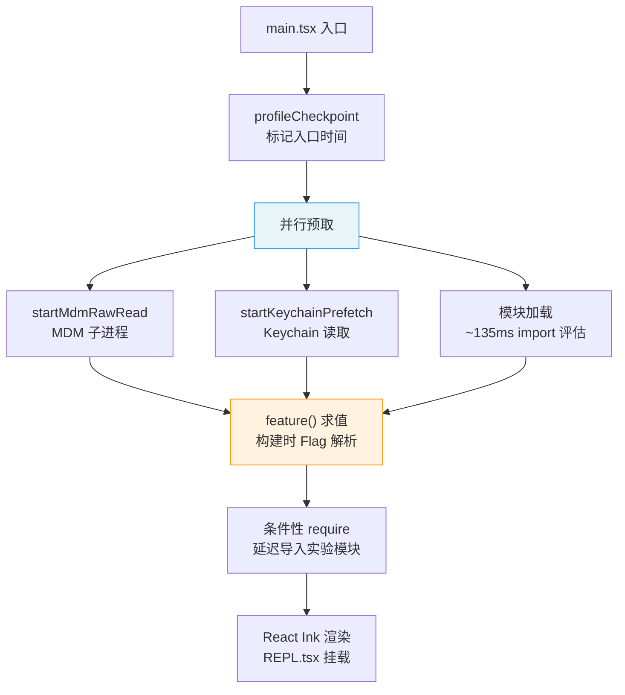
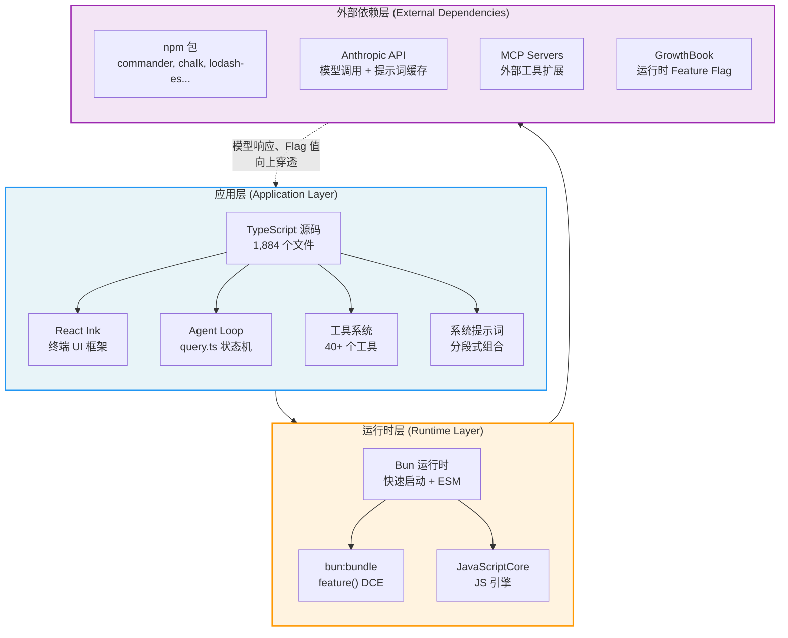

# 第1章：AI 编码 Agent 的完整技术栈

## 为什么这很重要

要理解一个 AI 编码 Agent 如何从"接收用户输入"走到"在你的代码库中执行操作"，首先必须理解它的技术栈（technology stack）。技术栈不仅决定了性能天花板，更决定了架构边界——哪些事情可以在编译时完成，哪些必须推迟到运行时，哪些需要模型自己去决策。

Claude Code 的技术栈选择揭示了一个核心理念：**AI 编码 Agent 不是传统的 CLI 工具，它是一个"在分发状态下运行"（on distribution）的系统——模型不仅使用工具，还能编写自己的工具**。这意味着整个技术栈必须为"模型作为一等公民"而设计，从入口点的启动优化到 Feature Flag 的构建时消除，每一层都在为这个目标服务。

本章将建立一个贯穿全书的核心概念——**三层架构**——并通过源码分析展示它如何在 Claude Code v2.1.88 中具体落地。如果你正在构建自己的 AI Agent，本章的架构模型和启动优化策略可以直接借鉴；如果你只是想理解 Claude Code 为什么这样工作，三层架构是全书最基础的参考框架。

---

## 源码分析

### 1.1 技术栈概览：TypeScript + React Ink + Bun

Claude Code 的技术选型可以用一句话概括：**用 TypeScript 获得类型安全，用 React Ink 获得终端 UI 的组件化能力，用 Bun 获得启动速度和构建时优化**。

#### TypeScript：应用层的语言

整个代码库由 1,884 个 TypeScript 源文件组成。TypeScript 的类型系统在 AI Agent 开发中有一个独特优势：工具的输入/输出 Schema 可以直接从类型定义生成，而这些 Schema 又直接成为发送给模型的 JSON Schema——类型定义、运行时验证和模型指令三者合一。

#### React Ink：终端 UI 框架

Claude Code 的交互界面不是传统的 readline REPL，而是一个完整的 React 应用。React Ink 将 React 的组件模型带入终端，使得复杂的 UI 状态管理（流式输出、多工具并行显示、权限对话框）可以用声明式的方式表达。主要的 UI 组件位于 `restored-src/src/screens/REPL.tsx`，它本身就是一个超过 5,000 行的 React 组件。

#### Bun：运行时与构建工具

Bun 在这里承担双重角色：

1. **运行时**：比 Node.js 更快的启动速度，对 CLI 工具至关重要——用户期望输入 `claude` 后立即看到响应
2. **构建工具**：通过 `bun:bundle` 提供的 `feature()` 函数实现编译时死代码消除（Dead Code Elimination, DCE），这是整个 Feature Flag 系统的基石

---

### 1.2 入口点分析：`main.tsx` 的启动编排

`main.tsx` 是整个应用的入口点，它的前 20 行代码就展示了一种经过深思熟虑的启动优化策略。

#### 并行预取（Parallel Prefetch）

```typescript
// restored-src/src/main.tsx:9-20（省略 ESLint 注释和空行）
import { profileCheckpoint, profileReport } from './utils/startupProfiler.js';
profileCheckpoint('main_tsx_entry');

import { startMdmRawRead } from './utils/settings/mdm/rawRead.js';
startMdmRawRead();

import { ensureKeychainPrefetchCompleted, startKeychainPrefetch }
  from './utils/secureStorage/keychainPrefetch.js';
startKeychainPrefetch();
```

注意这里的代码组织方式：每个 `import` 后面紧跟一个立即执行的副作用调用（side-effect call）。源码注释（`restored-src/src/main.tsx:1-8`）明确解释了设计意图：

1. **`profileCheckpoint`**：在任何重量级模块求值开始前标记入口时间点
2. **`startMdmRawRead`**：启动 MDM（Mobile Device Management）子进程（macOS 上的 `plutil` / Windows 上的 `reg query`），使其与后续约 135ms 的 import 评估并行执行
3. **`startKeychainPrefetch`**：并行启动两个 macOS Keychain 读取操作（OAuth 令牌和旧版 API 密钥）——如果不做预取，`isRemoteManagedSettingsEligible()` 会通过同步 spawn 顺序读取，每次启动多花约 65ms

这三个操作遵循同一个模式：**将 I/O 密集型操作提前到模块加载的"死时间"中并行执行**。这不是偶然的优化——ESLint 注释 `// eslint-disable-next-line custom-rules/no-top-level-side-effects` 表明团队有一条自定义规则禁止顶层副作用，这里是经过审慎考虑后的豁免。

**失败模式**：这些预取操作都是"尽力而为"的——如果 Keychain 访问被拒绝（用户未授权），`ensureKeychainPrefetchCompleted()` 返回空值，应用回退到交互式凭证提示。如果 MDM 子进程超时，后续的 `plutil` 调用会以同步方式重新尝试。这种"乐观并行 + 悲观回退"的设计确保了预取失败不会阻塞启动。

#### 延迟导入（Lazy Import）

在并行预取之后，`main.tsx` 展示了第二种启动优化策略——条件性延迟导入：

```typescript
// restored-src/src/main.tsx:70-80（省略中间的辅助函数和 ESLint 注释）
const getTeammateUtils = () =>
  require('./utils/teammate.js') as typeof import('./utils/teammate.js');
// ...

const coordinatorModeModule = feature('COORDINATOR_MODE')
  ? require('./coordinator/coordinatorMode.js') as ...
  : null;

const assistantModule = feature('KAIROS')
  ? require('./assistant/index.js') as ...
  : null;
```

这里有两种不同的延迟加载策略：

- **函数包装的 `require`**（如 `getTeammateUtils`）：用于打破循环依赖（`teammate.ts -> AppState.tsx -> ... -> main.tsx`），每次调用时才解析模块
- **Feature Flag 守卫的 `require`**（如 `coordinatorModeModule`）：利用 Bun 的 `feature()` 实现构建时消除——当 `COORDINATOR_MODE` 为 `false` 时，整个 `require` 表达式及其导入的模块树都会在构建产物中被移除

#### 启动流程总览



**图 1-1：main.tsx 启动流程**

#### Feature Flag 作为门控

从第 21 行开始，`feature('...')` 函数的身影贯穿整个入口文件：

```typescript
// restored-src/src/main.tsx:21
import { feature } from 'bun:bundle';
```

这个来自 `bun:bundle` 的 `feature()` 函数是理解整个 Feature Flag 系统的关键。它不是运行时的条件判断——它是一个**编译时常量**。当 Bun 打包器处理 `feature('X')` 时，会根据构建配置将其替换为 `true` 或 `false` 字面量，然后 JavaScript 引擎的死代码消除会移除不可达的分支。

> **注意**：`bun:bundle` 的 `feature()` 并非 Bun 公开文档化的 API，而是 Anthropic 构建流水线中的定制条件编译机制。这意味着 Claude Code 的构建与 Bun 的特定版本有紧密耦合。

---

### 1.3 三层架构

Claude Code 的架构可以分为三层，每一层有明确的职责边界。这个架构模型将在后续章节中反复引用——第3章的 Agent Loop 运行在应用层，第4章的工具执行编排跨越应用层和运行时层，第13-15章的缓存优化则涉及所有三层的协作。



**图 1-2：Claude Code 三层架构**

#### 应用层（TypeScript）

应用层是所有业务逻辑所在的地方。它包含：

- **Agent Loop**（`query.ts`）：核心状态机，编排"模型调用 → 工具执行 → 继续判定"的循环（详见第3章）
- **工具系统**（`tools.ts` + `tools/` 目录）：40+ 个工具的注册、权限检查和执行（详见第2章）
- **系统提示词**（`constants/prompts.ts`）：分段式组合的提示词架构（详见第5章）
- **React Ink UI**（`screens/REPL.tsx`）：终端界面的声明式渲染

#### 运行时层（Bun/JSC）

运行时层提供三个关键能力：

1. **快速启动**：Bun 的启动速度对 CLI 工具体验至关重要
2. **构建时优化**：`bun:bundle` 的 `feature()` 函数实现编译时 Feature Flag 消除
3. **JavaScript 引擎**：Bun 底层使用 JavaScriptCore（JSC，Safari 的 JS 引擎）而非 V8

#### 外部依赖层

外部依赖层包括：

- **npm 包**：`commander`（CLI 参数解析）、`chalk`（终端着色）、`lodash-es`（实用函数）等
- **Anthropic API**：模型调用和提示词缓存（Prompt Cache）的服务端
- **MCP（Model Context Protocol）Servers**：外部工具扩展能力
- **GrowthBook**：运行时 A/B 测试和 Feature Flag 服务

#### 层间边界的意义

三层架构的关键在于**层间的信息流方向**：

- 应用层 → 运行时层：TypeScript 代码编译为 JavaScript，`feature()` 调用在此时被解析
- 运行时层 → 外部依赖层：HTTP 请求、npm 包加载、MCP 连接
- 外部依赖层 → 应用层：模型响应、工具结果、Feature Flag 值——这些信息**向上穿透**两层回到应用层

理解这个穿透路径很重要：当 GrowthBook 返回一个 `tengu_*` Feature Flag 的新值时，它影响的不是构建时的 `feature()` 函数（那些在构建时已经固化），而是运行时的条件逻辑。Claude Code 中存在**两套并行的 Feature Flag 机制**：构建时的 `feature()` 和运行时的 GrowthBook，它们服务于不同的目的（后面详述）。

---

### 1.4 为什么 "On Distribution" 很重要

"On distribution" 是理解 Claude Code 架构决策的一个关键概念，也是本书的核心论点之一。传统的 CLI 工具在**开发时**定义好所有功能，然后分发给用户。但 AI 编码 Agent 不同——它在**被用户使用时**，其行为由模型动态决定。

具体来说：

1. **模型选择工具**：Agent Loop 的每次迭代中，模型决定调用哪个工具、传入什么参数。工具的 `description` 和 `inputSchema` 不仅是文档——它们是发送给模型的指令
2. **模型编写自己的工具**：通过 `BashTool`，模型可以执行任意 shell 命令；通过 `FileWriteTool`，模型可以创建新文件；通过 `SkillTool`，模型可以加载和执行用户定义的提示词模板
3. **模型作用于自己的上下文**：通过压缩（Compaction）、微压缩（Microcompact）和上下文折叠（Context Collapse），模型参与管理自己的上下文窗口

这意味着技术栈必须考虑一个传统软件不需要考虑的维度：**模型作为运行时的一部分，它的行为不完全由代码控制，而是由提示词、工具描述和上下文共同塑造**。

#### 对架构的深层影响

"On distribution" 不仅是一个抽象概念——它直接塑造了 Claude Code 的多个核心架构决策：

**测试和验证的根本困难**。传统软件可以通过单元测试和集成测试覆盖所有代码路径。但当模型参与决策时，同一个输入可能产生不同的工具调用序列。Claude Code 的应对方式不是尝试覆盖所有可能的模型行为，而是：(a) 通过失败关闭默认值（详见第2章）确保任何工具调用都是安全的，(b) 通过权限系统（详见第16章）在危险操作前设置人工检查点，(c) 通过 A/B 测试（详见第7章）在真实使用中验证行为变更。

**工具描述即 API 契约**。在传统软件中，API 文档是给人类开发者看的；在 AI Agent 中，工具描述是给模型看的指令。这意味着工具的 `description` 字段不能只描述"这个工具做什么"，还必须引导"模型应该在什么情况下使用这个工具"。第8章将深入分析工具提示词如何充当"微型驾驭器"。

**Feature Flag 控制模型的认知边界**。当 `feature('WEB_BROWSER_TOOL')` 为 `false` 时，模型不仅不能使用浏览器工具——它根本不知道浏览器工具的存在，因为工具 Schema 中不包含它：

```typescript
// restored-src/src/tools.ts:117-119
const WebBrowserTool = feature('WEB_BROWSER_TOOL')
  ? require('./tools/WebBrowserTool/WebBrowserTool.js').WebBrowserTool
  : null;
```

这是"on distribution"最直接的体现：构建时的决策直接影响模型运行时的能力边界。

#### 与传统软件的对比

| 维度 | 传统 CLI 工具 | AI 编码 Agent |
|------|-------------|-------------|
| 行为确定性 | 确定——相同输入产生相同输出 | 非确定——模型可能选择不同的工具序列 |
| 能力边界 | 编译时固定 | 构建时（`feature()`）+ 运行时（模型决策）双重决定 |
| API 文档受众 | 人类开发者 | 模型——文档是指令，不是参考 |
| 测试策略 | 覆盖代码路径 | 覆盖安全边界（权限 + 失败关闭） |
| 版本控制 | 代码版本 = 行为版本 | 代码版本 × 模型版本 × 提示词版本 |

---

### 1.5 构建时死代码消除：`feature()` 的工作原理

`feature()` 函数来自 Bun 的打包器模块 `bun:bundle`，它在 Claude Code 中被大量使用来实现构建时的条件编译。

#### 机制

当 Bun 的打包器遇到 `feature('X')` 调用时：

1. 查找构建配置中 `X` 的值
2. 将 `feature('X')` 替换为字面量 `true` 或 `false`
3. JavaScript 引擎的优化器识别出不可达分支并将其移除

这意味着以下代码：

```typescript
const SleepTool = feature('PROACTIVE') || feature('KAIROS')
  ? require('./tools/SleepTool/SleepTool.js').SleepTool
  : null;
```

在 `PROACTIVE=false, KAIROS=false` 的构建中会变成：

```typescript
const SleepTool = false || false
  ? require('./tools/SleepTool/SleepTool.js').SleepTool
  : null;
```

进而被优化为 `const SleepTool = null;`，而 `SleepTool.js` 及其整个依赖树都不会出现在最终的 bundle 中。

#### 使用模式

在 `tools.ts` 中，`feature()` 的使用呈现四种模式：单 Flag 守卫、多 Flag OR 组合、多 Flag AND 组合、数组展开。这些模式在 `commands.ts` 中同样出现（`restored-src/src/commands.ts:59-100`），用于控制 slash 命令的可用性。工具注册管线的完整分析详见第2章。

#### 与运行时 Flag 的区别

Claude Code 中存在两套 Feature Flag 机制，容易混淆：

| 维度 | 构建时 `feature()` | 运行时 GrowthBook `tengu_*` |
|------|--------------------|-----------------------------|
| 解析时机 | Bun 打包时 | 会话启动时从 GrowthBook 拉取 |
| 影响范围 | 代码是否存在于 bundle | 代码逻辑的运行时分支 |
| 修改方式 | 需要重新构建和发布 | 服务端配置即时生效 |
| 典型用途 | 实验性功能的完整模块树消除 | A/B 测试、渐进灰度 |
| 示例 | `feature('KAIROS')` | `tengu_ultrathink_enabled` |

两者互补：`feature()` 用于"这个功能是否存在"，GrowthBook 用于"这个功能对哪些用户开放"。一个功能通常先由 `feature()` 守卫其模块加载，再由 GrowthBook 控制其运行时行为。

---

### 1.6 工具注册管线：Feature Flag 的实战应用

`tools.ts` 的 `getAllBaseTools()` 函数（`restored-src/src/tools.ts:193-251`）是 Feature Flag 系统最集中的展示。它展示了四种不同的工具注册策略：

#### 策略一：无条件注册

```typescript
// restored-src/src/tools.ts:195-209（仅列出部分核心工具）
AgentTool,
TaskOutputTool,
BashTool,
// ... GlobTool/GrepTool (条件性，见策略四)
FileReadTool,
FileEditTool,
FileWriteTool,
NotebookEditTool,
WebFetchTool,
WebSearchTool,
// ...
```

这些是核心工具（共十余个），始终可用，无需任何条件。

#### 策略二：构建时 Feature Flag 守卫

```typescript
// restored-src/src/tools.ts:217
...(WebBrowserTool ? [WebBrowserTool] : []),
```

`WebBrowserTool` 在文件顶部通过 `feature('WEB_BROWSER_TOOL')` 守卫——如果 Flag 为 false，变量为 `null`，此处展开为空数组。**整个工具的代码在构建产物中不存在**。

#### 策略三：运行时环境变量守卫

```typescript
// restored-src/src/tools.ts:214-215
...(process.env.USER_TYPE === 'ant' ? [ConfigTool] : []),
...(process.env.USER_TYPE === 'ant' ? [TungstenTool] : []),
```

`ConfigTool` 和 `TungstenTool` 通过运行时环境变量 `USER_TYPE` 控制——它们的代码存在于构建产物中，但只对 Anthropic 内部用户（`ant`）可见。这是 A/B 测试的"暂存区"模式：在内部验证后再向外部用户开放。

#### 策略四：运行时函数守卫

```typescript
// restored-src/src/tools.ts:201
...(hasEmbeddedSearchTools() ? [] : [GlobTool, GrepTool]),
```

这是一个反向守卫：当 Bun 的单文件可执行中内嵌了搜索工具（`bfs`/`ugrep`）时，独立的 `GlobTool` 和 `GrepTool` 反而被移除——因为模型可以通过 `BashTool` 访问这些内嵌工具。这个策略确保了不同构建版本中模型的搜索能力等价，只是底层实现不同。

---

### 1.7 89 个 Feature Flag 全景

通过对源码中所有 `feature('...')` 调用的提取，我们得到 89 个构建时 Feature Flag。完整的 Flag 列表和分类见附录 D。这里关注的是这些 Flag 揭示的产品方向：

**KAIROS 家族**（6 个 Flag，合计 84+ 处引用）：这是最大的 Flag 集群，指向一个完整的"助手模式"产品——后台自主运行（`KAIROS`）、记忆整理（`KAIROS_DREAM`）、推送通知（`KAIROS_PUSH_NOTIFICATION`）、GitHub Webhook 集成（`KAIROS_GITHUB_WEBHOOKS`）。这不是一个 CLI 工具的增强，而是一个完全不同的产品形态。

**多 Agent 编排**（`COORDINATOR_MODE` + `TEAMMEM` + `UDS_INBOX`，合计 90+ 处引用）：多 Agent 协作的基础设施——Worker 分配、队友记忆共享、Unix Domain Socket 进程间通信（详见第20章）。

**远程与分布式**（`BRIDGE_MODE` + `DAEMON` + `CCR_*`）：远程控制和分布式执行——将 Claude Code 从本地 CLI 扩展为可远程操控的 Agent 平台。

**上下文优化**（`CONTEXT_COLLAPSE` + `CACHED_MICROCOMPACT` + `REACTIVE_COMPACT`）：三种不同粒度的上下文管理策略，反映了团队在 200K token 窗口中的持续探索（详见第三篇）。

**分类器体系**（`TRANSCRIPT_CLASSIFIER` 69 处 + `BASH_CLASSIFIER` 33 处）：两大分类器是自动模式的核心——前者决定权限，后者分析命令安全性（详见第17章）。

89 个 Flag 的数量本身就说明了一个事实：Claude Code 不是一个稳定的成品，而是一个快速迭代的实验平台。每个 Flag 都是一个正在探索的方向，它们的存在是"on distribution"理念的直接体现——团队在持续地实验模型能做什么、应该做什么。

---

## 模式提炼

### 模式一：启动时并行预取

- **解决的问题**：CLI 工具启动时间直接影响用户体验，I/O 操作（Keychain 读取、MDM 查询）阻塞启动
- **核心做法**：将 I/O 密集型操作提前到模块加载的"死时间"中并行执行，通过 `ensureXxxCompleted()` 在需要结果时等待
- **前置条件**：I/O 操作必须是幂等的、失败安全的，且有明确的超时和回退路径
- **源码引用**：`restored-src/src/main.tsx:9-20`

### 模式二：双层 Feature Flag

- **解决的问题**：实验性功能需要在不同粒度上控制——"功能是否存在于代码中"和"功能对哪些用户开放"是两个独立的维度
- **核心做法**：构建时 `feature()` 消除整个模块树，运行时 GrowthBook 控制行为参数。前者决定模型能"看到"哪些工具，后者决定模型的行为配置
- **前置条件**：构建工具支持编译时常量替换和 DCE；有运行时 Flag 服务（如 GrowthBook、LaunchDarkly）
- **源码引用**：`restored-src/src/main.tsx:21`（feature 导入）、`restored-src/src/tools.ts:117-119`（工具门控）

### 模式三：模型感知的 API 设计

- **解决的问题**：AI Agent 的架构不仅为人类开发者设计，还必须为模型设计——工具描述是模型的指令，不仅是文档
- **核心做法**：工具的 `description` 和 `inputSchema` 同时服务于三个目的：人类文档、运行时验证、模型指令。类型定义 → Schema → 模型指令三者合一
- **前置条件**：使用支持 Schema 生成的类型系统（如 TypeScript + Zod）
- **源码引用**：`restored-src/src/Tool.ts`（工具接口定义，详见第2章）

### 模式四：失败关闭默认值

- **解决的问题**：新增工具可能引入安全或并发风险，默认值决定了"忘记配置"时的行为
- **核心做法**：所有工具属性默认为最安全值（`isConcurrencySafe: false`、`isReadOnly: false`），必须显式声明才能解锁
- **前置条件**：有明确的"安全"和"不安全"定义，且默认值在一个中心位置管理
- **源码引用**：`restored-src/src/Tool.ts:748-761`（`TOOL_DEFAULTS`，详见第2章和第24章）

---

## 用户能做什么

如果你正在构建自己的 AI Agent 系统，以下是从本章分析中可以直接应用的建议：

1. **优化启动时间**。识别你的 Agent 启动路径中的 I/O 阻塞点（凭证读取、配置加载、模型预热），将它们并行化。用户感知到的"第一次响应时间"直接影响对工具质量的判断
2. **区分构建时和运行时 Flag**。如果你有实验性功能，考虑用构建时消除来控制"功能是否存在"（影响模型能看到哪些工具），用运行时 Flag 控制"功能对谁开放"（A/B 测试、灰度发布）
3. **设计模型友好的工具描述**。你的工具描述不仅是给人看的——它是模型选择工具的依据。测试不同的描述措辞，观察模型的工具选择行为是否改变
4. **审计你的默认值**。检查工具系统中每个配置项的默认值——如果一个新工具的开发者忘记设置某个属性，系统的行为应该是最安全的，而非最宽松的
5. **理解三层架构作为诊断框架**。当 Agent 行为异常时，用三层模型定位问题：是应用层逻辑（提示词/工具描述）？运行时层配置（Feature Flag 状态）？还是外部依赖层响应（API 返回/MCP 服务器状态）？

在下一章中，我们将深入工具系统——模型的"双手"——看看 40+ 个工具如何通过统一的接口契约、权限模型和 Feature Flag 守卫组成一个可扩展的能力体系。
