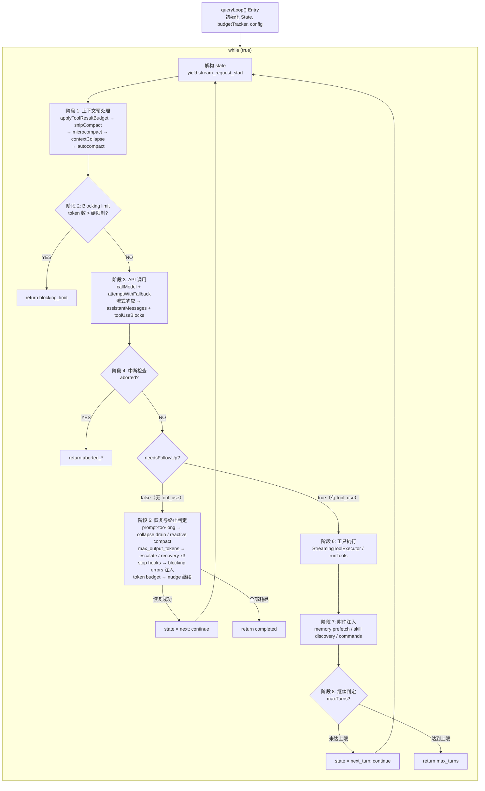

# 第3章：Agent Loop — 从用户输入到模型响应的完整生命周期

> *"A loop is not a loop when every iteration reshapes the world it runs in."*

本章是全书的锚点。从第5章的 API 调用构建到第9章的自动压缩策略，从第13章的流式响应处理到第16章的权限检查体系——几乎所有后续章节讨论的子系统，最终都在 `queryLoop()` 这个核心循环中被编排、协调、驱动。理解这个循环，就是理解 Claude Code 作为 AI Agent 的运转心脏。

## 3.1 为什么 Agent Loop 不是简单的 REPL

传统的 REPL（Read-Eval-Print Loop）是一个无状态的三步循环：读取输入、求值、打印结果。每次迭代之间没有上下文传递，没有自动恢复，没有对自身状态的感知。

Agent Loop 根本不同。看这张对比表：

| 维度 | 传统 REPL | Claude Code Agent Loop |
|------|----------|----------------------|
| 状态模型 | 无状态或仅保留历史 | 10 个可变字段的 `State` 类型，跨迭代传递 |
| 循环退出 | 用户显式退出 | 7 种 `Continue` 转换 + 10 种 `Terminal` 终止原因 |
| 错误处理 | 打印错误并继续 | 自动降级、模型切换、reactive compact、重试上限 |
| 上下文管理 | 无 | snip → microcompact → context collapse → autocompact 四级管线 |
| 工具执行 | 无 | 流式并行执行、权限检查、结果预算裁剪 |
| 对话容量 | 无限增长直到 OOM | token 预算追踪、自动压缩、blocking limit 硬限制 |

Agent Loop 的每一次迭代都可能改变自身的运行条件：压缩会缩减消息数组，模型降级会切换推理后端，stop hook 会注入新的约束消息。这不是循环——这是一个**自修改状态机**（self-modifying state machine）。

## 3.2 queryLoop 状态机总览

### 3.2.1 入口：`query()` 与 `queryLoop()`

入口函数 `query()` 是一个薄包装器。它调用 `queryLoop()` 获得结果，然后通知所有已消费的命令完成生命周期：

```
restored-src/src/query.ts:219-238
```

```typescript
export async function* query(params: QueryParams): AsyncGenerator<...> {
  const consumedCommandUuids: string[] = []
  const terminal = yield* queryLoop(params, consumedCommandUuids)
  for (const uuid of consumedCommandUuids) {
    notifyCommandLifecycle(uuid, 'completed')
  }
  return terminal
}
```

真正的状态机在 `queryLoop()` 中（`restored-src/src/query.ts:241`）。它是一个 `while (true)` 循环，每次迭代通过 `state = next; continue` 进入下一轮，或通过 `return { reason: '...' }` 终止。

### 3.2.2 State 类型：跨迭代的可变状态

`State` 类型定义了循环在迭代之间需要携带的所有可变状态（`restored-src/src/query.ts:204-217`）：

| 字段 | 类型 | 语义 |
|------|------|------|
| `messages` | `Message[]` | 当前对话消息数组，每轮迭代后追加 assistant 响应和 tool results |
| `toolUseContext` | `ToolUseContext` | 工具执行上下文，包含可用工具列表、权限模式、abort 信号等 |
| `autoCompactTracking` | `AutoCompactTrackingState \| undefined` | 自动压缩的追踪状态，记录是否已触发过压缩及连续失败次数 |
| `maxOutputTokensRecoveryCount` | `number` | 当前已尝试的 max_output_tokens 恢复次数，上限为 3 |
| `hasAttemptedReactiveCompact` | `boolean` | 是否已尝试过 reactive compact，防止重试死循环 |
| `maxOutputTokensOverride` | `number \| undefined` | 覆盖默认 max_output_tokens 的值，用于升级重试（如 8k → 64k） |
| `pendingToolUseSummary` | `Promise<...> \| undefined` | 上一轮工具执行的摘要生成 Promise，在下一轮模型流式传输期间并行等待 |
| `stopHookActive` | `boolean \| undefined` | 标记 stop hook 是否处于活跃状态，避免重复触发 |
| `turnCount` | `number` | 当前轮次计数，用于 `maxTurns` 限制检查 |
| `transition` | `Continue \| undefined` | 上一次迭代为何继续——让测试和调试能够断言恢复路径确实触发了 |

注意设计上的一个关键决策：源码注释明确说明"Continue sites write `state = { ... }` instead of 9 separate assignments"（`restored-src/src/query.ts:267`）。这意味着每个继续点都必须显式构造完整的 `State` 对象。这种写法消除了"忘记重置某个字段"的 bug 类——在一个有 7 个继续点的循环中，这不是理论风险，而是必然会发生的事故。

### 3.2.3 Continue 转换类型

循环内部有 7 个 `continue` 站点，每个都记录了转换原因。从源码中提取的完整枚举：

| `Continue.reason` | 触发条件 | 典型行为 |
|-------------------|---------|---------|
| `next_turn` | 模型返回了 `tool_use` block | 追加 assistant + tool_result，递增 turnCount，开始下一轮 |
| `max_output_tokens_escalate` | 模型输出被截断，且尚未升级过 | 将 maxOutputTokensOverride 设为 64k，原样重试同一请求 |
| `max_output_tokens_recovery` | 输出截断且升级已用完，恢复次数 < 3 | 注入 meta 消息要求模型继续，递增恢复计数 |
| `reactive_compact_retry` | prompt-too-long 或 media-size 错误 | 触发 reactive compact 压缩后重试 |
| `collapse_drain_retry` | prompt-too-long 且有待提交的 context collapse | 执行所有暂存的 collapse，然后重试 |
| `stop_hook_blocking` | stop hook 返回了阻塞错误 | 将阻塞错误注入消息流，让模型修正 |
| `token_budget_continuation` | token budget 尚未耗尽 | 注入 nudge 消息鼓励模型继续工作 |

### 3.2.4 Terminal 终止原因

循环通过 `return` 终止，返回值包含 `reason` 字段。从源码提取的完整枚举：

| `Terminal.reason` | 语义 |
|-------------------|------|
| `completed` | 模型正常完成（无 tool_use），或 API 错误但恢复已耗尽 |
| `blocking_limit` | token 数触达硬限制，无法继续 |
| `prompt_too_long` | prompt-too-long 错误且所有恢复手段（collapse drain + reactive compact）均失败 |
| `image_error` | 图片尺寸/格式错误 |
| `model_error` | 模型调用抛出非预期异常 |
| `aborted_streaming` | 用户在流式响应期间中断 |
| `aborted_tools` | 用户在工具执行期间中断 |
| `stop_hook_prevented` | stop hook 阻止了继续 |
| `hook_stopped` | 工具执行时 hook 阻止了后续操作 |
| `max_turns` | 达到最大轮次限制 |

> **交互式版本**：[点击查看 Agent Loop 动画可视化](agent-loop-viz.html) — 观看一次完整的"帮我修 bug"对话如何在状态机中流转，每个阶段可点击查看源码引用和详细解释。

下面的流程图展示了状态机的完整拓扑：



以下是原始 ASCII 版本，供需要纯文本阅读环境的读者参考：

<details>
<summary>ASCII 流程图（点击展开）</summary>

```
┌──────────────────────────────────────────────────────────────────────┐
│                        queryLoop() Entry                            │
│  初始化 State, budgetTracker, config, pendingMemoryPrefetch         │
└──────────────┬───────────────────────────────────────────────────────┘
               │
               ▼
┌──────────────────────────────────────────────────┐
│              while (true) {                      │
│  解构 state → messages, toolUseContext, ...       │
│  yield { type: 'stream_request_start' }          │
├──────────────────────────────────────────────────┤
│                                                  │
│  ┌─────────────────────────────────────────┐     │
│  │ 阶段 1: 上下文预处理                      │     │
│  │ applyToolResultBudget                    │     │
│  │ → snipCompact (HISTORY_SNIP)             │     │
│  │ → microcompact                           │     │
│  │ → contextCollapse (CONTEXT_COLLAPSE)     │     │
│  │ → autocompact ───── 详见第9章 ──────────  │     │
│  └──────────────┬──────────────────────────┘     │
│                 │                                 │
│                 ▼                                 │
│  ┌─────────────────────────────────────────┐     │
│  │ 阶段 2: Blocking limit 检查              │     │
│  │ token 数 > 硬限制 ?                      │     │
│  │   YES → return {reason:'blocking_limit'} │     │
│  └──────────────┬──────────────────────────┘     │
│                 │ NO                              │
│                 ▼                                 │
│  ┌─────────────────────────────────────────┐     │
│  │ 阶段 3: API 调用 ── 详见第5章和第13章 ──  │     │
│  │ attemptWithFallback 循环                  │     │
│  │ callModel({                              │     │
│  │   messages: prependUserContext(...)       │     │
│  │   systemPrompt: appendSystemContext(...) │     │
│  │ })                                       │     │
│  │                                          │     │
│  │ 流式响应 → assistantMessages[]           │     │
│  │         → toolUseBlocks[]                │     │
│  │ FallbackTriggeredError → 切换模型重试     │     │
│  └──────────────┬──────────────────────────┘     │
│                 │                                 │
│                 ▼                                 │
│  ┌─────────────────────────────────────────┐     │
│  │ 阶段 4: 中断检查                         │     │
│  │ abortController.signal.aborted ?        │     │
│  │   YES → return {reason:'aborted_*'}     │     │
│  └──────────────┬──────────────────────────┘     │
│                 │ NO                              │
│                 ▼                                 │
│  ┌─────────────────────────────────────────┐     │
│  │ 阶段 5: needsFollowUp == false 分支      │     │
│  │ (模型未返回 tool_use)                    │     │
│  │                                          │     │
│  │ ┌─ prompt-too-long 恢复 ──────────────┐ │     │
│  │ │ collapse drain → reactive compact   │ │     │
│  │ │ 成功 → state=next; continue         │ │     │
│  │ └────────────────────────────────────-┘ │     │
│  │ ┌─ max_output_tokens 恢复 ────────────┐ │     │
│  │ │ escalate(8k→64k) → recovery(×3)    │ │     │
│  │ │ 成功 → state=next; continue         │ │     │
│  │ └────────────────────────────────────-┘ │     │
│  │ ┌─ stop hooks ── 详见第16章 ──────────┐ │     │
│  │ │ blockingErrors → state=next;continue│ │     │
│  │ └────────────────────────────────────-┘ │     │
│  │ ┌─ token budget check ────────────────┐ │     │
│  │ │ budget未尽 → state=next; continue   │ │     │
│  │ └────────────────────────────────────-┘ │     │
│  │                                          │     │
│  │ return { reason: 'completed' }           │     │
│  └──────────────────────────────────────-──┘     │
│                 │                                 │
│           needsFollowUp == true                  │
│                 │                                 │
│                 ▼                                 │
│  ┌─────────────────────────────────────────┐     │
│  │ 阶段 6: 工具执行                         │     │
│  │ streamingToolExecutor.getRemainingResults│     │
│  │ 或 runTools() ── 详见第4章(工具执行编排) ─ │     │
│  │ → toolResults[]                         │     │
│  └──────────────┬──────────────────────────┘     │
│                 │                                 │
│                 ▼                                 │
│  ┌─────────────────────────────────────────┐     │
│  │ 阶段 7: 附件注入                         │     │
│  │ getAttachmentMessages()                 │     │
│  │ pendingMemoryPrefetch consume           │     │
│  │ skillDiscoveryPrefetch consume          │     │
│  │ queuedCommands drain                    │     │
│  └──────────────┬──────────────────────────┘     │
│                 │                                 │
│                 ▼                                 │
│  ┌─────────────────────────────────────────┐     │
│  │ 阶段 8: 继续判定                         │     │
│  │ maxTurns check                          │     │
│  │ state = { reason: 'next_turn', ... }    │     │
│  │ continue                                │     │
│  └─────────────────────────────────────────┘     │
│                                                  │
└──────────────────────────────────────────────────┘
```

</details>

## 3.3 单次迭代的完整流程

让我们跟踪一次迭代的每个阶段，从头到尾。

### 3.3.1 上下文预处理管线

每次迭代开始时，原始 `messages` 数组要经过四到五级处理才能送往 API。这些阶段按严格顺序执行，且顺序不可互换。

**第一级：工具结果预算裁剪（Tool Result Budget）**

```
restored-src/src/query.ts:379-394
```

`applyToolResultBudget()` 对聚合工具结果施加大小限制。它在所有压缩阶段之前运行，因为后续的 cached microcompact 仅通过 `tool_use_id` 操作，不检查内容——先裁剪内容不会干扰它。

**第二级：History Snip**

```
restored-src/src/query.ts:401-410
```

`snipCompactIfNeeded()` 是一种轻量级压缩：它截断（snip）历史中的旧消息，释放 token 空间。关键的是，它返回 `tokensFreed` 值——这个值会被传递给 autocompact，让后者的阈值判断能感知 snip 已经释放的空间。

**第三级：Microcompact**

```
restored-src/src/query.ts:414-426
```

Microcompact 是一种细粒度压缩，在 autocompact 之前运行。它还支持一种"缓存编辑"模式（`CACHED_MICROCOMPACT`），利用 API 的 cache 删除机制实现零额外 API 调用的压缩。

**第四级：Context Collapse**

```
restored-src/src/query.ts:440-447
```

Context Collapse（上下文折叠）是一种读时投影（read-time projection）机制。源码注释揭示了一个精妙的设计：

> *"Nothing is yielded — the collapsed view is a read-time projection over the REPL's full history. Summary messages live in the collapse store, not the REPL array."*（`restored-src/src/query.ts:434-436`）

这意味着折叠不改变原始消息数组，而是在每次迭代时重新投影。折叠结果通过 `state.messages` 在继续点传递，下一次 `projectView()` 因为归档消息已经不在输入中而成为空操作。

**第五级：Autocompact**（详见第9章）

```
restored-src/src/query.ts:454-468
```

自动压缩是最重量级的预处理步骤。它在 context collapse 之后运行——如果折叠已经把 token 数降到阈值以下，autocompact 就成为空操作，保留了更细粒度的上下文而不是生成单一摘要。

这五级管线的设计遵循一个原则：**从轻到重、从局部到全局**。每一级都试图在不丢失太多信息的前提下释放空间，只有前面的级别不够时，后面的级别才会启动。

### 3.3.2 上下文注入：prependUserContext 与 appendSystemContext

消息预处理完成后，上下文通过两个函数注入到 API 请求中：

**`appendSystemContext`**（`restored-src/src/utils/api.ts:437-447`）：

```typescript
export function appendSystemContext(
  systemPrompt: SystemPrompt,
  context: { [k: string]: string },
): string[] {
  return [
    ...systemPrompt,
    Object.entries(context)
      .map(([key, value]) => `${key}: ${value}`)
      .join('\n'),
  ].filter(Boolean)
}
```

系统上下文被追加到系统提示词（system prompt）的末尾。这些内容（如当前日期、工作目录等）享受系统提示词的特殊缓存位置——API 的 prompt caching 对系统提示词最为友好。

**`prependUserContext`**（`restored-src/src/utils/api.ts:449-474`）：

```typescript
export function prependUserContext(
  messages: Message[],
  context: { [k: string]: string },
): Message[] {
  // ...
  return [
    createUserMessage({
      content: `<system-reminder>\n...\n</system-reminder>\n`,
      isMeta: true,
    }),
    ...messages,
  ]
}
```

用户上下文被包裹在 `<system-reminder>` 标签中，作为**第一条用户消息前置**到消息数组。这个位置选择不是随意的——它确保上下文出现在所有对话之前，且标记为 `isMeta: true`（不显示在用户 UI 中）。附带一句重要的提示文本："this context may or may not be relevant to your tasks"——这给了模型忽略不相关上下文的自由度。

注意调用时序（`restored-src/src/query.ts:660`）：

```typescript
messages: prependUserContext(messagesForQuery, userContext),
systemPrompt: fullSystemPrompt,  // 已经 appendSystemContext 过
```

`prependUserContext` 在 API 调用时才执行，不在预处理管线中。这意味着用户上下文不参与 token 计数和压缩决策——它是"透明的"注入。

### 3.3.3 消息标准化管线

在 API 调用的构建阶段（`restored-src/src/services/api/claude.ts:1259-1314`），消息经过一条四步标准化管线。这条管线的职责是将 Claude Code 内部的丰富消息类型转换为 Anthropic API 能接受的严格格式。

**第一步：`normalizeMessagesForAPI()`**（`restored-src/src/utils/messages.ts:1989`）

这是最复杂的标准化步骤。它完成以下工作：

1. **附件重排序**：通过 `reorderAttachmentsForAPI()` 将附件消息上移，直到碰到 tool_result 或 assistant 消息
2. **虚拟消息过滤**：移除 `isVirtual` 标记的显示专用消息（如 REPL 内部工具调用）
3. **系统/进度消息剥离**：过滤 `progress` 类型和非 `local_command` 的 `system` 消息
4. **合成错误消息处理**：检测 PDF/图片/请求过大的错误，向后查找并从源用户消息中剥离对应的媒体块
5. **工具输入标准化**：通过 `normalizeToolInputForAPI` 处理工具输入格式
6. **消息合并**：相邻的同角色消息被合并（API 要求严格的 user/assistant 交替）

**第二步：`ensureToolResultPairing()`**（`restored-src/src/utils/messages.ts:5133`）

修复 `tool_use` / `tool_result` 的配对不匹配。这种不匹配在恢复远程会话（remote/teleport sessions）时特别常见。它为孤立的 `tool_use` 插入合成错误 `tool_result`，并剥离引用不存在 `tool_use` 的孤立 `tool_result`。

**第三步：`stripAdvisorBlocks()`**（`restored-src/src/utils/messages.ts:5466`）

剥离 advisor blocks。这些 block 需要特定的 beta header 才能被 API 接受（`restored-src/src/services/api/claude.ts:1304`）：

```typescript
if (!betas.includes(ADVISOR_BETA_HEADER)) {
  messagesForAPI = stripAdvisorBlocks(messagesForAPI)
}
```

**第四步：`stripExcessMediaItems()`**（`restored-src/src/services/api/claude.ts:956`）

API 限制每个请求最多 100 个媒体项（图片 + 文档）。这个函数静默地从最旧的消息开始移除多余的媒体项，而不是报错——这在 Cowork/CCD 等场景中很重要，因为硬报错难以恢复。

整条管线的执行顺序不是随意的。源码注释解释了为什么标准化要在 `ensureToolResultPairing` 之前（`restored-src/src/services/api/claude.ts:1272-1276`）：

> *"normalizeMessagesForAPI uses isToolSearchEnabledNoModelCheck() because it's called from ~20 places (analytics, feedback, sharing, etc.), many of which don't have model context."*

这揭示了一个架构事实：`normalizeMessagesForAPI` 是一个被广泛复用的函数，它的接口不能随意添加参数。模型特定的后处理（如 tool search 字段剥离）必须作为独立步骤在它之后运行。

### 3.3.4 API 调用阶段（详见第5章和第13章）

API 调用被包裹在一个 `attemptWithFallback` 循环中（`restored-src/src/query.ts:650-953`）：

```typescript
let attemptWithFallback = true
while (attemptWithFallback) {
  attemptWithFallback = false
  try {
    for await (const message of deps.callModel({
      messages: prependUserContext(messagesForQuery, userContext),
      systemPrompt: fullSystemPrompt,
      // ...
    })) {
      // 处理流式响应消息
    }
  } catch (innerError) {
    if (innerError instanceof FallbackTriggeredError && fallbackModel) {
      currentModel = fallbackModel
      attemptWithFallback = true
      // 清理孤立消息, 重置 executor
      continue
    }
    throw innerError
  }
}
```

这里有几个精妙的设计值得注意：

**消息不可变性**。流式消息在 yield 前被克隆：原始 `message` 推入 `assistantMessages` 数组（回传给 API），而克隆版本（带 backfilled observable input）被 yield 给 SDK 调用者。源码注释（`restored-src/src/query.ts:744-746`）直接说明了原因："mutating it would break prompt caching (byte mismatch)"。

**错误扣留（Withholding）机制**。可恢复的错误（prompt-too-long、max-output-tokens、media-size）在流式阶段被扣留——不立即 yield 给调用者。只有在后续的恢复逻辑确认无法恢复时，才会释放给调用者。这防止了 SDK 消费者（如 Desktop/Cowork）过早终止会话。

**Tombstone 处理**。当流式降级（streaming fallback）发生时，已经 yield 的部分消息会被作为 tombstone 通知删除（`restored-src/src/query.ts:716-718`）。这解决了一个微妙的问题：部分消息（尤其是 thinking blocks）携带的签名在降级后会导致 API 报 "thinking blocks cannot be modified" 错误。

### 3.3.5 工具执行阶段（详见第4章）

模型响应完成后，如果存在 `tool_use` blocks，循环进入工具执行阶段（`restored-src/src/query.ts:1363-1408`）。

Claude Code 支持两种工具执行模式：

1. **流式并行执行**（`StreamingToolExecutor`）：工具在模型流式响应过程中就开始执行。在 API 调用阶段，每个 `tool_use` block 到达时就被 `addTool()` 推入执行器（`restored-src/src/query.ts:841-843`）。流式结束后，`getRemainingResults()` 收集所有已完成和未完成的结果。
2. **批量执行**（`runTools()`）：所有 tool_use blocks 收集完毕后一次性执行。

工具执行的结果会经过 `normalizeMessagesForAPI` 标准化后追加到 `toolResults` 数组。

### 3.3.6 Stop Hooks 与继续判定

当模型响应不包含 tool_use（`needsFollowUp == false`）时，循环进入终止判定路径。这条路径包含多层恢复逻辑和 hook 检查。

**Stop Hooks**（`restored-src/src/query.ts:1267-1306`）：

```typescript
const stopHookResult = yield* handleStopHooks(
  messagesForQuery, assistantMessages,
  systemPrompt, userContext, systemContext,
  toolUseContext, querySource, stopHookActive,
)
```

如果 stop hook 返回 `blockingErrors`，循环注入这些错误消息并继续（`transition: { reason: 'stop_hook_blocking' }`），让模型有机会修正。这是 Claude Code 权限体系的关键执行点——详见第16章。

**Token Budget Check**（`restored-src/src/query.ts:1308-1355`）：

当 `TOKEN_BUDGET` 特性开启时，循环检查当前轮次的 token 消耗是否在预算内。如果模型"提前完成"但预算还有剩余，循环注入 nudge 消息（`transition: { reason: 'token_budget_continuation' }`）鼓励模型继续工作。这个机制还支持"递减回报"（diminishing returns）检测——如果模型的增量输出不再有实质贡献，即使预算未耗尽也会提前停止。

### 3.3.7 附件注入与轮次准备

工具执行完成后，循环在进入下一轮之前注入附件（`restored-src/src/query.ts:1580-1628`）：

1. **队列命令处理**：从全局命令队列中拉取当前 agent 地址的命令（区分主线程和子 agent），转换为附件消息
2. **Memory prefetch 消费**：如果内存预取（在循环入口启动的 `startRelevantMemoryPrefetch`）已完成且本轮尚未消费，将结果注入
3. **Skill discovery 消费**：如果技能发现预取已完成，将结果注入

这些注入利用了模型流式响应和工具执行的延迟——它们在后台并行运行，到这里时通常已经完成。

## 3.4 中止/重试/降级

### 3.4.1 FallbackTriggeredError 与模型切换

当 API 调用因高负载等原因失败时，`FallbackTriggeredError` 被抛出（`restored-src/src/query.ts:894-950`）。处理流程：

1. 切换 `currentModel` 为 `fallbackModel`
2. 清空 `assistantMessages`、`toolResults`、`toolUseBlocks`
3. 丢弃并重建 `StreamingToolExecutor`（防止孤立 tool_result 泄漏）
4. 更新 `toolUseContext.options.mainLoopModel`
5. 剥离 thinking signature blocks（因为它们是模型绑定的，在降级模型上会 400）
6. yield 系统消息通知用户

关键的是，这个降级发生在 `attemptWithFallback` 循环内部。它设置 `attemptWithFallback = true` 并 `continue`，在同一轮迭代中立即重试——不需要重新进入外部的 `while (true)` 循环。

### 3.4.2 max_output_tokens 恢复：三次机会

当模型输出被截断时，恢复策略分两层：

**第一层：Escalation（升级）**。如果当前使用的是默认的 8k 上限且尚未覆盖过，直接将 `maxOutputTokensOverride` 设为 64k（`ESCALATED_MAX_TOKENS`），原样重试同一请求。这是"免费"的恢复——不需要多轮对话。

**第二层：Multi-turn recovery（多轮恢复）**。如果升级后仍然截断，注入一条元消息：

```
"Output token limit hit. Resume directly — no apology, no recap of what you were doing.
Pick up mid-thought if that is where the cut happened.
Break remaining work into smaller pieces."
```

这条消息精心措辞：禁止道歉（浪费 token）、禁止回顾（重复信息）、要求拆分工作（降低单次输出需求）。最多重试 3 次（`MAX_OUTPUT_TOKENS_RECOVERY_LIMIT`，`restored-src/src/query.ts:164`）。

### 3.4.3 Reactive Compact：prompt-too-long 的最后防线

当 API 返回 prompt-too-long 错误时，恢复策略也分两层：

1. **Context Collapse Drain**：首先尝试提交所有暂存的 context collapse。这是廉价操作，保留了细粒度上下文
2. **Reactive Compact**：如果 drain 不够，执行完整的 reactive compact。标记 `hasAttemptedReactiveCompact = true` 防止重试死循环

如果两者都失败，错误被释放给调用者，循环终止。源码注释特别强调了为什么不能在这里运行 stop hooks（`restored-src/src/query.ts:1169-1172`）：

> *"Do NOT fall through to stop hooks: the model never produced a valid response, so hooks have nothing meaningful to evaluate. Running stop hooks on prompt-too-long creates a death spiral: error → hook blocking → retry → error → …"*

## 3.5 单次迭代序列图

```
User          queryLoop         PreProcess       API          Tools          StopHooks
 │                │                  │              │              │              │
 │   messages     │                  │              │              │              │
 │───────────────>│                  │              │              │              │
 │                │                  │              │              │              │
 │                │ applyToolResult  │              │              │              │
 │                │ Budget           │              │              │              │
 │                │─────────────────>│              │              │              │
 │                │                  │              │              │              │
 │                │  snipCompact     │              │              │              │
 │                │─────────────────>│              │              │              │
 │                │                  │              │              │              │
 │                │  microcompact    │              │              │              │
 │                │─────────────────>│              │              │              │
 │                │                  │              │              │              │
 │                │  contextCollapse │              │              │              │
 │                │─────────────────>│              │              │              │
 │                │                  │              │              │              │
 │                │  autocompact     │              │              │              │
 │                │─────────────────>│              │              │              │
 │                │  messagesForQuery│              │              │              │
 │                │<─────────────────│              │              │              │
 │                │                  │              │              │              │
 │                │ prependUserContext               │              │              │
 │                │ appendSystemContext              │              │              │
 │                │                  │              │              │              │
 │                │  callModel(...)  │              │              │              │
 │                │────────────────────────────────>│              │              │
 │                │                  │              │              │              │
 │                │  stream messages │              │              │              │
 │<───────────────│<────────────────────────────────│              │              │
 │  (yield)       │                  │              │              │              │
 │                │                  │              │  tool_use?   │              │
 │                │                  │              │              │              │
 │                │──────── needsFollowUp ─────────────────────────>│              │
 │                │         runTools / StreamingToolExecutor        │              │
 │<───────────────│<───────────────────────────────────────────────│              │
 │  (yield results)                  │              │              │              │
 │                │                  │              │              │              │
 │                │  attachments (memory, skills, commands)        │              │
 │                │                  │              │              │              │
 │                │   state = { reason: 'next_turn', ... }        │              │
 │                │   continue ──────────────────────────> 下一轮迭代             │
 │                │                  │              │              │              │
 │          ──── OR ── needsFollowUp == false ────────────────────>│              │
 │                │                  │              │              │              │
 │                │  handleStopHooks │              │              │              │
 │                │────────────────────────────────────────────────────────────>│
 │                │  blockingErrors? │              │              │              │
 │                │<───────────────────────────────────────────────────────────│
 │                │                  │              │              │              │
 │                │  return { reason: 'completed' }│              │              │
 │<───────────────│                  │              │              │              │
```

## 3.6 模式提炼

读完 `queryLoop()` 的 1730 行源码，几个深层模式浮现出来：

### 模式一：显式状态重建而非增量修改

每个 `continue` 站点都构造完整的新 `State` 对象。没有 `state.maxOutputTokensRecoveryCount++`，只有 `state = { ..., maxOutputTokensRecoveryCount: maxOutputTokensRecoveryCount + 1, ... }`。这带来了三个好处：

1. **遗忘免疫**：不可能忘记重置某个字段
2. **可审计性**：每个继续点的完整意图在一个对象字面量中可见
3. **可测试性**：`transition` 字段让测试能断言恢复路径是否触发

### 模式二：扣留-释放（Withhold-Release）

可恢复错误不立即暴露给消费者。它们被扣留（pushed to `assistantMessages` but not yielded），只有在所有恢复手段耗尽后才被释放。这个模式解决了一个现实问题：SDK 消费者（Desktop、Cowork）会在看到错误时终止会话——如果恢复成功，过早暴露错误就是一次不必要的中断。

### 模式三：从轻到重的分层恢复

无论是上下文压缩（snip → microcompact → collapse → autocompact）还是错误恢复（escalate → multi-turn → reactive compact），策略总是从最轻量（信息损失最小）的手段开始，逐步升级到更重量级的手段。这不仅是性能优化，更是信息保留策略——每一级都在"用最少的代价换最大的空间"。

### 模式四：后台并行化的滑动窗口

内存预取在循环入口启动，工具摘要在工具执行后异步启动，技能发现在迭代开始时异步启动——它们都在模型流式响应的 5-30 秒窗口期内完成计算。这种"在等待中完成准备工作"的模式将延迟隐藏得几乎不可见。

### 模式五：死循环保护的单次尝试守卫

`hasAttemptedReactiveCompact`、`maxOutputTokensRecoveryCount`、`state.transition?.reason !== 'collapse_drain_retry'`——这些守卫确保每种恢复策略最多执行一次（或有限次）。在一个 `while (true)` 循环中，没有这些守卫就是在邀请无限循环。源码注释中反复出现的 "death spiral" 一词（`restored-src/src/query.ts:1171`、`1295`）表明这不是理论担忧——这些守卫是从实际生产事故中学来的。

## 用户能做什么

如果你正在构建自己的 AI Agent 系统，以下是从 `queryLoop()` 设计中可以直接借鉴的实践：

- **为每种恢复策略设置单次尝试守卫。** 在 `while (true)` 循环中，每种自动恢复（压缩、重试、降级）都必须有布尔标记或计数器防止无限循环。用 `hasAttempted*` 命名，让意图一目了然。
- **采用"从轻到重"的分层压缩策略。** 不要在上下文超限时直接执行全量摘要。先尝试裁剪旧消息（snip）、再微压缩（microcompact）、再折叠（collapse）、最后才全量压缩（autocompact）。每一层都保留尽可能多的上下文信息。
- **用完整状态重建替代增量修改。** 在循环的每个 `continue` 站点构造完整的新状态对象，而非逐字段修改。这消除了"忘记重置字段"的 bug 类，尤其在有多个继续路径时。
- **扣留可恢复错误。** 不要在第一时间将错误暴露给上层消费者。先尝试所有恢复手段，只有全部失败后才释放错误。这避免了上层因看到错误而过早终止会话。
- **利用模型响应的等待窗口做并行预取。** 在发起 API 调用的同时启动内存预取、技能发现等异步任务。模型生成响应的 5-30 秒窗口是"免费"的计算时间。
- **记录转换原因（transition reason）。** 在状态中记录每次循环继续的原因（如 `next_turn`、`reactive_compact_retry`），既方便调试，也让自动化测试能断言特定恢复路径是否被触发。

## 3.7 本章小结

`queryLoop()` 是 Claude Code 的心跳。它不是简单地在用户和模型之间传递消息，而是在每次迭代中主动管理上下文容量、编排工具执行、处理错误恢复、执行权限检查。理解了这个循环的拓扑结构和转换语义，后续章节中讨论的每一个子系统——autocompact（第9章）、API 调用构建（第5章）、流式响应处理（第13章）、权限检查（第16章）——都能在心智模型中找到它们被调用的精确位置和时机。

这个循环最深刻的设计特征是：它知道自己可能失败，并为此做好了准备。不是"如果一切顺利"的乐观路径，而是"当事情出错时如何优雅地恢复"的防御性设计。这正是将一个 demo 级别的 AI 聊天界面变成生产级 AI Agent 的关键工程决策。
