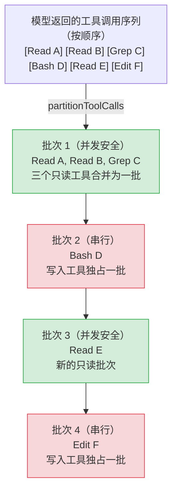

# 第4章：工具执行编排 -- 权限、并发、流式与中断

> 第3章剖析了 Agent Loop 的完整生命周期，当模型返回 `tool_use` 类型的内容块时，循环进入"工具执行阶段"。本章将深入这个阶段的内部实现：工具调用如何被分区调度、单工具执行经历哪些生命周期步骤、权限决策链如何层层过滤、大结果如何被持久化，以及流式执行器如何处理并发与中断。

## 4.1 为什么工具执行编排至关重要

一次 Agent 循环迭代中，模型可能同时请求多个工具调用。例如，模型可能一次性发出三个 `Read` 调用来读取不同文件，然后紧跟一个 `Bash` 调用来运行测试。这些调用不能全部并行执行 -- 读取操作是安全的，但一个 `git checkout` 可能改变工作目录状态，导致并行读取得到不一致的结果。

Claude Code 的工具编排层（tool orchestration）解决三个核心问题：

1. **安全并发**：只读工具可以并行执行以提高吞吐量，写入工具必须串行执行以保证一致性
2. **权限门控**：每个工具在执行前必须通过权限决策链，确保用户对危险操作保持控制
3. **结果管理**：工具输出可能极大（一个 `cat` 命令可能返回数十万字符），需要智能裁剪以避免上下文窗口溢出

这三个问题的解决方案分布在三个核心文件中：`toolOrchestration.ts`（批次调度）、`toolExecution.ts`（单工具生命周期）、`StreamingToolExecutor.ts`（流式并发执行器）。

## 4.2 partitionToolCalls：工具调用分区

### 4.2.1 分区算法

当 Agent Loop 将一批 `ToolUseBlock` 交给编排层时，第一步是将它们分区为交替的"并发安全批次"和"串行批次"。这是 `partitionToolCalls` 函数的职责：



**图 4-1：partitionToolCalls 分区逻辑图。** 连续的并发安全工具被合并到同一批次（绿色），非并发安全工具各自独占一批（红色）。

分区逻辑的核心是一个 `reduce` 操作（`restored-src/src/services/tools/toolOrchestration.ts:91-116`）：

```typescript
function partitionToolCalls(
  toolUseMessages: ToolUseBlock[],
  toolUseContext: ToolUseContext,
): Batch[] {
  return toolUseMessages.reduce((acc: Batch[], toolUse) => {
    const tool = findToolByName(toolUseContext.options.tools, toolUse.name)
    const parsedInput = tool?.inputSchema.safeParse(toolUse.input)
    const isConcurrencySafe = parsedInput?.success
      ? (() => {
          try {
            return Boolean(tool?.isConcurrencySafe(parsedInput.data))
          } catch {
            return false  // 保守策略：解析失败视为不安全
          }
        })()
      : false
    if (isConcurrencySafe && acc[acc.length - 1]?.isConcurrencySafe) {
      acc[acc.length - 1]!.blocks.push(toolUse)  // 合并到上一个并发批次
    } else {
      acc.push({ isConcurrencySafe, blocks: [toolUse] })  // 新建批次
    }
    return acc
  }, [])
}
```

关键设计决策：

- **先验证再分类**：输入必须通过 Zod schema 验证后才会调用 `isConcurrencySafe`。如果模型生成了无效输入，该工具被保守地标记为非并发安全。
- **异常即不安全**：如果 `isConcurrencySafe` 本身抛出异常（比如 `shell-quote` 解析 Bash 命令失败），同样回退到串行执行。这是"失败即关闭"（fail-closed）的经典安全模式。
- **贪心合并**：连续的并发安全工具被合并到同一批次，直到遇到一个非安全工具为止。这保持了调用的相对顺序，同时最大化并行度。

### 4.2.2 isConcurrencySafe 的判定逻辑

`isConcurrencySafe` 是 `Tool` 接口上的必需方法（`restored-src/src/Tool.ts:402`），默认实现返回 `false`（`restored-src/src/Tool.ts:759`）。各工具根据自身语义提供实现：

| 工具 | 并发安全？ | 原因 |
|------|-----------|------|
| FileRead, Glob, Grep | 始终 `true` | 纯读取，无副作用 |
| BashTool | 取决于命令 | 委托给 `isReadOnly(input)`，分析命令是否只读 |
| FileEdit, FileWrite | `false` | 修改文件系统 |
| AgentTool | `false` | 启动子 Agent，可能修改状态 |

以 `BashTool` 为例（`restored-src/src/tools/BashTool/BashTool.tsx:434-436`）：

```typescript
isConcurrencySafe(input) {
  return this.isReadOnly?.(input) ?? false;
},
```

Bash 工具的并发安全性完全取决于命令内容：`ls`、`cat`、`git log` 是安全的，而 `rm`、`git checkout`、`npm install` 则不是。`isReadOnly` 会解析命令结构来做出判断。

## 4.3 runTools：批次调度引擎

`runTools`（`restored-src/src/services/tools/toolOrchestration.ts:19-82`）是编排层的入口。它遍历分区后的批次，对并发安全批次调用 `runToolsConcurrently`，对串行批次调用 `runToolsSerially`。

### 4.3.1 并发执行路径

并发路径使用 `all()` 工具函数（`restored-src/src/utils/generators.ts:32`）将多个异步生成器合并为一个，带有并发上限（concurrency cap）：

```typescript
async function* runToolsConcurrently(...) {
  yield* all(
    toolUseMessages.map(async function* (toolUse) {
      yield* runToolUse(toolUse, ...)
      markToolUseAsComplete(toolUseContext, toolUse.id)
    }),
    getMaxToolUseConcurrency(),  // 默认 10，可通过环境变量覆盖
  )
}
```

并发上限通过环境变量 `CLAUDE_CODE_MAX_TOOL_USE_CONCURRENCY` 配置（`restored-src/src/services/tools/toolOrchestration.ts:8-11`），默认值为 10。

一个重要的细节是**上下文修改器的延迟应用**（context modifier deferred application）。并发执行的工具可能各自产生上下文修改（例如更新工具可用列表），但这些修改不能在并发执行期间立即应用 -- 否则会引发竞态条件。因此，修改器被收集到队列中，在整个并发批次完成后按工具出现顺序依次应用（`restored-src/src/services/tools/toolOrchestration.ts:31-63`）。

### 4.3.2 串行执行路径

串行路径则直接按顺序执行每个工具，每次执行后立即应用上下文修改：

```typescript
for (const toolUse of toolUseMessages) {
  for await (const update of runToolUse(toolUse, ...)) {
    if (update.contextModifier) {
      currentContext = update.contextModifier.modifyContext(currentContext)
    }
    yield { message: update.message, newContext: currentContext }
  }
}
```

这保证了写入工具能看到前一个工具修改后的上下文状态。

## 4.4 单工具执行生命周期

每个工具调用，无论通过并发路径还是串行路径，最终都进入 `runToolUse`（`restored-src/src/services/tools/toolExecution.ts:337`）和 `checkPermissionsAndCallTool`（`restored-src/src/services/tools/toolExecution.ts:599`）。这两个函数组成了单工具的完整生命周期。

```
┌─────────────────────────────────────────────────────────────────┐
│                    单工具执行生命周期                              │
│                                                                  │
│  ① 工具查找 ──→ ② Schema 验证 ──→ ③ 输入验证                     │
│       │              │                  │                         │
│   找不到工具？    验证失败？          验证失败？                     │
│   ↓ 返回错误     ↓ 返回错误          ↓ 返回错误                   │
│                                                                  │
│  ④ PreToolUse Hooks ──→ ⑤ 权限决策 ──→ ⑥ tool.call()            │
│       │                      │               │                   │
│   Hook 阻止？          权限拒绝？         执行出错？               │
│   ↓ 返回错误          ↓ 返回错误         ↓ 返回错误               │
│                                                                  │
│  ⑦ 结果映射 ──→ ⑧ 大结果持久化 ──→ ⑨ PostToolUse Hooks          │
│                                          │                       │
│                                   Hook 阻止继续？                 │
│                                   ↓ 停止后续循环                  │
└─────────────────────────────────────────────────────────────────┘
```

**图 4-2：单工具生命周期流程图。** 每个阶段都可能产生错误消息终止流程，成功路径从左到右贯穿全部九个阶段。

### 4.4.1 阶段一：工具查找与输入验证

`runToolUse` 首先在可用工具集中查找目标工具（`restored-src/src/services/tools/toolExecution.ts:345-356`）。如果找不到，还会检查已弃用工具的别名（alias）-- 这保证了旧版会话记录中的工具调用仍然可以执行。

输入验证分两步：

1. **Schema 验证**：使用 Zod 的 `safeParse` 对模型输出的参数进行类型校验（`restored-src/src/services/tools/toolExecution.ts:615-616`）。模型生成的参数类型并不总是正确的 -- 比如它可能把一个应为数组的参数输出为字符串。

2. **语义验证**：通过 `tool.validateInput()` 进行工具特定的业务逻辑校验（`restored-src/src/services/tools/toolExecution.ts:683-684`）。例如，FileEdit 工具可能检查目标文件是否存在。

一个值得注意的细节：当工具是延迟工具（deferred tool）且其 Schema 未被发送给 API 时，系统会在 Zod 错误消息中附加提示，引导模型先通过 `ToolSearch` 加载工具 Schema 再重试（`restored-src/src/services/tools/toolExecution.ts:578-597`）。

### 4.4.2 阶段二：推测性分类器启动

在进入权限检查之前，如果当前工具是 Bash 工具，系统会**推测性地启动允许分类器**（speculative classifier check，`restored-src/src/services/tools/toolExecution.ts:740-752`）。这个分类器与 PreToolUse Hooks 并行运行，在用户需要做出权限决策时结果可能已经就绪。这是一个优化手段 -- 避免用户等待分类器的延迟。

### 4.4.3 阶段三：PreToolUse Hooks

系统执行所有注册的 `PreToolUse` hooks（`restored-src/src/services/tools/toolExecution.ts:800-862`）。Hooks 可以产生以下效果：

- **修改输入**：返回 `updatedInput` 替换原始参数
- **做出权限决策**：返回 `allow`、`deny` 或 `ask` 来影响后续权限检查
- **阻止执行**：设置 `preventContinuation` 标志
- **添加上下文**：注入额外信息供模型参考

如果 hook 执行期间发生中断（abort signal），系统立即终止并返回取消消息。

### 4.4.4 阶段四：权限决策链

权限系统是工具执行生命周期中最复杂的环节。决策链由 `resolveHookPermissionDecision`（`restored-src/src/services/tools/toolHooks.ts:332-433`）协调，遵循以下优先级：

```
┌──────────────────────────────────────────────────────────────────┐
│                       权限决策链                                  │
│                                                                   │
│  PreToolUse Hook 决策                                             │
│  ├─ allow ──→ 检查规则权限 (settings.json deny/ask 规则)          │
│  │            ├─ 无匹配规则 ──→ 允许（跳过用户提示）               │
│  │            ├─ deny 规则 ──→ 拒绝（规则覆盖 Hook）              │
│  │            └─ ask 规则 ──→ 提示用户（规则覆盖 Hook）           │
│  ├─ deny ──→ 直接拒绝                                            │
│  └─ ask ──→ 进入正常权限流程（带 Hook 的 forceDecision）          │
│                                                                   │
│  无 Hook 决策 ──→ 正常权限流程                                    │
│  ├─ 工具自身 checkPermissions                                     │
│  ├─ 通用规则匹配 (settings.json)                                  │
│  ├─ YOLO/Auto 分类器（详见第17章）                                │
│  └─ 用户交互提示（详见第16章）                                    │
└──────────────────────────────────────────────────────────────────┘
```

**图 4-3：权限决策链图。** Hook 的 `allow` 不能覆盖 settings.json 中的 `deny` 规则，这是纵深防御的体现。

决策链的一个关键不变量是：**Hook 的 `allow` 决策不能绕过 settings.json 中的 deny/ask 规则**。即使 hook 批准了一个操作，如果 settings.json 中存在明确的 deny 规则，该操作仍会被拒绝。这确保了用户配置的安全边界始终有效（`restored-src/src/services/tools/toolHooks.ts:373-405`）。

权限系统的完整架构详见第16章，YOLO 分类器的实现详见第17章。

### 4.4.5 阶段五：工具执行

权限通过后，系统调用 `tool.call()`（`restored-src/src/services/tools/toolExecution.ts:1207-1222`）。执行过程被包裹在 `startSessionActivity('tool_exec')` 和 `stopSessionActivity('tool_exec')` 之间，用于追踪活跃会话状态。

工具执行期间的进度事件通过 `Stream` 对象传递（`restored-src/src/services/tools/toolExecution.ts:509`）。`streamedCheckPermissionsAndCallTool` 将 `checkPermissionsAndCallTool` 的 Promise 结果和实时进度事件合并到同一个异步可迭代对象中，使得调用者可以同时接收进度更新和最终结果。

### 4.4.6 阶段六：PostToolUse Hooks 与结果处理

工具执行成功后，系统依次执行：

1. **结果映射**：通过 `tool.mapToolResultToToolResultBlockParam()` 将工具输出转换为 API 格式（`restored-src/src/services/tools/toolExecution.ts:1292-1293`）
2. **大结果持久化**：如果结果超过阈值，将其写入磁盘并用摘要替换（详见 4.6 节）
3. **PostToolUse Hooks**：执行后置 hooks，可以修改 MCP 工具输出或阻止后续循环继续（`restored-src/src/services/tools/toolExecution.ts:1483-1531`）

对于 MCP 工具，hooks 可以通过返回 `updatedMCPToolOutput` 来修改工具输出。这个修改在 `addToolResult` 调用之前生效，确保最终存入消息历史的是修改后的版本。非 MCP 工具的结果映射在 hooks 之前完成，因此 hooks 只能附加信息，不能修改结果本身。

如果工具执行失败，系统转而执行 `PostToolUseFailure` hooks（`restored-src/src/services/tools/toolExecution.ts:1700-1713`），允许 hooks 检查错误并注入额外上下文。

## 4.5 StreamingToolExecutor：流式并发执行器

前面描述的 `runTools` 是批量模式（batch mode）-- 等待所有 `tool_use` 块到齐后才开始分区和执行。但在流式响应场景中，工具调用块一个接一个地从 API 流中解析出来。`StreamingToolExecutor`（`restored-src/src/services/tools/StreamingToolExecutor.ts`）实现了一种不同的策略：**工具调用到达即开始执行，无需等待全部就绪**。

### 4.5.1 状态机模型

`StreamingToolExecutor` 为每个工具维护一个四状态的生命周期：

```
queued ──→ executing ──→ completed ──→ yielded
```

- **queued**：工具已注册但尚未开始执行
- **executing**：工具正在运行中
- **completed**：工具已完成，结果已缓冲
- **yielded**：结果已被消费者获取

状态转换由 `processQueue()` 驱动（`restored-src/src/services/tools/StreamingToolExecutor.ts:140-151`）。每次有工具完成或新工具入队时，队列处理器被唤醒，尝试启动下一个可执行的工具。

### 4.5.2 并发控制

`canExecuteTool` 方法（`restored-src/src/services/tools/StreamingToolExecutor.ts:129-135`）实现了核心的并发策略：

```typescript
private canExecuteTool(isConcurrencySafe: boolean): boolean {
  const executingTools = this.tools.filter(t => t.status === 'executing')
  return (
    executingTools.length === 0 ||
    (isConcurrencySafe && executingTools.every(t => t.isConcurrencySafe))
  )
}
```

规则很简洁：
- 如果没有工具在执行，任何工具都可以启动
- 如果有工具在执行，新工具只有在自身和所有正在执行的工具都是并发安全的情况下才能启动
- 非并发安全工具需要独占执行（exclusive access）

### 4.5.3 Bash 错误级联中断

`StreamingToolExecutor` 实现了一个精妙的错误处理机制：当一个 Bash 工具出错时，所有同级并行的 Bash 工具会被取消（`restored-src/src/services/tools/StreamingToolExecutor.ts:357-363`）。

```typescript
if (tool.block.name === BASH_TOOL_NAME) {
  this.hasErrored = true
  this.erroredToolDescription = this.getToolDescription(tool)
  this.siblingAbortController.abort('sibling_error')
}
```

这个设计基于一个实际观察：Bash 命令之间通常存在隐式依赖链。如果 `mkdir` 失败了，后续的 `cp` 命令也注定失败 -- 与其让它们各自报错，不如提前取消。但这个策略**仅限于 Bash 工具** -- `Read`、`WebFetch` 等工具是独立的，一个的失败不应影响其他工具。

错误级联使用一个 `siblingAbortController` 实现，它是 `toolUseContext.abortController` 的子控制器。中止兄弟控制器会取消正在运行的子进程，但**不会**中止父控制器 -- 这意味着 Agent Loop 本身不会因为一个 Bash 错误而终止当前回合。

### 4.5.4 中断行为

每个工具可以声明自己的中断行为（interrupt behavior）：`'cancel'` 或 `'block'`（`restored-src/src/Tool.ts:416`）。当用户发送中断信号时：

- **cancel** 工具：立即收到取消消息，结果被合成的 REJECT_MESSAGE 替代
- **block** 工具：继续运行到完成（不响应中断）

`StreamingToolExecutor` 通过 `updateInterruptibleState()` 追踪当前是否所有正在执行的工具都是可中断的（`restored-src/src/services/tools/StreamingToolExecutor.ts:254-259`）。这个信息被传递给 UI 层，决定是否显示"按 ESC 取消"的提示。

### 4.5.5 进度消息的即时传递

普通工具结果必须按序传递（保证顺序语义），但**进度消息可以立即传递**（`restored-src/src/services/tools/StreamingToolExecutor.ts:417-420`）。`StreamingToolExecutor` 将进度消息存储在独立的 `pendingProgress` 队列中，`getCompletedResults()` 在扫描工具列表时会优先 yield 进度消息，不受工具完成顺序的限制。

当没有已完成结果但有正在执行的工具时，`getRemainingResults()` 通过 `Promise.race` 等待任一工具完成**或**有新的进度消息到达（`restored-src/src/services/tools/StreamingToolExecutor.ts:476-481`），避免不必要的轮询。

## 4.6 工具结果管理：预算与持久化

### 4.6.1 大结果持久化

一个 `Bash` 工具的 `cat` 命令可能返回数十万字符。将如此巨大的结果直接塞入上下文窗口，不仅浪费 token 预算，还可能导致模型注意力分散。`toolResultStorage.ts` 实现了大结果持久化机制。

持久化阈值的确定遵循以下优先级（`restored-src/src/utils/toolResultStorage.ts:55-78`）：

1. **GrowthBook 覆盖**：运营团队可以通过 Feature Flag（`tengu_satin_quoll`）为特定工具设置自定义阈值
2. **工具声明值**：每个工具的 `maxResultSizeChars` 属性
3. **全局上限**：`DEFAULT_MAX_RESULT_SIZE_CHARS = 50,000` 字符（`restored-src/src/constants/toolLimits.ts:13`）

最终阈值取工具声明值和全局上限的较小者。但如果工具声明 `Infinity`，则跳过持久化 -- 例如 `Read` 工具自己管理输出边界，将其输出持久化到文件再让模型用 `Read` 读回是循环引用。

当结果超过阈值时，`persistToolResult`（`restored-src/src/utils/toolResultStorage.ts:137`）将完整内容写入会话目录下的 `tool-results/` 子目录，然后生成一个包含预览的摘要消息：

```
<persisted-output>
Output too large (245.0 KB). Full output saved to: /path/to/tool-results/abc123.txt

Preview (first 2.0 KB):
[前 2000 字节的内容...]
...
</persisted-output>
```

预览生成（`restored-src/src/utils/toolResultStorage.ts:339-356`）会尽量在换行符处截断，避免在行中间切断。截断点的查找范围是阈值的 50% 到 100% 之间最后一个换行符。

### 4.6.2 每消息聚合预算

除了单工具的大小限制，系统还维护一个**每消息聚合预算**（per-message aggregate budget）。当一个回合中多个并行工具各自返回接近阈值的结果时，它们的总和可能远超合理范围（例如 10 个工具各返回 40K = 400K 字符）。

聚合预算默认为 200,000 字符（`restored-src/src/constants/toolLimits.ts:49`），可通过 GrowthBook Flag（`tengu_hawthorn_window`）覆盖。超出预算时，系统从最大的工具结果开始持久化，直到总量降回预算以内。

为了保持**提示缓存（prompt cache）的稳定性**，聚合预算系统维护了一个 `ContentReplacementState`（`restored-src/src/utils/toolResultStorage.ts:390-393`），记录哪些工具结果已经被持久化。一旦某个结果在某次评估中被持久化，它在后续所有评估中都会使用相同的持久化版本 -- 即使后续回合的总量未超预算。这避免了"缓存抖动"（cache thrashing）：同一条消息在不同 API 调用中内容不同，导致前缀缓存失效。

### 4.6.3 空结果填充

一个容易被忽视的细节：空的 `tool_result` 内容会导致某些模型（尤其是 Capybara）误将其解释为回合边界，输出 `\n\nHuman:` 停止序列并终止响应（`restored-src/src/utils/toolResultStorage.ts:280-295`）。系统通过检测空结果并注入占位文本（如 `(Bash completed with no output)`）来防止这种行为。

## 4.7 Stop Hooks：工具执行后的中断点

PreToolUse hooks 和 PostToolUse hooks 都可以请求**停止后续循环继续**（prevent continuation）。这是通过 `preventContinuation` 标志实现的。

当 PreToolUse hook 设置了此标志（`restored-src/src/services/tools/toolHooks.ts:500-508`），工具仍然会执行（除非同时返回了 deny 决策），但执行完成后，系统会向消息列表追加一条 `hook_stopped_continuation` 类型的附件消息（`restored-src/src/services/tools/toolExecution.ts:1572-1582`）。Agent Loop 检测到这类消息后会终止当前迭代，不再将结果发送给模型进行下一轮推理。

PostToolUse hooks 同样可以阻止继续（`restored-src/src/services/tools/toolHooks.ts:118-129`），并且是更常见的用法 -- 例如，一个 hook 可能在检测到危险操作的结果后决定中断 Agent 循环。

## 4.8 模式提炼

### 模式一：贪心合并的流水线分区

工具调用分区采用"贪心合并"策略：连续的同类工具被合并到同一批次，不同类型的切换点成为批次边界。这个模式的核心洞见是 -- **在顺序保证和并行效率之间，选择一个简单的中间方案**。完全并行（忽略顺序）可能导致不一致，完全串行（忽略类型）则浪费性能。贪心合并在保持相对顺序的前提下实现了接近最优的并行度。

### 模式二：失败即关闭的安全默认值

`isConcurrencySafe` 在解析失败或异常时默认返回 `false`，`Tool` 接口的默认实现也是 `false`。权限 hook 的 `allow` 不能覆盖 deny 规则。这些都是"fail-closed"模式的体现 -- **当系统无法确定安全性时，选择更保守的行为**。在 AI Agent 系统中，这个原则尤为重要：模型的输出是不可预测的，任何假设"正常情况下不会发生"的乐观设计都可能成为安全漏洞。

### 模式三：分层错误级联

Bash 错误取消同级 Bash 工具，但不影响 Read/Grep 等独立工具；兄弟中止控制器取消子进程，但不中止父级 Agent Loop。这种**选择性级联**（selective cascading）避免了两个极端：要么完全隔离（错误被忽视），要么全局中止（一个小错误杀死整个会话）。

### 模式四：缓存稳定的结果管理

大结果持久化系统通过 `ContentReplacementState` 确保同一结果在不同 API 调用中始终使用相同的替换内容。这是提示缓存优化的关键 -- **为了性能，牺牲一点逻辑简洁性来维护确定性**。类似的缓存稳定性设计将在第13-15章的缓存架构中反复出现。

---

## 用户能做什么

以下是从 Claude Code 工具执行编排中提炼出的可操作建议，适用于任何需要编排多工具调用的 AI Agent 系统：

- **实现基于输入的并发分区。** 不要简单地将所有工具调用串行执行。根据每个工具调用的实际输入判断是否只读/并发安全，将连续的安全调用合并为并发批次，最大化吞吐量。
- **为并发安全性设置"失败即关闭"默认值。** 如果输入解析失败或 `isConcurrencySafe` 抛异常，默认回退到串行执行。永远不要在不确定时假设并发是安全的。
- **实现 Bash 错误的选择性级联中断。** 当一个 shell 命令失败时，取消同级的其他 shell 命令（它们很可能存在隐式依赖），但不要取消独立的只读工具（如 `Read`、`Grep`）。使用子级 `AbortController` 实现，避免中止整个 Agent Loop。
- **为大结果实现两级预算控制。** 单工具结果有字符数上限，单消息的所有工具结果也有聚合上限。超出预算时持久化到磁盘并返回预览，从最大的结果开始裁剪。
- **维护结果替换的确定性。** 一旦某个工具结果被持久化替换，在后续所有 API 调用中都使用相同的替换版本，即使聚合预算当前未超限。这对提示缓存的命中率至关重要。
- **为空的工具结果注入占位文本。** 空的 `tool_result` 可能被模型误解为回合边界。注入类似 `(Bash completed with no output)` 的占位文本，避免模型意外终止响应。
- **将权限检查设计为纵深防御。** Hook 的 `allow` 决策不应绕过用户配置的 `deny` 规则。多层权限检查（hook → 工具自身 → 规则匹配 → 用户交互）确保安全边界始终有效。

---

本章揭示了工具执行编排层如何在并发效率、安全控制和上下文管理之间取得平衡。下一章将进入第二篇，分析系统提示词架构 -- 另一个驾驭模型行为的关键控制面。

---

## 版本演化：v2.1.91 变化

> 以下分析基于 v2.1.91 bundle 信号对比。

v2.1.91 的 `sdk-tools.d.ts` 在工具结果元数据中新增 `staleReadFileStateHint` 字段——当工具执行导致已读取文件的 mtime 变化时，系统自动生成陈旧提示。这是工具执行编排层的一个新增输出通道，让模型能够感知自身操作对文件系统的副作用。
