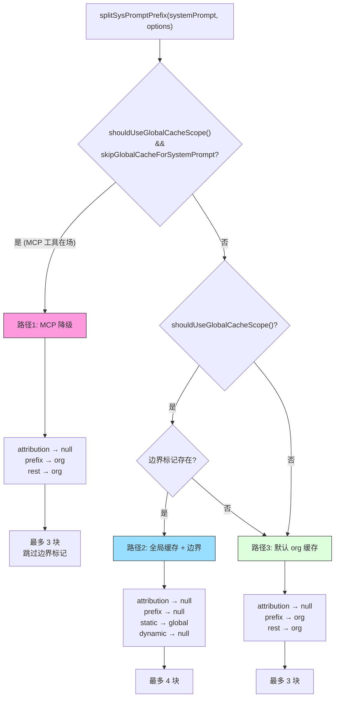
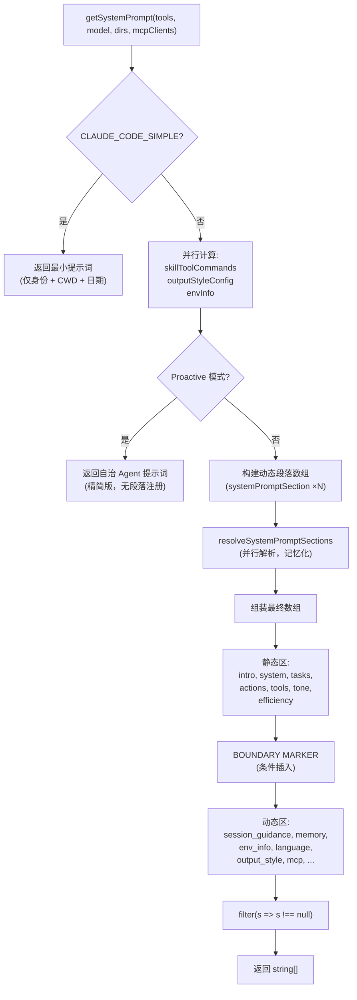

# 第5章：系统提示词架构

> **定位**：本章分析 CC 如何动态拼装系统提示词——段落注册与记忆化、缓存边界标记、多来源优先级合成。前置依赖：第3章（Agent Loop）。适用场景：想理解 CC 如何动态拼装系统提示词的读者，或想为自己的 Agent 设计提示词架构的开发者。

> 第4章解剖了工具执行编排的全过程。在模型能够做出任何工具调用之前，它需要先"知道自己是谁" -- 这正是系统提示词（system prompt）的职责。本章将深入系统提示词的组装架构：段落如何注册与记忆化、静态与动态内容如何被边界标记分割、缓存优化契约如何在 API 层兑现、以及多来源提示词如何按优先级合成为最终发送给模型的指令集。

## 5.1 为什么系统提示词需要"架构"

一个朴素的实现可以将系统提示词硬编码为一个字符串常量。但 Claude Code 的系统提示词面临三重工程挑战：

1. **体积与成本**：完整的系统提示词包含身份介绍、行为规范、工具使用指南、环境信息、内存文件、MCP 指令等十余个段落，总量达数万 token。每次 API 调用都重传这些内容，意味着巨额的 prompt 缓存（prompt caching）成本。
2. **变化频率不一**：身份介绍和编码规范在所有用户、所有会话中完全相同，而环境信息（工作目录、操作系统版本）因会话而异，MCP 服务器指令甚至可能在对话中途变化。
3. **多来源覆盖**：用户可以通过 `--system-prompt` 自定义提示词，Agent 模式有专属提示词，协调器模式（coordinator mode）有独立提示词，Loop 模式可以完全覆盖 -- 这些来源之间的优先级必须明确。

Claude Code 的解决方案是一个**分段式组合架构（sectioned composition architecture）**：将系统提示词拆分为独立的、可记忆化的段落，通过注册表管理生命周期，用边界标记（boundary marker）划分缓存层级，最终在 API 层转化为带有 `cache_control` 的请求块。

> **交互式版本**：[点击查看提示词组装动画](prompt-assembly-viz.html) — 观看 7 个 section 逐层叠加，缓存率实时计算。

## 5.2 段落注册表：systemPromptSection 的记忆化与缓存感知

### 5.2.1 核心抽象

系统提示词的最小单元是**段落（section）**。每个段落由一个名称、一个计算函数和一个缓存策略组成。这个抽象定义在 `systemPromptSections.ts` 中：

```typescript
type SystemPromptSection = {
  name: string
  compute: ComputeFn        // () => string | null | Promise<string | null>
  cacheBreak: boolean       // false = 可记忆化, true = 每轮重算
}
```

**源码参考：** `restored-src/src/constants/systemPromptSections.ts:10-14`

两个工厂函数用于创建段落：

- **`systemPromptSection(name, compute)`** -- 创建一个**记忆化段落**。计算函数只在首次调用时执行，结果被缓存到全局状态中，后续轮次直接返回缓存值。缓存在 `/clear` 或 `/compact` 时重置。
- **`DANGEROUS_uncachedSystemPromptSection(name, compute, reason)`** -- 创建一个**易变段落**。每次解析（resolve）时都会重新执行计算函数。`DANGEROUS_` 前缀和必填的 `reason` 参数是有意为之的 API 设计摩擦（API friction），提醒开发者这种段落**会破坏 prompt 缓存**。

```
┌───────────────────────────────────────────────────────────────────────┐
│                      段落注册表 (Section Registry)                    │
│                                                                       │
│  ┌─────────────────────┐   ┌──────────────────────────────────────┐  │
│  │ systemPromptSection │   │ DANGEROUS_uncachedSystemPromptSection│  │
│  │   cacheBreak=false  │   │         cacheBreak=true              │  │
│  └────────┬────────────┘   └────────────┬─────────────────────────┘  │
│           │                              │                            │
│           ▼                              ▼                            │
│  ┌─────────────────────────────────────────────────────────────────┐  │
│  │            resolveSystemPromptSections(sections)                │  │
│  │                                                                 │  │
│  │  for each section:                                              │  │
│  │    if (!cacheBreak && cache.has(name)):                         │  │
│  │      return cache.get(name)    ← 记忆化命中                     │  │
│  │    else:                                                        │  │
│  │      value = await compute()                                    │  │
│  │      cache.set(name, value)    ← 写入缓存                      │  │
│  │      return value                                               │  │
│  └─────────────────────────────────────────────────────────────────┘  │
│                                                                       │
│  缓存存储: STATE.systemPromptSectionCache (Map<string, string|null>) │
│  重置时机: /clear, /compact → clearSystemPromptSections()            │
└───────────────────────────────────────────────────────────────────────┘
```

**图 5-1：段落注册表的记忆化流程。** 记忆化段落（`cacheBreak=false`）在首次计算后缓存到全局 Map 中；易变段落（`cacheBreak=true`）每次都重新计算。

### 5.2.2 解析流程

`resolveSystemPromptSections` 是将段落定义转化为实际字符串的核心函数（`restored-src/src/constants/systemPromptSections.ts:43-58`）：

```typescript
export async function resolveSystemPromptSections(
  sections: SystemPromptSection[],
): Promise<(string | null)[]> {
  const cache = getSystemPromptSectionCache()
  return Promise.all(
    sections.map(async s => {
      if (!s.cacheBreak && cache.has(s.name)) {
        return cache.get(s.name) ?? null
      }
      const value = await s.compute()
      setSystemPromptSectionCacheEntry(s.name, value)
      return value
    }),
  )
}
```

几个关键设计决策：

- **并行解析**：使用 `Promise.all` 并行执行所有段落的计算函数。这对于需要 I/O 操作的段落（如 `loadMemoryPrompt` 读取 CLAUDE.md 文件）尤为重要。
- **null 有效**：计算函数返回 `null` 表示该段落不需要包含在最终提示词中。`null` 同样会被缓存，避免在后续轮次重复执行条件判断。
- **缓存存储位置**：缓存存储在 `STATE.systemPromptSectionCache` 中（`restored-src/src/bootstrap/state.ts:203`），这是一个 `Map<string, string | null>`。选择全局 state 而非模块级变量，是为了让 `/clear` 和 `/compact` 命令能够统一重置所有状态。

### 5.2.3 缓存生命周期

缓存的清除由 `clearSystemPromptSections` 函数负责（`restored-src/src/constants/systemPromptSections.ts:65-68`）：

```typescript
export function clearSystemPromptSections(): void {
  clearSystemPromptSectionState()   // 清空 Map
  clearBetaHeaderLatches()          // 重置 beta 头部锁存器
}
```

这个函数在两个时机被调用：

1. **`/clear` 命令** -- 用户显式清除对话历史时，所有段落缓存失效，下一轮 API 调用会重新计算所有段落。
2. **`/compact` 命令** -- 对话被压缩时，段落缓存同样失效。这是因为压缩可能改变上下文状态（如工具可用列表），依赖旧状态计算的段落值可能不再正确。

附带的 `clearBetaHeaderLatches()` 确保新对话能重新评估 AFK、fast-mode 等 beta 特性头部，而不是延续上一轮的锁存值。

## 5.3 DANGEROUS_uncachedSystemPromptSection 的使用时机

`DANGEROUS_` 前缀不是装饰 -- 它标记了一个真实的工程权衡（trade-off）。让我们看看源码中唯一的使用案例：

```typescript
DANGEROUS_uncachedSystemPromptSection(
  'mcp_instructions',
  () =>
    isMcpInstructionsDeltaEnabled()
      ? null
      : getMcpInstructionsSection(mcpClients),
  'MCP servers connect/disconnect between turns',
),
```

**源码参考：** `restored-src/src/constants/prompts.ts:513-520`

MCP 服务器可以在对话的两个轮次之间连接或断开。如果将 MCP 指令段落设为记忆化，那么在第1轮计算时只有服务器 A 连接，缓存了 A 的指令；到第3轮服务器 B 也连接了，但缓存仍然返回只包含 A 的旧值 -- 模型永远不会知道 B 的存在。

这就是 `DANGEROUS_uncachedSystemPromptSection` 的使用时机：**当段落的内容可能在对话生命周期内发生变化，且使用过期值会导致功能性错误时**。

代码注释中的 `reason` 参数（`'MCP servers connect/disconnect between turns'`）不仅是文档，更是一种代码审查约束 -- 任何引入新的 `DANGEROUS_` 段落的 PR 都需要解释为什么缓存失效是必要的。

值得注意的是，源码中还记录了一个"从 DANGEROUS 降级为普通缓存"的案例。`token_budget` 段落曾经是 `DANGEROUS_uncachedSystemPromptSection`，根据 `getCurrentTurnTokenBudget()` 的值动态切换，但这会在每次 budget 切换时破坏约 20K token 的缓存。解决方案是重新措辞提示词文本，使其在无预算时自然成为空操作（no-op），从而降级为普通的 `systemPromptSection`（`restored-src/src/constants/prompts.ts:540-550`）。

## 5.4 静态与动态边界：SYSTEM_PROMPT_DYNAMIC_BOUNDARY

### 5.4.1 边界标记的定义

系统提示词中存在一条显式的分界线，将内容划分为"静态区"和"动态区"：

```typescript
export const SYSTEM_PROMPT_DYNAMIC_BOUNDARY =
  '__SYSTEM_PROMPT_DYNAMIC_BOUNDARY__'
```

**源码参考：** `restored-src/src/constants/prompts.ts:114-115`

这个字符串常量本身不会出现在最终发送给模型的文本中 -- 它是一个**带内信号（in-band signal）**，只存在于系统提示词数组中，供下游的 `splitSysPromptPrefix` 函数识别和处理。

### 5.4.2 边界的位置与含义

在 `getSystemPrompt` 函数的返回数组中，边界标记被精确放置在静态内容与动态内容之间（`restored-src/src/constants/prompts.ts:560-576`）：

```
返回数组结构：
[
  getSimpleIntroSection(...)          ─┐
  getSimpleSystemSection()             │ 静态区：所有用户/会话相同
  getSimpleDoingTasksSection()         │ → cacheScope: 'global'
  getActionsSection()                  │
  getUsingYourToolsSection(...)        │
  getSimpleToneAndStyleSection()       │
  getOutputEfficiencySection()        ─┘
  SYSTEM_PROMPT_DYNAMIC_BOUNDARY      ← 边界标记
  session_guidance                    ─┐
  memory (CLAUDE.md)                   │ 动态区：因会话/用户而异
  env_info_simple                      │ → cacheScope: null (不缓存)
  language                             │
  output_style                         │
  mcp_instructions (DANGEROUS)         │
  scratchpad                           │
  ...                                 ─┘
]
```

**图 5-2：静态/动态边界示意图。** 边界标记将系统提示词数组分为两个区域，分别对应不同的缓存作用域。

关键规则：**边界标记之前的所有内容在所有组织、所有用户、所有会话中完全相同**。这意味着它们可以使用 `scope: 'global'` 进行跨组织缓存 -- 一个用户的 API 调用计算出的缓存前缀，可以被任何其他用户的调用直接命中。

边界标记只在第一方（firstParty）API 提供者启用全局缓存时才被插入：

```typescript
...(shouldUseGlobalCacheScope() ? [SYSTEM_PROMPT_DYNAMIC_BOUNDARY] : []),
```

`shouldUseGlobalCacheScope()`（`restored-src/src/utils/betas.ts:227-231`）的判断条件是：API 提供者为 `'firstParty'`（即直接使用 Anthropic API），且未通过环境变量禁用实验性 beta 特性。第三方提供者（如通过 Foundry 接入）不使用全局缓存。

### 5.4.3 将会话变化赶到边界之后

源码中有一段精心撰写的注释，解释了 `getSessionSpecificGuidanceSection` 存在的原因（`restored-src/src/constants/prompts.ts:343-347`）：

> Session-variant guidance that would fragment the cacheScope:'global' prefix if placed before SYSTEM_PROMPT_DYNAMIC_BOUNDARY. Each conditional here is a runtime bit that would otherwise multiply the Blake2b prefix hash variants (2^N).

这揭示了一个微妙但关键的设计约束：**静态区中不能包含任何因会话而异的条件分支**。如果工具可用列表、Skill 命令、Agent 工具等运行时信息出现在边界之前，那么每种工具组合都会产生一个不同的 Blake2b 前缀哈希，导致全局缓存的变体数量呈指数增长（2^N，N 为条件位数），实际命中率降为零。

因此，所有依赖运行时状态的内容 -- 工具引导（session guidance）、内存文件、环境信息、语言偏好 -- 都被放置在边界之后的动态区中，作为记忆化段落（`systemPromptSection`）而非静态字符串。

## 5.5 splitSysPromptPrefix 的三条代码路径

`splitSysPromptPrefix`（`restored-src/src/utils/api.ts:321-435`）是将逻辑上的系统提示词数组转化为 API 请求中带有缓存控制的文本块（`SystemPromptBlock[]`）的桥梁。它根据运行时条件选择三条不同的代码路径。



**图 5-3：splitSysPromptPrefix 三路径流程图。** 根据全局缓存特性和 MCP 工具存在情况，函数选择不同的缓存策略。

### 5.5.1 路径1：MCP 降级路径

**触发条件：** `shouldUseGlobalCacheScope() === true` 且 `options.skipGlobalCacheForSystemPrompt === true`

当会话中存在 MCP 工具时，工具 schema 本身是用户级别的动态内容，无法全局缓存。此时即便系统提示词中的静态区可以全局缓存，工具 schema 的存在也使全局缓存的实际收益大打折扣。因此 `splitSysPromptPrefix` 选择**降级到 org 级别缓存**。

```typescript
// 路径1核心逻辑 (restored-src/src/utils/api.ts:332-359)
for (const prompt of systemPrompt) {
  if (!prompt) continue
  if (prompt === SYSTEM_PROMPT_DYNAMIC_BOUNDARY) continue // 跳过边界
  if (prompt.startsWith('x-anthropic-billing-header')) {
    attributionHeader = prompt
  } else if (CLI_SYSPROMPT_PREFIXES.has(prompt)) {
    systemPromptPrefix = prompt
  } else {
    rest.push(prompt)
  }
}
// 结果: [attribution:null, prefix:org, rest:org]
```

边界标记被直接跳过（`continue`），所有非特殊块合并为一个 `org` 级别的缓存块。`skipGlobalCacheForSystemPrompt` 的传入方来自 `claude.ts` 中的判断（`restored-src/src/services/api/claude.ts:1210-1214`）：只有当 MCP 工具实际渲染到请求中（而非被 `defer_loading`）时，才触发降级。

### 5.5.2 路径2：全局缓存 + 边界路径

**触发条件：** `shouldUseGlobalCacheScope() === true`，未被 MCP 降级，且系统提示词中存在边界标记

这是第一方用户在无 MCP 工具时的主路径，也是缓存效率最高的路径：

```typescript
// 路径2核心逻辑 (restored-src/src/utils/api.ts:362-409)
const boundaryIndex = systemPrompt.findIndex(
  s => s === SYSTEM_PROMPT_DYNAMIC_BOUNDARY,
)
if (boundaryIndex !== -1) {
  for (let i = 0; i < systemPrompt.length; i++) {
    const block = systemPrompt[i]
    if (!block || block === SYSTEM_PROMPT_DYNAMIC_BOUNDARY) continue
    if (block.startsWith('x-anthropic-billing-header')) {
      attributionHeader = block
    } else if (CLI_SYSPROMPT_PREFIXES.has(block)) {
      systemPromptPrefix = block
    } else if (i < boundaryIndex) {
      staticBlocks.push(block)        // 边界前 → 静态
    } else {
      dynamicBlocks.push(block)       // 边界后 → 动态
    }
  }
  // 结果: [attribution:null, prefix:null, static:global, dynamic:null]
}
```

这条路径产生最多 **4 个文本块**：

| 块 | cacheScope | 说明 |
|----|-----------|------|
| attribution header | `null` | 计费归因头，不缓存 |
| system prompt prefix | `null` | CLI 前缀标识，不缓存 |
| static content | `'global'` | 跨组织可缓存的核心指令 |
| dynamic content | `null` | 每会话内容，不缓存 |

静态块使用 `scope: 'global'` 意味着 Anthropic API 后端可以在所有 Claude Code 用户之间共享这个缓存前缀。考虑到静态区通常包含数万 token 的身份介绍和行为规范，这个缓存在高并发场景下节省的计算量是巨大的。

### 5.5.3 路径3：默认 org 缓存路径

**触发条件：** 全局缓存特性未启用（第三方提供者），或边界标记不存在

这是最简单的兜底路径：

```typescript
// 路径3核心逻辑 (restored-src/src/utils/api.ts:411-434)
for (const block of systemPrompt) {
  if (!block) continue
  if (block.startsWith('x-anthropic-billing-header')) {
    attributionHeader = block
  } else if (CLI_SYSPROMPT_PREFIXES.has(block)) {
    systemPromptPrefix = block
  } else {
    rest.push(block)
  }
}
// 结果: [attribution:null, prefix:org, rest:org]
```

所有非特殊内容合并为单一块，使用 `org` 级别缓存。这对第三方提供者已经足够 -- 同一组织内的用户共享相同的系统提示词前缀，仍能获得组织级别的缓存命中。

### 5.5.4 从 splitSysPromptPrefix 到 API 请求

`buildSystemPromptBlocks`（`restored-src/src/services/api/claude.ts:3213-3237`）是 `splitSysPromptPrefix` 的直接消费者。它将 `SystemPromptBlock[]` 转化为 Anthropic API 期望的 `TextBlockParam[]` 格式：

```typescript
export function buildSystemPromptBlocks(
  systemPrompt: SystemPrompt,
  enablePromptCaching: boolean,
  options?: { skipGlobalCacheForSystemPrompt?: boolean; querySource?: QuerySource },
): TextBlockParam[] {
  return splitSysPromptPrefix(systemPrompt, {
    skipGlobalCacheForSystemPrompt: options?.skipGlobalCacheForSystemPrompt,
  }).map(block => ({
    type: 'text' as const,
    text: block.text,
    ...(enablePromptCaching && block.cacheScope !== null && {
      cache_control: getCacheControl({
        scope: block.cacheScope,
        querySource: options?.querySource,
      }),
    }),
  }))
}
```

映射规则很直观：`cacheScope` 不为 `null` 的块获得 `cache_control` 属性，`null` 的块则没有。API 后端根据 `cache_control.scope` 的值（`'global'` 或 `'org'`）决定缓存的共享范围。

## 5.6 系统提示词的构建流程

### 5.6.1 getSystemPrompt 的完整流程

`getSystemPrompt`（`restored-src/src/constants/prompts.ts:444-577`）是系统提示词构建的主入口。它接受工具列表、模型名称、额外工作目录和 MCP 客户端列表，返回一个 `string[]` 数组。



**图 5-4：系统提示词构建流程图。** 从入口到最终返回的完整数据流。

构建过程有三个快速路径（fast path）：

1. **CLAUDE_CODE_SIMPLE 模式**：环境变量 `CLAUDE_CODE_SIMPLE` 为真时，直接返回一个只含身份、工作目录和日期的最小提示词。这主要用于测试和调试场景。
2. **Proactive 模式**：当启用了 `PROACTIVE` 或 `KAIROS` 特性标志且处于活跃状态时，返回一个精简的自治 Agent 提示词。注意这条路径**不经过段落注册表**，而是直接拼装字符串数组。
3. **标准路径**：经过完整的段落注册、解析、静态/动态分区流程。

### 5.6.2 段落注册表一览

标准路径中注册的动态段落（`restored-src/src/constants/prompts.ts:491-555`）构成了动态区的全部内容：

| 段落名称 | 类型 | 内容描述 |
|---------|------|---------|
| `session_guidance` | 记忆化 | 工具引导、交互模式提示 |
| `memory` | 记忆化 | CLAUDE.md 内存文件内容（详见第6章） |
| `ant_model_override` | 记忆化 | Anthropic 内部模型覆盖指令 |
| `env_info_simple` | 记忆化 | 工作目录、OS、Shell 等环境信息 |
| `language` | 记忆化 | 语言偏好设置 |
| `output_style` | 记忆化 | 输出风格配置 |
| `mcp_instructions` | **易变** | MCP 服务器指令（可中途变化） |
| `scratchpad` | 记忆化 | 草稿本指令 |
| `frc` | 记忆化 | 函数结果清理指令 |
| `summarize_tool_results` | 记忆化 | 工具结果摘要指令 |
| `numeric_length_anchors` | 记忆化 | 长度锚点（仅 Ant 内部） |
| `token_budget` | 记忆化 | Token 预算指令（特性门控） |
| `brief` | 记忆化 | 简报段落（KAIROS 特性门控） |

唯一的 `DANGEROUS_uncachedSystemPromptSection` 是 `mcp_instructions` -- 这与 5.3 节的分析一致。所有其他段落都是记忆化的，在会话生命周期内计算一次后不再变化。

## 5.7 buildEffectiveSystemPrompt 的优先级

`getSystemPrompt` 构建的是"默认系统提示词"。但在实际调用中，还有多个来源可能覆盖或补充这个默认值。`buildEffectiveSystemPrompt`（`restored-src/src/utils/systemPrompt.ts:41-123`）负责按优先级合成最终的有效提示词。

### 5.7.1 优先级链

```
优先级 0 (最高): overrideSystemPrompt
  ↓ 不存在时
优先级 1: coordinator system prompt
  ↓ 不存在时
优先级 2: agent system prompt
  ↓ 不存在时
优先级 3: customSystemPrompt (--system-prompt)
  ↓ 不存在时
优先级 4 (最低): defaultSystemPrompt (getSystemPrompt 的输出)

+ appendSystemPrompt 始终追加在末尾 (除 override 外)
```

### 5.7.2 各优先级的行为

**Override（覆盖）：** 当 `overrideSystemPrompt` 存在时（例如 Loop 模式设置的循环指令），直接返回只包含该字符串的数组，忽略所有其他来源，**包括 `appendSystemPrompt`**（`restored-src/src/utils/systemPrompt.ts:56-58`）：

```typescript
if (overrideSystemPrompt) {
  return asSystemPrompt([overrideSystemPrompt])
}
```

**Coordinator（协调器）：** 当启用了 `COORDINATOR_MODE` 特性标志且 `CLAUDE_CODE_COORDINATOR_MODE` 环境变量为真时，使用协调器专用的系统提示词替代默认值。注意这里通过懒加载（lazy require）引入 `coordinatorMode` 模块，避免循环依赖（`restored-src/src/utils/systemPrompt.ts:62-75`）。

**Agent（代理）：** 当设置了 `mainThreadAgentDefinition` 时，行为取决于是否处于 Proactive 模式：

- **Proactive 模式下**：Agent 指令被**追加**到默认提示词末尾，而非替换。这是因为 Proactive 模式的默认提示词已经是精简的自治 Agent 身份，Agent 定义只是在其上添加领域指令 -- 与 teammates 模式下的行为一致。
- **普通模式下**：Agent 指令**替换**默认提示词。

**Custom（自定义）：** `--system-prompt` 命令行参数指定的提示词，替换默认提示词。

**Default（默认）：** `getSystemPrompt` 的完整输出。

**Append（追加）：** 如果设置了 `appendSystemPrompt`，它被追加到最终数组的末尾。这提供了一种在不完全覆盖系统提示词的情况下注入额外指令的机制。

### 5.7.3 最终合成逻辑

当没有 override 和 coordinator 时，核心的三路选择逻辑如下（`restored-src/src/utils/systemPrompt.ts:115-122`）：

```typescript
return asSystemPrompt([
  ...(agentSystemPrompt
    ? [agentSystemPrompt]
    : customSystemPrompt
      ? [customSystemPrompt]
      : defaultSystemPrompt),
  ...(appendSystemPrompt ? [appendSystemPrompt] : []),
])
```

这是一个清晰的三元链（ternary chain）：Agent > Custom > Default，加上可选的 append。`asSystemPrompt` 是一个品牌类型（branded type）转换，确保返回值的类型安全（详见第8章关于类型系统的讨论）。

## 5.8 缓存优化契约：设计约束与陷阱

系统提示词架构建立了一个隐式的**缓存优化契约（cache optimization contract）**，违反这个契约会导致缓存命中率断崖式下降。以下是从源码中提炼的关键约束：

### 约束1：静态区不可含会话变量

如 5.4.3 节所述，边界前的任何条件分支都会指数级增加哈希变体数量。PR #24490 和 #24171 记录了这类 bug：开发者不慎将一个 `if (hasAgentTool)` 条件放入静态区，导致全局缓存命中率从 95% 暴跌至不到 10%。

### 约束2：DANGEROUS 段落必须有充分理由

`DANGEROUS_uncachedSystemPromptSection` 的每次使用都在代码审查中接受审视。`reason` 参数虽然在运行时不被使用（注意参数名的 `_` 前缀：`_reason`），但它是 PR 审查的锚点 -- 审查者会检查理由是否充分、是否有替代方案可以降级为记忆化段落。

### 约束3：MCP 工具触发全局缓存降级

当存在 MCP 工具时，`splitSysPromptPrefix` 自动降级到 org 级别缓存。这个决策基于一个工程判断：MCP 工具的 schema 是用户级别的动态内容，即便系统提示词中的静态区可以全局缓存，工具 schema 块的存在意味着 API 请求中已经有了无法全局缓存的大块内容，系统提示词的全局缓存带来的边际收益不足以证明额外的复杂性。

### 约束4：边界标记的位置是架构不变量

源码中的注释直言不讳（`restored-src/src/constants/prompts.ts:572`）：

```
// === BOUNDARY MARKER - DO NOT MOVE OR REMOVE ===
```

移动或删除边界标记不是一个代码变更 -- 它是一个架构变更，会改变所有第一方用户的缓存行为。

## 5.8 模式提炼

从系统提示词架构中，可以提炼出以下可复用的工程模式：

### 模式 1：分段记忆化（Sectioned Memoization）

- **解决的问题：** 大型提示词中部分内容是静态的、部分是动态的，全量重算浪费资源。
- **方案：** 将提示词拆分为独立段落，每个段落有明确的缓存策略（记忆化 vs. 易变）。通过工厂函数区分两种类型，并为易变类型增加 API 摩擦（`DANGEROUS_` 前缀 + 必填 `reason`）。
- **前置条件：** 需要全局状态管理器持有缓存 Map，以及明确的缓存失效时机（如 `/clear`、`/compact`）。
- **代码模板：**
  ```
  memoizedSection(name, computeFn)        → 首次计算后缓存
  volatileSection(name, computeFn, reason) → 每轮重算，需说明理由
  resolveAll(sections)                     → Promise.all 并行解析
  ```

### 模式 2：缓存边界分治（Cache Boundary Partitioning）

- **解决的问题：** 多用户共享的提示词前缀需要全局缓存，但会话特定的内容破坏缓存命中率。
- **方案：** 在提示词数组中插入显式的边界标记，将内容分为"全局可缓存的静态区"和"每会话的动态区"。下游函数根据边界位置分配不同的 `cacheScope`。
- **前置条件：** API 后端支持多级缓存作用域（如 `global` / `org` / `null`）。
- **关键约束：** 边界前的静态区中不能包含任何因会话而异的条件分支，否则哈希变体数量指数增长。

### 模式 3：优先级链合成（Priority Chain Composition）

- **解决的问题：** 多个来源（用户自定义、Agent 模式、协调器模式、默认值）都可能提供系统提示词，需要明确的优先级。
- **方案：** 定义一条线性优先级链（override > coordinator > agent > custom > default），加上一个始终追加的 `append` 机制。使用三元链（ternary chain）保持代码的线性可读性。
- **前置条件：** 各优先级来源的输入接口统一（均为 `string | string[]`）。

## 5.9 用户能做什么

基于本章分析的系统提示词架构，以下是读者可以在自己的 AI Agent 项目中直接应用的建议：

1. **为你的提示词建立分段注册表。** 不要将系统提示词硬编码为单一字符串。将其拆分为独立的、有名称的段落，每个段落标注是否可缓存。这样做的收益不仅是缓存效率，更是可维护性 -- 当需要修改某个行为指令时，你可以精确定位到对应的段落，而不是在一个巨大的字符串中搜索。

2. **为易变段落增加 API 摩擦。** 如果你的系统中有部分提示词内容需要每轮重算（如动态工具列表、实时状态信息），参考 `DANGEROUS_uncachedSystemPromptSection` 的设计：要求调用者提供"为什么需要每轮重算"的理由。这种摩擦在代码审查中尤其有价值 -- 它迫使开发者显式权衡缓存效率与内容新鲜度。

3. **将会话变量赶到缓存边界之后。** 如果你使用的 API 支持 prompt caching，确保提示词的前缀部分（缓存键的计算范围）不包含因用户、会话或运行时状态而异的内容。Claude Code 的 `SYSTEM_PROMPT_DYNAMIC_BOUNDARY` 标记是这种策略的直接实现。

4. **定义清晰的提示词优先级链。** 当你的系统支持多种运行模式（自治 Agent、协调器、用户自定义等），为每种模式的提示词来源定义明确的优先级。避免"合并"不同来源的提示词 -- 使用"替换"语义更安全、更可预测。

5. **监控缓存命中率。** 系统提示词架构的价值完全体现在缓存命中率上。如果你的缓存命中率突然下降，检查是否有新的条件分支被引入到静态区中 -- 这是 Claude Code 团队在 PR #24490 中踩过的坑。

### 版本演化：v2.1.92 — Bedrock 引导向导

> 以下分析基于 v2.1.92 bundle 字符串信号推断，无完整源码佐证。

v2.1.92 为 AWS Bedrock 接入引入了引导式设置向导，新增 4 个事件和 2 个环境变量。

#### 从手动配置到引导式设置

在 v2.1.88 中，连接 AWS Bedrock 需要用户手动设置一系列环境变量（`CLAUDE_CODE_USE_BEDROCK=1` + AWS 凭证），这对不熟悉 AWS IAM 的用户来说门槛很高。v2.1.92 将这个过程包装成了一个向导流程：

- `tengu_bedrock_setup_started` — 向导启动
- `tengu_bedrock_setup_complete` — 设置完成
- `tengu_bedrock_setup_cancelled` — 用户中途退出
- `tengu_oauth_bedrock_wizard_launched` — 从 OAuth 认证流跳转到 Bedrock 向导

同时新增了两个环境变量：
- `CLAUDE_CODE_USE_ANTHROPIC_AWS` — 启用 Anthropic 托管的 AWS Bedrock 模式（区别于用户自建的 Bedrock 部署）
- `CLAUDE_CODE_SKIP_ANTHROPIC_AWS_AUTH` — 跳过 Anthropic AWS 认证检查

#### 认证复杂度的渐进暴露

这个设计体现了认证系统的分层策略：

| 复杂度 | 接入方式 | 目标用户 |
|--------|---------|---------|
| 低 | API Key（一个字符串） | 个人开发者 |
| 中 | OAuth（浏览器重定向） | Claude.ai 订阅用户 |
| 高 | Bedrock 向导（多步引导） | 企业 AWS 用户 |

`cancelled` 事件的存在尤其值得注意——它说明向导不强制用户完成全流程。这与 Claude Code 的一贯设计哲学一致：**每个操作都应该可以安全取消**（详见第 27 章"渐进式自主"原则）。用户可以在了解 Bedrock 设置的复杂度后选择退出，而不是被锁定在一个无法中途退出的流程中。

## 5.10 小结

系统提示词架构是 Claude Code 中"看不见但处处生效"的基础设施。它的设计体现了三个核心原则：

1. **分段组合**：通过 `systemPromptSection` 注册表将提示词分解为独立的、可记忆化的段落，每个段落有明确的名称、计算函数和缓存策略。
2. **边界分治**：`SYSTEM_PROMPT_DYNAMIC_BOUNDARY` 标记将内容分为全局可缓存的静态区和每会话的动态区，`splitSysPromptPrefix` 的三条路径根据运行时条件选择最优的缓存策略。
3. **优先级合成**：`buildEffectiveSystemPrompt` 通过清晰的五级优先级链（override > coordinator > agent > custom > default + append）支持多种运行模式，同时保持代码的线性可读性。

这个架构的"成功标准"不是功能的正确性 -- 即使把整个系统提示词硬编码为单一字符串，功能上也完全可用。它的价值在于**成本效率**：通过精心的缓存层级设计，在每天数百万次 API 调用中节省大量的 prompt 处理开销。下一章将讨论系统提示词架构的一个关键输入 -- CLAUDE.md 内存文件系统如何被加载和注入（详见第6章）。
