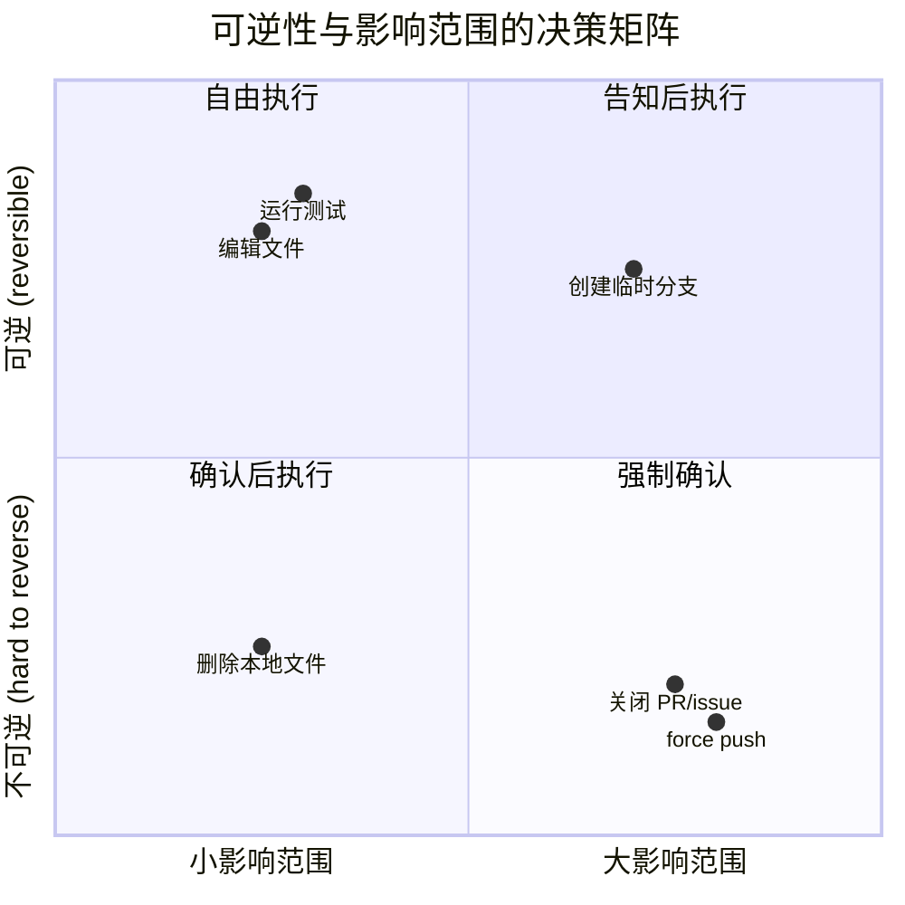

# 第6章：通过提示词引导行为

> 第5章剖析了系统提示词的组装架构 -- 段落注册、缓存边界、多来源合成。但架构只是骨骼，真正让 Claude Code 表现出"像一个有经验的工程师"的，是骨骼上附着的肌肉：那些精心措辞的行为指令。本章将提炼出 6 种可复用的行为引导模式（behavior steering pattern），每种模式都有源码原文、生效原理、以及你可以直接搬进自己提示词的模板。

## 6.1 行为引导的本质：在生成概率空间中设定边界

大语言模型的输出是一个概率分布上的采样过程。系统提示词中的行为指令，本质上是在这个概率空间中竖起围栏 -- 提高期望行为的概率，压低不期望行为的概率。但围栏的措辞方式，决定了它是一堵坚固的墙还是一条模糊的线。

通读 Claude Code 的系统提示词源码（`restored-src/src/constants/prompts.ts` 与 `restored-src/src/tools/BashTool/prompt.ts`），可以发现 Anthropic 的工程师们并非随意堆砌指令，而是形成了一套隐含的模式语言（pattern language）。这些模式之所以有效，不仅因为它们"说了正确的话"，更因为它们在措辞结构上暗合了模型的注意力机制和指令遵循特性。

本章将这些模式显式化，命名为 6 种行为引导模式：

1. 极简主义指令（Minimalism Directive）
2. 渐进式升级（Progressive Escalation）
3. 可逆性意识（Reversibility Awareness）
4. 工具偏好引导（Tool Preference Steering）
5. Agent 委托指引（Agent Delegation Protocol）
6. 数值锚定（Numeric Anchoring）

## 6.2 模式一：极简主义指令（Minimalism Directive）

### 6.2.1 模式定义

**核心思想：** 通过明确禁止过度工程，将模型的"乐于助人"倾向限制在任务实际需要的范围内。

大语言模型天生倾向于"多做一点" -- 添加额外的错误处理、补充文档注释、引入抽象层。这在对话场景中是美德，但在代码生成场景中却是灾难。极简主义指令通过具体的反面案例，让模型知道"不做什么"比"做什么"更重要。

### 6.2.2 源码实例

**实例 1：三行代码优于过早抽象**

```
Don't create helpers, utilities, or abstractions for one-time operations.
Don't design for hypothetical future requirements. The right amount of
complexity is what the task actually requires — no speculative abstractions,
but no half-finished implementations either. Three similar lines of code
is better than a premature abstraction.
```

**源码位置：** `restored-src/src/constants/prompts.ts:203`

这段指令的最后一句 "Three similar lines of code is better than a premature abstraction" 是整个极简主义指令中最精彩的一笔。它给出了一个**具体的数量门槛** -- 三行 -- 让模型在面对"要不要提取一个公共函数"的决策时，有了明确的判断基准。没有这个锚点，模型会默认倾向于 DRY（Don't Repeat Yourself），而 DRY 在 AI 辅助编程的语境中常常导致过度抽象。

**实例 2：不要添加超出要求的功能**

```
Don't add features, refactor code, or make "improvements" beyond what was
asked. A bug fix doesn't need surrounding code cleaned up. A simple feature
doesn't need extra configurability. Don't add docstrings, comments, or type
annotations to code you didn't change. Only add comments where the logic
isn't self-evident.
```

**源码位置：** `restored-src/src/constants/prompts.ts:201`

注意这段指令的结构：先是一个总原则（"不要添加超出要求的功能"），然后是三个具体的反面案例（bug 修复不需要清理周围代码、简单功能不需要额外配置性、不要给未修改的代码加注释）。这种"总则 + 反面案例"的结构非常有效，因为模型在遵循指令时需要将抽象原则映射到具体场景，而反面案例提供了这种映射的锚点。

**实例 3：不要为不可能的场景添加防御（ant-only）**

```
Don't add error handling, fallbacks, or validation for scenarios that can't
happen. Trust internal code and framework guarantees. Only validate at system
boundaries (user input, external APIs). Don't use feature flags or
backwards-compatibility shims when you can just change the code.
```

**源码位置：** `restored-src/src/constants/prompts.ts:202`

这条指令直击一个常见的 LLM 行为模式：过度防御性编程。模型在训练数据中见过大量的"最佳实践"文章，这些文章强调处理每一种可能的错误。但在实际的内部代码中，许多错误路径永远不会被触发。这条指令通过"Trust internal code and framework guarantees"这个短语，赋予模型一个新的判断框架：区分系统边界和内部调用。

### 6.2.3 为什么有效

极简主义指令之所以有效，源于三个机制：

1. **反面案例比正面规则更容易遵循。** "不要做 X"比"只做 Y"更精确，因为 X 的边界比 Y 的边界更清晰。模型可以将生成的每个 token 与"这是不是在做 X"进行对照。
2. **具体数量打破默认启发式。** "三行重复代码"这样的数量锚定，覆盖了模型内置的 DRY 启发式。没有具体数字，模型会回退到训练数据中最常见的模式。
3. **场景分类减少歧义。** "bug 修复不需要清理周围代码"这类指令，将一个模糊的"什么时候该多做一点"问题，转化为一个明确的分类任务："当前任务是 bug 修复还是重构？"

### 6.2.4 可复用模板

```
[极简主义指令模板]

不要在任务范围之外添加 {功能/重构/改进}。
{任务类型 A} 不需要 {常见的过度工程行为 A}。
{任务类型 B} 不需要 {常见的过度工程行为 B}。
{N} 行重复代码优于过早抽象。
只在 {明确的边界条件} 时才 {采取额外行动}。
```

## 6.3 模式二：渐进式升级（Progressive Escalation）

### 6.3.1 模式定义

**核心思想：** 在"放弃"和"死循环"之间定义一条中间路径，引导模型先诊断、再调整、最后求助。

LLM 在面对失败时有两种极端倾向：要么立即放弃并请求用户帮助，要么不断重试完全相同的操作。渐进式升级模式通过定义一个明确的三阶段协议 -- 诊断、调整、求助 -- 将模型的失败响应锁定在合理的范围内。

### 6.3.2 源码实例

**实例 1：失败处理三阶段**

```
If an approach fails, diagnose why before switching tactics — read the error,
check your assumptions, try a focused fix. Don't retry the identical action
blindly, but don't abandon a viable approach after a single failure either.
Escalate to the user with ask_user_question only when you're genuinely stuck
after investigation, not as a first response to friction.
```

**源码位置：** `restored-src/src/constants/prompts.ts:233`

这段指令在一个段落中定义了完整的失败处理协议：

- **阶段 1（诊断）：** "read the error, check your assumptions" -- 先理解发生了什么
- **阶段 2（调整）：** "try a focused fix" -- 基于诊断结果做有针对性的修改
- **阶段 3（求助）：** "Escalate to the user... only when you're genuinely stuck" -- 在真正的死胡同处才请求帮助

关键的设计在于两个"不要"之间的张力："Don't retry the identical action blindly"（禁止死循环）和 "don't abandon a viable approach after a single failure"（禁止过早放弃）。这种双边约束迫使模型在两个极端之间寻找中间路径。

**实例 2：Git 操作中的诊断优先**

```
Before running destructive operations (e.g., git reset --hard, git push
--force, git checkout --), consider whether there is a safer alternative
that achieves the same goal. Only use destructive operations when they are
truly the best approach.
```

**源码位置：** `restored-src/src/tools/BashTool/prompt.ts:306`

这条指令要求在执行高风险操作前进行一次"是否有更安全的替代方案"的评估。它不是简单地禁止这些操作，而是要求模型在选择之前完成一个推理步骤。

**实例 3：Sleep 命令的诊断替代**

```
Do not retry failing commands in a sleep loop — diagnose the root cause.
```

**源码位置：** `restored-src/src/tools/BashTool/prompt.ts:318`

这是渐进式升级模式的最简形式：一句话同时包含禁止（"不要在 sleep 循环中重试"）和替代方案（"诊断根本原因"）。它特别针对一个常见的 LLM 行为模式 -- 当命令失败时，模型可能会在循环中 `sleep && retry`，这在交互式环境中是灾难性的。

### 6.3.3 为什么有效

渐进式升级的有效性来自于：

1. **双边约束创造张力。** 同时定义"不要太快放弃"和"不要无限重试"，让模型在每次失败后必须进行一次显式的推理："我是在盲目重试，还是在做有信息量的调整？"
2. **阶段顺序映射到 Chain-of-Thought。** 诊断 -> 调整 -> 求助的顺序，与模型的推理链（chain of thought）自然对齐。模型可以将这个协议直接编码为思维链中的步骤。
3. **求助作为最后手段。** 将"问用户"设定为最后选项，减少了不必要的交互中断，提高了自主完成率。

### 6.3.4 可复用模板

```
[渐进式升级模板]

当 {操作} 失败时，先 {诊断动作}（{具体诊断步骤列表}）。
不要盲目重试相同的操作，但也不要在一次失败后就放弃可行的方案。
只在 {升级条件} 时才 {升级动作}，而非将其作为遇到阻力时的第一反应。
```

## 6.4 模式三：可逆性意识（Reversibility Awareness）

### 6.4.1 模式定义

**核心思想：** 按照操作的可逆性和影响范围分级，对高风险操作建立确认框架。

这是 Claude Code 提示词工程中最复杂、也最精心设计的模式。它不是简单地列出"危险操作"，而是建立了一个完整的风险评估框架，教会模型"三思而后行"（measure twice, cut once）。

### 6.4.2 源码实例

**实例 1：可逆性分析框架**

```
Carefully consider the reversibility and blast radius of actions. Generally
you can freely take local, reversible actions like editing files or running
tests. But for actions that are hard to reverse, affect shared systems beyond
your local environment, or could otherwise be risky or destructive, check
with the user before proceeding.
```

**源码位置：** `restored-src/src/constants/prompts.ts:258`

这段指令引入了两个关键维度：**可逆性（reversibility）** 和**影响范围（blast radius）**。这两个维度构成一个 2x2 决策矩阵：



**图 6-1：可逆性与影响范围的决策矩阵。** Claude Code 通过这两个维度将操作分为四类，从"自由执行"到"强制确认"。

**实例 2：高风险操作详尽列表**

源码提供了四大类需要确认的操作，每一类都附有具体例子（`restored-src/src/constants/prompts.ts:261-264`）：

| 风险类别 | 原文 | 具体操作示例 |
|---------|------|-------------|
| 破坏性操作 | Destructive operations | 删除文件/分支、drop 数据库表、kill 进程、rm -rf、覆盖未提交更改 |
| 难以逆转的操作 | Hard-to-reverse operations | force push、git reset --hard、修改已发布的 commit、删除/降级依赖、修改 CI/CD 流水线 |
| 对他人可见的操作 | Actions visible to others | push 代码、创建/关闭/评论 PR 或 issue、发送消息（Slack/email/GitHub）、修改共享基础设施 |
| 第三方上传 | Uploading content to third-party tools | 上传到图表渲染器、pastebin、gist（可能被缓存或索引） |

**实例 3：Git 安全协议**

```
Git Safety Protocol:
- NEVER update the git config
- NEVER run destructive git commands (push --force, reset --hard, checkout .,
  restore ., clean -f, branch -D) unless the user explicitly requests these
  actions.
- NEVER skip hooks (--no-verify, --no-gpg-sign, etc) unless the user
  explicitly requests it
- NEVER run force push to main/master, warn the user if they request it
- CRITICAL: Always create NEW commits rather than amending, unless the user
  explicitly requests a git amend. When a pre-commit hook fails, the commit
  did NOT happen — so --amend would modify the PREVIOUS commit, which may
  result in destroying work or losing previous changes.
```

**源码位置：** `restored-src/src/tools/BashTool/prompt.ts:87-94`

Git 安全协议是可逆性意识模式的最精致实现。注意几个设计要点：

1. **NEVER 大写** -- 不是"避免"或"尽量不要"，而是绝对禁止。大写字母在提示词中起到类似"提高注意力权重"的作用。
2. **"unless the user explicitly requests"** -- 每条 NEVER 规则都附带一个明确的豁免条件，避免模型在用户明确要求时仍然拒绝。
3. **CRITICAL 标记 + 因果解释** -- 对于 amend vs. new commit 这个最微妙的规则，不仅标记了 CRITICAL，还解释了**为什么**这条规则存在（hook 失败时 commit 尚未发生，amend 会修改前一个 commit）。因果解释让模型能在新场景中泛化规则的精神，而不仅仅机械地遵循字面意思。

**实例 4：一次授权不等于永久授权**

```
A user approving an action (like a git push) once does NOT mean that they
approve it in all contexts, so unless actions are authorized in advance in
durable instructions like CLAUDE.md files, always confirm first.
Authorization stands for the scope specified, not beyond. Match the scope
of your actions to what was actually requested.
```

**源码位置：** `restored-src/src/constants/prompts.ts:258`

这条指令直击 LLM 的一个危险倾向：从单次许可推广到通用许可。模型在上下文中看到用户之前同意了 `git push`，可能会在后续的不同场景中不经确认就执行 push。这条规则通过"scope specified, not beyond"这个表述，建立了一个精确的授权作用域概念。

### 6.4.3 为什么有效

可逆性意识的有效性来自：

1. **维度分析替代枚举。** 与其列出所有危险操作（不可能穷举），不如教会模型使用"可逆性"和"影响范围"两个维度自主评估。具体的例子列表起辅助校准作用，而非完整覆盖。
2. **NEVER + unless 的精确豁免。** 绝对禁止 + 明确例外的组合，避免了模型在模糊地带的"创造性解读"。
3. **因果解释促进泛化。** 解释"为什么"这条规则存在（如 amend 的因果链），让模型能在未见过的场景中推导出正确行为。
4. **"measure twice, cut once"的助记性。** 文末的这个英语成语，作为整个框架的认知锚点，帮助模型在面对边界情况时回忆起整个风险评估协议。

### 6.4.4 可复用模板

```
[可逆性意识模板]

在执行操作前，评估其可逆性和影响范围。
你可以自由执行 {可逆的本地操作列表}。
对于 {不可逆/影响共享系统} 的操作，在执行前与用户确认。

绝对不要（NEVER）：
- {危险操作 1}，除非用户明确要求
- {危险操作 2}，除非用户明确要求
- [关键] {最微妙的危险操作}，因为 {因果解释}

用户一次批准 {操作} 不代表在所有上下文中批准。
授权仅限于指定的范围。
```

## 6.5 模式四：工具偏好引导（Tool Preference Steering）

### 6.5.1 模式定义

**核心思想：** 通过工具描述文本将模型的工具选择从通用 Bash 命令重定向到专用工具。

Claude Code 提供了丰富的专用工具（Read、Edit、Write、Glob、Grep），但模型的训练数据中充斥着 `cat`、`grep`、`sed`、`find` 等 Unix 命令。如果不加引导，模型会自然倾向于通过 Bash 工具执行这些命令。工具偏好引导模式在工具描述的最早位置插入重定向指令，截获模型的默认工具选择路径。

### 6.5.2 源码实例

**实例 1：Bash 工具描述中的前置拦截**

```
IMPORTANT: Avoid using this tool to run find, grep, cat, head, tail, sed,
awk, or echo commands, unless explicitly instructed or after you have
verified that a dedicated tool cannot accomplish your task. Instead, use the
appropriate dedicated tool as this will provide a much better experience for
the user:

 - File search: Use Glob (NOT find or ls)
 - Content search: Use Grep (NOT grep or rg)
 - Read files: Use Read (NOT cat/head/tail)
 - Edit files: Use Edit (NOT sed/awk)
 - Write files: Use Write (NOT echo >/cat <<EOF)
 - Communication: Output text directly (NOT echo/printf)
```

**源码位置：** `restored-src/src/tools/BashTool/prompt.ts:280-291`（由 `getSimplePrompt()` 拼装）

这段指令的设计有三层精巧之处：

1. **位置优先。** 这段文本出现在 Bash 工具描述的开头区域，紧跟工具的基本功能说明之后。当模型开始考虑调用 Bash 工具时，这段重定向指令是它首先遇到的约束。
2. **NOT 括号对照。** 每条映射规则都同时列出"应该用什么"和"不应该用什么"。`Use Grep (NOT grep or rg)` 这种格式创造了一个直接的二选一对照，减少了模型的决策犹豫。
3. **用户体验论证。** "this will provide a much better experience for the user" 给出了遵循此规则的理由，而非仅仅作为一个无条件命令。

**实例 2：系统提示词中的冗余强化**

```
Do NOT use the Bash to run commands when a relevant dedicated tool is
provided. Using dedicated tools allows the user to better understand and
review your work. This is CRITICAL to assisting the user:
  - To read files use Read instead of cat, head, tail, or sed
  - To edit files use Edit instead of sed or awk
  - To create files use Write instead of cat with heredoc or echo redirection
  - To search for files use Glob instead of find or ls
  - To search the content of files, use Grep instead of grep or rg
  - Reserve using the Bash exclusively for system commands and terminal
    operations that require shell execution.
```

**源码位置：** `restored-src/src/constants/prompts.ts:291-302`

注意这段内容与 Bash 工具描述中的映射表**几乎重复**。这不是疏忽，而是有意为之的**冗余强化（redundant reinforcement）**。在系统提示词和工具描述两个位置都放置相同的指令，确保无论模型的注意力路径从哪里经过，都会遇到这个约束。

**实例 3：嵌入式工具的条件适配**

```typescript
const embedded = hasEmbeddedSearchTools()

const toolPreferenceItems = [
  ...(embedded
    ? []
    : [
        `File search: Use ${GLOB_TOOL_NAME} (NOT find or ls)`,
        `Content search: Use ${GREP_TOOL_NAME} (NOT grep or rg)`,
      ]),
  `Read files: Use ${FILE_READ_TOOL_NAME} (NOT cat/head/tail)`,
  // ...
]
```

**源码位置：** `restored-src/src/tools/BashTool/prompt.ts:280-291`

当 Ant 内部构建版本（ant-native builds）将 `find` 和 `grep` 通过 shell alias 映射到嵌入式的 `bfs` 和 `ugrep` 时，指向 Glob/Grep 专用工具的重定向就变得不必要了。源码通过 `hasEmbeddedSearchTools()` 条件判断，在这种情况下跳过这两条映射。这种条件适配确保了提示词不会包含自相矛盾的指令。

### 6.5.3 为什么有效

工具偏好引导的有效性来自：

1. **截获决策路径的最早点。** 模型在选择工具时，首先读取工具描述。在 Bash 工具的描述中插入"不要用我做 X，去用 Y"，相当于在模型做出选择之前就进行了干预。
2. **二选一对照消除歧义。** `Use Grep (NOT grep or rg)` 的格式将一个开放性选择（"用哪个工具搜索"）转化为一个二元判断（"用 Grep 工具还是 grep 命令"），降低了决策复杂度。
3. **冗余强化覆盖注意力盲区。** 模型的注意力在长上下文中会衰减。在两个不同位置放置相同约束，提高了约束被"看见"的概率。

### 6.5.4 可复用模板

```
[工具偏好引导模板]

当需要 {操作类别} 时，使用 {专用工具名}（而非 {通用替代命令列表}）。
使用专用工具可以 {用户体验收益}。

{通用工具名} 仅用于 {明确的合法用途列表}。
如果不确定，默认使用专用工具，只在 {回退条件} 时使用 {通用工具名}。
```

## 6.6 模式五：Agent 委托指引（Agent Delegation Protocol）

### 6.6.1 模式定义

**核心思想：** 为多 Agent 协作定义精确的委托规则，防止递归派生、上下文污染和结果捏造。

当一个 AI 系统可以派生子 Agent 时，新的失败模式随之出现：Agent 可能无限递归派生自己、可能窥探子 Agent 的中间输出（污染自己的上下文）、可能在子 Agent 返回结果前就编造结果。Agent 委托指引模式通过一组精确的规则来防止这些失败模式。

### 6.6.2 源码实例

**实例 1：Fork vs. 全新 Agent 的选择框架**

```
Fork yourself (omit subagent_type) when the intermediate tool output isn't
worth keeping in your context. The criterion is qualitative — "will I need
this output again" — not task size.
- Research: fork open-ended questions. If research can be broken into
  independent questions, launch parallel forks in one message. A fork beats
  a fresh subagent for this — it inherits context and shares your cache.
- Implementation: prefer to fork implementation work that requires more than
  a couple of edits.
```

**源码位置：** `restored-src/src/tools/AgentTool/prompt.ts:83-88`

这段指令建立了 fork（继承上下文的分叉）和 fresh agent（全新 Agent）之间的选择标准。关键洞察是判断标准不是任务大小，而是"我以后还需要看这些输出吗"。这个定性标准虽然模糊，但配合下面两个具体场景（研究和实现），为模型提供了足够的锚点。

**实例 2："不要偷看" -- 上下文卫生规则**

```
Don't peek. The tool result includes an output_file path — do not Read or
tail it unless the user explicitly asks for a progress check. You get a
completion notification; trust it. Reading the transcript mid-flight pulls
the fork's tool noise into your context, which defeats the point of forking.
```

**源码位置：** `restored-src/src/tools/AgentTool/prompt.ts:91`

"Don't peek"（不要偷看）可能是整个 Claude Code 提示词中最具创意的短语之一。它用两个日常词汇精确描述了一个复杂的技术约束：**不要读取子 Agent 的中间输出文件**。随后的解释给出了原因 -- 这样做会将子 Agent 的工具噪声拉入主 Agent 的上下文，违背了 fork 的初衷（保持主上下文干净）。

这条规则对应的工程问题是：fork 子 Agent 的结果会写入一个文件，主 Agent 有能力通过 Read 工具读取这个文件。如果主 Agent 在子 Agent 完成前读取了中间结果，那些半成品的工具调用输出就会进入主 Agent 的上下文窗口，浪费宝贵的 token 预算。

**实例 3："不要竞争" -- 结果捏造防护**

```
Don't race. After launching, you know nothing about what the fork found.
Never fabricate or predict fork results in any format — not as prose,
summary, or structured output. The notification arrives as a user-role
message in a later turn; it is never something you write yourself. If the
user asks a follow-up before the notification lands, tell them the fork is
still running — give status, not a guess.
```

**源码位置：** `restored-src/src/tools/AgentTool/prompt.ts:93`

"Don't race"（不要竞争）防止了一种微妙但危险的失败模式：主 Agent 在派出 fork 后，可能会"预测"fork 的结果并提前生成回复。这种行为在用户看来可能像是"聪明的预判"，但实际上是纯粹的幻觉 -- 主 Agent 根本不知道 fork 发现了什么。

这段指令的设计格外严格：不仅禁止"编造结果"，还明确禁止了所有可能的变体形式 -- "not as prose, summary, or structured output"。这种穷举式的格式禁止，是因为模型可能会尝试以不同的输出形式来规避字面上的禁止。

**实例 4：Fork 子 Agent 的身份锚定**

```
STOP. READ THIS FIRST.

You are a forked worker process. You are NOT the main agent.

RULES (non-negotiable):
1. Your system prompt says "default to forking." IGNORE IT — that's for the
   parent. You ARE the fork. Do NOT spawn sub-agents; execute directly.
2. Do NOT converse, ask questions, or suggest next steps
3. Do NOT editorialize or add meta-commentary
...
6. Do NOT emit text between tool calls. Use tools silently, then report
   once at the end.
```

**源码位置：** `restored-src/src/tools/AgentTool/forkSubagent.ts:172-194`

这是委托协议中最戏剧性的片段。fork 子 Agent 继承了父 Agent 的完整系统提示词，而父提示词中包含"default to forking"的指令。如果不加干预，子 Agent 会读到这条指令并尝试再次 fork -- 造成无限递归。

解决方案是在 fork 子 Agent 的消息开头插入一个"身份覆盖"指令：先以全大写的 "STOP. READ THIS FIRST." 抢占注意力，然后明确声明"You ARE the fork"，最后直接指出"Your system prompt says 'default to forking.' IGNORE IT"。这种"承认矛盾指令的存在并显式覆盖它"的技巧，比简单地希望模型忽略某段提示词要可靠得多。

### 6.6.3 为什么有效

Agent 委托指引的有效性来自：

1. **拟人化动词建立直觉。** "Don't peek"和"Don't race"比"不要读取子 Agent 的输出文件"和"不要在收到通知前生成结果"更容易记忆和遵循。拟人化让抽象的技术约束变成了社交直觉。
2. **穷举式格式禁止。** "not as prose, summary, or structured output" 封堵了模型可能的规避路径。
3. **显式矛盾解决。** 承认子 Agent 会看到父 Agent 的"fork"指令，然后显式覆盖，比假设模型会正确处理矛盾指令更可靠。
4. **身份锚定 + 输出格式约束。** fork 子 Agent 的"STOP. READ THIS FIRST."配合严格的输出格式（Scope: / Result: / Key files: / Files changed: / Issues:），将子 Agent 的行为限定在一个非常狭窄的通道中。

### 6.6.4 可复用模板

```
[Agent 委托指引模板]

## 何时 fork
当 {中间输出不值得保留在上下文中} 时，fork 自己。
判断标准是 {定性标准}，而非 {常见误判标准}。

## fork 后的行为
- 不要偷看：{子 Agent} 的中间输出不要读取，等待完成通知。
  原因：{上下文污染的具体后果}。
- 不要竞争：在 {子 Agent} 返回前，不要以任何形式
  （{格式列表}）预测或编造其结果。
  如果用户追问，回复 {状态信息}，而非猜测。

## fork 子 Agent 的身份
你是一个 fork 工作进程，不是主 Agent。
父提示词中的 {可能导致递归的指令} 不适用于你 -- 直接执行，不要再委托。
```

## 6.7 模式六：数值锚定（Numeric Anchoring）

### 6.7.1 模式定义

**核心思想：** 用精确的数字替代模糊的定性描述，给模型一个可以直接对照的输出标尺。

"简洁一些"、"保持简短"、"不要太冗长" -- 这类定性指令几乎没有约束力，因为模型对"简洁"的理解依赖于训练数据中的分布，而这个分布因领域和风格而异。数值锚定通过给出具体数字，将一个主观判断转化为一个可度量的约束。

### 6.7.2 源码实例

**实例 1：工具调用间文字长度限制**

```
Length limits: keep text between tool calls to ≤25 words. Keep final
responses to ≤100 words unless the task requires more detail.
```

**源码位置：** `restored-src/src/constants/prompts.ts:534`

这段指令目前仅对 Anthropic 内部用户（ant-only）启用，附有以下注释：

```typescript
// Numeric length anchors — research shows ~1.2% output token reduction vs
// qualitative "be concise". Ant-only to measure quality impact first.
```

**源码位置：** `restored-src/src/constants/prompts.ts:527-528`

1.2% 的 output token 削减可能听起来不多，但考虑到 Claude Code 每天处理的请求量，这个百分比在成本节约上的绝对值相当可观。更重要的是，这 1.2% 是仅通过将"be concise"替换为"≤25 words"就获得的 -- 零代码变更，纯提示词优化。

注意两个数值锚定的不同设计：
- **≤25 词（工具调用间）**：这是一个硬性约束，因为工具调用之间的文字通常是不必要的 -- 模型应该直接调用下一个工具，而不是向用户解释自己在做什么。
- **≤100 词（最终响应）**：这带有一个豁免条件（"unless the task requires more detail"），因为最终响应的长度确实取决于任务复杂度。

**实例 2：fork 子 Agent 的报告长度限制**

```
8. Keep your report under 500 words unless the directive specifies otherwise.
   Be factual and concise.
```

**源码位置：** `restored-src/src/tools/AgentTool/forkSubagent.ts:186`

fork 子 Agent 的 500 词限制服务于一个明确的工程目标：子 Agent 的报告会被注入到主 Agent 的上下文中，过长的报告会浪费主 Agent 的上下文窗口。500 词大约相当于 600-700 个 token，是一个在"提供足够信息"和"节约上下文空间"之间的平衡点。

**实例 3：提交消息长度引导**

```
Draft a concise (1-2 sentences) commit message that focuses on the "why"
rather than the "what"
```

**源码位置：** `restored-src/src/tools/BashTool/prompt.ts:103`

"1-2 sentences"是另一种数值锚定形式 -- 不是词数，而是句数。这个锚定配合"focuses on the 'why' rather than the 'what'"这个内容指引，同时约束了长度和质量。

### 6.7.3 ant-only 实验效果

数值锚定模式是 Claude Code 中少数有明确量化效果数据的提示词优化之一：

| 指标 | 定性指令（"be concise"） | 数值锚定（"≤25 words"） | 变化 |
|------|------------------------|------------------------|------|
| Output token 消耗 | 基线 | -1.2% | 下降 |
| 部署范围 | 全量 | ant-only | 灰度 |
| 代码变更量 | N/A | 0 行 | 纯提示词 |
| 质量影响 | 基线 | 待测量 | 未知 |

**表 6-1：数值锚定的 ant-only 实验效果。** 目前仅对内部用户启用，以便在扩大部署前测量对输出质量的影响。

ant-only 的灰度部署策略本身也值得关注。源码中的条件判断：

```typescript
...(process.env.USER_TYPE === 'ant'
  ? [
      systemPromptSection(
        'numeric_length_anchors',
        () => 'Length limits: keep text between tool calls to ≤25 words...',
      ),
    ]
  : []),
```

这种模式在整个 Claude Code 提示词中反复出现：新的行为指令先对内部用户开放，收集数据后再决定是否推广到外部用户。这是提示词工程中的 A/B 测试方法论。

### 6.7.4 为什么有效

数值锚定的有效性来自：

1. **消除主观解释空间。** "25 words"没有歧义，"concise"有。模型可以在生成每个 token 后计数，判断是否接近阈值。
2. **锚定效应（Anchoring Effect）。** 认知心理学研究表明，人类在进行数量估计时会被先前的数字锚定。LLM 的行为与此类似 -- 提示词中出现的数字会成为输出长度的参考点。
3. **硬约束 + 软豁免的组合。** "≤25 words"是硬约束，"unless the task requires more detail"是软豁免。这种组合让模型默认遵守数字限制，但在合理情况下可以突破。

### 6.7.5 可复用模板

```
[数值锚定模板]

长度限制：
- {输出类型 A} 保持在 ≤{N} 词/句/行以内。
- {输出类型 B} 保持在 ≤{M} 词/句/行以内，除非 {豁免条件}。
保持事实性和简洁性。
```

## 6.8 模式汇总

下表总结了本章提炼的 6 种行为引导模式，每种模式附有代表性的源码原文和可直接复用的提示词模板：

| # | 模式名 | 源码原文（代表性引用） | 可复用模板 |
|---|--------|----------------------|-----------|
| 1 | **极简主义指令** | "Three similar lines of code is better than a premature abstraction." `prompts.ts:203` | 不要在任务范围外添加{X}。{N}行重复代码优于过早抽象。只在{边界条件}时才{额外行动}。 |
| 2 | **渐进式升级** | "Don't retry the identical action blindly, but don't abandon a viable approach after a single failure either." `prompts.ts:233` | 当{操作}失败时，先{诊断}。不要盲目重试，也不要一次失败就放弃。只在{条件}时才{升级}。 |
| 3 | **可逆性意识** | "Carefully consider the reversibility and blast radius of actions... measure twice, cut once." `prompts.ts:258-266` | 评估操作的可逆性和影响范围。可逆本地操作自由执行；不可逆/共享操作确认后执行。NEVER{危险操作}，unless 用户明确要求。 |
| 4 | **工具偏好引导** | "Use Grep (NOT grep or rg)" `BashTool/prompt.ts:285` | 当需要{操作}时，使用{专用工具}（而非{通用命令}）。在两个位置冗余放置映射表。 |
| 5 | **Agent 委托指引** | "Don't peek... Don't race..." `AgentTool/prompt.ts:91-93` | 不要偷看子Agent中间输出。不要在结果返回前以任何形式编造结果。fork子Agent显式声明身份，覆盖父提示词中的矛盾指令。 |
| 6 | **数值锚定** | "keep text between tool calls to ≤25 words" `prompts.ts:534` | {输出类型}保持在≤{N}词以内。用精确数字替代"简洁"等定性描述。硬约束+软豁免组合。 |

**表 6-2：6 种行为引导模式汇总。** 每种模式都有明确的适用场景和可复用的模板结构。

## 6.9 跨模式的设计原则

回顾这 6 种模式，可以归纳出几个跨模式的底层设计原则：

**原则一：反面定义优于正面描述。** "不要做 X"比"做 Y"更容易被模型遵循，因为禁止的边界比允许的边界更清晰。6 种模式中有 5 种大量使用了"Don't"/"NEVER"/"NOT"等否定形式。

**原则二：具体例子是抽象规则的校准器。** 每个抽象规则（"考虑可逆性"）都配有具体的例子列表（"git reset --hard, push --force..."）。例子不是规则的替代品，而是规则的校准点 -- 帮助模型理解规则的适用范围和颗粒度。

**原则三：因果解释促进泛化。** 当规则附带"因为..."的解释时（如 amend vs. new commit 的因果链），模型能在未见过的场景中推导出规则的精神。纯命令式的规则只能在训练分布内生效；因果解释让规则超越字面意思。

**原则四：冗余是刻意的。** 工具偏好引导在两个位置放置相同的映射表，可逆性意识在系统提示词和 Bash 工具描述中都定义了 Git 安全规则。这种冗余不是疏忽，而是对抗注意力衰减的工程手段。

**原则五：灰度部署是提示词工程的一部分。** 数值锚定的 ant-only 实验表明，提示词修改也需要 A/B 测试和灰度发布 -- 就像代码变更一样。`USER_TYPE === 'ant'` 条件判断是这种方法论在代码中的体现。

## 6.10 用户能做什么

基于本章提炼的 6 种行为引导模式，以下是读者可以直接搬进自己提示词的实操建议：

1. **用"不要做 X"替代"做 Y"。** 审视你现有的提示词，将正面描述转化为反面约束。"生成简洁的代码"不如"不要添加超出要求的功能。bug 修复不需要清理周围代码。"具体的反面案例比抽象的正面目标更容易被模型遵循。

2. **为失败场景定义三阶段协议。** 如果你的 Agent 需要处理可能失败的操作（API 调用、命令执行、文件操作），在提示词中明确定义"诊断 -> 调整 -> 求助"的升级路径。同时禁止两个极端：盲目重试和一次失败就放弃。

3. **用数字替代形容词。** 将"保持简洁"替换为"≤25 词"或"1-2 句"。Claude Code 的数据显示，仅这一项改动就带来了 1.2% 的 output token 削减。在你自己的场景中，为每种输出类型设定具体的数量上限。

4. **在工具描述中插入重定向表。** 如果你的工具集中有一个"万能工具"（如 Bash），在其描述的最早位置列出"什么场景该用什么替代工具"的映射表。同时在专用工具的描述中声明排他性。双向闭环比单向约束有效得多。

5. **为高风险操作建立可逆性评估框架。** 不要简单地列出"危险操作清单"（不可能穷举），而是教会模型使用"可逆性"和"影响范围"两个维度自主评估。配合 NEVER + unless 的精确豁免结构，给模型一个可执行的决策框架。

6. **先在小范围灰度验证。** 新的行为指令先对一小部分用户或场景开放，收集效果数据后再推广。Claude Code 的 `USER_TYPE === 'ant'` 灰度机制是一个可参考的模式 -- 提示词修改也需要 A/B 测试。

## 6.11 小结

本章从 Claude Code 的源码中提炼了 6 种命名的行为引导模式。这些模式不是随意的措辞选择，而是经过实验验证的工程实践 -- 从极简主义指令的"三行代码"锚点，到数值锚定的 1.2% token 削减，每种模式都有其明确的设计意图和可度量的效果。

这些模式的共同特征是**精确性**：用具体数字替代模糊形容词、用反面案例替代正面描述、用因果解释替代无条件命令。这种精确性不是偶然的 -- 它反映了一个基本事实：大语言模型遵循指令的可靠性，与指令的精确度正相关。

> 下一章将转向运行时行为的观察与调试：当这些精心设计的提示词在实际对话中遇到意外情况时，系统如何检测、记录和应对。

---

## 版本演化：v2.1.91 变化

> 以下分析基于 v2.1.91 bundle 信号对比。

v2.1.91 新增 `tengu_rate_limit_lever_hint` 事件，暗示引入了一种新的限速引导机制——当模型接近速率限制时，通过提示词层面的"杠杆提示"引导模型调整行为（如减少工具调用频率或使用更轻量的操作），而非简单等待限速解除。
