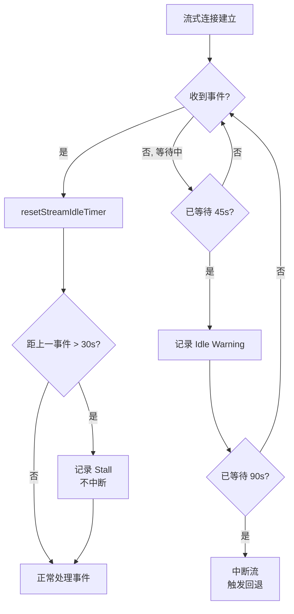

# 第6b章：API 通信层 — 重试、流式与降级工程

> **定位**：本章分析 CC 的 API 通信韧性子系统——指数退避重试、529 过载降级、双重看门狗流式中断检测与 Fast Mode 缓存感知重试。前置依赖：第3章（Agent Loop）。适用场景：想理解 CC 的重试策略、流式处理、降级工程的读者，或自己需要构建稳健 API 通信层的开发者。

> `services/api/` 目录不是一个 SDK 封装层——它是 Agent 的**控制平面**（Control Plane）。模型降级、缓存保护、文件传输、Prompt 回放调试，这些决策全部发生在这一层。本章聚焦其中最核心的韧性子系统：重试、流式和降级。文件传输通道（Files API）和 Prompt Replay 调试工具分别在本章末尾和第 29 章补充分析。

## 为什么这很重要

一个 Agent 系统的可靠性并不取决于模型有多智能，而取决于它在最差网络条件下是否还能正常工作。想象一个开发者在火车上使用 Claude Code 处理一个紧急 bug：WiFi 时断时续，API 偶尔返回 529 过载错误，一次流式响应在收到一半时突然中断。如果通信层没有足够的韧性设计，这位开发者要么看到一个莫名其妙的崩溃，要么不得不反复手动重试，浪费宝贵的上下文窗口。

Claude Code 的通信层解决的正是这类问题。它不是一个简单的"失败了就重试"的包装器，而是一个多层防御系统：指数退避避免雪崩效应、529 计数器触发模型降级、双重看门狗检测流式中断、Fast Mode 缓存感知重试保护成本、持久模式支持无人值守场景。这些机制共同构成了一个核心工程理念：**通信失败是常态而非异常，系统必须在每一层都有预案。**

更值得关注的是这套系统的可观测性设计。每次 API 调用都会发出三个遥测事件——`tengu_api_query`（请求发出）、`tengu_api_success`（成功响应）、`tengu_api_error`（失败响应）——配合 25 种错误分类和网关指纹检测，让每一次通信故障都可追溯、可诊断。这是一个经过真实生产流量锤炼的系统，它的每一行代码都映射着一个曾经发生过的故障场景。

---

## 源码分析

> **交互式版本**：[点击查看重试与降级动画](retry-viz.html) — 4 种场景（正常/429 限流/529 过载/Fast Mode 降级）的时序图动画。

### 6b.1 重试策略：从指数退避到模型降级

Claude Code 的重试系统实现在 `withRetry.ts` 中，核心是一个 `AsyncGenerator` 函数 `withRetry()`，它在重试等待期间通过 `yield` 向上层传递 `SystemAPIErrorMessage`，让 UI 可以实时显示重试状态。

#### 常量与配置

重试系统的行为由一组精心调校的常量控制：

| 常量 | 值 | 用途 | 源码位置 |
|------|---|------|---------|
| `DEFAULT_MAX_RETRIES` | 10 | 默认重试预算 | `withRetry.ts:52` |
| `MAX_529_RETRIES` | 3 | 连续 529 过载后触发模型降级 | `withRetry.ts:54` |
| `BASE_DELAY_MS` | 500 | 指数退避基数（500ms × 2^(attempt-1)） | `withRetry.ts:55` |
| `PERSISTENT_MAX_BACKOFF_MS` | 5 分钟 | 持久模式最大退避上限 | `withRetry.ts:96` |
| `PERSISTENT_RESET_CAP_MS` | 6 小时 | 持久模式绝对上限 | `withRetry.ts:97` |
| `HEARTBEAT_INTERVAL_MS` | 30 秒 | 心跳间隔（防止容器空闲回收） | `withRetry.ts:98` |
| `SHORT_RETRY_THRESHOLD_MS` | 20 秒 | Fast Mode 短重试阈值 | `withRetry.ts:800` |
| `DEFAULT_FAST_MODE_FALLBACK_HOLD_MS` | 30 分钟 | Fast Mode 冷却时间 | `withRetry.ts:799` |

10 次重试预算看似慷慨，但结合指数退避（500ms → 1s → 2s → 4s → 8s → 16s → 32s × 4），总等待约 2.5-3 分钟。实际实现还会在每次退避上叠加 0-25% 的随机抖动（Jitter，`withRetry.ts:542-547`），避免多个客户端在同一时刻同步重试导致雷群效应（Thundering Herd）。这是一个经过权衡的设计：足够多以应对短暂的网络抖动，又不至于让用户在 API 彻底不可用时等待太久。

#### 重试决策：shouldRetry 函数

`shouldRetry()` 函数是重试系统的核心决策器，定义在 `withRetry.ts:696-787`。它接收一个 `APIError`，返回一个布尔值。分析其所有返回路径，可以归纳为三类：

**绝不重试的情况：**

| 条件 | 返回 | 原因 |
|------|-----|------|
| Mock 错误（测试用） | `false` | 来自 `/mock-limits` 命令，不应被重试覆盖 |
| `x-should-retry: false`（非 ant 用户或非 5xx） | `false` | 服务端明确指示不重试 |
| 无状态码且非连接错误 | `false` | 无法判断错误类型 |
| ClaudeAI 订阅用户的 429（非企业版） | `false` | Max/Pro 用户的限额是小时级别的，重试无意义 |

**总是重试的情况：**

| 条件 | 返回 | 原因 |
|------|-----|------|
| 持久模式下的 429/529 | `true` | 无人值守场景需要无限重试 |
| CCR 模式下的 401/403 | `true` | 远程环境的认证是基础设施管理的，短暂失败可恢复 |
| 上下文溢出错误（400） | `true` | 可解析错误消息并自动调整 `max_tokens`（`withRetry.ts:726`） |
| 错误消息包含 `overloaded_error` | `true` | SDK 在流式模式下有时无法正确传递 529 状态码 |
| `APIConnectionError`（连接错误） | `true` | 网络瞬断是最常见的暂时性错误 |
| 408（请求超时） | `true` | 服务端超时，重试通常能成功 |
| 409（锁超时） | `true` | 后端资源竞争，重试通常能成功 |
| 401（认证错误） | `true` | 清除 API key 缓存后重试 |
| 403（OAuth token 被撤销） | `true` | 另一个进程刷新了 token |
| 5xx（服务端错误） | `true` | 服务端内部错误通常是暂时的 |

**条件重试的情况：**

| 条件 | 返回 | 原因 |
|------|-----|------|
| `x-should-retry: true` 且非 ClaudeAI 订阅用户，或虽为订阅用户但属于企业版 | `true` | 服务端指示重试，且用户类型支持 |
| 429（非 ClaudeAI 订阅或企业版） | `true` | 按量计费用户的速率限制是短暂的 |

这里有一个值得注意的设计决策：对于 ClaudeAI 订阅用户（Max/Pro），即使 `x-should-retry` header 为 `true`，也不重试 429 错误。原因在源码注释中说得很清楚：

```typescript
// restored-src/src/services/api/withRetry.ts:735-736
// For Max and Pro users, should-retry is true, but in several hours, so we shouldn't.
// Enterprise users can retry because they typically use PAYG instead of rate limits.
```

Max/Pro 用户的速率限制窗口是数小时级别的——重试只会白白消耗时间，不如直接告诉用户。这是**理解用户场景后的差异化决策**，而非一刀切的重试策略。

#### 错误分类的三层漏斗

Claude Code 的错误处理不是一个扁平的 switch-case，而是一个三层漏斗结构：

```
classifyAPIError()  — 19+ 种具体类型（用于遥测和诊断）
    ↓ 映射
categorizeRetryableAPIError()  — 4 种 SDK 类别（用于上层错误展示）
    ↓ 决策
shouldRetry()  — boolean（用于重试循环）
```

第一层 `classifyAPIError()`（`errors.ts:965-1161`）将错误细分为 25 种以上的具体类型，包括 `aborted`、`api_timeout`、`repeated_529`、`capacity_off_switch`、`rate_limit`、`server_overload`、`prompt_too_long`、`pdf_too_large`、`pdf_password_protected`、`image_too_large`、`tool_use_mismatch`、`unexpected_tool_result`、`duplicate_tool_use_id`、`invalid_model`、`credit_balance_low`、`invalid_api_key`、`token_revoked`、`oauth_org_not_allowed`、`auth_error`、`bedrock_model_access`、`server_error`、`client_error`、`ssl_cert_error`、`connection_error`、`unknown`。这些分类直接写入 `tengu_api_error` 遥测事件的 `errorType` 字段，使得线上问题可以精确归类。

第二层 `categorizeRetryableAPIError()`（`errors.ts:1163-1182`）将这些细分类型合并为 4 种 SDK 层面的类别：`rate_limit`（429 和 529）、`authentication_failed`（401 和 403）、`server_error`（408+）、`unknown`。这一层为上层 UI 提供简化的错误展示。

第三层就是 `shouldRetry()` 本身，做最终的布尔决策。

这种三层设计的好处是：诊断信息可以非常详细（25 种分类），而决策逻辑保持简洁（true/false）。两个关注点完全解耦。

#### 529 过载的特殊处理

529 错误在 Claude Code 的重试系统中有特殊地位。一个 529 意味着 API 后端容量不足——不同于 429（用户限速），这是系统级别的过载。

首先，不是所有请求源（Query Source）都会重试 529。`FOREGROUND_529_RETRY_SOURCES`（`withRetry.ts:62-82`）定义了一个白名单，只有前台请求（用户正在等待结果的请求）才会重试：

```typescript
// restored-src/src/services/api/withRetry.ts:57-61
// Foreground query sources where the user IS blocking on the result — these
// retry on 529. Everything else (summaries, titles, suggestions, classifiers)
// bails immediately: during a capacity cascade each retry is 3-10× gateway
// amplification, and the user never sees those fail anyway.
```

这是一个**系统级减载（load shedding）策略**：当后端过载时，后台任务（摘要生成、标题生成、建议生成）立即放弃而不是加入重试队列。每一次重试都是对过载后端的 3-10 倍放大效应——减少不必要的重试是缓解级联故障的关键。

其次，连续 3 次 529 后会触发模型降级。这个逻辑在 `withRetry.ts:327-364`：

```typescript
// restored-src/src/services/api/withRetry.ts:327-351
if (is529Error(error) &&
    (process.env.FALLBACK_FOR_ALL_PRIMARY_MODELS ||
     (!isClaudeAISubscriber() && isNonCustomOpusModel(options.model)))
) {
  consecutive529Errors++
  if (consecutive529Errors >= MAX_529_RETRIES) {
    if (options.fallbackModel) {
      logEvent('tengu_api_opus_fallback_triggered', {
        original_model: options.model,
        fallback_model: options.fallbackModel,
        provider: getAPIProviderForStatsig(),
      })
      throw new FallbackTriggeredError(
        options.model,
        options.fallbackModel,
      )
    }
    // ...
  }
}
```

`FallbackTriggeredError`（`withRetry.ts:160-168`）是一个专用的错误类。它不是普通的异常——它是一个**控制流信号**，被上层 Agent Loop 捕获后触发模型切换（通常从 Opus 降级到 Sonnet）。这种用异常做控制流的模式在很多场景中是反模式，但在这里是合理的：降级事件需要穿透多层调用栈到达 Agent Loop，异常是最自然的向上传播机制。

同样重要的是 `CannotRetryError`（`withRetry.ts:144-158`），它携带了 `retryContext`（包含当前模型、thinking 配置、max_tokens 覆盖等），让上层在决定如何处理失败时有足够的上下文信息。

### 6b.2 流式处理：双重看门狗

流式响应是 Claude Code 用户体验的核心——用户看到文字逐渐出现，而不是等待一个漫长的空白页。但流式连接比普通 HTTP 请求脆弱得多：TCP 连接可能被中间代理静默关闭，服务端可能在生成过程中挂起，SDK 的超时机制只覆盖初始连接而不覆盖数据流阶段。

Claude Code 在 `claude.ts` 中用两层看门狗解决这个问题。

#### Idle Timeout 看门狗（中断型）

```typescript
// restored-src/src/services/api/claude.ts:1877-1878
const STREAM_IDLE_TIMEOUT_MS =
  parseInt(process.env.CLAUDE_STREAM_IDLE_TIMEOUT_MS || '', 10) || 90_000
const STREAM_IDLE_WARNING_MS = STREAM_IDLE_TIMEOUT_MS / 2
```

Idle 看门狗的设计是一个经典的**两阶段告警**模式：

1. **警告阶段**（45 秒）：如果 45 秒没有收到任何流式事件（chunk），记录一条警告日志和诊断事件 `cli_streaming_idle_warning`。此时流可能只是慢，不一定死了。
2. **超时阶段**（90 秒）：如果 90 秒完全没有事件，判定流已死。标记 `streamIdleAborted = true`，记录 `performance.now()` 快照（用于后续度量 abort 传播延迟），发送 `tengu_streaming_idle_timeout` 遥测事件，然后调用 `releaseStreamResources()` 强制中断流。

每当收到一个新的流式事件时，`resetStreamIdleTimer()` 重置两个定时器。这确保了只要流还活着——即使很慢——看门狗不会误杀它。

```typescript
// restored-src/src/services/api/claude.ts:1895-1928
function resetStreamIdleTimer(): void {
  clearStreamIdleTimers()
  if (!streamWatchdogEnabled) { return }
  streamIdleWarningTimer = setTimeout(/* 警告 */, STREAM_IDLE_WARNING_MS)
  streamIdleTimer = setTimeout(() => {
    streamIdleAborted = true
    streamWatchdogFiredAt = performance.now()
    // ... 日志和遥测
    releaseStreamResources()
  }, STREAM_IDLE_TIMEOUT_MS)
}
```

注意看门狗需要通过环境变量 `CLAUDE_ENABLE_STREAM_WATCHDOG` 显式启用。这说明该功能仍处于渐进式上线阶段——先在内部和小范围用户中验证，再推广到所有用户。

#### Stall 检测（日志型）

```typescript
// restored-src/src/services/api/claude.ts:1936
const STALL_THRESHOLD_MS = 30_000 // 30 seconds
```

Stall 检测与 Idle 看门狗解决的是不同的问题：

- **Idle** = "完全没有收到任何事件"（连接可能已经死了）
- **Stall** = "收到了事件，但两个事件之间间隔太大"（连接还活着，但服务端很慢）

Stall 检测只**记录**不**中断**。当两个流式事件之间的间隔超过 30 秒时，它累加 `stallCount` 和 `totalStallTime`，并发送 `tengu_streaming_stall` 遥测事件：

```typescript
// restored-src/src/services/api/claude.ts:1944-1965
if (lastEventTime !== null) {
  const timeSinceLastEvent = now - lastEventTime
  if (timeSinceLastEvent > STALL_THRESHOLD_MS) {
    stallCount++
    totalStallTime += timeSinceLastEvent
    logForDebugging(
      `Streaming stall detected: ${(timeSinceLastEvent / 1000).toFixed(1)}s gap between events (stall #${stallCount})`,
      { level: 'warn' },
    )
    logEvent('tengu_streaming_stall', { /* ... */ })
  }
}
lastEventTime = now
```

一个关键的细节：`lastEventTime` 在第一个 chunk 到达后才开始设置，避免将 TTFB（Time to First Token，首 token 延迟）误判为 stall。TTFB 可以合法地很高（模型在思考），但一旦开始输出，后续事件间隔就应该稳定。

两层看门狗的协作关系可以用下图表示：



#### 非流式回退

当流式连接被看门狗中断或因其他原因失败时，Claude Code 会回退到非流式（Non-streaming）请求模式。这个逻辑在 `claude.ts:2464-2569`。

回退时记录两个关键信息：

1. **`fallback_cause`**：`'watchdog'`（看门狗超时）或 `'other'`（其他错误），用于区分触发原因。
2. **`initialConsecutive529Errors`**：如果流式失败本身是 529 错误，将计数传递给非流式的重试循环。这确保了 529 计数在流式→非流式的切换中不会重置：

```typescript
// restored-src/src/services/api/claude.ts:2559
initialConsecutive529Errors: is529Error(streamingError) ? 1 : 0,
```

非流式回退有独立的超时配置：

```typescript
// restored-src/src/services/api/claude.ts:807-811
function getNonstreamingFallbackTimeoutMs(): number {
  const override = parseInt(process.env.API_TIMEOUT_MS || '', 10)
  if (override) return override
  return isEnvTruthy(process.env.CLAUDE_CODE_REMOTE) ? 120_000 : 300_000
}
```

CCR（Claude Code Remote）环境默认 2 分钟，本地环境默认 5 分钟。CCR 的超时更短是因为远程容器有 ~5 分钟的空闲回收机制——一个 5 分钟的 hang 会让容器被 SIGKILL，不如在 2 分钟时优雅超时。

值得一提的是，非流式回退可以通过 Feature Flag `tengu_disable_streaming_to_non_streaming_fallback` 或环境变量 `CLAUDE_CODE_DISABLE_NONSTREAMING_FALLBACK` 禁用。禁用的原因在源码注释中有清楚的解释：

```typescript
// restored-src/src/services/api/claude.ts:2464-2468
// When the flag is enabled, skip the non-streaming fallback and let the
// error propagate to withRetry. The mid-stream fallback causes double tool
// execution when streaming tool execution is active: the partial stream
// starts a tool, then the non-streaming retry produces the same tool_use
// and runs it again. See inc-4258.
```

这是一个真实的生产事故（inc-4258）催生的修复：当流式过程中已经开始执行工具，然后回退到非流式重试时，同一个工具会被执行两次。这种"部分完成 + 完整重试 = 重复执行"是所有流式系统的经典陷阱。

### 6b.3 Fast Mode 缓存感知重试

Fast Mode 是 Claude Code 的加速模式（详见第21章），它使用独立的模型名称来获得更高的吞吐量。Fast Mode 下的重试策略有一个独特的考量：**Prompt Cache**。

当 Fast Mode 遇到 429（速率限制）或 529（过载）时，重试决策的核心在于 `Retry-After` header 告知的等待时间（`withRetry.ts:267-305`）：

```typescript
// restored-src/src/services/api/withRetry.ts:284-304
const retryAfterMs = getRetryAfterMs(error)
if (retryAfterMs !== null && retryAfterMs < SHORT_RETRY_THRESHOLD_MS) {
  // Short retry-after: wait and retry with fast mode still active
  // to preserve prompt cache (same model name on retry).
  await sleep(retryAfterMs, options.signal, { abortError })
  continue
}
// Long or unknown retry-after: enter cooldown (switches to standard
// speed model), with a minimum floor to avoid flip-flopping.
const cooldownMs = Math.max(
  retryAfterMs ?? DEFAULT_FAST_MODE_FALLBACK_HOLD_MS,
  MIN_COOLDOWN_MS,
)
const cooldownReason: CooldownReason = is529Error(error)
  ? 'overloaded'
  : 'rate_limit'
triggerFastModeCooldown(Date.now() + cooldownMs, cooldownReason)
```

这个设计背后的成本权衡是：

| 场景 | 等待时间 | 策略 | 原因 |
|------|---------|------|------|
| `Retry-After < 20s` | 短暂 | 原地等待，保留 Fast Mode | 缓存不会因为 <20s 的等待而失效，保留缓存可以大幅减少下次请求的 token 成本 |
| `Retry-After ≥ 20s` 或未知 | 较长 | 切换到标准模式，进入冷却 | 缓存可能已失效，不如立即切换到标准模式恢复可用性 |

冷却期的下限是 10 分钟（`MIN_COOLDOWN_MS`），默认值是 30 分钟（`DEFAULT_FAST_MODE_FALLBACK_HOLD_MS`）。设置下限的目的是防止 Fast Mode 在限速边缘反复切换（flip-flopping），造成用户体验的不稳定。

另外，如果 429 是因为额外用量（Overage）不可用——即用户的订阅不支持超额使用——Fast Mode 会被**永久禁用**而非临时冷却：

```typescript
// restored-src/src/services/api/withRetry.ts:275-281
const overageReason = error.headers?.get(
  'anthropic-ratelimit-unified-overage-disabled-reason',
)
if (overageReason !== null && overageReason !== undefined) {
  handleFastModeOverageRejection(overageReason)
  retryContext.fastMode = false
  continue
}
```

### 6b.4 持久重试模式

设置环境变量 `CLAUDE_CODE_UNATTENDED_RETRY=1` 后，Claude Code 进入持久重试模式（Persistent Retry Mode）。这个模式为无人值守场景（CI/CD、批处理、ant 内部自动化）设计，其核心行为是：**对 429/529 无限重试**。

持久模式的三个关键设计：

**1. 无限循环 + 独立计数器**

普通模式下 `attempt` 从 1 增长到 `maxRetries + 1` 后循环终止。持久模式通过在循环末尾钳制 `attempt` 值来实现无限循环：

```typescript
// restored-src/src/services/api/withRetry.ts:505-506
// Clamp so the for-loop never terminates. Backoff uses the separate
// persistentAttempt counter which keeps growing to the 5-min cap.
if (attempt >= maxRetries) attempt = maxRetries
```

`persistentAttempt` 是一个独立的计数器，只在持久模式下递增，用于计算退避延迟。它不受 `maxRetries` 限制，所以退避时间会持续增长直到 5 分钟上限。

**2. 窗口级速率限制感知**

对于 429 错误，持久模式会检查 `anthropic-ratelimit-unified-reset` header 中的重置时间戳。如果服务端告知"5 小时后重置"，系统会直接等待到重置时间，而不是傻傻地每 5 分钟轮询一次：

```typescript
// restored-src/src/services/api/withRetry.ts:436-447
if (persistent && error instanceof APIError && error.status === 429) {
  persistentAttempt++
  const resetDelay = getRateLimitResetDelayMs(error)
  delayMs =
    resetDelay ??
    Math.min(
      getRetryDelay(persistentAttempt, retryAfter, PERSISTENT_MAX_BACKOFF_MS),
      PERSISTENT_RESET_CAP_MS,
    )
}
```

**3. 心跳保活**

这是持久模式中最巧妙的设计。当退避时间很长（比如 5 分钟）时，系统不是做一次 `sleep(300000)`，而是将其切片为多个 30 秒的片段，每个片段后 yield 一个 `SystemAPIErrorMessage`：

```typescript
// restored-src/src/services/api/withRetry.ts:489-503
let remaining = delayMs
while (remaining > 0) {
  if (options.signal?.aborted) throw new APIUserAbortError()
  if (error instanceof APIError) {
    yield createSystemAPIErrorMessage(
      error,
      remaining,
      reportedAttempt,
      maxRetries,
    )
  }
  const chunk = Math.min(remaining, HEARTBEAT_INTERVAL_MS)
  await sleep(chunk, options.signal, { abortError })
  remaining -= chunk
}
```

心跳机制解决了两个问题：

- **容器空闲回收**：CCR 等远程环境会将长时间无输出的进程判定为空闲并回收。每 30 秒的 yield 在 stdout 上产生活动，防止被误杀。
- **用户中断响应**：在每个 30 秒片段之间检查 `signal.aborted`，确保用户可以随时中断长时间的等待。如果是一次性的 `sleep(300s)`，用户按 Ctrl-C 后需要等到 sleep 结束才能生效。

源码中的 TODO 注释揭示了这个设计的权宜性质：

```typescript
// restored-src/src/services/api/withRetry.ts:94-95
// TODO(ANT-344): the keep-alive via SystemAPIErrorMessage yields is a stopgap
// until there's a dedicated keep-alive channel.
```

### 6b.5 API 可观测性

Claude Code 的 API 可观测性系统实现在 `logging.ts` 中，围绕三个遥测事件构建：

#### 三事件模型

| 事件 | 触发时机 | 关键字段 | 源码位置 |
|------|---------|---------|---------|
| `tengu_api_query` | 请求发出时 | model, messagesLength, betas, querySource, thinkingType, effortValue, fastMode | `logging.ts:196` |
| `tengu_api_success` | 成功响应时 | model, inputTokens, outputTokens, cachedInputTokens, ttftMs, costUSD, gateway, didFallBackToNonStreaming | `logging.ts:463` |
| `tengu_api_error` | 失败响应时 | model, error, status, errorType(25 种分类), durationMs, attempt, gateway | `logging.ts:304` |

这三个事件构成了一个完整的请求漏斗：query → success/error。通过关联 `requestId`，可以追踪一个请求从发出到完成的完整生命周期。

#### TTFB 与缓存命中

成功事件中最关键的性能指标是 `ttftMs`（Time to First Token）——从请求发出到第一个流式 chunk 到达的时间。这个指标直接反映了：

- 网络延迟（客户端到 API 端的往返时间）
- 排队延迟（请求在 API 后端排队的时间）
- 模型首 token 生成时间（与 prompt 长度和模型大小相关）

缓存相关字段（`cachedInputTokens` 和 `uncachedInputTokens` 即 `cache_creation_input_tokens`）让团队可以监控 Prompt Cache 的命中率，这直接影响成本和 TTFB。

#### 网关指纹检测

`logging.ts` 中一个容易被忽略的功能是网关检测（`detectGateway()`，`logging.ts:107-139`）。它通过响应 header 的前缀来识别请求是否经过了第三方 AI 网关：

| 网关 | Header 前缀 |
|------|------------|
| LiteLLM | `x-litellm-` |
| Helicone | `helicone-` |
| Portkey | `x-portkey-` |
| Cloudflare AI Gateway | `cf-aig-` |
| Kong | `x-kong-` |
| Braintrust | `x-bt-` |
| Databricks | 通过域名后缀检测 |

检测到网关后，`gateway` 字段会被加入成功和错误事件。这让 Anthropic 团队可以诊断"某些网关环境下的特定错误模式"——例如，如果通过 LiteLLM 代理时 404 错误率异常高，可能是代理配置问题而非 API 问题。

#### 错误分类的诊断价值

错误事件中的 `errorType` 使用 `classifyAPIError()` 的 25 种分类。相比简单的 HTTP 状态码，这些分类提供了更精确的诊断信息：

| 分类 | 含义 | 诊断价值 |
|------|-----|---------|
| `repeated_529` | 连续 529 超过阈值 | 区分偶发过载和持续不可用 |
| `tool_use_mismatch` | 工具调用/结果不匹配 | 提示上下文管理有 bug |
| `ssl_cert_error` | SSL 证书问题 | 提示用户检查代理配置 |
| `token_revoked` | OAuth token 被撤销 | 提示多实例竞争 token |
| `bedrock_model_access` | Bedrock 模型访问错误 | 提示用户检查 IAM 权限 |

---

## 模式提炼

### 模式一：有限重试预算 + 独立降级阈值

- **解决的问题**：无限重试导致用户等待和成本失控；同时，不同错误类型需要不同的耐心阈值
- **核心做法**：设定全局重试预算（10 次），同时为特定错误（529 过载）设定独立的子预算（3 次）。子预算耗尽触发降级而非放弃。两个计数器独立运行，互不干扰
- **前置条件**：必须有明确的降级方案（fallback model）；降级本身不应消耗主预算
- **源码引用**：`restored-src/src/services/api/withRetry.ts:52-54` — `DEFAULT_MAX_RETRIES=10`, `MAX_529_RETRIES=3`

### 模式二：双重看门狗（日志型 + 中断型）

- **解决的问题**：流式连接可能无声死亡——TCP keepalive 无法覆盖应用层的静默挂起
- **核心做法**：设置两层检测器。Stall 检测（30 秒）在事件间隔过大时只记录日志和遥测，不干预流——因为慢不等于死。Idle 看门狗（90 秒）在完全无事件时中断连接并触发回退——因为 90 秒无活动的流几乎确定已经死了
- **前置条件**：需要有非流式回退路径；看门狗需要可配置（不同网络环境的阈值不同）
- **源码引用**：`restored-src/src/services/api/claude.ts:1936` — Stall 检测, `restored-src/src/services/api/claude.ts:1877` — Idle 看门狗

### 模式三：缓存感知的重试决策

- **解决的问题**：重试可能导致 Prompt Cache 失效，而缓存失效意味着更高的 token 成本和更长的 TTFB
- **核心做法**：根据预期等待时间做差异化决策。短等待（<20 秒）→ 保留缓存原地等待，因为缓存在 20 秒内不会过期；长等待（>=20 秒）→ 放弃缓存切换模式，因为等待的时间成本超过了重建缓存的成本
- **前置条件**：API 需要提供 `Retry-After` header；需要有替代模式可切换
- **源码引用**：`restored-src/src/services/api/withRetry.ts:284-304`

### 模式四：心跳保活

- **解决的问题**：长时间 sleep 期间进程无输出，可能被宿主环境判定为空闲并回收
- **核心做法**：将一次长 sleep 切片为 N 个 30 秒片段，每个片段之后 yield 一个消息保持流活跃。同时在每个片段之间检查中断信号，确保用户可以随时取消
- **前置条件**：调用方需要是 `AsyncGenerator` 或类似的协程结构，能在等待期间产出中间结果
- **源码引用**：`restored-src/src/services/api/withRetry.ts:489-503`

---

### 6b.5 文件传输通道：Files API

`services/api/` 目录中还有一个常被忽视的子系统——`filesApi.ts`，它实现了与 Anthropic Public Files API 的文件上传/下载功能。这不是一个简单的 HTTP 客户端，而是服务于三个不同场景的文件传输通道：

| 场景 | 调用方 | 方向 | 用途 |
|------|--------|------|------|
| 会话启动文件附件 | `main.tsx` | 下载 | `--file=<id>:<path>` 参数指定的文件 |
| CCR 种子包上传 | `gitBundle.ts` | 上传 | 远程会话的代码库打包传输（详见第 20c 章） |
| BYOC 文件持久化 | `filePersistence.ts` | 上传 | 每轮结束后上传修改过的文件 |

`FilesApiConfig` 的设计揭示了一个重要约束——文件操作需要 OAuth session token（而不是 API key），因为文件与会话绑定：

```typescript
// restored-src/src/services/api/filesApi.ts:60-67
export type FilesApiConfig = {
  /** OAuth token for authentication (from session JWT) */
  oauthToken: string
  /** Base URL for the API (default: https://api.anthropic.com) */
  baseUrl?: string
  /** Session ID for creating session-specific directories */
  sessionId: string
}
```

文件大小上限为 500MB（`MAX_FILE_SIZE_BYTES`，第 82 行）。下载使用独立的重试逻辑（3 次指数退避，基数 500ms），而不是复用 `withRetry.ts` 的通用重试——因为文件下载的失败模式（超大文件、磁盘空间不足）与 API 调用的失败模式（429/529 过载）不同，需要独立的重试预算。

Beta 头部 `files-api-2025-04-14,oauth-2025-04-20`（第 27 行）表明这是一个仍在演进中的 API——`oauth-2025-04-20` 启用了 Bearer OAuth 在公共 API 路径上的认证支持。

---

## 用户能做什么

1. **理解 529 和模型降级的关系**。连续 3 次 529 过载后，Claude Code 会自动降级到 fallback 模型（通常从 Opus 降到 Sonnet）。如果你发现回答质量突然下降，可能是因为模型被降级了——检查终端输出中的 `tengu_api_opus_fallback_triggered` 事件。这不是 bug，而是系统在保护可用性。

2. **利用 Fast Mode 的缓存窗口**。Fast Mode 下的短暂 429（Retry-After < 20 秒）不会导致缓存失效——Claude Code 会原地等待保留缓存。但超过 20 秒的等待会触发至少 10 分钟的冷却期，期间切换到标准速度。如果你频繁看到 Fast Mode 冷却，可能需要降低请求频率。

3. **持久重试模式（v2.1.88 仅限 Anthropic 内部构建）**。`CLAUDE_CODE_UNATTENDED_RETRY=1` 启用无限重试（带指数退避，上限 5 分钟），支持按 `anthropic-ratelimit-unified-reset` header 等到限额重置。如果你在构建自己的 Agent，这种"心跳保活 + 限额感知等待"的模式值得借鉴。

4. **TTFB 是最关键的延迟指标**。在 `--verbose` 模式下，Claude Code 报告每次 API 调用的 TTFB（Time to First Token）。如果这个值异常高（>5 秒），可能表示 API 端过载或你的网络有问题。同时关注 `cachedInputTokens` 字段——如果这个值持续为 0，说明你的 Prompt Cache 没有命中，每次请求都在付全价（详见第 13 章）。

5. **自定义流式超时阈值**。如果你的网络环境延迟较高（例如通过 VPN 或卫星链路访问 API），默认的 90 秒 Idle Timeout 可能太激进。通过设置 `CLAUDE_STREAM_IDLE_TIMEOUT_MS` 环境变量（同时需要 `CLAUDE_ENABLE_STREAM_WATCHDOG=1`）可以调整超时阈值。

6. **通过 `CLAUDE_CODE_MAX_RETRIES` 调整重试预算**。默认 10 次重试适合大多数场景，但如果你的 API 提供商经常返回暂时性错误，可以适当增加；如果你希望更快地得到失败反馈，可以减少到 3-5 次。
