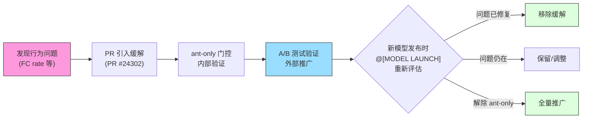

# 第7章：模型特定调优与 A/B 测试

> 第6章探讨了系统提示词如何被组装为发送给模型的指令集。但同一份提示词并非适用于所有模型 -- 每个模型世代都有独特的行为倾向，而 Anthropic 内部用户需要比外部用户更早地接触和验证新模型。本章将揭示 Claude Code 如何通过 `@[MODEL LAUNCH]` 注解系统、`USER_TYPE === 'ant'` 门控、GrowthBook Feature Flag 和 Undercover 模式，实现模型特定的提示词调优、内部 A/B 测试以及安全的公开仓库贡献。

## 7.1 模型发布检查清单：`@[MODEL LAUNCH]` 注解

在 Claude Code 的代码库中，散布着一种特殊的注释标记：

```typescript
// @[MODEL LAUNCH]: Update the latest frontier model.
const FRONTIER_MODEL_NAME = 'Claude Opus 4.6'
```

**源码参考：** `constants/prompts.ts:117-118`

这些 `@[MODEL LAUNCH]` 注解不是普通注释。它们构成了一个**分布式检查清单（distributed checklist）** -- 当新模型准备发布时，工程师只需在代码库中全局搜索 `@[MODEL LAUNCH]`，就能找到所有需要更新的位置。这种设计将发布流程的知识嵌入到代码本身中，而非依赖外部文档。

在 `prompts.ts` 中，`@[MODEL LAUNCH]` 标注了以下关键更新点：

| 行号 | 内容 | 更新动作 |
|------|------|----------|
| 117 | `FRONTIER_MODEL_NAME` 常量 | 更新为新模型的市场名称 |
| 120 | `CLAUDE_4_5_OR_4_6_MODEL_IDS` 对象 | 更新各层级模型 ID |
| 204 | 过度注释缓解指令 | 评估新模型是否仍需此缓解 |
| 210 | 彻底性反制权重 | 评估是否可解除 ant-only 门控 |
| 224 | 主动性反制权重 | 评估是否可解除 ant-only 门控 |
| 237 | 虚假声明缓解指令 | 评估新模型的 FC rate |
| 712 | `getKnowledgeCutoff` 函数 | 添加新模型的知识截止日期 |

在 `antModels.ts` 中：

| 行号 | 内容 | 更新动作 |
|------|------|----------|
| 32 | `tengu_ant_model_override` | 更新 Feature Flag 中的 ant-only 模型列表 |
| 33 | `excluded-strings.txt` | 添加新模型代号防止泄露到外部构建 |

这种模式的妙处在于**自文档化**：注解的文本本身就是操作说明。例如第 204 行的注解明确说明了解除条件："remove or soften once the model stops over-commenting by default"。工程师不需要查阅外部运维手册 -- 条件和动作都写在代码旁边。

## 7.2 Capybara v8 行为缓解

每个模型世代都有其独特的"个性缺陷"。Claude Code 的源码记录了 Capybara v8（Claude 4.5/4.6 系列的内部代号之一）的四个已知问题，以及针对每个问题的提示词级缓解措施。

### 7.2.1 过度注释（Over-commenting）

**问题：** Capybara v8 倾向于在代码中添加大量不必要的注释。

**缓解（第 204-209 行）：**

```typescript
// @[MODEL LAUNCH]: Update comment writing for Capybara —
// remove or soften once the model stops over-commenting by default
...(process.env.USER_TYPE === 'ant'
  ? [
      `Default to writing no comments. Only add one when the WHY is
       non-obvious...`,
      `Don't explain WHAT the code does, since well-named identifiers
       already do that...`,
      `Don't remove existing comments unless you're removing the code
       they describe...`,
    ]
  : []),
```

**源码参考：** `constants/prompts.ts:204-209`

这组指令构成了一个精细的评论哲学：默认不写注释，只在"为什么"不明显时添加；不解释代码做什么（标识符已经做了）；不删除你不理解的已有注释。注意第三条指令的微妙之处 -- 它既防止模型过度注释，又防止矫枉过正地删除有价值的已有注释。

### 7.2.2 虚假声明（False Claims）

**问题：** Capybara v8 的虚假声明率（False Claims rate）为 29-30%，显著高于 v4 的 16.7%。

**缓解（第 237-241 行）：**

```typescript
// @[MODEL LAUNCH]: False-claims mitigation for Capybara v8
// (29-30% FC rate vs v4's 16.7%)
...(process.env.USER_TYPE === 'ant'
  ? [
      `Report outcomes faithfully: if tests fail, say so with the
       relevant output; if you did not run a verification step, say
       that rather than implying it succeeded. Never claim "all tests
       pass" when output shows failures...`,
    ]
  : []),
```

**源码参考：** `constants/prompts.ts:237-241`

这条缓解指令的设计体现了一种对称性思维：它不仅要求模型不要虚报成功，还明确要求不要过度自我怀疑 -- "when a check did pass or a task is complete, state it plainly -- do not hedge confirmed results with unnecessary disclaimers"。工程师们发现，简单地告诉模型"不要撒谎"会导致模型走向另一个极端，对所有结果都加上不必要的免责声明。缓解措施的目标是**准确报告（accurate report），而非防御性报告（defensive report）**。

### 7.2.3 主动性过强（Over-assertiveness）

**问题：** Capybara v8 倾向于单纯执行用户指令，不提出自己的判断。

**缓解（第 224-228 行）：**

```typescript
// @[MODEL LAUNCH]: capy v8 assertiveness counterweight (PR #24302)
// — un-gate once validated on external via A/B
...(process.env.USER_TYPE === 'ant'
  ? [
      `If you notice the user's request is based on a misconception,
       or spot a bug adjacent to what they asked about, say so.
       You're a collaborator, not just an executor...`,
    ]
  : []),
```

**源码参考：** `constants/prompts.ts:224-228`

注解中的 "PR #24302" 表明这个缓解措施是经过代码审查流程引入的，而 "un-gate once validated on external via A/B" 则揭示了完整的发布策略：先在内部用户（ant）上验证，收集数据后再通过 A/B 测试推广到外部用户。

### 7.2.4 彻底性不足（Lack of Thoroughness）

**问题：** Capybara v8 倾向于在未验证结果的情况下声称任务完成。

**缓解（第 210-211 行）：**

```typescript
// @[MODEL LAUNCH]: capy v8 thoroughness counterweight (PR #24302)
// — un-gate once validated on external via A/B
`Before reporting a task complete, verify it actually works: run the
 test, execute the script, check the output. Minimum complexity means
 no gold-plating, not skipping the finish line.`,
```

**源码参考：** `constants/prompts.ts:210-211`

这条指令的最后一句尤为精妙："If you can't verify (no test exists, can't run the code), say so explicitly rather than claiming success." 它承认了现实中存在无法验证的情况，但要求模型明确承认这一点，而非默默假装一切正常。

### 7.2.5 缓解措施的生命周期

四个缓解措施共享一个统一的生命周期模式：



**图 7-1：模型缓解措施的完整生命周期。** 从发现问题到引入缓解，经过内部验证和 A/B 测试，最终在下一个 `@[MODEL LAUNCH]` 时重新评估。

## 7.3 `USER_TYPE === 'ant'` 门控：内部 A/B 测试暂存区

前面四个缓解措施都被包裹在同一个条件中：

```typescript
process.env.USER_TYPE === 'ant'
```

这个环境变量不是运行时读取的 -- 它是一个**构建时常量**。源码中的注释解释了这个关键的编译器契约：

```
DCE: `process.env.USER_TYPE === 'ant'` is build-time --define.
It MUST be inlined at each callsite (not hoisted to a const) so the
bundler can constant-fold it to `false` in external builds and
eliminate the branch.
```

**源码参考：** `constants/prompts.ts:617-619`

这段注释揭示了一个精巧的死代码消除（DCE）机制：

1. **构建时替换**：打包工具（bundler）的 `--define` 选项在编译时将 `process.env.USER_TYPE` 替换为字符串字面量。
2. **常量折叠**：对于外部构建，`'external' === 'ant'` 被折叠为 `false`。
3. **分支消除**：条件为 `false` 的分支被整个移除，包括其中的所有字符串内容。
4. **内联要求**：每个调用点必须直接写 `process.env.USER_TYPE === 'ant'`，不能提取为变量，否则打包工具无法进行常量折叠。

这意味着**外部用户的构建产物中物理上不存在任何 ant-only 代码**。这不是运行时的权限检查，而是编译时的代码消除。即使反编译外部构建，也找不到 Capybara 这样的内部代号或缓解措施的具体措辞。

### 7.3.1 ant-only 门控完整清单

下表列出了 `prompts.ts` 中所有受 `USER_TYPE === 'ant'` 门控的内容：

| 行号范围 | 功能描述 | 门控内容 | 解除条件 |
|----------|----------|----------|----------|
| 136-139 | ant 模型覆盖段落 | `getAntModelOverrideSection()` -- 向系统提示词追加 ant 专属后缀 | Feature Flag 控制，非固定条件 |
| 205-209 | 过度注释缓解 | 三条注释哲学指令 | 新模型不再默认过度注释 |
| 210-211 | 彻底性缓解 | 验证任务完成的指令 | 经 A/B 测试验证后推广到外部 |
| 225-228 | 主动性缓解 | 协作者而非执行者指令 | 经 A/B 测试验证后推广到外部 |
| 238-241 | 虚假声明缓解 | 准确报告结果的指令 | 新模型 FC rate 降低到可接受水平 |
| 243-246 | 内部反馈渠道 | `/issue` 和 `/share` 命令推荐，以及发送至内部 Slack 频道的建议 | 仅限内部用户，不会解除 |
| 621 | Undercover 模型描述压制 | 压制系统提示词中的模型名称和 ID | Undercover 模式激活时 |
| 660 | Undercover 简化模型描述压制 | 同上，简化提示词版本 | Undercover 模式激活时 |
| 694-702 | Undercover 模型家族信息压制 | 压制最新模型列表、Claude Code 平台信息、Fast 模式说明 | Undercover 模式激活时 |

**表 7-1：`prompts.ts` 中的 ant-only 门控完整清单。** 每个门控都有明确的解除条件，构成了从内部验证到外部推广的渐进式发布管道。

`getAntModelOverrideSection`（第 136-139 行）值得特别注意：

```typescript
function getAntModelOverrideSection(): string | null {
  if (process.env.USER_TYPE !== 'ant') return null
  if (isUndercover()) return null
  return getAntModelOverrideConfig()?.defaultSystemPromptSuffix || null
}
```

它有**双重门控** -- 不仅要求是内部用户，还要求不在 Undercover 模式下。这种设计确保即使是内部用户，在向公开仓库贡献代码时也不会泄露内部模型配置。

## 7.4 Undercover 模式：公开仓库中的隐身术

Undercover 模式是 Claude Code 最独特的功能之一。它解决的问题很具体：Anthropic 内部工程师使用 Claude Code 向公开/开源仓库贡献代码时，不应泄露任何内部信息。

### 7.4.1 激活逻辑

```typescript
export function isUndercover(): boolean {
  if (process.env.USER_TYPE === 'ant') {
    if (isEnvTruthy(process.env.CLAUDE_CODE_UNDERCOVER)) return true
    return getRepoClassCached() !== 'internal'
  }
  return false
}
```

**源码参考：** `utils/undercover.ts:28-37`

激活规则有三个层级：

1. **强制开启**：设置 `CLAUDE_CODE_UNDERCOVER=1` 环境变量，即使在内部仓库中也强制激活。
2. **自动检测**：如果当前仓库的远程地址不在内部白名单中，自动激活。`'external'`、`'none'` 和 `null`（检查尚未运行）都解析为"开启"。
3. **无法强制关闭**：设计上不提供强制关闭选项。源码注释解释了原因："This guards against model codename leaks -- if we're not confident we're in an internal repo, we stay undercover."

这种"安全默认为开启"的设计哲学值得深思 -- 宁可在内部仓库中多余地隐藏信息，也不冒在公开仓库中泄露的风险。

### 7.4.2 压制范围

Undercover 模式激活时，执行以下压制操作：

```
┌─────────────────────────────────────────────────────────────────────┐
│                     Undercover 模式工作流程                          │
│                                                                     │
│  ┌─────────────────┐                                                │
│  │  isUndercover()  │──── false ────▶ 正常模式（显示模型信息）        │
│  │    returns true  │                                                │
│  └────────┬────────┘                                                │
│           │ true                                                     │
│           ▼                                                          │
│  ┌─────────────────────────────────────────────────────────────────┐ │
│  │                    压制层 1：系统提示词                           │ │
│  │                                                                 │ │
│  │  computeEnvInfo (L621):                                         │ │
│  │    modelDescription = ''  ← 模型名称/ID 完全清空                 │ │
│  │                                                                 │ │
│  │  computeSimpleEnvInfo (L660):                                   │ │
│  │    modelDescription = null  ← 从环境信息中移除                   │ │
│  │                                                                 │ │
│  │  模型家族列表 (L694-696):                                       │ │
│  │    null  ← Opus/Sonnet/Haiku ID 列表不出现                      │ │
│  │                                                                 │ │
│  │  Claude Code 平台信息 (L697-699):                               │ │
│  │    null  ← CLI/桌面/Web/IDE 信息不出现                           │ │
│  │                                                                 │ │
│  │  Fast 模式说明 (L700-702):                                      │ │
│  │    null  ← 使用相同模型的说明不出现                               │ │
│  │                                                                 │ │
│  │  getAntModelOverrideSection (L138):                             │ │
│  │    return null  ← ant 模型覆盖后缀不注入                         │ │
│  └─────────────────────────────────────────────────────────────────┘ │
│           │                                                          │
│           ▼                                                          │
│  ┌─────────────────────────────────────────────────────────────────┐ │
│  │                    压制层 2：归因信息                             │ │
│  │                                                                 │ │
│  │  getAttributionTexts():                                         │ │
│  │    return { commit: '', pr: '' }                                │ │
│  │    ← 不生成 Co-Authored-By 行                                   │ │
│  │    ← PR 描述中无 AI 工具归因                                     │ │
│  └─────────────────────────────────────────────────────────────────┘ │
│           │                                                          │
│           ▼                                                          │
│  ┌─────────────────────────────────────────────────────────────────┐ │
│  │                    压制层 3：行为指令                             │ │
│  │                                                                 │ │
│  │  getUndercoverInstructions():                                   │ │
│  │    注入详细的反泄露指令：                                         │ │
│  │    - 禁止内部模型代号（Capybara, Tengu 等）                      │ │
│  │    - 禁止未发布模型版本号                                        │ │
│  │    - 禁止内部仓库/项目名                                         │ │
│  │    - 禁止内部工具、Slack 频道、短链接                             │ │
│  │    - 禁止 "Claude Code" 字样或 AI 身份暗示                       │ │
│  │    - 禁止 Co-Authored-By 归因                                    │ │
│  │    - 要求像人类开发者一样撰写 commit message                      │ │
│  └─────────────────────────────────────────────────────────────────┘ │
└─────────────────────────────────────────────────────────────────────┘
```

**图 7-2：Undercover 模式的三层压制工作流程。** 从系统提示词到归因信息再到行为指令，形成完整的信息泄露防线。

源码中的注释（第 612-615 行）解释了为什么压制范围如此之广：

```
Undercover: keep ALL model names/IDs out of the system prompt so
nothing internal can leak into public commits/PRs. This includes the
public FRONTIER_MODEL_* constants — if those ever point at an
unannounced model, we don't want them in context. Go fully dark.
```

"Go fully dark" -- 即使是公开的常量（如 `FRONTIER_MODEL_NAME`）也被压制，因为如果这些常量指向了一个尚未公布的模型，它们本身就成了泄露源。

### 7.4.3 Undercover 指令的示例

`getUndercoverInstructions()` 函数（`utils/undercover.ts:39-69`）注入了一段详细的反泄露指令。它用正面和反面示例教导模型：

**好的 commit message：**
- "Fix race condition in file watcher initialization"
- "Add support for custom key bindings"

**绝不能写的 commit message：**
- "Fix bug found while testing with Claude Capybara"
- "1-shotted by claude-opus-4-6"
- "Generated with Claude Code"

这种正反示例并列的教学方式比单纯的禁止清单更有效 -- 它不仅告诉模型"不要做什么"，还示范了"应该做什么"。

### 7.4.4 自动通知机制

首次自动激活 Undercover 模式时，Claude Code 会显示一个一次性解释对话框（`shouldShowUndercoverAutoNotice`，第 80-88 行）。检查逻辑确保不会反复打扰用户：强制开启（通过环境变量）的用户不会看到通知（他们已经知道），已经看过通知的用户不会再看到。这个标志存储在全局配置的 `hasSeenUndercoverAutoNotice` 字段中。

## 7.5 GrowthBook 集成：`tengu_*` Feature Flag 体系

### 7.5.1 架构概述

Claude Code 使用 GrowthBook 作为其 Feature Flag 和实验平台。所有的 Feature Flag 遵循 `tengu_*` 命名约定 -- "tengu" 是 Claude Code 的内部代号。

GrowthBook 客户端的初始化和特性值获取遵循一个精心设计的多层回退机制：

```
优先级（高到低）：
  1. 环境变量覆盖 (CLAUDE_INTERNAL_FC_OVERRIDES) — ant-only
  2. 本地配置覆盖 (/config Gates 面板)        — ant-only
  3. 内存中的远程评估值 (remoteEvalFeatureValues)
  4. 磁盘缓存 (cachedGrowthBookFeatures)
  5. 默认值 (defaultValue 参数)
```

核心的值读取函数是 `getFeatureValue_CACHED_MAY_BE_STALE`（`growthbook.ts:734-775`）。如其名称所述，这个函数返回的值**可能是过期的** -- 它优先从内存或磁盘缓存读取，不会阻塞等待网络请求。这是一个有意的设计决策：在启动关键路径上，陈旧但可用的值好过等待网络而卡住的 UI。

```typescript
export function getFeatureValue_CACHED_MAY_BE_STALE<T>(
  feature: string,
  defaultValue: T,
): T {
  // 1. 环境变量覆盖
  const overrides = getEnvOverrides()
  if (overrides && feature in overrides) return overrides[feature] as T
  // 2. 本地配置覆盖
  const configOverrides = getConfigOverrides()
  if (configOverrides && feature in configOverrides)
    return configOverrides[feature] as T
  // 3. 内存远程评估值
  if (remoteEvalFeatureValues.has(feature))
    return remoteEvalFeatureValues.get(feature) as T
  // 4. 磁盘缓存
  const cached = getGlobalConfig().cachedGrowthBookFeatures?.[feature]
  return cached !== undefined ? (cached as T) : defaultValue
}
```

**源码参考：** `services/analytics/growthbook.ts:734-775`

### 7.5.2 远程评估与本地缓存同步

GrowthBook 使用 `remoteEval: true` 模式 -- 特性值在服务器端预评估，客户端只需缓存结果。`processRemoteEvalPayload` 函数（`growthbook.ts:327-394`）在每次初始化和定期刷新时运行，将服务器返回的预评估值写入两个存储：

1. **内存 Map**（`remoteEvalFeatureValues`）：用于进程生命周期内的快速读取。
2. **磁盘缓存**（`syncRemoteEvalToDisk`，第 407-417 行）：用于跨进程持久化。

磁盘缓存采用**整体替换而非合并**策略 -- 服务器端删除的特性会从磁盘中清除。这保证了磁盘缓存始终是服务器状态的完整快照，而非不断累积的历史沿积。

源码注释（第 322-325 行）记录了一个曾经的故障：

```
Without this running on refresh, remoteEvalFeatureValues freezes at
its init-time snapshot and getDynamicConfig_BLOCKS_ON_INIT returns
stale values for the entire process lifetime — which broke the
tengu_max_version_config kill switch for long-running sessions.
```

这个 kill switch 故障说明了为什么定期刷新至关重要 -- 如果只在初始化时读取一次，长时间运行的会话将无法响应紧急的远程配置变更。

### 7.5.3 实验曝光追踪

GrowthBook 的 A/B 测试功能依赖于实验曝光（exposure）追踪。`logExposureForFeature` 函数（第 296-314 行）在特性值被访问时记录曝光事件，用于后续的实验分析。关键设计：

- **会话级去重**：`loggedExposures` Set 确保每个特性每次会话最多记录一次曝光，防止在热路径（如渲染循环）中频繁调用导致的重复事件。
- **延迟曝光**：如果特性在 GrowthBook 初始化完成前被访问，`pendingExposures` Set 暂存这些访问，待初始化完成后补录。

### 7.5.4 已知的 `tengu_*` Feature Flag

从代码库中可以识别出以下 `tengu_*` Feature Flag：

| Flag 名称 | 用途 | 读取方式 |
|-----------|------|----------|
| `tengu_ant_model_override` | 配置 ant-only 模型列表、默认模型、系统提示词后缀 | `_CACHED_MAY_BE_STALE` |
| `tengu_1p_event_batch_config` | 第一方事件批处理配置 | `onGrowthBookRefresh` |
| `tengu_event_sampling_config` | 事件采样配置 | `_CACHED_MAY_BE_STALE` |
| `tengu_log_datadog_events` | Datadog 事件日志门控 | `_CACHED_MAY_BE_STALE` |
| `tengu_max_version_config` | 最大版本 kill switch | `_BLOCKS_ON_INIT` |
| `tengu_frond_boric` | Sink 总开关（kill switch） | `_CACHED_MAY_BE_STALE` |
| `tengu_cobalt_frost` | Nova 3 语音识别门控 | `_CACHED_MAY_BE_STALE` |

注意某些 Flag 使用了混淆命名（如 `tengu_frond_boric`），这是安全考量 -- 即使 Flag 名称被外部观察到，也无法推断其用途。

### 7.5.5 环境变量覆盖：评估线束的后门

`CLAUDE_INTERNAL_FC_OVERRIDES` 环境变量（`growthbook.ts:161-192`）允许在不连接 GrowthBook 服务器的情况下覆盖任意 Feature Flag 值。这个机制专为评估线束（eval harness）设计 -- 自动化测试需要在确定性条件下运行，不能依赖远程服务的状态。

```typescript
// Example: CLAUDE_INTERNAL_FC_OVERRIDES='{"my_feature": true}'
```

覆盖优先级最高（高于磁盘缓存和远程评估值），且仅在 ant 构建中可用。这确保了评估线束的确定性，同时不会影响外部用户。

## 7.6 `tengu_ant_model_override`：模型热切换

`tengu_ant_model_override` 是所有 `tengu_*` Flag 中最复杂的一个。它通过 GrowthBook 远程配置 ant-only 模型的完整列表，支持运行时热切换，无需发布新版本。

### 7.6.1 配置结构

```typescript
export type AntModelOverrideConfig = {
  defaultModel?: string               // 默认模型 ID
  defaultModelEffortLevel?: EffortLevel // 默认 effort 级别
  defaultSystemPromptSuffix?: string   // 追加到系统提示词的后缀
  antModels?: AntModel[]              // 可用模型列表
  switchCallout?: AntModelSwitchCalloutConfig // 切换提示配置
}
```

**源码参考：** `utils/model/antModels.ts:24-30`

每个 `AntModel` 包含别名（用于命令行选择）、模型 ID、显示标签、默认 effort 级别、上下文窗口大小等参数。`switchCallout` 允许在 UI 中向用户展示模型切换建议。

### 7.6.2 解析流程

`resolveAntModel`（`antModels.ts:51-64`）将用户输入的模型名称解析为具体的 `AntModel` 配置：

```typescript
export function resolveAntModel(
  model: string | undefined,
): AntModel | undefined {
  if (process.env.USER_TYPE !== 'ant') return undefined
  if (model === undefined) return undefined
  const lower = model.toLowerCase()
  return getAntModels().find(
    m => m.alias === model || lower.includes(m.model.toLowerCase()),
  )
}
```

匹配逻辑同时支持精确的别名匹配和模糊的模型 ID 包含匹配。例如，如果用户指定 `--model capybara-fast`，别名匹配会找到对应的 `AntModel`；如果指定 `--model claude-opus-4-6-capybara`，模型 ID 包含匹配也能正确解析。

### 7.6.3 冷缓存启动问题

`main.tsx` 中的注释（第 2001-2014 行）记录了一个棘手的启动顺序问题：ant 模型别名通过 `tengu_ant_model_override` Feature Flag 解析，而 `_CACHED_MAY_BE_STALE` 在 GrowthBook 初始化完成前只能读取磁盘缓存。如果磁盘缓存为空（冷缓存），`resolveAntModel` 会返回 `undefined`，导致模型别名无法解析。

解决方案是在检测到 ant 用户指定了显式模型且磁盘缓存为空时，**同步等待 GrowthBook 初始化完成**：

```typescript
if ('external' === 'ant' && explicitModel && ...) {
  await initializeGrowthBook()
}
```

这是整个代码库中极少数 GrowthBook 调用需要阻塞等待的场景之一。

## 7.7 知识截止日期映射

`getKnowledgeCutoff` 函数（`prompts.ts:712-730`）维护了一个从模型 ID 到知识截止日期的映射表：

```typescript
function getKnowledgeCutoff(modelId: string): string | null {
  const canonical = getCanonicalName(modelId)
  if (canonical.includes('claude-sonnet-4-6'))      return 'August 2025'
  else if (canonical.includes('claude-opus-4-6'))    return 'May 2025'
  else if (canonical.includes('claude-opus-4-5'))    return 'May 2025'
  else if (canonical.includes('claude-haiku-4'))     return 'February 2025'
  else if (canonical.includes('claude-opus-4') ||
           canonical.includes('claude-sonnet-4'))    return 'January 2025'
  return null
}
```

**源码参考：** `constants/prompts.ts:712-730`

这个函数使用 `includes` 而非精确匹配，使其对模型 ID 后缀（如日期标签 `-20251001`）具有鲁棒性。截止日期被注入系统提示词的环境信息段落中（第 635-638 行），让模型知道自己的知识边界：

```typescript
const knowledgeCutoffMessage = cutoff
  ? `\n\nAssistant knowledge cutoff is ${cutoff}.`
  : ''
```

当 Undercover 模式激活时，整个环境信息段落（包括知识截止日期）中的模型特定部分都被压制 -- 但知识截止日期本身仍然保留，因为它不会泄露内部信息。

## 7.8 工程启示

### 渐进式发布的三段管道

Claude Code 的模型调优揭示了一个清晰的三段发布管道：

1. **发现与引入**：通过模型评估发现行为问题（如 29-30% FC rate），通过 PR 引入缓解措施。
2. **内部验证**：通过 `USER_TYPE === 'ant'` 门控限制在内部用户中，收集真实使用数据。
3. **渐进推广**：通过 GrowthBook A/B 测试验证效果后，解除 ant-only 门控推广到所有用户。

### 编译时安全优于运行时检查

`USER_TYPE` 的构建时替换 + 死代码消除机制，确保了内部代码在外部构建中**物理不存在**，而非仅仅"不可访问"。这种编译时安全比运行时权限检查更强 -- 没有代码意味着没有攻击面。

### 安全默认值的哲学

Undercover 模式的"无法强制关闭"设计、`DANGEROUS_` 前缀的 API 摩擦、以及"冷缓存时阻塞等待"的启动逻辑，都体现了同一种哲学：**当安全和便利冲突时，选择安全**。这不是偏执 -- 而是在"泄露内部模型信息"与"多等几百毫秒"之间做出的合理权衡。

### Feature Flag 作为控制平面

`tengu_*` Feature Flag 体系将 Claude Code 从一个单一的软件产品转变为一个**可远程控制的平台**。通过 GrowthBook，工程师可以在不发布新版本的情况下：切换默认模型、调整事件采样率、启用/禁用实验功能、甚至通过 kill switch 紧急关闭有问题的功能。这种"控制平面与数据平面分离"的架构，是 SaaS 产品成熟度的标志。

## 7.9 用户能做什么

基于本章对模型特定调优和 A/B 测试体系的分析，以下是读者可以在自己的 AI Agent 项目中应用的建议：

1. **在代码中嵌入分布式检查清单。** 如果你的系统需要在模型升级时更新多个位置（模型名称、知识截止日期、行为缓解等），采用 `@[MODEL LAUNCH]` 式的注解标记。在注解文本中直接写明更新动作和解除条件，让检查清单与代码共存，而非依赖外部文档。

2. **为每个模型世代维护行为缓解档案。** 当你发现新模型的某个行为倾向（如过度注释、虚假声明），通过提示词级缓解而非代码逻辑来修正。记录每个缓解措施的引入原因、FC rate 等量化指标、以及解除条件。这份档案在下一次模型升级时是无价的参考。

3. **用构建时常量替代运行时检查来保护内部代码。** 如果你的产品有内部版本和外部版本的区分，不要依赖运行时 `if` 判断来隐藏内部功能。参考 Claude Code 的 `USER_TYPE` + 打包工具 `--define` + 死代码消除（DCE）机制，确保内部代码在外部构建中物理不存在。

4. **建立 Feature Flag 体系实现提示词的远程控制。** 将提示词中的实验性内容（新的行为指令、数值锚定等）通过 Feature Flag 门控，而非硬编码。这让你可以在不发布新版本的情况下调整模型行为、进行 A/B 测试、以及在紧急情况下通过 kill switch 回滚变更。

5. **默认安全，而非默认便利。** 当需要在安全和便利之间做选择时，参考 Undercover 模式的设计：安全模式默认开启、无法强制关闭、宁可误报也不漏报。对于 AI Agent 来说，信息泄露的代价远高于偶尔的多余限制。
