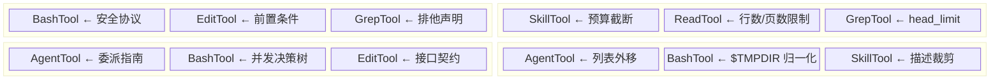

# 第8章：工具提示词作为微型驾驭器

> 第5章解剖了系统提示词的宏观架构 -- 段落注册、缓存分层、动态拼装。但系统提示词只是"顶层战略"。在每次工具调用的微观层面，还有一套平行的驾驭体系在运作：**工具提示词（tool description / tool prompt）**。它们作为 `description` 字段注入 API 请求的 `tools` 数组，直接塑造模型对每个工具的使用方式。本章将逐一拆解 Claude Code 六大核心工具的提示词设计，揭示其中的引导策略与可复用模式。

## 8.1 工具提示词的驾驭本质

工具的 `description` 字段在 Anthropic API 中的定位是"告诉模型这个工具做什么"。但 Claude Code 将这个字段从简单的功能描述，扩展为一套完整的**行为约束协议**。每个工具的提示词实际上是一个微型驾驭器（micro-harness），包含：

- **功能描述**：工具做什么
- **正面引导**：应该怎么用
- **负面禁令**：不能怎么用
- **条件分支**：在特定场景下该怎么做
- **格式模板**：输出应该长什么样

这种设计的核心洞察是：**模型对每个工具的行为质量，直接受该工具提示词质量制约**。系统提示词设定全局人格，工具提示词塑造局部行为。二者共同构成 Claude Code 的"双层驾驭架构"。

接下来我们按功能复杂度由高到低，逐一分析六个工具。

---

## 8.2 BashTool：最复杂的微型驾驭器

BashTool 是 Claude Code 中提示词最长、约束最密集的工具。它的提示词由 `getSimplePrompt()` 函数动态生成，最终可达数千字。

**源码位置：** `tools/BashTool/prompt.ts:275-369`

### 8.2.1 工具偏好矩阵：把流量导向专用工具

提示词的第一部分就建立了一个明确的**工具偏好矩阵**：

```
IMPORTANT: Avoid using this tool to run find, grep, cat, head, tail,
sed, awk, or echo commands, unless explicitly instructed or after you
have verified that a dedicated tool cannot accomplish your task.
```

紧接着是一张映射表（第281-291行）：

```typescript
const toolPreferenceItems = [
  `File search: Use ${GLOB_TOOL_NAME} (NOT find or ls)`,
  `Content search: Use ${GREP_TOOL_NAME} (NOT grep or rg)`,
  `Read files: Use ${FILE_READ_TOOL_NAME} (NOT cat/head/tail)`,
  `Edit files: Use ${FILE_EDIT_TOOL_NAME} (NOT sed/awk)`,
  `Write files: Use ${FILE_WRITE_TOOL_NAME} (NOT echo >/cat <<EOF)`,
  'Communication: Output text directly (NOT echo/printf)',
]
```

这个设计体现了一个重要的驾驭模式：**流量导向（traffic steering）**。Bash 是一个"万能工具" -- 理论上可以完成文件读写、搜索、编辑等所有操作。但让模型通过 Bash 完成这些操作会带来两个问题：

1. **用户体验差**：专用工具（如 FileEditTool）有结构化输入、可视化 diff、权限检查等能力，Bash 命令则是不透明的字符串。
2. **权限控制失效**：专用工具有细粒度权限校验，Bash 命令绕过了这些检查。

注意第276-278行的条件分支：当系统检测到嵌入式搜索工具（`hasEmbeddedSearchTools()`）时，`find` 和 `grep` 从禁用列表中移除。这是为 Anthropic 内部构建版本（ant-native builds）做的适配 -- 这些构建将 `find`/`grep` 别名为嵌入式 `bfs`/`ugrep`，同时移除了独立的 Glob/Grep 工具。

**可复用模式 -- "万能工具降级"：** 当你的工具集中存在一个功能覆盖面极广的工具时，在其提示词中显式列出"什么场景应该用什么替代工具"，避免模型过度依赖单一工具。

### 8.2.2 命令执行指南：从超时到并发

提示词的第二部分是一套详细的命令执行规范（第331-352行），涵盖：

- **目录验证**："If your command will create new directories or files, first use this tool to run `ls` to verify the parent directory exists"
- **路径引用**："Always quote file paths that contain spaces with double quotes"
- **工作目录保持**："Try to maintain your current working directory throughout the session by using absolute paths"
- **超时控制**：默认 120,000ms（2分钟），最大 600,000ms（10分钟）
- **后台执行**：`run_in_background` 参数，带明确的使用条件

其中最精巧的是**多命令并发指南**（第297-303行）：

```typescript
const multipleCommandsSubitems = [
  `If the commands are independent and can run in parallel, make multiple
   ${BASH_TOOL_NAME} tool calls in a single message.`,
  `If the commands depend on each other and must run sequentially, use
   a single ${BASH_TOOL_NAME} call with '&&' to chain them together.`,
  "Use ';' only when you need to run commands sequentially but don't
   care if earlier commands fail.",
  'DO NOT use newlines to separate commands.',
]
```

这不是简单的"最佳实践建议"，而是一套**并发决策树**：独立任务用并行工具调用 -> 有依赖用 `&&` -> 允许失败用 `;` -> 禁止用换行符。每条规则都对应一个具体的故障模式。

### 8.2.3 Git 安全协议：深度防御

Git 操作是 BashTool 提示词中最重要的安全领域。完整的 Git 安全协议定义在 `getCommitAndPRInstructions()` 函数中（第42-161行），其核心禁令列表（第88-95行）构成了一道**六层防线**：

```
Git Safety Protocol:
- NEVER update the git config
- NEVER run destructive git commands (push --force, reset --hard,
  checkout ., restore ., clean -f, branch -D) unless the user
  explicitly requests these actions
- NEVER skip hooks (--no-verify, --no-gpg-sign, etc) unless the
  user explicitly requests it
- NEVER run force push to main/master, warn the user if they request it
- CRITICAL: Always create NEW commits rather than amending
- When staging files, prefer adding specific files by name rather
  than using "git add -A" or "git add ."
- NEVER commit changes unless the user explicitly asks you to
```

每一条禁令都对应一个真实的数据丢失场景：

| 禁令 | 防御的故障场景 |
|------|---------------|
| NEVER update git config | 模型可能修改用户的全局 Git 配置 |
| NEVER push --force | 覆盖远程仓库的提交历史 |
| NEVER skip hooks | 绕过代码质量检查、签名验证 |
| NEVER force push to main | 破坏团队共享分支 |
| Always create NEW commits | pre-commit hook 失败后 amend 会修改上一个提交 |
| Prefer specific files | `git add .` 可能暴露 .env、credentials |
| NEVER commit unless asked | 避免 agent 过度自主 |

"CRITICAL" 标记被保留给最微妙的场景：pre-commit hook 失败后的 `--amend` 陷阱。这条规则需要理解 Git 的内部机制 -- hook 失败意味着 commit 没有发生，此时 `--amend` 会修改的是**上一个已存在的提交**，而不是"重试当前提交"。

提示词还包含完整的 commit 工作流模板（第96-125行），用编号步骤明确指定哪些操作可以并行、哪些必须串行，甚至提供了 HEREDOC 格式的 commit message 模板。这是一种**工作流脚手架（workflow scaffolding）**模式 -- 不是告诉模型"做什么"，而是告诉它"按什么顺序做"。

### 8.2.4 沙箱配置的 JSON 内联

当沙箱（sandbox）启用时，`getSimpleSandboxSection()` 函数（第172-273行）会将完整的沙箱配置以 JSON 格式内联到提示词中：

```typescript
const filesystemConfig = {
  read: {
    denyOnly: dedup(fsReadConfig.denyOnly),
    allowWithinDeny: dedup(fsReadConfig.allowWithinDeny),
  },
  write: {
    allowOnly: normalizeAllowOnly(fsWriteConfig.allowOnly),
    denyWithinAllow: dedup(fsWriteConfig.denyWithinAllow),
  },
}
```

**源码参考：** `tools/BashTool/prompt.ts:195-203`

这是一个值得深思的设计决策：**将机器可读的安全策略直接暴露给模型**。模型需要"理解"自己可以访问哪些路径、可以连接哪些网络主机，才能在生成命令时主动避免违规。JSON 格式保证了信息的精确性和无歧义性。

注意第167-170行的 `dedup` 函数和第188-191行的 `normalizeAllowOnly`：前者去除重复路径（因为 `SandboxManager` 合并多层配置时不去重），后者将用户特定的临时目录路径替换为 `$TMPDIR` 占位符。这两个优化分别节省了 ~150-200 token 和保证了跨用户的 prompt 缓存一致性。

**可复用模式 -- "策略透明化"：** 当安全策略需要模型配合执行时，将策略的完整规则集以结构化格式（JSON/YAML）内联到提示词中，让模型在生成阶段就能自检合规性。

### 8.2.5 sleep 反模式抑制

提示词专门用一个小节（第310-327行）来抑制 `sleep` 的滥用：

```typescript
const sleepSubitems = [
  'Do not sleep between commands that can run immediately — just run them.',
  'If your command is long running... use `run_in_background`.',
  'Do not retry failing commands in a sleep loop — diagnose the root cause.',
  'If waiting for a background task... do not poll.',
  'If you must sleep, keep the duration short (1-5 seconds)...',
]
```

这是一个典型的**反模式抑制（anti-pattern suppression）**策略。LLM 在代码生成场景中倾向于使用 `sleep` + 轮询来处理异步等待，因为这是训练数据中最常见的模式。提示词通过逐一列举替代方案（后台执行、事件通知、诊断根因）来"覆写"这个默认行为。

---

## 8.3 FileEditTool："编辑前必须先读取"的强制机制

FileEditTool 的提示词相比 BashTool 精简得多，但每一句都承载着关键的工程约束。

**源码位置：** `tools/FileEditTool/prompt.ts:1-28`

### 8.3.1 前置读取强制

提示词的第一条规则（第4-6行）：

```typescript
function getPreReadInstruction(): string {
  return `You must use your \`${FILE_READ_TOOL_NAME}\` tool at least once
  in the conversation before editing. This tool will error if you
  attempt an edit without reading the file.`
}
```

这不是一个"建议"，而是一个**硬性约束** -- 工具的运行时实现会检查对话历史中是否存在对该文件的 Read 调用，没有则直接返回错误。提示词中的说明是为了让模型**提前知道**这个约束，避免浪费一次工具调用。

这个设计解决了一个核心问题：**模型幻觉（hallucination）**。如果模型不先读取文件就尝试编辑，它对文件内容的假设可能完全错误。强制先读取保证了编辑操作基于真实的文件状态，而不是模型对文件内容的"记忆"或"猜测"。

**可复用模式 -- "前置条件强制"：** 当工具 B 的正确性依赖于工具 A 的先行调用时，在 B 的提示词中声明这个依赖关系，并在 B 的运行时中强制检查。双重保障 -- 提示词层防止浪费调用，运行时层兜底防止错误操作。

### 8.3.2 最小唯一 old_string

提示词对 `old_string` 参数的要求（第20-27行）体现了精妙的平衡：

```
- The edit will FAIL if `old_string` is not unique in the file. Either
  provide a larger string with more surrounding context to make it unique
  or use `replace_all` to change every instance of `old_string`.
```

对于 Anthropic 内部用户（`USER_TYPE === 'ant'`），还有一条额外的优化指引（第17-19行）：

```typescript
const minimalUniquenessHint =
  process.env.USER_TYPE === 'ant'
    ? `Use the smallest old_string that's clearly unique — usually 2-4
       adjacent lines is sufficient. Avoid including 10+ lines of context
       when less uniquely identifies the target.`
    : ''
```

这揭示了一个**token 经济学**问题：模型在使用 FileEditTool 时，需要在 `old_string` 参数中提供要替换的原文。如果模型习惯性地包含大段上下文来"确保唯一性"，每次编辑操作的 token 消耗就会急剧膨胀。"2-4 行"的指导让模型在唯一性和简洁性之间找到甜点。

### 8.3.3 缩进保持与行号前缀

提示词中最容易被忽视但最关键的技术细节（第13-16行，第23行）：

```typescript
const prefixFormat = isCompactLinePrefixEnabled()
  ? 'line number + tab'
  : 'spaces + line number + arrow'

// 在描述中：
`When editing text from Read tool output, ensure you preserve the exact
indentation (tabs/spaces) as it appears AFTER the line number prefix.
The line number prefix format is: ${prefixFormat}. Everything after that
is the actual file content to match. Never include any part of the line
number prefix in the old_string or new_string.`
```

Read 工具返回的内容带有行号前缀（如 `  42 → `），模型需要在编辑时**剥离这个前缀**，只提取实际的文件内容作为 `old_string`。这是 Read 工具与 Edit 工具之间的**接口契约** -- 提示词承担了"接口文档"的角色。

**可复用模式 -- "工具间接口声明"：** 当两个工具的输出/输入存在格式转换关系时，在下游工具的提示词中显式描述上游工具的输出格式，避免模型在格式转换中出错。

---

## 8.4 FileReadTool：资源感知的读取策略

FileReadTool 的提示词看似简单，实则包含了精心设计的资源管理策略。

**源码位置：** `tools/FileReadTool/prompt.ts:1-49`

### 8.4.1 2000 行默认限制

```typescript
export const MAX_LINES_TO_READ = 2000

// 在提示词模板中：
`By default, it reads up to ${MAX_LINES_TO_READ} lines starting from
the beginning of the file`
```

**源码参考：** `tools/FileReadTool/prompt.ts:10,37`

2000 行是一个经过权衡的数字。Anthropic 的模型有 200K token 的上下文窗口，但上下文越大，注意力分散越严重、推理成本越高。2000 行大约对应 8000-16000 个 token（取决于代码密度），占上下文窗口的 4-8%。这个预算足够覆盖绝大多数单文件场景，同时为多文件操作留出空间。

### 8.4.2 offset/limit 的渐进式引导

提示词对 offset/limit 参数提供了两种措辞模式（第17-21行）：

```typescript
export const OFFSET_INSTRUCTION_DEFAULT =
  "You can optionally specify a line offset and limit (especially handy
   for long files), but it's recommended to read the whole file by not
   providing these parameters"

export const OFFSET_INSTRUCTION_TARGETED =
  'When you already know which part of the file you need, only read
   that part. This can be important for larger files.'
```

两种模式服务于不同的使用阶段：

- **DEFAULT 模式**鼓励完整读取 -- 适用于模型首次接触文件时，需要全局理解。
- **TARGETED 模式**鼓励精准读取 -- 适用于模型已经知道目标位置时，节省 token 预算。

哪种模式被使用取决于运行时上下文（由 `FileReadTool` 调用方决定），但提示词预先定义了两种"引导语气"，让模型在不同场景下展现不同的读取行为。

### 8.4.3 多媒体能力声明

提示词用一系列声明式语句扩展了 Read 工具的能力边界（第40-48行）：

```
- This tool allows Claude Code to read images (eg PNG, JPG, etc).
  When reading an image file the contents are presented visually
  as Claude Code is a multimodal LLM.
- This tool can read PDF files (.pdf). For large PDFs (more than 10
  pages), you MUST provide the pages parameter to read specific page
  ranges. Maximum 20 pages per request.
- This tool can read Jupyter notebooks (.ipynb files) and returns all
  cells with their outputs.
```

PDF 的分页限制（"more than 10 pages...MUST provide the pages parameter"）是一个**渐进式资源限制**：小文件直接读取，大文件强制分页。这比"所有文件都必须分页"或"不限制分页"都更合理 -- 前者增加不必要的工具调用轮次，后者可能一次性注入过多内容。

注意 PDF 支持是条件性的（第41行）：`isPDFSupported()` 检查运行时环境是否支持 PDF 解析。不支持时，整个 PDF 说明段落从提示词中消失。这避免了"提示词承诺了运行时无法兑现的能力"这一常见陷阱。

**可复用模式 -- "能力声明与运行时对齐"：** 工具提示词中的能力描述应该由运行时能力动态决定。如果某个功能在特定环境下不可用，不要在提示词中提及它 -- 这会导致模型尝试使用不存在的功能，产生困惑和浪费。

---

## 8.5 GrepTool："始终用 Grep 不用 bash grep"

GrepTool 的提示词精简到极致，但每一行都是硬约束。

**源码位置：** `tools/GrepTool/prompt.ts:1-18`

### 8.5.1 排他性声明

提示词的第一条使用规则（第10行）：

```
ALWAYS use Grep for search tasks. NEVER invoke `grep` or `rg` as a
Bash command. The Grep tool has been optimized for correct permissions
and access.
```

这是与 BashTool 的工具偏好矩阵**双向配合**的设计：BashTool 说"不要用 bash 做搜索"，GrepTool 说"搜索必须用我"。两个方向的约束形成闭环，最大程度降低模型"走错路"的概率。

"has been optimized for correct permissions and access" 给出了理由，而非仅仅发出禁令。理由很重要 -- GrepTool 底层调用的是相同的 `ripgrep`，但包裹了权限检查（`checkReadPermissionForTool`，`GrepTool.ts:233-239`）、忽略模式应用（`getFileReadIgnorePatterns`，`GrepTool.ts:413-427`）和版本控制目录排除（`VCS_DIRECTORIES_TO_EXCLUDE`，`GrepTool.ts:95-102`）。通过 Bash 直接调用 `rg` 会绕过这些安全层。

### 8.5.2 ripgrep 语法提示

提示词提供了三条关键的语法差异说明（第11-16行）：

```
- Supports full regex syntax (e.g., "log.*Error", "function\s+\w+")
- Pattern syntax: Uses ripgrep (not grep) - literal braces need
  escaping (use `interface\{\}` to find `interface{}` in Go code)
- Multiline matching: By default patterns match within single lines only.
  For cross-line patterns like `struct \{[\s\S]*?field`, use
  `multiline: true`
```

第一条明确了语法家族（ripgrep 的 Rust regex），第二条给出了最常见的陷阱（大括号需要转义 -- 这与 GNU grep 不同），第三条解释了 multiline 参数的使用场景。

从代码实现看，`multiline: true` 对应的 ripgrep 参数是 `-U --multiline-dotall`（`GrepTool.ts:341-343`）。提示词选择用"使用场景 + 示例"来解释这个功能，而不是暴露底层参数细节 -- 模型不需要知道 `-U` 是什么，只需要知道什么时候设置 `multiline: true`。

### 8.5.3 输出模式与 head_limit

GrepTool 的输入 schema（`GrepTool.ts:33-89`）定义了丰富的参数，但提示词中只简要提及三种输出模式：

```
Output modes: "content" shows matching lines, "files_with_matches"
shows only file paths (default), "count" shows match counts
```

而 `head_limit` 参数的设计（`GrepTool.ts:81,107`）尤其值得关注：

```typescript
const DEFAULT_HEAD_LIMIT = 250

// 在 schema 描述中：
'Defaults to 250 when unspecified. Pass 0 for unlimited
(use sparingly — large result sets waste context).'
```

默认 250 条结果上限是一个**上下文保护机制** -- 注释中说明（第104-108行），不受限的 content 模式搜索可能填满 20KB 的工具结果持久化阈值。"use sparingly" 的措辞给模型一个温和的警告，而 `0` 作为"无限制"的逃生舱口保留了灵活性。

**可复用模式 -- "安全默认值 + 逃生舱口"：** 为可能产生大量输出的工具设置保守的默认限制，同时提供一个显式的方式来解除限制。在提示词中说明两者的存在和适用场景。

---

## 8.6 AgentTool：动态 agent 列表与 fork 指引

AgentTool 是六个工具中提示词生成逻辑最复杂的，因为它需要根据运行时状态（可用的 agent 定义、是否启用 fork、是否为 coordinator 模式、订阅类型）动态组合内容。

**源码位置：** `tools/AgentTool/prompt.ts:1-287`

### 8.6.1 内联 vs 附件：agent 列表的两种注入方式

提示词中的 agent 列表可以通过两种方式注入（第58-64行，第196-199行）：

```typescript
export function shouldInjectAgentListInMessages(): boolean {
  if (isEnvTruthy(process.env.CLAUDE_CODE_AGENT_LIST_IN_MESSAGES)) return true
  if (isEnvDefinedFalsy(process.env.CLAUDE_CODE_AGENT_LIST_IN_MESSAGES))
    return false
  return getFeatureValue_CACHED_MAY_BE_STALE('tengu_agent_list_attach', false)
}
```

**方式一（内联）：** agent 列表直接嵌入工具描述。

```typescript
`Available agent types and the tools they have access to:
${effectiveAgents.map(agent => formatAgentLine(agent)).join('\n')}`
```

**方式二（附件）：** 工具描述只包含静态文本 "Available agent types are listed in `<system-reminder>` messages in the conversation"，实际列表通过 `agent_listing_delta` 附件消息单独注入。

源码注释（第50-57行）解释了动机：**动态 agent 列表占了全局 `cache_creation` token 的约 10.2%**。每当 MCP 服务器异步连接、插件重载、或权限模式变化时，agent 列表就会变化，导致包含列表的工具 schema 全部失效，触发昂贵的缓存重建。将列表移到附件消息中，工具描述变为静态文本，从而保护了工具 schema 层的 prompt 缓存。

每个 agent 的描述格式（第43-46行）：

```typescript
export function formatAgentLine(agent: AgentDefinition): string {
  const toolsDescription = getToolsDescription(agent)
  return `- ${agent.agentType}: ${agent.whenToUse} (Tools: ${toolsDescription})`
}
```

`getToolsDescription` 函数（第15-37行）处理了工具白名单和黑名单的交叉过滤，最终生成如 "All tools except Bash, Agent" 或 "Read, Grep, Glob" 这样的描述。这让模型知道每个 agent 类型**能用什么工具**，从而做出合理的委派决策。

**可复用模式 -- "动态内容外移"：** 当工具提示词中的某个部分频繁变化且对缓存影响大时，将其从工具 `description` 移到消息流中（如附件、system-reminder），保持工具描述的稳定性。

### 8.6.2 Fork 子代理：继承上下文的轻量委派

当 `isForkSubagentEnabled()` 为 true 时，提示词增加一个"When to fork"段落（第81-96行），引导模型在两种委派模式间选择：

1. **Fork（省略 `subagent_type`）**：继承父代理的完整对话上下文，适合研究型和实现型任务。
2. **Fresh agent（指定 `subagent_type`）**：从零开始，需要完整的上下文传递。

Fork 的使用指南包含三条核心纪律：

```
Don't peek. The tool result includes an output_file path — do not
Read or tail it unless the user explicitly asks for a progress check.

Don't race. After launching, you know nothing about what the fork found.
Never fabricate or predict fork results in any format.

Writing a fork prompt. Since the fork inherits your context, the prompt
is a directive — what to do, not what the situation is.
```

"Don't peek" 防止父代理读取 fork 的中间输出，这会把 fork 的工具噪音拉入父代理的上下文，违背了 fork 的初衷。"Don't race" 防止父代理在结果返回前"猜测"fork 的结论 -- 这是 LLM 的一个已知倾向。

### 8.6.3 Prompt 写作指南：防止浅层委派

提示词中最独特的部分是一段"如何写好 agent prompt"的指南（第99-113行）：

```
Brief the agent like a smart colleague who just walked into the room —
it hasn't seen this conversation, doesn't know what you've tried,
doesn't understand why this task matters.

...

**Never delegate understanding.** Don't write "based on your findings,
fix the bug" or "based on the research, implement it." Those phrases
push synthesis onto the agent instead of doing it yourself.
```

"Never delegate understanding" 是一条深刻的元认知约束。它防止模型将**需要综合判断的思考工作**甩给子代理 -- 子代理应该是执行者，不是决策者。这条规则将"理解"锚定在父代理身上，确保工作流中的知识不会丢失。

**可复用模式 -- "委派质量保障"：** 当工具涉及向子系统传递任务时，在提示词中约束任务描述的质量标准，防止模型生成模糊、不完整的委派指令。

---

## 8.7 SkillTool：预算约束与三级截断

SkillTool 的独特之处在于它不仅驾驭模型的**行为**，还管理自身提示词的**体积**。

**源码位置：** `tools/SkillTool/prompt.ts:1-242`

### 8.7.1 1% 上下文窗口预算

```typescript
export const SKILL_BUDGET_CONTEXT_PERCENT = 0.01
export const CHARS_PER_TOKEN = 4
export const DEFAULT_CHAR_BUDGET = 8_000 // Fallback: 1% of 200k * 4
```

**源码参考：** `tools/SkillTool/prompt.ts:21-23`

技能列表的总字符预算被硬性限制为上下文窗口的 1%。对于 200K token 的上下文窗口，这是 200K * 4 chars/token * 1% = 8000 字符。这个预算约束确保了技能发现功能不会侵蚀模型的工作上下文 -- 技能列表是"目录"，不是"内容"，模型只需要看到足够的信息来决定是否调用某个技能，实际的技能内容在调用时才加载。

### 8.7.2 三级截断策略

`formatCommandsWithinBudget` 函数（第70-171行）实现了一套渐进式截断策略：

**第一级：完整保留。** 如果所有技能的完整描述加起来不超过预算，全部保留。

```typescript
if (fullTotal <= budget) {
  return fullEntries.map(e => e.full).join('\n')
}
```

**第二级：描述裁剪。** 超预算时，将非内置技能（non-bundled）的描述裁剪到平均可用长度。内置技能（bundled）始终保留完整描述。

```typescript
const maxDescLen = Math.floor(availableForDescs / restCommands.length)
// ...
return `- ${cmd.name}: ${truncate(description, maxDescLen)}`
```

**第三级：仅保留名称。** 如果裁剪后的平均描述长度小于 20 字符（`MIN_DESC_LENGTH`），非内置技能退化为仅显示名称。

```typescript
if (maxDescLen < MIN_DESC_LENGTH) {
  return commands
    .map((cmd, i) =>
      bundledIndices.has(i) ? fullEntries[i]!.full : `- ${cmd.name}`,
    )
    .join('\n')
}
```

这套三级策略的优先级是：**内置技能 > 非内置技能的描述 > 非内置技能的名称**。内置技能作为 Claude Code 的核心功能，永远不会被截断。第三方插件技能则按需降级，确保在任何规模的技能生态中都能控制 token 成本。

### 8.7.3 单条目硬上限

除了总预算外，每个技能条目还有独立的硬上限（第29行）：

```typescript
export const MAX_LISTING_DESC_CHARS = 250
```

`getCommandDescription` 函数（第43-49行）在总预算截断之前，先对每个条目进行 250 字符的预截断：

```typescript
function getCommandDescription(cmd: Command): string {
  const desc = cmd.whenToUse
    ? `${cmd.description} - ${cmd.whenToUse}`
    : cmd.description
  return desc.length > MAX_LISTING_DESC_CHARS
    ? desc.slice(0, MAX_LISTING_DESC_CHARS - 1) + '\u2026'
    : desc
}
```

注释解释了原因：技能列表是**发现（discovery）** 用途，不是**使用（usage）** 用途。冗长的 `whenToUse` 字符串浪费的是 turn-1 的 `cache_creation` token，对技能匹配率没有提升。

### 8.7.4 调用协议

SkillTool 的核心提示词（第173-196行）相对简短，但包含一条关键的**阻塞性要求**：

```
When a skill matches the user's request, this is a BLOCKING REQUIREMENT:
invoke the relevant Skill tool BEFORE generating any other response
about the task
```

"BLOCKING REQUIREMENT" 是 Claude Code 提示词体系中最强的约束措辞之一。它要求模型在识别到匹配技能时，**立即调用 Skill 工具**，不得先生成文本回复。这防止了一个常见的反模式：模型先输出一段分析文字，然后才调用技能 -- 这段文字往往与技能加载后的实际指令冲突。

另一条防御性规则（第194行）：

```typescript
`If you see a <${COMMAND_NAME_TAG}> tag in the current conversation turn,
the skill has ALREADY been loaded - follow the instructions directly
instead of calling this tool again`
```

这防止了**重复加载**：如果技能已经通过 `<command-name>` 标签注入到当前轮次，模型不应该再次调用 SkillTool，而应该直接执行技能指令。

**可复用模式 -- "预算感知的目录生成"：** 当工具需要向模型呈现一个动态增长的列表（插件、技能、API 端点等）时，为列表分配固定的 token 预算，并实现多级降级策略。优先保留高价值条目的完整性，低优先级条目渐进退化。

---

## 8.8 六工具对比总结

下表从五个维度对比六个工具的提示词设计：

| 维度 | BashTool | FileEditTool | FileReadTool | GrepTool | AgentTool | SkillTool |
|------|----------|-------------|-------------|----------|-----------|-----------|
| **提示词长度** | 极长（数千字，含 Git 协议） | 短（~30行） | 中等（~50行） | 极短（~18行） | 长（~280行，含示例） | 中等（~200行，含截断逻辑） |
| **生成方式** | 动态拼接（沙箱配置、Git 指令、嵌入式工具检测） | 半动态（行号前缀格式、用户类型条件） | 半动态（PDF 支持条件、offset 模式切换） | 静态模板 | 高度动态（agent 列表、fork 开关、coordinator 模式、订阅类型） | 动态预算裁剪（三级截断） |
| **核心驾驭策略** | 流量导向 + 安全协议 + 工作流脚手架 | 前置条件强制 + 接口契约 | 资源感知的渐进限制 | 排他性声明 + 语法纠偏 | 委派质量保障 + 缓存保护 | 预算约束 + 优先级降级 |
| **安全机制** | Git 六层防线、沙箱 JSON 内联、反模式抑制 | 编辑前必须读取（运行时强制） | 行数限制、PDF 分页限制 | 权限检查、VCS 目录排除、结果上限 | fork 纪律（Don't peek/race）、委派质量 | BLOCKING REQUIREMENT、重复加载防护 |
| **可复用模式** | 万能工具降级、策略透明化 | 前置条件强制、工具间接口声明 | 能力声明与运行时对齐 | 安全默认值 + 逃生舱口 | 动态内容外移、委派质量保障 | 预算感知的目录生成 |



**图 8-1：工具提示词驾驭模式的四象限分布。** 每个工具通常横跨多个象限 -- BashTool 同时具备行为约束、协作编排和缓存优化特征；GrepTool 兼具行为约束和资源管理。

## 8.9 设计工具提示词的七条原则

从六个工具的分析中，我们可以提炼出一套通用的工具提示词设计原则：

1. **双向闭环**：当工具 A 不应处理某类任务时，同时在 A 中说"不要做 X，用 B"，在 B 中说"做 X 必须用我"。单向约束留有漏洞。

2. **理由先于禁令**：每条 "NEVER" 后面跟一个 "because"。模型在理解原因后更不容易违反约束。GrepTool 的 "has been optimized for correct permissions" 比单纯的 "NEVER use bash grep" 更有效。

3. **能力与运行时对齐**：提示词声明的能力必须由运行时保证。FileReadTool 的 PDF 支持根据 `isPDFSupported()` 条件注入，而不是无条件声明。

4. **安全默认值 + 逃生舱口**：为所有可能产生大量输出或副作用的参数设置保守默认值，同时提供显式的解除方式。GrepTool 的 `head_limit=250`/`0` 是典型案例。

5. **预算意识**：工具提示词本身消耗 token。SkillTool 的 1% 预算约束和三级截断是极端但正确的做法。BashTool 的 `$TMPDIR` 归一化和 `dedup` 则是更微妙的优化。

6. **前置条件声明**：如果工具的正确使用依赖于特定前提（先读取文件、先检查目录），在提示词中声明，在运行时中强制。双重保障优于单层防御。

7. **委派质量标准**：当工具涉及向子系统传递任务时，约束任务描述的完整性和具体性。AgentTool 的 "Never delegate understanding" 防止了知识在委派链中丢失。

---

## 8.10 用户能做什么

基于本章对六大工具提示词的分析，以下是读者在设计自己的工具提示词时可以直接应用的建议：

1. **为"万能工具"建立流量导向表。** 如果你的工具集中有一个功能覆盖面极广的工具（如 Bash、通用 API 调用器），在其描述的最前面放置一张"场景 -> 专用工具"的映射表。同时在每个专用工具中声明排他性。这种双向闭环是防止模型过度依赖单一工具的最有效手段。

2. **强制工具间的前置条件。** 当工具 B 的正确性依赖于工具 A 的先行调用时（如"编辑前必须先读取"），在 B 的提示词中声明这个依赖，并在 B 的运行时中用代码强制检查。提示词层防止浪费调用，运行时层兜底防止错误操作 -- 双层防御优于单层。

3. **将安全策略以 JSON 内联到提示词。** 如果模型需要"理解"自己的权限边界（可访问的路径、可连接的主机等），将完整的策略规则集以结构化格式注入提示词。这让模型在生成阶段就能自检合规性，而非依赖运行时拒绝后的重试。

4. **为大输出工具设置保守默认值。** 对所有可能产生大量输出的工具参数（搜索结果数、文件行数、PDF 页数），设置保守的默认限制。同时提供显式的"解除限制"选项（如 `head_limit=0`），并在提示词中说明"谨慎使用"。

5. **控制工具描述本身的 token 成本。** 参考 SkillTool 的 1% 上下文窗口预算和三级截断策略。当你的工具集不断增长时，工具描述的总 token 开销也在增长。为工具描述分配固定预算，优先保留核心工具的完整性，边缘工具渐进退化。

6. **用动态条件控制能力声明。** 不要在提示词中声明运行时不一定能兑现的能力。参考 FileReadTool 的 `isPDFSupported()` 条件检查 -- 如果 PDF 解析不可用，就不要在提示词中提及 PDF 支持。提示词承诺了运行时无法兑现的能力，会导致模型反复尝试失败，浪费上下文窗口。

## 8.11 小结

工具提示词是 Claude Code 驾驭体系中最"接地"的层级。系统提示词设定人格，工具提示词塑造动作。六个工具的提示词设计展示了一个核心规律：**优秀的工具提示词不是功能文档，而是行为契约**。它不仅告诉模型"这个工具能做什么"，更告诉它"在什么条件下用这个工具"、"怎样用才安全"、"什么时候该用其他工具"。

下一章我们将从单个工具的微观驾驭上升到工具协作的宏观编排 -- 探索工具之间如何通过权限系统、状态传递和并发控制形成一个协调的整体。
