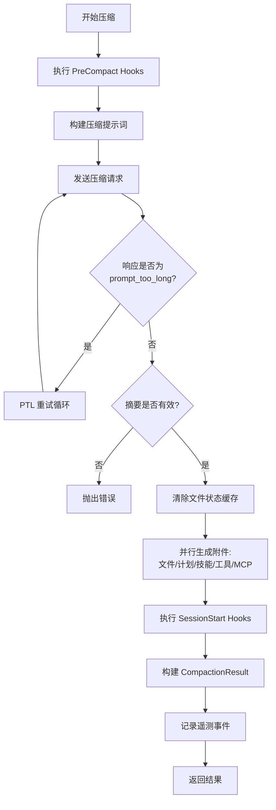
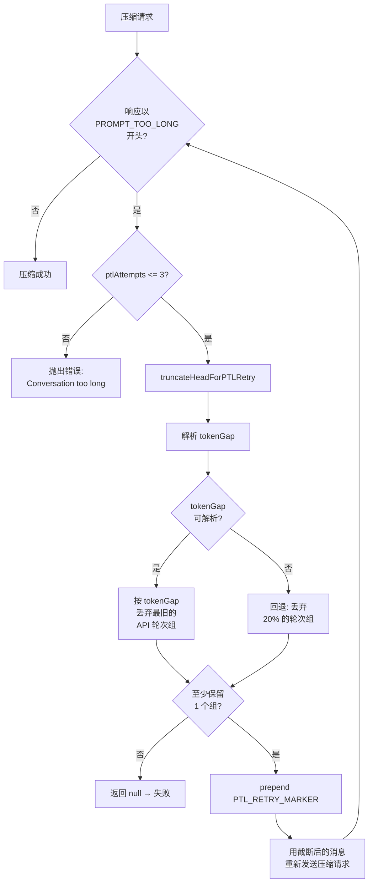
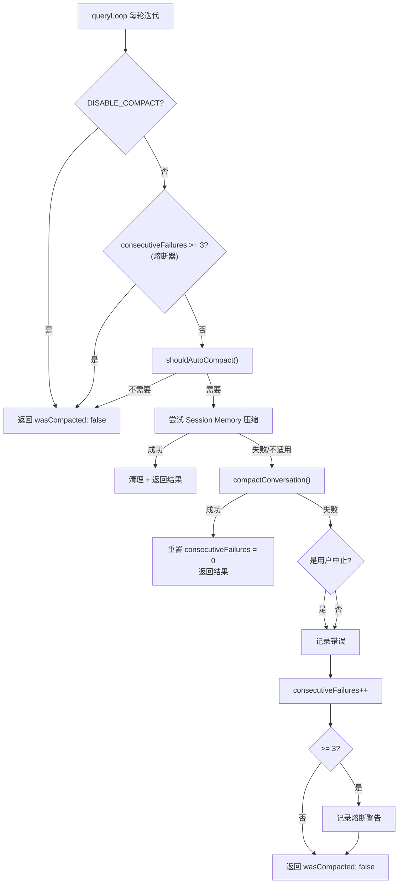

# 第9章：自动压缩 — 上下文何时以及如何被压缩

> *"The best compression is the one the user never notices."*

每一个 Claude Code 的长会话用户都经历过这个时刻：你正在让模型逐步重构一个复杂模块，突然你注意到模型的回答变得"健忘"——它忘记了五分钟前你明确要求保留的接口签名，或者重复建议你已经否决过的方案。这不是模型变笨了，而是**上下文窗口满了，自动压缩刚刚发生**。

压缩（compaction）是 Claude Code 上下文管理的核心机制。它决定了你的对话历史在什么时刻、以什么方式被浓缩为一份摘要。理解这个机制，意味着你可以预测它何时触发、控制它保留什么、以及在它"出错"时知道该怎么做。

本章将从源码层面完整拆解自动压缩的三个阶段：**阈值判定**（何时触发）、**摘要生成**（如何压缩）、**失败恢复**（出错怎么办）。

---

## 9.1 阈值计算：何时触发自动压缩

### 9.1.1 核心公式

自动压缩的触发条件可以用一个简单的不等式表达：

```
当前 token 数 >= autoCompactThreshold
```

而 `autoCompactThreshold` 的计算涉及三个常量和两层减法。让我们从源码中逐步推导。

**第一层：有效上下文窗口**

```typescript
// services/compact/autoCompact.ts:30
const MAX_OUTPUT_TOKENS_FOR_SUMMARY = 20_000

// services/compact/autoCompact.ts:33-48
export function getEffectiveContextWindowSize(model: string): number {
  const reservedTokensForSummary = Math.min(
    getMaxOutputTokensForModel(model),
    MAX_OUTPUT_TOKENS_FOR_SUMMARY,
  )
  let contextWindow = getContextWindowForModel(model, getSdkBetas())

  const autoCompactWindow = process.env.CLAUDE_CODE_AUTO_COMPACT_WINDOW
  if (autoCompactWindow) {
    const parsed = parseInt(autoCompactWindow, 10)
    if (!isNaN(parsed) && parsed > 0) {
      contextWindow = Math.min(contextWindow, parsed)
    }
  }

  return contextWindow - reservedTokensForSummary
}
```

这里的逻辑是：从模型的原始上下文窗口中扣除一块"压缩输出预留区"。`MAX_OUTPUT_TOKENS_FOR_SUMMARY = 20_000` 这个值来自 p99.99 的实际压缩输出统计——99.99% 的压缩摘要都在 17,387 tokens 以内，20K 是带安全余量的上界。

注意 `Math.min(getMaxOutputTokensForModel(model), MAX_OUTPUT_TOKENS_FOR_SUMMARY)` 这个取小值操作：如果某个模型的最大输出上限本身就低于 20K（比如某些 Bedrock 配置），则使用模型自身的上限。

**第二层：自动压缩缓冲区**

```typescript
// services/compact/autoCompact.ts:62
export const AUTOCOMPACT_BUFFER_TOKENS = 13_000

// services/compact/autoCompact.ts:72-91
export function getAutoCompactThreshold(model: string): number {
  const effectiveContextWindow = getEffectiveContextWindowSize(model)
  const autocompactThreshold =
    effectiveContextWindow - AUTOCOMPACT_BUFFER_TOKENS

  const envPercent = process.env.CLAUDE_AUTOCOMPACT_PCT_OVERRIDE
  if (envPercent) {
    const parsed = parseFloat(envPercent)
    if (!isNaN(parsed) && parsed > 0 && parsed <= 100) {
      const percentageThreshold = Math.floor(
        effectiveContextWindow * (parsed / 100),
      )
      return Math.min(percentageThreshold, autocompactThreshold)
    }
  }

  return autocompactThreshold
}
```

`AUTOCOMPACT_BUFFER_TOKENS = 13_000` 是一个额外的安全缓冲——它确保在阈值触发到实际执行压缩之间，还有足够的空间容纳当前轮次可能产生的额外 tokens（工具调用结果、系统消息等）。

### 9.1.2 阈值计算公式表

以 Claude Sonnet 4 (200K 上下文窗口) 为例：

| 计算步骤 | 公式 | 值 |
|---------|------|------|
| 原始上下文窗口 | `contextWindow` | 200,000 |
| 压缩输出预留 | `MAX_OUTPUT_TOKENS_FOR_SUMMARY` | 20,000 |
| 有效上下文窗口 | `contextWindow - 20,000` | 180,000 |
| 自动压缩缓冲 | `AUTOCOMPACT_BUFFER_TOKENS` | 13,000 |
| **自动压缩阈值** | **`effectiveWindow - 13,000`** | **167,000** |
| 警告阈值 | `autoCompactThreshold - 20,000` | 147,000 |
| 错误阈值 | `autoCompactThreshold - 20,000` | 147,000 |
| 阻塞硬限制 | `effectiveWindow - 3,000` | 177,000 |

用更直观的方式表达：

```
|<------------ 200K 上下文窗口 ------------>|
|<---- 167K 可用 ---->|<- 13K 缓冲 ->|<- 20K 压缩输出预留 ->|
                      ^               ^
                自动压缩触发点     有效窗口边界
```

这意味着在默认配置下，当你的对话消耗了约 **83.5%** 的上下文窗口时，自动压缩就会触发。

### 9.1.3 环境变量覆盖

Claude Code 提供了两个环境变量让用户（或测试环境）覆盖默认阈值：

**`CLAUDE_CODE_AUTO_COMPACT_WINDOW`** — 覆盖上下文窗口大小

```typescript
// services/compact/autoCompact.ts:40-46
const autoCompactWindow = process.env.CLAUDE_CODE_AUTO_COMPACT_WINDOW
if (autoCompactWindow) {
  const parsed = parseInt(autoCompactWindow, 10)
  if (!isNaN(parsed) && parsed > 0) {
    contextWindow = Math.min(contextWindow, parsed)
  }
}
```

这个变量取的是 `Math.min(实际窗口, 设置值)`——你只能**缩小**窗口，不能扩大。典型用例：在 CI 环境中设置一个较小的窗口值，强制更频繁地触发压缩以测试其稳定性。

**`CLAUDE_AUTOCOMPACT_PCT_OVERRIDE`** — 按百分比覆盖阈值

```typescript
// services/compact/autoCompact.ts:79-87
const envPercent = process.env.CLAUDE_AUTOCOMPACT_PCT_OVERRIDE
if (envPercent) {
  const parsed = parseFloat(envPercent)
  if (!isNaN(parsed) && parsed > 0 && parsed <= 100) {
    const percentageThreshold = Math.floor(
      effectiveContextWindow * (parsed / 100),
    )
    return Math.min(percentageThreshold, autocompactThreshold)
  }
}
```

例如设置 `CLAUDE_AUTOCOMPACT_PCT_OVERRIDE=50`，阈值就变成有效窗口的 50%（90,000 tokens），但同样取 `Math.min`——这个覆盖值不能*高于*默认阈值，只能让压缩更早触发。

### 9.1.4 完整判定流程

`shouldAutoCompact()` 函数（`autoCompact.ts:160-239`）在比较 token 数之前，还有一系列前置守卫：

```
shouldAutoCompact(messages, model, querySource)
  │
  ├─ querySource 是 'session_memory' 或 'compact'？ → false（防递归）
  ├─ querySource 是 'marble_origami'（ctx-agent）？ → false（防共享状态污染）
  ├─ isAutoCompactEnabled() 返回 false？ → false
  │   ├─ DISABLE_COMPACT 环境变量为 truthy？ → false
  │   ├─ DISABLE_AUTO_COMPACT 环境变量为 truthy？ → false
  │   └─ 用户配置 autoCompactEnabled = false？ → false
  ├─ REACTIVE_COMPACT 实验模式激活？ → false（让 reactive compact 接管）
  ├─ Context Collapse 激活？ → false（collapse 拥有自己的上下文管理）
  │
  └─ tokenCount >= autoCompactThreshold？ → true/false
```

注意源码中对 Context Collapse 的详细注释（`autoCompact.ts:199-222`）：autocompact 在有效窗口的约 93% 处触发，而 Context Collapse 在 90% 开始提交、95% 执行阻塞——如果两者同时运行，autocompact 会"抢跑"并销毁 Collapse 正准备保存的细粒度上下文。因此当 Collapse 开启时，主动式 autocompact 被禁用，只保留 reactive compact 作为 413 错误的兜底。

---

## 9.2 熔断器：连续失败保护

### 9.2.1 问题背景

在理想情况下，压缩完成后上下文会显著缩小，下一轮就不再触发。但现实中存在一类"不可恢复"的场景：上下文中包含大量不可压缩的系统消息、附件或编码数据，压缩后的结果仍然超过阈值，导致下一轮立刻再次触发压缩——形成无限循环。

源码注释记录了一个真实的规模数据（`autoCompact.ts:68-69`）：

> BQ 2026-03-10: 1,279 sessions had 50+ consecutive failures (up to 3,272) in a single session, wasting ~250K API calls/day globally.

**1,279 个会话中，有会话连续失败了 3,272 次**，全局每天浪费约 25 万次 API 调用。这不是边缘情况——这是一个需要硬性保护的系统性问题。

### 9.2.2 熔断器实现

```typescript
// services/compact/autoCompact.ts:70
const MAX_CONSECUTIVE_AUTOCOMPACT_FAILURES = 3
```

熔断器的逻辑极其简洁——整个机制不到 20 行代码：

```typescript
// services/compact/autoCompact.ts:257-265
if (
  tracking?.consecutiveFailures !== undefined &&
  tracking.consecutiveFailures >= MAX_CONSECUTIVE_AUTOCOMPACT_FAILURES
) {
  return { wasCompacted: false }
}
```

状态追踪通过 `AutoCompactTrackingState` 类型在 `queryLoop` 的迭代之间传递：

```typescript
// services/compact/autoCompact.ts:51-60
export type AutoCompactTrackingState = {
  compacted: boolean
  turnCounter: number
  turnId: string
  consecutiveFailures?: number  // 熔断器计数器
}
```

- **成功时**（`autoCompact.ts:332`）：`consecutiveFailures` 重置为 0
- **失败时**（`autoCompact.ts:341-349`）：递增计数，达到 3 次后记录警告日志并不再尝试
- **熔断后**：该会话后续所有轮次的 autocompact 请求直接返回 `{ wasCompacted: false }`

这个设计体现了一个重要原则：**宁可让用户手动执行 `/compact`，也不要用注定失败的重试浪费 API 预算**。熔断器只阻止自动压缩，用户仍然可以通过 `/compact` 命令手动触发。

---

## 9.3 压缩提示词剖析：9 段模板

当阈值触发后，Claude Code 需要向模型发送一条特殊的提示词，要求它将整个对话浓缩为一份结构化摘要。这个提示词的设计是压缩质量的关键——它直接决定了摘要中保留了什么、丢失了什么。

### 9.3.1 三种提示词变体

源码中定义了三种压缩提示词变体，分别对应不同的压缩场景：

| 变体 | 常量名 | 使用场景 | 摘要范围 |
|------|--------|---------|---------|
| **BASE** | `BASE_COMPACT_PROMPT` | 完整压缩（手动 `/compact` 或首次自动压缩） | 整个对话 |
| **PARTIAL** | `PARTIAL_COMPACT_PROMPT` | 部分压缩（保留早期上下文，只压缩新消息） | 最近的消息（保留边界之后） |
| **PARTIAL_UP_TO** | `PARTIAL_COMPACT_UP_TO_PROMPT` | 前缀压缩（cache hit 优化路径） | 摘要之前的对话部分 |

三者的核心区别在于**摘要的"视野范围"**：

- **BASE** 告诉模型："Your task is to create a detailed summary of **the conversation so far**"——总结全部
- **PARTIAL** 告诉模型："Your task is to create a detailed summary of **the RECENT portion** of the conversation — the messages that follow earlier retained context"——只总结新增部分
- **PARTIAL_UP_TO** 告诉模型："This summary will be placed at the start of a continuing session; **newer messages that build on this context will follow after your summary**"——总结前缀，为后续消息提供上下文

### 9.3.2 模板结构分析

以 `BASE_COMPACT_PROMPT` 为例（`prompt.ts:61-143`），整个提示词由 9 个结构化段落组成。下面逐段分析其设计意图：

| 段落 | 标题 | 设计意图 | 关键指令 |
|------|------|---------|---------|
| 1 | Primary Request and Intent | 捕获用户的**显式请求**，防止压缩后"跑题" | "Capture all of the user's explicit requests and intents in detail" |
| 2 | Key Technical Concepts | 保留技术决策的**语境锚点** | 列出所有讨论过的技术、框架和概念 |
| 3 | Files and Code Sections | 保留**文件和代码**的精确上下文 | "Include full code snippets where applicable" —— 注意是 full code snippets，不是摘要 |
| 4 | Errors and fixes | 保留**调试历史**，防止重复犯错 | "Pay special attention to specific user feedback" |
| 5 | Problem Solving | 保留**问题解决过程**，不只是结果 | "Document problems solved and any ongoing troubleshooting efforts" |
| 6 | All user messages | 保留**所有用户消息**（非工具结果） | "List ALL user messages that are not tool results" —— ALL 大写强调 |
| 7 | Pending Tasks | 保留**未完成任务列表** | 只列出显式被要求的任务 |
| 8 | Current Work | 保留**当前工作的精确状态** | "Describe in detail precisely what was being worked on immediately before this summary request" |
| 9 | Optional Next Step | 保留**下一步行动**（带防护条件） | "ensure that this step is DIRECTLY in line with the user's most recent explicit requests" |

### 9.3.3 `<analysis>` 草稿块：隐藏的质量保证机制

在 9 段摘要之前，模板要求模型先生成一个 `<analysis>` 块：

```typescript
// prompt.ts:31-44
const DETAILED_ANALYSIS_INSTRUCTION_BASE = `Before providing your final summary,
wrap your analysis in <analysis> tags to organize your thoughts and ensure
you've covered all necessary points. In your analysis process:

1. Chronologically analyze each message and section of the conversation.
   For each section thoroughly identify:
   - The user's explicit requests and intents
   - Your approach to addressing the user's requests
   - Key decisions, technical concepts and code patterns
   - Specific details like:
     - file names
     - full code snippets
     - function signatures
     - file edits
   - Errors that you ran into and how you fixed them
   - Pay special attention to specific user feedback...
2. Double-check for technical accuracy and completeness...`
```

这个 `<analysis>` 块是一个**草稿空间**（drafting scratchpad）——模型在生成最终摘要之前，先按时间顺序遍历整个对话。关键词是"**Chronologically analyze each message**"，这迫使模型按序处理而不是跳着总结，减少遗漏。

但这个草稿块**不会出现在最终上下文中**。`formatCompactSummary()` 函数（`prompt.ts:311-335`）会将其完全剥离：

```typescript
// prompt.ts:316-319
formattedSummary = formattedSummary.replace(
  /<analysis>[\s\S]*?<\/analysis>/,
  '',
)
```

这是一个巧妙的"思维链"（chain-of-thought）应用：利用 `<analysis>` 块提升摘要质量，但不让它消耗压缩后的上下文空间。草稿块的 tokens 只在压缩 API 调用的输出中产生，不会成为后续对话的上下文负担。

### 9.3.4 NO_TOOLS_PREAMBLE：防止工具调用

所有三种变体在最前面都会注入一段"禁止工具调用"的强硬前言：

```typescript
// prompt.ts:19-26
const NO_TOOLS_PREAMBLE = `CRITICAL: Respond with TEXT ONLY. Do NOT call any tools.

- Do NOT use Read, Bash, Grep, Glob, Edit, Write, or ANY other tool.
- You already have all the context you need in the conversation above.
- Tool calls will be REJECTED and will waste your only turn — you will fail the task.
- Your entire response must be plain text: an <analysis> block followed by a <summary> block.
`
```

并且在结尾还有一个呼应的 trailer（`prompt.ts:269-272`）：

```typescript
const NO_TOOLS_TRAILER =
  '\n\nREMINDER: Do NOT call any tools. Respond with plain text only — ' +
  'an <analysis> block followed by a <summary> block. ' +
  'Tool calls will be rejected and you will fail the task.'
```

源码注释解释了为什么需要如此"激进"的禁令（`prompt.ts:12-18`）：压缩请求使用 `maxTurns: 1` 执行（只允许一轮响应），如果模型在这一轮中尝试了工具调用，工具调用会被拒绝，导致**没有文本输出**——整个压缩失败，回退到流式后备路径（streaming fallback），在 Sonnet 4.6 上该问题的发生率达到 2.79%。首尾双重禁令将这个问题压缩到可忽略的水平。

### 9.3.5 PARTIAL 变体的差异

`PARTIAL_COMPACT_PROMPT` 和 `BASE_COMPACT_PROMPT` 的主要差异在于：

1. **视野限定**："Focus your summary on what was discussed, learned, and accomplished **in the recent messages only**"
2. **分析指令**：`DETAILED_ANALYSIS_INSTRUCTION_PARTIAL` 用 "Analyze the **recent messages** chronologically" 替换了 BASE 版本的 "Chronologically analyze each message and section of the **conversation**"

`PARTIAL_COMPACT_UP_TO_PROMPT` 更为特殊——它的第 8 段从 "Current Work" 变成了 "**Work Completed**"，第 9 段从 "Optional Next Step" 变成了 "**Context for Continuing Work**"。这是因为 UP_TO 模式下，模型看到的只是对话的前半段（后半段会作为保留消息原样追加），所以摘要需要为"接续者"提供上下文而不是规划下一步。

---

## 9.4 压缩执行流程

### 9.4.1 `compactConversation()` 主流程

`compactConversation()` 函数（`compact.ts:387-704`）是压缩的核心编排器。其主流程可以概括为：



几个值得注意的细节：

**预清除与后恢复**（`compact.ts:518-561`）：压缩完成后，代码首先清空 `readFileState` 缓存和 `loadedNestedMemoryPaths`，然后通过 `createPostCompactFileAttachments()` 恢复最重要的文件上下文。这是一个"先忘后想起"的策略——与其在摘要中保留所有文件内容（不可靠），不如压缩后重新读取最关键的几个文件（确定性高）。文件恢复预算：最多 5 个文件，总计 50,000 tokens，单文件上限 5,000 tokens。

**附件重新注入**（`compact.ts:566-585`）：压缩吃掉了之前的 delta 附件（延迟工具声明、agent 列表、MCP 指令）。代码在压缩后以"空消息历史"为基线重新生成这些附件，确保模型在压缩后的第一轮就拥有完整的工具和指令上下文。

### 9.4.2 压缩后的消息结构

压缩产生的 `CompactionResult` 通过 `buildPostCompactMessages()` 组装为最终消息数组（`compact.ts:330-338`）：

```
[boundaryMarker, ...summaryMessages, ...messagesToKeep, ...attachments, ...hookResults]
```

其中：
- `boundaryMarker`：一个 `SystemCompactBoundaryMessage`，标记压缩发生的位置
- `summaryMessages`：用户消息格式的摘要，包含 `getCompactUserSummaryMessage()` 生成的前言（"This session is being continued from a previous conversation that ran out of context"）
- `messagesToKeep`：部分压缩时保留的最近消息
- `attachments`：文件、计划、技能、工具等附件
- `hookResults`：SessionStart hooks 的结果

---

## 9.5 PTL 重试：当压缩本身也太长

### 9.5.1 问题场景

这是一个"递归"难题：你的对话太长需要压缩，但**压缩请求本身**也超过了 API 的输入限制（prompt_too_long）。在极长会话（比如消耗了 190K+ tokens 的会话）中，将整个对话历史发送给压缩模型时，压缩请求的输入 tokens 可能已经逼近甚至超过上下文窗口。

### 9.5.2 重试机制

`truncateHeadForPTLRetry()` 函数（`compact.ts:243-291`）实现了一个"丢弃最旧内容"的重试策略：



核心逻辑分三步：

**步骤 1：按 API 轮次分组**

```typescript
// compact.ts:257
const groups = groupMessagesByApiRound(input)
```

`groupMessagesByApiRound()`（`grouping.ts:22-60`）将消息按 API 轮次边界分组——每当出现一个新的 assistant 消息 ID 时，就开始一个新组。这确保了丢弃操作不会拆散一个 tool_use 和它对应的 tool_result。

**步骤 2：计算丢弃数量**

```typescript
// compact.ts:260-272
const tokenGap = getPromptTooLongTokenGap(ptlResponse)
let dropCount: number
if (tokenGap !== undefined) {
  let acc = 0
  dropCount = 0
  for (const g of groups) {
    acc += roughTokenCountEstimationForMessages(g)
    dropCount++
    if (acc >= tokenGap) break
  }
} else {
  dropCount = Math.max(1, Math.floor(groups.length * 0.2))
}
```

如果 API 的 prompt_too_long 响应中包含了具体的 token 差额（`tokenGap`），代码会精确地从最旧的组开始累加，直到覆盖这个差额。如果差额不可解析（某些 Vertex/Bedrock 错误格式不同），则回退到**丢弃 20% 的组**——一个保守但有效的启发式方法。

**步骤 3：修复消息序列**

```typescript
// compact.ts:278-291
const sliced = groups.slice(dropCount).flat()
if (sliced[0]?.type === 'assistant') {
  return [
    createUserMessage({ content: PTL_RETRY_MARKER, isMeta: true }),
    ...sliced,
  ]
}
return sliced
```

丢弃最旧的组后，剩余消息的第一条可能是 assistant 消息（因为原始对话的 user 前言被分在了组 0 中被丢弃了）。API 要求第一条消息必须是 user 角色，所以代码会插入一个合成的 user 标记消息 `PTL_RETRY_MARKER`。

### 9.5.3 防止标记累积

注意 `truncateHeadForPTLRetry()` 开头的一个精妙处理（`compact.ts:250-255`）：

```typescript
const input =
  messages[0]?.type === 'user' &&
  messages[0].isMeta &&
  messages[0].message.content === PTL_RETRY_MARKER
    ? messages.slice(1)
    : messages
```

在进行分组之前，如果消息序列的第一条是上一次重试插入的 `PTL_RETRY_MARKER`，代码会先将其剥离。否则这个标记会被分到组 0 中，而 20% 回退策略可能"只丢弃这个标记"——零进展，第二次重试陷入死循环。

### 9.5.4 重试上限与缓存穿透

```typescript
// compact.ts:227
const MAX_PTL_RETRIES = 3
```

最多重试 3 次。每次重试不仅截断消息，还更新 `cacheSafeParams`（`compact.ts:487-490`）以确保 forked-agent 路径也使用截断后的消息：

```typescript
retryCacheSafeParams = {
  ...retryCacheSafeParams,
  forkContextMessages: truncated,
}
```

如果 3 次重试后仍然失败，抛出 `ERROR_MESSAGE_PROMPT_TOO_LONG` 错误，用户会看到提示："Conversation too long. Press esc twice to go up a few messages and try again."

---

## 9.6 `autoCompactIfNeeded()` 的完整编排

将上述所有机制串联起来，`autoCompactIfNeeded()`（`autoCompact.ts:241-351`）是 `queryLoop` 在每轮迭代中调用的入口。它的完整流程如下：



注意一个有趣的优先级：代码首先尝试 **Session Memory 压缩**（`autoCompact.ts:287-310`），只有当 Session Memory 不可用或无法充分释放空间时，才回退到传统的 `compactConversation()`。Session Memory 压缩是一种更细粒度的策略（通过修剪消息而不是全量总结），将在后续章节中详细讨论。

---

## 9.7 用户能做什么

理解了自动压缩的内部机制后，以下是你作为用户可以采取的具体行动：

### 9.7.1 观察压缩时机

当你在长会话中看到一个短暂的"compacting..."状态指示器时，自动压缩正在进行。根据阈值公式，在 200K 上下文窗口下，这大约发生在你使用了 167K tokens（约 83.5%）时。

### 9.7.2 提前手动压缩

不要等到自动压缩触发。在你完成一个子任务、准备开始下一个子任务之前，主动执行 `/compact`。手动压缩允许你传入自定义指令：

```
/compact 重点保留文件修改历史和错误修复记录，代码片段要完整
```

这些自定义指令会被追加到压缩提示词的末尾，直接影响摘要内容。

### 9.7.3 利用 CLAUDE.md 中的压缩指令

在项目的 `CLAUDE.md` 中可以添加压缩指令段，它们会在每次压缩时被自动注入：

```markdown
## Compact Instructions
When summarizing the conversation focus on typescript code changes
and also remember the mistakes you made and how you fixed them.
```

### 9.7.4 用环境变量调整阈值

如果你发现自动压缩触发得太早（导致不必要的上下文丢失）或太晚（导致频繁的 prompt_too_long 错误），可以用环境变量微调：

```bash
# 让压缩在 70% 时就触发（更保守，更少 PTL 错误）
export CLAUDE_AUTOCOMPACT_PCT_OVERRIDE=70

# 或者直接限制"可见窗口"为 100K（适合网络慢/预算紧张的场景）
export CLAUDE_CODE_AUTO_COMPACT_WINDOW=100000
```

### 9.7.5 禁用自动压缩（不推荐）

```bash
# 只禁用自动压缩，保留手动 /compact
export DISABLE_AUTO_COMPACT=1

# 完全禁用所有压缩（包括手动）
export DISABLE_COMPACT=1
```

完全禁用意味着你必须手动管理上下文，否则会在上下文窗口耗尽时遇到无法恢复的 prompt_too_long 错误。

### 9.7.6 理解压缩后的"遗忘"

压缩后模型"遗忘"了什么，完全取决于 9 段摘要模板的覆盖范围。最容易丢失的信息类型：

1. **精确的代码差异**：虽然模板要求 "full code snippets"，但极长的差异列表会被截断
2. **被否决的方案的具体原因**：模板侧重于"做了什么"，对"为什么不做"的覆盖较弱
3. **早期对话中的细微偏好**：如果你在对话开头提过一次"不要用 lodash"，这可能在多次压缩后消失

应对策略：将关键约束写入 `CLAUDE.md`（不受压缩影响），或者在压缩指令中显式列出需要保留的信息。

### 9.7.7 熔断后的恢复

如果你注意到模型不再自动压缩（连续 3 次失败后熔断），可以：

1. 手动执行 `/compact` 尝试压缩
2. 如果仍然失败，开始一个新会话——某些情况下上下文已经不可恢复

---

## 9.8 小结

自动压缩是 Claude Code 最关键的上下文管理机制之一，它的设计体现了几个重要的工程原则：

1. **多层缓冲**：20K 输出预留 + 13K 缓冲区 + 3K 阻塞硬限制，三层防线确保系统在任何竞态条件下都不会溢出
2. **渐进降级**：Session Memory 压缩 → 传统压缩 → PTL 重试 → 熔断，每一层都是上一层的兜底
3. **可观测性**：`tengu_compact`、`tengu_compact_failed`、`tengu_compact_ptl_retry` 三个遥测事件覆盖了成功、失败和重试路径
4. **用户可控**：环境变量覆盖、自定义压缩指令、手动 `/compact` 命令，给予高级用户足够的控制权

下一章我们将探讨压缩后的文件状态保留机制——压缩可以"忘记"对话历史，但不应该"忘记"它正在编辑哪些文件。

---

## 版本演化：v2.1.91 变化

> 以下分析基于 v2.1.91 bundle 信号对比，结合 v2.1.88 源码推断。

### 文件状态陈旧检测

v2.1.91 的 `sdk-tools.d.ts` 新增了 `staleReadFileStateHint` 字段：

```typescript
staleReadFileStateHint?: string;
// Model-facing note listing readFileState entries whose mtime bumped
// during this command (set when WRITE_COMMAND_MARKERS matches)
```

这意味着工具执行期间，如果 Bash 命令修改了之前已读取的文件，系统会在工具结果中附加陈旧提示，让模型知道"你之前读取的文件 A 已经被修改了"。这与本章描述的压缩后文件状态保留机制形成互补——压缩关注"长期记忆"，而陈旧提示关注"单轮即时性"。
