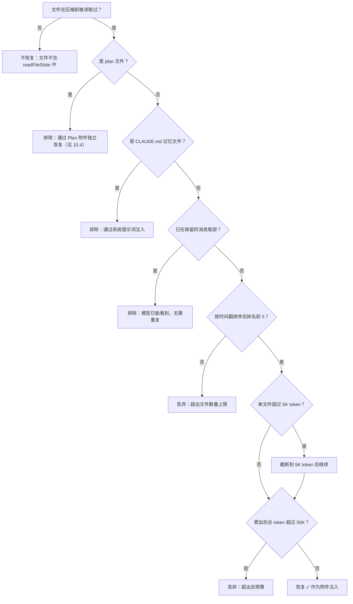
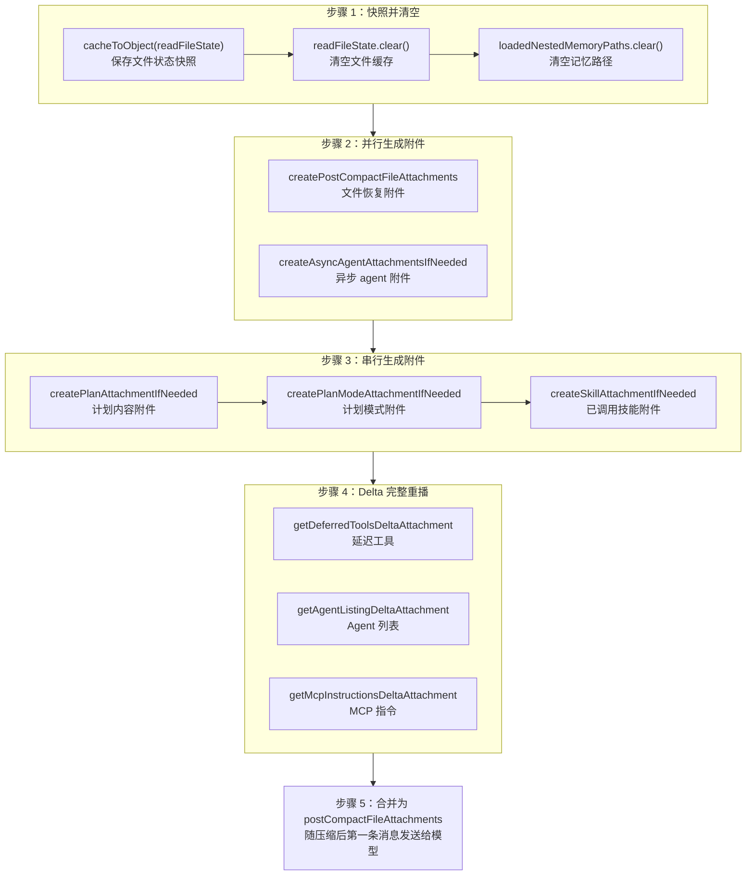

# 第10章：压缩后的文件状态保留

> *"Compression without restoration is just data loss with extra steps."*

第9章讲了压缩**何时触发**以及**如何生成摘要**。但压缩的故事并未在摘要生成后结束。当一段长对话被浓缩为一条摘要消息时，模型失去了所有原始上下文——它不再知道自己刚刚读过哪些文件，不记得正在执行的计划，甚至不知道有哪些工具可用。如果压缩后的第一个回合就要求模型继续编辑它"刚刚"读过的文件，而模型却一脸茫然地重新 `Read` 一遍，这不仅浪费 token，更打断了用户的工作流。

本章的主题是**压缩后的状态恢复**——Claude Code 如何在压缩完成后，通过一系列精心设计的附件（attachments），将模型"需要但已丢失"的关键上下文注入回对话流。我们将逐一拆解五个恢复维度：文件状态、技能内容、计划状态、Delta 工具声明，以及刻意不恢复的内容。

---

## 10.1 压缩前快照：先存再清

压缩恢复的第一步，不是在压缩后做什么，而是在压缩前**先保存好现场**。

### 10.1.1 `cacheToObject` + `clear`：快照-清空模式

```typescript
// services/compact/compact.ts:517-522
// Store the current file state before clearing
const preCompactReadFileState = cacheToObject(context.readFileState)

// Clear the cache
context.readFileState.clear()
context.loadedNestedMemoryPaths?.clear()
```

这三行代码实现了一个经典的**快照-清空**模式：

1. **快照**：`cacheToObject(context.readFileState)` 将内存中的 `FileStateCache`（一个 Map 结构）序列化为普通的 `Record<string, { content: string; timestamp: number }>` 对象。这个对象记录了压缩前模型读过的每一个文件——文件名、内容、以及最后读取的时间戳。

2. **清空**：`context.readFileState.clear()` 清除文件状态缓存，`context.loadedNestedMemoryPaths?.clear()` 清除已加载的嵌套记忆路径。

为什么要先清空？因为压缩将对话历史替换为一条摘要消息。从模型的视角看，它即将"忘记"之前读过任何文件。如果不清空缓存，系统会误以为模型仍然"知道"这些文件的内容，导致后续的文件去重逻辑出错。清空后，系统进入一个干净的状态，然后有选择地恢复最重要的文件——而不是全部恢复。

### 10.1.2 为什么不全部恢复？

这个问题触及了压缩恢复的核心设计哲学。一次长会话中，模型可能读过几十甚至上百个文件。如果压缩后将它们全部注入回对话，就会造成一个荒谬的循环：**压缩刚省出的 token 空间，立刻被恢复的文件内容填满**。

因此，恢复策略的本质是一个**预算分配问题**——在有限的 token 预算内，选择性地恢复最有价值的状态。

---

## 10.2 文件恢复：最近 5 个文件、单文件 5K、总预算 50K

### 10.2.1 五个常量的预算体系

```typescript
// services/compact/compact.ts:122-130
export const POST_COMPACT_MAX_FILES_TO_RESTORE = 5
export const POST_COMPACT_TOKEN_BUDGET = 50_000
export const POST_COMPACT_MAX_TOKENS_PER_FILE = 5_000
export const POST_COMPACT_MAX_TOKENS_PER_SKILL = 5_000
export const POST_COMPACT_SKILLS_TOKEN_BUDGET = 25_000
```

这五个常量构成了压缩后恢复的完整预算框架。下面用一张表来展示它们的分配逻辑：

**表 10-1：压缩后 token 预算分配表**

| 预算类别 | 常量名 | 限额 | 含义 |
|---------|--------|------|------|
| 文件数量上限 | `POST_COMPACT_MAX_FILES_TO_RESTORE` | 5 个 | 最多恢复最近读取的 5 个文件 |
| 单文件 token 上限 | `POST_COMPACT_MAX_TOKENS_PER_FILE` | 5,000 | 每个文件最多占用 5K token |
| 文件恢复总预算 | `POST_COMPACT_TOKEN_BUDGET` | 50,000 | 所有恢复文件的 token 总量不超过 50K |
| 单技能 token 上限 | `POST_COMPACT_MAX_TOKENS_PER_SKILL` | 5,000 | 每个技能文件截断到 5K token |
| 技能恢复总预算 | `POST_COMPACT_SKILLS_TOKEN_BUDGET` | 25,000 | 所有技能的 token 总量不超过 25K |

以 200K 上下文窗口为例，压缩后摘要大约占用 10K-20K token。文件恢复最多消耗 50K，技能恢复最多消耗 25K，总计约 75K-95K——仍然为后续对话留出了 100K+ 的空间。这是一个深思熟虑的平衡：**恢复足够的上下文让模型无缝继续工作，但不至于让压缩变得无意义**。

### 10.2.2 恢复逻辑详解

```typescript
// services/compact/compact.ts:1415-1464
export async function createPostCompactFileAttachments(
  readFileState: Record<string, { content: string; timestamp: number }>,
  toolUseContext: ToolUseContext,
  maxFiles: number,
  preservedMessages: Message[] = [],
): Promise<AttachmentMessage[]> {
  const preservedReadPaths = collectReadToolFilePaths(preservedMessages)
  const recentFiles = Object.entries(readFileState)
    .map(([filename, state]) => ({ filename, ...state }))
    .filter(
      file =>
        !shouldExcludeFromPostCompactRestore(
          file.filename,
          toolUseContext.agentId,
        ) && !preservedReadPaths.has(expandPath(file.filename)),
    )
    .sort((a, b) => b.timestamp - a.timestamp)
    .slice(0, maxFiles)
  // ...
}
```

这个函数的逻辑可以分解为四步：

**第一步：排除不需要恢复的文件**。`shouldExcludeFromPostCompactRestore`（行 1674-1705）排除两类文件：
- **计划文件**（plan files）——它们有独立的恢复通道（见 10.4 节）
- **CLAUDE.md 记忆文件**——这些文件通过系统提示词注入，不需要通过文件恢复通道重复注入

同时，如果某个文件路径已经出现在保留的消息尾部（`preservedReadPaths`），也不需要重复恢复——模型已经能在上下文中看到它。

**第二步：按时间戳排序**。`.sort((a, b) => b.timestamp - a.timestamp)` 将文件按最后读取时间降序排列。最近读取的文件最有可能是模型下一步需要操作的文件。

**第三步：取前 N 个**。`.slice(0, maxFiles)` 截取最近的 5 个文件。注意这个截取发生在排除过滤之后——如果 20 个文件中有 3 个被排除，那么参与排序的只有 17 个文件，最终取前 5 个。

**第四步：并行生成附件**。对选中的文件，通过 `generateFileAttachment` 并行重新读取文件内容，每个文件受 `POST_COMPACT_MAX_TOKENS_PER_FILE`（5K token）限制。这里有一个重要细节：恢复时读取的是**磁盘上的当前内容**，而非快照中的缓存内容。如果文件在压缩期间被外部修改（比如用户在编辑器中手动修改），恢复的内容是修改后的版本。

**第五步：预算控制**。生成文件附件后，还有一道预算闸门：

```typescript
// services/compact/compact.ts:1452-1463
let usedTokens = 0
return results.filter((result): result is AttachmentMessage => {
  if (result === null) {
    return false
  }
  const attachmentTokens = roughTokenCountEstimation(jsonStringify(result))
  if (usedTokens + attachmentTokens <= POST_COMPACT_TOKEN_BUDGET) {
    usedTokens += attachmentTokens
    return true
  }
  return false
})
```

即使只有 5 个文件，如果它们都很大（每个接近 5K token），总量也可能超过 50K 预算。这个 filter 充当最后的守门人——按顺序累加每个文件的 token 数，一旦总量超过 `POST_COMPACT_TOKEN_BUDGET`（50K），就丢弃剩余的文件。

### 10.2.3 "保留 vs 丢弃"决策树

下面这棵决策树描述了每个文件在压缩后是否会被恢复的完整判定逻辑：



这棵决策树揭示了一个重要设计：**恢复不是一个简单的"最近 N 个"算法，而是一个多层过滤管线**。排除规则、数量限制、单文件截断、总预算上限，四层防护确保恢复的内容既有价值又不会过度膨胀。

---

## 10.3 技能重注入：invokedSkills 的选择性恢复

### 10.3.1 为什么技能需要独立恢复？

技能（Skills）是 Claude Code 的扩展能力系统。当用户在会话中调用了一个技能（比如 `code-review` 或 `commit`），技能的指令内容会被注入到对话中。压缩后，这些指令和上下文一起消失。但技能往往包含关键的行为约束——比如"提交前必须运行测试"或"代码审查时关注安全问题"。如果不恢复它们，模型在压缩后可能违反这些约束。

### 10.3.2 技能恢复机制

```typescript
// services/compact/compact.ts:1494-1534
export function createSkillAttachmentIfNeeded(
  agentId?: string,
): AttachmentMessage | null {
  const invokedSkills = getInvokedSkillsForAgent(agentId)

  if (invokedSkills.size === 0) {
    return null
  }

  // Sorted most-recent-first so budget pressure drops the least-relevant skills.
  let usedTokens = 0
  const skills = Array.from(invokedSkills.values())
    .sort((a, b) => b.invokedAt - a.invokedAt)
    .map(skill => ({
      name: skill.skillName,
      path: skill.skillPath,
      content: truncateToTokens(
        skill.content,
        POST_COMPACT_MAX_TOKENS_PER_SKILL,
      ),
    }))
    .filter(skill => {
      const tokens = roughTokenCountEstimation(skill.content)
      if (usedTokens + tokens > POST_COMPACT_SKILLS_TOKEN_BUDGET) {
        return false
      }
      usedTokens += tokens
      return true
    })

  if (skills.length === 0) {
    return null
  }

  return createAttachmentMessage({
    type: 'invoked_skills',
    skills,
  })
}
```

技能恢复的策略与文件恢复高度相似，但有两个关键差异：

**差异一：截断而非丢弃**。源码注释（行 125-128）解释了设计意图：

> Skills can be large (verify=18.7KB, claude-api=20.1KB). Previously re-injected unbounded on every compact → 5-10K tok/compact. Per-skill truncation beats dropping — instructions at the top of a skill file are usually the critical part.

技能文件可能很大（`verify` 技能 18.7KB，`claude-api` 技能 20.1KB），但**技能文件开头的指令通常是最关键的部分**。`truncateToTokens` 函数将每个技能截断到 5K token，保留头部指令，丢弃尾部的详细参考内容。这比"整个保留或整个丢弃"的二选一策略更精细。

**差异二：按 agent 隔离**。`getInvokedSkillsForAgent(agentId)` 只返回属于当前 agent 的技能。这防止了主会话的技能泄露到子 agent 的上下文中，反之亦然。

### 10.3.3 预算算术

25K 的总预算能恢复多少个技能？按每个技能 5K token 计算，理论上最多 5 个技能。源码注释也验证了这一点："Budget sized to hold ~5 skills at the per-skill cap."

但实际中，许多技能截断后不到 5K token，所以 25K 预算通常能覆盖会话中所有被调用的技能。只有当用户在一次长会话中调用了大量大型技能时，预算才会成为瓶颈——此时最久远的技能会被优先丢弃。

---

## 10.4 刻意不恢复的内容：sentSkillNames

并非所有被清空的状态都需要恢复。源码中最有意思的一个设计决策是：

```typescript
// services/compact/compact.ts:524-529
// Intentionally NOT resetting sentSkillNames: re-injecting the full
// skill_listing (~4K tokens) post-compact is pure cache_creation with
// marginal benefit. The model still has SkillTool in its schema and
// invoked_skills attachment (below) preserves used-skill content. Ants
// with EXPERIMENTAL_SKILL_SEARCH already skip re-injection via the
// early-return in getSkillListingAttachments.
```

`sentSkillNames` 是一个模块级的 `Map<string, Set<string>>`，记录了哪些技能的名称列表已经发送给模型。如果在压缩后重置它，系统会在下一个请求中重新注入完整的技能列表附件——大约 4K token。

但代码**故意不重置**它。原因是：
1. **成本不对称**：4K token 的技能列表全部是 `cache_creation` token（需要写入缓存的新内容），但收益微乎其微——模型仍然可以通过 `SkillTool` 的 schema 知道技能工具的存在。
2. **已调用的技能已被恢复**：上一节的 `invoked_skills` 附件已经恢复了实际使用过的技能内容，模型不需要再看到完整的名称列表。
3. **实验性技能搜索**：启用了 `EXPERIMENTAL_SKILL_SEARCH` 的环境本来就跳过技能列表注入。

这是一个典型的**节省 token 的工程决策**——在"恢复的完整性"和"token 成本"之间，选择了后者。4K token 看似不多，但在每次压缩后都会累积，对于频繁压缩的长会话来说，这是一笔可观的节省。

---

## 10.5 Plan 和 PlanMode 附件的保留

Claude Code 的计划模式（Plan Mode）允许模型在执行任何操作前先制定详细计划。压缩后，计划状态必须被完整保留，否则模型会"忘记"正在执行的计划。

### 10.5.1 Plan 附件

```typescript
// services/compact/compact.ts:545-548
const planAttachment = createPlanAttachmentIfNeeded(context.agentId)
if (planAttachment) {
  postCompactFileAttachments.push(planAttachment)
}
```

`createPlanAttachmentIfNeeded`（行 1470-1486）检查当前 agent 是否有活跃的计划文件。如果有，将计划内容作为 `plan_file_reference` 类型的附件注入。注意，plan 文件在文件恢复阶段被 `shouldExcludeFromPostCompactRestore` 显式排除，正是因为它有这条独立的恢复通道——避免同一个文件被恢复两次，浪费预算。

### 10.5.2 PlanMode 附件

```typescript
// services/compact/compact.ts:552-555
const planModeAttachment = await createPlanModeAttachmentIfNeeded(context)
if (planModeAttachment) {
  postCompactFileAttachments.push(planModeAttachment)
}
```

Plan 附件恢复的是**计划内容**，PlanMode 附件恢复的是**模式状态**。`createPlanModeAttachmentIfNeeded`（行 1542-1560）检查用户是否正处于 plan 模式（`mode === 'plan'`）。如果是，它注入一个 `plan_mode` 类型的附件，其中包含 `reminderType: 'full'` 标记——这确保模型在压缩后继续在 plan 模式下运行，而不是回退到正常的执行模式。

这两个附件协同工作：Plan 附件告诉模型"你正在执行这个计划"，PlanMode 附件告诉模型"你必须继续以计划模式工作"。缺少任何一个都会导致行为偏差。

---

## 10.6 Delta 附件：工具和指令的重新宣告

压缩不仅清除了文件状态，还清除了所有之前的 delta 附件。Delta 附件是系统在对话过程中逐步告知模型的"增量信息"——新注册的延迟工具、新发现的 agent、新加载的 MCP 指令。压缩后，这些信息随着旧消息一起消失。

### 10.6.1 三类 Delta 的完整重播

```typescript
// services/compact/compact.ts:563-585
// Compaction ate prior delta attachments. Re-announce from the current
// state so the model has tool/instruction context on the first
// post-compact turn. Empty message history → diff against nothing →
// announces the full set.
for (const att of getDeferredToolsDeltaAttachment(
  context.options.tools,
  context.options.mainLoopModel,
  [],
  { callSite: 'compact_full' },
)) {
  postCompactFileAttachments.push(createAttachmentMessage(att))
}
for (const att of getAgentListingDeltaAttachment(context, [])) {
  postCompactFileAttachments.push(createAttachmentMessage(att))
}
for (const att of getMcpInstructionsDeltaAttachment(
  context.options.mcpClients,
  context.options.tools,
  context.options.mainLoopModel,
  [],
)) {
  postCompactFileAttachments.push(createAttachmentMessage(att))
}
```

源码注释揭示了这段代码的精妙设计：**传入空数组 `[]` 作为消息历史**。

在正常的对话轮次中，Delta 附件函数会比较当前状态和已出现在消息历史中的内容，只发送"增量"部分。但压缩后没有消息历史可以比较——传入空数组意味着 diff 的基线为空，因此函数会生成**完整的**工具和指令声明。

三类 Delta 附件各自的作用：

| Delta 类型 | 函数 | 恢复内容 |
|-----------|------|---------|
| 延迟工具 | `getDeferredToolsDeltaAttachment` | 尚未加载完整 schema 的工具列表，让模型知道可以通过 `ToolSearch` 按需获取 |
| Agent 列表 | `getAgentListingDeltaAttachment` | 可用的子 agent 列表，让模型知道可以委派任务 |
| MCP 指令 | `getMcpInstructionsDeltaAttachment` | MCP 服务器提供的指令和约束，确保模型遵守外部服务的使用规则 |

`callSite: 'compact_full'` 标记用于遥测分析，区分正常的增量声明和压缩后的完整重播。

### 10.6.2 异步 Agent 附件

```typescript
// services/compact/compact.ts:532-539
const [fileAttachments, asyncAgentAttachments] = await Promise.all([
  createPostCompactFileAttachments(
    preCompactReadFileState,
    context,
    POST_COMPACT_MAX_FILES_TO_RESTORE,
  ),
  createAsyncAgentAttachmentsIfNeeded(context),
])
```

`createAsyncAgentAttachmentsIfNeeded`（行 1568-1599）检查是否有正在后台运行的异步 agent 或已完成但结果未被检索的 agent。如果有，它为每个 agent 生成一个 `task_status` 类型的附件，包含 agent 的描述、状态和进度摘要。这防止了压缩后模型"忘记"有后台任务在运行而重复启动相同的任务。

注意文件恢复和异步 agent 附件的生成是**并行执行**的（`Promise.all`），这是一个性能优化——两者互不依赖，没有理由串行等待。

---

## 10.7 恢复的完整编排

现在让我们将所有恢复步骤放在一起，看看压缩后状态恢复的完整编排（`compact.ts` 行 517-585）：



这个编排的关键特征是**层次化和选择性**。不是所有状态都被恢复，恢复的方式也各不相同——文件通过重新读取恢复，技能通过截断重注入恢复，计划通过专用附件恢复，工具声明通过 delta 重播恢复。每种状态都有最适合它的恢复通道。

---

## 10.8 用户能做什么

理解了压缩后恢复机制，你可以采取以下策略来优化长会话体验：

### 10.8.1 保持文件读取的聚焦

压缩后只恢复最近读取的 5 个文件。如果你在一次对话中让模型读取了 20 个文件，压缩后只有最后 5 个会被自动恢复。这意味着你在对话前半段让模型读取的那些"参考文件"——测试用例、类型定义、配置文件——很可能在压缩后全部丢失。

**策略**：在执行复杂任务时，优先让模型读取它**下一步需要编辑的文件**，而不是"先把所有相关文件都读一遍"。最后读取的文件最有可能在压缩后被保留。如果某个文件对任务至关重要但已经很久没被读取，考虑在你预感压缩即将到来时（比如对话已经进行了 30+ 轮），让模型重新读取一次，刷新它的时间戳。

### 10.8.2 大文件的截断预期

每个文件恢复上限为 5K token（约 2000-2500 行代码，取决于语言）。如果你正在编辑一个超大文件，压缩后模型只能看到文件的开头部分。

**策略**：在压缩可能发生的节点（当你注意到对话已经很长时），显式提醒模型关注大文件中的特定区域。或者更好的做法是，将关键约束写入 `CLAUDE.md`——它永远不受压缩影响。

### 10.8.3 压缩后技能的行为变化

技能被截断到 5K token 后，文件尾部的参考内容可能丢失。如果你依赖的技能行为在压缩后发生了变化，这可能是截断导致的。

**策略**：将最关键的技能指令放在技能文件的**开头**，而非末尾。Claude Code 的截断策略保留头部——这意味着技能文件的结构应该是"关键指令在前，补充参考在后"。

### 10.8.4 利用 Plan Mode 跨越压缩

如果你在执行一个多步骤任务，使用 plan 模式可以确保计划在压缩后被完整保留。计划附件不受 50K 文件预算的限制，它有独立的恢复通道。

**策略**：对于可能跨越压缩边界的复杂任务，先让模型制定计划（`/plan`），然后逐步执行。即使压缩发生在执行过程中，模型也能恢复计划上下文继续工作。

### 10.8.5 留意"压缩遗忘"的模式

如果压缩后模型突然：
- 重新读取它"刚刚"读过的文件——这个文件可能排在第 6 名之后，未被恢复
- 忘记了后台 agent 的存在——检查 agent 是否已被标记为 `retrieved` 或 `pending`
- 不再遵守某个 MCP 工具的约束——delta 重播通常能覆盖，但极端情况下可能有遗漏
- 对之前否决的方案重新提议——摘要倾向于保留"做了什么"，而非"否决了什么"

这些都是正常的工程权衡。预算是有限的，100% 的恢复既不可能也不必要。理解哪些信息"幸存"于压缩、哪些信息会丢失，是驾驭长会话的关键能力。

### 10.8.6 多次压缩的累积效应

一次极长的会话可能经历多次压缩。每次压缩都会：
- 将所有文件状态缓存清空并重建（最多 5 个）
- 重新截断技能内容（每次都从原始内容截断，不会"截断的截断"）
- 重新生成 Delta 附件（完整重播）

但摘要是**不可逆的**。第二次压缩的摘要是基于"第一次的摘要 + 后续对话"生成的，信息密度逐次降低。经过三四次压缩后，对话开头的细节几乎不可能被保留。

**策略**：对于预计超长的任务，在关键的中间节点主动使用 `/compact` 并附加自定义指令，明确列出需要保留的关键信息。不要等到系统自动压缩——那时你无法控制摘要的重点。

---

## 10.9 小结

压缩后的状态恢复体现了 Claude Code 在"信息完整性"和"token 经济性"之间的精细平衡：

1. **快照-清空模式**：先保存现场再清空，确保恢复有据可依、缓存状态一致
2. **分层预算**：文件恢复 50K、技能恢复 25K、独立的 plan 通道——不同类型的状态有不同的恢复预算和策略
3. **选择性恢复**：时间戳排序 + 排除规则 + 预算控制，三层过滤确保只恢复最有价值的内容
4. **刻意不恢复**：`sentSkillNames` 的保留是一个反直觉但正确的决策——4K token 的技能列表注入成本大于收益
5. **Delta 完整重播**：传入空消息历史触发完整重播，是一个巧妙的复用现有增量机制的设计

核心启示：压缩不是"遗忘"，而是"有选择地记住"。理解这个选择的逻辑，你就能预测压缩后模型会记住什么、忘记什么，并据此调整自己的工作方式。

---

## 版本演化：v2.1.91 变化

> 以下分析基于 v2.1.91 bundle 信号对比，结合 v2.1.88 源码推断。

### staleReadFileStateHint 与文件状态追踪

v2.1.91 在工具结果元数据中新增 `staleReadFileStateHint` 字段，当工具执行（如 Bash 命令）导致已读取文件的 mtime 发生变化时，系统会向模型发送陈旧提示。这扩展了本章描述的文件状态追踪体系——从"压缩后恢复文件上下文"延伸到"单轮内检测文件变化"。

v2.1.88 中 `readFileState` 缓存（`cli/print.ts:1147-1177`）已存在于源码中，v2.1.91 将其暴露为模型可感知的输出字段。
