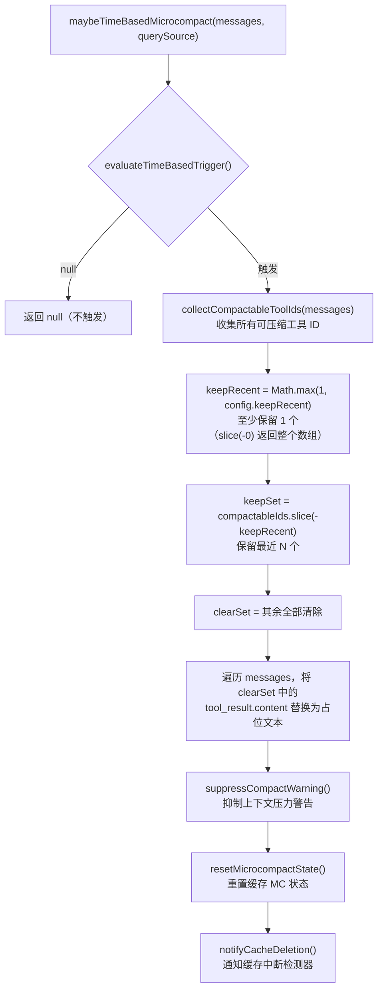
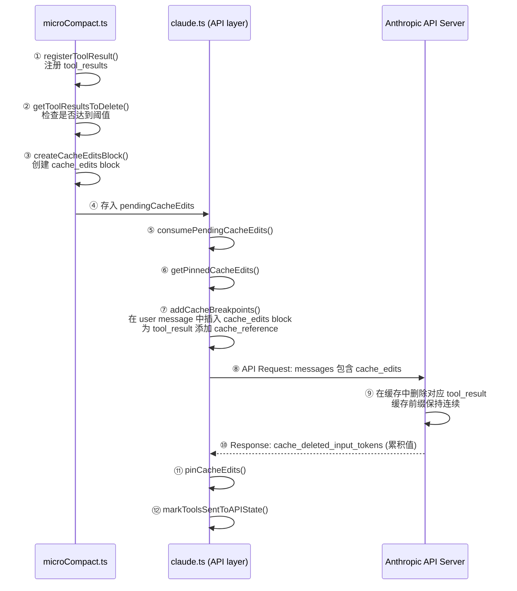

# 第11章：微压缩 — 精准上下文修剪

> *"The cheapest token is the one you never send."*

上一章（第9章）我们详尽分析了自动压缩——当上下文接近窗口上限时，Claude Code 将整个对话浓缩为一份结构化摘要。这是一种"核选项"：有效但代价高昂，它会丢失对话的原始细节，而且需要一次完整的 LLM 调用来生成摘要。

本章的主角是**微压缩**（microcompact）——一种轻量级的上下文修剪策略。它不生成摘要，不调用 LLM，而是直接**清除或删除**旧的工具调用结果。你三分钟前 `grep` 搜索的 200 行输出、半小时前 `cat` 读取的配置文件、一小时前 `bash` 命令的日志——这些信息对模型当前的推理任务来说已经"过时"了。微压缩的核心哲学是：**与其让这些过时内容占据宝贵的上下文空间，不如在恰当的时机精准地移除它们**。

Claude Code 实现了三种微压缩机制，它们在触发条件、执行方式和缓存影响上截然不同：

| 维度 | 基于时间的微压缩 | 缓存微压缩（cache_edits） | API Context Management |
|------|-----------------|-------------------------|----------------------|
| **触发方式** | 距上次助手消息的时间间隔超过阈值 | 可压缩工具数量超过阈值 | API 侧 input_tokens 超过阈值 |
| **执行位置** | 客户端（修改消息内容） | 服务端（cache_edits 指令） | 服务端（context_management 策略） |
| **缓存影响** | 破坏缓存前缀（预期行为，因为缓存已过期） | 保持缓存前缀完整 | 由 API 层管理 |
| **修改方式** | 替换 tool_result.content 为占位文本 | 发送 cache_edits delete 指令 | 声明式策略，API 自动执行 |
| **适用条件** | 长时间空闲后恢复会话 | 实时会话中的增量修剪 | 所有会话（ant 用户，thinking 模型） |
| **源码入口** | `maybeTimeBasedMicrocompact()` | `cachedMicrocompactPath()` | `getAPIContextManagement()` |
| **feature gate** | `tengu_slate_heron` (GrowthBook) | `CACHED_MICROCOMPACT` (build) | 环境变量开关 |

这三种机制的优先级关系也很明确：时间触发最先执行并短路，缓存微压缩其次，API Context Management 作为独立的声明式层始终存在。

---

## 11.1 基于时间的微压缩：缓存过期后的批量清理

### 11.1.1 设计直觉

想象这样一个场景：你在上午 10 点用 Claude Code 完成了一次复杂的重构，然后去吃午饭。下午 1 点回来继续工作——中间间隔了 3 个小时。

在这 3 个小时里发生了什么？**服务端的 prompt cache 已经过期了**。Anthropic 的 prompt cache 有两个 TTL 档位：5 分钟（标准）和 1 小时（扩展）。无论是哪个档位，3 小时后都已失效。这意味着你的下一次 API 调用会将**完整的对话历史**重新写入缓存——每一个 token 都要重新计费为 cache creation。

基于时间的微压缩的逻辑因此非常自然：**既然缓存已经过期，整个前缀都要重写，那不如先把不需要的旧内容清掉，让重写的内容更小更便宜**。

### 11.1.2 配置参数

配置通过 GrowthBook 功能开关 `tengu_slate_heron` 下发，类型为 `TimeBasedMCConfig`：

```typescript
// services/compact/timeBasedMCConfig.ts:18-28
export type TimeBasedMCConfig = {
  /** Master switch. When false, time-based microcompact is a no-op. */
  enabled: boolean
  /** Trigger when (now − last assistant timestamp) exceeds this many minutes. */
  gapThresholdMinutes: number
  /** Keep this many most-recent compactable tool results. */
  keepRecent: number
}

const TIME_BASED_MC_CONFIG_DEFAULTS: TimeBasedMCConfig = {
  enabled: false,
  gapThresholdMinutes: 60,
  keepRecent: 5,
}
```

三个参数各有其考量：

- **`enabled`** 默认关闭——这是一个灰度发布特性，通过 GrowthBook 逐步开启
- **`gapThresholdMinutes: 60`** 对齐服务端 1 小时 cache TTL——这是"安全选择"，源码注释（第 23 行）明确说明："the server's 1h cache TTL is guaranteed expired for all users, so we never force a miss that wouldn't have happened"
- **`keepRecent: 5`** 保留最近 5 个工具结果，为模型提供最小工作上下文

### 11.1.3 触发判定

`evaluateTimeBasedTrigger()` 函数（`microCompact.ts:422-444`）是一个纯判定函数，不产生副作用：

```typescript
// microCompact.ts:422-444
export function evaluateTimeBasedTrigger(
  messages: Message[],
  querySource: QuerySource | undefined,
): { gapMinutes: number; config: TimeBasedMCConfig } | null {
  const config = getTimeBasedMCConfig()
  if (!config.enabled || !querySource || !isMainThreadSource(querySource)) {
    return null
  }
  const lastAssistant = messages.findLast(m => m.type === 'assistant')
  if (!lastAssistant) {
    return null
  }
  const gapMinutes =
    (Date.now() - new Date(lastAssistant.timestamp).getTime()) / 60_000
  if (!Number.isFinite(gapMinutes) || gapMinutes < config.gapThresholdMinutes) {
    return null
  }
  return { gapMinutes, config }
}
```

注意第 428 行的守卫条件：`!querySource` 时直接返回 null。这与缓存微压缩的行为不同——`isMainThreadSource()`（第 249-251 行）将 `undefined` 视为主线程（为了缓存 MC 的向后兼容），但时间触发**显式要求** querySource 存在。源码注释（第 429-431 行）解释了原因：`/context`、`/compact` 等分析性调用会在不带 source 的情况下调用 `microcompactMessages()`，它们不应该触发时间清理。

### 11.1.4 执行逻辑

当触发条件满足时，`maybeTimeBasedMicrocompact()` 执行以下步骤：



关键实现细节在 `microCompact.ts:470-492`——消息修改采用不可变风格：

```typescript
// microCompact.ts:470-492
let tokensSaved = 0
const result: Message[] = messages.map(message => {
  if (message.type !== 'user' || !Array.isArray(message.message.content)) {
    return message
  }
  let touched = false
  const newContent = message.message.content.map(block => {
    if (
      block.type === 'tool_result' &&
      clearSet.has(block.tool_use_id) &&
      block.content !== TIME_BASED_MC_CLEARED_MESSAGE
    ) {
      tokensSaved += calculateToolResultTokens(block)
      touched = true
      return { ...block, content: TIME_BASED_MC_CLEARED_MESSAGE }
    }
    return block
  })
  if (!touched) return message
  return {
    ...message,
    message: { ...message.message, content: newContent },
  }
})
```

注意第 479 行的 `block.content !== TIME_BASED_MC_CLEARED_MESSAGE` 守卫——防止对已清除的内容重复计算 `tokensSaved`。这是幂等性保证：多次执行不会改变 tokensSaved 的统计值。

### 11.1.5 副作用链

时间触发执行完毕后，会产生三个重要的副作用：

1. **`suppressCompactWarning()`**（第 511 行）：微压缩释放了上下文空间，抑制"上下文即将满"的用户可见警告
2. **`resetMicrocompactState()`**（第 517 行）：清空缓存 MC 的工具注册状态——因为我们刚修改了消息内容、破坏了服务端缓存，缓存 MC 的旧状态（哪些工具已注册、哪些已删除）全部失效
3. **`notifyCacheDeletion(querySource)`**（第 526 行）：通知 `promptCacheBreakDetection` 模块，下一次 API 响应的 cache_read_tokens 会下降——这是预期行为，不是缓存中断 bug

第三个副作用特别微妙。源码注释（第 520-522 行）解释了为什么使用 `notifyCacheDeletion` 而不是 `notifyCompaction`："notifyCacheDeletion (not notifyCompaction) because it's already imported here and achieves the same false-positive suppression — adding the second symbol to the import was flagged by the circular-deps check." 这是循环依赖约束下的务实选择：两个函数的效果相同（都防止误报），但引入额外的 import symbol 会触发循环依赖检测。

---

## 11.2 缓存微压缩：不破坏缓存的精准手术

### 11.2.1 核心挑战

时间触发的微压缩有一个本质局限：它**必须修改消息内容**，这意味着**缓存前缀被改变**，下一次 API 调用会产生完整的 cache creation 费用。当缓存已过期时这无所谓（反正都要重写），但在实时会话中，这是不可接受的——你刚积累的缓存前缀可能价值数万 tokens 的 cache creation 费用。

缓存微压缩（cached microcompact）通过 Anthropic API 的 `cache_edits` 特性解决了这个问题：它**不修改本地消息内容**，而是向 API 发送"在服务端缓存中删除指定工具结果"的指令。服务端在缓存前缀中原地移除这些内容，保持前缀的连续性——下一次请求仍然能命中已有缓存。

### 11.2.2 cache_edits 工作原理

以下序列图展示了缓存微压缩的完整生命周期：



让我们逐步拆解这个流程。

### 11.2.3 工具注册与阈值判定

`cachedMicrocompactPath()` 函数（`microCompact.ts:305-399`）首先扫描所有消息，注册可压缩的工具结果：

```typescript
// microCompact.ts:313-329
const compactableToolIds = new Set(collectCompactableToolIds(messages))
// Second pass: register tool results grouped by user message
for (const message of messages) {
  if (message.type === 'user' && Array.isArray(message.message.content)) {
    const groupIds: string[] = []
    for (const block of message.message.content) {
      if (
        block.type === 'tool_result' &&
        compactableToolIds.has(block.tool_use_id) &&
        !state.registeredTools.has(block.tool_use_id)
      ) {
        mod.registerToolResult(state, block.tool_use_id)
        groupIds.push(block.tool_use_id)
      }
    }
    mod.registerToolMessage(state, groupIds)
  }
}
```

注册分两步：`collectCompactableToolIds()` 先从 assistant 消息中收集所有属于可压缩工具集的 `tool_use` ID，然后在 user 消息中找到对应的 `tool_result`，按消息分组注册。分组是因为 cache_edits 的删除粒度是单个 tool_result，但触发判定基于工具总数。

注册后调用 `mod.getToolResultsToDelete(state)` 获取需要删除的工具列表。这个函数的逻辑由 GrowthBook 配置的 `triggerThreshold` 和 `keepRecent` 控制——当注册的工具总数超过 `triggerThreshold` 时，保留最近 `keepRecent` 个，其余标记为待删除。

### 11.2.4 cache_edits block 的生命周期

当有工具需要删除时，代码创建一个 `CacheEditsBlock` 并存入模块级变量 `pendingCacheEdits`：

```typescript
// microCompact.ts:334-339
const toolsToDelete = mod.getToolResultsToDelete(state)

if (toolsToDelete.length > 0) {
  const cacheEdits = mod.createCacheEditsBlock(state, toolsToDelete)
  if (cacheEdits) {
    pendingCacheEdits = cacheEdits
  }
```

这个 `pendingCacheEdits` 变量的消费者是 API 层的 `claude.ts`。在构建 API 请求参数前（第 1531 行），代码调用 `consumePendingCacheEdits()` 一次性取出待发送的编辑指令：

```typescript
// claude.ts:1531-1532
const consumedCacheEdits = cachedMCEnabled ? consumePendingCacheEdits() : null
const consumedPinnedEdits = cachedMCEnabled ? getPinnedCacheEdits() : []
```

`consumePendingCacheEdits()` 的设计是**单次消费**（`microCompact.ts:88-94`）：调用后立即清空 `pendingCacheEdits`。源码注释（第 1528-1530 行）解释了为什么不能在 `paramsFromContext` 内部消费："paramsFromContext is called multiple times (logging, retries), so consuming inside it would cause the first call to steal edits from subsequent calls."

### 11.2.5 在 API 请求中插入 cache_edits

`addCacheBreakpoints()` 函数（`claude.ts:3063-3162`）负责将 cache_edits 指令织入消息数组。核心逻辑分三步：

**第一步：重新插入已固定的编辑**（第 3128-3139 行）

```typescript
// claude.ts:3128-3139
for (const pinned of pinnedEdits ?? []) {
  const msg = result[pinned.userMessageIndex]
  if (msg && msg.role === 'user') {
    if (!Array.isArray(msg.content)) {
      msg.content = [{ type: 'text', text: msg.content as string }]
    }
    const dedupedBlock = deduplicateEdits(pinned.block)
    if (dedupedBlock.edits.length > 0) {
      insertBlockAfterToolResults(msg.content, dedupedBlock)
    }
  }
}
```

每一轮 API 调用，之前已发送过的 cache_edits 必须在**相同位置**重新发送——服务端需要看到完整一致的编辑历史才能正确重建缓存前缀。这就是 `pinnedEdits` 的作用。

**第二步：插入新的编辑**（第 3142-3162 行）

新的 cache_edits block 被插入到**最后一个 user 消息**中，然后通过 `pinCacheEdits(i, newCacheEdits)` 固定位置索引，确保后续调用在同一位置重复发送。

**第三步：去重**

`deduplicateEdits()` 辅助函数（第 3116-3125 行）使用 `seenDeleteRefs` Set 确保同一个 `cache_reference` 不会在多个 block 中重复出现。这防止了一种边缘情况：同一个工具结果在不同轮次被标记为待删除。

### 11.2.6 cache_edits 数据结构

在 API 层，cache_edits block 的类型定义（`claude.ts:3052-3055`）非常简洁：

```typescript
type CachedMCEditsBlock = {
  type: 'cache_edits'
  edits: { type: 'delete'; cache_reference: string }[]
}
```

每个 edit 是一个 `delete` 操作，指向一个 `cache_reference`——这是服务端为每个 `tool_result` 分配的唯一标识符。客户端在之前的 API 响应中获取这些引用，然后在后续请求中引用它们来指定要删除的内容。

### 11.2.7 baseline 与 delta 追踪

`cachedMicrocompactPath()` 在返回结果时，记录了一个 `baselineCacheDeletedTokens` 值（第 374-383 行）：

```typescript
// microCompact.ts:374-383
const lastAsst = messages.findLast(m => m.type === 'assistant')
const baseline =
  lastAsst?.type === 'assistant'
    ? ((
        lastAsst.message.usage as unknown as Record<
          string,
          number | undefined
        >
      )?.cache_deleted_input_tokens ?? 0)
    : 0
```

API 返回的 `cache_deleted_input_tokens` 是一个**累积值**——它包含本次会话中所有 cache_edits 操作删除的总 token 数。为了计算当前操作的实际 delta，需要记录操作前的 baseline，然后用 API 响应中的新累积值减去它。这个设计避免了在客户端做不精确的 token 估算。

### 11.2.8 与时间触发的互斥

`microcompactMessages()` 的入口函数（第 253-293 行）定义了严格的优先级：

```typescript
// microCompact.ts:267-270
const timeBasedResult = maybeTimeBasedMicrocompact(messages, querySource)
if (timeBasedResult) {
  return timeBasedResult
}
```

时间触发优先执行并短路。源码注释（第 261-266 行）解释了为什么："If the gap since the last assistant message exceeds the threshold, the server cache has expired and the full prefix will be rewritten regardless — so content-clear old tool results now ... Cached MC (cache-editing) is skipped when this fires: editing assumes a warm cache, and we just established it's cold."

这是一个精妙的互斥设计：

- **缓存热（warm cache）**：使用 cache_edits，在不破坏缓存的前提下删除内容
- **缓存冷（cold cache）**：使用时间触发，直接修改内容，反正缓存已经失效

两种机制不会同时执行。

---

## 11.3 API Context Management：声明式上下文管理

### 11.3.1 从命令式到声明式

前两种微压缩机制都是**命令式**的——客户端决定删除哪些工具、何时删除、怎么删除。API Context Management 则是**声明式**的：客户端只需描述"当上下文超过 X tokens 时，清除 Y 类型的内容，保留最近 Z 个"，API 服务端自动执行。

这段逻辑位于 `apiMicrocompact.ts`，函数 `getAPIContextManagement()` 构建一个 `ContextManagementConfig` 对象，随 API 请求一起发送：

```typescript
// apiMicrocompact.ts:59-62
export type ContextManagementConfig = {
  edits: ContextEditStrategy[]
}
```

### 11.3.2 两种策略类型

`ContextEditStrategy` 联合类型定义了两种服务端可执行的编辑策略：

**策略一：`clear_tool_uses_20250919`**

```typescript
// apiMicrocompact.ts:36-53
| {
    type: 'clear_tool_uses_20250919'
    trigger?: {
      type: 'input_tokens'
      value: number        // 当 input tokens 超过此值时触发
    }
    keep?: {
      type: 'tool_uses'
      value: number        // 保留最近 N 个工具使用
    }
    clear_tool_inputs?: boolean | string[]  // 清除哪些工具的输入
    exclude_tools?: string[]                // 排除哪些工具
    clear_at_least?: {
      type: 'input_tokens'
      value: number        // 至少清除这么多 tokens
    }
  }
```

**策略二：`clear_thinking_20251015`**

```typescript
// apiMicrocompact.ts:54-56
| {
    type: 'clear_thinking_20251015'
    keep: { type: 'thinking_turns'; value: number } | 'all'
  }
```

这种策略专门处理 thinking blocks——extended thinking 模型（如 Claude Sonnet 4 with thinking）会生成大量思考过程，这些内容在后续轮次中的价值迅速衰减。

### 11.3.3 策略组合逻辑

`getAPIContextManagement()` 根据运行时条件组合多个策略：

```typescript
// apiMicrocompact.ts:64-88
export function getAPIContextManagement(options?: {
  hasThinking?: boolean
  isRedactThinkingActive?: boolean
  clearAllThinking?: boolean
}): ContextManagementConfig | undefined {
  const {
    hasThinking = false,
    isRedactThinkingActive = false,
    clearAllThinking = false,
  } = options ?? {}

  const strategies: ContextEditStrategy[] = []

  // 策略 1: thinking 管理
  if (hasThinking && !isRedactThinkingActive) {
    strategies.push({
      type: 'clear_thinking_20251015',
      keep: clearAllThinking
        ? { type: 'thinking_turns', value: 1 }
        : 'all',
    })
  }
  // ...
}
```

thinking 策略的三个分支：

| 条件 | 行为 | 原因 |
|------|------|------|
| `hasThinking && !isRedactThinkingActive && !clearAllThinking` | `keep: 'all'` | 保留所有 thinking（正常工作状态） |
| `hasThinking && !isRedactThinkingActive && clearAllThinking` | `keep: { type: 'thinking_turns', value: 1 }` | 只保留最后 1 轮 thinking（超过 1 小时空闲 = 缓存失效） |
| `isRedactThinkingActive` | 不添加策略 | redacted thinking 块没有模型可见内容，无需管理 |

注意 `clearAllThinking` 时 value 设为 1 而不是 0——源码注释（第 81 行）解释："the API schema requires value >= 1, and omitting the edit falls back to the model-policy default (often 'all'), which wouldn't clear."

### 11.3.4 工具清除的两种模式

在 `clear_tool_uses_20250919` 策略中，工具清除有两种互补模式：

**模式一：清除工具结果（`clear_tool_inputs`）**

```typescript
// apiMicrocompact.ts:104-124
if (useClearToolResults) {
  const strategy: ContextEditStrategy = {
    type: 'clear_tool_uses_20250919',
    trigger: { type: 'input_tokens', value: triggerThreshold },
    clear_at_least: {
      type: 'input_tokens',
      value: triggerThreshold - keepTarget,
    },
    clear_tool_inputs: TOOLS_CLEARABLE_RESULTS,
  }
  strategies.push(strategy)
}
```

`TOOLS_CLEARABLE_RESULTS`（第 19-26 行）包含那些**输出量大但可丢弃**的工具：Shell 命令、Glob、Grep、FileRead、WebFetch、WebSearch。这些工具的结果通常是搜索输出或文件内容——模型已经处理过了，清除它们不影响后续推理。

**模式二：清除工具使用（`exclude_tools`）**

```typescript
// apiMicrocompact.ts:128-149
if (useClearToolUses) {
  const strategy: ContextEditStrategy = {
    type: 'clear_tool_uses_20250919',
    trigger: { type: 'input_tokens', value: triggerThreshold },
    clear_at_least: {
      type: 'input_tokens',
      value: triggerThreshold - keepTarget,
    },
    exclude_tools: TOOLS_CLEARABLE_USES,
  }
  strategies.push(strategy)
}
```

`TOOLS_CLEARABLE_USES`（第 28-32 行）包含 FileEdit、FileWrite 和 NotebookEdit——这些工具的**输入**（即模型发送的编辑指令）通常比输出更大。`exclude_tools` 的语义是"清除除这些工具外的所有工具使用"，这让 API 侧可以更激进地清理。

两种模式的默认参数相同：`triggerThreshold = 180,000`（约等于自动压缩的警告阈值），`keepTarget = 40,000`（保留最后 40K tokens），`clear_at_least = triggerThreshold - keepTarget = 140,000`（至少释放 140K tokens）。这些值可通过 `API_MAX_INPUT_TOKENS` 和 `API_TARGET_INPUT_TOKENS` 环境变量覆盖。

---

## 11.4 可压缩工具集清单

三种微压缩机制各自定义了不同的可压缩工具集。理解这些差异对于预测哪些工具结果会被清除至关重要。

### 11.4.1 `COMPACTABLE_TOOLS`（时间触发 + 缓存微压缩共用）

```typescript
// microCompact.ts:41-50
const COMPACTABLE_TOOLS = new Set<string>([
  FILE_READ_TOOL_NAME,      // Read
  ...SHELL_TOOL_NAMES,       // Bash (多个 shell 变体)
  GREP_TOOL_NAME,            // Grep
  GLOB_TOOL_NAME,            // Glob
  WEB_SEARCH_TOOL_NAME,      // WebSearch
  WEB_FETCH_TOOL_NAME,       // WebFetch
  FILE_EDIT_TOOL_NAME,       // Edit
  FILE_WRITE_TOOL_NAME,      // Write
])
```

### 11.4.2 `TOOLS_CLEARABLE_RESULTS`（API clear_tool_inputs）

```typescript
// apiMicrocompact.ts:19-26
const TOOLS_CLEARABLE_RESULTS = [
  ...SHELL_TOOL_NAMES,
  GLOB_TOOL_NAME,
  GREP_TOOL_NAME,
  FILE_READ_TOOL_NAME,
  WEB_FETCH_TOOL_NAME,
  WEB_SEARCH_TOOL_NAME,
]
```

### 11.4.3 `TOOLS_CLEARABLE_USES`（API exclude_tools）

```typescript
// apiMicrocompact.ts:28-32
const TOOLS_CLEARABLE_USES = [
  FILE_EDIT_TOOL_NAME,       // Edit
  FILE_WRITE_TOOL_NAME,      // Write
  NOTEBOOK_EDIT_TOOL_NAME,   // NotebookEdit
]
```

关键差异：

| 工具 | COMPACTABLE_TOOLS | CLEARABLE_RESULTS | CLEARABLE_USES |
|------|:-:|:-:|:-:|
| Shell (Bash) | yes | yes | -- |
| Grep | yes | yes | -- |
| Glob | yes | yes | -- |
| FileRead (Read) | yes | yes | -- |
| WebSearch | yes | yes | -- |
| WebFetch | yes | yes | -- |
| FileEdit (Edit) | yes | -- | yes |
| FileWrite (Write) | yes | -- | yes |
| NotebookEdit | -- | -- | yes |

NotebookEdit 只出现在 API 的 `TOOLS_CLEARABLE_USES` 中——客户端微压缩不处理它。FileEdit 和 FileWrite 在客户端清除的是**结果**（tool_result），在 API 模式下则从 `clear_tool_inputs` 中排除、改为在 `exclude_tools` 中处理。这种分层设计让客户端和服务端各自处理最适合的部分。

---

## 11.5 缓存中断检测的协调

### 11.5.1 问题：微压缩会触发误报

`promptCacheBreakDetection.ts` 模块持续监控 API 响应中的 `cache_read_tokens`。当该值相比上次请求下降超过 5% 且绝对值超过 2,000 tokens 时，它会报告一次"缓存中断"（cache break）——这通常意味着某些变更（系统提示词修改、工具列表变化）导致缓存前缀失效。

但微压缩**故意**减少了缓存内容。如果不做协调，每次微压缩都会触发一次误报。Claude Code 通过两个通知函数解决这个问题：

### 11.5.2 `notifyCacheDeletion()`

```typescript
// promptCacheBreakDetection.ts:673-682
export function notifyCacheDeletion(
  querySource: QuerySource,
  agentId?: AgentId,
): void {
  const key = getTrackingKey(querySource, agentId)
  const state = key ? previousStateBySource.get(key) : undefined
  if (state) {
    state.cacheDeletionsPending = true
  }
}
```

**调用时机**：缓存微压缩发送 cache_edits 后（`microCompact.ts:366`），以及时间触发修改消息内容后（`microCompact.ts:526`）。

**效果**：设置 `cacheDeletionsPending = true`。当下一次 API 响应到来时，`checkResponseForCacheBreak()`（第 472-481 行）看到此标志，直接跳过中断检测：

```typescript
// promptCacheBreakDetection.ts:472-481
if (state.cacheDeletionsPending) {
  state.cacheDeletionsPending = false
  logForDebugging(
    `[PROMPT CACHE] cache deletion applied, cache read: ${prevCacheRead}
     → ${cacheReadTokens} (expected drop)`,
  )
  state.pendingChanges = null
  return
}
```

### 11.5.3 `notifyCompaction()`

```typescript
// promptCacheBreakDetection.ts:689-698
export function notifyCompaction(
  querySource: QuerySource,
  agentId?: AgentId,
): void {
  const key = getTrackingKey(querySource, agentId)
  const state = key ? previousStateBySource.get(key) : undefined
  if (state) {
    state.prevCacheReadTokens = null
  }
}
```

**调用时机**：完整压缩（`compact.ts:699`）和自动压缩（`autoCompact.ts:303`）完成后。

**效果**：将 `prevCacheReadTokens` 重置为 null，这意味着下一次 API 响应时没有"上一次的值"可以比较——检测器会将其视为"第一次调用"，不报告中断。

**两个函数的区别**：

| 函数 | 重置方式 | 适用场景 |
|------|---------|---------|
| `notifyCacheDeletion` | 标记 `cacheDeletionsPending = true`，下次检测时跳过但保留 baseline | 微压缩（部分删除，baseline 仍有参考价值） |
| `notifyCompaction` | 将 `prevCacheReadTokens` 置 null，完全重置 baseline | 完整压缩（消息结构彻底改变，旧 baseline 无意义） |

---

## 11.6 子代理隔离

微压缩系统必须处理的一个重要场景是**子代理**（sub-agent）。Claude Code 的主线程可以 fork 出多个子代理（session_memory、prompt_suggestion 等），每个子代理有独立的对话历史。

`cachedMicrocompactPath` 只对主线程执行（`microCompact.ts:275-285`）：

```typescript
// microCompact.ts:275-285
if (feature('CACHED_MICROCOMPACT')) {
  const mod = await getCachedMCModule()
  const model = toolUseContext?.options.mainLoopModel ?? getMainLoopModel()
  if (
    mod.isCachedMicrocompactEnabled() &&
    mod.isModelSupportedForCacheEditing(model) &&
    isMainThreadSource(querySource)
  ) {
    return await cachedMicrocompactPath(messages, querySource)
  }
}
```

源码注释（第 272-276 行）解释了原因："Only run cached MC for the main thread to prevent forked agents from registering their tool_results in the global cachedMCState, which would cause the main thread to try deleting tools that don't exist in its own conversation."

`cachedMCState` 是一个模块级全局变量。如果子代理注册了自己的工具 ID，主线程在下次执行时会尝试删除这些 ID——但它们不存在于主线程的消息中，导致无效的 cache_edits 指令。通过 `isMainThreadSource(querySource)` 守卫，子代理被完全排除在缓存微压缩之外。

`isMainThreadSource()` 的实现（第 249-251 行）使用前缀匹配而非精确匹配：

```typescript
// microCompact.ts:249-251
function isMainThreadSource(querySource: QuerySource | undefined): boolean {
  return !querySource || querySource.startsWith('repl_main_thread')
}
```

这是因为 `promptCategory.ts` 会将 querySource 设置为 `'repl_main_thread:outputStyle:<style>'`——如果使用严格的 `=== 'repl_main_thread'` 检查，使用非默认输出样式的用户会被静默排除在缓存微压缩之外。源码注释（第 246-248 行）将旧的精确匹配标注为"latent bug"。

---

## 11.7 用户能做什么

理解微压缩的三种机制后，你可以采取以下策略来优化日常使用体验：

### 11.7.1 理解"工具结果消失"的原因

当你发现模型在对话中后期"忘记"了之前某次 `grep` 或 `cat` 的结果，这很可能不是模型的幻觉，而是微压缩主动清除了旧的工具结果。被清除的工具结果会被替换为 `[Old tool result content cleared]` 占位文本。如果你需要模型重新参考某个搜索结果，直接要求它重新执行搜索即可——这比试图让模型"回忆"已被清除的内容更可靠。

### 11.7.2 长时间离开后的预期管理

如果你离开超过 1 小时再回来继续对话，基于时间的微压缩可能已经清除了大部分旧工具结果（只保留最近 5 个）。这是设计如此——因为服务端缓存已经过期，清除旧内容可以显著减少下一次 API 调用的 cache creation 成本。回来后，让模型重新读取关键文件是正常且高效的操作。

### 11.7.3 利用 CLAUDE.md 保留关键上下文

微压缩只清除工具调用的结果，不影响系统提示词中注入的 `CLAUDE.md` 内容。如果某些信息（如项目约定、架构决策、关键文件路径）需要在整个会话中持续生效，将它们写入 `CLAUDE.md` 是最可靠的方式——它们不受任何压缩或微压缩机制的影响。

### 11.7.4 并行工具调用的成本意识

当模型同时发起多个搜索或读取操作时，这些结果的聚合大小受 200K 字符的消息级预算限制。如果你观察到某些并行工具的结果被持久化到磁盘（模型会提示"Output too large, saved to file"），这是预算机制在防止上下文膨胀。你可以通过更精确的搜索条件来减少单次工具输出的大小。

### 11.7.5 不可压缩工具的认知

并非所有工具结果都会被微压缩清除。`FileEdit`、`FileWrite` 等写入类工具的**结果**在客户端微压缩中是可清除的，但像 `ToolSearch`、`SendMessage` 等工具不在可压缩集合中。了解哪些工具结果会被清除（参见 11.4 节的对比表），有助于你理解模型在长会话中的行为变化。

---

## 11.8 设计模式总结

微压缩系统展现了几个值得学习的工程模式：

**分层降级**：三种机制形成层次——API Context Management 作为声明式基线始终存在；缓存微压缩在支持 cache_edits 的环境中提供精准手术；时间触发作为缓存失效后的兜底。每一层都有明确的前提条件和退化路径。

**副作用协调**：微压缩不是孤立操作——它必须通知缓存中断检测器（防误报）、重置相关状态（防脏数据）、抑制用户警告（防困惑）。这三个副作用通过显式的函数调用（`notifyCacheDeletion`、`resetMicrocompactState`、`suppressCompactWarning`）而非事件系统协调，保持了因果链的可追踪性。

**单次消费语义**：`consumePendingCacheEdits()` 返回数据后立即清空——这防止了在 API 重试场景下的重复消费。这种模式在需要跨模块传递一次性状态时非常实用。

**不可变消息修改**：时间触发路径使用 `map` + 展开运算符创建新的消息数组，而不是原地修改。这确保了如果微压缩逻辑有 bug，原始消息不会被污染。缓存微压缩更进一步——它**完全不修改**本地消息，所有修改都在服务端完成。

**循环依赖规避**：`notifyCacheDeletion` 被复用来替代 `notifyCompaction`，仅仅是因为后者的 import 会触发循环依赖检测。这种务实的妥协在大型代码库中很常见——完美的模块边界让位于构建系统的约束。源码注释坦诚记录了这个取舍，而不是试图隐藏它。

---

## 版本演化：v2.1.91 变化

> 以下分析基于 v2.1.91 bundle 信号对比，结合 v2.1.88 源码推断。

### 冷压缩（Cold Compact）

v2.1.91 引入了 `tengu_cold_compact` 事件，暗示在现有的"热压缩"（紧急、上下文即将满时自动触发）之外，新增了一种"冷压缩"策略：

| 对比维度 | 热压缩（v2.1.88） | 冷压缩（v2.1.91 推断） |
|---------|------------------|---------------------|
| 触发时机 | 上下文达到阻塞阈值 | 上下文接近满但未到阻塞点 |
| 紧迫性 | 高——不压缩则无法继续 | 低——可延迟到下一回合 |
| 用户感知 | 静默执行 | 可能有对话框确认 |

### 压缩对话框

新增 `tengu_autocompact_dialog_opened` 事件表明 v2.1.91 引入了压缩确认 UI——用户可以在压缩发生前看到通知并选择是否继续。这提升了压缩操作的透明度，与 v2.1.88 中完全静默的压缩形成对比。

### 快速回填熔断器

`tengu_auto_compact_rapid_refill_breaker` 解决了一个边缘情况：压缩后，如果大量工具结果迅速填满上下文（如读取多个大文件），系统可能进入"压缩→回填→再压缩"的循环。这个熔断器在检测到快速回填模式时中断循环，避免无意义的 API 开销。

### 手动压缩追踪

`tengu_autocompact_command` 将用户手动触发的 `/compact` 命令与系统自动触发的压缩区分开来，使遥测数据能够准确反映用户意图 vs 系统行为。
