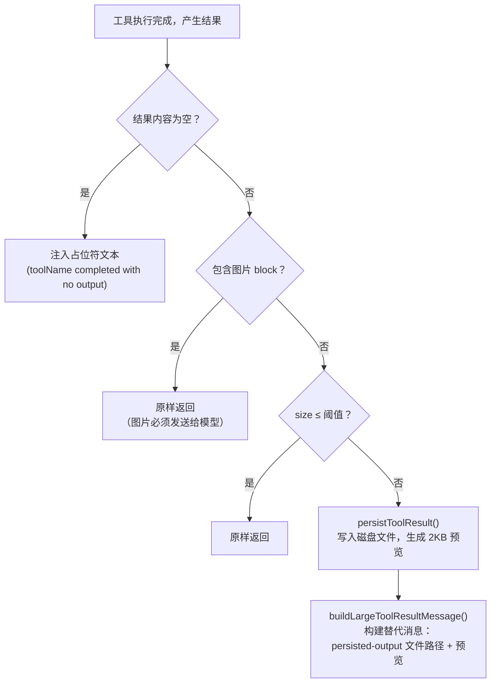
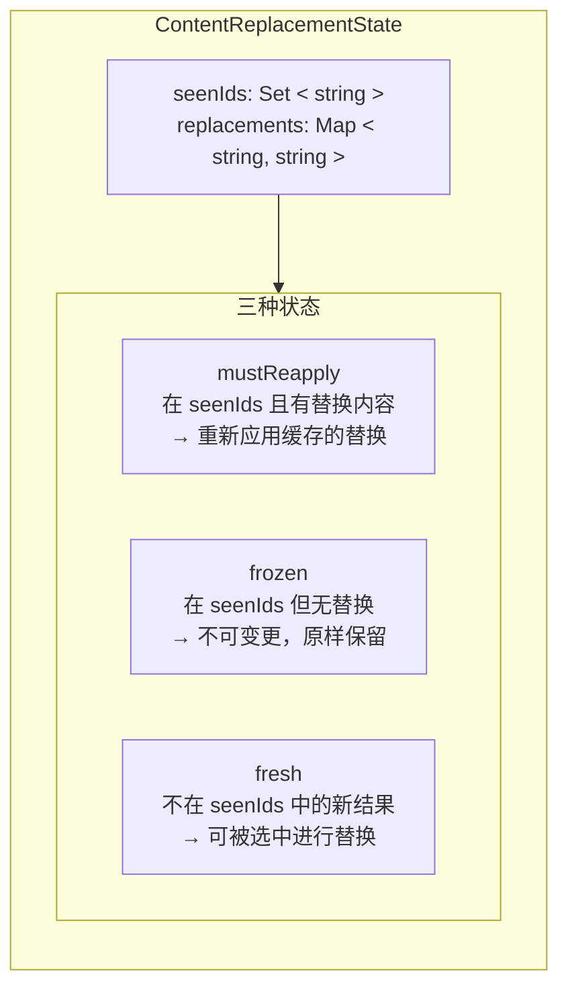
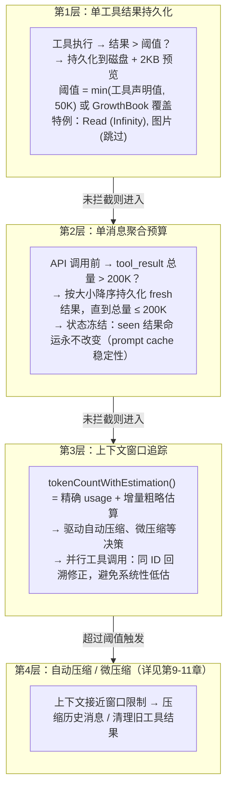

# 第12章：Token 预算策略

## 为什么这很重要

在第9-11章中，我们分析了 Claude Code 在上下文窗口"满"了之后如何压缩和修剪。但还有一个更基本的问题：**在内容进入上下文窗口之前，如何控制它的大小？**

一次 `grep` 返回 80KB 的搜索结果，一次 `cat` 读取 200KB 的日志文件，五个并行工具调用每个返回 50KB——这些都是真实场景。如果不加控制，单个工具结果就可能吃掉上下文窗口的四分之一，而一组并行工具调用则可能直接将上下文推到需要压缩的临界点。

Token 预算策略是 Claude Code 上下文管理的"入口闸门"。它在三个层级运作：

1. **单工具结果级别**：超过阈值的结果持久化到磁盘，只向模型展示预览
2. **单消息级别**：一轮并行工具调用的结果总量不超过 200K 字符
3. **Token 计数级别**：通过规范 API 或粗略估算追踪上下文窗口使用量

本章将深入这三个层级的实现，揭示其中的工程权衡——特别是并行工具调用场景下的 token 计数陷阱。

---

## 12.1 工具结果持久化：50K 字符的入口闸门

### 核心常量

工具结果的大小控制围绕两个核心常量展开，定义在 `constants/toolLimits.ts` 中：

```typescript
// constants/toolLimits.ts:13
export const DEFAULT_MAX_RESULT_SIZE_CHARS = 50_000

// constants/toolLimits.ts:49
export const MAX_TOOL_RESULTS_PER_MESSAGE_CHARS = 200_000
```

第一个常量是**单工具结果**的全局上限——当一个工具的输出超过 50,000 个字符时，完整内容被写入磁盘文件，模型只收到一个包含文件路径和前 2,000 字节预览的替代消息。第二个常量是**单消息**内所有工具结果的聚合上限，用于防范并行工具调用的累积效应。

这两个常量之间的关系值得注意：200K / 50K = 4，意味着即使四个工具都各自达到单工具上限，它们在一条消息内仍然安全。但如果五个或更多并行工具同时返回接近上限的结果，就会触发消息级别的预算执行。

### 持久化阈值的计算

单工具的持久化阈值并非简单等于 50K——它是一个多层决策：

```typescript
// utils/toolResultStorage.ts:55-78
export function getPersistenceThreshold(
  toolName: string,
  declaredMaxResultSizeChars: number,
): number {
  // Infinity = hard opt-out
  if (!Number.isFinite(declaredMaxResultSizeChars)) {
    return declaredMaxResultSizeChars
  }
  const overrides = getFeatureValue_CACHED_MAY_BE_STALE<Record<
    string, number
  > | null>(PERSIST_THRESHOLD_OVERRIDE_FLAG, {})
  const override = overrides?.[toolName]
  if (
    typeof override === 'number' &&
    Number.isFinite(override) &&
    override > 0
  ) {
    return override
  }
  return Math.min(declaredMaxResultSizeChars, DEFAULT_MAX_RESULT_SIZE_CHARS)
}
```

这个函数的决策逻辑构成一个优先级链：

| 优先级 | 条件 | 结果 |
|--------|------|------|
| 1（最高） | 工具声明 `maxResultSizeChars: Infinity` | 永不持久化（Read 工具使用此机制） |
| 2 | GrowthBook flag `tengu_satin_quoll` 中有该工具的覆盖值 | 使用远程覆盖值 |
| 3 | 工具声明了自定义 `maxResultSizeChars` | `Math.min(声明值, 50_000)` |
| 4（默认） | 无特殊声明 | 50,000 字符 |

**表 12-1：单工具持久化阈值优先级链**

第一个优先级特别有意思：Read 工具将自己的 `maxResultSizeChars` 设为 `Infinity`，意味着它**永远不会**被持久化。源码注释（第59-61行）解释了原因——Read 工具的输出如果被持久化到文件，模型就需要再次调用 Read 去读取那个文件，形成循环。Read 工具通过自己的 `maxTokens` 参数控制输出大小，不依赖通用的持久化机制。

### 持久化流程

当工具结果超过阈值时，`maybePersistLargeToolResult` 函数执行以下流程：



**图 12-1：工具结果持久化决策流程**

有两个值得关注的实现细节：

**空结果的特殊处理**（第280-295行）：空的 `tool_result` 内容会导致某些模型（注释中提到 "capybara"）误判为对话轮次边界，从而错误地结束输出。这是因为服务端渲染器在 `tool_result` 之后不插入 `\n\nAssistant:` 标记，空内容会匹配到 `\n\nHuman:` 的停止序列模式。解决方案是注入一个简短的占位字符串 `(toolName completed with no output)`。

**文件写入的幂等性**（第161-172行）：`persistToolResult` 使用 `flag: 'wx'` 写入文件，这意味着如果文件已存在则抛出 `EEXIST` 错误——函数捕获并忽略这个错误。这个设计是为了应对 microcompact 重放原始消息时的重复持久化问题：`tool_use_id` 在每次调用中是唯一的，相同 ID 的内容是确定性的，所以跳过已存在的文件是安全的。

### 持久化后的消息格式

当结果被持久化后，模型实际看到的消息如下：

```xml
<persisted-output>
Output too large (82.3 KB). Full output saved to:
  /path/to/session/tool-results/toolu_01XYZ.txt

Preview (first 2.0 KB):
[前 2000 字节的内容，在换行符处截断]
...
</persisted-output>
```

预览的生成逻辑（第339-356行）会尽量在换行符处截断，避免切断一行的中间位置。如果最后一个换行符的位置在限制值的 50% 之前（意味着要么只有一行，要么行非常长），则回退到精确的字节限制。

---

## 12.2 单消息预算：200K 聚合上限

### 为什么需要消息级别的预算

单工具的 50K 上限不足以应对并行工具调用的场景。考虑这种情况：模型同时发起 10 个 `Grep` 调用搜索不同的关键词，每个返回 40K 字符——单独看都在 50K 阈值以下，但合计 400K 字符将在一条 user 消息中发送给 API。这会立即消耗大量上下文窗口，可能触发不必要的压缩。

`MAX_TOOL_RESULTS_PER_MESSAGE_CHARS = 200_000`（第49行）就是为这个场景设计的聚合预算。注释（第40-48行）明确说明了核心设计原则：**消息之间独立评估**——一轮对话中 150K 的结果和另一轮中 150K 的结果各自都在预算内，不会互相影响。

### 消息分组的复杂性

并行工具调用在 Claude Code 内部的消息表示并不简单。当模型发起多个并行工具调用时，流式处理代码为每个 `content_block_stop` 事件产生一个**独立的** AssistantMessage 记录，然后每个 `tool_result` 作为独立的 user 消息紧随其后。所以内部消息数组看起来像：

```
[..., assistant(id=A), user(result_1), assistant(id=A), user(result_2), ...]
```

注意多个 assistant 记录**共享同一个 `message.id`**。但在发送给 API 之前，`normalizeMessagesForAPI` 会将连续的 user 消息合并为一条。消息级别的预算必须按照 API 看到的分组方式工作，而不是内部的分散表示。

`collectCandidatesByMessage` 函数（第600-638行）实现了这个分组逻辑。它将消息按"assistant 消息边界"分组——只有**未曾见过的** assistant `message.id` 才创建新的分组边界：

```typescript
// utils/toolResultStorage.ts:624-635
const seenAsstIds = new Set<string>()
for (const message of messages) {
  if (message.type === 'user') {
    current.push(...collectCandidatesFromMessage(message))
  } else if (message.type === 'assistant') {
    if (!seenAsstIds.has(message.message.id)) {
      flush()
      seenAsstIds.add(message.message.id)
    }
  }
}
```

这里有一个微妙的边界情况：当并行工具执行中发生中止（abort），`agent_progress` 消息可能插入到 tool_result 消息之间。如果在 progress 消息处创建分组边界，那些 tool_result 就会被拆分到不同的低于预算的小组中，绕过了聚合预算检查——但 `normalizeMessagesForAPI` 会在线路上把它们合并为一条超预算的大消息。代码通过只在 assistant 消息处分组（忽略 progress、attachment 等类型）来避免这个问题。

### 预算执行与状态冻结

消息级别预算的核心机制是 `enforceToolResultBudget` 函数（第769-908行）。它的设计围绕一个关键约束：**prompt cache 稳定性**。一旦模型看到了某个工具结果（无论是完整内容还是替代预览），这个决策在后续所有 API 调用中必须保持一致。否则，前缀变化会导致 prompt cache 失效。

这引出了"三态分区"机制：



**图 12-2：工具结果三态分区与状态转换**

每轮 API 调用前的执行流程：

1. **对每个消息分组**，将候选的 tool_result 按上述三态分区
2. **mustReapply**：从 Map 中取出之前缓存的替代字符串，原样重新应用——零 I/O，字节级一致
3. **frozen**：之前看过但没有被替换的结果——不可再替换（否则会破坏 prompt cache 前缀）
4. **fresh**：本轮新增的结果——检查聚合预算，超预算时按大小降序选择最大的结果进行持久化

选择哪些 fresh 结果进行替换的逻辑在 `selectFreshToReplace`（第675-692行）中：按大小降序排列，逐一选中直到剩余总量（frozen + 未选中的 fresh）降到预算限制以下。如果仅 frozen 结果就超过了预算，则接受超额——microcompact 最终会清理它们。

### 状态标记的时序

代码中有一个精心设计的时序约束（第833-842行）。未被选中持久化的候选者**立即同步**标记为 seen（加入 `seenIds`），而被选中持久化的候选者则在 `await persistToolResult()` 完成后才标记——这保证了 `seenIds.has(id)` 和 `replacements.has(id)` 的一致性。注释解释了原因：如果一个 ID 出现在 `seenIds` 中但不在 `replacements` 中，它会被分类为 frozen（不可替换），导致完整内容被发送；而同时主线程可能发送的是预览——两边不一致会导致 prompt cache 失效。

---

## 12.3 Token 计数：规范 vs 粗略估算

### 两种计数机制

Claude Code 维护两套 token 计数机制，适用于不同场景：

| 特性 | 规范计数（API usage） | 粗略估算 |
|------|----------------------|---------|
| 数据来源 | API 响应中的 `usage` 字段 | 字符长度 / 字节-per-token 系数 |
| 精确度 | 精确 | 偏差可达 ±50% |
| 可用时机 | API 调用完成后 | 任何时刻 |
| 用途 | 阈值判断、预算计算、计费 | 填补 API 调用间的空白 |

**表 12-2：Token 计数两种机制对比**

### 规范计数：从 API Usage 到上下文大小

API 响应的 `usage` 对象包含多个字段，`getTokenCountFromUsage` 函数（`utils/tokens.ts:46-53`）将它们组合为完整的上下文窗口大小：

```typescript
// utils/tokens.ts:46-53
export function getTokenCountFromUsage(usage: Usage): number {
  return (
    usage.input_tokens +
    (usage.cache_creation_input_tokens ?? 0) +
    (usage.cache_read_input_tokens ?? 0) +
    usage.output_tokens
  )
}
```

这个计算包含了四个组成部分：`input_tokens`（本次请求的非缓存输入）、`cache_creation_input_tokens`（本次新写入缓存的 token）、`cache_read_input_tokens`（从缓存读取的 token）和 `output_tokens`（模型生成的输出）。注意缓存相关的字段是可选的（`?? 0`），因为不是所有 API 提供方都返回这些字段。

### 粗略估算：4 字节/token 规则

当 API usage 不可用时——例如在两次 API 调用之间新增了消息——Claude Code 使用字符长度除以经验系数来估算 token 数。核心估算函数在 `services/tokenEstimation.ts:203-208`：

```typescript
// services/tokenEstimation.ts:203-208
export function roughTokenCountEstimation(
  content: string,
  bytesPerToken: number = 4,
): number {
  return Math.round(content.length / bytesPerToken)
}
```

默认的 4 字节/token 是一个保守估算。Claude 的 tokenizer 对英文文本的实际比率约在 3.5-4.5 之间，取 4 作为经验中位数。但不同内容类型的实际比率差异很大：

| 内容类型 | 字节/Token 系数 | 来源 |
|----------|----------------|------|
| 普通文本（英文、代码） | 4 | 默认值（`tokenEstimation.ts:204`） |
| JSON / JSONL / JSONC | 2 | `bytesPerTokenForFileType`（`tokenEstimation.ts:216-224`） |
| 图片（image block） | 固定 2,000 token | `roughTokenCountEstimationForBlock`（第400-412行） |
| PDF 文档（document block） | 固定 2,000 token | 同上 |

**表 12-3：文件类型感知的 Token 估算规则汇总**

JSON 文件使用 2 而非 4 的原因在注释（第213-215行）中解释得很清楚：**密集的 JSON 包含大量单字符 token**（`{`、`}`、`:`、`,`、`"`），这使得每个 token 平均只对应约 2 个字节。如果仍然用 4 来估算，一个 100KB 的 JSON 文件会被估算为 25K token，而实际可能接近 50K——这个低估可能导致超大的工具结果未被持久化，悄悄进入上下文。

`bytesPerTokenForFileType`（第215-224行）根据文件扩展名返回不同的系数：

```typescript
// services/tokenEstimation.ts:215-224
export function bytesPerTokenForFileType(fileExtension: string): number {
  switch (fileExtension) {
    case 'json':
    case 'jsonl':
    case 'jsonc':
      return 2
    default:
      return 4
  }
}
```

### 图片和文档的固定估算

图片和 PDF 文档是特殊情况。API 对图片的实际 token 计费是 `(width × height) / 750`，图片会被缩放到最大 2000×2000 像素（约 5,333 token）。但在粗略估算中，Claude Code 统一使用 **2,000 token** 的固定值（第400-412行）。

这里有一个重要的工程考量：如果图片或 PDF 的 `source.data`（base64 编码）被送入通用的 JSON 序列化路径，一个 1MB 的 PDF 会产生约 1.33M 的 base64 字符，按 4 字节/token 估算就是约 325K token——远高于 API 实际收费的 ~2,000 token。因此代码在通用估算之前显式检查 `block.type === 'image' || block.type === 'document'` 并提前返回固定值，避免灾难性的高估。

---

## 12.4 并行工具调用的 Token 计数陷阱

### 消息交错问题

并行工具调用引入了一个微妙但严重的 token 计数问题。`tokenCountWithEstimation`——Claude Code 中用于阈值判断的**规范函数**——的实现（`utils/tokens.ts:226-261`）包含了对这个问题的详细分析。

问题的根源在于消息数组的交错结构。当模型发起两个并行工具调用时，内部消息数组呈现如下形式：

```
索引:  ... i-3       i-2         i-1          i
消息:  ... asst(A)   user(tr_1)  asst(A)      user(tr_2)
            ↑ usage              ↑ 相同 usage
```

两个 assistant 记录**共享同一个 `message.id` 和相同的 `usage`**（因为它们来自同一个 API 响应的不同 content block）。如果简单地从后往前找到第一个有 `usage` 的 assistant 消息（索引 i-1），然后估算它之后的消息（只有索引 i 处的 `user(tr_2)`），就会**遗漏**索引 i-2 处的 `user(tr_1)`。

但在下一次 API 请求中，`user(tr_1)` 和 `user(tr_2)` **都会**出现在输入中。这意味着 `tokenCountWithEstimation` 会系统性地低估上下文大小。

```
             实际上下文中包含的内容
    ┌──────────────────────────────────────┐
    │ asst(A) user(tr_1) asst(A) user(tr_2)│
    └──────────────────────────────────────┘
              ↑                   ↑
              遗漏!                只估算了这个

             修正后的估算范围
    ┌──────────────────────────────────────┐
    │ asst(A) user(tr_1) asst(A) user(tr_2)│
    └──────────────────────────────────────┘
    ↑ 回溯到首个同 ID 的 assistant          ↑
    从这里开始估算所有后续消息
```

**图 12-3：并行工具调用的 token 计数回溯修正**

### 同 ID 回溯修正

`tokenCountWithEstimation` 的解决方案是在找到最后一个有 usage 的 assistant 记录后，**向前回溯**到共享同一 `message.id` 的第一个 assistant 记录：

```typescript
// utils/tokens.ts:235-250
const responseId = getAssistantMessageId(message)
if (responseId) {
  let j = i - 1
  while (j >= 0) {
    const prior = messages[j]
    const priorId = prior ? getAssistantMessageId(prior) : undefined
    if (priorId === responseId) {
      i = j  // 锚定到更早的同 ID 记录
    } else if (priorId !== undefined) {
      break  // 遇到不同 API 响应，停止回溯
    }
    j--
  }
}
```

注意回溯逻辑中的三种情况：

1. `priorId === responseId`：同一 API 响应的更早分片——将锚点移到这里
2. `priorId !== undefined`（且不同 ID）：遇到了另一个 API 响应——停止回溯
3. `priorId === undefined`：这是 user/tool_result/attachment 消息——可能是分片之间交错的工具结果，继续回溯

回溯完成后，从锚点之后的所有消息（包括所有交错的 tool_result）都会被纳入粗略估算：

```typescript
// utils/tokens.ts:253-256
return (
  getTokenCountFromUsage(usage) +
  roughTokenCountEstimationForMessages(messages.slice(i + 1))
)
```

最终的上下文大小 = 最后一次 API 响应的精确 usage + 此后所有新增消息的粗略估算。这种"精确基线 + 增量估算"的混合方法平衡了精度和性能。

### 何时不应使用哪个函数

源码中的注释（第118-121行，第207-212行）反复强调了函数选择的重要性：

- **`tokenCountWithEstimation`**：**规范函数**，用于所有阈值比较（自动压缩触发、会话记忆初始化等）
- **`tokenCountFromLastAPIResponse`**：只返回最后一次 API 调用的精确 token 总量，不包含新增消息的估算——不适合阈值判断
- **`messageTokenCountFromLastAPIResponse`**：只返回 `output_tokens`——仅用于衡量模型单次生成了多少 token，不反映上下文窗口的使用量

误用这些函数的后果是实际的：如果用 `messageTokenCountFromLastAPIResponse` 来判断是否需要压缩，返回值可能只有几千（一次助手回复的输出），而实际上下文已经超过 180K——压缩永远不会触发，最终导致 API 调用因超过窗口限制而失败。

---

## 12.5 辅助计数：API token 计数与 Haiku 回退

### countTokens API

除了粗略估算，Claude Code 还可以通过 API 获取精确的 token 计数。`countMessagesTokensWithAPI`（`services/tokenEstimation.ts:140-201`）调用 `anthropic.beta.messages.countTokens` 端点，传入完整的消息列表和工具定义，获取精确的 `input_tokens` 值。

这个 API 用于需要精确计数的场景（如工具定义的 token 开销评估），但有延迟开销——它需要一次额外的 HTTP 往返。因此日常的阈值判断使用 `tokenCountWithEstimation` 的混合方法，只在特定场景下使用 API 计数。

### Haiku 回退方案

当 `countTokens` API 不可用（例如某些 Bedrock 配置）时，`countTokensViaHaikuFallback`（第251-325行）使用一种巧妙的替代方案：向 Haiku（小模型）发送一个 `max_tokens: 1` 的请求，利用返回的 `usage` 获取精确的输入 token 数。代价是消耗一次小模型调用的 API 费用，但获得了精确度。

函数在选择回退模型时需要考虑多个平台约束：

- **Vertex 全局区域**：Haiku 不可用，回退到 Sonnet
- **Bedrock + thinking blocks**：Haiku 3.5 不支持 thinking，回退到 Sonnet
- **其他情况**：使用 Haiku（成本最低）

---

## 12.6 端到端的 Token 预算体系

将上述所有机制组合起来，Claude Code 的 token 预算形成一个多层防御体系：



**图 12-4：Token 预算的四层防御体系**

每一层都有明确的职责边界和失败后的降级路径：

- 第1层失败（持久化磁盘出错）→ 原样返回完整结果，第2层和第4层兜底
- 第2层的 frozen 结果无法替换 → 接受超额，由第4层的 microcompact 最终清理
- 第3层的粗略估算不准确 → 可能导致压缩触发过早或过晚，但不会导致数据丢失

### GrowthBook 动态调参

两个核心阈值都可以通过 GrowthBook feature flag 在运行时调整，无需发布新版本：

- **`tengu_satin_quoll`**：单工具持久化阈值的 per-tool 覆盖 map
- **`tengu_hawthorn_window`**：单消息聚合预算的全局覆盖值

`getPerMessageBudgetLimit`（第421-434行）展示了覆盖逻辑的防御性编码——对 GrowthBook 返回的值进行 `typeof`、`isFinite`、`> 0` 三重检查，因为缓存层可能泄漏 `null`、`NaN` 或字符串类型的值。

---

## 12.7 用户能做什么

### 12.7.1 控制工具输出大小

当你的 `grep` 或 `bash` 命令返回大量输出时（超过 50K 字符），结果会被持久化到磁盘，模型只能看到前 2KB 的预览。为了避免这种信息损失，尽量使用更精确的搜索条件——比如用 `grep -l`（只列文件名）替代全文搜索，或者用 `head -n 100` 限制命令输出。这样模型能看到完整结果，而不是被截断的预览。

### 12.7.2 注意并行工具调用的累积效应

当模型同时发起多个搜索时，所有结果的聚合大小受 200K 字符限制。如果你要求模型"同时搜索这 10 个关键词"，部分结果可能因超出预算而被持久化。考虑将大规模搜索拆分为几轮较小的搜索，或者让模型逐步搜索以保持每轮结果在预算内。

### 12.7.3 JSON 文件的特殊考量

JSON 文件的 token 密度是普通代码的 2 倍（每 token 约 2 字节 vs 4 字节）。这意味着一个 100KB 的 JSON 文件实际消耗约 50K token，而同等大小的 TypeScript 文件只消耗约 25K token。当你让模型读取大型 JSON 配置或数据文件时，要意识到它们对上下文窗口的压力更大。

### 12.7.4 利用 Read 工具的特殊地位

Read 工具的输出永远不会被持久化到磁盘——它通过自己的 `maxTokens` 参数控制大小。这意味着通过 Read 读取的文件内容始终直接呈现给模型，不会被截断为 2KB 预览。如果你需要模型完整看到某个文件的内容，使用 Read 比 `cat` 命令更可靠。

### 12.7.5 关注 token 计数的粗略估算偏差

Claude Code 在两次 API 调用之间使用粗略估算（字符数 / 4）来追踪上下文大小，偏差可达 ±50%。这意味着自动压缩的触发时机可能早于或晚于预期。如果你观察到压缩在意想不到的时机发生，这通常是估算偏差导致的正常行为，而非 bug。

---

## 12.8 设计洞察

### 保守估算 vs 激进估算

Token 预算体系中反复出现的设计取舍是：**宁可高估 token 数量，也不要低估**。

- JSON 使用 2 字节/token 而非 4，是因为低估会导致超大结果未被持久化
- 图片使用固定 2,000 token 而非 base64 长度估算，是因为后者会导致灾难性高估（上下文看起来"满"了但其实不满）
- 并行工具调用的回溯修正，是因为遗漏 tool_result 会导致系统性低估

这些选择体现了一个原则：**token 预算是一个安全机制而非优化机制**。高估的代价是提前触发压缩（轻微的性能损失），低估的代价是上下文窗口溢出（API 调用失败）。

### Prompt Cache 对预算设计的深层影响

消息级别预算的大部分复杂性——三态分区、状态冻结、字节级一致的重新应用——都源于一个外部约束：prompt cache 要求前缀稳定。如果没有 prompt cache，每轮 API 调用前可以自由地重新评估所有工具结果是否需要持久化。但 prompt cache 的存在意味着一旦模型"看到了"某个工具结果的完整内容，后续调用必须继续发送完整内容（否则前缀变化导致缓存失效）。

这个约束将一个本可以是无状态的函数（"检查大小，超标则替换"）变成了一个**有状态的状态机**（`ContentReplacementState`），而且状态必须跨越会话恢复（resume）存活——这就是 `ContentReplacementRecord` 被持久化到 transcript 的原因。

这是一个典型的例子：**在 AI Agent 系统中，性能优化（prompt cache）会反向约束功能设计（预算执行），形成意想不到的架构耦合**。

---

## 版本演化：v2.1.91 变化

> 以下分析基于 v2.1.91 bundle 信号对比。

v2.1.91 新增 `tengu_memory_toggled` 和 `tengu_extract_memories_skipped_no_prose` 事件。前者追踪记忆功能开关状态，后者表明当消息中没有散文内容时跳过记忆提取——这是一种预算感知的优化，避免对纯代码/工具结果消息执行无意义的记忆提取操作。
