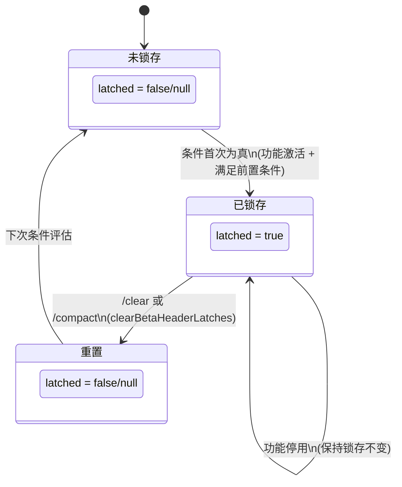

# 第13章：缓存架构与断点设计

## 为什么这很重要

在第12章中，我们讨论了 Token 预算策略如何控制进入上下文窗口的内容大小。但还有一个更隐蔽的成本问题：**即使上下文窗口内的内容完全相同，每次 API 调用仍然需要为系统提示词和工具定义付费。**

对于一个典型的 Claude Code 会话，系统提示词约 11,000 tokens，40+ 个工具的 Schema 定义又贡献约 20,000 tokens——仅这些"固定开销"每次调用就消耗 30,000+ tokens。在一个 50 轮的会话中，这意味着 1,500,000 tokens 被重复处理。按 Anthropic 的定价，这是一笔不可忽视的成本。

Anthropic 的提示词缓存（Prompt Caching）机制正是为解决这个问题而生：如果 API 请求的前缀与之前的请求匹配，服务端可以直接复用已缓存的 KV 状态，将缓存命中部分的费用降低 90%。但缓存命中有严格的条件——前缀必须**逐字节匹配**。一个字符的变化就会导致缓存未命中（cache miss），也就是"缓存中断"（cache break）。

Claude Code 围绕这个约束构建了一套精密的缓存架构，包含三级缓存范围、两种 TTL 层级、以及一组防止缓存中断的"锁存"（latching）机制。本章将深入这套架构的设计与实现。

---

## 13.1 Anthropic API 提示词缓存基础

### 前缀匹配模型

Anthropic 的提示词缓存基于**前缀匹配**原则。服务端将 API 请求视为一个序列化的字节流，从头开始逐字节比较。一旦发现不匹配，缓存就在该位置"断裂"——之前的部分可以复用，之后的部分需要重新计算。

这意味着缓存的有效性完全取决于请求前缀的**稳定性**。API 请求的序列化顺序大致为：

```
[系统提示词] → [工具定义] → [消息历史]
```

系统提示词和工具定义位于序列的前端，它们的任何变化都会使整个缓存失效。消息历史追加在末尾，新消息只需为增量部分付费。

### cache_control 标记

要启用缓存，需要在 API 请求的内容块上添加 `cache_control` 标记：

```typescript
// cache_control 的基本形式
{
  type: 'ephemeral'
}

// 扩展形式（1P 专属）
{
  type: 'ephemeral',
  scope: 'global' | 'org',   // 缓存范围
  ttl: '5m' | '1h'           // 缓存生存时间
}
```

`type: 'ephemeral'` 是唯一支持的缓存类型，表示这是一个临时缓存断点。Claude Code 在 `utils/api.ts`（第68-78行）中定义了扩展的工具 Schema 类型，包含完整的 `cache_control` 选项：

```typescript
// utils/api.ts:68-78
type BetaToolWithExtras = BetaTool & {
  strict?: boolean
  defer_loading?: boolean
  cache_control?: {
    type: 'ephemeral'
    scope?: 'global' | 'org'
    ttl?: '5m' | '1h'
  }
  eager_input_streaming?: boolean
}
```

### 缓存断点的放置

Claude Code 在请求中精心放置缓存断点，通过 `getCacheControl()` 函数（`services/api/claude.ts`，第358-374行）生成统一的 `cache_control` 对象：

```typescript
// services/api/claude.ts:358-374
export function getCacheControl({
  scope,
  querySource,
}: {
  scope?: CacheScope
  querySource?: QuerySource
} = {}): {
  type: 'ephemeral'
  ttl?: '1h'
  scope?: CacheScope
} {
  return {
    type: 'ephemeral',
    ...(should1hCacheTTL(querySource) && { ttl: '1h' }),
    ...(scope === 'global' && { scope }),
  }
}
```

这个函数看似简单，但它的每个条件分支都蕴含着深思熟虑的缓存策略。

---

## 13.2 三级缓存范围

Claude Code 使用三种缓存范围（cache scope），每种范围对应不同的复用粒度。这些范围通过 `splitSysPromptPrefix()` 函数（`utils/api.ts`，第321-435行）分配给系统提示词的不同部分。

### 范围定义

| 缓存范围 | 标识符 | 复用粒度 | 适用内容 | TTL |
|----------|--------|----------|----------|-----|
| **全局缓存** | `'global'` | 跨组织、跨用户 | 所有 Claude Code 实例共享的静态提示词 | 5 分钟（默认） |
| **组织缓存** | `'org'` | 同一组织内的用户 | 包含组织特定但用户无关的内容 | 5 分钟 / 1 小时 |
| **无缓存** | `null` | 不设置 cache_control | 高度动态的内容 | 不适用 |

**表 13-1：三级缓存范围对比**

### 全局缓存范围（global）

全局缓存是最激进的优化——标记为 `global` 的内容可以在所有 Claude Code 用户之间共享 KV 缓存。这意味着当用户 A 发起一个请求，缓存了系统提示词的静态部分后，用户 B 的下一个请求可以直接命中这个缓存。

全局缓存的适用条件非常严格：内容必须是**完全不变的**，不能包含任何用户特定、组织特定、甚至时间特定的信息。Claude Code 通过一个"动态边界标记"（`SYSTEM_PROMPT_DYNAMIC_BOUNDARY`）将系统提示词分为静态和动态两部分：

```typescript
// utils/api.ts:362-404（简化）
if (useGlobalCacheFeature) {
  const boundaryIndex = systemPrompt.findIndex(
    s => s === SYSTEM_PROMPT_DYNAMIC_BOUNDARY,
  )
  if (boundaryIndex !== -1) {
    // 边界之前的内容 → cacheScope: 'global'
    // 边界之后的内容 → cacheScope: null
    for (let i = 0; i < systemPrompt.length; i++) {
      if (i < boundaryIndex) {
        staticBlocks.push(block)
      } else {
        dynamicBlocks.push(block)
      }
    }
    // ...
    if (staticJoined)
      result.push({ text: staticJoined, cacheScope: 'global' })
    if (dynamicJoined)
      result.push({ text: dynamicJoined, cacheScope: null })
  }
}
```

注意边界之后的动态内容被标记为 `cacheScope: null`——它甚至不使用 `org` 级别的缓存，因为动态内容的变化频率太高，缓存命中率极低，标记缓存断点反而增加了 API 请求的复杂度。

### 组织缓存范围（org）

当全局缓存不可用时（例如没有启用全局缓存功能，或内容包含组织特定信息），Claude Code 回退到 `org` 级别：

```typescript
// utils/api.ts:411-435（默认模式）
let attributionHeader: string | undefined
let systemPromptPrefix: string | undefined
const rest: string[] = []

for (const block of systemPrompt) {
  if (block.startsWith('x-anthropic-billing-header')) {
    attributionHeader = block
  } else if (CLI_SYSPROMPT_PREFIXES.has(block)) {
    systemPromptPrefix = block
  } else {
    rest.push(block)
  }
}

const result: SystemPromptBlock[] = []
if (attributionHeader)
  result.push({ text: attributionHeader, cacheScope: null })
if (systemPromptPrefix)
  result.push({ text: systemPromptPrefix, cacheScope: 'org' })
const restJoined = rest.join('\n\n')
if (restJoined)
  result.push({ text: restJoined, cacheScope: 'org' })
```

这里的分块策略揭示了一个重要细节：**计费归属头**（`x-anthropic-billing-header`）被标记为 `null`，不参与缓存。这是因为归属头包含用户身份信息，在 `org` 级别也不可共享。而 CLI 系统提示词前缀（`CLI_SYSPROMPT_PREFIXES`）和剩余系统提示词内容都标记为 `org`，在同一组织内共享。

### MCP 工具的特殊处理

当用户配置了 MCP 工具时，全局缓存的策略发生变化。因为 MCP 工具的定义由外部服务器提供，其内容不可预测，将它们纳入全局缓存会降低命中率。Claude Code 通过 `skipGlobalCacheForSystemPrompt` 标志处理这种情况：

```typescript
// utils/api.ts:326-360
if (useGlobalCacheFeature && options?.skipGlobalCacheForSystemPrompt) {
  logEvent('tengu_sysprompt_using_tool_based_cache', {
    promptBlockCount: systemPrompt.length,
  })
  // 所有内容降级为 org 范围，跳过边界标记
  // ...
}
```

这种降级是保守但合理的——与其冒全局缓存被频繁击穿的风险，不如退回到命中率更稳定的 `org` 级别。

---

## 13.3 缓存 TTL 层级

### 默认 5 分钟 vs 1 小时

Anthropic 的提示词缓存默认 TTL 为 5 分钟。这意味着如果用户在 5 分钟内没有发起新的 API 请求，缓存就会过期。对于活跃的编程会话，5 分钟通常足够。但对于需要频繁思考、查阅文档的场景，5 分钟可能不够。

Claude Code 支持将 TTL 提升到 1 小时，通过 `should1hCacheTTL()` 函数（`services/api/claude.ts`，第393-434行）决定是否启用：

```typescript
// services/api/claude.ts:393-434
function should1hCacheTTL(querySource?: QuerySource): boolean {
  // 3P Bedrock 用户通过环境变量 opt-in
  if (
    getAPIProvider() === 'bedrock' &&
    isEnvTruthy(process.env.ENABLE_PROMPT_CACHING_1H_BEDROCK)
  ) {
    return true
  }

  // 锁存资格检查——防止会话中途 overage 翻转改变 TTL
  let userEligible = getPromptCache1hEligible()
  if (userEligible === null) {
    userEligible =
      process.env.USER_TYPE === 'ant' ||
      (isClaudeAISubscriber() && !currentLimits.isUsingOverage)
    setPromptCache1hEligible(userEligible)
  }
  if (!userEligible) return false

  // 缓存 allowlist——同样锁存以保持会话稳定
  let allowlist = getPromptCache1hAllowlist()
  if (allowlist === null) {
    const config = getFeatureValue_CACHED_MAY_BE_STALE(
      'tengu_prompt_cache_1h_config', {}
    )
    allowlist = config.allowlist ?? []
    setPromptCache1hAllowlist(allowlist)
  }

  return (
    querySource !== undefined &&
    allowlist.some(pattern =>
      pattern.endsWith('*')
        ? querySource.startsWith(pattern.slice(0, -1))
        : querySource === pattern,
    )
  )
}
```

### 资格检查的锁存机制

`should1hCacheTTL()` 中最关键的设计是**锁存**（latching）。函数首次调用时计算用户是否有资格使用 1 小时 TTL，然后将结果存入全局 `STATE`（`bootstrap/state.ts`）：

```typescript
// bootstrap/state.ts:1700-1706
export function getPromptCache1hEligible(): boolean | null {
  return STATE.promptCache1hEligible
}

export function setPromptCache1hEligible(eligible: boolean | null): void {
  STATE.promptCache1hEligible = eligible
}
```

为什么需要锁存？考虑以下场景：

1. 会话开始时，用户在订阅配额内（`isUsingOverage === false`），获得 1 小时 TTL
2. 会话进行到第 30 轮时，用户超出配额（`isUsingOverage === true`）
3. 如果此时 TTL 从 1 小时降回 5 分钟，`cache_control` 对象的序列化结果发生变化
4. 这个变化会导致 API 请求的前缀不再匹配——**缓存中断**

一次 overage 状态翻转导致 ~20,000 tokens 的系统提示词和工具定义缓存全部失效，这显然是不可接受的。锁存机制确保一旦会话开始时确定了 TTL 等级，整个会话期间保持不变。

同样的锁存逻辑也应用于 GrowthBook 的 allowlist 配置——防止 GrowthBook 的磁盘缓存在会话中途更新导致 TTL 行为变化。

### TTL 层级决策表

| 条件 | TTL | 备注 |
|------|-----|------|
| 3P Bedrock + `ENABLE_PROMPT_CACHING_1H_BEDROCK=1` | 1 小时 | Bedrock 用户自行管理计费 |
| Anthropic 员工 (`USER_TYPE=ant`) | 1 小时 | 内部用户 |
| Claude AI 订阅者 + 未超配额 | 1 小时 | 需通过 GrowthBook allowlist |
| 其他用户 | 5 分钟 | 默认 |

**表 13-2：缓存 TTL 决策矩阵**

---

## 13.4 Beta Header 锁存机制

### 问题：动态 Header 导致缓存击穿

Anthropic API 的请求中包含一组"beta headers"，标识客户端使用的实验性功能。这些 header 是服务端缓存键的一部分——添加或移除一个 header 就会改变缓存键，导致缓存中断。

Claude Code 有多个功能可以在会话中途动态激活或停用：

- **AFK 模式**（Auto Mode）：用户离开时自动执行任务
- **Fast Mode**：使用更快但可能更贵的模型
- **缓存编辑**（Cached Microcompact）：在缓存中进行增量编辑

每次这些功能的状态变化，对应的 beta header 就会被添加或移除，触发缓存中断。代码注释（`services/api/claude.ts`，第1405-1410行）明确描述了这个问题：

```typescript
// services/api/claude.ts:1405-1410
// Sticky-on latches for dynamic beta headers. Each header, once first
// sent, keeps being sent for the rest of the session so mid-session
// toggles don't change the server-side cache key and bust ~50-70K tokens.
// Latches are cleared on /clear and /compact via clearBetaHeaderLatches().
// Per-call gates (isAgenticQuery, querySource===repl_main_thread) stay
// per-call so non-agentic queries keep their own stable header set.
```

### 锁存实现

Claude Code 的解决方案是"sticky-on"锁存——一旦某个 beta header 在会话中被发送过，它将在整个会话剩余时间内持续发送，即使触发该 header 的功能已经被停用。

以下是三个 beta header 的锁存代码（`services/api/claude.ts`，第1412-1442行）：

**AFK 模式 Header：**

```typescript
// services/api/claude.ts:1412-1423
let afkHeaderLatched = getAfkModeHeaderLatched() === true
if (feature('TRANSCRIPT_CLASSIFIER')) {
  if (
    !afkHeaderLatched &&
    isAgenticQuery &&
    shouldIncludeFirstPartyOnlyBetas() &&
    (autoModeStateModule?.isAutoModeActive() ?? false)
  ) {
    afkHeaderLatched = true
    setAfkModeHeaderLatched(true)
  }
}
```

**Fast Mode Header：**

```typescript
// services/api/claude.ts:1425-1429
let fastModeHeaderLatched = getFastModeHeaderLatched() === true
if (!fastModeHeaderLatched && isFastMode) {
  fastModeHeaderLatched = true
  setFastModeHeaderLatched(true)
}
```

**缓存编辑 Header：**

```typescript
// services/api/claude.ts:1431-1442
let cacheEditingHeaderLatched = getCacheEditingHeaderLatched() === true
if (feature('CACHED_MICROCOMPACT')) {
  if (
    !cacheEditingHeaderLatched &&
    cachedMCEnabled &&
    getAPIProvider() === 'firstParty' &&
    options.querySource === 'repl_main_thread'
  ) {
    cacheEditingHeaderLatched = true
    setCacheEditingHeaderLatched(true)
  }
}
```

### 锁存状态图

三个 beta header 的锁存遵循相同的状态转换模式：



**图 13-1：Beta Header 锁存状态图**

关键特性：

1. **单向锁存**：从 false 到 true 是不可逆的（在当前会话内）
2. **条件触发**：每个 header 有独立的前置条件组合
3. **会话绑定**：只有 `/clear` 和 `/compact` 命令会重置锁存状态
4. **查询隔离**：`isAgenticQuery` 和 `querySource` 等条件保持逐调用评估，确保非 agentic 查询有自己稳定的 header 集

### 锁存汇总表

| Beta Header | 锁存变量 | 前置条件 | 重置时机 |
|-------------|---------|---------|---------|
| AFK Mode | `afkModeHeaderLatched` | `TRANSCRIPT_CLASSIFIER` 启用 + agentic 查询 + 1P 限定 + auto mode 活跃 | `/clear`, `/compact` |
| Fast Mode | `fastModeHeaderLatched` | Fast mode 可用 + 无冷却 + 模型支持 + 请求启用 | `/clear`, `/compact` |
| Cache Editing | `cacheEditingHeaderLatched` | `CACHED_MICROCOMPACT` 启用 + cachedMC 可用 + 1P + main thread | `/clear`, `/compact` |

**表 13-3：Beta Header 锁存详情**

---

## 13.5 Thinking Clear 锁存

除了 beta header 锁存外，还有一个特殊的锁存机制——`thinkingClearLatched`（`services/api/claude.ts`，第1446-1456行）：

```typescript
// services/api/claude.ts:1446-1456
let thinkingClearLatched = getThinkingClearLatched() === true
if (!thinkingClearLatched && isAgenticQuery) {
  const lastCompletion = getLastApiCompletionTimestamp()
  if (
    lastCompletion !== null &&
    Date.now() - lastCompletion > CACHE_TTL_1HOUR_MS
  ) {
    thinkingClearLatched = true
    setThinkingClearLatched(true)
  }
}
```

这个锁存的触发条件是：距离上次 API 完成超过 1 小时（`CACHE_TTL_1HOUR_MS = 60 * 60 * 1000`）。此时即使使用 1 小时 TTL，缓存也已过期。Thinking Clear 利用这个信号优化 thinking 块的处理——既然缓存已经失效，可以清理累积的 thinking 内容，减少后续请求的 token 消耗。

---

## 13.6 缓存架构全景

将上述所有机制组合起来，Claude Code 的缓存架构可以概括为以下层次：

```
┌──────────────────────────────────────────────────────────┐
│                    API 请求构建                           │
│                                                          │
│  ┌─── 系统提示词 ───┐   ┌── 工具定义 ──┐   ┌── 消息 ──┐ │
│  │                  │   │              │   │          │ │
│  │ [attribution]    │   │ [tool 1]     │   │ [msg 1]  │ │
│  │  scope: null     │   │  scope: org  │   │          │ │
│  │                  │   │              │   │ [msg 2]  │ │
│  │ [prefix]         │   │ [tool 2]     │   │          │ │
│  │  scope: org/null │   │  scope: org  │   │ [msg N]  │ │
│  │                  │   │              │   │          │ │
│  │ [static]         │   │ [tool N]     │   │          │ │
│  │  scope: global   │   │  scope: org  │   │          │ │
│  │                  │   │              │   │          │ │
│  │ [dynamic]        │   │              │   │          │ │
│  │  scope: null     │   │              │   │          │ │
│  └──────────────────┘   └──────────────┘   └──────────┘ │
│                                                          │
│  ────────── 前缀匹配方向 ──────────────────────────→      │
│                                                          │
├──────────────────────────────────────────────────────────┤
│                    TTL 决策层                              │
│                                                          │
│  should1hCacheTTL() → 锁存 → 会话稳定                     │
│                                                          │
├──────────────────────────────────────────────────────────┤
│                  Beta Header 锁存层                       │
│                                                          │
│  afkMode / fastMode / cacheEditing → sticky-on           │
│                                                          │
├──────────────────────────────────────────────────────────┤
│                  缓存中断检测层                             │
│  （详见第14章）                                            │
└──────────────────────────────────────────────────────────┘
```

**图 13-2：Claude Code 缓存架构全景**

---

## 13.7 设计洞察

### 锁存是缓存稳定性的核心模式

Claude Code 在缓存相关的代码中反复使用同一个模式：**首次评估 → 锁存 → 会话稳定**。这个模式出现在：

- TTL 资格检查（`should1hCacheTTL`）
- TTL allowlist 配置
- Beta header 发送状态
- Thinking clear 触发

每一处锁存都是为了同一个目的：防止会话中途的状态变化改变 API 请求的序列化结果，从而保护缓存前缀的完整性。

### 缓存范围是成本与命中率的权衡

三级缓存范围体现了一个清晰的工程权衡：

- **global** 范围命中率最高（所有用户共享），但要求内容绝对静态
- **org** 范围命中率适中，允许包含组织级别的差异
- **null** 不做缓存标记，避免无效的缓存尝试增加请求复杂度

Claude Code 的策略是"能 global 就 global，不能就 org，都不行就放弃"——这比一刀切的策略更精细，也更有效。

### MCP 工具是缓存的最大敌人

MCP 工具的引入给缓存带来了严峻挑战。MCP 服务器可以在会话中途连接或断开，工具定义可以在任何时候变化。当检测到 MCP 工具存在时，系统提示词的全局缓存被降级为 org 级别（`skipGlobalCacheForSystemPrompt`），工具缓存策略也从系统提示词嵌入切换到独立的 `tool_based` 策略。这些降级措施在第15章的缓存优化模式中还将进一步讨论。

---

## 用户能做什么

基于本章分析的缓存架构，以下是构建缓存友好系统时的实践要点：

1. **理解前缀匹配的含义**：Anthropic 的缓存是严格的前缀匹配。在构建 API 请求时，始终将最稳定、最不可能变化的内容放在最前面（系统提示词静态部分），将动态内容（用户消息、附件）放在最后。

2. **为你的系统提示词设计缓存范围**：如果你的应用服务多个用户，识别哪些提示词内容是全局共享的（适合 `global` 范围）、哪些是组织级别的（适合 `org` 范围）、哪些是完全动态的（不标记 `cache_control`）。一刀切的缓存策略会浪费命中率。

3. **使用锁存模式保护缓存键稳定性**：任何可能在会话中途变化的配置项（feature flag、用户配额状态、功能开关），如果它们影响 API 请求的序列化结果，都应该在会话开始时锁存。锁存的核心原则是：宁可使用略微过时的值，也不要让缓存键在会话中途发生变化。

4. **警惕 MCP 工具对缓存的影响**：如果你的应用集成了外部工具（MCP 或类似机制），它们的动态性会显著降低缓存命中率。考虑将外部工具的定义与核心工具分开处理，或在检测到外部工具时降级缓存策略。

5. **监控 `cache_read_input_tokens`**：这是判断缓存健康状态的唯一可靠指标。建立基线后，任何显著下降都值得调查。详见第14章的缓存中断检测系统。

---

## 小结

本章剖析了 Claude Code 的提示词缓存架构：

1. **前缀匹配模型**要求 API 请求的前缀逐字节稳定，任何变化都会导致缓存中断
2. **三级缓存范围**（global/org/null）在命中率和灵活性之间做出精细权衡
3. **TTL 层级**（5 分钟/1 小时）通过锁存机制保证会话内稳定
4. **Beta Header 锁存**使用 sticky-on 模式防止功能开关导致缓存键变化

这些机制共同构成了缓存的"防护层"。但光有防护还不够——当缓存确实发生中断时，系统需要能够检测到并诊断原因。第14章将深入缓存中断检测系统的两阶段架构。
