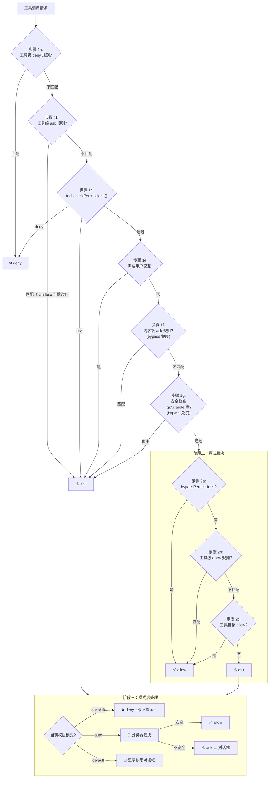

# 第16章：权限系统

## 为什么这很重要

一个能在用户代码库中执行任意 Shell 命令、读写任意文件的 AI Agent，其权限系统的设计质量直接决定了用户信任的上限。过于宽松，用户面临安全风险——恶意 prompt 注入可能触发 `rm -rf /` 或窃取 SSH 密钥；过于严格，每一步操作都弹出确认对话框，AI 编码助手沦为一个"需要人类不断点确认"的自动化工具。

Claude Code 的权限系统试图在这两极之间找到平衡点：通过六种权限模式、三层规则匹配机制、以及一条完整的验证-权限-分类管线，实现"安全操作自动通过、危险操作必须人工确认、模糊地带由 AI 分类器裁决"的分级管控。

本章将完整剖析这一权限系统的设计与实现。

---

## 16.1 六种权限模式

权限模式（Permission Mode）是整个系统的最高层控制开关。用户通过 Shift+Tab 循环切换模式，或通过 `--permission-mode` CLI 参数指定。所有模式定义在 `types/permissions.ts` 中：

```typescript
// types/permissions.ts:16-22
export const EXTERNAL_PERMISSION_MODES = [
  'acceptEdits',
  'bypassPermissions',
  'default',
  'dontAsk',
  'plan',
] as const
```

内部还有两个非公开模式——`auto` 和 `bubble`，组成完整的类型联合：

```typescript
// types/permissions.ts:28-29
export type InternalPermissionMode = ExternalPermissionMode | 'auto' | 'bubble'
export type PermissionMode = InternalPermissionMode
```

以下是各模式的行为说明：

| 模式 | 符号 | 行为 | 典型场景 |
|------|------|------|----------|
| `default` | （无） | 所有工具调用都需要用户确认 | 首次使用、高安全要求环境 |
| `acceptEdits` | `>>` | 工作目录内的文件编辑自动通过，Shell 命令仍需确认 | 日常编码辅助 |
| `plan` | `⏸` | AI 只能读取和搜索，不执行任何写操作 | 代码审查、架构规划 |
| `bypassPermissions` | `>>` | 跳过所有权限检查（安全检查除外） | 信任环境中的批量操作 |
| `dontAsk` | `>>` | 将所有 `ask` 决策转为 `deny`，永不弹出确认 | 自动化 CI/CD 管线 |
| `auto` | `>>` | 由 AI 分类器自动裁决，仅内部可用 | Anthropic 内部开发 |

每个模式都有对应的配置对象（`PermissionMode.ts:42-91`），包含标题、缩写、符号和颜色键。值得注意的是 `auto` 模式通过 `feature('TRANSCRIPT_CLASSIFIER')` 编译时特性门控条件注册——外部构建中这段代码会被 Bun 的死代码消除完全移除。

### 模式切换的循环逻辑

`getNextPermissionMode`（`getNextPermissionMode.ts:34-79`）定义了 Shift+Tab 的循环顺序：

```
外部用户: default → acceptEdits → plan → [bypassPermissions] → default
内部用户: default → [bypassPermissions] → [auto] → default
```

内部用户跳过 `acceptEdits` 和 `plan`，因为 `auto` 模式替代了二者的功能。`bypassPermissions` 需要 `isBypassPermissionsModeAvailable` 标志为 `true` 才出现在循环中。`auto` 模式则需要同时满足功能门控和运行时可用性检查：

```typescript
// getNextPermissionMode.ts:17-29
function canCycleToAuto(ctx: ToolPermissionContext): boolean {
  if (feature('TRANSCRIPT_CLASSIFIER')) {
    const gateEnabled = isAutoModeGateEnabled()
    const can = !!ctx.isAutoModeAvailable && gateEnabled
    // ...
    return can
  }
  return false
}
```

### 模式转换的副作用

模式切换不只是改变一个枚举值——`transitionPermissionMode`（`permissionSetup.ts:597-646`）处理了转换时的副作用：

1. **进入 plan 模式**：调用 `prepareContextForPlanMode`，保存当前模式到 `prePlanMode`
2. **进入 auto 模式**：调用 `stripDangerousPermissionsForAutoMode`，移除危险的 allow 规则（下文详述）
3. **离开 auto 模式**：调用 `restoreDangerousPermissions`，恢复被剥离的规则
4. **离开 plan 模式**：设置 `hasExitedPlanMode` 状态标志

---

## 16.2 权限规则体系

权限模式是粗粒度开关，权限规则（Permission Rule）则提供细粒度控制。一条规则由三个部分组成：

```typescript
// types/permissions.ts:75-79
export type PermissionRule = {
  source: PermissionRuleSource
  ruleBehavior: PermissionBehavior    // 'allow' | 'deny' | 'ask'
  ruleValue: PermissionRuleValue
}
```

其中 `PermissionRuleValue` 指定目标工具和可选的内容限定：

```typescript
// types/permissions.ts:67-70
export type PermissionRuleValue = {
  toolName: string
  ruleContent?: string    // 如 "npm install"、"git:*"
}
```

### 规则来源层级

规则有八种来源（`types/permissions.ts:54-62`），按优先级从高到低排列：

| 来源 | 位置 | 共享性 |
|------|------|--------|
| `policySettings` | 企业管理策略 | 推送到所有用户 |
| `projectSettings` | `.claude/settings.json` | 提交到 git，团队共享 |
| `localSettings` | `.claude/settings.local.json` | 已 gitignore，仅本地 |
| `userSettings` | `~/.claude/settings.json` | 用户全局 |
| `flagSettings` | `--settings` CLI 参数 | 运行时 |
| `cliArg` | `--allowed-tools` 等 CLI 参数 | 运行时 |
| `command` | 命令行子命令上下文 | 运行时 |
| `session` | 会话内临时规则 | 仅当前会话 |

### 规则字符串格式与解析

规则在配置文件中以字符串形式存储，格式为 `ToolName` 或 `ToolName(content)`。解析由 `permissionRuleParser.ts` 的 `permissionRuleValueFromString` 函数（第 93-133 行）完成，它处理了转义括号的问题——因为规则内容本身可能包含括号（如 `python -c "print(1)"`）。

特殊情况：`Bash()` 和 `Bash(*)` 都被视为工具级规则（无内容限定），等价于 `Bash`。

---

## 16.3 三种规则匹配模式

Shell 命令的权限规则支持三种匹配模式，由 `shellRuleMatching.ts` 的 `parsePermissionRule` 函数（第 159-184 行）解析为判别联合类型：

```typescript
// shellRuleMatching.ts:25-38
export type ShellPermissionRule =
  | { type: 'exact'; command: string }
  | { type: 'prefix'; prefix: string }
  | { type: 'wildcard'; pattern: string }
```

### 精确匹配

规则字符串不包含通配符，命令必须完全一致：

| 规则 | 匹配 | 不匹配 |
|------|------|--------|
| `npm install` | `npm install` | `npm install lodash` |
| `git status` | `git status` | `git status --short` |

### 前缀匹配（Legacy `:*` 语法）

以 `:*` 结尾的规则使用前缀匹配——这是向后兼容的遗留语法：

| 规则 | 匹配 | 不匹配 |
|------|------|--------|
| `npm:*` | `npm install`、`npm run build`、`npm test` | `npx create-react-app` |
| `git:*` | `git add .`、`git commit -m "msg"` | `gitk` |

前缀提取由 `permissionRuleExtractPrefix`（第 43-48 行）完成：正则 `/^(.+):\*$/` 捕获 `:*` 之前的所有内容作为前缀。

### 通配符匹配

包含未转义 `*` 的规则（不含尾部 `:*`）使用通配符匹配。`matchWildcardPattern`（第 90-154 行）将模式转换为正则表达式：

| 规则 | 匹配 | 不匹配 |
|------|------|--------|
| `git add *` | `git add .`、`git add src/main.ts`、裸 `git add` | `git commit` |
| `docker build -t *` | `docker build -t myapp` | `docker run myapp` |
| `echo \*` | `echo *`（字面星号） | `echo hello` |

通配符匹配有一个精心设计的行为：当模式以 ` *`（空格加通配符）结尾，且整个模式只有一个未转义的 `*` 时，尾部的空格和参数是可选的。这意味着 `git *` 既匹配 `git add` 也匹配裸 `git`（第 142-145 行）。这使得通配符语义与前缀规则 `git:*` 保持一致。

转义机制使用了 null-byte 哨兵占位符（第 14-17 行），在正则转换过程中避免 `\*`（字面星号）与 `*`（通配符）混淆：

```typescript
// shellRuleMatching.ts:14-17
const ESCAPED_STAR_PLACEHOLDER = '\x00ESCAPED_STAR\x00'
const ESCAPED_BACKSLASH_PLACEHOLDER = '\x00ESCAPED_BACKSLASH\x00'
```

---

## 16.4 验证-权限-分类管线

当 AI 模型发起一次工具调用时，请求通过一条三阶段管线决定是否执行。核心入口是 `hasPermissionsToUseTool`（`permissions.ts:473`），它调用内部函数 `hasPermissionsToUseToolInner` 执行前两个阶段，然后在外层处理第三阶段的分类器逻辑。



### 阶段一：规则验证

这是防御性最强的阶段，所有退出路径都优先于模式裁决。关键步骤：

**步骤 1a-1b**（`permissions.ts:1169-1206`）检查工具级 deny 和 ask 规则。如果 `Bash` 被整体 deny，则任何 Bash 命令都被拒绝。工具级 ask 规则有一个特例：当 sandbox 启用且 `autoAllowBashIfSandboxed` 开启时，将被沙箱化的命令可以跳过 ask 规则。

**步骤 1c**（`permissions.ts:1214-1223`）调用工具自身的 `checkPermissions()` 方法。每种工具（Bash、FileEdit、PowerShell 等）实现各自的权限检查逻辑。例如 Bash 工具会解析命令、检查子命令、匹配 allow/deny 规则。

**步骤 1f**（`permissions.ts:1244-1250`）是一个关键设计：内容级 ask 规则（如 `Bash(npm publish:*)`）即使在 `bypassPermissions` 模式下也必须提示。这是因为用户显式配置的 ask 规则代表了明确的安全意图——"我就是想在发布前确认一下"。

**步骤 1g**（`permissions.ts:1255-1258`）同样是 bypass 免疫的：对 `.git/`、`.claude/`、`.vscode/` 和 shell 配置文件（`.bashrc`、`.zshrc` 等）的写操作始终需要确认。

### 阶段二：模式裁决

如果工具调用通过了阶段一没有被 deny 或被强制 ask，进入模式裁决。`bypassPermissions` 模式在此直接放行。其他模式下，检查 allow 规则和工具自身返回的 allow 决策。

### 阶段三：模式后处理

这是权限决策流水线的最后一道闸门。`dontAsk` 模式将所有 ask 转为 deny，适合非交互环境（`permissions.ts:505-517`）。`auto` 模式则启动 AI 分类器进行裁决，这是整个权限系统中最复杂的路径（下文详述）。

---

## 16.5 `isDangerousBashPermission()`：保护分类器的安全边界

当用户从其他模式切换到 `auto` 模式时，系统会调用 `stripDangerousPermissionsForAutoMode` 将某些 allow 规则临时剥离。被剥离的规则不会删除，而是保存在 `strippedDangerousRules` 字段中，离开 auto 模式时恢复。

判断一条规则是否"危险"的核心函数是 `isDangerousBashPermission`（`permissionSetup.ts:94-147`）：

```typescript
// permissionSetup.ts:94-107
export function isDangerousBashPermission(
  toolName: string,
  ruleContent: string | undefined,
): boolean {
  if (toolName !== BASH_TOOL_NAME) { return false }
  if (ruleContent === undefined || ruleContent === '') { return true }
  const content = ruleContent.trim().toLowerCase()
  if (content === '*') { return true }
  // ...检查 DANGEROUS_BASH_PATTERNS
}
```

危险的规则模式包括五种形态：

1. **工具级 allow**：`Bash`（无 ruleContent）或 `Bash(*)`——允许所有命令
2. **独立通配符**：`Bash(*)` ——等价于工具级 allow
3. **解释器前缀**：`Bash(python:*)` ——允许任意 Python 代码执行
4. **解释器通配符**：`Bash(python *)` ——同上
5. **解释器带标志通配符**：`Bash(python -*)` ——允许 `python -c 'arbitrary code'`

被视为危险的命令前缀定义在 `dangerousPatterns.ts:44-80` 中：

```typescript
// dangerousPatterns.ts:44-80
export const DANGEROUS_BASH_PATTERNS: readonly string[] = [
  ...CROSS_PLATFORM_CODE_EXEC,  // python, node, ruby, perl, ssh 等
  'zsh', 'fish', 'eval', 'exec', 'env', 'xargs', 'sudo',
  // Anthropic 内部额外模式...
]
```

跨平台代码执行入口点（`CROSS_PLATFORM_CODE_EXEC`，第 18-42 行）涵盖了所有主流脚本解释器（python/node/ruby/perl/php/lua）、包运行器（npx/bunx/npm run）、Shell（bash/sh）和远程命令执行工具（ssh）。

内部用户额外包含 `gh`、`curl`、`wget`、`git`、`kubectl`、`aws` 等——这些在外部构建中被 `process.env.USER_TYPE === 'ant'` 门控排除。

PowerShell 有对应的 `isDangerousPowerShellPermission`（`permissionSetup.ts:157-233`），额外检测 PowerShell 特有的危险命令：`Invoke-Expression`、`Start-Process`、`Add-Type`、`New-Object` 等，并处理 `.exe` 后缀变体（`python.exe`、`npm.exe`）。

---

## 16.6 路径权限验证与 UNC 防护

文件操作的权限验证由 `pathValidation.ts` 的 `validatePath` 函数（第 373-485 行）执行。这是一条多步安全管线：

### 路径验证管线

```
输入路径
  │
  ├─ 1. 清理引号、展开 ~ ──→ cleanPath
  ├─ 2. UNC 路径检测 ──→ 若匹配则拒绝
  ├─ 3. 危险 tilde 变体检测 (~root, ~+, ~-) ──→ 若匹配则拒绝
  ├─ 4. Shell 展开语法检测 ($VAR, %VAR%) ──→ 若匹配则拒绝
  ├─ 5. Glob 模式检测 ──→ 写操作拒绝；读操作验证基目录
  ├─ 6. 解析为绝对路径 + 符号链接解析
  └─ 7. isPathAllowed() 多步检查
```

### UNC 路径 NTLM 泄漏防护

Windows 上，当应用程序访问 UNC 路径（如 `\\attacker-server\share\file`）时，操作系统会自动发送 NTLM 认证凭据进行身份验证。攻击者可以利用这一机制：通过 prompt 注入让 AI 读取或写入一个指向恶意服���器的 UNC 路径，从而窃取用户的 NTLM 哈希。

`containsVulnerableUncPath`（`shell/readOnlyCommandValidation.ts:1562`）检测三种 UNC 路径变体：

```typescript
// readOnlyCommandValidation.ts:1562-1596
export function containsVulnerableUncPath(pathOrCommand: string): boolean {
  if (getPlatform() !== 'windows') { return false }

  // 1. 反斜杠 UNC: \\server\share
  const backslashUncPattern = /\\\\[^\s\\/]+(?:@(?:\d+|ssl))?(?:[\\/]|$|\s)/i

  // 2. 正斜杠 UNC: //server/share（排除 URL 中的 ://）
  const forwardSlashUncPattern = /(?<!:)\/\/[^\s\\/]+(?:@(?:\d+|ssl))?(?:[\\/]|$|\s)/i

  // 3. 混合分隔符: /\\server (Cygwin/bash 环境)
  // ...
}
```

注意第二个正则使用了 `(?<!:)` 负向后瞻来排除 `https://` 等 URL——这是合法的双斜杠使用场景。主机名模式 `[^\s\\/]+` 使用排除集而非字符白名单，以捕获 Unicode 同形异义字攻击（如用西里尔字母 'а' 替代拉��字母 'a'）。

### TOCTOU 防护

路径验证还防御了多种 TOCTOU（Time-of-Check-to-Time-of-Use）攻击：

- **危险 tilde 变体**（第 401-411 行）：`~root` 在验证时被当作相对路径解析为 `/cwd/~root/...`，但 Shell 执行时展开为 `/var/root/...`
- **Shell 变量展开**（第 423-436 行）：`$HOME/.ssh/id_rsa` 在验证时是字面字符串，但 Shell 执行时展开为实际路径
- **Zsh equals 展开**（同上）：`=rg` 在 Zsh 中展开为 `/usr/bin/rg`

所有这些情况都通过拒绝包含特定字符（`$`、`%`、`=`）的路径来防御，要求用户手动确认。

### `isPathAllowed()` 的多步检查

路径清理通过后，`isPathAllowed`（`pathValidation.ts:141-263`）执行最终的权限裁决：

1. **Deny 规则优先**：任何匹配的 deny 规则立即拒绝
2. **内部可编辑路径**：plan 文件、scratchpad、agent 内存等 `~/.claude/` 下的内部路径自动允许编辑
3. **安全检查**：`.git/`、`.claude/` 等危险目录和 shell 配置文件的写操作标记为需要确认
4. **工作目录检查**：路径在允许的工作目录内时，`read` 操作自动通过，`write` 操作需要 `acceptEdits` 模式
5. **Sandbox 写白名单**：sandbox 启用时，其配置的可写目录自动放行
6. **Allow 规则**：匹配的 allow 规则放行

---

## 16.7 Auto 模式的分类器管线

当权限模式为 `auto` 且工具调用到达阶段三的 ask 决策时，系统启动 YOLO 分类器（`yoloClassifier.ts`）进行 AI 裁决。分类器的设计理念是：在大多数情况下，AI 能够判断一个操作是否安全。

### 安全工具白名单

并非所有工具都需要经过分类器。`classifierDecision.ts` 定义了安全白名单（`SAFE_YOLO_ALLOWLISTED_TOOLS`，第 56-94 行），包含只读操作（FileRead、Grep、Glob）、元数据操作（Task 系列工具）和 UI 工具（EnterPlanMode、AskUserQuestion）。白名单中的工具直接放行。

### acceptEdits 快速路径

在调用分类器之前，系统会模拟 `acceptEdits` 模式检查（`permissions.ts:600-648`）：如果工具在 `acceptEdits` 模式下会被允许（如工作目录内的文件编辑），则跳过分类器直接放行。这避免了不必要的 API 调用。但 `Agent`（子 Agent）和 `REPL`（代码执行）工具被显式排除——它们的安全性不能仅凭路径判断。

### 连续拒绝追踪

`denialTracking.ts` 实现了连续拒绝计数器。当分类器连续多次拒绝操作时，系统会降级到人工提示模式——这是对分类器可能误判的一道安全网。每次成功的工具调用会重置计数器。

### 分类器的两阶段架构

YOLO 分类器（`yoloClassifier.ts`）使用两阶段决策：

1. **Stage 1（快速）**：低延迟模型快速判断
2. **Stage 2（思考）**：当 Stage 1 不确定时，使用更强大的模型深入分析

分类器接收当前会话的上下文（工具调用历史、用户消息）和待裁决的命令，返回 `shouldBlock` 布尔值和原因说明。结果结构包含详细的遥测字段（token 用量、延迟、请求 ID）用于后续分析。

---

## 16.8 危险文件和目录保护

`filesystem.ts` 定义了两类受保护的对象：

```typescript
// filesystem.ts:57-79
export const DANGEROUS_FILES = [
  '.gitconfig', '.gitmodules',
  '.bashrc', '.bash_profile', '.zshrc', '.zprofile', '.profile',
  '.ripgreprc', '.mcp.json', '.claude.json',
] as const

export const DANGEROUS_DIRECTORIES = [
  '.git', '.vscode', '.idea', '.claude',
] as const
```

这些文件和目录可用于代码执行或数据外泄：
- `.gitconfig` 可配置 `core.sshCommand` 执行任意代码
- `.bashrc`/`.zshrc` 在每次 Shell 启动时自动执行
- `.vscode/settings.json` 可配置任务和终端自动运行

对这些路径的写操作在 `checkPathSafetyForAutoEdit` 中标记为 `safetyCheck` 类型，具有 bypass 免疫性——即使在 `bypassPermissions` 模式下也必须用户确认。但在 `auto` 模式下，部分安全检查（如敏感文件路径）被标记为 `classifierApprovable: true`，允许分类器在上下文充分时自动批准。

### 危险删除路径检测

`isDangerousRemovalPath`（`pathValidation.ts:331-367`）防止删除根目录、主目录、Windows 驱动器根目录及其直接子目录（`/usr`、`/tmp`、`C:\Windows`）。它同时处理了路径分隔符标准化——Windows 环境下 `C:\\Windows` 和 `C:/Windows` 都被正确识别。

---

## 16.9 被遮蔽规则检测

当用户配置了矛盾的权限规则时——比如项目设置中 deny 了 `Bash`，但本地设置中 allow 了 `Bash(git:*)`——allow 规则永远不会生效。`shadowedRuleDetection.ts` 的 `UnreachableRule` 类型（第 19-25 行）记录了这种情况：

```typescript
export type UnreachableRule = {
  rule: PermissionRule
  reason: string
  shadowedBy: PermissionRule
  shadowType: ShadowType       // 'ask' | 'deny'
  fix: string
}
```

系统会检测并提示用户哪些 allow 规则被更高优先级的 deny/ask 规则遮蔽，以及如何修复。

---

## 16.10 权限更新的持久化

权限更新通过 `PermissionUpdate` 联合类型（`types/permissions.ts:98-131`）描述，支持六种操作：`addRules`、`replaceRules`、`removeRules`、`setMode`、`addDirectories`、`removeDirectories`。每种操作都指定一个目标存储位置（`PermissionUpdateDestination`）。

当用户在权限对话框中选择"始终允许"时，系统生成一个 `addRules` 更新，通常目标为 `localSettings`（本地设置，不会提交到 git）。Shell 工具的建议生成函数（`shellRuleMatching.ts:189-228`）会根据命令特征生成精确匹配或前缀匹配的建议。

---

## 16.11 设计反思

Claude Code 的权限系统展现了几个值得关注的设计原则：

**纵深防御**。deny 规则在管线最前端拦截，安全检查具有 bypass 免疫性，auto 模式在进入时剥离危险规则——多层防护确保单点失败不会导致安全缺口。

**安全意图不可覆盖**。用户显式配置的 ask 规则（步骤 1f）和系统安全检查（步骤 1g）不受 bypassPermissions 模式影响。这个设计承认了 bypass 模式的存在价值（批量操作效率），同时保护了用户刻意设置的安全边界。

**TOCTOU 一致性**。路径验证系统拒绝所有可能在"验证时"与"执行时"产生语义差异的路径模式（Shell 变量、tilde 变体、Zsh equals 展开），而非试图正确解析它们——选择安全的保守策略而非"聪明"的兼容策略。

**分类器作为安全网而非替代品**。auto 模式的分类器不是权限检查的替代品，而是在规则验证之后的补充层。它只处理"规则没有明确答案"的灰色地带，且有连续拒绝降级机制防止系统失控。

这些原则共同构成了一个在安全性和可用性之间取得平衡的权限架构——既不因过度保守而让 AI Agent 失去价值，也不因过度信任而让用户暴露于风险之中。

---

## 用户能做什么

### 权限模式选择建议

- **日常开发**：使用 `acceptEdits` 模式——文件编辑自动通过，Shell 命令仍需确认，是安全与效率的最佳平衡点
- **代码审查/架构探索**：使用 `plan` 模式——AI 只能读取和搜索，杜绝误操作
- **批量自动化任务**：使用 `bypassPermissions` 模式——但请注意，安全检查（`.git/`、`.bashrc` 等写操作）仍然需要确认

### 规则配置技巧

- 使用 `.claude/settings.json`（项目级）定义团队共享的 allow/deny 规则，提交到 git
- 使用 `.claude/settings.local.json`（本地级）定义个人偏好规则，已自动 gitignore
- 利用通配符语法简化规则：`Bash(git *)` 允许所有 git 子命令
- 如果配置了 deny 规则后发现 allow 规则不生效，检查是否存在规则遮蔽——系统会提示被遮蔽的规则和修复建议

### 安全注意事项

- 即使启用 `bypassPermissions`，对 `.gitconfig`、`.bashrc`、`.zshrc` 等危险文件的写操作仍然需要确认——这是有意的安全设计
- 如果使用 `auto` 模式，系统会自动剥离危险的 Bash allow 规则（如 `Bash(python:*)`），离开 auto 模式后恢复
- Shift+Tab 可以随时在模式之间循环切换

---

## 版本演化：v2.1.91 变化

> 以下分析基于 v2.1.91 bundle 信号对比，结合 v2.1.88 源码推断。

### Auto 模式正式化

v2.1.88 中 `auto` 模式已存在于内部代码（`resetAutoModeOptInForDefaultOffer.ts`、`spawnMultiAgent.ts:227`），但未出现在 `sdk-tools.d.ts` 的公开 API 定义中。v2.1.91 将其正式纳入：

```diff
- mode?: "acceptEdits" | "bypassPermissions" | "default" | "dontAsk" | "plan";
+ mode?: "acceptEdits" | "auto" | "bypassPermissions" | "default" | "dontAsk" | "plan";
```

这意味着 SDK 用户现在可以通过公开 API 显式请求 auto 模式——即由 TRANSCRIPT_CLASSIFIER 驱动的自动权限审批。

### Bash 安全管道简化

v2.1.91 移除了 tree-sitter WASM AST 解析器相关的全部基础设施：

| 移除的信号 | 原用途 |
|-----------|--------|
| `tengu_tree_sitter_load` | WASM 模块加载追踪 |
| `tengu_tree_sitter_security_divergence` | AST vs regex 解析分歧检测 |
| `tengu_tree_sitter_shadow` | 影子模式并行测试 |
| `tengu_bash_security_check_triggered` | 23 种安全检查触发 |
| `CLAUDE_CODE_DISABLE_COMMAND_INJECTION_CHECK` | 注入检查禁用开关 |

**移除原因**：v2.1.88 源码注释 CC-643 记录了性能问题——复杂复合命令触发 `splitCommand` 产生指数级子命令数组，每个子命令执行 tree-sitter 解析 + ~20 个验证器 + logEvent，导致微任务链饿死事件循环，引发 REPL 100% CPU 冻结。

v2.1.91 退回到纯 JavaScript 的 regex/shell-quote 方案。本章第 16.x 节描述的 `treeSitterAnalysis.ts`（507 行 AST 级分析）仅适用于 v2.1.88。
